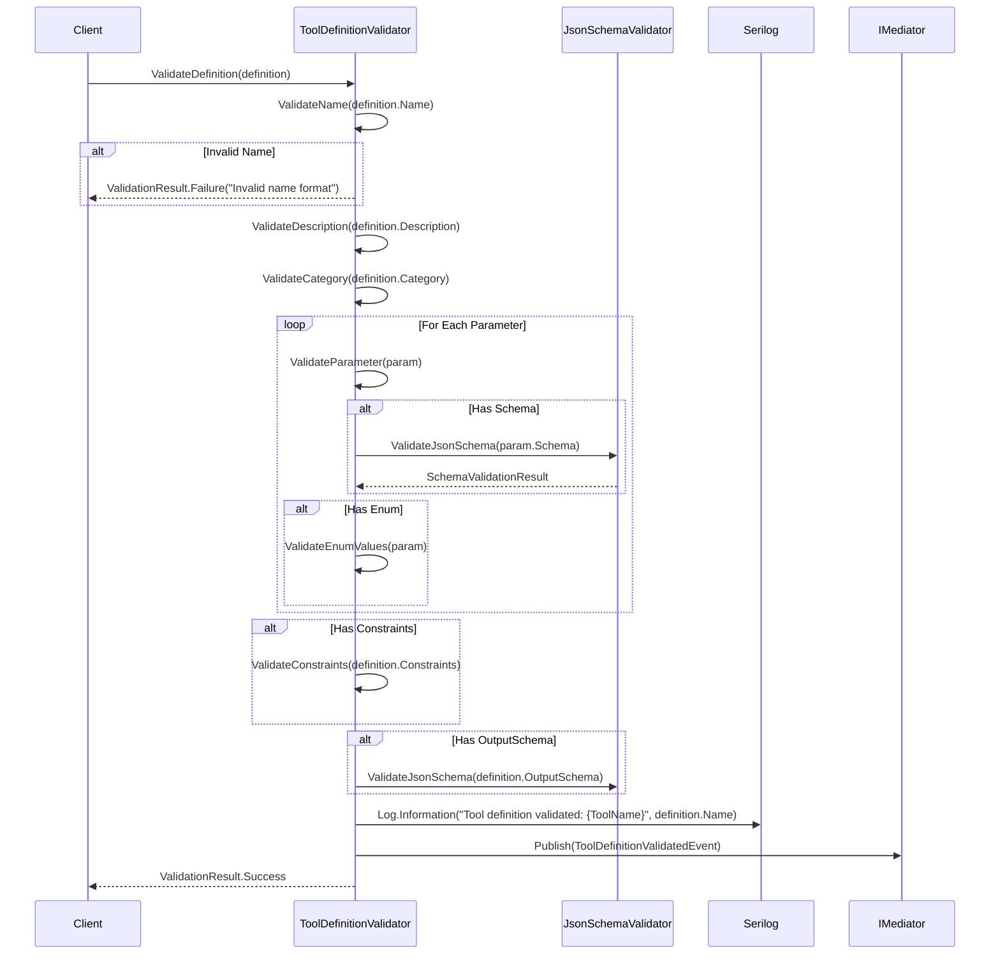

# LCS-SBD-v0.12.5a-DEF: Tool Definition Schema

## 1. Metadata & Categorization

| Field | Value |
| :--- | :--- |
| **Feature ID** | `TLS-DEF-01` |
| **Feature Name** | Tool Definition Schema |
| **Target Version** | v0.12.5a |
| **Module Scope** | `Lexichord.Modules.Agents.Abstractions`, `Lexichord.Modules.Agents.Core` |
| **Swimlane** | Agent Infrastructure |
| **License Tier** | Core |
| **Feature Gate Key** | `FeatureFlags.Agents.Tools.Definition` |
| **Author** | Agent Architecture Lead |
| **Reviewer** | Lead Architect |
| **Status** | Draft |
| **Last Updated** | 2026-02-04 |
| **Estimated Hours** | 8 |

---

## 2. Executive Summary

### 2.1 The Requirement

Agents require a standardized mechanism to define tools with complete metadata, typed parameters, constraints, and execution requirements. Tool definitions MUST be declarative, validatable, and portable across different execution contexts while supporting both built-in and custom tools.

### 2.2 The Proposed Solution

Implement a comprehensive Tool Definition Schema consisting of:

1. **`ITool` Interface:** The core contract for tool execution
2. **`ToolDefinition` Record:** Complete tool metadata including name, description, parameters, and constraints
3. **`ToolCategory` Enum:** Classification for tool organization and filtering
4. **`ToolParameter` Record:** Parameter definition with type, validation, and defaults
5. **`ToolParameterType` Enum:** Supported parameter types (String, Integer, Number, Boolean, Array, Object)
6. **`ToolConstraints` Record:** Execution limits including timeout, output size, and isolation level
7. **`SandboxIsolationLevel` Enum:** Security isolation levels (None, Standard, Strict, Restricted)

---

## 3. Architecture & Modular Strategy

### 3.1 Dependencies

**Upstream Modules:**

| Dependency | Version | Purpose |
|:-----------|:--------|:--------|
| `IAgentDefinition` | v0.12.1-AGT | Agent tool requirements definition |
| `ILicenseContext` | v0.9.2 | License-based tool availability |
| `IMediator` | v0.0.7a | Tool definition event publishing |

**NuGet Packages:**

- `System.Text.Json` — JSON serialization for tool schemas
- `FluentValidation` — Parameter and definition validation

### 3.2 Licensing Behavior

**Load Behavior:**

- [x] **Soft Gate:** The module loads, but custom tool definitions are limited by tier.

**Tier-Based Limits:**

| Tier | Built-In Definitions | Custom Definitions | JSON Schema Validation |
|:-----|:---------------------|:-------------------|:-----------------------|
| Core | 5 | 0 | Basic |
| WriterPro | 5 | 10 | Basic |
| Teams | 8 | 50 | Advanced |
| Enterprise | 8 | Unlimited | Full + Custom |

**Fallback Experience:**

> Custom tool definition creation shows lock icon for Core users. Clicking opens the "Upgrade to WriterPro" modal.

---

## 4. Data Contract (The API)

### 4.1 ITool Interface

```csharp
namespace Lexichord.Modules.Agents.Abstractions;

/// <summary>
/// Represents a tool that an agent can invoke. Tools encapsulate discrete capabilities
/// such as file operations, network requests, or knowledge graph queries.
/// </summary>
/// <remarks>
/// <para>
/// Tools are the fundamental building blocks of agent capabilities. Each tool
/// provides a well-defined operation with typed inputs and outputs. The tool
/// system ensures safe execution through sandboxing and permission checks.
/// </para>
/// <para>
/// Implementation requirements:
/// <list type="bullet">
/// <item><description>Tools MUST be stateless between executions</description></item>
/// <item><description>Tools MUST validate inputs before execution</description></item>
/// <item><description>Tools MUST respect cancellation tokens</description></item>
/// <item><description>Tools MUST NOT perform side effects outside sandbox scope</description></item>
/// </list>
/// </para>
/// </remarks>
public interface ITool
{
    /// <summary>
    /// Gets the complete tool definition including metadata, parameters, and constraints.
    /// </summary>
    /// <value>
    /// The <see cref="ToolDefinition"/> describing this tool's capabilities and requirements.
    /// </value>
    ToolDefinition Definition { get; }

    /// <summary>
    /// Executes the tool with the specified input and options.
    /// </summary>
    /// <param name="input">
    /// The tool input containing the tool name and parameter values.
    /// Parameters MUST conform to the parameter definitions in <see cref="Definition"/>.
    /// </param>
    /// <param name="options">
    /// Execution options including timeout, confirmation requirements, and execution context.
    /// </param>
    /// <param name="ct">
    /// Cancellation token to abort tool execution. Tools MUST monitor this token
    /// and abort gracefully when cancellation is requested.
    /// </param>
    /// <returns>
    /// A <see cref="ToolResult"/> containing the execution outcome, output data,
    /// and execution metadata including timing and resource usage.
    /// </returns>
    /// <exception cref="ArgumentNullException">
    /// Thrown when <paramref name="input"/> or <paramref name="options"/> is null.
    /// </exception>
    /// <exception cref="ToolParameterValidationException">
    /// Thrown when input parameters do not conform to the tool's parameter schema.
    /// </exception>
    /// <exception cref="ToolExecutionException">
    /// Thrown when tool execution fails due to internal errors.
    /// </exception>
    /// <exception cref="OperationCanceledException">
    /// Thrown when execution is cancelled via the cancellation token.
    /// </exception>
    Task<ToolResult> ExecuteAsync(
        ToolInput input,
        ToolExecutionOptions options,
        CancellationToken ct = default);
}
```

### 4.2 ToolDefinition Record

```csharp
namespace Lexichord.Modules.Agents.Abstractions;

/// <summary>
/// Complete definition of a tool including metadata, parameters, output schema,
/// and execution constraints.
/// </summary>
/// <remarks>
/// <para>
/// Tool definitions are immutable records that describe a tool's capabilities,
/// requirements, and constraints. They are used for:
/// <list type="bullet">
/// <item><description>Registration in the tool registry</description></item>
/// <item><description>Input validation before execution</description></item>
/// <item><description>Output schema validation after execution</description></item>
/// <item><description>Agent tool discovery and selection</description></item>
/// <item><description>UI presentation in the tool manager</description></item>
/// </list>
/// </para>
/// <para>
/// Tool definitions support JSON serialization for storage and transport.
/// Custom tools can be defined via JSON files or programmatically.
/// </para>
/// </remarks>
/// <example>
/// <code>
/// var definition = new ToolDefinition
/// {
///     Name = "read_file",
///     Description = "Read the contents of a file from the filesystem",
///     Category = ToolCategory.FileSystem,
///     Parameters = new[]
///     {
///         new ToolParameter
///         {
///             Name = "path",
///             Description = "The file path to read",
///             Type = ToolParameterType.String,
///             Required = true
///         },
///         new ToolParameter
///         {
///             Name = "encoding",
///             Description = "File encoding (default: utf-8)",
///             Type = ToolParameterType.String,
///             Required = false,
///             Default = "utf-8",
///             Enum = new object[] { "utf-8", "ascii", "utf-16" }
///         }
///     },
///     Constraints = new ToolConstraints
///     {
///         MaxExecutionTime = TimeSpan.FromSeconds(30),
///         MaxOutputSize = 10 * 1024 * 1024, // 10MB
///         AllowSideEffects = false,
///         RequiredIsolation = SandboxIsolationLevel.Standard
///     },
///     RequiredPermissions = new[] { "tool.filesystem.read" },
///     Version = "1.0.0"
/// };
/// </code>
/// </example>
public record ToolDefinition
{
    /// <summary>
    /// Gets the unique name of the tool. This name is used for invocation and must be
    /// unique within the tool registry.
    /// </summary>
    /// <value>
    /// A non-empty string containing the tool name. Names MUST use snake_case format
    /// and contain only lowercase letters, numbers, and underscores.
    /// </value>
    /// <example>"read_file", "search_knowledge", "web_fetch"</example>
    public required string Name { get; init; }

    /// <summary>
    /// Gets the human-readable description of the tool's purpose and behavior.
    /// </summary>
    /// <value>
    /// A descriptive string explaining what the tool does. This description is used
    /// for agent tool selection and UI display.
    /// </value>
    public required string Description { get; init; }

    /// <summary>
    /// Gets the category for tool organization and filtering.
    /// </summary>
    /// <value>
    /// A <see cref="ToolCategory"/> value indicating the tool's functional classification.
    /// </value>
    public ToolCategory Category { get; init; }

    /// <summary>
    /// Gets the list of parameter definitions for this tool.
    /// </summary>
    /// <value>
    /// An immutable list of <see cref="ToolParameter"/> objects describing the tool's inputs.
    /// Empty list indicates the tool accepts no parameters.
    /// </value>
    public IReadOnlyList<ToolParameter> Parameters { get; init; } = [];

    /// <summary>
    /// Gets the JSON Schema describing the tool's output structure.
    /// </summary>
    /// <value>
    /// A JSON Schema object (as a dictionary or JObject) defining the expected output format.
    /// Null indicates no output schema validation is performed.
    /// </value>
    /// <remarks>
    /// Output schemas enable result validation and provide type information for consumers.
    /// </remarks>
    public object? OutputSchema { get; init; }

    /// <summary>
    /// Gets the execution constraints for this tool.
    /// </summary>
    /// <value>
    /// A <see cref="ToolConstraints"/> record specifying limits on execution time, output size,
    /// and isolation requirements. Null uses system defaults.
    /// </value>
    public ToolConstraints? Constraints { get; init; }

    /// <summary>
    /// Gets the list of permissions required to execute this tool.
    /// </summary>
    /// <value>
    /// An immutable list of permission strings that the calling agent must have.
    /// Empty list indicates no special permissions required.
    /// </value>
    /// <example>["tool.filesystem.read", "tool.network.fetch"]</example>
    public IReadOnlyList<string> RequiredPermissions { get; init; } = [];

    /// <summary>
    /// Gets a value indicating whether this tool requires user confirmation before execution.
    /// </summary>
    /// <value>
    /// <c>true</c> if the tool performs sensitive operations requiring explicit user approval;
    /// otherwise, <c>false</c>.
    /// </value>
    /// <remarks>
    /// Tools that send messages, delete data, or make external API calls typically require confirmation.
    /// </remarks>
    public bool RequiresConfirmation { get; init; } = false;

    /// <summary>
    /// Gets the semantic version of this tool definition.
    /// </summary>
    /// <value>
    /// A semantic version string (e.g., "1.0.0") or null for unversioned tools.
    /// </value>
    public string? Version { get; init; }

    /// <summary>
    /// Gets additional metadata about the tool.
    /// </summary>
    /// <value>
    /// A dictionary of key-value pairs containing tool-specific metadata such as
    /// risk level, author, or custom categorization. Null if no metadata.
    /// </value>
    public IReadOnlyDictionary<string, object>? Metadata { get; init; }
}
```

### 4.3 ToolCategory Enum

```csharp
namespace Lexichord.Modules.Agents.Abstractions;

/// <summary>
/// Categorizes tools by their functional domain for organization, filtering, and security policies.
/// </summary>
/// <remarks>
/// <para>
/// Tool categories serve multiple purposes:
/// <list type="bullet">
/// <item><description>UI organization in the tool manager</description></item>
/// <item><description>Permission grouping for security policies</description></item>
/// <item><description>Discovery filtering for agent tool selection</description></item>
/// <item><description>Sandbox configuration based on risk profile</description></item>
/// </list>
/// </para>
/// </remarks>
public enum ToolCategory
{
    /// <summary>
    /// File system operations including read, write, list, and delete.
    /// Risk level: Medium. Requires filesystem permissions.
    /// </summary>
    /// <remarks>
    /// Examples: read_file, write_file, list_directory, delete_file
    /// </remarks>
    FileSystem = 0,

    /// <summary>
    /// Network operations including HTTP requests, DNS lookups, and socket operations.
    /// Risk level: Medium-High. Requires network permissions.
    /// </summary>
    /// <remarks>
    /// Examples: web_fetch, api_call, dns_lookup
    /// </remarks>
    Network = 1,

    /// <summary>
    /// Database operations including queries, updates, and schema operations.
    /// Risk level: Medium. Requires database permissions.
    /// </summary>
    /// <remarks>
    /// Examples: execute_ckvs_query, execute_sql, create_table
    /// </remarks>
    Database = 2,

    /// <summary>
    /// Code execution operations including script running and compilation.
    /// Risk level: High. Requires strict sandbox isolation.
    /// </summary>
    /// <remarks>
    /// Examples: execute_script, compile_code, run_tests
    /// </remarks>
    CodeExecution = 3,

    /// <summary>
    /// External API integrations including third-party services.
    /// Risk level: Medium. Requires API credentials.
    /// </summary>
    /// <remarks>
    /// Examples: call_openai, query_elasticsearch, send_slack
    /// </remarks>
    ExternalApi = 4,

    /// <summary>
    /// Knowledge graph and semantic search operations.
    /// Risk level: Low. Internal data access only.
    /// </summary>
    /// <remarks>
    /// Examples: search_knowledge, create_entity, link_concepts
    /// </remarks>
    Knowledge = 5,

    /// <summary>
    /// Communication operations including messaging and notifications.
    /// Risk level: Medium. May send external messages.
    /// </summary>
    /// <remarks>
    /// Examples: send_message, send_email, create_notification
    /// </remarks>
    Communication = 6,

    /// <summary>
    /// System-level operations including validation and content processing.
    /// Risk level: Low. Internal operations only.
    /// </summary>
    /// <remarks>
    /// Examples: validate_content, parse_json, transform_data
    /// </remarks>
    System = 7
}
```

### 4.4 ToolParameter Record

```csharp
namespace Lexichord.Modules.Agents.Abstractions;

/// <summary>
/// Defines a single parameter for a tool, including type, validation rules, and default value.
/// </summary>
/// <remarks>
/// <para>
/// Tool parameters are validated before execution. The validation process:
/// <list type="number">
/// <item><description>Check required parameters are present</description></item>
/// <item><description>Validate parameter types match definitions</description></item>
/// <item><description>Apply enum constraints if specified</description></item>
/// <item><description>Validate against JSON Schema if provided</description></item>
/// <item><description>Apply default values for missing optional parameters</description></item>
/// </list>
/// </para>
/// </remarks>
/// <example>
/// <code>
/// // Required string parameter
/// var pathParam = new ToolParameter
/// {
///     Name = "path",
///     Description = "The file path to read",
///     Type = ToolParameterType.String,
///     Required = true
/// };
///
/// // Optional enum parameter with default
/// var encodingParam = new ToolParameter
/// {
///     Name = "encoding",
///     Description = "File encoding",
///     Type = ToolParameterType.String,
///     Required = false,
///     Default = "utf-8",
///     Enum = new object[] { "utf-8", "ascii", "utf-16" }
/// };
///
/// // Complex object parameter with schema
/// var optionsParam = new ToolParameter
/// {
///     Name = "options",
///     Description = "Additional options",
///     Type = ToolParameterType.Object,
///     Schema = new Dictionary&lt;string, object&gt;
///     {
///         ["type"] = "object",
///         ["properties"] = new Dictionary&lt;string, object&gt;
///         {
///             ["recursive"] = new { type = "boolean" },
///             ["maxDepth"] = new { type = "integer", minimum = 1 }
///         }
///     }
/// };
/// </code>
/// </example>
public record ToolParameter
{
    /// <summary>
    /// Gets the name of the parameter as used in tool invocation.
    /// </summary>
    /// <value>
    /// A non-empty string containing the parameter name. Names MUST use snake_case
    /// format and be unique within the tool's parameter list.
    /// </value>
    public required string Name { get; init; }

    /// <summary>
    /// Gets the human-readable description of the parameter.
    /// </summary>
    /// <value>
    /// A descriptive string explaining the parameter's purpose and expected values.
    /// </value>
    public required string Description { get; init; }

    /// <summary>
    /// Gets the data type of the parameter.
    /// </summary>
    /// <value>
    /// A <see cref="ToolParameterType"/> indicating the expected value type.
    /// </value>
    public ToolParameterType Type { get; init; }

    /// <summary>
    /// Gets a value indicating whether this parameter is required.
    /// </summary>
    /// <value>
    /// <c>true</c> if the parameter must be provided; <c>false</c> if optional.
    /// </value>
    public bool Required { get; init; } = false;

    /// <summary>
    /// Gets the default value for optional parameters.
    /// </summary>
    /// <value>
    /// The default value to use when the parameter is not provided.
    /// Null indicates no default (parameter will be absent if not provided).
    /// </value>
    public object? Default { get; init; }

    /// <summary>
    /// Gets the list of allowed values for enum-constrained parameters.
    /// </summary>
    /// <value>
    /// A list of valid values for this parameter. Null indicates no enum constraint.
    /// Values MUST match the parameter's <see cref="Type"/>.
    /// </value>
    public IReadOnlyList<object>? Enum { get; init; }

    /// <summary>
    /// Gets the JSON Schema for complex parameter validation.
    /// </summary>
    /// <value>
    /// A JSON Schema object for validating <see cref="ToolParameterType.Array"/> or
    /// <see cref="ToolParameterType.Object"/> parameters. Null for simple types.
    /// </value>
    public object? Schema { get; init; }
}
```

### 4.5 ToolParameterType Enum

```csharp
namespace Lexichord.Modules.Agents.Abstractions;

/// <summary>
/// Supported data types for tool parameters, aligned with JSON Schema primitives.
/// </summary>
/// <remarks>
/// <para>
/// Parameter types map directly to JSON Schema types for serialization compatibility:
/// <list type="bullet">
/// <item><description>String → JSON string</description></item>
/// <item><description>Integer → JSON integer</description></item>
/// <item><description>Number → JSON number (floating-point)</description></item>
/// <item><description>Boolean → JSON boolean</description></item>
/// <item><description>Array → JSON array</description></item>
/// <item><description>Object → JSON object</description></item>
/// </list>
/// </para>
/// </remarks>
public enum ToolParameterType
{
    /// <summary>
    /// A string value. Maps to C# <see cref="string"/>.
    /// </summary>
    String = 0,

    /// <summary>
    /// An integer value. Maps to C# <see cref="long"/> for full range support.
    /// </summary>
    Integer = 1,

    /// <summary>
    /// A floating-point number. Maps to C# <see cref="double"/>.
    /// </summary>
    Number = 2,

    /// <summary>
    /// A boolean value. Maps to C# <see cref="bool"/>.
    /// </summary>
    Boolean = 3,

    /// <summary>
    /// An array of values. Maps to C# <see cref="IReadOnlyList{T}"/> of <see cref="object"/>.
    /// Array item schema defined in <see cref="ToolParameter.Schema"/>.
    /// </summary>
    Array = 4,

    /// <summary>
    /// A complex object. Maps to C# <see cref="IReadOnlyDictionary{TKey, TValue}"/>
    /// with string keys and object values. Object schema defined in <see cref="ToolParameter.Schema"/>.
    /// </summary>
    Object = 5
}
```

### 4.6 ToolConstraints Record

```csharp
namespace Lexichord.Modules.Agents.Abstractions;

/// <summary>
/// Defines execution constraints for a tool including timeout, output limits, and isolation requirements.
/// </summary>
/// <remarks>
/// <para>
/// Constraints are enforced by the tool executor during execution:
/// <list type="bullet">
/// <item><description>MaxExecutionTime: Execution aborted if exceeded</description></item>
/// <item><description>MaxOutputSize: Output truncated if exceeded</description></item>
/// <item><description>AllowSideEffects: Sandbox policy enforcement</description></item>
/// <item><description>RequiredIsolation: Minimum sandbox level</description></item>
/// </list>
/// </para>
/// <para>
/// Default values are applied when constraints are null:
/// <list type="bullet">
/// <item><description>MaxExecutionTime: 60 seconds</description></item>
/// <item><description>MaxOutputSize: 10MB</description></item>
/// <item><description>AllowSideEffects: true</description></item>
/// <item><description>RequiredIsolation: Standard</description></item>
/// </list>
/// </para>
/// </remarks>
public record ToolConstraints
{
    /// <summary>
    /// Gets the maximum allowed execution time for this tool.
    /// </summary>
    /// <value>
    /// A <see cref="TimeSpan"/> representing the maximum execution duration.
    /// Null indicates system default (60 seconds).
    /// </value>
    public TimeSpan? MaxExecutionTime { get; init; }

    /// <summary>
    /// Gets the maximum allowed output size in bytes.
    /// </summary>
    /// <value>
    /// The maximum output size in bytes. Outputs exceeding this limit are truncated.
    /// Null indicates system default (10MB).
    /// </value>
    public long? MaxOutputSize { get; init; }

    /// <summary>
    /// Gets a value indicating whether this tool is allowed to perform side effects.
    /// </summary>
    /// <value>
    /// <c>true</c> if the tool may modify external state (files, databases, network);
    /// <c>false</c> for read-only operations.
    /// </value>
    /// <remarks>
    /// Tools with AllowSideEffects = false can be executed more aggressively
    /// (e.g., parallel execution, caching).
    /// </remarks>
    public bool AllowSideEffects { get; init; } = true;

    /// <summary>
    /// Gets the minimum required sandbox isolation level for this tool.
    /// </summary>
    /// <value>
    /// A <see cref="SandboxIsolationLevel"/> indicating the minimum isolation required.
    /// </value>
    public SandboxIsolationLevel RequiredIsolation { get; init; } = SandboxIsolationLevel.Standard;
}
```

### 4.7 SandboxIsolationLevel Enum

```csharp
namespace Lexichord.Modules.Agents.Abstractions;

/// <summary>
/// Defines the security isolation level for tool execution within a sandbox.
/// </summary>
/// <remarks>
/// <para>
/// Isolation levels provide increasing security restrictions:
/// <list type="bullet">
/// <item><description>None: Direct execution in host process (trusted tools only)</description></item>
/// <item><description>Standard: Process isolation with resource limits</description></item>
/// <item><description>Strict: Process isolation + filesystem/network restrictions</description></item>
/// <item><description>Restricted: Maximum isolation with minimal capabilities</description></item>
/// </list>
/// </para>
/// <para>
/// Higher isolation levels incur performance overhead but provide stronger security guarantees.
/// The sandbox system will refuse to execute a tool if the requested isolation exceeds
/// the maximum level supported by the current license tier.
/// </para>
/// </remarks>
public enum SandboxIsolationLevel
{
    /// <summary>
    /// No sandbox isolation. Tool executes directly in the host process.
    /// Only for trusted built-in tools with no external code execution.
    /// </summary>
    /// <remarks>
    /// WARNING: Use only for simple, trusted operations like validation or formatting.
    /// </remarks>
    None = 0,

    /// <summary>
    /// Standard process-based isolation with resource limits.
    /// Provides memory and CPU limits but allows filesystem and network access.
    /// </summary>
    /// <remarks>
    /// Suitable for most tools including file operations and network requests.
    /// Default isolation level for custom tools.
    /// </remarks>
    Standard = 1,

    /// <summary>
    /// Strict isolation with filesystem and network whitelisting.
    /// Only explicitly allowed paths and hosts are accessible.
    /// </summary>
    /// <remarks>
    /// Required for tools that execute external code or scripts.
    /// Available for Teams tier and above.
    /// </remarks>
    Strict = 2,

    /// <summary>
    /// Maximum restriction with minimal capabilities.
    /// No filesystem access, no network access, limited memory.
    /// </summary>
    /// <remarks>
    /// For high-risk operations or untrusted tool code.
    /// Available for Enterprise tier only.
    /// </remarks>
    Restricted = 3
}
```

---

## 5. Implementation Logic

### 5.1 Flow Diagram (Mermaid)



### 5.2 Key Algorithmic Logic

**Name Validation:**
- Names MUST match regex: `^[a-z][a-z0-9_]*$`
- Names MUST NOT exceed 64 characters
- Names MUST NOT be reserved words: `execute`, `run`, `call`, `invoke`

**Parameter Validation:**
- Required parameters MUST NOT have defaults
- Enum values MUST match parameter type
- Array/Object parameters MUST have Schema if enum is not specified
- Default values MUST validate against schema

**Constraint Validation:**
- MaxExecutionTime MUST be between 1 second and 10 minutes
- MaxOutputSize MUST be between 1KB and 100MB
- RequiredIsolation MUST be supported by current license tier

---

## 6. Data Persistence (Database)

### 6.1 Migration

**Migration ID:** `Migration_20260204_001_CreateToolDefinitions`

**Module Schema:** `agent_tools`

```csharp
namespace Lexichord.Modules.Agents.Core.Migrations;

using FluentMigrator;

/// <summary>
/// Creates the tool_definitions table for storing custom tool definitions.
/// </summary>
[Migration(20260204001)]
public class Migration_20260204_001_CreateToolDefinitions : Migration
{
    /// <summary>
    /// Applies the migration to create the tool_definitions table.
    /// </summary>
    public override void Up()
    {
        Create.Schema("agent_tools");

        Create.Table("tool_definitions")
            .InSchema("agent_tools")
            .WithColumn("id").AsGuid().PrimaryKey().WithDefault(SystemMethods.NewGuid)
            .WithColumn("name").AsString(64).NotNullable().Unique()
            .WithColumn("description").AsString(1024).NotNullable()
            .WithColumn("category").AsInt32().NotNullable()
            .WithColumn("parameters_json").AsString(int.MaxValue).Nullable()
            .WithColumn("output_schema_json").AsString(int.MaxValue).Nullable()
            .WithColumn("constraints_json").AsString(4096).Nullable()
            .WithColumn("required_permissions_json").AsString(4096).Nullable()
            .WithColumn("requires_confirmation").AsBoolean().NotNullable().WithDefaultValue(false)
            .WithColumn("version").AsString(32).Nullable()
            .WithColumn("metadata_json").AsString(int.MaxValue).Nullable()
            .WithColumn("is_built_in").AsBoolean().NotNullable().WithDefaultValue(false)
            .WithColumn("license_tier").AsInt32().NotNullable().WithDefaultValue(0)
            .WithColumn("created_by").AsGuid().Nullable()
            .WithColumn("created_at").AsDateTimeOffset().NotNullable().WithDefault(SystemMethods.CurrentUTCDateTime)
            .WithColumn("updated_at").AsDateTimeOffset().NotNullable().WithDefault(SystemMethods.CurrentUTCDateTime);

        Create.Index("IX_tool_definitions_name")
            .OnTable("tool_definitions")
            .InSchema("agent_tools")
            .OnColumn("name").Ascending();

        Create.Index("IX_tool_definitions_category")
            .OnTable("tool_definitions")
            .InSchema("agent_tools")
            .OnColumn("category").Ascending();

        Create.Index("IX_tool_definitions_license_tier")
            .OnTable("tool_definitions")
            .InSchema("agent_tools")
            .OnColumn("license_tier").Ascending();
    }

    /// <summary>
    /// Reverts the migration by dropping the tool_definitions table.
    /// </summary>
    public override void Down()
    {
        Delete.Table("tool_definitions").InSchema("agent_tools");
        Delete.Schema("agent_tools");
    }
}
```

---

## 7. UI/UX Specifications

### 7.1 Visual Components

**Location:** Tool Manager > Tool Definitions > New Definition (accessible via v0.12.5f UI)

**Form Fields:**
- Text Input: Tool Name (with snake_case validation)
- Text Area: Description
- Dropdown: Category (ToolCategory enum)
- Dynamic List: Parameters (add/remove)
- JSON Editor: Output Schema (optional)
- Constraints Section: Timeout, Max Output, Isolation Level
- Checkbox: Requires Confirmation
- Text Input: Version

### 7.2 Accessibility (A11y)

- All form fields MUST have associated labels with `for` attribute
- Category dropdown MUST be keyboard navigable
- JSON editor MUST support screen readers with ARIA labels
- Parameter list MUST announce additions/removals

---

## 8. Observability & Logging

**Structured Log Messages:**

```csharp
// Definition validation
_logger.LogInformation(
    "[TLS-DEF] Tool definition validated. Name: {ToolName}, Category: {Category}, Parameters: {ParameterCount}",
    definition.Name,
    definition.Category,
    definition.Parameters.Count);

// Validation failure
_logger.LogWarning(
    "[TLS-DEF] Tool definition validation failed. Name: {ToolName}, Errors: {ValidationErrors}",
    definition.Name,
    string.Join(", ", validationResult.Errors));

// Custom definition created
_logger.LogInformation(
    "[TLS-DEF] Custom tool definition created. Id: {DefinitionId}, Name: {ToolName}, CreatedBy: {UserId}",
    definition.Id,
    definition.Name,
    userId);

// Definition constraint violation
_logger.LogWarning(
    "[TLS-DEF] Tool definition constraint violation. Name: {ToolName}, Constraint: {Constraint}, Value: {Value}, Max: {MaxValue}",
    definition.Name,
    constraintName,
    actualValue,
    maxValue);
```

**Metrics:**

| Metric | Type | Description |
|:-------|:-----|:------------|
| `tools.definitions.validation.duration` | Timer | Time to validate a definition |
| `tools.definitions.validation.failures` | Counter | Count of failed validations |
| `tools.definitions.created` | Counter | Custom definitions created |
| `tools.definitions.by_category` | Gauge | Definitions per category |

---

## 9. Security & Safety

**Validation Concerns:**

| Concern | Mitigation |
|:--------|:-----------|
| Malicious tool names | Regex validation, reserved word blocking |
| Oversized definitions | Max length validation on all fields |
| Schema injection | JSON Schema validation with safe parser |
| Permission escalation | Permissions validated against allowed set |
| Constraint bypass | Server-side enforcement of all constraints |

**Built-In Tool Protection:**

- Built-in tool definitions are marked with `is_built_in = true`
- Built-in definitions CANNOT be modified or deleted
- Attempting to register a tool with a built-in name fails

---

## 10. Acceptance Criteria (QA)

1. **[Functional]** Tool definition with all fields validates successfully
2. **[Functional]** Invalid tool name (uppercase, spaces) fails validation with clear error
3. **[Functional]** Parameter enum values validate against parameter type
4. **[Functional]** Constraints outside allowed ranges fail validation
5. **[Licensing]** Core tier cannot create custom definitions (returns license error)
6. **[Licensing]** WriterPro tier limited to 10 custom definitions
7. **[Edge Case]** Empty parameter list validates successfully
8. **[Edge Case]** Null constraints uses system defaults
9. **[Performance]** Definition validation completes in <5ms
10. **[Security]** Built-in tool definitions cannot be overwritten

---

## 11. MediatR Events

```csharp
namespace Lexichord.Modules.Agents.Core.Events;

/// <summary>
/// Published when a new custom tool definition is created.
/// </summary>
/// <param name="DefinitionId">The unique identifier of the created definition.</param>
/// <param name="ToolName">The name of the tool.</param>
/// <param name="Category">The tool category.</param>
/// <param name="CreatedBy">The user who created the definition.</param>
/// <param name="Timestamp">When the definition was created.</param>
public record ToolDefinitionCreatedEvent(
    Guid DefinitionId,
    string ToolName,
    ToolCategory Category,
    Guid? CreatedBy,
    DateTimeOffset Timestamp) : INotification;

/// <summary>
/// Published when a tool definition is updated.
/// </summary>
/// <param name="DefinitionId">The unique identifier of the updated definition.</param>
/// <param name="ToolName">The name of the tool.</param>
/// <param name="ChangedFields">List of fields that were modified.</param>
/// <param name="UpdatedBy">The user who updated the definition.</param>
/// <param name="Timestamp">When the definition was updated.</param>
public record ToolDefinitionUpdatedEvent(
    Guid DefinitionId,
    string ToolName,
    IReadOnlyList<string> ChangedFields,
    Guid? UpdatedBy,
    DateTimeOffset Timestamp) : INotification;

/// <summary>
/// Published when a custom tool definition is deleted.
/// </summary>
/// <param name="DefinitionId">The unique identifier of the deleted definition.</param>
/// <param name="ToolName">The name of the tool that was deleted.</param>
/// <param name="DeletedBy">The user who deleted the definition.</param>
/// <param name="Timestamp">When the definition was deleted.</param>
public record ToolDefinitionDeletedEvent(
    Guid DefinitionId,
    string ToolName,
    Guid? DeletedBy,
    DateTimeOffset Timestamp) : INotification;

/// <summary>
/// Published when a tool definition passes validation.
/// </summary>
/// <param name="ToolName">The name of the validated tool.</param>
/// <param name="Category">The tool category.</param>
/// <param name="ParameterCount">Number of parameters defined.</param>
/// <param name="ValidationDuration">Time taken to validate.</param>
/// <param name="Timestamp">When validation completed.</param>
public record ToolDefinitionValidatedEvent(
    string ToolName,
    ToolCategory Category,
    int ParameterCount,
    TimeSpan ValidationDuration,
    DateTimeOffset Timestamp) : INotification;
```

---

## 12. Unit Tests

```csharp
namespace Lexichord.Modules.Agents.Tests.Unit.ToolDefinition;

using FluentAssertions;
using Lexichord.Modules.Agents.Abstractions;
using Lexichord.Modules.Agents.Core.Validators;
using Xunit;

/// <summary>
/// Unit tests for ToolDefinitionValidator.
/// </summary>
public class ToolDefinitionValidatorTests
{
    private readonly ToolDefinitionValidator _validator = new();

    /// <summary>
    /// Verifies that a valid tool definition passes validation.
    /// </summary>
    [Fact]
    public void ValidDefinition_ShouldPassValidation()
    {
        // Arrange
        var definition = new ToolDefinition
        {
            Name = "read_file",
            Description = "Read the contents of a file",
            Category = ToolCategory.FileSystem,
            Parameters = new[]
            {
                new ToolParameter
                {
                    Name = "path",
                    Description = "The file path",
                    Type = ToolParameterType.String,
                    Required = true
                }
            }
        };

        // Act
        var result = _validator.Validate(definition);

        // Assert
        result.IsValid.Should().BeTrue();
    }

    /// <summary>
    /// Verifies that an invalid tool name fails validation.
    /// </summary>
    [Theory]
    [InlineData("ReadFile")]      // Uppercase not allowed
    [InlineData("read file")]     // Spaces not allowed
    [InlineData("read-file")]     // Hyphens not allowed
    [InlineData("123_tool")]      // Must start with letter
    [InlineData("")]              // Empty not allowed
    public void InvalidName_ShouldFailValidation(string invalidName)
    {
        // Arrange
        var definition = new ToolDefinition
        {
            Name = invalidName,
            Description = "Test tool",
            Category = ToolCategory.System
        };

        // Act
        var result = _validator.Validate(definition);

        // Assert
        result.IsValid.Should().BeFalse();
        result.Errors.Should().Contain(e => e.PropertyName == nameof(ToolDefinition.Name));
    }

    /// <summary>
    /// Verifies that required parameter with default value fails validation.
    /// </summary>
    [Fact]
    public void RequiredParameterWithDefault_ShouldFailValidation()
    {
        // Arrange
        var definition = new ToolDefinition
        {
            Name = "test_tool",
            Description = "Test tool",
            Category = ToolCategory.System,
            Parameters = new[]
            {
                new ToolParameter
                {
                    Name = "param",
                    Description = "Test param",
                    Type = ToolParameterType.String,
                    Required = true,
                    Default = "default_value" // Invalid: required + default
                }
            }
        };

        // Act
        var result = _validator.Validate(definition);

        // Assert
        result.IsValid.Should().BeFalse();
    }

    /// <summary>
    /// Verifies that constraints outside allowed range fail validation.
    /// </summary>
    [Theory]
    [InlineData(0)]    // Too short
    [InlineData(601)]  // Too long (> 10 minutes)
    public void InvalidExecutionTimeout_ShouldFailValidation(int seconds)
    {
        // Arrange
        var definition = new ToolDefinition
        {
            Name = "test_tool",
            Description = "Test tool",
            Category = ToolCategory.System,
            Constraints = new ToolConstraints
            {
                MaxExecutionTime = TimeSpan.FromSeconds(seconds)
            }
        };

        // Act
        var result = _validator.Validate(definition);

        // Assert
        result.IsValid.Should().BeFalse();
    }

    /// <summary>
    /// Verifies that null constraints defaults are applied correctly.
    /// </summary>
    [Fact]
    public void NullConstraints_ShouldUseDefaults()
    {
        // Arrange
        var definition = new ToolDefinition
        {
            Name = "test_tool",
            Description = "Test tool",
            Category = ToolCategory.System,
            Constraints = null
        };

        // Act
        var result = _validator.Validate(definition);

        // Assert
        result.IsValid.Should().BeTrue();
    }
}
```

---

## 13. Changelog

| Date | Version | Changes |
|:-----|:--------|:--------|
| 2026-02-04 | 1.0.0 | Initial specification |

---

**End of Specification**
