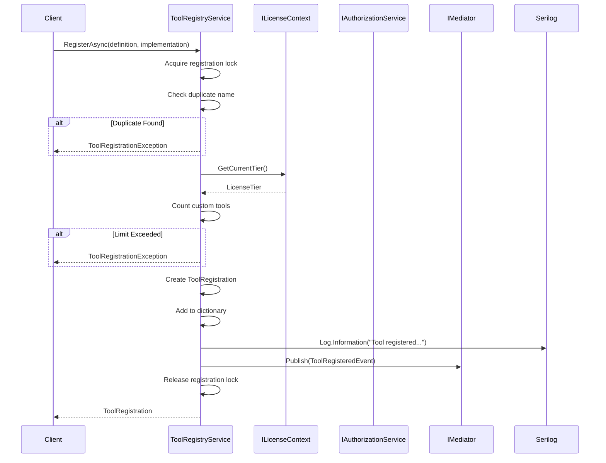
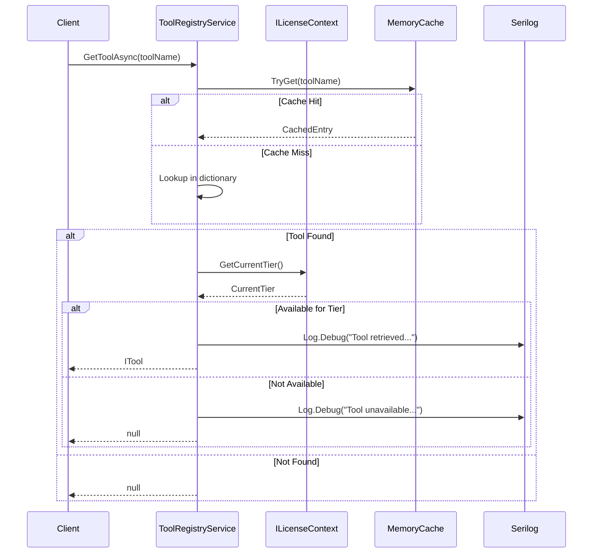

# LCS-SBD-v0.12.5b-REG: Tool Registry

## 1. Metadata & Categorization

| Field | Value |
| :--- | :--- |
| **Feature ID** | `TLS-REG-01` |
| **Feature Name** | Tool Registry |
| **Target Version** | v0.12.5b |
| **Module Scope** | `Lexichord.Modules.Agents.Core`, `Lexichord.Modules.Agents.Abstractions` |
| **Swimlane** | Agent Infrastructure |
| **License Tier** | Core |
| **Feature Gate Key** | `FeatureFlags.Agents.Tools.Registry` |
| **Author** | Agent Architecture Lead |
| **Reviewer** | Lead Architect |
| **Status** | Draft |
| **Last Updated** | 2026-02-04 |
| **Estimated Hours** | 8 |

---

## 2. Executive Summary

### 2.1 The Requirement

Agents require a centralized registry for discovering, registering, and managing available tools. The registry MUST provide fast lookup, category-based filtering, and license-aware tool availability. Both built-in tools and custom tool registrations MUST be supported.

### 2.2 The Proposed Solution

Implement a comprehensive Tool Registry consisting of:

1. **`IToolRegistry` Interface:** The core contract for tool registration, lookup, and discovery
2. **`ToolRegistration` Record:** Result of registering a tool with metadata
3. **`ToolRegistryService`:** In-memory registry with persistent backing for custom tools
4. **Category filtering and search:** Efficient tool discovery by category, name, or permissions
5. **License-gated availability:** Tools filtered by current license tier

---

## 3. Architecture & Modular Strategy

### 3.1 Dependencies

**Upstream Modules:**

| Dependency | Version | Purpose |
|:-----------|:--------|:--------|
| `ITool` | v0.12.5a | Tool interface and definitions |
| `ToolDefinition` | v0.12.5a | Tool metadata and parameters |
| `ToolCategory` | v0.12.5a | Category enumeration |
| `IAuthorizationService` | v0.11.1-SEC | Permission verification |
| `ILicenseContext` | v0.9.2 | License-based tool filtering |
| `IMediator` | v0.0.7a | Registration event publishing |

**NuGet Packages:**

- `System.Collections.Immutable` — Thread-safe collections
- `Microsoft.Extensions.Caching.Memory` — Tool lookup caching

### 3.2 Licensing Behavior

**Load Behavior:**

- [x] **Soft Gate:** The registry loads all tools but filters availability by license.

**Tier-Based Limits:**

| Tier | Built-In Tools | Custom Registrations | Discovery Filtering |
|:-----|:---------------|:---------------------|:--------------------|
| Core | 5 | 0 | Category only |
| WriterPro | 5 | 10 | Category + name |
| Teams | 8 | 50 | Full search |
| Enterprise | 8 | Unlimited | Full search + custom filters |

**Fallback Experience:**

> Tools unavailable for current tier are returned with `IsAvailable = false` and upgrade prompt. Attempting to get such tools returns `null` unless `IncludeUnavailable` is specified.

---

## 4. Data Contract (The API)

### 4.1 IToolRegistry Interface

```csharp
namespace Lexichord.Modules.Agents.Abstractions;

/// <summary>
/// Central registry for discovering and managing tools available to agents.
/// Provides registration, lookup, and discovery operations with license-aware filtering.
/// </summary>
/// <remarks>
/// <para>
/// The tool registry serves as the single source of truth for tool availability.
/// All tool access flows through this registry:
/// <list type="bullet">
/// <item><description>Built-in tools are registered at startup</description></item>
/// <item><description>Custom tools are registered via the API</description></item>
/// <item><description>Tool availability is filtered by license tier</description></item>
/// <item><description>Discovery operations support category and permission filtering</description></item>
/// </list>
/// </para>
/// <para>
/// Thread safety: All registry operations are thread-safe. The registry uses
/// immutable snapshots for enumeration operations.
/// </para>
/// </remarks>
public interface IToolRegistry
{
    /// <summary>
    /// Registers a new tool in the registry.
    /// </summary>
    /// <param name="definition">
    /// The tool definition containing metadata, parameters, and constraints.
    /// The definition MUST pass validation before registration succeeds.
    /// </param>
    /// <param name="implementation">
    /// The tool implementation that will handle execution requests.
    /// </param>
    /// <param name="ct">Cancellation token for the operation.</param>
    /// <returns>
    /// A <see cref="ToolRegistration"/> containing the registration result,
    /// including the assigned tool ID and registration timestamp.
    /// </returns>
    /// <exception cref="ArgumentNullException">
    /// Thrown when <paramref name="definition"/> or <paramref name="implementation"/> is null.
    /// </exception>
    /// <exception cref="ToolRegistrationException">
    /// Thrown when registration fails due to duplicate name, validation failure,
    /// or license limits exceeded.
    /// </exception>
    Task<ToolRegistration> RegisterAsync(
        ToolDefinition definition,
        ITool implementation,
        CancellationToken ct = default);

    /// <summary>
    /// Unregisters a tool from the registry by name.
    /// </summary>
    /// <param name="toolName">
    /// The unique name of the tool to unregister.
    /// </param>
    /// <param name="ct">Cancellation token for the operation.</param>
    /// <returns>
    /// <c>true</c> if the tool was unregistered; <c>false</c> if not found.
    /// </returns>
    /// <exception cref="InvalidOperationException">
    /// Thrown when attempting to unregister a built-in tool.
    /// </exception>
    Task<bool> UnregisterAsync(
        string toolName,
        CancellationToken ct = default);

    /// <summary>
    /// Gets a tool by its unique name.
    /// </summary>
    /// <param name="toolName">
    /// The unique name of the tool to retrieve.
    /// </param>
    /// <param name="ct">Cancellation token for the operation.</param>
    /// <returns>
    /// The <see cref="ITool"/> if found and available for the current license tier;
    /// <c>null</c> if not found or not available.
    /// </returns>
    Task<ITool?> GetToolAsync(
        string toolName,
        CancellationToken ct = default);

    /// <summary>
    /// Gets all tools available to the current user based on license tier and permissions.
    /// </summary>
    /// <param name="ct">Cancellation token for the operation.</param>
    /// <returns>
    /// An immutable list of <see cref="ITool"/> instances available to the current user.
    /// The list is filtered by license tier and agent permissions.
    /// </returns>
    Task<IReadOnlyList<ITool>> GetAvailableToolsAsync(
        CancellationToken ct = default);

    /// <summary>
    /// Finds tools in a specific category.
    /// </summary>
    /// <param name="category">
    /// The <see cref="ToolCategory"/> to filter by.
    /// </param>
    /// <param name="ct">Cancellation token for the operation.</param>
    /// <returns>
    /// An immutable list of <see cref="ITool"/> instances in the specified category.
    /// Results are filtered by license tier.
    /// </returns>
    Task<IReadOnlyList<ITool>> FindByCategoryAsync(
        ToolCategory category,
        CancellationToken ct = default);

    /// <summary>
    /// Searches for tools matching the specified criteria.
    /// </summary>
    /// <param name="query">
    /// The search query containing filter criteria.
    /// </param>
    /// <param name="ct">Cancellation token for the operation.</param>
    /// <returns>
    /// An immutable list of <see cref="ITool"/> instances matching the query.
    /// Results are filtered by license tier unless <see cref="ToolSearchQuery.IncludeUnavailable"/> is true.
    /// </returns>
    Task<IReadOnlyList<ITool>> SearchAsync(
        ToolSearchQuery query,
        CancellationToken ct = default);

    /// <summary>
    /// Gets the total count of registered tools.
    /// </summary>
    /// <param name="includeUnavailable">
    /// If <c>true</c>, includes tools not available for current license tier.
    /// </param>
    /// <param name="ct">Cancellation token for the operation.</param>
    /// <returns>The count of registered tools.</returns>
    Task<int> GetToolCountAsync(
        bool includeUnavailable = false,
        CancellationToken ct = default);

    /// <summary>
    /// Checks if a tool with the specified name exists.
    /// </summary>
    /// <param name="toolName">The tool name to check.</param>
    /// <param name="ct">Cancellation token for the operation.</param>
    /// <returns>
    /// <c>true</c> if a tool with the name exists; <c>false</c> otherwise.
    /// </returns>
    Task<bool> ExistsAsync(
        string toolName,
        CancellationToken ct = default);
}
```

### 4.2 ToolRegistration Record

```csharp
namespace Lexichord.Modules.Agents.Abstractions;

/// <summary>
/// Result of registering a tool in the registry.
/// </summary>
/// <remarks>
/// This record is returned after successful tool registration and contains
/// metadata about the registration including timing and version information.
/// </remarks>
public record ToolRegistration
{
    /// <summary>
    /// Gets the unique identifier assigned to the registration.
    /// </summary>
    public required Guid RegistrationId { get; init; }

    /// <summary>
    /// Gets the name of the registered tool.
    /// </summary>
    public required string ToolName { get; init; }

    /// <summary>
    /// Gets the tool definition that was registered.
    /// </summary>
    public required ToolDefinition Definition { get; init; }

    /// <summary>
    /// Gets a value indicating whether this is a built-in tool.
    /// </summary>
    public bool IsBuiltIn { get; init; } = false;

    /// <summary>
    /// Gets the minimum license tier required to use this tool.
    /// </summary>
    public LicenseTier RequiredTier { get; init; } = LicenseTier.Core;

    /// <summary>
    /// Gets the timestamp when the tool was registered.
    /// </summary>
    public DateTimeOffset RegisteredAt { get; init; }

    /// <summary>
    /// Gets the user who registered the tool, if applicable.
    /// </summary>
    public Guid? RegisteredBy { get; init; }

    /// <summary>
    /// Gets the version of the registration schema.
    /// </summary>
    public int SchemaVersion { get; init; } = 1;
}

/// <summary>
/// License tiers for tool availability.
/// </summary>
public enum LicenseTier
{
    /// <summary>Core/Free tier.</summary>
    Core = 0,
    /// <summary>Writer Pro tier.</summary>
    WriterPro = 1,
    /// <summary>Teams tier.</summary>
    Teams = 2,
    /// <summary>Enterprise tier.</summary>
    Enterprise = 3
}
```

### 4.3 ToolSearchQuery Record

```csharp
namespace Lexichord.Modules.Agents.Abstractions;

/// <summary>
/// Query parameters for searching tools in the registry.
/// </summary>
/// <remarks>
/// Supports multiple filter criteria that are combined with AND logic.
/// All filters are optional; omitted filters match all tools.
/// </remarks>
public record ToolSearchQuery
{
    /// <summary>
    /// Gets the text to search in tool names and descriptions.
    /// </summary>
    /// <value>
    /// A search string for partial matching. Null matches all tools.
    /// </value>
    public string? SearchText { get; init; }

    /// <summary>
    /// Gets the categories to filter by.
    /// </summary>
    /// <value>
    /// A list of categories to include. Null or empty includes all categories.
    /// </value>
    public IReadOnlyList<ToolCategory>? Categories { get; init; }

    /// <summary>
    /// Gets the required permissions filter.
    /// </summary>
    /// <value>
    /// Tools must require ALL specified permissions. Null includes all tools.
    /// </value>
    public IReadOnlyList<string>? RequiredPermissions { get; init; }

    /// <summary>
    /// Gets a value indicating whether to include tools not available for current license.
    /// </summary>
    /// <value>
    /// <c>true</c> to include unavailable tools; <c>false</c> to filter them out.
    /// </value>
    public bool IncludeUnavailable { get; init; } = false;

    /// <summary>
    /// Gets a value indicating whether to include only tools requiring confirmation.
    /// </summary>
    /// <value>
    /// <c>true</c> to filter for confirmation-required tools; <c>null</c> to include all.
    /// </value>
    public bool? RequiresConfirmation { get; init; }

    /// <summary>
    /// Gets the maximum number of results to return.
    /// </summary>
    /// <value>
    /// Maximum results. Default is 100. Maximum allowed is 1000.
    /// </value>
    public int MaxResults { get; init; } = 100;
}
```

### 4.4 ToolRegistryService Implementation

```csharp
namespace Lexichord.Modules.Agents.Core.Services;

/// <summary>
/// In-memory implementation of <see cref="IToolRegistry"/> with persistent backing
/// for custom tool definitions.
/// </summary>
/// <remarks>
/// <para>
/// The registry maintains an in-memory dictionary for fast lookups with
/// persistent storage via the CKVS for custom tools. Built-in tools are
/// registered at startup and cannot be modified.
/// </para>
/// <para>
/// Thread safety is ensured through <see cref="ConcurrentDictionary{TKey,TValue}"/>
/// and immutable snapshot enumeration.
/// </para>
/// </remarks>
public sealed class ToolRegistryService : IToolRegistry, IDisposable
{
    private readonly ConcurrentDictionary<string, RegistryEntry> _tools = new(StringComparer.OrdinalIgnoreCase);
    private readonly ILicenseContext _licenseContext;
    private readonly IAuthorizationService _authService;
    private readonly IMediator _mediator;
    private readonly ILogger<ToolRegistryService> _logger;
    private readonly SemaphoreSlim _registrationLock = new(1, 1);

    /// <summary>
    /// Initializes a new instance of the <see cref="ToolRegistryService"/> class.
    /// </summary>
    /// <param name="licenseContext">License context for tier checking.</param>
    /// <param name="authService">Authorization service for permission checking.</param>
    /// <param name="mediator">MediatR instance for event publishing.</param>
    /// <param name="logger">Logger for diagnostic output.</param>
    public ToolRegistryService(
        ILicenseContext licenseContext,
        IAuthorizationService authService,
        IMediator mediator,
        ILogger<ToolRegistryService> logger)
    {
        _licenseContext = licenseContext ?? throw new ArgumentNullException(nameof(licenseContext));
        _authService = authService ?? throw new ArgumentNullException(nameof(authService));
        _mediator = mediator ?? throw new ArgumentNullException(nameof(mediator));
        _logger = logger ?? throw new ArgumentNullException(nameof(logger));
    }

    /// <inheritdoc />
    public async Task<ToolRegistration> RegisterAsync(
        ToolDefinition definition,
        ITool implementation,
        CancellationToken ct = default)
    {
        ArgumentNullException.ThrowIfNull(definition);
        ArgumentNullException.ThrowIfNull(implementation);

        await _registrationLock.WaitAsync(ct).ConfigureAwait(false);
        try
        {
            // Check for duplicate name
            if (_tools.ContainsKey(definition.Name))
            {
                _logger.LogWarning(
                    "[TLS-REG] Registration failed: duplicate tool name. Name: {ToolName}",
                    definition.Name);
                throw new ToolRegistrationException($"Tool '{definition.Name}' is already registered.");
            }

            // Check license limits for custom tools
            var customToolCount = _tools.Values.Count(t => !t.Registration.IsBuiltIn);
            var maxCustomTools = GetMaxCustomToolsForTier(_licenseContext.CurrentTier);

            if (customToolCount >= maxCustomTools)
            {
                _logger.LogWarning(
                    "[TLS-REG] Registration failed: custom tool limit reached. Current: {Current}, Max: {Max}, Tier: {Tier}",
                    customToolCount,
                    maxCustomTools,
                    _licenseContext.CurrentTier);
                throw new ToolRegistrationException(
                    $"Custom tool limit ({maxCustomTools}) reached for {_licenseContext.CurrentTier} tier.");
            }

            var registration = new ToolRegistration
            {
                RegistrationId = Guid.NewGuid(),
                ToolName = definition.Name,
                Definition = definition,
                IsBuiltIn = false,
                RequiredTier = DetermineRequiredTier(definition),
                RegisteredAt = DateTimeOffset.UtcNow,
                RegisteredBy = _authService.CurrentUserId
            };

            var entry = new RegistryEntry(implementation, registration);
            _tools[definition.Name] = entry;

            _logger.LogInformation(
                "[TLS-REG] Tool registered successfully. Name: {ToolName}, Category: {Category}, RegistrationId: {RegistrationId}",
                definition.Name,
                definition.Category,
                registration.RegistrationId);

            await _mediator.Publish(new ToolRegisteredEvent(
                registration.RegistrationId,
                definition.Name,
                definition.Category,
                registration.RegisteredBy,
                DateTimeOffset.UtcNow), ct).ConfigureAwait(false);

            return registration;
        }
        finally
        {
            _registrationLock.Release();
        }
    }

    /// <inheritdoc />
    public async Task<bool> UnregisterAsync(string toolName, CancellationToken ct = default)
    {
        ArgumentException.ThrowIfNullOrWhiteSpace(toolName);

        if (_tools.TryGetValue(toolName, out var entry))
        {
            if (entry.Registration.IsBuiltIn)
            {
                _logger.LogWarning(
                    "[TLS-REG] Cannot unregister built-in tool. Name: {ToolName}",
                    toolName);
                throw new InvalidOperationException($"Cannot unregister built-in tool '{toolName}'.");
            }

            if (_tools.TryRemove(toolName, out _))
            {
                _logger.LogInformation(
                    "[TLS-REG] Tool unregistered. Name: {ToolName}, RegistrationId: {RegistrationId}",
                    toolName,
                    entry.Registration.RegistrationId);

                await _mediator.Publish(new ToolUnregisteredEvent(
                    entry.Registration.RegistrationId,
                    toolName,
                    _authService.CurrentUserId,
                    DateTimeOffset.UtcNow), ct).ConfigureAwait(false);

                return true;
            }
        }

        _logger.LogDebug(
            "[TLS-REG] Tool not found for unregistration. Name: {ToolName}",
            toolName);
        return false;
    }

    /// <inheritdoc />
    public Task<ITool?> GetToolAsync(string toolName, CancellationToken ct = default)
    {
        ArgumentException.ThrowIfNullOrWhiteSpace(toolName);

        if (_tools.TryGetValue(toolName, out var entry))
        {
            if (IsAvailableForCurrentTier(entry.Registration))
            {
                _logger.LogDebug(
                    "[TLS-REG] Tool retrieved. Name: {ToolName}",
                    toolName);
                return Task.FromResult<ITool?>(entry.Tool);
            }

            _logger.LogDebug(
                "[TLS-REG] Tool unavailable for current tier. Name: {ToolName}, RequiredTier: {RequiredTier}, CurrentTier: {CurrentTier}",
                toolName,
                entry.Registration.RequiredTier,
                _licenseContext.CurrentTier);
        }

        return Task.FromResult<ITool?>(null);
    }

    /// <inheritdoc />
    public Task<IReadOnlyList<ITool>> GetAvailableToolsAsync(CancellationToken ct = default)
    {
        var available = _tools.Values
            .Where(e => IsAvailableForCurrentTier(e.Registration))
            .Select(e => e.Tool)
            .ToList();

        _logger.LogDebug(
            "[TLS-REG] Retrieved available tools. Count: {Count}, Tier: {Tier}",
            available.Count,
            _licenseContext.CurrentTier);

        return Task.FromResult<IReadOnlyList<ITool>>(available);
    }

    /// <inheritdoc />
    public Task<IReadOnlyList<ITool>> FindByCategoryAsync(ToolCategory category, CancellationToken ct = default)
    {
        var matching = _tools.Values
            .Where(e => e.Tool.Definition.Category == category)
            .Where(e => IsAvailableForCurrentTier(e.Registration))
            .Select(e => e.Tool)
            .ToList();

        _logger.LogDebug(
            "[TLS-REG] Found tools by category. Category: {Category}, Count: {Count}",
            category,
            matching.Count);

        return Task.FromResult<IReadOnlyList<ITool>>(matching);
    }

    /// <inheritdoc />
    public Task<IReadOnlyList<ITool>> SearchAsync(ToolSearchQuery query, CancellationToken ct = default)
    {
        ArgumentNullException.ThrowIfNull(query);

        var results = _tools.Values.AsEnumerable();

        // Apply filters
        if (!string.IsNullOrWhiteSpace(query.SearchText))
        {
            var searchLower = query.SearchText.ToLowerInvariant();
            results = results.Where(e =>
                e.Tool.Definition.Name.Contains(searchLower, StringComparison.OrdinalIgnoreCase) ||
                e.Tool.Definition.Description.Contains(searchLower, StringComparison.OrdinalIgnoreCase));
        }

        if (query.Categories?.Count > 0)
        {
            results = results.Where(e => query.Categories.Contains(e.Tool.Definition.Category));
        }

        if (query.RequiredPermissions?.Count > 0)
        {
            results = results.Where(e =>
                query.RequiredPermissions.All(p => e.Tool.Definition.RequiredPermissions.Contains(p)));
        }

        if (query.RequiresConfirmation.HasValue)
        {
            results = results.Where(e => e.Tool.Definition.RequiresConfirmation == query.RequiresConfirmation.Value);
        }

        if (!query.IncludeUnavailable)
        {
            results = results.Where(e => IsAvailableForCurrentTier(e.Registration));
        }

        var finalResults = results
            .Take(Math.Min(query.MaxResults, 1000))
            .Select(e => e.Tool)
            .ToList();

        _logger.LogDebug(
            "[TLS-REG] Search completed. Query: {SearchText}, Results: {Count}",
            query.SearchText ?? "(all)",
            finalResults.Count);

        return Task.FromResult<IReadOnlyList<ITool>>(finalResults);
    }

    /// <inheritdoc />
    public Task<int> GetToolCountAsync(bool includeUnavailable = false, CancellationToken ct = default)
    {
        var count = includeUnavailable
            ? _tools.Count
            : _tools.Values.Count(e => IsAvailableForCurrentTier(e.Registration));

        return Task.FromResult(count);
    }

    /// <inheritdoc />
    public Task<bool> ExistsAsync(string toolName, CancellationToken ct = default)
    {
        return Task.FromResult(_tools.ContainsKey(toolName));
    }

    /// <summary>
    /// Registers a built-in tool. Called during startup only.
    /// </summary>
    internal void RegisterBuiltIn(ToolDefinition definition, ITool implementation, LicenseTier requiredTier)
    {
        var registration = new ToolRegistration
        {
            RegistrationId = Guid.NewGuid(),
            ToolName = definition.Name,
            Definition = definition,
            IsBuiltIn = true,
            RequiredTier = requiredTier,
            RegisteredAt = DateTimeOffset.UtcNow
        };

        _tools[definition.Name] = new RegistryEntry(implementation, registration);

        _logger.LogInformation(
            "[TLS-REG] Built-in tool registered. Name: {ToolName}, Category: {Category}, RequiredTier: {RequiredTier}",
            definition.Name,
            definition.Category,
            requiredTier);
    }

    private bool IsAvailableForCurrentTier(ToolRegistration registration)
    {
        return (int)_licenseContext.CurrentTier >= (int)registration.RequiredTier;
    }

    private static int GetMaxCustomToolsForTier(LicenseTier tier) => tier switch
    {
        LicenseTier.Core => 0,
        LicenseTier.WriterPro => 10,
        LicenseTier.Teams => 50,
        LicenseTier.Enterprise => int.MaxValue,
        _ => 0
    };

    private static LicenseTier DetermineRequiredTier(ToolDefinition definition)
    {
        // Custom tools start at WriterPro
        return LicenseTier.WriterPro;
    }

    /// <inheritdoc />
    public void Dispose()
    {
        _registrationLock.Dispose();
    }

    private sealed record RegistryEntry(ITool Tool, ToolRegistration Registration);
}
```

---

## 5. Implementation Logic

### 5.1 Flow Diagram (Mermaid)



### 5.2 Tool Lookup Flow



### 5.3 Key Algorithmic Logic

**Registration Process:**
1. Acquire registration lock (prevents race conditions)
2. Validate tool name uniqueness (case-insensitive)
3. Check license tier custom tool limits
4. Create registration record with metadata
5. Add to concurrent dictionary
6. Publish `ToolRegisteredEvent`
7. Release lock and return registration

**Search Algorithm:**
1. Start with full tool enumeration
2. Apply filters in order: text search → categories → permissions → confirmation
3. Apply license tier filtering (unless `IncludeUnavailable`)
4. Limit results to `MaxResults`
5. Return immutable list snapshot

---

## 6. Data Persistence (Database)

### 6.1 Migration

**Migration ID:** `Migration_20260204_002_CreateToolRegistrations`

```csharp
namespace Lexichord.Modules.Agents.Core.Migrations;

using FluentMigrator;

/// <summary>
/// Creates the tool_registrations table for tracking tool registrations.
/// </summary>
[Migration(20260204002)]
public class Migration_20260204_002_CreateToolRegistrations : Migration
{
    /// <summary>
    /// Applies the migration to create the tool_registrations table.
    /// </summary>
    public override void Up()
    {
        Create.Table("tool_registrations")
            .InSchema("agent_tools")
            .WithColumn("id").AsGuid().PrimaryKey().WithDefault(SystemMethods.NewGuid)
            .WithColumn("tool_name").AsString(64).NotNullable()
            .WithColumn("definition_id").AsGuid().NotNullable()
            .WithColumn("is_built_in").AsBoolean().NotNullable().WithDefaultValue(false)
            .WithColumn("required_tier").AsInt32().NotNullable().WithDefaultValue(0)
            .WithColumn("registered_by").AsGuid().Nullable()
            .WithColumn("registered_at").AsDateTimeOffset().NotNullable().WithDefault(SystemMethods.CurrentUTCDateTime)
            .WithColumn("unregistered_at").AsDateTimeOffset().Nullable()
            .WithColumn("schema_version").AsInt32().NotNullable().WithDefaultValue(1);

        Create.ForeignKey("FK_tool_registrations_definitions")
            .FromTable("tool_registrations").InSchema("agent_tools").ForeignColumn("definition_id")
            .ToTable("tool_definitions").InSchema("agent_tools").PrimaryColumn("id");

        Create.Index("IX_tool_registrations_tool_name")
            .OnTable("tool_registrations")
            .InSchema("agent_tools")
            .OnColumn("tool_name").Ascending()
            .WithOptions().Unique();

        Create.Index("IX_tool_registrations_required_tier")
            .OnTable("tool_registrations")
            .InSchema("agent_tools")
            .OnColumn("required_tier").Ascending();

        Create.Index("IX_tool_registrations_is_built_in")
            .OnTable("tool_registrations")
            .InSchema("agent_tools")
            .OnColumn("is_built_in").Ascending();
    }

    /// <summary>
    /// Reverts the migration by dropping the tool_registrations table.
    /// </summary>
    public override void Down()
    {
        Delete.ForeignKey("FK_tool_registrations_definitions").OnTable("tool_registrations").InSchema("agent_tools");
        Delete.Table("tool_registrations").InSchema("agent_tools");
    }
}
```

---

## 7. UI/UX Specifications

### 7.1 Visual Components

**Location:** Tool Manager > Registry (via v0.12.5f UI)

**Views:**
- **Tool List:** Grid showing all registered tools with name, category, tier, status
- **Search Bar:** Text search with category filter dropdown
- **Tool Details:** Slide-out panel with full definition details
- **Registration Form:** Modal for custom tool registration (WriterPro+)

### 7.2 Accessibility (A11y)

- Tool list MUST be navigable via keyboard (arrow keys)
- Search results MUST announce count to screen readers
- Tier badges MUST have accessible text alternatives

---

## 8. Observability & Logging

**Structured Log Messages:**

```csharp
// Registration success
_logger.LogInformation(
    "[TLS-REG] Tool registered successfully. Name: {ToolName}, Category: {Category}, RegistrationId: {RegistrationId}",
    definition.Name,
    definition.Category,
    registration.RegistrationId);

// Registration failure - duplicate
_logger.LogWarning(
    "[TLS-REG] Registration failed: duplicate tool name. Name: {ToolName}",
    definition.Name);

// Registration failure - limit
_logger.LogWarning(
    "[TLS-REG] Registration failed: custom tool limit reached. Current: {Current}, Max: {Max}, Tier: {Tier}",
    customToolCount,
    maxCustomTools,
    _licenseContext.CurrentTier);

// Tool lookup
_logger.LogDebug(
    "[TLS-REG] Tool retrieved. Name: {ToolName}",
    toolName);

// Tool unavailable
_logger.LogDebug(
    "[TLS-REG] Tool unavailable for current tier. Name: {ToolName}, RequiredTier: {RequiredTier}, CurrentTier: {CurrentTier}",
    toolName,
    entry.Registration.RequiredTier,
    _licenseContext.CurrentTier);

// Search completed
_logger.LogDebug(
    "[TLS-REG] Search completed. Query: {SearchText}, Results: {Count}",
    query.SearchText ?? "(all)",
    finalResults.Count);

// Unregistration
_logger.LogInformation(
    "[TLS-REG] Tool unregistered. Name: {ToolName}, RegistrationId: {RegistrationId}",
    toolName,
    entry.Registration.RegistrationId);
```

**Metrics:**

| Metric | Type | Description |
|:-------|:-----|:------------|
| `tools.registry.registrations.total` | Counter | Total registrations |
| `tools.registry.registrations.failures` | Counter | Failed registrations |
| `tools.registry.lookups` | Counter | Tool lookups |
| `tools.registry.lookups.misses` | Counter | Lookup misses |
| `tools.registry.searches` | Counter | Search operations |
| `tools.registry.tools.by_category` | Gauge | Tools per category |
| `tools.registry.tools.by_tier` | Gauge | Tools per tier |

---

## 9. Security & Safety

| Concern | Mitigation |
|:--------|:-----------|
| Race conditions on registration | SemaphoreSlim lock during registration |
| Built-in tool tampering | `IsBuiltIn` flag prevents modification/deletion |
| License tier bypass | Server-side tier validation on every lookup |
| Enumeration attacks | Rate limiting on search operations |
| Injection via tool name | Name validation with strict regex |

---

## 10. Acceptance Criteria (QA)

1. **[Functional]** Tool registration succeeds with valid definition
2. **[Functional]** Duplicate tool name registration fails with clear error
3. **[Functional]** Tool lookup returns tool for matching name
4. **[Functional]** Tool lookup returns null for non-existent name
5. **[Functional]** Category filter returns only tools in category
6. **[Functional]** Search filters combine correctly (AND logic)
7. **[Licensing]** Core tier cannot register custom tools
8. **[Licensing]** WriterPro tier limited to 10 custom tools
9. **[Licensing]** Tools unavailable for tier return null on lookup
10. **[Security]** Built-in tools cannot be unregistered
11. **[Performance]** Tool lookup completes in <5ms
12. **[Performance]** Registry search completes in <20ms for 1000 tools

---

## 11. MediatR Events

```csharp
namespace Lexichord.Modules.Agents.Core.Events;

/// <summary>
/// Published when a tool is successfully registered.
/// </summary>
public record ToolRegisteredEvent(
    Guid RegistrationId,
    string ToolName,
    ToolCategory Category,
    Guid? RegisteredBy,
    DateTimeOffset Timestamp) : INotification;

/// <summary>
/// Published when a tool is unregistered.
/// </summary>
public record ToolUnregisteredEvent(
    Guid RegistrationId,
    string ToolName,
    Guid? UnregisteredBy,
    DateTimeOffset Timestamp) : INotification;

/// <summary>
/// Published when a tool discovery/search operation completes.
/// </summary>
public record ToolDiscoveryCompletedEvent(
    string? SearchText,
    IReadOnlyList<ToolCategory>? Categories,
    int ResultCount,
    TimeSpan Duration,
    DateTimeOffset Timestamp) : INotification;
```

---

## 12. Unit Tests

```csharp
namespace Lexichord.Modules.Agents.Tests.Unit.Registry;

using FluentAssertions;
using Lexichord.Modules.Agents.Abstractions;
using Lexichord.Modules.Agents.Core.Services;
using Microsoft.Extensions.Logging.Abstractions;
using Moq;
using Xunit;

/// <summary>
/// Unit tests for ToolRegistryService.
/// </summary>
public class ToolRegistryServiceTests
{
    private readonly Mock<ILicenseContext> _licenseContextMock = new();
    private readonly Mock<IAuthorizationService> _authServiceMock = new();
    private readonly Mock<IMediator> _mediatorMock = new();
    private readonly ToolRegistryService _registry;

    public ToolRegistryServiceTests()
    {
        _licenseContextMock.Setup(l => l.CurrentTier).Returns(LicenseTier.Teams);
        _registry = new ToolRegistryService(
            _licenseContextMock.Object,
            _authServiceMock.Object,
            _mediatorMock.Object,
            NullLogger<ToolRegistryService>.Instance);
    }

    /// <summary>
    /// Verifies that tool registration succeeds with valid inputs.
    /// </summary>
    [Fact]
    public async Task RegisterAsync_ValidTool_ReturnsRegistration()
    {
        // Arrange
        var definition = CreateTestDefinition("test_tool");
        var tool = CreateMockTool(definition);

        // Act
        var registration = await _registry.RegisterAsync(definition, tool);

        // Assert
        registration.Should().NotBeNull();
        registration.ToolName.Should().Be("test_tool");
        registration.RegistrationId.Should().NotBeEmpty();
    }

    /// <summary>
    /// Verifies that duplicate registration fails.
    /// </summary>
    [Fact]
    public async Task RegisterAsync_DuplicateName_ThrowsException()
    {
        // Arrange
        var definition = CreateTestDefinition("duplicate_tool");
        var tool = CreateMockTool(definition);
        await _registry.RegisterAsync(definition, tool);

        // Act
        var act = () => _registry.RegisterAsync(definition, tool);

        // Assert
        await act.Should().ThrowAsync<ToolRegistrationException>()
            .WithMessage("*already registered*");
    }

    /// <summary>
    /// Verifies that tool lookup returns registered tool.
    /// </summary>
    [Fact]
    public async Task GetToolAsync_ExistingTool_ReturnsTool()
    {
        // Arrange
        var definition = CreateTestDefinition("lookup_tool");
        var tool = CreateMockTool(definition);
        await _registry.RegisterAsync(definition, tool);

        // Act
        var result = await _registry.GetToolAsync("lookup_tool");

        // Assert
        result.Should().NotBeNull();
        result!.Definition.Name.Should().Be("lookup_tool");
    }

    /// <summary>
    /// Verifies that lookup returns null for non-existent tool.
    /// </summary>
    [Fact]
    public async Task GetToolAsync_NonExistentTool_ReturnsNull()
    {
        // Act
        var result = await _registry.GetToolAsync("nonexistent");

        // Assert
        result.Should().BeNull();
    }

    /// <summary>
    /// Verifies that category filter works correctly.
    /// </summary>
    [Fact]
    public async Task FindByCategoryAsync_ReturnsMatchingTools()
    {
        // Arrange
        var fsDef = CreateTestDefinition("fs_tool", ToolCategory.FileSystem);
        var netDef = CreateTestDefinition("net_tool", ToolCategory.Network);
        await _registry.RegisterAsync(fsDef, CreateMockTool(fsDef));
        await _registry.RegisterAsync(netDef, CreateMockTool(netDef));

        // Act
        var results = await _registry.FindByCategoryAsync(ToolCategory.FileSystem);

        // Assert
        results.Should().HaveCount(1);
        results[0].Definition.Category.Should().Be(ToolCategory.FileSystem);
    }

    /// <summary>
    /// Verifies license tier filtering on lookup.
    /// </summary>
    [Fact]
    public async Task GetToolAsync_UnavailableForTier_ReturnsNull()
    {
        // Arrange
        _licenseContextMock.Setup(l => l.CurrentTier).Returns(LicenseTier.Core);
        var definition = CreateTestDefinition("pro_tool");
        var tool = CreateMockTool(definition);

        // Register with Teams tier
        _licenseContextMock.Setup(l => l.CurrentTier).Returns(LicenseTier.Teams);
        await _registry.RegisterAsync(definition, tool);

        // Switch to Core tier for lookup
        _licenseContextMock.Setup(l => l.CurrentTier).Returns(LicenseTier.Core);

        // Act
        var result = await _registry.GetToolAsync("pro_tool");

        // Assert
        result.Should().BeNull(); // WriterPro tier required
    }

    private static ToolDefinition CreateTestDefinition(string name, ToolCategory category = ToolCategory.System)
    {
        return new ToolDefinition
        {
            Name = name,
            Description = $"Test tool {name}",
            Category = category
        };
    }

    private static ITool CreateMockTool(ToolDefinition definition)
    {
        var mock = new Mock<ITool>();
        mock.Setup(t => t.Definition).Returns(definition);
        return mock.Object;
    }
}
```

---

## 13. Changelog

| Date | Version | Changes |
|:-----|:--------|:--------|
| 2026-02-04 | 1.0.0 | Initial specification |

---

**End of Specification**
