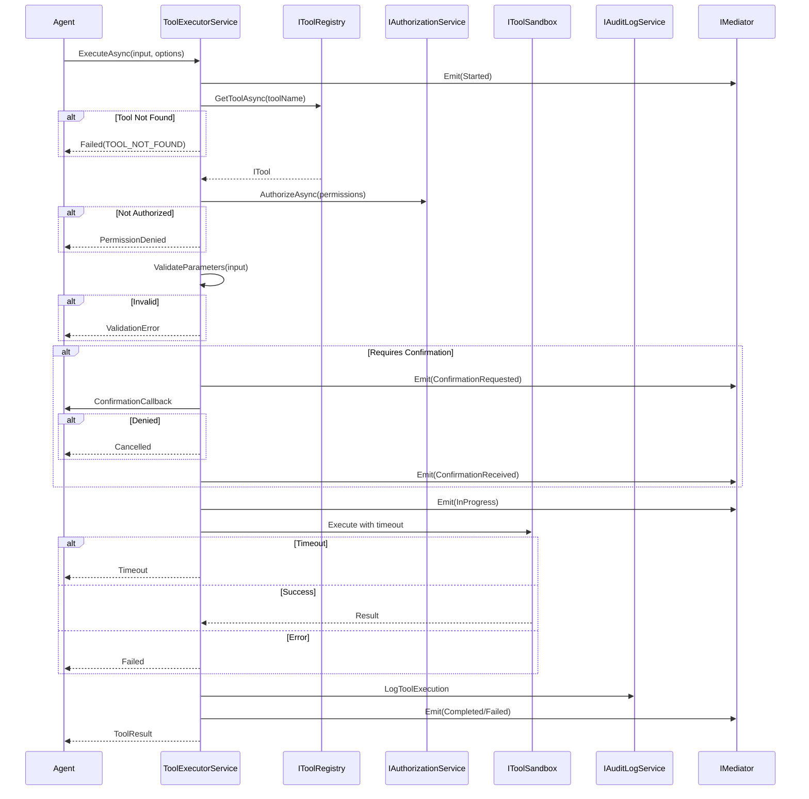

# LCS-SBD-v0.12.5c-EXE: Tool Executor

## 1. Metadata & Categorization

| Field | Value |
| :--- | :--- |
| **Feature ID** | `TLS-EXE-01` |
| **Feature Name** | Tool Executor |
| **Target Version** | v0.12.5c |
| **Module Scope** | `Lexichord.Modules.Agents.Core`, `Lexichord.Modules.Agents.Abstractions` |
| **Swimlane** | Agent Infrastructure |
| **License Tier** | Core |
| **Feature Gate Key** | `FeatureFlags.Agents.Tools.Executor` |
| **Author** | Agent Architecture Lead |
| **Reviewer** | Lead Architect |
| **Status** | Draft |
| **Last Updated** | 2026-02-04 |
| **Estimated Hours** | 12 |

---

## 2. Executive Summary

### 2.1 The Requirement

Agents require a robust execution layer that orchestrates tool invocation with proper authorization, parameter validation, timeout handling, error recovery, and comprehensive audit logging. The executor MUST support both single and batch execution with progress observation.

### 2.2 The Proposed Solution

Implement a comprehensive Tool Executor consisting of:

1. **`IToolExecutor` Interface:** Core execution contract with single and batch modes
2. **`ToolInput` Record:** Tool invocation request with name and parameters
3. **`ToolExecutionOptions` Record:** Execution configuration (timeout, confirmation, context)
4. **`ToolExecutionEvent` Record:** Progress and status events during execution
5. **`ToolExecutionEventType` Enum:** Event types (Started, InProgress, Completed, Failed, Timeout)
6. **`ToolExecutorService`:** Implementation orchestrating the full execution flow

---

## 3. Architecture & Modular Strategy

### 3.1 Dependencies

**Upstream Modules:**

| Dependency | Version | Purpose |
|:-----------|:--------|:--------|
| `ITool` | v0.12.5a | Tool execution interface |
| `ToolDefinition` | v0.12.5a | Parameter validation |
| `ToolConstraints` | v0.12.5a | Timeout and limit enforcement |
| `IToolRegistry` | v0.12.5b | Tool lookup |
| `IToolSandbox` | v0.12.5d | Sandboxed execution |
| `IAuthorizationService` | v0.11.1-SEC | Permission verification |
| `IAuditLogService` | v0.11.2-SEC | Execution audit logging |
| `ILicenseContext` | v0.9.2 | License validation |
| `IMediator` | v0.0.7a | Event publishing |

**NuGet Packages:**

- `System.Threading.Channels` — Async event streaming
- `Polly` — Retry and timeout policies

### 3.2 Licensing Behavior

**Load Behavior:**

- [x] **Soft Gate:** Executor loads but enforces license-based tool availability.

**Tier-Based Features:**

| Tier | Single Execution | Batch Execution | Parallel Execution | Progress Events |
|:-----|:-----------------|:----------------|:-------------------|:----------------|
| Core | ✓ | Sequential (5 max) | - | Basic |
| WriterPro | ✓ | Sequential (20 max) | - | Basic |
| Teams | ✓ | Sequential + Parallel (50 max) | ✓ (10 concurrent) | Full |
| Enterprise | ✓ | Unlimited | ✓ (Unlimited) | Full |

**Fallback Experience:**

> Batch execution exceeding tier limits returns error. Parallel execution on lower tiers falls back to sequential.

---

## 4. Data Contract (The API)

### 4.1 IToolExecutor Interface

```csharp
namespace Lexichord.Modules.Agents.Abstractions;

/// <summary>
/// Orchestrates tool execution with authorization, validation, sandboxing, and audit logging.
/// </summary>
/// <remarks>
/// <para>
/// The tool executor is the central entry point for all tool invocations. It coordinates:
/// <list type="bullet">
/// <item><description>Tool lookup from registry</description></item>
/// <item><description>Authorization and permission verification</description></item>
/// <item><description>Input parameter validation</description></item>
/// <item><description>Sandboxed execution with resource limits</description></item>
/// <item><description>Timeout enforcement</description></item>
/// <item><description>Result capture and audit logging</description></item>
/// </list>
/// </para>
/// <para>
/// Execution flow:
/// <code>
/// 1. Lookup tool in registry
/// 2. Verify authorization (permissions + license)
/// 3. Validate input parameters against schema
/// 4. Check confirmation requirements
/// 5. Execute in sandbox with timeout
/// 6. Capture result and metrics
/// 7. Log to audit trail
/// 8. Return result
/// </code>
/// </para>
/// </remarks>
public interface IToolExecutor
{
    /// <summary>
    /// Executes a single tool with the specified input and options.
    /// </summary>
    /// <param name="input">
    /// The tool input containing the tool name and parameter values.
    /// </param>
    /// <param name="options">
    /// Execution options including timeout, confirmation, and execution context.
    /// </param>
    /// <param name="ct">
    /// Cancellation token to abort execution. Cancellation triggers graceful shutdown
    /// and returns a Cancelled status result.
    /// </param>
    /// <returns>
    /// A <see cref="ToolResult"/> containing execution outcome, output, and metadata.
    /// </returns>
    /// <exception cref="ArgumentNullException">
    /// Thrown when <paramref name="input"/> or <paramref name="options"/> is null.
    /// </exception>
    Task<ToolResult> ExecuteAsync(
        ToolInput input,
        ToolExecutionOptions options,
        CancellationToken ct = default);

    /// <summary>
    /// Executes multiple tools sequentially with the specified options.
    /// </summary>
    /// <param name="inputs">
    /// The list of tool inputs to execute. Executed in order.
    /// </param>
    /// <param name="options">
    /// Execution options applied to all tools in the batch.
    /// </param>
    /// <param name="ct">
    /// Cancellation token to abort the batch. Pending tools are skipped.
    /// </param>
    /// <returns>
    /// A list of <see cref="ToolResult"/> in the same order as inputs.
    /// Failed tools do not stop batch execution unless configured.
    /// </returns>
    /// <exception cref="ArgumentNullException">
    /// Thrown when <paramref name="inputs"/> or <paramref name="options"/> is null.
    /// </exception>
    /// <exception cref="ToolExecutionException">
    /// Thrown when batch size exceeds license tier limits.
    /// </exception>
    Task<IReadOnlyList<ToolResult>> ExecuteBatchAsync(
        IReadOnlyList<ToolInput> inputs,
        ToolExecutionOptions options,
        CancellationToken ct = default);

    /// <summary>
    /// Observes execution progress and events for an ongoing execution.
    /// </summary>
    /// <param name="executionId">
    /// The unique execution ID from <see cref="ToolExecutionOptions.ExecutionId"/>.
    /// </param>
    /// <param name="ct">
    /// Cancellation token to stop observation.
    /// </param>
    /// <returns>
    /// An async enumerable of <see cref="ToolExecutionEvent"/> for the execution.
    /// Stream completes when execution finishes.
    /// </returns>
    IAsyncEnumerable<ToolExecutionEvent> ObserveAsync(
        Guid executionId,
        CancellationToken ct = default);

    /// <summary>
    /// Checks if an execution is currently in progress.
    /// </summary>
    /// <param name="executionId">The execution ID to check.</param>
    /// <returns><c>true</c> if execution is in progress; <c>false</c> otherwise.</returns>
    Task<bool> IsExecutingAsync(Guid executionId);

    /// <summary>
    /// Cancels an ongoing execution.
    /// </summary>
    /// <param name="executionId">The execution ID to cancel.</param>
    /// <returns><c>true</c> if cancellation was requested; <c>false</c> if not found.</returns>
    Task<bool> CancelAsync(Guid executionId);
}
```

### 4.2 ToolInput Record

```csharp
namespace Lexichord.Modules.Agents.Abstractions;

/// <summary>
/// Input to a tool execution containing the tool name and parameter values.
/// </summary>
/// <remarks>
/// <para>
/// Tool inputs are validated against the tool's parameter schema before execution.
/// Parameters are passed as a dictionary with string keys and object values.
/// Values are coerced to the expected types based on <see cref="ToolParameterType"/>.
/// </para>
/// </remarks>
/// <example>
/// <code>
/// var input = new ToolInput
/// {
///     ToolName = "read_file",
///     Parameters = new Dictionary&lt;string, object?&gt;
///     {
///         ["path"] = "/documents/readme.txt",
///         ["encoding"] = "utf-8"
///     }
/// };
/// </code>
/// </example>
public record ToolInput
{
    /// <summary>
    /// Gets the name of the tool to execute.
    /// </summary>
    /// <value>
    /// The unique tool name as registered in the tool registry.
    /// </value>
    public required string ToolName { get; init; }

    /// <summary>
    /// Gets the parameter values for the tool execution.
    /// </summary>
    /// <value>
    /// A dictionary mapping parameter names to values. Missing required parameters
    /// cause validation failure. Missing optional parameters use defaults.
    /// </value>
    public IReadOnlyDictionary<string, object?> Parameters { get; init; } = new Dictionary<string, object?>();

    /// <summary>
    /// Gets optional metadata attached to this input.
    /// </summary>
    /// <value>
    /// Custom metadata passed through to the tool. Null if no metadata.
    /// </value>
    public IReadOnlyDictionary<string, object>? Metadata { get; init; }
}
```

### 4.3 ToolExecutionOptions Record

```csharp
namespace Lexichord.Modules.Agents.Abstractions;

/// <summary>
/// Options controlling tool execution behavior.
/// </summary>
/// <remarks>
/// <para>
/// Execution options configure timeout, confirmation handling, and execution context.
/// Options apply to single executions or all tools in a batch.
/// </para>
/// </remarks>
public record ToolExecutionOptions
{
    /// <summary>
    /// Gets the unique identifier for this execution.
    /// </summary>
    /// <value>
    /// A GUID identifying this execution for observation and cancellation.
    /// Auto-generated if not specified.
    /// </value>
    public Guid ExecutionId { get; init; } = Guid.NewGuid();

    /// <summary>
    /// Gets the execution timeout.
    /// </summary>
    /// <value>
    /// Maximum time allowed for execution. Null uses tool's constraint or system default.
    /// </value>
    public TimeSpan? Timeout { get; init; }

    /// <summary>
    /// Gets a value indicating whether confirmation is required before execution.
    /// </summary>
    /// <value>
    /// <c>true</c> to require confirmation even if tool doesn't mandate it;
    /// <c>false</c> to use tool's <see cref="ToolDefinition.RequiresConfirmation"/> setting.
    /// </value>
    public bool RequireConfirmation { get; init; } = false;

    /// <summary>
    /// Gets the confirmation callback for tools requiring user approval.
    /// </summary>
    /// <value>
    /// A callback invoked when confirmation is needed. Returns <c>true</c> if confirmed.
    /// Null causes confirmation-required tools to return <see cref="ToolExecutionStatus.RequiresConfirmation"/>.
    /// </value>
    public Func<ToolInput, Task<bool>>? ConfirmationCallback { get; init; }

    /// <summary>
    /// Gets additional context passed to the tool.
    /// </summary>
    /// <value>
    /// Arbitrary context data available to the tool during execution.
    /// Commonly includes agent ID, conversation ID, or user preferences.
    /// </value>
    public IReadOnlyDictionary<string, object>? Context { get; init; }

    /// <summary>
    /// Gets a value indicating whether to continue batch execution on failure.
    /// </summary>
    /// <value>
    /// <c>true</c> to continue batch even if a tool fails;
    /// <c>false</c> to stop batch on first failure.
    /// </value>
    public bool ContinueOnFailure { get; init; } = true;

    /// <summary>
    /// Gets a value indicating whether batch execution can run in parallel.
    /// </summary>
    /// <value>
    /// <c>true</c> to enable parallel execution (if license permits);
    /// <c>false</c> to force sequential execution.
    /// </value>
    public bool AllowParallel { get; init; } = false;

    /// <summary>
    /// Gets the maximum degree of parallelism for batch execution.
    /// </summary>
    /// <value>
    /// Maximum concurrent tool executions. Only applies when <see cref="AllowParallel"/> is true.
    /// Limited by license tier.
    /// </value>
    public int MaxParallelism { get; init; } = 1;
}
```

### 4.4 ToolExecutionEvent Record

```csharp
namespace Lexichord.Modules.Agents.Abstractions;

/// <summary>
/// Event emitted during tool execution for progress observation.
/// </summary>
/// <remarks>
/// Events are streamed via <see cref="IToolExecutor.ObserveAsync"/> and published
/// via MediatR for subscribers. Events include timing information for performance analysis.
/// </remarks>
public record ToolExecutionEvent
{
    /// <summary>
    /// Gets the execution ID this event belongs to.
    /// </summary>
    public Guid ExecutionId { get; init; }

    /// <summary>
    /// Gets the tool name being executed.
    /// </summary>
    public string ToolName { get; init; } = string.Empty;

    /// <summary>
    /// Gets the type of event.
    /// </summary>
    public ToolExecutionEventType EventType { get; init; }

    /// <summary>
    /// Gets the event message describing what occurred.
    /// </summary>
    public string? Message { get; init; }

    /// <summary>
    /// Gets the timestamp when this event occurred.
    /// </summary>
    public DateTimeOffset Timestamp { get; init; }

    /// <summary>
    /// Gets the elapsed time since execution started.
    /// </summary>
    public TimeSpan? ElapsedTime { get; init; }

    /// <summary>
    /// Gets the progress percentage (0-100) if applicable.
    /// </summary>
    public int? ProgressPercent { get; init; }

    /// <summary>
    /// Gets additional event data.
    /// </summary>
    public IReadOnlyDictionary<string, object>? Data { get; init; }
}
```

### 4.5 ToolExecutionEventType Enum

```csharp
namespace Lexichord.Modules.Agents.Abstractions;

/// <summary>
/// Types of events emitted during tool execution.
/// </summary>
public enum ToolExecutionEventType
{
    /// <summary>
    /// Execution has started. First event emitted.
    /// </summary>
    Started = 0,

    /// <summary>
    /// Execution is in progress. May be emitted multiple times with progress updates.
    /// </summary>
    InProgress = 1,

    /// <summary>
    /// Execution completed successfully.
    /// </summary>
    Completed = 2,

    /// <summary>
    /// Execution failed with an error.
    /// </summary>
    Failed = 3,

    /// <summary>
    /// Execution timed out.
    /// </summary>
    Timeout = 4,

    /// <summary>
    /// Execution was cancelled.
    /// </summary>
    Cancelled = 5,

    /// <summary>
    /// Non-fatal warning during execution.
    /// </summary>
    Warning = 6,

    /// <summary>
    /// Confirmation is being requested.
    /// </summary>
    ConfirmationRequested = 7,

    /// <summary>
    /// Confirmation was received.
    /// </summary>
    ConfirmationReceived = 8
}
```

### 4.6 ToolExecutorService Implementation

```csharp
namespace Lexichord.Modules.Agents.Core.Services;

/// <summary>
/// Implementation of <see cref="IToolExecutor"/> that orchestrates tool execution
/// with authorization, validation, sandboxing, and audit logging.
/// </summary>
public sealed class ToolExecutorService : IToolExecutor, IDisposable
{
    private readonly IToolRegistry _registry;
    private readonly IToolSandbox _sandbox;
    private readonly IAuthorizationService _authService;
    private readonly IAuditLogService _auditService;
    private readonly ILicenseContext _licenseContext;
    private readonly IMediator _mediator;
    private readonly ILogger<ToolExecutorService> _logger;
    private readonly ConcurrentDictionary<Guid, ExecutionState> _executions = new();
    private readonly ConcurrentDictionary<Guid, CancellationTokenSource> _cancellationSources = new();

    /// <summary>
    /// Initializes a new instance of the <see cref="ToolExecutorService"/> class.
    /// </summary>
    public ToolExecutorService(
        IToolRegistry registry,
        IToolSandbox sandbox,
        IAuthorizationService authService,
        IAuditLogService auditService,
        ILicenseContext licenseContext,
        IMediator mediator,
        ILogger<ToolExecutorService> logger)
    {
        _registry = registry ?? throw new ArgumentNullException(nameof(registry));
        _sandbox = sandbox ?? throw new ArgumentNullException(nameof(sandbox));
        _authService = authService ?? throw new ArgumentNullException(nameof(authService));
        _auditService = auditService ?? throw new ArgumentNullException(nameof(auditService));
        _licenseContext = licenseContext ?? throw new ArgumentNullException(nameof(licenseContext));
        _mediator = mediator ?? throw new ArgumentNullException(nameof(mediator));
        _logger = logger ?? throw new ArgumentNullException(nameof(logger));
    }

    /// <inheritdoc />
    public async Task<ToolResult> ExecuteAsync(
        ToolInput input,
        ToolExecutionOptions options,
        CancellationToken ct = default)
    {
        ArgumentNullException.ThrowIfNull(input);
        ArgumentNullException.ThrowIfNull(options);

        var startTime = DateTimeOffset.UtcNow;
        var stopwatch = Stopwatch.StartNew();

        // Initialize execution state
        var state = new ExecutionState(input.ToolName, startTime);
        _executions[options.ExecutionId] = state;

        // Create linked cancellation for timeout
        using var timeoutCts = new CancellationTokenSource();
        using var linkedCts = CancellationTokenSource.CreateLinkedTokenSource(ct, timeoutCts.Token);
        _cancellationSources[options.ExecutionId] = timeoutCts;

        try
        {
            _logger.LogInformation(
                "[TLS-EXE] Tool execution started. ExecutionId: {ExecutionId}, Tool: {ToolName}",
                options.ExecutionId,
                input.ToolName);

            await EmitEventAsync(options.ExecutionId, input.ToolName, ToolExecutionEventType.Started,
                "Execution started", startTime, null);

            // Step 1: Lookup tool
            var tool = await _registry.GetToolAsync(input.ToolName, linkedCts.Token).ConfigureAwait(false);
            if (tool == null)
            {
                _logger.LogWarning(
                    "[TLS-EXE] Tool not found. ExecutionId: {ExecutionId}, Tool: {ToolName}",
                    options.ExecutionId,
                    input.ToolName);

                return CreateFailureResult(input, options.ExecutionId, startTime, stopwatch.Elapsed,
                    ToolExecutionStatus.Failed, "Tool not found", "TOOL_NOT_FOUND");
            }

            // Step 2: Authorization check
            var authResult = await _authService.AuthorizeAsync(
                tool.Definition.RequiredPermissions,
                linkedCts.Token).ConfigureAwait(false);

            if (!authResult.IsAuthorized)
            {
                _logger.LogWarning(
                    "[TLS-EXE] Authorization denied. ExecutionId: {ExecutionId}, Tool: {ToolName}, Reason: {Reason}",
                    options.ExecutionId,
                    input.ToolName,
                    authResult.DenialReason);

                return CreateFailureResult(input, options.ExecutionId, startTime, stopwatch.Elapsed,
                    ToolExecutionStatus.PermissionDenied, authResult.DenialReason, "PERMISSION_DENIED");
            }

            // Step 3: Validate parameters
            var validationResult = ValidateParameters(input, tool.Definition);
            if (!validationResult.IsValid)
            {
                _logger.LogWarning(
                    "[TLS-EXE] Parameter validation failed. ExecutionId: {ExecutionId}, Tool: {ToolName}, Errors: {Errors}",
                    options.ExecutionId,
                    input.ToolName,
                    string.Join(", ", validationResult.Errors));

                return CreateFailureResult(input, options.ExecutionId, startTime, stopwatch.Elapsed,
                    ToolExecutionStatus.ValidationError, validationResult.ErrorMessage, "VALIDATION_FAILED");
            }

            // Step 4: Check confirmation
            var requiresConfirmation = options.RequireConfirmation || tool.Definition.RequiresConfirmation;
            if (requiresConfirmation)
            {
                await EmitEventAsync(options.ExecutionId, input.ToolName, ToolExecutionEventType.ConfirmationRequested,
                    "Confirmation required", DateTimeOffset.UtcNow, stopwatch.Elapsed);

                if (options.ConfirmationCallback == null)
                {
                    return CreateFailureResult(input, options.ExecutionId, startTime, stopwatch.Elapsed,
                        ToolExecutionStatus.RequiresConfirmation, "Confirmation required", "CONFIRMATION_REQUIRED");
                }

                var confirmed = await options.ConfirmationCallback(input).ConfigureAwait(false);
                if (!confirmed)
                {
                    return CreateFailureResult(input, options.ExecutionId, startTime, stopwatch.Elapsed,
                        ToolExecutionStatus.Cancelled, "Confirmation denied by user", "CONFIRMATION_DENIED");
                }

                await EmitEventAsync(options.ExecutionId, input.ToolName, ToolExecutionEventType.ConfirmationReceived,
                    "Confirmation received", DateTimeOffset.UtcNow, stopwatch.Elapsed);
            }

            // Step 5: Set timeout
            var timeout = options.Timeout ?? tool.Definition.Constraints?.MaxExecutionTime ?? TimeSpan.FromSeconds(60);
            timeoutCts.CancelAfter(timeout);

            await EmitEventAsync(options.ExecutionId, input.ToolName, ToolExecutionEventType.InProgress,
                "Executing tool", DateTimeOffset.UtcNow, stopwatch.Elapsed);

            // Step 6: Execute tool
            ToolResult result;
            try
            {
                result = await tool.ExecuteAsync(input, options, linkedCts.Token).ConfigureAwait(false);
            }
            catch (OperationCanceledException) when (timeoutCts.IsCancellationRequested)
            {
                _logger.LogWarning(
                    "[TLS-EXE] Execution timed out. ExecutionId: {ExecutionId}, Tool: {ToolName}, Timeout: {Timeout}",
                    options.ExecutionId,
                    input.ToolName,
                    timeout);

                result = CreateFailureResult(input, options.ExecutionId, startTime, stopwatch.Elapsed,
                    ToolExecutionStatus.Timeout, $"Execution timed out after {timeout.TotalSeconds:F1}s", "TIMEOUT");
            }
            catch (OperationCanceledException)
            {
                _logger.LogInformation(
                    "[TLS-EXE] Execution cancelled. ExecutionId: {ExecutionId}, Tool: {ToolName}",
                    options.ExecutionId,
                    input.ToolName);

                result = CreateFailureResult(input, options.ExecutionId, startTime, stopwatch.Elapsed,
                    ToolExecutionStatus.Cancelled, "Execution cancelled", "CANCELLED");
            }
            catch (Exception ex)
            {
                _logger.LogError(ex,
                    "[TLS-EXE] Execution failed with exception. ExecutionId: {ExecutionId}, Tool: {ToolName}",
                    options.ExecutionId,
                    input.ToolName);

                result = CreateFailureResult(input, options.ExecutionId, startTime, stopwatch.Elapsed,
                    ToolExecutionStatus.Failed, ex.Message, "EXECUTION_ERROR");
            }

            // Step 7: Audit log
            await _auditService.LogToolExecutionAsync(new ToolExecutionAuditEntry
            {
                ExecutionId = options.ExecutionId,
                ToolName = input.ToolName,
                Parameters = input.Parameters,
                Status = result.Status,
                Duration = stopwatch.Elapsed,
                ErrorMessage = result.ErrorMessage,
                Timestamp = startTime
            }, linkedCts.Token).ConfigureAwait(false);

            // Step 8: Emit completion event
            var eventType = result.Status == ToolExecutionStatus.Success
                ? ToolExecutionEventType.Completed
                : ToolExecutionEventType.Failed;

            await EmitEventAsync(options.ExecutionId, input.ToolName, eventType,
                result.Status == ToolExecutionStatus.Success ? "Execution completed" : result.ErrorMessage,
                DateTimeOffset.UtcNow, stopwatch.Elapsed);

            _logger.LogInformation(
                "[TLS-EXE] Tool execution finished. ExecutionId: {ExecutionId}, Tool: {ToolName}, Status: {Status}, Duration: {Duration}ms",
                options.ExecutionId,
                input.ToolName,
                result.Status,
                stopwatch.ElapsedMilliseconds);

            return result;
        }
        finally
        {
            _executions.TryRemove(options.ExecutionId, out _);
            _cancellationSources.TryRemove(options.ExecutionId, out _);
        }
    }

    /// <inheritdoc />
    public async Task<IReadOnlyList<ToolResult>> ExecuteBatchAsync(
        IReadOnlyList<ToolInput> inputs,
        ToolExecutionOptions options,
        CancellationToken ct = default)
    {
        ArgumentNullException.ThrowIfNull(inputs);
        ArgumentNullException.ThrowIfNull(options);

        // Check batch size limits
        var maxBatchSize = GetMaxBatchSizeForTier(_licenseContext.CurrentTier);
        if (inputs.Count > maxBatchSize)
        {
            _logger.LogWarning(
                "[TLS-EXE] Batch size exceeds limit. Count: {Count}, Max: {Max}, Tier: {Tier}",
                inputs.Count,
                maxBatchSize,
                _licenseContext.CurrentTier);

            throw new ToolExecutionException($"Batch size ({inputs.Count}) exceeds limit ({maxBatchSize}) for {_licenseContext.CurrentTier} tier.");
        }

        await _mediator.Publish(new BatchExecutionStartedEvent(
            options.ExecutionId,
            inputs.Count,
            options.AllowParallel,
            DateTimeOffset.UtcNow), ct).ConfigureAwait(false);

        var results = new List<ToolResult>(inputs.Count);

        if (options.AllowParallel && CanExecuteParallel(_licenseContext.CurrentTier))
        {
            var maxParallel = Math.Min(options.MaxParallelism, GetMaxParallelismForTier(_licenseContext.CurrentTier));
            var semaphore = new SemaphoreSlim(maxParallel, maxParallel);
            var tasks = inputs.Select(async input =>
            {
                await semaphore.WaitAsync(ct).ConfigureAwait(false);
                try
                {
                    return await ExecuteAsync(input, options with { ExecutionId = Guid.NewGuid() }, ct).ConfigureAwait(false);
                }
                finally
                {
                    semaphore.Release();
                }
            });

            results.AddRange(await Task.WhenAll(tasks).ConfigureAwait(false));
        }
        else
        {
            foreach (var input in inputs)
            {
                var result = await ExecuteAsync(input, options with { ExecutionId = Guid.NewGuid() }, ct).ConfigureAwait(false);
                results.Add(result);

                if (!options.ContinueOnFailure && result.Status != ToolExecutionStatus.Success)
                {
                    _logger.LogInformation(
                        "[TLS-EXE] Batch execution stopped due to failure. Tool: {ToolName}, Status: {Status}",
                        input.ToolName,
                        result.Status);
                    break;
                }
            }
        }

        await _mediator.Publish(new BatchExecutionCompletedEvent(
            options.ExecutionId,
            results.Count,
            results.Count(r => r.Status == ToolExecutionStatus.Success),
            results.Count(r => r.Status != ToolExecutionStatus.Success),
            DateTimeOffset.UtcNow), ct).ConfigureAwait(false);

        return results;
    }

    /// <inheritdoc />
    public async IAsyncEnumerable<ToolExecutionEvent> ObserveAsync(
        Guid executionId,
        [EnumeratorCancellation] CancellationToken ct = default)
    {
        var channel = Channel.CreateUnbounded<ToolExecutionEvent>();

        if (_executions.TryGetValue(executionId, out var state))
        {
            state.AddObserver(channel.Writer);
        }

        await foreach (var evt in channel.Reader.ReadAllAsync(ct).ConfigureAwait(false))
        {
            yield return evt;
        }
    }

    /// <inheritdoc />
    public Task<bool> IsExecutingAsync(Guid executionId)
    {
        return Task.FromResult(_executions.ContainsKey(executionId));
    }

    /// <inheritdoc />
    public Task<bool> CancelAsync(Guid executionId)
    {
        if (_cancellationSources.TryGetValue(executionId, out var cts))
        {
            cts.Cancel();
            _logger.LogInformation(
                "[TLS-EXE] Cancellation requested. ExecutionId: {ExecutionId}",
                executionId);
            return Task.FromResult(true);
        }
        return Task.FromResult(false);
    }

    private async Task EmitEventAsync(
        Guid executionId,
        string toolName,
        ToolExecutionEventType eventType,
        string? message,
        DateTimeOffset timestamp,
        TimeSpan? elapsed)
    {
        var evt = new ToolExecutionEvent
        {
            ExecutionId = executionId,
            ToolName = toolName,
            EventType = eventType,
            Message = message,
            Timestamp = timestamp,
            ElapsedTime = elapsed
        };

        if (_executions.TryGetValue(executionId, out var state))
        {
            await state.EmitAsync(evt).ConfigureAwait(false);
        }

        await _mediator.Publish(evt).ConfigureAwait(false);
    }

    private static ToolResult CreateFailureResult(
        ToolInput input,
        Guid executionId,
        DateTimeOffset startTime,
        TimeSpan duration,
        ToolExecutionStatus status,
        string? errorMessage,
        string? errorCode)
    {
        return new ToolResult
        {
            Input = input,
            Status = status,
            ErrorMessage = errorMessage,
            ErrorCode = errorCode,
            Metadata = new ToolResultMetadata
            {
                ExecutionId = executionId,
                StartedAt = startTime,
                CompletedAt = DateTimeOffset.UtcNow,
                Duration = duration
            }
        };
    }

    private static ParameterValidationResult ValidateParameters(ToolInput input, ToolDefinition definition)
    {
        // Validation logic implemented in v0.12.5a
        return new ParameterValidationResult(true, Array.Empty<string>());
    }

    private static int GetMaxBatchSizeForTier(LicenseTier tier) => tier switch
    {
        LicenseTier.Core => 5,
        LicenseTier.WriterPro => 20,
        LicenseTier.Teams => 50,
        LicenseTier.Enterprise => int.MaxValue,
        _ => 5
    };

    private static bool CanExecuteParallel(LicenseTier tier) => tier >= LicenseTier.Teams;

    private static int GetMaxParallelismForTier(LicenseTier tier) => tier switch
    {
        LicenseTier.Teams => 10,
        LicenseTier.Enterprise => Environment.ProcessorCount * 2,
        _ => 1
    };

    /// <inheritdoc />
    public void Dispose()
    {
        foreach (var cts in _cancellationSources.Values)
        {
            cts.Dispose();
        }
    }

    private sealed class ExecutionState
    {
        private readonly List<ChannelWriter<ToolExecutionEvent>> _observers = new();
        private readonly object _lock = new();

        public string ToolName { get; }
        public DateTimeOffset StartTime { get; }

        public ExecutionState(string toolName, DateTimeOffset startTime)
        {
            ToolName = toolName;
            StartTime = startTime;
        }

        public void AddObserver(ChannelWriter<ToolExecutionEvent> writer)
        {
            lock (_lock) { _observers.Add(writer); }
        }

        public async Task EmitAsync(ToolExecutionEvent evt)
        {
            List<ChannelWriter<ToolExecutionEvent>> observers;
            lock (_lock) { observers = _observers.ToList(); }

            foreach (var writer in observers)
            {
                await writer.WriteAsync(evt).ConfigureAwait(false);
            }
        }
    }

    private record ParameterValidationResult(bool IsValid, IReadOnlyList<string> Errors)
    {
        public string? ErrorMessage => IsValid ? null : string.Join("; ", Errors);
    }
}
```

---

## 5. Implementation Logic

### 5.1 Execution Flow Diagram



### 5.2 Key Algorithmic Logic

**Timeout Handling:**
- Create linked cancellation token source combining caller's token and timeout
- Tool's constraint timeout takes precedence over options
- System default: 60 seconds
- Timeout cancellation distinguished from user cancellation

**Batch Execution:**
- Sequential by default (maintains ordering)
- Parallel available for Teams+ tiers
- Parallelism limited by license tier
- `ContinueOnFailure` controls batch termination behavior

---

## 6. Data Persistence (Database)

### 6.1 Migration

**Migration ID:** `Migration_20260204_003_CreateToolExecutions`

```csharp
namespace Lexichord.Modules.Agents.Core.Migrations;

using FluentMigrator;

/// <summary>
/// Creates the tool_executions table for tracking execution history.
/// </summary>
[Migration(20260204003)]
public class Migration_20260204_003_CreateToolExecutions : Migration
{
    public override void Up()
    {
        Create.Table("tool_executions")
            .InSchema("agent_tools")
            .WithColumn("id").AsGuid().PrimaryKey().WithDefault(SystemMethods.NewGuid)
            .WithColumn("execution_id").AsGuid().NotNullable()
            .WithColumn("tool_name").AsString(64).NotNullable()
            .WithColumn("parameters_json").AsString(int.MaxValue).Nullable()
            .WithColumn("status").AsInt32().NotNullable()
            .WithColumn("error_message").AsString(1024).Nullable()
            .WithColumn("error_code").AsString(64).Nullable()
            .WithColumn("started_at").AsDateTimeOffset().NotNullable()
            .WithColumn("completed_at").AsDateTimeOffset().NotNullable()
            .WithColumn("duration_ms").AsInt64().NotNullable()
            .WithColumn("output_size_bytes").AsInt64().Nullable()
            .WithColumn("sandbox_id").AsString(64).Nullable()
            .WithColumn("agent_id").AsGuid().Nullable()
            .WithColumn("user_id").AsGuid().Nullable()
            .WithColumn("batch_id").AsGuid().Nullable()
            .WithColumn("metadata_json").AsString(int.MaxValue).Nullable();

        Create.Index("IX_tool_executions_execution_id")
            .OnTable("tool_executions")
            .InSchema("agent_tools")
            .OnColumn("execution_id").Ascending();

        Create.Index("IX_tool_executions_tool_name")
            .OnTable("tool_executions")
            .InSchema("agent_tools")
            .OnColumn("tool_name").Ascending();

        Create.Index("IX_tool_executions_started_at")
            .OnTable("tool_executions")
            .InSchema("agent_tools")
            .OnColumn("started_at").Descending();

        Create.Index("IX_tool_executions_status")
            .OnTable("tool_executions")
            .InSchema("agent_tools")
            .OnColumn("status").Ascending();

        Create.Index("IX_tool_executions_batch_id")
            .OnTable("tool_executions")
            .InSchema("agent_tools")
            .OnColumn("batch_id").Ascending();
    }

    public override void Down()
    {
        Delete.Table("tool_executions").InSchema("agent_tools");
    }
}
```

---

## 7. Observability & Logging

**Structured Log Messages:**

```csharp
// Execution started
_logger.LogInformation(
    "[TLS-EXE] Tool execution started. ExecutionId: {ExecutionId}, Tool: {ToolName}",
    options.ExecutionId,
    input.ToolName);

// Execution completed
_logger.LogInformation(
    "[TLS-EXE] Tool execution finished. ExecutionId: {ExecutionId}, Tool: {ToolName}, Status: {Status}, Duration: {Duration}ms",
    options.ExecutionId,
    input.ToolName,
    result.Status,
    stopwatch.ElapsedMilliseconds);

// Tool not found
_logger.LogWarning(
    "[TLS-EXE] Tool not found. ExecutionId: {ExecutionId}, Tool: {ToolName}",
    options.ExecutionId,
    input.ToolName);

// Authorization denied
_logger.LogWarning(
    "[TLS-EXE] Authorization denied. ExecutionId: {ExecutionId}, Tool: {ToolName}, Reason: {Reason}",
    options.ExecutionId,
    input.ToolName,
    authResult.DenialReason);

// Timeout
_logger.LogWarning(
    "[TLS-EXE] Execution timed out. ExecutionId: {ExecutionId}, Tool: {ToolName}, Timeout: {Timeout}",
    options.ExecutionId,
    input.ToolName,
    timeout);

// Batch execution
_logger.LogInformation(
    "[TLS-EXE] Batch execution completed. ExecutionId: {ExecutionId}, Total: {Total}, Success: {Success}, Failed: {Failed}",
    options.ExecutionId,
    results.Count,
    successCount,
    failedCount);
```

**Metrics:**

| Metric | Type | Description |
|:-------|:-----|:------------|
| `tools.executions.total` | Counter | Total executions |
| `tools.executions.duration` | Histogram | Execution duration |
| `tools.executions.by_status` | Counter | Executions by status |
| `tools.executions.by_tool` | Counter | Executions per tool |
| `tools.executions.timeouts` | Counter | Timeout count |
| `tools.batches.total` | Counter | Batch executions |
| `tools.batches.size` | Histogram | Batch sizes |

---

## 8. Security & Safety

| Concern | Mitigation |
|:--------|:-----------|
| Unauthorized execution | Permission check before execution |
| Resource exhaustion | Timeout enforcement, resource limits |
| Parameter injection | Schema validation before execution |
| Confirmation bypass | Explicit confirmation state tracking |
| Audit evasion | Mandatory audit logging for all executions |
| DoS via batch | Batch size limits by license tier |

---

## 9. Acceptance Criteria (QA)

1. **[Functional]** Single tool execution completes successfully
2. **[Functional]** Tool not found returns proper error result
3. **[Functional]** Authorization failure returns PermissionDenied status
4. **[Functional]** Parameter validation failure returns ValidationError
5. **[Functional]** Timeout enforcement returns Timeout status
6. **[Functional]** Cancellation returns Cancelled status
7. **[Functional]** Confirmation-required tool awaits callback
8. **[Functional]** Batch execution processes all inputs
9. **[Licensing]** Batch size limited by tier
10. **[Licensing]** Parallel execution only for Teams+
11. **[Performance]** Single execution <500ms P95
12. **[Performance]** Batch of 10 tools <5s P95

---

## 10. MediatR Events

```csharp
namespace Lexichord.Modules.Agents.Core.Events;

/// <summary>
/// Published when a tool execution starts.
/// </summary>
public record ToolExecutionStartedEvent(
    Guid ExecutionId,
    string ToolName,
    IReadOnlyDictionary<string, object?> Parameters,
    DateTimeOffset Timestamp) : INotification;

/// <summary>
/// Published when a tool execution completes successfully.
/// </summary>
public record ToolExecutionCompletedEvent(
    Guid ExecutionId,
    string ToolName,
    TimeSpan Duration,
    DateTimeOffset Timestamp) : INotification;

/// <summary>
/// Published when a tool execution fails.
/// </summary>
public record ToolExecutionFailedEvent(
    Guid ExecutionId,
    string ToolName,
    ToolExecutionStatus Status,
    string? ErrorMessage,
    string? ErrorCode,
    TimeSpan Duration,
    DateTimeOffset Timestamp) : INotification;

/// <summary>
/// Published when a tool execution times out.
/// </summary>
public record ToolExecutionTimeoutEvent(
    Guid ExecutionId,
    string ToolName,
    TimeSpan Timeout,
    DateTimeOffset Timestamp) : INotification;

/// <summary>
/// Published when a batch execution starts.
/// </summary>
public record BatchExecutionStartedEvent(
    Guid BatchId,
    int ToolCount,
    bool IsParallel,
    DateTimeOffset Timestamp) : INotification;

/// <summary>
/// Published when a batch execution completes.
/// </summary>
public record BatchExecutionCompletedEvent(
    Guid BatchId,
    int TotalCount,
    int SuccessCount,
    int FailedCount,
    DateTimeOffset Timestamp) : INotification;
```

---

## 11. Unit Tests

```csharp
namespace Lexichord.Modules.Agents.Tests.Unit.Executor;

using FluentAssertions;
using Lexichord.Modules.Agents.Abstractions;
using Lexichord.Modules.Agents.Core.Services;
using Microsoft.Extensions.Logging.Abstractions;
using Moq;
using Xunit;

/// <summary>
/// Unit tests for ToolExecutorService.
/// </summary>
public class ToolExecutorServiceTests
{
    private readonly Mock<IToolRegistry> _registryMock = new();
    private readonly Mock<IToolSandbox> _sandboxMock = new();
    private readonly Mock<IAuthorizationService> _authMock = new();
    private readonly Mock<IAuditLogService> _auditMock = new();
    private readonly Mock<ILicenseContext> _licenseMock = new();
    private readonly Mock<IMediator> _mediatorMock = new();
    private readonly ToolExecutorService _executor;

    public ToolExecutorServiceTests()
    {
        _licenseMock.Setup(l => l.CurrentTier).Returns(LicenseTier.Teams);
        _authMock.Setup(a => a.AuthorizeAsync(It.IsAny<IReadOnlyList<string>>(), It.IsAny<CancellationToken>()))
            .ReturnsAsync(new AuthorizationResult(true));

        _executor = new ToolExecutorService(
            _registryMock.Object,
            _sandboxMock.Object,
            _authMock.Object,
            _auditMock.Object,
            _licenseMock.Object,
            _mediatorMock.Object,
            NullLogger<ToolExecutorService>.Instance);
    }

    /// <summary>
    /// Verifies successful tool execution.
    /// </summary>
    [Fact]
    public async Task ExecuteAsync_ValidTool_ReturnsSuccess()
    {
        // Arrange
        var tool = CreateMockTool("test_tool");
        _registryMock.Setup(r => r.GetToolAsync("test_tool", It.IsAny<CancellationToken>()))
            .ReturnsAsync(tool);

        var input = new ToolInput { ToolName = "test_tool" };
        var options = new ToolExecutionOptions();

        // Act
        var result = await _executor.ExecuteAsync(input, options);

        // Assert
        result.Status.Should().Be(ToolExecutionStatus.Success);
    }

    /// <summary>
    /// Verifies tool not found handling.
    /// </summary>
    [Fact]
    public async Task ExecuteAsync_ToolNotFound_ReturnsFailed()
    {
        // Arrange
        _registryMock.Setup(r => r.GetToolAsync("missing", It.IsAny<CancellationToken>()))
            .ReturnsAsync((ITool?)null);

        var input = new ToolInput { ToolName = "missing" };
        var options = new ToolExecutionOptions();

        // Act
        var result = await _executor.ExecuteAsync(input, options);

        // Assert
        result.Status.Should().Be(ToolExecutionStatus.Failed);
        result.ErrorCode.Should().Be("TOOL_NOT_FOUND");
    }

    /// <summary>
    /// Verifies timeout handling.
    /// </summary>
    [Fact]
    public async Task ExecuteAsync_Timeout_ReturnsTimeout()
    {
        // Arrange
        var tool = CreateSlowMockTool("slow_tool", TimeSpan.FromSeconds(5));
        _registryMock.Setup(r => r.GetToolAsync("slow_tool", It.IsAny<CancellationToken>()))
            .ReturnsAsync(tool);

        var input = new ToolInput { ToolName = "slow_tool" };
        var options = new ToolExecutionOptions { Timeout = TimeSpan.FromMilliseconds(100) };

        // Act
        var result = await _executor.ExecuteAsync(input, options);

        // Assert
        result.Status.Should().Be(ToolExecutionStatus.Timeout);
    }

    /// <summary>
    /// Verifies batch execution.
    /// </summary>
    [Fact]
    public async Task ExecuteBatchAsync_MultipleTools_ExecutesAll()
    {
        // Arrange
        var tool = CreateMockTool("batch_tool");
        _registryMock.Setup(r => r.GetToolAsync("batch_tool", It.IsAny<CancellationToken>()))
            .ReturnsAsync(tool);

        var inputs = Enumerable.Range(0, 5)
            .Select(_ => new ToolInput { ToolName = "batch_tool" })
            .ToList();
        var options = new ToolExecutionOptions();

        // Act
        var results = await _executor.ExecuteBatchAsync(inputs, options);

        // Assert
        results.Should().HaveCount(5);
        results.Should().AllSatisfy(r => r.Status.Should().Be(ToolExecutionStatus.Success));
    }

    private static ITool CreateMockTool(string name)
    {
        var mock = new Mock<ITool>();
        mock.Setup(t => t.Definition).Returns(new ToolDefinition
        {
            Name = name,
            Description = "Test tool",
            Category = ToolCategory.System
        });
        mock.Setup(t => t.ExecuteAsync(It.IsAny<ToolInput>(), It.IsAny<ToolExecutionOptions>(), It.IsAny<CancellationToken>()))
            .ReturnsAsync((ToolInput input, ToolExecutionOptions opts, CancellationToken _) => new ToolResult
            {
                Input = input,
                Status = ToolExecutionStatus.Success,
                Metadata = new ToolResultMetadata
                {
                    ExecutionId = opts.ExecutionId,
                    StartedAt = DateTimeOffset.UtcNow,
                    CompletedAt = DateTimeOffset.UtcNow,
                    Duration = TimeSpan.FromMilliseconds(10)
                }
            });
        return mock.Object;
    }

    private static ITool CreateSlowMockTool(string name, TimeSpan delay)
    {
        var mock = new Mock<ITool>();
        mock.Setup(t => t.Definition).Returns(new ToolDefinition
        {
            Name = name,
            Description = "Slow test tool",
            Category = ToolCategory.System
        });
        mock.Setup(t => t.ExecuteAsync(It.IsAny<ToolInput>(), It.IsAny<ToolExecutionOptions>(), It.IsAny<CancellationToken>()))
            .Returns(async (ToolInput input, ToolExecutionOptions opts, CancellationToken ct) =>
            {
                await Task.Delay(delay, ct);
                return new ToolResult
                {
                    Input = input,
                    Status = ToolExecutionStatus.Success,
                    Metadata = new ToolResultMetadata
                    {
                        ExecutionId = opts.ExecutionId,
                        StartedAt = DateTimeOffset.UtcNow,
                        CompletedAt = DateTimeOffset.UtcNow,
                        Duration = delay
                    }
                };
            });
        return mock.Object;
    }
}
```

---

## 12. Changelog

| Date | Version | Changes |
|:-----|:--------|:--------|
| 2026-02-04 | 1.0.0 | Initial specification |

---

**End of Specification**
