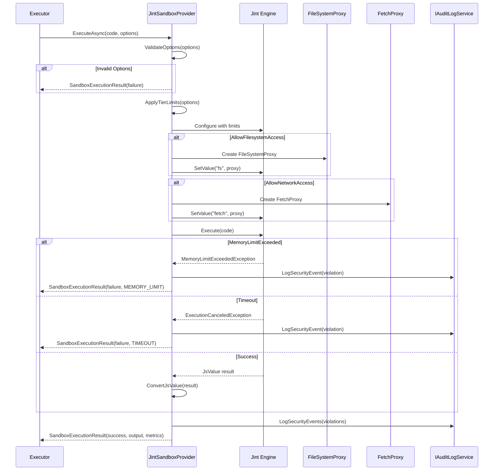
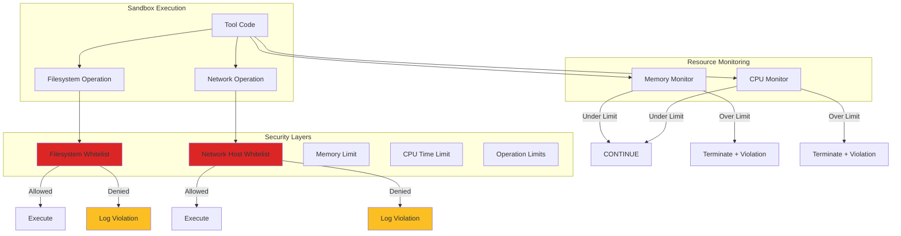

# LCS-SBD-v0.12.5d-SEC: Tool Security & Sandbox

## 1. Metadata & Categorization

| Field | Value |
| :--- | :--- |
| **Feature ID** | `TLS-SEC-01` |
| **Feature Name** | Tool Security & Sandbox |
| **Target Version** | v0.12.5d |
| **Module Scope** | `Lexichord.Modules.Agents.Core`, `Lexichord.Modules.Agents.Abstractions` |
| **Swimlane** | Agent Infrastructure |
| **License Tier** | Teams |
| **Feature Gate Key** | `FeatureFlags.Agents.Tools.Sandbox` |
| **Author** | Agent Architecture Lead |
| **Reviewer** | Security Lead |
| **Status** | Draft |
| **Last Updated** | 2026-02-04 |
| **Estimated Hours** | 10 |

---

## 2. Executive Summary

### 2.1 The Requirement

Agent tools may execute arbitrary code or access external resources, requiring isolated execution environments that prevent malicious or buggy tools from affecting the host system. The sandbox MUST enforce resource limits, restrict filesystem and network access, and provide comprehensive security policies.

### 2.2 The Proposed Solution

Implement a comprehensive Sandbox System consisting of:

1. **`IToolSandbox` Interface:** Core contract for sandboxed execution
2. **`SandboxOptions` Record:** Configuration for sandbox restrictions
3. **`SandboxExecutionResult` Record:** Execution outcome with resource metrics
4. **`SandboxResourceMetrics` Record:** Measured resource usage
5. **`JintSandboxProvider`:** JavaScript sandbox implementation using Jint
6. **Security policy enforcement:** Whitelisting, resource limits, capability restrictions

---

## 3. Architecture & Modular Strategy

### 3.1 Dependencies

**Upstream Modules:**

| Dependency | Version | Purpose |
|:-----------|:--------|:--------|
| `ToolConstraints` | v0.12.5a | Isolation level requirements |
| `SandboxIsolationLevel` | v0.12.5a | Isolation level enum |
| `IAuthorizationService` | v0.11.1-SEC | Permission verification |
| `IAuditLogService` | v0.11.2-SEC | Security event logging |
| `ILicenseContext` | v0.9.2 | License-based sandbox features |
| `IMediator` | v0.0.7a | Security event publishing |

**NuGet Packages:**

- `Jint` — JavaScript interpreter for sandboxed code execution
- `System.IO.Pipelines` — Efficient I/O for sandbox communication

### 3.2 Licensing Behavior

**Load Behavior:**

- [x] **Soft Gate:** Basic sandbox available to all tiers; advanced features gated.

**Tier-Based Features:**

| Tier | Isolation Levels | Custom Policies | Max Memory | Max CPU Time | Custom Sandboxes |
|:-----|:-----------------|:----------------|:-----------|:-------------|:-----------------|
| Core | None, Standard | - | 64MB | 30s | - |
| WriterPro | None, Standard | - | 128MB | 60s | - |
| Teams | All levels | ✓ | 256MB | 5min | - |
| Enterprise | All levels | ✓ | Configurable | Configurable | ✓ |

**Fallback Experience:**

> Strict/Restricted isolation levels show upgrade prompt for Core/WriterPro users. Custom sandbox configurations require Enterprise.

---

## 4. Data Contract (The API)

### 4.1 IToolSandbox Interface

```csharp
namespace Lexichord.Modules.Agents.Abstractions;

/// <summary>
/// Provides isolated execution environments for tool code with enforced resource limits
/// and security restrictions.
/// </summary>
/// <remarks>
/// <para>
/// The sandbox system ensures that tool execution cannot:
/// <list type="bullet">
/// <item><description>Access unauthorized filesystem paths</description></item>
/// <item><description>Make unauthorized network connections</description></item>
/// <item><description>Consume excessive memory or CPU</description></item>
/// <item><description>Interfere with the host process</description></item>
/// <item><description>Access sensitive system resources</description></item>
/// </list>
/// </para>
/// <para>
/// Sandbox implementations may use various isolation techniques:
/// <list type="bullet">
/// <item><description>JavaScript interpreters (Jint) for scripted tools</description></item>
/// <item><description>Process isolation for native tools</description></item>
/// <item><description>Container-based isolation for complex workloads</description></item>
/// </list>
/// </para>
/// </remarks>
public interface IToolSandbox
{
    /// <summary>
    /// Executes code within an isolated sandbox environment.
    /// </summary>
    /// <param name="code">
    /// The code to execute. Format depends on sandbox implementation
    /// (e.g., JavaScript for Jint sandbox).
    /// </param>
    /// <param name="options">
    /// Sandbox configuration including allowed paths, hosts, and resource limits.
    /// </param>
    /// <param name="ct">
    /// Cancellation token to abort execution.
    /// </param>
    /// <returns>
    /// A <see cref="SandboxExecutionResult"/> containing the outcome, output,
    /// and resource usage metrics.
    /// </returns>
    /// <exception cref="ArgumentNullException">
    /// Thrown when <paramref name="code"/> or <paramref name="options"/> is null.
    /// </exception>
    /// <exception cref="SandboxSecurityException">
    /// Thrown when code attempts to violate security policies.
    /// </exception>
    Task<SandboxExecutionResult> ExecuteAsync(
        string code,
        SandboxOptions options,
        CancellationToken ct = default);

    /// <summary>
    /// Executes a tool action within an isolated sandbox environment.
    /// </summary>
    /// <param name="action">
    /// The action delegate to execute in the sandbox.
    /// </param>
    /// <param name="options">
    /// Sandbox configuration including resource limits.
    /// </param>
    /// <param name="ct">
    /// Cancellation token to abort execution.
    /// </param>
    /// <returns>
    /// A <see cref="SandboxExecutionResult"/> containing the outcome and metrics.
    /// </returns>
    Task<SandboxExecutionResult> ExecuteActionAsync(
        Func<CancellationToken, Task<object?>> action,
        SandboxOptions options,
        CancellationToken ct = default);

    /// <summary>
    /// Validates that sandbox options are compatible with the current license tier.
    /// </summary>
    /// <param name="options">The options to validate.</param>
    /// <returns>
    /// A validation result indicating compatibility and any required tier upgrades.
    /// </returns>
    SandboxValidationResult ValidateOptions(SandboxOptions options);

    /// <summary>
    /// Gets the current sandbox status and resource availability.
    /// </summary>
    /// <returns>Current sandbox status including active executions and resource usage.</returns>
    Task<SandboxStatus> GetStatusAsync();
}
```

### 4.2 SandboxOptions Record

```csharp
namespace Lexichord.Modules.Agents.Abstractions;

/// <summary>
/// Configuration options for sandbox execution including security policies and resource limits.
/// </summary>
/// <remarks>
/// <para>
/// Sandbox options define the security boundary for tool execution:
/// <list type="bullet">
/// <item><description>Filesystem access controlled via path whitelist</description></item>
/// <item><description>Network access controlled via host whitelist</description></item>
/// <item><description>Resource usage limited by memory, CPU, and I/O caps</description></item>
/// </list>
/// </para>
/// <para>
/// Default values provide a secure baseline. More permissive options require
/// higher license tiers.
/// </para>
/// </remarks>
public record SandboxOptions
{
    /// <summary>
    /// Gets the list of filesystem paths the sandbox is allowed to access.
    /// </summary>
    /// <value>
    /// Absolute paths that are readable/writable. Null or empty means no filesystem access.
    /// Supports glob patterns (e.g., "/tmp/**").
    /// </value>
    public IReadOnlyList<string>? AllowedPaths { get; init; }

    /// <summary>
    /// Gets the list of network hosts the sandbox is allowed to connect to.
    /// </summary>
    /// <value>
    /// Host names or IP addresses with optional ports (e.g., "api.example.com:443").
    /// Null or empty means no network access.
    /// </value>
    public IReadOnlyList<string>? AllowedHosts { get; init; }

    /// <summary>
    /// Gets the maximum memory the sandbox may allocate in bytes.
    /// </summary>
    /// <value>
    /// Maximum heap size. Default is 256MB. Exceeding this limit terminates execution.
    /// </value>
    public long MaxMemoryBytes { get; init; } = 256 * 1024 * 1024;

    /// <summary>
    /// Gets the maximum CPU time the sandbox may consume.
    /// </summary>
    /// <value>
    /// Maximum CPU execution time. Default is 5 minutes. This is CPU time, not wall time.
    /// </value>
    public TimeSpan MaxCpuTime { get; init; } = TimeSpan.FromMinutes(5);

    /// <summary>
    /// Gets a value indicating whether network access is allowed.
    /// </summary>
    /// <value>
    /// <c>true</c> if the sandbox may make network connections to allowed hosts;
    /// <c>false</c> for complete network isolation.
    /// </value>
    public bool AllowNetworkAccess { get; init; } = false;

    /// <summary>
    /// Gets a value indicating whether filesystem access is allowed.
    /// </summary>
    /// <value>
    /// <c>true</c> if the sandbox may access allowed filesystem paths;
    /// <c>false</c> for complete filesystem isolation.
    /// </value>
    public bool AllowFilesystemAccess { get; init; } = false;

    /// <summary>
    /// Gets the required sandbox isolation level.
    /// </summary>
    /// <value>
    /// Minimum isolation level. Higher levels provide stronger security guarantees.
    /// </value>
    public SandboxIsolationLevel IsolationLevel { get; init; } = SandboxIsolationLevel.Standard;

    /// <summary>
    /// Gets the execution timeout (wall-clock time).
    /// </summary>
    /// <value>
    /// Maximum wall-clock time for execution. Default is 60 seconds.
    /// </value>
    public TimeSpan ExecutionTimeout { get; init; } = TimeSpan.FromSeconds(60);

    /// <summary>
    /// Gets the maximum number of filesystem operations allowed.
    /// </summary>
    /// <value>
    /// Maximum read/write operations. Default is 1000. Zero means unlimited (if allowed).
    /// </value>
    public long MaxFilesystemOperations { get; init; } = 1000;

    /// <summary>
    /// Gets the maximum number of network requests allowed.
    /// </summary>
    /// <value>
    /// Maximum HTTP/socket operations. Default is 100. Zero means unlimited (if allowed).
    /// </value>
    public long MaxNetworkRequests { get; init; } = 100;

    /// <summary>
    /// Gets additional environment variables to inject into the sandbox.
    /// </summary>
    /// <value>
    /// Environment variables available to sandbox code. Null for none.
    /// </value>
    public IReadOnlyDictionary<string, string>? Environment { get; init; }

    /// <summary>
    /// Gets custom security policies for Enterprise tier.
    /// </summary>
    /// <value>
    /// Named security policies to apply. Null uses defaults.
    /// </value>
    public IReadOnlyList<string>? SecurityPolicies { get; init; }
}
```

### 4.3 SandboxExecutionResult Record

```csharp
namespace Lexichord.Modules.Agents.Abstractions;

/// <summary>
/// Result of executing code within a sandbox.
/// </summary>
public record SandboxExecutionResult
{
    /// <summary>
    /// Gets a value indicating whether execution completed successfully.
    /// </summary>
    public bool Success { get; init; }

    /// <summary>
    /// Gets the output value returned by the sandboxed code.
    /// </summary>
    /// <value>
    /// The return value, or null if execution failed or returned nothing.
    /// Complex objects are serialized as JSON.
    /// </value>
    public object? Output { get; init; }

    /// <summary>
    /// Gets the error message if execution failed.
    /// </summary>
    public string? ErrorMessage { get; init; }

    /// <summary>
    /// Gets the error code if execution failed.
    /// </summary>
    public string? ErrorCode { get; init; }

    /// <summary>
    /// Gets the resource usage metrics from execution.
    /// </summary>
    public SandboxResourceMetrics? ResourceMetrics { get; init; }

    /// <summary>
    /// Gets the console output captured during execution.
    /// </summary>
    public string? ConsoleOutput { get; init; }

    /// <summary>
    /// Gets any security violations that occurred (even if execution succeeded).
    /// </summary>
    public IReadOnlyList<SecurityViolation>? SecurityViolations { get; init; }

    /// <summary>
    /// Gets the unique sandbox instance ID.
    /// </summary>
    public string? SandboxId { get; init; }
}

/// <summary>
/// Describes a security policy violation during sandbox execution.
/// </summary>
public record SecurityViolation
{
    /// <summary>
    /// Gets the type of violation.
    /// </summary>
    public SecurityViolationType ViolationType { get; init; }

    /// <summary>
    /// Gets the resource that was accessed or attempted.
    /// </summary>
    public string? Resource { get; init; }

    /// <summary>
    /// Gets a description of the violation.
    /// </summary>
    public string? Description { get; init; }

    /// <summary>
    /// Gets the timestamp when the violation occurred.
    /// </summary>
    public DateTimeOffset Timestamp { get; init; }

    /// <summary>
    /// Gets whether the violation was blocked or just logged.
    /// </summary>
    public bool WasBlocked { get; init; }
}

/// <summary>
/// Types of security violations that can occur in a sandbox.
/// </summary>
public enum SecurityViolationType
{
    /// <summary>Attempted to access unauthorized filesystem path.</summary>
    UnauthorizedFilesystemAccess,
    /// <summary>Attempted to connect to unauthorized network host.</summary>
    UnauthorizedNetworkAccess,
    /// <summary>Exceeded memory limit.</summary>
    MemoryLimitExceeded,
    /// <summary>Exceeded CPU time limit.</summary>
    CpuLimitExceeded,
    /// <summary>Exceeded filesystem operation limit.</summary>
    FilesystemOperationLimitExceeded,
    /// <summary>Exceeded network request limit.</summary>
    NetworkRequestLimitExceeded,
    /// <summary>Attempted to access restricted system resource.</summary>
    RestrictedResourceAccess,
    /// <summary>Attempted code injection or escape.</summary>
    SandboxEscapeAttempt
}
```

### 4.4 SandboxResourceMetrics Record

```csharp
namespace Lexichord.Modules.Agents.Abstractions;

/// <summary>
/// Metrics captured during sandbox execution for monitoring and billing.
/// </summary>
public record SandboxResourceMetrics
{
    /// <summary>
    /// Gets the peak memory usage in bytes.
    /// </summary>
    public long PeakMemoryBytes { get; init; }

    /// <summary>
    /// Gets the total CPU time consumed.
    /// </summary>
    public TimeSpan CpuTime { get; init; }

    /// <summary>
    /// Gets the wall-clock execution time.
    /// </summary>
    public TimeSpan WallTime { get; init; }

    /// <summary>
    /// Gets the number of filesystem operations performed.
    /// </summary>
    public long FilesystemOperations { get; init; }

    /// <summary>
    /// Gets the number of network requests made.
    /// </summary>
    public long NetworkRequests { get; init; }

    /// <summary>
    /// Gets the total bytes read from filesystem.
    /// </summary>
    public long BytesRead { get; init; }

    /// <summary>
    /// Gets the total bytes written to filesystem.
    /// </summary>
    public long BytesWritten { get; init; }

    /// <summary>
    /// Gets the total bytes received from network.
    /// </summary>
    public long NetworkBytesReceived { get; init; }

    /// <summary>
    /// Gets the total bytes sent over network.
    /// </summary>
    public long NetworkBytesSent { get; init; }
}
```

### 4.5 JintSandboxProvider Implementation

```csharp
namespace Lexichord.Modules.Agents.Core.Sandbox;

/// <summary>
/// JavaScript sandbox implementation using the Jint interpreter.
/// Provides isolated JavaScript execution with configurable security policies.
/// </summary>
public sealed class JintSandboxProvider : IToolSandbox, IDisposable
{
    private readonly ILicenseContext _licenseContext;
    private readonly IAuthorizationService _authService;
    private readonly IAuditLogService _auditService;
    private readonly IMediator _mediator;
    private readonly ILogger<JintSandboxProvider> _logger;
    private readonly ConcurrentDictionary<string, SandboxInstance> _instances = new();

    /// <summary>
    /// Initializes a new instance of the <see cref="JintSandboxProvider"/> class.
    /// </summary>
    public JintSandboxProvider(
        ILicenseContext licenseContext,
        IAuthorizationService authService,
        IAuditLogService auditService,
        IMediator mediator,
        ILogger<JintSandboxProvider> logger)
    {
        _licenseContext = licenseContext ?? throw new ArgumentNullException(nameof(licenseContext));
        _authService = authService ?? throw new ArgumentNullException(nameof(authService));
        _auditService = auditService ?? throw new ArgumentNullException(nameof(auditService));
        _mediator = mediator ?? throw new ArgumentNullException(nameof(mediator));
        _logger = logger ?? throw new ArgumentNullException(nameof(logger));
    }

    /// <inheritdoc />
    public async Task<SandboxExecutionResult> ExecuteAsync(
        string code,
        SandboxOptions options,
        CancellationToken ct = default)
    {
        ArgumentException.ThrowIfNullOrWhiteSpace(code);
        ArgumentNullException.ThrowIfNull(options);

        var sandboxId = Guid.NewGuid().ToString("N");
        var startTime = DateTimeOffset.UtcNow;
        var stopwatch = Stopwatch.StartNew();
        var violations = new List<SecurityViolation>();
        var consoleOutput = new StringBuilder();

        _logger.LogInformation(
            "[TLS-SEC] Sandbox execution started. SandboxId: {SandboxId}, IsolationLevel: {IsolationLevel}",
            sandboxId,
            options.IsolationLevel);

        await _mediator.Publish(new SandboxCreatedEvent(
            sandboxId,
            options.IsolationLevel,
            options.MaxMemoryBytes,
            DateTimeOffset.UtcNow), ct).ConfigureAwait(false);

        // Validate options against license
        var validation = ValidateOptions(options);
        if (!validation.IsValid)
        {
            _logger.LogWarning(
                "[TLS-SEC] Sandbox options invalid for license tier. SandboxId: {SandboxId}, Issues: {Issues}",
                sandboxId,
                string.Join(", ", validation.Issues));

            return new SandboxExecutionResult
            {
                Success = false,
                ErrorMessage = validation.ErrorMessage,
                ErrorCode = "INVALID_OPTIONS",
                SandboxId = sandboxId
            };
        }

        // Apply license tier limits
        var effectiveOptions = ApplyTierLimits(options);

        try
        {
            using var timeoutCts = new CancellationTokenSource(effectiveOptions.ExecutionTimeout);
            using var linkedCts = CancellationTokenSource.CreateLinkedTokenSource(ct, timeoutCts.Token);

            // Configure Jint engine with security constraints
            var engine = new Engine(cfg =>
            {
                cfg.LimitMemory(effectiveOptions.MaxMemoryBytes);
                cfg.TimeoutInterval(effectiveOptions.MaxCpuTime);
                cfg.MaxStatements(1_000_000); // Prevent infinite loops
                cfg.Strict(); // Enable strict mode
            });

            // Configure console capture
            engine.SetValue("console", new ConsoleProxy(consoleOutput));

            // Configure filesystem access if allowed
            if (effectiveOptions.AllowFilesystemAccess && effectiveOptions.AllowedPaths?.Count > 0)
            {
                engine.SetValue("fs", new FileSystemProxy(
                    effectiveOptions.AllowedPaths,
                    effectiveOptions.MaxFilesystemOperations,
                    violations));
            }

            // Configure network access if allowed
            if (effectiveOptions.AllowNetworkAccess && effectiveOptions.AllowedHosts?.Count > 0)
            {
                engine.SetValue("fetch", new FetchProxy(
                    effectiveOptions.AllowedHosts,
                    effectiveOptions.MaxNetworkRequests,
                    violations));
            }

            // Execute code
            object? output = null;
            try
            {
                var result = engine.Execute(code);
                output = ConvertJsValue(result.GetCompletionValue());
            }
            catch (ExecutionCanceledException)
            {
                if (timeoutCts.IsCancellationRequested)
                {
                    violations.Add(new SecurityViolation
                    {
                        ViolationType = SecurityViolationType.CpuLimitExceeded,
                        Description = "Execution exceeded CPU time limit",
                        Timestamp = DateTimeOffset.UtcNow,
                        WasBlocked = true
                    });

                    return new SandboxExecutionResult
                    {
                        Success = false,
                        ErrorMessage = "Execution timed out",
                        ErrorCode = "TIMEOUT",
                        SandboxId = sandboxId,
                        SecurityViolations = violations,
                        ConsoleOutput = consoleOutput.ToString()
                    };
                }
                throw;
            }
            catch (MemoryLimitExceededException)
            {
                violations.Add(new SecurityViolation
                {
                    ViolationType = SecurityViolationType.MemoryLimitExceeded,
                    Description = $"Memory usage exceeded {effectiveOptions.MaxMemoryBytes} bytes",
                    Timestamp = DateTimeOffset.UtcNow,
                    WasBlocked = true
                });

                return new SandboxExecutionResult
                {
                    Success = false,
                    ErrorMessage = "Memory limit exceeded",
                    ErrorCode = "MEMORY_LIMIT",
                    SandboxId = sandboxId,
                    SecurityViolations = violations,
                    ConsoleOutput = consoleOutput.ToString()
                };
            }

            stopwatch.Stop();

            var metrics = new SandboxResourceMetrics
            {
                PeakMemoryBytes = GC.GetTotalMemory(false), // Approximate
                CpuTime = TimeSpan.FromMilliseconds(stopwatch.ElapsedMilliseconds), // Approximate
                WallTime = stopwatch.Elapsed,
                FilesystemOperations = 0, // Tracked by proxies
                NetworkRequests = 0 // Tracked by proxies
            };

            _logger.LogInformation(
                "[TLS-SEC] Sandbox execution completed. SandboxId: {SandboxId}, Duration: {Duration}ms, Violations: {ViolationCount}",
                sandboxId,
                stopwatch.ElapsedMilliseconds,
                violations.Count);

            return new SandboxExecutionResult
            {
                Success = true,
                Output = output,
                SandboxId = sandboxId,
                ResourceMetrics = metrics,
                ConsoleOutput = consoleOutput.ToString(),
                SecurityViolations = violations.Count > 0 ? violations : null
            };
        }
        catch (Exception ex)
        {
            _logger.LogError(ex,
                "[TLS-SEC] Sandbox execution failed. SandboxId: {SandboxId}",
                sandboxId);

            return new SandboxExecutionResult
            {
                Success = false,
                ErrorMessage = ex.Message,
                ErrorCode = "EXECUTION_ERROR",
                SandboxId = sandboxId,
                SecurityViolations = violations.Count > 0 ? violations : null,
                ConsoleOutput = consoleOutput.ToString()
            };
        }
        finally
        {
            await _mediator.Publish(new SandboxDestroyedEvent(
                sandboxId,
                stopwatch.Elapsed,
                DateTimeOffset.UtcNow), ct).ConfigureAwait(false);

            // Log any security violations
            foreach (var violation in violations)
            {
                await _auditService.LogSecurityEventAsync(new SecurityAuditEntry
                {
                    SandboxId = sandboxId,
                    ViolationType = violation.ViolationType.ToString(),
                    Resource = violation.Resource,
                    WasBlocked = violation.WasBlocked,
                    Timestamp = violation.Timestamp
                }, ct).ConfigureAwait(false);
            }
        }
    }

    /// <inheritdoc />
    public async Task<SandboxExecutionResult> ExecuteActionAsync(
        Func<CancellationToken, Task<object?>> action,
        SandboxOptions options,
        CancellationToken ct = default)
    {
        ArgumentNullException.ThrowIfNull(action);
        ArgumentNullException.ThrowIfNull(options);

        var sandboxId = Guid.NewGuid().ToString("N");
        var stopwatch = Stopwatch.StartNew();

        try
        {
            using var timeoutCts = new CancellationTokenSource(options.ExecutionTimeout);
            using var linkedCts = CancellationTokenSource.CreateLinkedTokenSource(ct, timeoutCts.Token);

            var output = await action(linkedCts.Token).ConfigureAwait(false);

            stopwatch.Stop();

            return new SandboxExecutionResult
            {
                Success = true,
                Output = output,
                SandboxId = sandboxId,
                ResourceMetrics = new SandboxResourceMetrics
                {
                    WallTime = stopwatch.Elapsed
                }
            };
        }
        catch (OperationCanceledException) when (!ct.IsCancellationRequested)
        {
            return new SandboxExecutionResult
            {
                Success = false,
                ErrorMessage = "Execution timed out",
                ErrorCode = "TIMEOUT",
                SandboxId = sandboxId
            };
        }
        catch (Exception ex)
        {
            return new SandboxExecutionResult
            {
                Success = false,
                ErrorMessage = ex.Message,
                ErrorCode = "EXECUTION_ERROR",
                SandboxId = sandboxId
            };
        }
    }

    /// <inheritdoc />
    public SandboxValidationResult ValidateOptions(SandboxOptions options)
    {
        var issues = new List<string>();
        var currentTier = _licenseContext.CurrentTier;

        // Check isolation level
        if (options.IsolationLevel >= SandboxIsolationLevel.Strict && currentTier < LicenseTier.Teams)
        {
            issues.Add($"Isolation level {options.IsolationLevel} requires Teams tier or higher");
        }

        // Check memory limits
        var maxMemory = GetMaxMemoryForTier(currentTier);
        if (options.MaxMemoryBytes > maxMemory)
        {
            issues.Add($"Memory limit {options.MaxMemoryBytes} exceeds tier maximum {maxMemory}");
        }

        // Check custom security policies
        if (options.SecurityPolicies?.Count > 0 && currentTier < LicenseTier.Enterprise)
        {
            issues.Add("Custom security policies require Enterprise tier");
        }

        return new SandboxValidationResult(
            issues.Count == 0,
            issues,
            issues.Count == 0 ? null : string.Join("; ", issues));
    }

    /// <inheritdoc />
    public Task<SandboxStatus> GetStatusAsync()
    {
        return Task.FromResult(new SandboxStatus
        {
            ActiveExecutions = _instances.Count,
            TotalMemoryUsed = _instances.Values.Sum(i => i.MemoryUsed),
            AvailableMemory = GetMaxMemoryForTier(_licenseContext.CurrentTier)
        });
    }

    private SandboxOptions ApplyTierLimits(SandboxOptions options)
    {
        var tier = _licenseContext.CurrentTier;
        var maxMemory = GetMaxMemoryForTier(tier);
        var maxCpuTime = GetMaxCpuTimeForTier(tier);

        return options with
        {
            MaxMemoryBytes = Math.Min(options.MaxMemoryBytes, maxMemory),
            MaxCpuTime = options.MaxCpuTime > maxCpuTime ? maxCpuTime : options.MaxCpuTime
        };
    }

    private static long GetMaxMemoryForTier(LicenseTier tier) => tier switch
    {
        LicenseTier.Core => 64 * 1024 * 1024,
        LicenseTier.WriterPro => 128 * 1024 * 1024,
        LicenseTier.Teams => 256 * 1024 * 1024,
        LicenseTier.Enterprise => 1024 * 1024 * 1024,
        _ => 64 * 1024 * 1024
    };

    private static TimeSpan GetMaxCpuTimeForTier(LicenseTier tier) => tier switch
    {
        LicenseTier.Core => TimeSpan.FromSeconds(30),
        LicenseTier.WriterPro => TimeSpan.FromMinutes(1),
        LicenseTier.Teams => TimeSpan.FromMinutes(5),
        LicenseTier.Enterprise => TimeSpan.FromMinutes(30),
        _ => TimeSpan.FromSeconds(30)
    };

    private static object? ConvertJsValue(JsValue value)
    {
        if (value.IsUndefined() || value.IsNull()) return null;
        if (value.IsBoolean()) return value.AsBoolean();
        if (value.IsNumber()) return value.AsNumber();
        if (value.IsString()) return value.AsString();
        if (value.IsArray()) return value.AsArray().Select(ConvertJsValue).ToList();
        if (value.IsObject()) return value.ToObject();
        return value.ToString();
    }

    /// <inheritdoc />
    public void Dispose()
    {
        foreach (var instance in _instances.Values)
        {
            instance.Dispose();
        }
        _instances.Clear();
    }

    private sealed class SandboxInstance : IDisposable
    {
        public long MemoryUsed { get; set; }
        public void Dispose() { }
    }
}

/// <summary>
/// Result of validating sandbox options against license tier.
/// </summary>
public record SandboxValidationResult(
    bool IsValid,
    IReadOnlyList<string> Issues,
    string? ErrorMessage);

/// <summary>
/// Current status of the sandbox system.
/// </summary>
public record SandboxStatus
{
    public int ActiveExecutions { get; init; }
    public long TotalMemoryUsed { get; init; }
    public long AvailableMemory { get; init; }
}
```

---

## 5. Implementation Logic

### 5.1 Sandbox Execution Flow



### 5.2 Security Policy Enforcement



---

## 6. Data Persistence (Database)

### 6.1 Migration

**Migration ID:** `Migration_20260204_004_CreateSandboxConfigurations`

```csharp
namespace Lexichord.Modules.Agents.Core.Migrations;

using FluentMigrator;

/// <summary>
/// Creates the sandbox_configurations table for custom sandbox policies.
/// </summary>
[Migration(20260204004)]
public class Migration_20260204_004_CreateSandboxConfigurations : Migration
{
    public override void Up()
    {
        Create.Table("sandbox_configurations")
            .InSchema("agent_tools")
            .WithColumn("id").AsGuid().PrimaryKey().WithDefault(SystemMethods.NewGuid)
            .WithColumn("name").AsString(64).NotNullable().Unique()
            .WithColumn("description").AsString(512).Nullable()
            .WithColumn("isolation_level").AsInt32().NotNullable()
            .WithColumn("allowed_paths_json").AsString(int.MaxValue).Nullable()
            .WithColumn("allowed_hosts_json").AsString(int.MaxValue).Nullable()
            .WithColumn("max_memory_bytes").AsInt64().NotNullable()
            .WithColumn("max_cpu_time_seconds").AsInt32().NotNullable()
            .WithColumn("allow_network").AsBoolean().NotNullable()
            .WithColumn("allow_filesystem").AsBoolean().NotNullable()
            .WithColumn("security_policies_json").AsString(int.MaxValue).Nullable()
            .WithColumn("required_tier").AsInt32().NotNullable()
            .WithColumn("created_by").AsGuid().Nullable()
            .WithColumn("created_at").AsDateTimeOffset().NotNullable().WithDefault(SystemMethods.CurrentUTCDateTime)
            .WithColumn("updated_at").AsDateTimeOffset().NotNullable().WithDefault(SystemMethods.CurrentUTCDateTime);

        Create.Table("sandbox_security_events")
            .InSchema("agent_tools")
            .WithColumn("id").AsGuid().PrimaryKey().WithDefault(SystemMethods.NewGuid)
            .WithColumn("sandbox_id").AsString(64).NotNullable()
            .WithColumn("violation_type").AsString(64).NotNullable()
            .WithColumn("resource").AsString(512).Nullable()
            .WithColumn("description").AsString(1024).Nullable()
            .WithColumn("was_blocked").AsBoolean().NotNullable()
            .WithColumn("timestamp").AsDateTimeOffset().NotNullable();

        Create.Index("IX_sandbox_security_events_sandbox_id")
            .OnTable("sandbox_security_events")
            .InSchema("agent_tools")
            .OnColumn("sandbox_id").Ascending();

        Create.Index("IX_sandbox_security_events_violation_type")
            .OnTable("sandbox_security_events")
            .InSchema("agent_tools")
            .OnColumn("violation_type").Ascending();

        Create.Index("IX_sandbox_security_events_timestamp")
            .OnTable("sandbox_security_events")
            .InSchema("agent_tools")
            .OnColumn("timestamp").Descending();
    }

    public override void Down()
    {
        Delete.Table("sandbox_security_events").InSchema("agent_tools");
        Delete.Table("sandbox_configurations").InSchema("agent_tools");
    }
}
```

---

## 7. Observability & Logging

**Structured Log Messages:**

```csharp
// Sandbox created
_logger.LogInformation(
    "[TLS-SEC] Sandbox execution started. SandboxId: {SandboxId}, IsolationLevel: {IsolationLevel}",
    sandboxId,
    options.IsolationLevel);

// Sandbox completed
_logger.LogInformation(
    "[TLS-SEC] Sandbox execution completed. SandboxId: {SandboxId}, Duration: {Duration}ms, Violations: {ViolationCount}",
    sandboxId,
    stopwatch.ElapsedMilliseconds,
    violations.Count);

// Memory limit exceeded
_logger.LogWarning(
    "[TLS-SEC] Sandbox memory limit exceeded. SandboxId: {SandboxId}, Limit: {Limit}",
    sandboxId,
    options.MaxMemoryBytes);

// Security violation
_logger.LogWarning(
    "[TLS-SEC] Security violation detected. SandboxId: {SandboxId}, Type: {ViolationType}, Resource: {Resource}",
    sandboxId,
    violation.ViolationType,
    violation.Resource);

// Options validation failure
_logger.LogWarning(
    "[TLS-SEC] Sandbox options invalid for license tier. SandboxId: {SandboxId}, Issues: {Issues}",
    sandboxId,
    string.Join(", ", validation.Issues));
```

**Metrics:**

| Metric | Type | Description |
|:-------|:-----|:------------|
| `sandbox.executions.total` | Counter | Total sandbox executions |
| `sandbox.executions.duration` | Histogram | Execution duration |
| `sandbox.memory.peak` | Gauge | Peak memory usage |
| `sandbox.violations.total` | Counter | Security violations |
| `sandbox.violations.by_type` | Counter | Violations by type |
| `sandbox.timeouts` | Counter | Execution timeouts |

---

## 8. Security & Safety

| Concern | Mitigation |
|:--------|:-----------|
| Sandbox escape | Jint interpreter isolation, no native code execution |
| Memory exhaustion | Jint memory limits, process monitoring |
| CPU exhaustion | Jint timeout, statement limits |
| Filesystem access | Path whitelist, proxy validation |
| Network access | Host whitelist, proxy validation |
| Code injection | Strict mode, input sanitization |
| Privilege escalation | No access to host process APIs |

---

## 9. Acceptance Criteria (QA)

1. **[Functional]** Sandbox executes JavaScript code successfully
2. **[Functional]** Memory limit terminates execution when exceeded
3. **[Functional]** CPU timeout terminates execution when exceeded
4. **[Functional]** Filesystem proxy blocks unauthorized paths
5. **[Functional]** Network proxy blocks unauthorized hosts
6. **[Security]** Sandbox escape attempts are blocked and logged
7. **[Security]** All violations are recorded in audit log
8. **[Licensing]** Strict isolation requires Teams tier
9. **[Licensing]** Memory limits respect tier maximums
10. **[Performance]** Sandbox initialization <100ms
11. **[Performance]** Sandbox overhead <50MB memory

---

## 10. MediatR Events

```csharp
namespace Lexichord.Modules.Agents.Core.Events;

/// <summary>
/// Published when a sandbox instance is created.
/// </summary>
public record SandboxCreatedEvent(
    string SandboxId,
    SandboxIsolationLevel IsolationLevel,
    long MaxMemoryBytes,
    DateTimeOffset Timestamp) : INotification;

/// <summary>
/// Published when a sandbox instance is destroyed.
/// </summary>
public record SandboxDestroyedEvent(
    string SandboxId,
    TimeSpan Duration,
    DateTimeOffset Timestamp) : INotification;

/// <summary>
/// Published when a sandbox resource limit is reached.
/// </summary>
public record SandboxResourceLimitReachedEvent(
    string SandboxId,
    string LimitType,
    long LimitValue,
    long ActualValue,
    DateTimeOffset Timestamp) : INotification;

/// <summary>
/// Published when a security policy is violated in a sandbox.
/// </summary>
public record SandboxSecurityViolationEvent(
    string SandboxId,
    SecurityViolationType ViolationType,
    string? Resource,
    bool WasBlocked,
    DateTimeOffset Timestamp) : INotification;
```

---

## 11. Unit Tests

```csharp
namespace Lexichord.Modules.Agents.Tests.Unit.Sandbox;

using FluentAssertions;
using Lexichord.Modules.Agents.Abstractions;
using Lexichord.Modules.Agents.Core.Sandbox;
using Microsoft.Extensions.Logging.Abstractions;
using Moq;
using Xunit;

/// <summary>
/// Unit tests for JintSandboxProvider.
/// </summary>
public class JintSandboxProviderTests
{
    private readonly Mock<ILicenseContext> _licenseMock = new();
    private readonly Mock<IAuthorizationService> _authMock = new();
    private readonly Mock<IAuditLogService> _auditMock = new();
    private readonly Mock<IMediator> _mediatorMock = new();
    private readonly JintSandboxProvider _sandbox;

    public JintSandboxProviderTests()
    {
        _licenseMock.Setup(l => l.CurrentTier).Returns(LicenseTier.Teams);

        _sandbox = new JintSandboxProvider(
            _licenseMock.Object,
            _authMock.Object,
            _auditMock.Object,
            _mediatorMock.Object,
            NullLogger<JintSandboxProvider>.Instance);
    }

    /// <summary>
    /// Verifies that simple JavaScript executes successfully.
    /// </summary>
    [Fact]
    public async Task ExecuteAsync_SimpleCode_ReturnsResult()
    {
        // Arrange
        var code = "1 + 2";
        var options = new SandboxOptions();

        // Act
        var result = await _sandbox.ExecuteAsync(code, options);

        // Assert
        result.Success.Should().BeTrue();
        result.Output.Should().Be(3.0);
    }

    /// <summary>
    /// Verifies that memory limit is enforced.
    /// </summary>
    [Fact]
    public async Task ExecuteAsync_ExceedsMemory_ReturnsFailure()
    {
        // Arrange
        var code = "var arr = []; while(true) arr.push(new Array(1000000));";
        var options = new SandboxOptions { MaxMemoryBytes = 10 * 1024 * 1024 };

        // Act
        var result = await _sandbox.ExecuteAsync(code, options);

        // Assert
        result.Success.Should().BeFalse();
        result.ErrorCode.Should().Be("MEMORY_LIMIT");
    }

    /// <summary>
    /// Verifies that CPU timeout is enforced.
    /// </summary>
    [Fact]
    public async Task ExecuteAsync_ExceedsCpuTime_ReturnsTimeout()
    {
        // Arrange
        var code = "while(true) {}";
        var options = new SandboxOptions { MaxCpuTime = TimeSpan.FromMilliseconds(100) };

        // Act
        var result = await _sandbox.ExecuteAsync(code, options);

        // Assert
        result.Success.Should().BeFalse();
        result.ErrorCode.Should().Be("TIMEOUT");
    }

    /// <summary>
    /// Verifies license tier validation.
    /// </summary>
    [Fact]
    public void ValidateOptions_StrictIsolationOnCore_ReturnsInvalid()
    {
        // Arrange
        _licenseMock.Setup(l => l.CurrentTier).Returns(LicenseTier.Core);
        var options = new SandboxOptions { IsolationLevel = SandboxIsolationLevel.Strict };

        // Act
        var result = _sandbox.ValidateOptions(options);

        // Assert
        result.IsValid.Should().BeFalse();
        result.Issues.Should().Contain(i => i.Contains("Teams tier"));
    }
}
```

---

## 12. Changelog

| Date | Version | Changes |
|:-----|:--------|:--------|
| 2026-02-04 | 1.0.0 | Initial specification |

---

**End of Specification**
