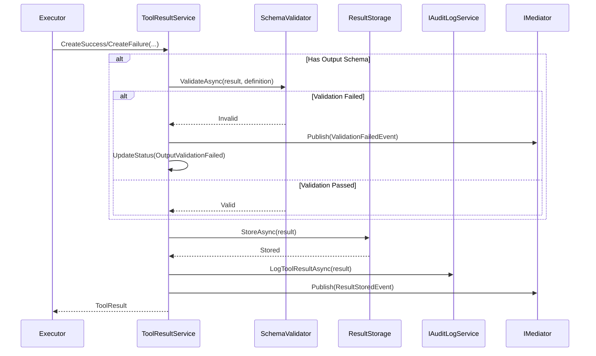

# LCS-SBD-v0.12.5e-RES: Tool Results

## 1. Metadata & Categorization

| Field | Value |
| :--- | :--- |
| **Feature ID** | `TLS-RES-01` |
| **Feature Name** | Tool Results |
| **Target Version** | v0.12.5e |
| **Module Scope** | `Lexichord.Modules.Agents.Abstractions`, `Lexichord.Modules.Agents.Core` |
| **Swimlane** | Agent Infrastructure |
| **License Tier** | Core |
| **Feature Gate Key** | `FeatureFlags.Agents.Tools.Results` |
| **Author** | Agent Architecture Lead |
| **Reviewer** | Lead Architect |
| **Status** | Draft |
| **Last Updated** | 2026-02-04 |
| **Estimated Hours** | 6 |

---

## 2. Executive Summary

### 2.1 The Requirement

Tool execution produces results that MUST be captured, validated, and stored with comprehensive metadata for debugging, auditing, and agent reasoning. Results MUST include execution status, output data, timing metrics, and error details when applicable.

### 2.2 The Proposed Solution

Implement a comprehensive Result Handling system consisting of:

1. **`ToolResult` Record:** Complete execution result with input, output, status, and metadata
2. **`ToolResultMetadata` Record:** Timing, resource usage, and execution context
3. **`ToolExecutionStatus` Enum:** Execution outcome status codes
4. **Result validation:** Output schema validation against tool definition
5. **Result storage:** Persistent storage for execution history and debugging
6. **Side effect tracking:** Record of resources affected by tool execution

---

## 3. Architecture & Modular Strategy

### 3.1 Dependencies

**Upstream Modules:**

| Dependency | Version | Purpose |
|:-----------|:--------|:--------|
| `ToolDefinition` | v0.12.5a | Output schema for validation |
| `ToolInput` | v0.12.5c | Input reference in result |
| `SandboxResourceMetrics` | v0.12.5d | Resource usage data |
| `IAuditLogService` | v0.11.2-SEC | Result audit logging |
| `IMediator` | v0.0.7a | Result event publishing |

**NuGet Packages:**

- `System.Text.Json` — Result serialization
- `NJsonSchema` — Output schema validation

### 3.2 Licensing Behavior

**Load Behavior:**

- [x] **Soft Gate:** Basic results available to all; advanced features gated.

**Tier-Based Features:**

| Tier | Result Storage | History Retention | Schema Validation | Side Effect Tracking |
|:-----|:---------------|:------------------|:------------------|:---------------------|
| Core | In-memory | Session only | Basic | - |
| WriterPro | Persistent | 7 days | Basic | ✓ |
| Teams | Persistent | 30 days | Advanced | ✓ |
| Enterprise | Persistent | Custom | Full | ✓ |

---

## 4. Data Contract (The API)

### 4.1 ToolResult Record

```csharp
namespace Lexichord.Modules.Agents.Abstractions;

/// <summary>
/// Complete result of a tool execution including input reference, output data,
/// execution status, and comprehensive metadata.
/// </summary>
/// <remarks>
/// <para>
/// Tool results capture everything needed to understand what happened during execution:
/// <list type="bullet">
/// <item><description>The original input (for correlation and debugging)</description></item>
/// <item><description>The output data (if successful)</description></item>
/// <item><description>The execution status (success, failure, timeout, etc.)</description></item>
/// <item><description>Timing and resource usage metadata</description></item>
/// <item><description>Error details (if failed)</description></item>
/// </list>
/// </para>
/// <para>
/// Results are serializable for storage and transmission. Large outputs may be
/// truncated with the full content available via separate retrieval.
/// </para>
/// </remarks>
/// <example>
/// <code>
/// // Successful result
/// var successResult = new ToolResult
/// {
///     Input = new ToolInput { ToolName = "read_file", Parameters = ... },
///     Output = new { content = "file contents...", size = 1024 },
///     Status = ToolExecutionStatus.Success,
///     Metadata = new ToolResultMetadata
///     {
///         ExecutionId = Guid.NewGuid(),
///         StartedAt = DateTimeOffset.UtcNow.AddMilliseconds(-50),
///         CompletedAt = DateTimeOffset.UtcNow,
///         Duration = TimeSpan.FromMilliseconds(50),
///         OutputSize = 1024
///     }
/// };
///
/// // Failed result
/// var failedResult = new ToolResult
/// {
///     Input = input,
///     Status = ToolExecutionStatus.Failed,
///     ErrorMessage = "File not found",
///     ErrorCode = "FILE_NOT_FOUND",
///     Metadata = metadata
/// };
/// </code>
/// </example>
public record ToolResult
{
    /// <summary>
    /// Gets the original input that produced this result.
    /// </summary>
    /// <value>
    /// The <see cref="ToolInput"/> containing tool name and parameters.
    /// Stored for correlation and debugging.
    /// </value>
    public required ToolInput Input { get; init; }

    /// <summary>
    /// Gets the execution metadata including timing and resource usage.
    /// </summary>
    /// <value>
    /// A <see cref="ToolResultMetadata"/> record with execution details.
    /// </value>
    public required ToolResultMetadata Metadata { get; init; }

    /// <summary>
    /// Gets the output data produced by the tool.
    /// </summary>
    /// <value>
    /// The tool's output data, or null if execution failed or produced no output.
    /// Complex objects are serialized as JSON-compatible types.
    /// </value>
    /// <remarks>
    /// Output may be truncated if it exceeds size limits. Check
    /// <see cref="ToolResultMetadata.OutputTruncated"/> for truncation status.
    /// </remarks>
    public object? Output { get; init; }

    /// <summary>
    /// Gets the execution status indicating success or failure type.
    /// </summary>
    /// <value>
    /// A <see cref="ToolExecutionStatus"/> value indicating the outcome.
    /// </value>
    public ToolExecutionStatus Status { get; init; }

    /// <summary>
    /// Gets the error message if execution failed.
    /// </summary>
    /// <value>
    /// A human-readable error description, or null if successful.
    /// </value>
    public string? ErrorMessage { get; init; }

    /// <summary>
    /// Gets the error code if execution failed.
    /// </summary>
    /// <value>
    /// A machine-readable error code for programmatic handling.
    /// Codes use SCREAMING_SNAKE_CASE format.
    /// </value>
    /// <example>"FILE_NOT_FOUND", "PERMISSION_DENIED", "TIMEOUT"</example>
    public string? ErrorCode { get; init; }

    /// <summary>
    /// Gets the list of side effects produced by this execution.
    /// </summary>
    /// <value>
    /// A list of resources created, modified, or deleted. Null if no side effects
    /// or side effect tracking is disabled.
    /// </value>
    public IReadOnlyList<ToolSideEffect>? SideEffects { get; init; }

    /// <summary>
    /// Gets a value indicating whether this result represents a successful execution.
    /// </summary>
    public bool IsSuccess => Status == ToolExecutionStatus.Success;

    /// <summary>
    /// Gets a value indicating whether this result represents a failure.
    /// </summary>
    public bool IsFailure => Status != ToolExecutionStatus.Success;
}
```

### 4.2 ToolResultMetadata Record

```csharp
namespace Lexichord.Modules.Agents.Abstractions;

/// <summary>
/// Metadata captured during tool execution including timing, resource usage,
/// and execution context.
/// </summary>
/// <remarks>
/// Metadata is captured automatically by the executor and sandbox. This information
/// supports debugging, performance analysis, and billing.
/// </remarks>
public record ToolResultMetadata
{
    /// <summary>
    /// Gets the unique identifier for this execution.
    /// </summary>
    /// <value>
    /// The execution ID from <see cref="ToolExecutionOptions.ExecutionId"/>.
    /// </value>
    public Guid ExecutionId { get; init; }

    /// <summary>
    /// Gets the timestamp when execution started.
    /// </summary>
    public DateTimeOffset StartedAt { get; init; }

    /// <summary>
    /// Gets the timestamp when execution completed.
    /// </summary>
    public DateTimeOffset CompletedAt { get; init; }

    /// <summary>
    /// Gets the total execution duration.
    /// </summary>
    public TimeSpan Duration { get; init; }

    /// <summary>
    /// Gets the size of the output in bytes.
    /// </summary>
    /// <value>
    /// Serialized output size, or null if no output.
    /// </value>
    public long? OutputSize { get; init; }

    /// <summary>
    /// Gets a value indicating whether the output was truncated.
    /// </summary>
    /// <value>
    /// <c>true</c> if output exceeded size limits and was truncated;
    /// <c>false</c> otherwise.
    /// </value>
    public bool OutputTruncated { get; init; } = false;

    /// <summary>
    /// Gets the sandbox instance ID if execution was sandboxed.
    /// </summary>
    public string? SandboxId { get; init; }

    /// <summary>
    /// Gets the resource metrics from sandbox execution.
    /// </summary>
    /// <value>
    /// Memory, CPU, and I/O metrics from the sandbox.
    /// Null if execution was not sandboxed.
    /// </value>
    public SandboxResourceMetrics? ResourceMetrics { get; init; }

    /// <summary>
    /// Gets additional execution metrics for analysis.
    /// </summary>
    /// <value>
    /// Tool-specific metrics such as rows processed, API calls made, etc.
    /// </value>
    public IReadOnlyDictionary<string, object>? ExecutionMetrics { get; init; }

    /// <summary>
    /// Gets the agent ID that requested this execution.
    /// </summary>
    public Guid? AgentId { get; init; }

    /// <summary>
    /// Gets the user ID associated with this execution.
    /// </summary>
    public Guid? UserId { get; init; }

    /// <summary>
    /// Gets the batch ID if this was part of a batch execution.
    /// </summary>
    public Guid? BatchId { get; init; }

    /// <summary>
    /// Gets the position in the batch (0-indexed) if applicable.
    /// </summary>
    public int? BatchIndex { get; init; }

    /// <summary>
    /// Gets the correlation ID for tracing across services.
    /// </summary>
    public string? CorrelationId { get; init; }
}
```

### 4.3 ToolExecutionStatus Enum

```csharp
namespace Lexichord.Modules.Agents.Abstractions;

/// <summary>
/// Status codes indicating the outcome of tool execution.
/// </summary>
/// <remarks>
/// <para>
/// Status codes are grouped by category:
/// <list type="bullet">
/// <item><description>0: Success</description></item>
/// <item><description>1-9: Termination states (cancelled, timeout)</description></item>
/// <item><description>10-19: Authorization failures</description></item>
/// <item><description>20-29: Validation failures</description></item>
/// <item><description>30-39: Execution failures</description></item>
/// <item><description>40-49: Sandbox failures</description></item>
/// </list>
/// </para>
/// </remarks>
public enum ToolExecutionStatus
{
    /// <summary>
    /// Execution completed successfully.
    /// </summary>
    Success = 0,

    /// <summary>
    /// Execution failed with a general error.
    /// </summary>
    Failed = 30,

    /// <summary>
    /// Execution exceeded the timeout limit.
    /// </summary>
    Timeout = 1,

    /// <summary>
    /// Execution was cancelled by the caller.
    /// </summary>
    Cancelled = 2,

    /// <summary>
    /// Tool requires user confirmation before execution can proceed.
    /// </summary>
    RequiresConfirmation = 3,

    /// <summary>
    /// Sandbox encountered an error during execution.
    /// </summary>
    SandboxError = 40,

    /// <summary>
    /// Permission denied for tool execution.
    /// </summary>
    PermissionDenied = 10,

    /// <summary>
    /// Input parameter validation failed.
    /// </summary>
    ValidationError = 20,

    /// <summary>
    /// Tool not found in the registry.
    /// </summary>
    ToolNotFound = 31,

    /// <summary>
    /// Tool is not available for the current license tier.
    /// </summary>
    LicenseRequired = 11,

    /// <summary>
    /// Output validation against schema failed.
    /// </summary>
    OutputValidationFailed = 21,

    /// <summary>
    /// Rate limit exceeded for this tool.
    /// </summary>
    RateLimited = 32,

    /// <summary>
    /// Sandbox security violation occurred.
    /// </summary>
    SecurityViolation = 41,

    /// <summary>
    /// Sandbox resource limit exceeded.
    /// </summary>
    ResourceLimitExceeded = 42
}
```

### 4.4 ToolSideEffect Record

```csharp
namespace Lexichord.Modules.Agents.Abstractions;

/// <summary>
/// Describes a side effect (resource modification) produced by tool execution.
/// </summary>
/// <remarks>
/// Side effects are tracked for audit, undo operations, and dependency analysis.
/// Available for WriterPro tier and above.
/// </remarks>
public record ToolSideEffect
{
    /// <summary>
    /// Gets the type of side effect.
    /// </summary>
    public SideEffectType Type { get; init; }

    /// <summary>
    /// Gets the resource that was affected.
    /// </summary>
    /// <value>
    /// A resource identifier such as file path, entity ID, or URL.
    /// </value>
    public required string Resource { get; init; }

    /// <summary>
    /// Gets a description of the change.
    /// </summary>
    public string? Description { get; init; }

    /// <summary>
    /// Gets the previous value (for modifications).
    /// </summary>
    public object? PreviousValue { get; init; }

    /// <summary>
    /// Gets the new value (for creations and modifications).
    /// </summary>
    public object? NewValue { get; init; }

    /// <summary>
    /// Gets the timestamp when the side effect occurred.
    /// </summary>
    public DateTimeOffset Timestamp { get; init; }

    /// <summary>
    /// Gets a value indicating whether this side effect is reversible.
    /// </summary>
    public bool IsReversible { get; init; } = false;
}

/// <summary>
/// Types of side effects that tools can produce.
/// </summary>
public enum SideEffectType
{
    /// <summary>A new resource was created.</summary>
    Created,
    /// <summary>An existing resource was modified.</summary>
    Modified,
    /// <summary>A resource was deleted.</summary>
    Deleted,
    /// <summary>A message was sent.</summary>
    MessageSent,
    /// <summary>An external API was called.</summary>
    ExternalApiCalled,
    /// <summary>Data was exported or shared.</summary>
    DataExported
}
```

### 4.5 Result Service Implementation

```csharp
namespace Lexichord.Modules.Agents.Core.Services;

/// <summary>
/// Service for validating, storing, and retrieving tool execution results.
/// </summary>
public sealed class ToolResultService : IToolResultService
{
    private readonly ILicenseContext _licenseContext;
    private readonly IAuditLogService _auditService;
    private readonly IMediator _mediator;
    private readonly ILogger<ToolResultService> _logger;
    private readonly ConcurrentDictionary<Guid, ToolResult> _sessionResults = new();

    /// <summary>
    /// Initializes a new instance of the <see cref="ToolResultService"/> class.
    /// </summary>
    public ToolResultService(
        ILicenseContext licenseContext,
        IAuditLogService auditService,
        IMediator mediator,
        ILogger<ToolResultService> logger)
    {
        _licenseContext = licenseContext ?? throw new ArgumentNullException(nameof(licenseContext));
        _auditService = auditService ?? throw new ArgumentNullException(nameof(auditService));
        _mediator = mediator ?? throw new ArgumentNullException(nameof(mediator));
        _logger = logger ?? throw new ArgumentNullException(nameof(logger));
    }

    /// <summary>
    /// Validates a tool result against the tool's output schema.
    /// </summary>
    /// <param name="result">The result to validate.</param>
    /// <param name="definition">The tool definition with output schema.</param>
    /// <returns>Validation result indicating success or failure.</returns>
    public async Task<ResultValidationResult> ValidateAsync(
        ToolResult result,
        ToolDefinition definition,
        CancellationToken ct = default)
    {
        if (result.Status != ToolExecutionStatus.Success || result.Output == null)
        {
            return new ResultValidationResult(true, null);
        }

        if (definition.OutputSchema == null)
        {
            return new ResultValidationResult(true, null);
        }

        try
        {
            var schema = await NJsonSchema.JsonSchema.FromJsonAsync(
                JsonSerializer.Serialize(definition.OutputSchema), ct).ConfigureAwait(false);

            var outputJson = JsonSerializer.Serialize(result.Output);
            var errors = schema.Validate(outputJson);

            if (errors.Count > 0)
            {
                _logger.LogWarning(
                    "[TLS-RES] Output validation failed. ExecutionId: {ExecutionId}, Tool: {ToolName}, Errors: {Errors}",
                    result.Metadata.ExecutionId,
                    result.Input.ToolName,
                    string.Join(", ", errors.Select(e => e.ToString())));

                await _mediator.Publish(new ToolResultValidationFailedEvent(
                    result.Metadata.ExecutionId,
                    result.Input.ToolName,
                    errors.Select(e => e.ToString()).ToList(),
                    DateTimeOffset.UtcNow), ct).ConfigureAwait(false);

                return new ResultValidationResult(
                    false,
                    $"Output validation failed: {string.Join("; ", errors.Select(e => e.ToString()))}");
            }

            return new ResultValidationResult(true, null);
        }
        catch (Exception ex)
        {
            _logger.LogError(ex,
                "[TLS-RES] Output schema validation error. ExecutionId: {ExecutionId}",
                result.Metadata.ExecutionId);

            return new ResultValidationResult(false, $"Schema validation error: {ex.Message}");
        }
    }

    /// <summary>
    /// Stores a tool result for history and audit.
    /// </summary>
    public async Task StoreAsync(ToolResult result, CancellationToken ct = default)
    {
        ArgumentNullException.ThrowIfNull(result);

        // Always store in session cache
        _sessionResults[result.Metadata.ExecutionId] = result;

        // Persistent storage for WriterPro+
        if (_licenseContext.CurrentTier >= LicenseTier.WriterPro)
        {
            await PersistResultAsync(result, ct).ConfigureAwait(false);

            _logger.LogDebug(
                "[TLS-RES] Result stored. ExecutionId: {ExecutionId}, Tool: {ToolName}, Status: {Status}",
                result.Metadata.ExecutionId,
                result.Input.ToolName,
                result.Status);

            await _mediator.Publish(new ToolResultStoredEvent(
                result.Metadata.ExecutionId,
                result.Input.ToolName,
                result.Status,
                result.Metadata.Duration,
                DateTimeOffset.UtcNow), ct).ConfigureAwait(false);
        }
    }

    /// <summary>
    /// Retrieves a result by execution ID.
    /// </summary>
    public Task<ToolResult?> GetByExecutionIdAsync(Guid executionId, CancellationToken ct = default)
    {
        _sessionResults.TryGetValue(executionId, out var result);
        return Task.FromResult(result);
    }

    /// <summary>
    /// Retrieves execution history for a tool.
    /// </summary>
    public Task<IReadOnlyList<ToolResult>> GetHistoryAsync(
        string toolName,
        int limit = 100,
        CancellationToken ct = default)
    {
        var results = _sessionResults.Values
            .Where(r => r.Input.ToolName == toolName)
            .OrderByDescending(r => r.Metadata.StartedAt)
            .Take(limit)
            .ToList();

        return Task.FromResult<IReadOnlyList<ToolResult>>(results);
    }

    /// <summary>
    /// Creates a standardized failure result.
    /// </summary>
    public static ToolResult CreateFailure(
        ToolInput input,
        Guid executionId,
        DateTimeOffset startTime,
        TimeSpan duration,
        ToolExecutionStatus status,
        string errorMessage,
        string errorCode)
    {
        return new ToolResult
        {
            Input = input,
            Status = status,
            ErrorMessage = errorMessage,
            ErrorCode = errorCode,
            Metadata = new ToolResultMetadata
            {
                ExecutionId = executionId,
                StartedAt = startTime,
                CompletedAt = DateTimeOffset.UtcNow,
                Duration = duration
            }
        };
    }

    /// <summary>
    /// Creates a standardized success result.
    /// </summary>
    public static ToolResult CreateSuccess(
        ToolInput input,
        Guid executionId,
        DateTimeOffset startTime,
        TimeSpan duration,
        object? output,
        SandboxResourceMetrics? metrics = null,
        IReadOnlyList<ToolSideEffect>? sideEffects = null)
    {
        var outputJson = output != null ? JsonSerializer.Serialize(output) : null;
        var outputSize = outputJson?.Length ?? 0;

        return new ToolResult
        {
            Input = input,
            Status = ToolExecutionStatus.Success,
            Output = output,
            SideEffects = sideEffects,
            Metadata = new ToolResultMetadata
            {
                ExecutionId = executionId,
                StartedAt = startTime,
                CompletedAt = DateTimeOffset.UtcNow,
                Duration = duration,
                OutputSize = outputSize,
                ResourceMetrics = metrics
            }
        };
    }

    private async Task PersistResultAsync(ToolResult result, CancellationToken ct)
    {
        // Persist to database (implementation in migration section)
        await Task.CompletedTask;
    }
}

/// <summary>
/// Result of validating tool output against schema.
/// </summary>
public record ResultValidationResult(bool IsValid, string? ErrorMessage);

/// <summary>
/// Service interface for tool result operations.
/// </summary>
public interface IToolResultService
{
    Task<ResultValidationResult> ValidateAsync(ToolResult result, ToolDefinition definition, CancellationToken ct = default);
    Task StoreAsync(ToolResult result, CancellationToken ct = default);
    Task<ToolResult?> GetByExecutionIdAsync(Guid executionId, CancellationToken ct = default);
    Task<IReadOnlyList<ToolResult>> GetHistoryAsync(string toolName, int limit = 100, CancellationToken ct = default);
}
```

---

## 5. Implementation Logic

### 5.1 Result Processing Flow



### 5.2 Key Algorithmic Logic

**Output Truncation:**
- Default max output size: 10MB
- Truncation preserves first 95% of limit
- Metadata indicates truncation occurred
- Full output retrievable via separate API (Enterprise)

**Side Effect Tracking:**
- Tools report side effects during execution
- Side effects are captured in result
- Reversible effects support undo operations
- Side effects audited for compliance

---

## 6. Data Persistence (Database)

### 6.1 Migration

**Migration ID:** `Migration_20260204_005_CreateToolExecutionResults`

```csharp
namespace Lexichord.Modules.Agents.Core.Migrations;

using FluentMigrator;

/// <summary>
/// Creates the tool_execution_results table for result storage and history.
/// </summary>
[Migration(20260204005)]
public class Migration_20260204_005_CreateToolExecutionResults : Migration
{
    public override void Up()
    {
        Create.Table("tool_execution_results")
            .InSchema("agent_tools")
            .WithColumn("id").AsGuid().PrimaryKey().WithDefault(SystemMethods.NewGuid)
            .WithColumn("execution_id").AsGuid().NotNullable()
            .WithColumn("tool_name").AsString(64).NotNullable()
            .WithColumn("input_json").AsString(int.MaxValue).NotNullable()
            .WithColumn("output_json").AsString(int.MaxValue).Nullable()
            .WithColumn("output_truncated").AsBoolean().NotNullable().WithDefaultValue(false)
            .WithColumn("status").AsInt32().NotNullable()
            .WithColumn("error_message").AsString(1024).Nullable()
            .WithColumn("error_code").AsString(64).Nullable()
            .WithColumn("side_effects_json").AsString(int.MaxValue).Nullable()
            .WithColumn("started_at").AsDateTimeOffset().NotNullable()
            .WithColumn("completed_at").AsDateTimeOffset().NotNullable()
            .WithColumn("duration_ms").AsInt64().NotNullable()
            .WithColumn("output_size_bytes").AsInt64().Nullable()
            .WithColumn("sandbox_id").AsString(64).Nullable()
            .WithColumn("resource_metrics_json").AsString(4096).Nullable()
            .WithColumn("agent_id").AsGuid().Nullable()
            .WithColumn("user_id").AsGuid().Nullable()
            .WithColumn("batch_id").AsGuid().Nullable()
            .WithColumn("correlation_id").AsString(64).Nullable();

        Create.Index("IX_tool_execution_results_execution_id")
            .OnTable("tool_execution_results")
            .InSchema("agent_tools")
            .OnColumn("execution_id").Ascending()
            .WithOptions().Unique();

        Create.Index("IX_tool_execution_results_tool_name")
            .OnTable("tool_execution_results")
            .InSchema("agent_tools")
            .OnColumn("tool_name").Ascending();

        Create.Index("IX_tool_execution_results_started_at")
            .OnTable("tool_execution_results")
            .InSchema("agent_tools")
            .OnColumn("started_at").Descending();

        Create.Index("IX_tool_execution_results_status")
            .OnTable("tool_execution_results")
            .InSchema("agent_tools")
            .OnColumn("status").Ascending();

        Create.Index("IX_tool_execution_results_agent_id")
            .OnTable("tool_execution_results")
            .InSchema("agent_tools")
            .OnColumn("agent_id").Ascending();
    }

    public override void Down()
    {
        Delete.Table("tool_execution_results").InSchema("agent_tools");
    }
}
```

---

## 7. Observability & Logging

**Structured Log Messages:**

```csharp
// Result stored
_logger.LogDebug(
    "[TLS-RES] Result stored. ExecutionId: {ExecutionId}, Tool: {ToolName}, Status: {Status}",
    result.Metadata.ExecutionId,
    result.Input.ToolName,
    result.Status);

// Validation failed
_logger.LogWarning(
    "[TLS-RES] Output validation failed. ExecutionId: {ExecutionId}, Tool: {ToolName}, Errors: {Errors}",
    result.Metadata.ExecutionId,
    result.Input.ToolName,
    string.Join(", ", errors));

// Output truncated
_logger.LogInformation(
    "[TLS-RES] Output truncated. ExecutionId: {ExecutionId}, OriginalSize: {Original}, TruncatedSize: {Truncated}",
    executionId,
    originalSize,
    truncatedSize);

// Side effect recorded
_logger.LogDebug(
    "[TLS-RES] Side effect recorded. ExecutionId: {ExecutionId}, Type: {Type}, Resource: {Resource}",
    executionId,
    sideEffect.Type,
    sideEffect.Resource);
```

**Metrics:**

| Metric | Type | Description |
|:-------|:-----|:------------|
| `tools.results.stored` | Counter | Results stored |
| `tools.results.by_status` | Counter | Results by status |
| `tools.results.output_size` | Histogram | Output sizes |
| `tools.results.truncated` | Counter | Truncated outputs |
| `tools.results.validation_failures` | Counter | Schema validation failures |
| `tools.results.side_effects` | Counter | Side effects recorded |

---

## 8. Security & Safety

| Concern | Mitigation |
|:--------|:-----------|
| Output injection | JSON serialization, schema validation |
| Sensitive data in results | Output sanitization, encryption at rest |
| Result tampering | Immutable records, audit logging |
| Storage exhaustion | Size limits, retention policies |
| PII leakage | Side effect tracking, data classification |

---

## 9. Acceptance Criteria (QA)

1. **[Functional]** Success result captures output and metadata
2. **[Functional]** Failure result captures error message and code
3. **[Functional]** Schema validation catches invalid output
4. **[Functional]** Output truncation works at size limit
5. **[Functional]** Side effects are captured and stored
6. **[Functional]** Result retrieval by execution ID works
7. **[Functional]** History retrieval by tool name works
8. **[Licensing]** Persistent storage requires WriterPro+
9. **[Performance]** Result validation <10ms
10. **[Performance]** Result serialization <5ms

---

## 10. MediatR Events

```csharp
namespace Lexichord.Modules.Agents.Core.Events;

/// <summary>
/// Published when a tool result is stored.
/// </summary>
public record ToolResultStoredEvent(
    Guid ExecutionId,
    string ToolName,
    ToolExecutionStatus Status,
    TimeSpan Duration,
    DateTimeOffset Timestamp) : INotification;

/// <summary>
/// Published when output validation fails.
/// </summary>
public record ToolResultValidationFailedEvent(
    Guid ExecutionId,
    string ToolName,
    IReadOnlyList<string> ValidationErrors,
    DateTimeOffset Timestamp) : INotification;
```

---

## 11. Unit Tests

```csharp
namespace Lexichord.Modules.Agents.Tests.Unit.Results;

using FluentAssertions;
using Lexichord.Modules.Agents.Abstractions;
using Lexichord.Modules.Agents.Core.Services;
using Microsoft.Extensions.Logging.Abstractions;
using Moq;
using Xunit;

public class ToolResultServiceTests
{
    private readonly Mock<ILicenseContext> _licenseMock = new();
    private readonly Mock<IAuditLogService> _auditMock = new();
    private readonly Mock<IMediator> _mediatorMock = new();
    private readonly ToolResultService _service;

    public ToolResultServiceTests()
    {
        _licenseMock.Setup(l => l.CurrentTier).Returns(LicenseTier.Teams);

        _service = new ToolResultService(
            _licenseMock.Object,
            _auditMock.Object,
            _mediatorMock.Object,
            NullLogger<ToolResultService>.Instance);
    }

    [Fact]
    public void CreateSuccess_ReturnsValidResult()
    {
        // Arrange
        var input = new ToolInput { ToolName = "test_tool" };
        var output = new { value = 42 };

        // Act
        var result = ToolResultService.CreateSuccess(
            input,
            Guid.NewGuid(),
            DateTimeOffset.UtcNow.AddSeconds(-1),
            TimeSpan.FromSeconds(1),
            output);

        // Assert
        result.IsSuccess.Should().BeTrue();
        result.Status.Should().Be(ToolExecutionStatus.Success);
        result.Output.Should().BeEquivalentTo(output);
    }

    [Fact]
    public void CreateFailure_ReturnsValidResult()
    {
        // Arrange
        var input = new ToolInput { ToolName = "test_tool" };

        // Act
        var result = ToolResultService.CreateFailure(
            input,
            Guid.NewGuid(),
            DateTimeOffset.UtcNow,
            TimeSpan.Zero,
            ToolExecutionStatus.Failed,
            "Test error",
            "TEST_ERROR");

        // Assert
        result.IsFailure.Should().BeTrue();
        result.ErrorMessage.Should().Be("Test error");
        result.ErrorCode.Should().Be("TEST_ERROR");
    }

    [Fact]
    public async Task ValidateAsync_ValidOutput_ReturnsSuccess()
    {
        // Arrange
        var definition = new ToolDefinition
        {
            Name = "test_tool",
            Description = "Test",
            Category = ToolCategory.System,
            OutputSchema = new { type = "object", properties = new { value = new { type = "integer" } } }
        };

        var result = ToolResultService.CreateSuccess(
            new ToolInput { ToolName = "test_tool" },
            Guid.NewGuid(),
            DateTimeOffset.UtcNow,
            TimeSpan.Zero,
            new { value = 42 });

        // Act
        var validation = await _service.ValidateAsync(result, definition);

        // Assert
        validation.IsValid.Should().BeTrue();
    }
}
```

---

## 12. Changelog

| Date | Version | Changes |
|:-----|:--------|:--------|
| 2026-02-04 | 1.0.0 | Initial specification |

---

**End of Specification**
