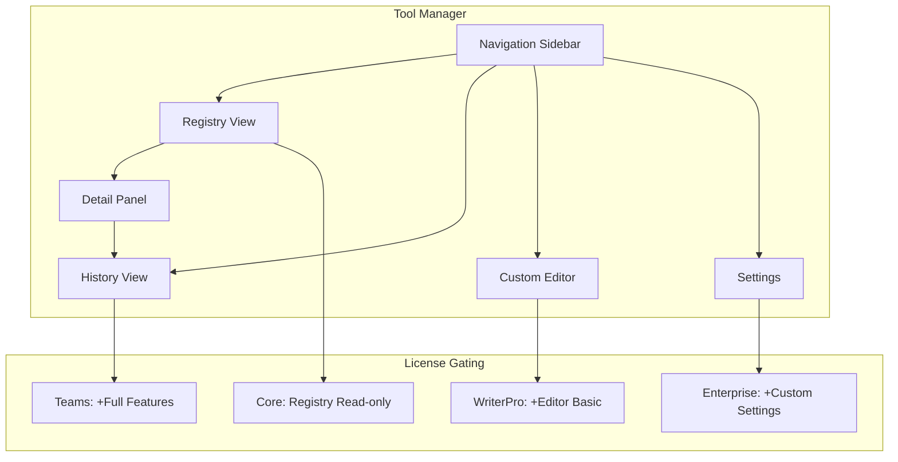

# LCS-SBD-v0.12.5f-UI: Tool Manager UI

## 1. Metadata & Categorization

| Field | Value |
| :--- | :--- |
| **Feature ID** | `TLS-UI-01` |
| **Feature Name** | Tool Manager UI |
| **Target Version** | v0.12.5f |
| **Module Scope** | `Lexichord.Modules.Agents.UI` |
| **Swimlane** | Agent Infrastructure |
| **License Tier** | WriterPro |
| **Feature Gate Key** | `FeatureFlags.Agents.Tools.ManagerUI` |
| **Author** | Agent Architecture Lead |
| **Reviewer** | UX Lead |
| **Status** | Draft |
| **Last Updated** | 2026-02-04 |
| **Estimated Hours** | 6 |

---

## 2. Executive Summary

### 2.1 The Requirement

Administrators and users require a visual interface to view available tools, monitor execution history, manage custom tool definitions, and configure tool settings. The UI MUST provide clear feedback on tool availability, license requirements, and execution status.

### 2.2 The Proposed Solution

Implement a comprehensive Tool Manager UI consisting of:

1. **Tool Registry View:** Browse and search available tools by category
2. **Tool Details Panel:** View tool definition, parameters, and constraints
3. **Execution History View:** Monitor past executions with filtering
4. **Custom Tool Editor:** Create and edit custom tool definitions (WriterPro+)
5. **Settings Panel:** Configure tool-level settings and sandbox policies
6. **License Indicator:** Clear display of tier requirements and upgrade prompts

---

## 3. Architecture & Modular Strategy

### 3.1 Dependencies

**Upstream Modules:**

| Dependency | Version | Purpose |
|:-----------|:--------|:--------|
| `IToolRegistry` | v0.12.5b | Tool listing and search |
| `IToolExecutor` | v0.12.5c | Execution history access |
| `IToolResultService` | v0.12.5e | Result retrieval |
| `ToolDefinition` | v0.12.5a | Definition display |
| `ILicenseContext` | v0.9.2 | Tier-based feature gating |

**NuGet Packages:**

- `Avalonia` — Cross-platform UI framework
- `CommunityToolkit.Mvvm` — MVVM framework

### 3.2 Licensing Behavior

**Load Behavior:**

- [x] **UI Gate:** UI components hidden/disabled by tier.

**Tier-Based Features:**

| Tier | Registry View | Details View | History View | Custom Editor | Settings |
|:-----|:--------------|:-------------|:-------------|:--------------|:---------|
| Core | Read-only | Basic | Session only | - | - |
| WriterPro | Read-only | Full | 7 days | Basic | Limited |
| Teams | Full | Full | 30 days | Advanced | Full |
| Enterprise | Full | Full | Custom | Full | Full |

---

## 4. Data Contract (The API)

### 4.1 ViewModels

```csharp
namespace Lexichord.Modules.Agents.UI.ViewModels;

/// <summary>
/// Main ViewModel for the Tool Manager interface.
/// </summary>
public partial class ToolManagerViewModel : ViewModelBase
{
    private readonly IToolRegistry _registry;
    private readonly IToolResultService _resultService;
    private readonly ILicenseContext _licenseContext;
    private readonly ILogger<ToolManagerViewModel> _logger;

    [ObservableProperty]
    private ObservableCollection<ToolListItemViewModel> _tools = new();

    [ObservableProperty]
    private ToolListItemViewModel? _selectedTool;

    [ObservableProperty]
    private ToolDetailViewModel? _selectedToolDetail;

    [ObservableProperty]
    private string _searchText = string.Empty;

    [ObservableProperty]
    private ToolCategory? _selectedCategory;

    [ObservableProperty]
    private bool _isLoading;

    [ObservableProperty]
    private bool _canCreateCustomTools;

    [ObservableProperty]
    private string _licenseMessage = string.Empty;

    /// <summary>
    /// Initializes a new instance of the <see cref="ToolManagerViewModel"/> class.
    /// </summary>
    public ToolManagerViewModel(
        IToolRegistry registry,
        IToolResultService resultService,
        ILicenseContext licenseContext,
        ILogger<ToolManagerViewModel> logger)
    {
        _registry = registry ?? throw new ArgumentNullException(nameof(registry));
        _resultService = resultService ?? throw new ArgumentNullException(nameof(resultService));
        _licenseContext = licenseContext ?? throw new ArgumentNullException(nameof(licenseContext));
        _logger = logger ?? throw new ArgumentNullException(nameof(logger));

        CanCreateCustomTools = _licenseContext.CurrentTier >= LicenseTier.WriterPro;
        UpdateLicenseMessage();
    }

    /// <summary>
    /// Gets the available tool categories for filtering.
    /// </summary>
    public IReadOnlyList<ToolCategory> Categories { get; } =
        Enum.GetValues<ToolCategory>().ToList();

    /// <summary>
    /// Loads tools from the registry.
    /// </summary>
    [RelayCommand]
    private async Task LoadToolsAsync()
    {
        IsLoading = true;

        try
        {
            _logger.LogDebug("[TLS-UI] Loading tools from registry");

            var query = new ToolSearchQuery
            {
                SearchText = string.IsNullOrWhiteSpace(SearchText) ? null : SearchText,
                Categories = SelectedCategory.HasValue ? new[] { SelectedCategory.Value } : null,
                IncludeUnavailable = true
            };

            var tools = await _registry.SearchAsync(query).ConfigureAwait(false);

            await Dispatcher.UIThread.InvokeAsync(() =>
            {
                Tools.Clear();
                foreach (var tool in tools)
                {
                    var isAvailable = IsToolAvailableForTier(tool.Definition);
                    Tools.Add(new ToolListItemViewModel(tool, isAvailable, _licenseContext.CurrentTier));
                }
            });

            _logger.LogInformation(
                "[TLS-UI] Loaded {Count} tools from registry",
                tools.Count);
        }
        catch (Exception ex)
        {
            _logger.LogError(ex, "[TLS-UI] Failed to load tools");
        }
        finally
        {
            IsLoading = false;
        }
    }

    /// <summary>
    /// Handles tool selection.
    /// </summary>
    partial void OnSelectedToolChanged(ToolListItemViewModel? value)
    {
        if (value != null)
        {
            SelectedToolDetail = new ToolDetailViewModel(value.Tool, _resultService, _licenseContext);
            _ = SelectedToolDetail.LoadHistoryAsync();
        }
        else
        {
            SelectedToolDetail = null;
        }
    }

    /// <summary>
    /// Searches tools based on current filter.
    /// </summary>
    partial void OnSearchTextChanged(string value)
    {
        _ = LoadToolsAsync();
    }

    /// <summary>
    /// Filters by category.
    /// </summary>
    partial void OnSelectedCategoryChanged(ToolCategory? value)
    {
        _ = LoadToolsAsync();
    }

    /// <summary>
    /// Opens the custom tool editor.
    /// </summary>
    [RelayCommand(CanExecute = nameof(CanCreateCustomTools))]
    private void CreateCustomTool()
    {
        _logger.LogDebug("[TLS-UI] Opening custom tool editor");
        // Navigate to custom tool editor
    }

    private bool IsToolAvailableForTier(ToolDefinition definition)
    {
        // Built-in tools have tier requirements; custom tools start at WriterPro
        return true; // Simplified; actual logic checks registration tier
    }

    private void UpdateLicenseMessage()
    {
        LicenseMessage = _licenseContext.CurrentTier switch
        {
            LicenseTier.Core => "Upgrade to WriterPro to create custom tools",
            LicenseTier.WriterPro => $"You can create up to 10 custom tools",
            LicenseTier.Teams => $"You can create up to 50 custom tools",
            LicenseTier.Enterprise => "Unlimited custom tools available",
            _ => string.Empty
        };
    }
}

/// <summary>
/// ViewModel for tool list items.
/// </summary>
public partial class ToolListItemViewModel : ViewModelBase
{
    public ITool Tool { get; }

    [ObservableProperty]
    private string _name;

    [ObservableProperty]
    private string _description;

    [ObservableProperty]
    private ToolCategory _category;

    [ObservableProperty]
    private bool _isAvailable;

    [ObservableProperty]
    private bool _requiresUpgrade;

    [ObservableProperty]
    private string _categoryIcon;

    [ObservableProperty]
    private string _tierBadge;

    public ToolListItemViewModel(ITool tool, bool isAvailable, LicenseTier currentTier)
    {
        Tool = tool;
        Name = tool.Definition.Name;
        Description = tool.Definition.Description;
        Category = tool.Definition.Category;
        IsAvailable = isAvailable;
        RequiresUpgrade = !isAvailable;
        CategoryIcon = GetCategoryIcon(tool.Definition.Category);
        TierBadge = GetTierBadge(tool.Definition, currentTier);
    }

    private static string GetCategoryIcon(ToolCategory category) => category switch
    {
        ToolCategory.FileSystem => "📁",
        ToolCategory.Network => "🌐",
        ToolCategory.Database => "🗄️",
        ToolCategory.CodeExecution => "⚡",
        ToolCategory.ExternalApi => "🔌",
        ToolCategory.Knowledge => "🧠",
        ToolCategory.Communication => "💬",
        ToolCategory.System => "⚙️",
        _ => "🔧"
    };

    private static string GetTierBadge(ToolDefinition def, LicenseTier current)
    {
        // Return tier badge if requires higher tier
        return string.Empty;
    }
}

/// <summary>
/// ViewModel for tool detail panel.
/// </summary>
public partial class ToolDetailViewModel : ViewModelBase
{
    private readonly ITool _tool;
    private readonly IToolResultService _resultService;
    private readonly ILicenseContext _licenseContext;

    [ObservableProperty]
    private string _name;

    [ObservableProperty]
    private string _description;

    [ObservableProperty]
    private ToolCategory _category;

    [ObservableProperty]
    private string _version;

    [ObservableProperty]
    private bool _requiresConfirmation;

    [ObservableProperty]
    private ObservableCollection<ParameterViewModel> _parameters = new();

    [ObservableProperty]
    private ObservableCollection<ExecutionHistoryItemViewModel> _executionHistory = new();

    [ObservableProperty]
    private ConstraintsViewModel? _constraints;

    [ObservableProperty]
    private bool _isHistoryLoading;

    public ToolDetailViewModel(
        ITool tool,
        IToolResultService resultService,
        ILicenseContext licenseContext)
    {
        _tool = tool;
        _resultService = resultService;
        _licenseContext = licenseContext;

        Name = tool.Definition.Name;
        Description = tool.Definition.Description;
        Category = tool.Definition.Category;
        Version = tool.Definition.Version ?? "1.0.0";
        RequiresConfirmation = tool.Definition.RequiresConfirmation;

        foreach (var param in tool.Definition.Parameters)
        {
            Parameters.Add(new ParameterViewModel(param));
        }

        if (tool.Definition.Constraints != null)
        {
            Constraints = new ConstraintsViewModel(tool.Definition.Constraints);
        }
    }

    /// <summary>
    /// Loads execution history for this tool.
    /// </summary>
    public async Task LoadHistoryAsync()
    {
        if (_licenseContext.CurrentTier < LicenseTier.WriterPro)
        {
            return; // History requires WriterPro+
        }

        IsHistoryLoading = true;

        try
        {
            var history = await _resultService.GetHistoryAsync(_tool.Definition.Name, 50).ConfigureAwait(false);

            await Dispatcher.UIThread.InvokeAsync(() =>
            {
                ExecutionHistory.Clear();
                foreach (var result in history)
                {
                    ExecutionHistory.Add(new ExecutionHistoryItemViewModel(result));
                }
            });
        }
        finally
        {
            IsHistoryLoading = false;
        }
    }
}

/// <summary>
/// ViewModel for parameter display.
/// </summary>
public class ParameterViewModel : ViewModelBase
{
    public string Name { get; }
    public string Description { get; }
    public string Type { get; }
    public bool Required { get; }
    public string? DefaultValue { get; }

    public ParameterViewModel(ToolParameter parameter)
    {
        Name = parameter.Name;
        Description = parameter.Description;
        Type = parameter.Type.ToString();
        Required = parameter.Required;
        DefaultValue = parameter.Default?.ToString();
    }
}

/// <summary>
/// ViewModel for constraints display.
/// </summary>
public class ConstraintsViewModel : ViewModelBase
{
    public string MaxExecutionTime { get; }
    public string MaxOutputSize { get; }
    public string IsolationLevel { get; }
    public bool AllowsSideEffects { get; }

    public ConstraintsViewModel(ToolConstraints constraints)
    {
        MaxExecutionTime = constraints.MaxExecutionTime?.ToString(@"mm\:ss") ?? "60s";
        MaxOutputSize = FormatBytes(constraints.MaxOutputSize ?? 10 * 1024 * 1024);
        IsolationLevel = constraints.RequiredIsolation.ToString();
        AllowsSideEffects = constraints.AllowSideEffects;
    }

    private static string FormatBytes(long bytes) =>
        bytes switch
        {
            < 1024 => $"{bytes} B",
            < 1024 * 1024 => $"{bytes / 1024} KB",
            _ => $"{bytes / (1024 * 1024)} MB"
        };
}

/// <summary>
/// ViewModel for execution history items.
/// </summary>
public class ExecutionHistoryItemViewModel : ViewModelBase
{
    public Guid ExecutionId { get; }
    public DateTimeOffset Timestamp { get; }
    public string Status { get; }
    public string StatusColor { get; }
    public string Duration { get; }
    public string? ErrorMessage { get; }

    public ExecutionHistoryItemViewModel(ToolResult result)
    {
        ExecutionId = result.Metadata.ExecutionId;
        Timestamp = result.Metadata.StartedAt;
        Status = result.Status.ToString();
        StatusColor = GetStatusColor(result.Status);
        Duration = $"{result.Metadata.Duration.TotalMilliseconds:F0}ms";
        ErrorMessage = result.ErrorMessage;
    }

    private static string GetStatusColor(ToolExecutionStatus status) => status switch
    {
        ToolExecutionStatus.Success => "#22c55e",
        ToolExecutionStatus.Failed => "#ef4444",
        ToolExecutionStatus.Timeout => "#f59e0b",
        ToolExecutionStatus.Cancelled => "#6b7280",
        _ => "#6b7280"
    };
}
```

---

## 5. Implementation Logic

### 5.1 UI Navigation Flow



### 5.2 Component Layout

```
┌─────────────────────────────────────────────────────────────────────┐
│ Tool Manager                                               [X]      │
├────────────┬────────────────────────────────────────────────────────┤
│            │ Search: [________________] Category: [All v]           │
│ Navigation │                                                        │
│            │ ┌─────────────────────────────────────────────────────┐│
│ □ Registry │ │ read_file        📁 FileSystem     Available       ││
│ □ History  │ │ Read the contents of a file from the filesystem    ││
│ □ Custom   │ ├─────────────────────────────────────────────────────┤│
│ □ Settings │ │ write_file       📁 FileSystem     Available       ││
│            │ │ Write or append content to a file                  ││
│            │ ├─────────────────────────────────────────────────────┤│
│            │ │ send_message     💬 Communication  🔒 Teams        ││
│            │ │ Send messages to external services                 ││
│            │ └─────────────────────────────────────────────────────┘│
├────────────┴────────────────────────────────────────────────────────┤
│ Tool Details                                                        │
│ ┌───────────────────────────────────────────────────────────────────┤
│ │ read_file                                           v1.0.0       │
│ │ Read the contents of a file from the filesystem                  │
│ │                                                                   │
│ │ Parameters                                                        │
│ │ ┌───────────┬──────────┬──────────┬──────────────────────────┐  │
│ │ │ Name      │ Type     │ Required │ Description              │  │
│ │ ├───────────┼──────────┼──────────┼──────────────────────────┤  │
│ │ │ path      │ String   │ Yes      │ The file path to read    │  │
│ │ │ encoding  │ String   │ No       │ File encoding (utf-8)    │  │
│ │ └───────────┴──────────┴──────────┴──────────────────────────┘  │
│ │                                                                   │
│ │ Execution History (Last 7 days)                                   │
│ │ ┌────────────────────────────┬──────────┬──────────────────────┐│
│ │ │ Timestamp                   │ Status   │ Duration             ││
│ │ ├────────────────────────────┼──────────┼──────────────────────┤│
│ │ │ 2026-02-04 10:30:15        │ ✅ Success│ 45ms                 ││
│ │ │ 2026-02-04 10:28:02        │ ❌ Failed │ 12ms                 ││
│ │ └────────────────────────────┴──────────┴──────────────────────┘│
│ └───────────────────────────────────────────────────────────────────┤
└─────────────────────────────────────────────────────────────────────┘
```

---

## 6. UI/UX Specifications

### 6.1 Visual Components

**Registry View:**
- DataGrid with columns: Icon, Name, Category, Status, Tier Badge
- Search input with debounced filtering
- Category dropdown filter
- "Create Custom Tool" button (disabled for Core)

**Tool Details Panel:**
- Header with tool name, version, category icon
- Parameters table with type indicators
- Constraints section with limits displayed
- Execution history list (collapsible)

**Custom Tool Editor:**
- Form fields for all ToolDefinition properties
- Parameter builder with add/remove
- JSON schema editor for output schema
- Validation feedback in real-time
- Save/Cancel buttons

### 6.2 Accessibility (A11y)

- All interactive elements MUST be keyboard accessible
- Tool list MUST support arrow key navigation
- Status indicators MUST have text alternatives
- Category icons MUST have aria-labels
- Loading states MUST be announced to screen readers
- Focus MUST be managed on panel transitions

### 6.3 Responsive Behavior

- Tool list and detail panel in side-by-side layout for wide screens
- Stack vertically on narrow screens
- Collapsible navigation on mobile
- Touch-friendly tap targets (44x44px minimum)

---

## 7. Observability & Logging

**Structured Log Messages:**

```csharp
// Loading tools
_logger.LogDebug("[TLS-UI] Loading tools from registry");

// Tools loaded
_logger.LogInformation(
    "[TLS-UI] Loaded {Count} tools from registry",
    tools.Count);

// Tool selected
_logger.LogDebug(
    "[TLS-UI] Tool selected. Name: {ToolName}",
    tool.Definition.Name);

// Custom tool editor opened
_logger.LogDebug("[TLS-UI] Opening custom tool editor");

// Custom tool saved
_logger.LogInformation(
    "[TLS-UI] Custom tool saved. Name: {ToolName}",
    toolName);

// Error loading
_logger.LogError(ex, "[TLS-UI] Failed to load tools");
```

**Metrics:**

| Metric | Type | Description |
|:-------|:-----|:------------|
| `tools.ui.page_loads` | Counter | Tool manager page loads |
| `tools.ui.searches` | Counter | Search operations |
| `tools.ui.tool_views` | Counter | Tool detail views |
| `tools.ui.custom_created` | Counter | Custom tools created via UI |
| `tools.ui.load_time` | Histogram | Page load time |

---

## 8. Security & Safety

| Concern | Mitigation |
|:--------|:-----------|
| Unauthorized custom tool creation | License check before editor access |
| Sensitive data in history | Filter sensitive parameters in display |
| XSS in tool names | HTML encoding in all displays |
| CSRF on tool operations | Anti-forgery tokens on forms |

---

## 9. Acceptance Criteria (QA)

1. **[Functional]** Registry view displays all available tools
2. **[Functional]** Search filters tools by name and description
3. **[Functional]** Category filter shows only matching tools
4. **[Functional]** Tool selection shows detail panel
5. **[Functional]** Parameters table displays all tool parameters
6. **[Functional]** Execution history shows recent executions
7. **[Licensing]** Core users cannot access custom editor
8. **[Licensing]** History limited by tier retention
9. **[A11y]** All components keyboard navigable
10. **[Performance]** Page load <500ms with 100 tools

---

## 10. Unit Tests

```csharp
namespace Lexichord.Modules.Agents.Tests.Unit.UI;

using FluentAssertions;
using Lexichord.Modules.Agents.Abstractions;
using Lexichord.Modules.Agents.UI.ViewModels;
using Microsoft.Extensions.Logging.Abstractions;
using Moq;
using Xunit;

public class ToolManagerViewModelTests
{
    private readonly Mock<IToolRegistry> _registryMock = new();
    private readonly Mock<IToolResultService> _resultServiceMock = new();
    private readonly Mock<ILicenseContext> _licenseMock = new();
    private readonly ToolManagerViewModel _viewModel;

    public ToolManagerViewModelTests()
    {
        _licenseMock.Setup(l => l.CurrentTier).Returns(LicenseTier.Teams);

        _viewModel = new ToolManagerViewModel(
            _registryMock.Object,
            _resultServiceMock.Object,
            _licenseMock.Object,
            NullLogger<ToolManagerViewModel>.Instance);
    }

    [Fact]
    public async Task LoadToolsAsync_PopulatesToolsList()
    {
        // Arrange
        var tools = new List<ITool>
        {
            CreateMockTool("tool_1"),
            CreateMockTool("tool_2")
        };

        _registryMock.Setup(r => r.SearchAsync(It.IsAny<ToolSearchQuery>(), It.IsAny<CancellationToken>()))
            .ReturnsAsync(tools);

        // Act
        await _viewModel.LoadToolsCommand.ExecuteAsync(null);

        // Assert
        _viewModel.Tools.Should().HaveCount(2);
    }

    [Fact]
    public void CanCreateCustomTools_TrueForWriterPro()
    {
        // Arrange
        _licenseMock.Setup(l => l.CurrentTier).Returns(LicenseTier.WriterPro);

        // Act
        var vm = new ToolManagerViewModel(
            _registryMock.Object,
            _resultServiceMock.Object,
            _licenseMock.Object,
            NullLogger<ToolManagerViewModel>.Instance);

        // Assert
        vm.CanCreateCustomTools.Should().BeTrue();
    }

    [Fact]
    public void CanCreateCustomTools_FalseForCore()
    {
        // Arrange
        _licenseMock.Setup(l => l.CurrentTier).Returns(LicenseTier.Core);

        // Act
        var vm = new ToolManagerViewModel(
            _registryMock.Object,
            _resultServiceMock.Object,
            _licenseMock.Object,
            NullLogger<ToolManagerViewModel>.Instance);

        // Assert
        vm.CanCreateCustomTools.Should().BeFalse();
    }

    private static ITool CreateMockTool(string name)
    {
        var mock = new Mock<ITool>();
        mock.Setup(t => t.Definition).Returns(new ToolDefinition
        {
            Name = name,
            Description = $"Description for {name}",
            Category = ToolCategory.System
        });
        return mock.Object;
    }
}
```

---

## 11. Changelog

| Date | Version | Changes |
|:-----|:--------|:--------|
| 2026-02-04 | 1.0.0 | Initial specification |

---

**End of Specification**
