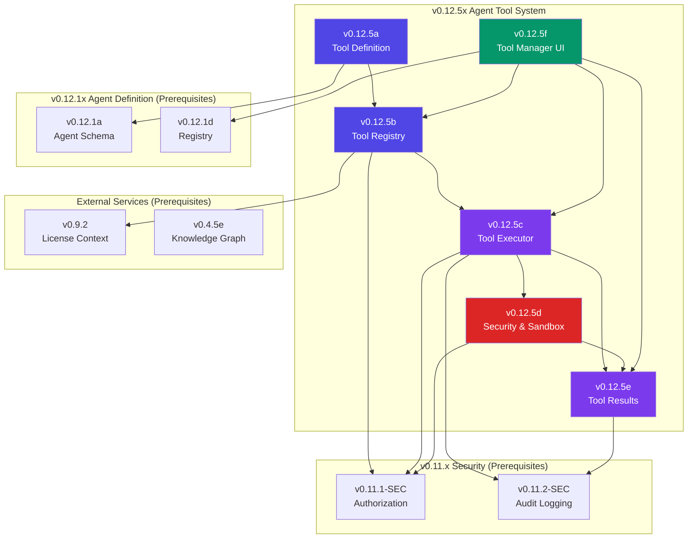

# v0.12.5x Sub-Part Index — Agent Tool System

## Document Control

| Field            | Value                                                        |
| :--------------- | :----------------------------------------------------------- |
| **Document ID**  | LCS-SBD-v0.12.5x-INDEX                                       |
| **Version**      | v0.12.5                                                      |
| **Codename**     | Agent Tool System Sub-Part Index                             |
| **Status**       | Draft                                                        |
| **Last Updated** | 2026-02-04                                                   |
| **Owner**        | Agent Architecture Lead                                      |
| **Parent Spec**  | [LCS-SBD-v0.12.5-AGT](./LCS-SBD-v0.12.5-AGT.md)              |

---

## 1. Overview

This document serves as the master index for all v0.12.5x sub-part specifications implementing the **Agent Tool System**. The Tool System provides a comprehensive framework for defining, registering, executing, and managing tools that agents can access and invoke. Tools are executed within controlled sandbox environments with full audit trails and license-based availability.

### 1.1 Design Philosophy

The Tool System follows these core principles:

1. **Declarative Definition:** Tools defined with complete schemas, parameters, and constraints
2. **Centralized Registry:** Single source of truth for tool discovery and availability
3. **Sandboxed Execution:** Isolated environments prevent malicious code from affecting the system
4. **License-Gated Access:** Tool availability controlled by license tier
5. **Complete Auditability:** All tool invocations logged with inputs, outputs, and outcomes
6. **Extensibility:** Support for built-in tools and custom tool registration

---

## 2. Sub-Part Registry

| Sub-Part | Document | Feature ID | Title | Est. Hours | Status |
|:---------|:---------|:-----------|:------|:-----------|:-------|
| v0.12.5a | [LCS-SBD-v0.12.5a-DEF](./LCS-SBD-v0.12.5a-DEF.md) | `TLS-DEF-01` | Tool Definition Schema | 8 | Draft |
| v0.12.5b | [LCS-SBD-v0.12.5b-REG](./LCS-SBD-v0.12.5b-REG.md) | `TLS-REG-01` | Tool Registry | 8 | Draft |
| v0.12.5c | [LCS-SBD-v0.12.5c-EXE](./LCS-SBD-v0.12.5c-EXE.md) | `TLS-EXE-01` | Tool Executor | 12 | Draft |
| v0.12.5d | [LCS-SBD-v0.12.5d-SEC](./LCS-SBD-v0.12.5d-SEC.md) | `TLS-SEC-01` | Tool Security & Sandbox | 10 | Draft |
| v0.12.5e | [LCS-SBD-v0.12.5e-RES](./LCS-SBD-v0.12.5e-RES.md) | `TLS-RES-01` | Tool Results | 6 | Draft |
| v0.12.5f | [LCS-SBD-v0.12.5f-UI](./LCS-SBD-v0.12.5f-UI.md) | `TLS-UI-01` | Tool Manager UI | 6 | Draft |
| **Total** | | | | **50 hours** | |

---

## 3. Feature Gate Keys

| Sub-Part | Feature Gate Key | License Tier |
|:---------|:-----------------|:-------------|
| v0.12.5a | `FeatureFlags.Agents.Tools.Definition` | Core |
| v0.12.5b | `FeatureFlags.Agents.Tools.Registry` | Core |
| v0.12.5c | `FeatureFlags.Agents.Tools.Executor` | Core |
| v0.12.5d | `FeatureFlags.Agents.Tools.Sandbox` | Teams |
| v0.12.5e | `FeatureFlags.Agents.Tools.Results` | Core |
| v0.12.5f | `FeatureFlags.Agents.Tools.ManagerUI` | WriterPro |

### Tool Capabilities by Tier

| Tier | Built-In Tools | Custom Tools | Sandbox Level | Batch Execution | Tool Manager UI |
|:-----|:---------------|:-------------|:--------------|:----------------|:----------------|
| **Core** | 5 tools | 0 | Standard | Sequential only | - |
| **WriterPro** | 5 tools | +10 custom | Standard | Sequential | Basic |
| **Teams** | 8 tools | +50 custom | Standard + Strict | Sequential + Parallel | Advanced |
| **Enterprise** | 8 tools | Unlimited | All levels + Custom | Full | Full |

### Built-In Tool Availability

| Tool | Category | Core | WriterPro | Teams | Enterprise |
|:-----|:---------|:-----|:----------|:------|:-----------|
| `read_file` | FileSystem | ✓ | ✓ | ✓ | ✓ |
| `write_file` | FileSystem | ✓ | ✓ | ✓ | ✓ |
| `search_knowledge` | Knowledge | ✓ | ✓ | ✓ | ✓ |
| `web_fetch` | Network | ✓ | ✓ | ✓ | ✓ |
| `execute_ckvs_query` | Database | ✓ | ✓ | ✓ | ✓ |
| `send_message` | Communication | - | - | ✓ | ✓ |
| `create_entity` | Knowledge | - | - | ✓ | ✓ |
| `validate_content` | System | - | - | ✓ | ✓ |

---

## 4. Dependency Graph



---

## 5. Implementation Order

The sub-parts MUST be implemented in this order due to dependencies:

```
Phase 1: Foundation
├── v0.12.5a (Tool Definition Schema) ────────────────── 8 hours
│   └── Provides: ITool, ToolDefinition, ToolCategory, ToolParameter, ToolConstraints
│
├── v0.12.5b (Tool Registry) ─────────────────────────── 8 hours
│   └── Provides: IToolRegistry, ToolRegistration, tool discovery
│   └── Requires: v0.12.5a, v0.9.2 License, v0.11.1-SEC Authorization
│
Phase 2: Execution
├── v0.12.5c (Tool Executor) ─────────────────────────── 12 hours
│   └── Provides: IToolExecutor, ToolInput, ToolExecutionOptions
│   └── Requires: v0.12.5a, v0.12.5b, v0.11.1-SEC, v0.11.2-SEC
│
├── v0.12.5d (Security & Sandbox) ────────────────────── 10 hours
│   └── Provides: IToolSandbox, SandboxOptions, SandboxIsolationLevel
│   └── Requires: v0.12.5c, v0.11.1-SEC
│
Phase 3: Results
├── v0.12.5e (Tool Results) ──────────────────────────── 6 hours
│   └── Provides: ToolResult, ToolResultMetadata, ToolExecutionStatus
│   └── Requires: v0.12.5c, v0.12.5d, v0.11.2-SEC
│
Phase 4: Observability
└── v0.12.5f (Tool Manager UI) ───────────────────────── 6 hours
    └── Provides: Tool management dashboard, execution history
    └── Requires: v0.12.5b, v0.12.5c, v0.12.5e
```

---

## 6. Interface Summary

### 6.1 Core Interfaces

| Interface | Sub-Part | Module | Purpose |
|:----------|:---------|:-------|:--------|
| `ITool` | v0.12.5a | `Lexichord.Modules.Agents.Abstractions` | Tool execution contract |
| `IToolRegistry` | v0.12.5b | `Lexichord.Modules.Agents.Core` | Tool registration and discovery |
| `IToolExecutor` | v0.12.5c | `Lexichord.Modules.Agents.Core` | Tool execution orchestration |
| `IToolSandbox` | v0.12.5d | `Lexichord.Modules.Agents.Core` | Sandboxed code execution |

### 6.2 Records & Enums

| Type | Sub-Part | Module | Purpose |
|:-----|:---------|:-------|:--------|
| `ToolDefinition` | v0.12.5a | Abstractions | Complete tool schema with parameters |
| `ToolCategory` | v0.12.5a | Abstractions | FileSystem/Network/Database/CodeExecution/etc. |
| `ToolParameter` | v0.12.5a | Abstractions | Tool parameter definition |
| `ToolParameterType` | v0.12.5a | Abstractions | String/Integer/Number/Boolean/Array/Object |
| `ToolConstraints` | v0.12.5a | Abstractions | Execution time, output size, isolation level |
| `SandboxIsolationLevel` | v0.12.5a | Abstractions | None/Standard/Strict/Restricted |
| `ToolRegistration` | v0.12.5b | Abstractions | Registration result record |
| `ToolInput` | v0.12.5c | Abstractions | Tool execution input with parameters |
| `ToolExecutionOptions` | v0.12.5c | Abstractions | Timeout, confirmation, context |
| `ToolExecutionEvent` | v0.12.5c | Abstractions | Execution progress event |
| `ToolExecutionEventType` | v0.12.5c | Abstractions | Started/InProgress/Completed/Failed/etc. |
| `SandboxOptions` | v0.12.5d | Abstractions | Allowed paths/hosts, resource limits |
| `SandboxExecutionResult` | v0.12.5d | Abstractions | Sandbox execution outcome |
| `SandboxResourceMetrics` | v0.12.5d | Abstractions | Memory/CPU/IO usage metrics |
| `ToolResult` | v0.12.5e | Abstractions | Execution result with output and metadata |
| `ToolResultMetadata` | v0.12.5e | Abstractions | Timing, resource usage, sandbox ID |
| `ToolExecutionStatus` | v0.12.5e | Abstractions | Success/Failed/Timeout/Cancelled/etc. |

---

## 7. Database Schema Overview

### 7.1 Tables Introduced

| Table | Sub-Part | Purpose |
|:------|:---------|:--------|
| `tool_definitions` | v0.12.5a | Custom tool definitions storage |
| `tool_registrations` | v0.12.5b | Tool registration records |
| `tool_executions` | v0.12.5c | Tool execution history |
| `sandbox_configurations` | v0.12.5d | Custom sandbox configurations |
| `tool_execution_results` | v0.12.5e | Stored tool results with metrics |

### 7.2 Migration Sequence

```
Migration_20260204_001_CreateToolDefinitions        (v0.12.5a)
Migration_20260204_002_CreateToolRegistrations      (v0.12.5b)
Migration_20260204_003_CreateToolExecutions         (v0.12.5c)
Migration_20260204_004_CreateSandboxConfigurations  (v0.12.5d)
Migration_20260204_005_CreateToolExecutionResults   (v0.12.5e)
```

---

## 8. MediatR Events

| Event | Sub-Part | Published When |
|:------|:---------|:---------------|
| `ToolDefinitionCreatedEvent` | v0.12.5a | Custom tool definition created |
| `ToolDefinitionUpdatedEvent` | v0.12.5a | Tool definition modified |
| `ToolDefinitionDeletedEvent` | v0.12.5a | Tool definition removed |
| `ToolRegisteredEvent` | v0.12.5b | Tool registered in registry |
| `ToolUnregisteredEvent` | v0.12.5b | Tool unregistered from registry |
| `ToolDiscoveryCompletedEvent` | v0.12.5b | Tool search completed |
| `ToolExecutionStartedEvent` | v0.12.5c | Tool execution initiated |
| `ToolExecutionCompletedEvent` | v0.12.5c | Tool execution finished |
| `ToolExecutionFailedEvent` | v0.12.5c | Tool execution failed |
| `ToolExecutionTimeoutEvent` | v0.12.5c | Tool execution timed out |
| `BatchExecutionStartedEvent` | v0.12.5c | Batch execution initiated |
| `BatchExecutionCompletedEvent` | v0.12.5c | Batch execution finished |
| `SandboxCreatedEvent` | v0.12.5d | Sandbox instance created |
| `SandboxDestroyedEvent` | v0.12.5d | Sandbox instance destroyed |
| `SandboxResourceLimitReachedEvent` | v0.12.5d | Sandbox hit resource limit |
| `SandboxSecurityViolationEvent` | v0.12.5d | Security policy violated |
| `ToolResultStoredEvent` | v0.12.5e | Result stored for history |
| `ToolResultValidationFailedEvent` | v0.12.5e | Result failed schema validation |

---

## 9. Performance Targets

| Metric | Target | Sub-Part |
|:-------|:-------|:---------|
| Tool definition parse | <5ms P95 | v0.12.5a |
| Parameter validation | <10ms P95 | v0.12.5a |
| Tool lookup | <5ms P95 | v0.12.5b |
| Registry search | <20ms P95 | v0.12.5b |
| Tool registration | <50ms P95 | v0.12.5b |
| Single tool execution | <500ms P95 | v0.12.5c |
| Batch execution (10 tools) | <5s P95 | v0.12.5c |
| Sandbox initialization | <100ms P95 | v0.12.5d |
| Sandbox teardown | <50ms P95 | v0.12.5d |
| Sandbox memory overhead | <50MB | v0.12.5d |
| Result validation | <10ms P95 | v0.12.5e |
| Result serialization | <5ms P95 | v0.12.5e |
| Tool Manager UI load | <500ms P95 | v0.12.5f |

---

## 10. Testing Requirements

### 10.1 Unit Test Coverage

| Sub-Part | Minimum Coverage | Key Test Areas |
|:---------|:-----------------|:---------------|
| v0.12.5a | 90% | Schema validation, parameter parsing, constraint checking |
| v0.12.5b | 90% | Registration, lookup, category filtering, license gating |
| v0.12.5c | 90% | Execution flow, timeout handling, batch execution |
| v0.12.5d | 95% | Sandbox isolation, resource limits, security enforcement |
| v0.12.5e | 85% | Result construction, status mapping, metadata capture |
| v0.12.5f | 75% | ViewModel logic, data binding, state management |

### 10.2 Integration Test Scenarios

1. **Tool definition lifecycle:** Create → Update → Delete with validation at each step
2. **Registry operations:** Register built-in → Register custom → Search → Unregister
3. **Full execution flow:** Authorize → Validate → Sandbox → Execute → Audit
4. **Sandbox isolation:** Execute malicious code → Verify containment → Check resource limits
5. **Batch execution:** Queue 10 tools → Execute → Verify ordering → Collect results
6. **License enforcement:** Attempt enterprise tool on Core tier → Verify denial

---

## 11. Cross-References

### 11.1 Upstream Dependencies

| Dependency | Version | Usage |
|:-----------|:--------|:------|
| `IAgentDefinition` | v0.12.1a | Agent tool requirements specification |
| `AgentId` | v0.12.1a | Tool execution agent identity |
| `IAgentRegistry` | v0.12.1d | Agent lookup for tool permissions |
| `IAuthorizationService` | v0.11.1-SEC | Permission checks before execution |
| `IAuditLogService` | v0.11.2-SEC | Audit logging of all tool invocations |
| `ILicenseContext` | v0.9.2 | License-based tool availability |
| `IGraphRepository` | v0.4.5e | Knowledge graph tool integration |
| `IMediator` | v0.0.7a | Tool execution event publishing |

### 11.2 Downstream Consumers

| Consumer | Version | Usage |
|:---------|:--------|:------|
| Agent Reasoning | v0.12.6 | Tool invocation from agent logic |
| Orchestration | v0.13.x | Multi-agent tool coordination |
| Workflows | v0.14.x | Tool-based workflow steps |

---

## 12. Security Considerations

| Concern | Sub-Part | Mitigation |
|:--------|:---------|:-----------|
| Arbitrary code execution | v0.12.5d | Process-based sandbox with capability restrictions |
| Resource exhaustion | v0.12.5d | Memory, CPU, and I/O limits per execution |
| Unauthorized tool access | v0.12.5b, v0.12.5c | Permission checks + license validation |
| Data leakage | v0.12.5d | Network and filesystem whitelisting |
| Parameter injection | v0.12.5a | Schema validation, input sanitization |
| Confirmation bypass | v0.12.5c | Confirmation state tracked and enforced |
| Supply chain attacks | v0.12.5a | Tool definitions signed and versioned |

---

## 13. Changelog

| Date | Version | Changes |
|:-----|:--------|:--------|
| 2026-02-04 | 1.0.0 | Initial sub-part index creation |

---

**End of Index Document**
