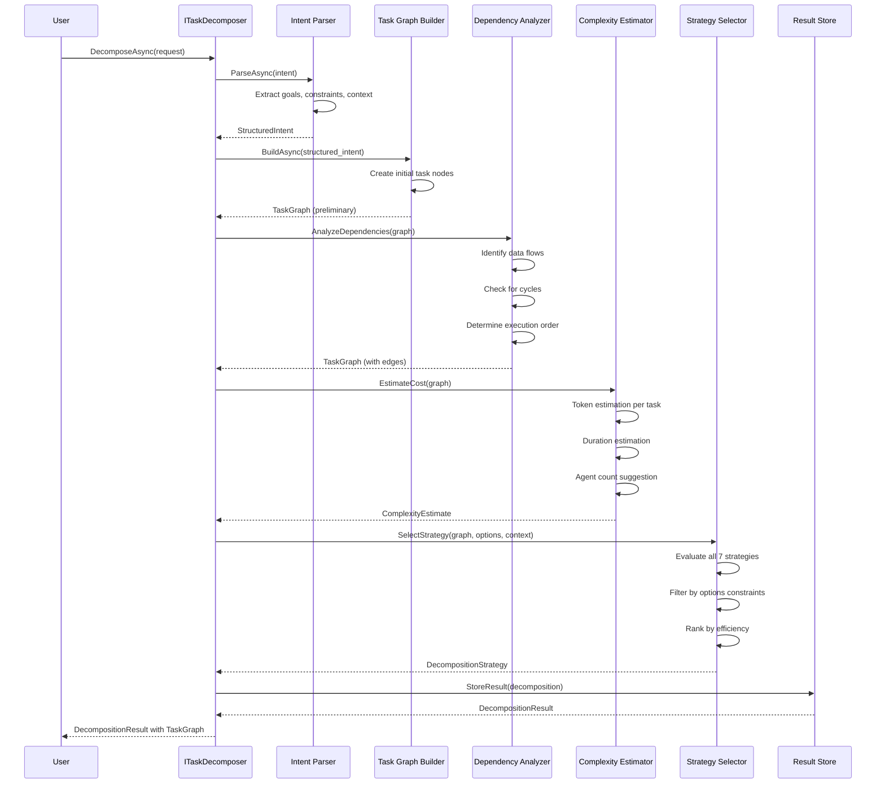

# LCS-SBD-v0.13.1-ORC: Scope Overview — Task Decomposition Engine

## Document Control

| Field            | Value                                                        |
| :--------------- | :----------------------------------------------------------- |
| **Document ID**  | LCS-SBD-v0.13.1-ORC                                          |
| **Version**      | v0.13.1                                                      |
| **Codename**     | Task Decomposition Engine (Orchestration Phase 2)            |
| **Status**       | Draft                                                        |
| **Last Updated** | 2026-01-31                                                   |
| **Owner**        | Orchestration Architecture Lead                              |
| **Depends On**   | v0.12.1-AGT (Agent Definition), v0.6.1a (LLM Integration), v0.11.1-SEC (Authorization) |

---

## 1. Executive Summary

### 1.1 The Vision

**v0.13.1-ORC** delivers **Task Decomposition Engine** — the critical orchestration component that parses complex user intent and intelligently decomposes requests into structured task graphs with explicit dependencies. This establishes:

- A natural language intent parser that extracts goals and constraints from user input
- Intelligent task graph construction with explicit dependency declarations
- Sophisticated dependency analysis ensuring correct execution ordering
- Complexity estimation for resource planning and budget allocation
- Multiple decomposition strategies (Sequential, Parallel, Hierarchical, Pipeline, MapReduce, Iterative, Adaptive)
- Visual UI preview of generated task graphs for validation and refinement

This is the orchestration foundation—without intelligent decomposition, the system cannot scale beyond simple linear tasks.

### 1.2 Business Value

- **Scalability:** Enable complex multi-task workflows without explicit user orchestration.
- **Predictability:** Estimate token usage, execution time, and required resources before execution.
- **Control:** Multiple strategies allow tuning for latency, cost, or parallelism trade-offs.
- **Transparency:** Visual decomposition preview builds user confidence in task planning.
- **Safety:** Explicit dependencies and validation prevent race conditions and data inconsistency.
- **Optimization:** Adaptive strategies automatically optimize for execution environment.

### 1.3 Success Criteria

1. Intent parser accurately extracts goals from natural language with >85% precision.
2. Task graph builder creates valid DAGs with correct dependency declarations.
3. All seven decomposition strategies produce correct execution plans.
4. Complexity estimator predictions are within ±25% of actual execution.
5. Decomposition preview UI renders task graphs with interactive dependency visualization.
6. Intent decomposition completes in <2s (P95) even for complex requests.
7. System prevents cyclic dependencies in all decompositions.

---

## 2. Key Deliverables

### 2.1 Sub-Parts

| Sub-Part | Title | Description | Est. Hours |
|:---------|:------|:------------|:-----------|
| v0.13.1a | Intent Parser | Parse natural language intent into structured goals | 10 |
| v0.13.1b | Task Graph Builder | Build DAG of tasks with dependencies | 12 |
| v0.13.1c | Dependency Analyzer | Analyze task dependencies and ordering | 10 |
| v0.13.1d | Complexity Estimator | Estimate tokens, time, agent count | 8 |
| v0.13.1e | Decomposition Strategies | Sequential/Parallel/Hierarchical/Pipeline/MapReduce/Iterative/Adaptive | 8 |
| v0.13.1f | Decomposition Preview UI | Visual preview of task graph | 8 |
| **Total** | | | **56 hours** |

### 2.2 Core Interfaces

```csharp
/// <summary>
/// Main interface for task decomposition orchestration.
/// Decomposes complex user intent into structured task execution plans.
/// </summary>
public interface ITaskDecomposer
{
    /// <summary>
    /// Decompose a user intent into a structured task graph.
    /// </summary>
    Task<DecompositionResult> DecomposeAsync(
        DecompositionRequest request,
        CancellationToken ct = default);

    /// <summary>
    /// Refine an existing decomposition with additional constraints or feedback.
    /// </summary>
    Task<DecompositionResult> RefineAsync(
        string decompositionId,
        DecompositionRefinement refinement,
        CancellationToken ct = default);

    /// <summary>
    /// Get available decomposition strategies for a given request.
    /// </summary>
    Task<IReadOnlyList<DecompositionStrategyInfo>> GetStrategiesAsync(
        DecompositionRequest request,
        CancellationToken ct = default);
}

/// <summary>
/// Request to decompose a user intent into tasks.
/// </summary>
public record DecompositionRequest
{
    /// <summary>
    /// The user's intent in natural language.
    /// </summary>
    public required string Intent { get; init; }

    /// <summary>
    /// Decomposition options and constraints.
    /// </summary>
    public DecompositionOptions Options { get; init; } = new();

    /// <summary>
    /// Context about the execution environment.
    /// </summary>
    public DecompositionContext? Context { get; init; }

    /// <summary>
    /// IDs of relevant entities for task context.
    /// </summary>
    public IReadOnlyList<string>? RelevantEntityIds { get; init; }

    /// <summary>
    /// Relevant documents or snippets for reference.
    /// </summary>
    public IReadOnlyList<RelevantDocument>? RelevantDocuments { get; init; }
}

/// <summary>
/// Options controlling decomposition behavior.
/// </summary>
public record DecompositionOptions
{
    /// <summary>
    /// Maximum nesting depth for hierarchical decompositions.
    /// </summary>
    public int MaxDepth { get; init; } = 5;

    /// <summary>
    /// Maximum number of tasks to generate.
    /// </summary>
    public int MaxTasks { get; init; } = 20;

    /// <summary>
    /// Preferred decomposition strategy (null = auto-select).
    /// </summary>
    public DecompositionStrategy? PreferredStrategy { get; init; }

    /// <summary>
    /// Include validation tasks in the decomposition.
    /// </summary>
    public bool IncludeValidationTasks { get; init; } = true;

    /// <summary>
    /// Include review/approval tasks in the decomposition.
    /// </summary>
    public bool IncludeReviewTasks { get; init; } = false;

    /// <summary>
    /// Token budget for entire decomposition (0 = unlimited).
    /// </summary>
    public int Budget { get; init; } = 0;
}

/// <summary>
/// Result of decomposing a user intent.
/// </summary>
public record DecompositionResult
{
    /// <summary>
    /// Unique identifier for this decomposition.
    /// </summary>
    public required string Id { get; init; }

    /// <summary>
    /// The original user intent.
    /// </summary>
    public required string OriginalIntent { get; init; }

    /// <summary>
    /// The resulting task graph.
    /// </summary>
    public required TaskGraph Graph { get; init; }

    /// <summary>
    /// The strategy used for this decomposition.
    /// </summary>
    public required DecompositionStrategy StrategyUsed { get; init; }

    /// <summary>
    /// Complexity estimate for the full decomposition.
    /// </summary>
    public required ComplexityEstimate Estimate { get; init; }

    /// <summary>
    /// Warnings or notes about the decomposition.
    /// </summary>
    public IReadOnlyList<string> Warnings { get; init; } = [];

    /// <summary>
    /// Confidence score (0.0-1.0) in this decomposition.
    /// </summary>
    public float Confidence { get; init; } = 0.8f;

    /// <summary>
    /// Creation timestamp.
    /// </summary>
    public DateTimeOffset CreatedAt { get; init; } = DateTimeOffset.UtcNow;
}

/// <summary>
/// A directed acyclic graph of tasks with dependencies.
/// </summary>
public record TaskGraph
{
    /// <summary>
    /// All task nodes in this graph.
    /// </summary>
    public required IReadOnlyList<TaskNode> Nodes { get; init; }

    /// <summary>
    /// All edges (dependencies) between tasks.
    /// </summary>
    public required IReadOnlyList<TaskEdge> Edges { get; init; }

    /// <summary>
    /// Nodes with no incoming dependencies (entry points).
    /// </summary>
    public IReadOnlyList<string>? RootNodes { get; init; }

    /// <summary>
    /// Nodes with no outgoing dependencies (terminal nodes).
    /// </summary>
    public IReadOnlyList<string>? LeafNodes { get; init; }

    /// <summary>
    /// Get immediate dependencies for a task.
    /// </summary>
    public IReadOnlyList<string> GetDependencies(string taskId)
    {
        return Edges
            .Where(e => e.To == taskId)
            .Select(e => e.From)
            .ToList();
    }

    /// <summary>
    /// Get immediate dependents for a task.
    /// </summary>
    public IReadOnlyList<string> GetDependents(string taskId)
    {
        return Edges
            .Where(e => e.From == taskId)
            .Select(e => e.To)
            .ToList();
    }

    /// <summary>
    /// Get layers of tasks that can execute in parallel.
    /// Layer N cannot start until layer N-1 completes.
    /// </summary>
    public IReadOnlyList<IReadOnlyList<string>> GetExecutionLayers()
    {
        // Topological sort to determine execution order
        // Same layer = can execute in parallel
        var layers = new List<List<string>>();
        // Implementation in code
        return layers;
    }

    /// <summary>
    /// Check if the graph contains cycles (invalid state).
    /// </summary>
    public bool HasCycle()
    {
        // DFS-based cycle detection
        // Implementation in code
        return false;
    }
}

/// <summary>
/// A single task in the decomposition graph.
/// </summary>
public record TaskNode
{
    /// <summary>
    /// Unique identifier within the graph.
    /// </summary>
    public required string Id { get; init; }

    /// <summary>
    /// Human-readable name.
    /// </summary>
    public required string Name { get; init; }

    /// <summary>
    /// Detailed description of what this task does.
    /// </summary>
    public string? Description { get; init; }

    /// <summary>
    /// Category of task.
    /// </summary>
    public required TaskType Type { get; init; }

    /// <summary>
    /// Execution priority if parallel execution is possible.
    /// </summary>
    public TaskPriority Priority { get; init; } = TaskPriority.Normal;

    /// <summary>
    /// What this task is trying to achieve.
    /// </summary>
    public required TaskObjective Objective { get; init; }

    /// <summary>
    /// Agent capabilities required to execute this task.
    /// </summary>
    public IReadOnlyList<string>? RequiredCapabilities { get; init; }

    /// <summary>
    /// Required inputs for this task.
    /// </summary>
    public IReadOnlyList<TaskInput>? RequiredInputs { get; init; }

    /// <summary>
    /// Outputs this task will produce.
    /// </summary>
    public IReadOnlyList<TaskOutput>? ProducedOutputs { get; init; }

    /// <summary>
    /// Constraints on this task (time, tokens, etc.).
    /// </summary>
    public TaskConstraints? Constraints { get; init; }

    /// <summary>
    /// Estimated complexity of this task.
    /// </summary>
    public ComplexityEstimate? Complexity { get; init; }

    /// <summary>
    /// Additional context for task execution.
    /// </summary>
    public IReadOnlyDictionary<string, string>? Context { get; init; }
}

/// <summary>
/// Categories of tasks in a decomposition.
/// </summary>
public enum TaskType
{
    /// <summary>Gather information from various sources.</summary>
    Research,

    /// <summary>Generate new content or text.</summary>
    Generation,

    /// <summary>Analyze and extract insights.</summary>
    Analysis,

    /// <summary>Transform data between formats.</summary>
    Transformation,

    /// <summary>Validate content against rules.</summary>
    Validation,

    /// <summary>Integrate with external systems.</summary>
    Integration,

    /// <summary>Review and provide feedback.</summary>
    Review,

    /// <summary>Make choices between alternatives.</summary>
    Decision
}

/// <summary>
/// Task execution priority.
/// </summary>
public enum TaskPriority
{
    /// <summary>Low priority, can be deferred.</summary>
    Low,

    /// <summary>Normal priority.</summary>
    Normal,

    /// <summary>High priority, execute soon.</summary>
    High,

    /// <summary>Critical, block on this task.</summary>
    Critical
}

/// <summary>
/// The goal and success criteria for a task.
/// </summary>
public record TaskObjective
{
    /// <summary>
    /// What the task is trying to accomplish.
    /// </summary>
    public required string Goal { get; init; }

    /// <summary>
    /// How to measure success.
    /// </summary>
    public required IReadOnlyList<string> SuccessCriteria { get; init; }

    /// <summary>
    /// Expected format of the output.
    /// </summary>
    public string? OutputFormat { get; init; }

    /// <summary>
    /// Example output to guide the task.
    /// </summary>
    public IReadOnlyList<string>? Examples { get; init; }
}

/// <summary>
/// Input specification for a task.
/// </summary>
public record TaskInput
{
    /// <summary>
    /// Name/identifier of the input.
    /// </summary>
    public required string Name { get; init; }

    /// <summary>
    /// Description of what this input should contain.
    /// </summary>
    public string? Description { get; init; }

    /// <summary>
    /// Content type (e.g., "text/markdown", "application/json").
    /// </summary>
    public string? ContentType { get; init; }

    /// <summary>
    /// Is this input required?
    /// </summary>
    public bool IsRequired { get; init; } = true;

    /// <summary>
    /// Default value if not provided.
    /// </summary>
    public string? DefaultValue { get; init; }
}

/// <summary>
/// Output specification for a task.
/// </summary>
public record TaskOutput
{
    /// <summary>
    /// Name/identifier of the output.
    /// </summary>
    public required string Name { get; init; }

    /// <summary>
    /// Description of what this output contains.
    /// </summary>
    public string? Description { get; init; }

    /// <summary>
    /// Content type of the output.
    /// </summary>
    public string? ContentType { get; init; }

    /// <summary>
    /// Is this output always produced?
    /// </summary>
    public bool IsAlwaysProduced { get; init; } = true;
}

/// <summary>
/// Constraints on task execution.
/// </summary>
public record TaskConstraints
{
    /// <summary>
    /// Maximum execution time.
    /// </summary>
    public TimeSpan? MaxDuration { get; init; }

    /// <summary>
    /// Maximum tokens for this task.
    /// </summary>
    public int? MaxTokens { get; init; }

    /// <summary>
    /// Minimum quality/confidence required.
    /// </summary>
    public float? MinConfidence { get; init; }

    /// <summary>
    /// Must complete before other tasks.
    /// </summary>
    public bool IsCritical { get; init; }
}

/// <summary>
/// A dependency relationship between two tasks.
/// </summary>
public record TaskEdge
{
    /// <summary>
    /// Source task ID.
    /// </summary>
    public required string From { get; init; }

    /// <summary>
    /// Target task ID.
    /// </summary>
    public required string To { get; init; }

    /// <summary>
    /// Type of dependency.
    /// </summary>
    public required EdgeType Type { get; init; }

    /// <summary>
    /// How outputs from source map to inputs of target.
    /// </summary>
    public IReadOnlyDictionary<string, string>? OutputMapping { get; init; }
}

/// <summary>
/// Types of dependencies between tasks.
/// </summary>
public enum EdgeType
{
    /// <summary>Target depends on completion of source.</summary>
    Dependency,

    /// <summary>Data flows from source output to target input.</summary>
    DataFlow,

    /// <summary>Target only executes if source meets condition.</summary>
    Conditional,

    /// <summary>Source and target can execute in parallel.</summary>
    Parallel
}

/// <summary>
/// Estimates resource requirements for a task or full decomposition.
/// </summary>
public record ComplexityEstimate
{
    /// <summary>
    /// Estimated tokens to consume.
    /// </summary>
    public required int EstimatedTokens { get; init; }

    /// <summary>
    /// Estimated execution duration.
    /// </summary>
    public required TimeSpan EstimatedDuration { get; init; }

    /// <summary>
    /// Suggested number of agents to parallelize execution.
    /// </summary>
    public required int SuggestedAgentCount { get; init; }

    /// <summary>
    /// Difficulty score (0.0-1.0).
    /// </summary>
    public float DifficultyScore { get; init; } = 0.5f;

    /// <summary>
    /// Identified risk factors.
    /// </summary>
    public IReadOnlyList<string>? RiskFactors { get; init; }
}

/// <summary>
/// Decomposition strategies available.
/// </summary>
public enum DecompositionStrategy
{
    /// <summary>Execute tasks one at a time in order.</summary>
    Sequential,

    /// <summary>Execute independent tasks in parallel.</summary>
    Parallel,

    /// <summary>Recursively decompose complex tasks into sub-tasks.</summary>
    Hierarchical,

    /// <summary>Chain tasks as a pipeline where output feeds to input.</summary>
    Pipeline,

    /// <summary>Split problem, solve in parallel, merge results (map-reduce).</summary>
    MapReduce,

    /// <summary>Iteratively refine solution until criteria met.</summary>
    Iterative,

    /// <summary>Automatically select strategy based on intent and environment.</summary>
    Adaptive
}

/// <summary>
/// Information about a decomposition strategy.
/// </summary>
public record DecompositionStrategyInfo
{
    /// <summary>
    /// The strategy.
    /// </summary>
    public required DecompositionStrategy Strategy { get; init; }

    /// <summary>
    /// Human-readable name.
    /// </summary>
    public required string Name { get; init; }

    /// <summary>
    /// Description of when to use this strategy.
    /// </summary>
    public string? Description { get; init; }

    /// <summary>
    /// Trade-offs (latency vs throughput vs cost).
    /// </summary>
    public string? Tradeoffs { get; init; }

    /// <summary>
    /// Estimated efficiency for this specific intent (0.0-1.0).
    /// </summary>
    public float EstimatedEfficiency { get; init; }
}

/// <summary>
/// Request to refine an existing decomposition.
/// </summary>
public record DecompositionRefinement
{
    /// <summary>
    /// User feedback or new constraints.
    /// </summary>
    public required string Feedback { get; init; }

    /// <summary>
    /// Tasks to keep or remove.
    /// </summary>
    public IReadOnlyList<TaskModification>? TaskModifications { get; init; }

    /// <summary>
    /// New strategy preference.
    /// </summary>
    public DecompositionStrategy? NewStrategy { get; init; }

    /// <summary>
    /// Updated decomposition options.
    /// </summary>
    public DecompositionOptions? UpdatedOptions { get; init; }
}

/// <summary>
/// Modification to a task in a decomposition.
/// </summary>
public record TaskModification
{
    /// <summary>
    /// Task ID to modify.
    /// </summary>
    public required string TaskId { get; init; }

    /// <summary>
    /// Action to take.
    /// </summary>
    public required ModificationAction Action { get; init; }

    /// <summary>
    /// New task data (for Replace action).
    /// </summary>
    public TaskNode? NewTask { get; init; }
}

/// <summary>
/// Actions for modifying tasks.
/// </summary>
public enum ModificationAction
{
    /// <summary>Keep the task as-is.</summary>
    Keep,

    /// <summary>Remove this task.</summary>
    Remove,

    /// <summary>Replace with a new task.</summary>
    Replace,

    /// <summary>Modify task properties.</summary>
    Modify
}

/// <summary>
/// A document relevant for task context.
/// </summary>
public record RelevantDocument
{
    /// <summary>
    /// Document identifier.
    /// </summary>
    public required string Id { get; init; }

    /// <summary>
    /// Document title.
    /// </summary>
    public string? Title { get; init; }

    /// <summary>
    /// Content snippet.
    /// </summary>
    public required string Content { get; init; }

    /// <summary>
    /// Content type.
    /// </summary>
    public string? ContentType { get; init; }

    /// <summary>
    /// Relevance score (0.0-1.0).
    /// </summary>
    public float RelevanceScore { get; init; } = 0.8f;
}

/// <summary>
/// Context about the execution environment.
/// </summary>
public record DecompositionContext
{
    /// <summary>
    /// Available agents and their capabilities.
    /// </summary>
    public IReadOnlyList<string>? AvailableAgentCapabilities { get; init; }

    /// <summary>
    /// Token budget remaining.
    /// </summary>
    public int? RemainingTokenBudget { get; init; }

    /// <summary>
    /// Time budget remaining.
    /// </summary>
    public TimeSpan? RemainingTimeBudget { get; init; }

    /// <summary>
    /// User preferences for execution strategy.
    /// </summary>
    public string? UserPreferences { get; init; }

    /// <summary>
    /// System constraints and capabilities.
    /// </summary>
    public IReadOnlyDictionary<string, string>? SystemCapabilities { get; init; }
}
```

---

## 3. Architecture

### 3.1 Component Overview

```
┌─────────────────────────────────────────────────────────────────────────────┐
│                    Task Decomposition Layer                                  │
├─────────────────────────────────────────────────────────────────────────────┤
│                                                                              │
│  ┌─────────────────────────────────────────────────────────────────────┐   │
│  │                      ITaskDecomposer                                 │   │
│  │  ┌──────────────┐  ┌──────────────┐  ┌──────────────┐              │   │
│  │  │  Decompose   │  │   Refine     │  │ GetStrategies│              │   │
│  │  │              │  │              │  │              │              │   │
│  │  └──────┬───────┘  └──────┬───────┘  └──────┬───────┘              │   │
│  │         │                 │                 │                       │   │
│  │         ▼                 ▼                 ▼                       │   │
│  │  ┌─────────────────────────────────────────────────────────────┐   │   │
│  │  │                   Intent Parser                              │   │   │
│  │  │  Extract goals, constraints, success criteria from input     │   │   │
│  │  │  Returns: StructuredIntent                                   │   │   │
│  │  └─────────────────────────────────────────────────────────────┘   │   │
│  │         │                                                           │   │
│  │         ▼                                                           │   │
│  │  ┌─────────────────────────────────────────────────────────────┐   │   │
│  │  │               Task Graph Builder                             │   │   │
│  │  │  Create DAG of tasks with dependencies                       │   │   │
│  │  │  Returns: TaskGraph with nodes and edges                     │   │   │
│  │  └─────────────────────────────────────────────────────────────┘   │   │
│  │         │                                                           │   │
│  │         ├──────────────────┬───────────────────┐                   │   │
│  │         ▼                  ▼                   ▼                   │   │
│  │  ┌─────────────┐  ┌──────────────┐  ┌─────────────────┐           │   │
│  │  │ Dependency  │  │ Complexity   │  │ Strategy        │           │   │
│  │  │ Analyzer    │  │ Estimator    │  │ Selector        │           │   │
│  │  └─────────────┘  └──────────────┘  └─────────────────┘           │   │
│  └─────────────────────────────────────────────────────────────────────┘   │
│         │                                                                    │
│         ▼                                                                    │
│  ┌─────────────────────────────────────────────────────────────────────┐   │
│  │                  Decomposition Strategies                            │   │
│  │  ┌─────────┐ ┌────────┐ ┌──────────┐ ┌────────┐ ┌──────────┐       │   │
│  │  │Sequential│Parallel│Hierarchical│Pipeline│MapReduce│       │   │
│  │  └─────────┘ └────────┘ └──────────┘ └────────┘ └──────────┘       │   │
│  │  ┌──────────┐ ┌────────┐                                   │   │
│  │  │Iterative │ │Adaptive│                                   │   │
│  │  └──────────┘ └────────┘                                   │   │
│  └─────────────────────────────────────────────────────────────────────┘   │
│         │                                                                    │
│         ▼                                                                    │
│  ┌─────────────────────────────────────────────────────────────────────┐   │
│  │          Decomposition Preview UI                                    │   │
│  │  ┌───────────────────────────────────────────────────────────────┐  │   │
│  │  │ Render task nodes, edges, execution layers, dependency graph │  │   │
│  │  │ Allow task filtering, inspection, and refinement             │  │   │
│  │  └───────────────────────────────────────────────────────────────┘  │   │
│  └─────────────────────────────────────────────────────────────────────┘   │
│                                                                              │
└─────────────────────────────────────────────────────────────────────────────┘
```

### 3.2 Decomposition Flow



### 3.3 Intent Parser Details

```
User Input: "Analyze sales data for the last quarter, generate a report
             with visualizations, and email it to the team"

┌─────────────────────────────────────────────────────────────────┐
│ Intent Parser                                                    │
├─────────────────────────────────────────────────────────────────┤
│                                                                  │
│ 1. Tokenize & NLP                                               │
│    └─> Extract entities, actions, objects                       │
│                                                                  │
│ 2. Goal Extraction                                              │
│    ├─> Primary Goal: "Analyze sales data for Q4"               │
│    ├─> Secondary Goal: "Generate report with visualizations"   │
│    └─> Tertiary Goal: "Distribute to team via email"           │
│                                                                  │
│ 3. Constraint Extraction                                        │
│    ├─> Time scope: "last quarter"                              │
│    ├─> Data source: "sales data"                               │
│    ├─> Output format: "report with visualizations"             │
│    └─> Delivery method: "email"                                │
│                                                                  │
│ 4. Success Criteria Inference                                   │
│    ├─> Report includes all relevant metrics                     │
│    ├─> Visualizations are clear and accurate                    │
│    └─> Email successfully delivered                            │
│                                                                  │
│ Output: StructuredIntent {                                      │
│   PrimaryGoal: "Analyze Q4 sales data",                         │
│   SubGoals: [...],                                             │
│   Constraints: {...},                                           │
│   SuccessCriteria: [...],                                       │
│   Context: {...}                                               │
│ }                                                               │
└─────────────────────────────────────────────────────────────────┘
```

### 3.4 Task Graph Example

```
Input: "Analyze sales data, generate report, email team"

TaskGraph Output:

    Research              │
    Sales Data            │
    [task_1]              │
       │                  │
       ▼                  │
   Aggregate Data         │
   [task_2]               │
       │                  │
       ├─────┬────────┐   │
       ▼     ▼        ▼   │
   Analyze Identify Create
   Trends   Issues  Chart
   [task_3][task_4][task_5]
       │     │        │
       └─────┴────────┘
           │
           ▼
       Generate
       Report
       [task_6]
           │
           ▼
       Email
       Team
       [task_7]

Execution Layers (for Parallel strategy):
- Layer 1: [task_1]
- Layer 2: [task_2]
- Layer 3: [task_3, task_4, task_5] (can run in parallel)
- Layer 4: [task_6]
- Layer 5: [task_7]
```

---

## 4. Data Model

### 4.1 Database Schema

```sql
-- Task decompositions
CREATE TABLE decompositions (
    id UUID PRIMARY KEY DEFAULT gen_random_uuid(),
    original_intent TEXT NOT NULL,
    strategy VARCHAR(50) NOT NULL,
    confidence REAL NOT NULL,
    graph_json JSONB NOT NULL,
    estimate_json JSONB NOT NULL,
    warnings JSONB,
    created_at TIMESTAMPTZ NOT NULL DEFAULT NOW(),
    expires_at TIMESTAMPTZ,

    INDEX idx_decompositions_created ON decompositions(created_at)
);

-- Task nodes
CREATE TABLE task_nodes (
    id UUID PRIMARY KEY DEFAULT gen_random_uuid(),
    decomposition_id UUID NOT NULL REFERENCES decompositions(id) ON DELETE CASCADE,
    task_id VARCHAR(100) NOT NULL,
    name VARCHAR(200) NOT NULL,
    description TEXT,
    task_type VARCHAR(50) NOT NULL,
    priority VARCHAR(50) NOT NULL,
    objective_json JSONB NOT NULL,
    required_capabilities JSONB,
    required_inputs JSONB,
    produced_outputs JSONB,
    constraints_json JSONB,
    complexity_json JSONB,
    context_json JSONB,

    UNIQUE(decomposition_id, task_id)
);

CREATE INDEX idx_task_nodes_type ON task_nodes(task_type);
CREATE INDEX idx_task_nodes_decomposition ON task_nodes(decomposition_id);

-- Task edges (dependencies)
CREATE TABLE task_edges (
    id UUID PRIMARY KEY DEFAULT gen_random_uuid(),
    decomposition_id UUID NOT NULL REFERENCES decompositions(id) ON DELETE CASCADE,
    from_task_id VARCHAR(100) NOT NULL,
    to_task_id VARCHAR(100) NOT NULL,
    edge_type VARCHAR(50) NOT NULL,
    output_mapping JSONB,

    UNIQUE(decomposition_id, from_task_id, to_task_id),
    FOREIGN KEY (decomposition_id, from_task_id) REFERENCES task_nodes(decomposition_id, task_id),
    FOREIGN KEY (decomposition_id, to_task_id) REFERENCES task_nodes(decomposition_id, task_id)
);

CREATE INDEX idx_task_edges_from ON task_edges(from_task_id);
CREATE INDEX idx_task_edges_to ON task_edges(to_task_id);
```

### 4.2 Decomposition Result JSON

```json
{
  "id": "decomp_20260131_a1b2c3d4",
  "originalIntent": "Analyze sales data for Q4, generate report with charts, email to team",
  "strategyUsed": "Hierarchical",
  "confidence": 0.87,
  "graph": {
    "nodes": [
      {
        "id": "task_1",
        "name": "Fetch Q4 Sales Data",
        "type": "Research",
        "priority": "High",
        "objective": {
          "goal": "Retrieve all sales transactions for Oct-Dec 2025",
          "successCriteria": ["Data includes all SKUs", "Date range correct", "No missing records"],
          "outputFormat": "CSV or JSON with columns: date, sku, amount, region, salesperson"
        },
        "requiredCapabilities": ["database-query", "data-extraction"],
        "requiredInputs": [
          {"name": "dateRange", "contentType": "date-range", "isRequired": true}
        ],
        "producedOutputs": [
          {"name": "salesData", "contentType": "application/json", "isAlwaysProduced": true}
        ],
        "complexity": {
          "estimatedTokens": 2000,
          "estimatedDuration": "PT30S",
          "suggestedAgentCount": 1,
          "difficultyScore": 0.3
        }
      },
      {
        "id": "task_2",
        "name": "Aggregate and Validate Data",
        "type": "Analysis",
        "priority": "Normal",
        "objective": {
          "goal": "Clean, validate, and aggregate Q4 sales data",
          "successCriteria": ["No null values", "All amounts positive", "Regional totals correct"]
        },
        "requiredCapabilities": ["data-validation", "data-aggregation"],
        "requiredInputs": [
          {"name": "rawSalesData", "isRequired": true}
        ],
        "producedOutputs": [
          {"name": "cleanData", "contentType": "application/json"},
          {"name": "validationReport", "contentType": "text/markdown"}
        ],
        "complexity": {
          "estimatedTokens": 3000,
          "estimatedDuration": "PT1M",
          "suggestedAgentCount": 1,
          "difficultyScore": 0.4
        }
      }
    ],
    "edges": [
      {
        "from": "task_1",
        "to": "task_2",
        "type": "DataFlow",
        "outputMapping": {
          "salesData": "rawSalesData"
        }
      }
    ],
    "rootNodes": ["task_1"],
    "leafNodes": ["task_7"]
  },
  "estimate": {
    "estimatedTokens": 18500,
    "estimatedDuration": "PT8M",
    "suggestedAgentCount": 3,
    "difficultyScore": 0.62,
    "riskFactors": ["Large dataset size", "Multiple visualization types", "Email delivery confirmation"]
  },
  "warnings": [
    "Large token estimate (18.5k) - may hit budget limits",
    "7 tasks total - consider if all needed for outcome",
    "Data aggregation may take longer than estimated for very large datasets"
  ],
  "createdAt": "2026-01-31T14:23:45.123Z"
}
```

---

## 5. Decomposition Strategies

### 5.1 Sequential Strategy

**When to use:** Simple, linear workflows with clear ordering.

```
Task 1 → Task 2 → Task 3 → Task 4 → Task 5

Execution: Linear, one task at a time
Parallelism: None
Complexity: Low
Best for: Data pipelines, step-by-step procedures
```

**Example:** "Research competitor A, then analyze, then summarize, then report"

### 5.2 Parallel Strategy

**When to use:** Multiple independent sub-tasks that can run simultaneously.

```
        ┌─ Task 2
Task 1 ─┼─ Task 3  → Task 5
        └─ Task 4

Execution: Task 2,3,4 in parallel; Task 5 after all complete
Parallelism: Maximum (independent path execution)
Complexity: Medium
Best for: Embarrassingly parallel problems, multi-source gathering
```

**Example:** "Analyze sales, marketing, and operations data in parallel, then combine"

### 5.3 Hierarchical Strategy

**When to use:** Complex goals that decompose into nested sub-goals.

```
     Analyze Sales
         │
    ┌────┼────┐
    ▼    ▼    ▼
   Data Trends Issues
   Clean Identify Create
    │    │    │
    └────┼────┘
         ▼
       Report

Execution: Recursive decomposition
Parallelism: Within each level
Complexity: Medium-High
Best for: Complex multi-level problems
```

**Example:** "Plan marketing campaign: (1) Market analysis -> (1.1) competitor research, (1.2) audience research; (2) Strategy development; (3) Execution planning"

### 5.4 Pipeline Strategy

**When to use:** Data flows through sequential processing stages.

```
Input → Stage 1 → Stage 2 → Stage 3 → Stage 4 → Output

Execution: Each stage processes input independently
Parallelism: One item through the pipeline at a time
Complexity: Medium
Best for: Stream processing, assembly lines
```

**Example:** "Extract text → Parse structure → Validate format → Generate output"

### 5.5 MapReduce Strategy

**When to use:** Problems that can be split, solved independently, then combined.

```
Input
  │
  ├─────────────────────┐
  │                     │
  ▼                     ▼
Shard 1              Shard 2
Process 1            Process 2
  │                     │
  ├─────────────────────┤
        │
        ▼
      Merge
     Reduce
        │
        ▼
     Output

Execution: Map phase parallel; reduce sequential
Parallelism: High during map; none during reduce
Complexity: High
Best for: Large data processing, aggregations
```

**Example:** "Analyze user engagement across 1M users: split by region, analyze each region in parallel, merge results"

### 5.6 Iterative Strategy

**When to use:** Refinement loops until success criteria are met.

```
        ┌─────────────┐
        │             │
    Generate     Check
      Draft      Criteria
        │             │
        ▼             │
    Review ◄──────────┘
      &            Success?
    Refine         No (repeat)
        │
        └─────► Success ✓

Execution: Cyclic with exit criteria
Parallelism: None (sequential refinement)
Complexity: Variable
Best for: Quality assurance, refinement, optimization
```

**Example:** "Generate summary → Validate completeness → If incomplete, refine → Repeat until valid"

### 5.7 Adaptive Strategy

**When to use:** Let the system automatically choose based on intent and context.

```
Analyze Intent
  │
  ├─ Simple linear goal? → Sequential
  │
  ├─ Multiple independent tasks? → Parallel
  │
  ├─ Nested/recursive goal? → Hierarchical
  │
  ├─ Data transformation stages? → Pipeline
  │
  ├─ Large data split problem? → MapReduce
  │
  ├─ Refinement needed? → Iterative
  │
  └─ Unknown/complex? → Hierarchical (default)

Execution: System-selected
Parallelism: Based on selected strategy
Complexity: Automatic
Best for: General-purpose decomposition
```

---

## 6. Decomposition Preview UI

### 6.1 Graph Visualization

```
┌────────────────────────────────────────────────────────────────────────────┐
│ Decomposition Preview: "Analyze sales, generate report, email team"         │
├────────────────────────────────────────────────────────────────────────────┤
│                                                                             │
│ Strategy: Hierarchical  │ Confidence: 87%  │ Est. Tokens: 18.5k           │
│ Est. Duration: 8 min    │ Agents: 3        │ Difficulty: 0.62              │
│                                                                             │
│ [↑ Collapse] [↓ Expand] [⚙ Edit] [✓ Accept] [✗ Cancel]                   │
│                                                                             │
│ Execution Layers:                                                          │
│ ════════════════════════════════════════════════════════════════════       │
│                                                                             │
│ Layer 1:                                                                   │
│ ┌─────────────────────────────────────────────────────────────────┐       │
│ │ 🔍 Fetch Q4 Sales Data                            [Research]    │       │
│ │ Retrieve all sales transactions for Oct-Dec 2025              │       │
│ │ Inputs: dateRange   Outputs: salesData                        │       │
│ │ Tokens: 2.0k | Duration: 30s | Agents: 1                     │       │
│ └─────────────────────────────────────────────────────────────────┘       │
│                  │                                                        │
│                  ├──→ (DataFlow) ─────────────────┐                     │
│                  │                                │                     │
│ Layer 2:        ▼                                ▼                      │
│ ┌──────────────────────────┐  ┌──────────────────────────────────┐      │
│ │ 📊 Aggregate Data        │  │                                  │      │
│ │ [Analysis]               │  │  (waiting for data)              │      │
│ │ Tokens: 3.0k | 1 min     │  │                                  │      │
│ └──────────────────────────┘  └──────────────────────────────────┘      │
│              │                                                            │
│              └──→ (DataFlow) ─┐                                         │
│                               ▼                                         │
│ Layer 3:   ┌──────────────────────────────────────────────────────────┐  │
│            │ ✍️ Generate Report                    [Generation]       │  │
│            │ Create formatted report with analysis and insights       │  │
│            │ Tokens: 8.5k | Duration: 3 min | Agents: 1              │  │
│            └──────────────────────────────────────────────────────────┘  │
│                               │                                         │
│                               └──→ (DataFlow) ─┐                      │
│                                                ▼                      │
│ Layer 4:                           ┌───────────────────────────┐      │
│                                    │ 📧 Email Team             │      │
│                                    │ [Integration]             │      │
│                                    │ Tokens: 1.0k | 30s | 1    │      │
│                                    └───────────────────────────┘      │
│                                                                        │
│ Warnings:                                                              │
│ ⚠️ Large token estimate (18.5k) - may hit budget limits              │
│ ⚠️ 7 tasks total - verify all are needed                             │
│                                                                        │
│ Dependencies Summary:                                                  │
│ ├─ task_1 ────→ task_2 ────→ task_3 ────→ task_4                     │
│ ├─ task_2 ────→ task_5 ────→ (merge at task_6)                       │
│ └─ task_2 ────→ task_6 ────→ task_7                                  │
│                                                                        │
└────────────────────────────────────────────────────────────────────────────┘
```

### 6.2 Task Inspection Modal

```
┌────────────────────────────────────────────────────────────────┐
│ Task Details: "Generate Report"                    [Close]     │
├────────────────────────────────────────────────────────────────┤
│                                                                │
│ ID: task_6                Type: Generation                    │
│ Priority: Normal         Difficulty: 0.65                     │
│                                                                │
│ Objective:                                                     │
│ Goal: Create comprehensive Q4 sales analysis report           │
│                                                                │
│ Success Criteria:                                              │
│ ✓ Report includes summary statistics                          │
│ ✓ Visualizations are clear and labeled                        │
│ ✓ Insights highlight top performers and issues               │
│ ✓ Format matches corporate template                           │
│                                                                │
│ Required Capabilities:                                         │
│ • text-generation                                              │
│ • data-visualization                                           │
│ • report-formatting                                            │
│                                                                │
│ Inputs:                                                        │
│ ├─ cleanedData (JSON) - from task_2                          │
│ ├─ trendAnalysis (JSON) - from task_3                        │
│ └─ keyIssues (JSON) - from task_4                            │
│                                                                │
│ Outputs:                                                       │
│ └─ report (text/markdown) → used by task_7                   │
│                                                                │
│ Constraints:                                                   │
│ • Max Duration: 3 minutes                                      │
│ • Max Tokens: 8,500                                           │
│ • Min Confidence: 0.75                                         │
│                                                                │
│ Complexity Estimate:                                           │
│ • Tokens: 8,500                                               │
│ • Duration: PT3M                                              │
│ • Agents: 1                                                    │
│ • Risk Factors: ["Report complexity", "Visualization quality"]│
│                                                                │
│ Dependencies:                                                  │
│ In:  ← task_2, task_3, task_4                                │
│ Out: → task_7                                                 │
│                                                                │
│ [Edit Task] [Delete Task] [Move Up] [Move Down]              │
└────────────────────────────────────────────────────────────────┘
```

---

## 7. Key Interfaces Details

### 7.1 Intent Parser Interface

```csharp
/// <summary>
/// Parses natural language user intent into structured goals and constraints.
/// </summary>
public interface IIntentParser
{
    /// <summary>
    /// Parse user intent into structured goals.
    /// </summary>
    Task<StructuredIntent> ParseAsync(
        string intent,
        DecompositionContext? context,
        CancellationToken ct = default);
}

/// <summary>
/// Parsed intent with extracted goals and constraints.
/// </summary>
public record StructuredIntent
{
    /// <summary>Primary objective.</summary>
    public required string PrimaryGoal { get; init; }

    /// <summary>Secondary objectives, if any.</summary>
    public IReadOnlyList<string>? SubGoals { get; init; }

    /// <summary>Identified constraints.</summary>
    public IReadOnlyList<string>? Constraints { get; init; }

    /// <summary>How to measure success.</summary>
    public IReadOnlyList<string>? SuccessCriteria { get; init; }

    /// <summary>Context tokens for task execution.</summary>
    public IReadOnlyDictionary<string, string>? Context { get; init; }

    /// <summary>Confidence in parsing (0.0-1.0).</summary>
    public float Confidence { get; init; }
}
```

### 7.2 Task Graph Builder Interface

```csharp
/// <summary>
/// Constructs task graphs from structured intents.
/// </summary>
public interface ITaskGraphBuilder
{
    /// <summary>
    /// Build a task graph from a structured intent.
    /// </summary>
    Task<TaskGraph> BuildAsync(
        StructuredIntent intent,
        DecompositionContext? context,
        CancellationToken ct = default);
}
```

### 7.3 Dependency Analyzer Interface

```csharp
/// <summary>
/// Analyzes task dependencies and execution ordering.
/// </summary>
public interface IDependencyAnalyzer
{
    /// <summary>
    /// Analyze dependencies in a task graph.
    /// Adds edges and validates DAG properties.
    /// </summary>
    Task<TaskGraph> AnalyzeDependenciesAsync(
        TaskGraph preliminaryGraph,
        CancellationToken ct = default);

    /// <summary>
    /// Check if the graph contains cycles.
    /// </summary>
    Task<bool> HasCycleAsync(
        TaskGraph graph,
        CancellationToken ct = default);

    /// <summary>
    /// Get topological sort (execution order).
    /// </summary>
    Task<IReadOnlyList<string>> GetTopologicalSortAsync(
        TaskGraph graph,
        CancellationToken ct = default);
}
```

### 7.4 Complexity Estimator Interface

```csharp
/// <summary>
/// Estimates resource requirements for tasks and decompositions.
/// </summary>
public interface IComplexityEstimator
{
    /// <summary>
    /// Estimate tokens for a single task.
    /// </summary>
    Task<int> EstimateTaskTokensAsync(
        TaskNode task,
        CancellationToken ct = default);

    /// <summary>
    /// Estimate complexity for entire graph.
    /// </summary>
    Task<ComplexityEstimate> EstimateGraphAsync(
        TaskGraph graph,
        CancellationToken ct = default);

    /// <summary>
    /// Estimate execution duration.
    /// </summary>
    Task<TimeSpan> EstimateDurationAsync(
        TaskGraph graph,
        int? agentCount = null,
        CancellationToken ct = default);
}
```

### 7.5 Strategy Selector Interface

```csharp
/// <summary>
/// Selects optimal decomposition strategy.
/// </summary>
public interface IStrategySelector
{
    /// <summary>
    /// Select the best strategy for a decomposition.
    /// </summary>
    Task<DecompositionStrategy> SelectAsync(
        TaskGraph graph,
        DecompositionOptions options,
        DecompositionContext? context,
        CancellationToken ct = default);

    /// <summary>
    /// Get all available strategies with efficiency ratings.
    /// </summary>
    Task<IReadOnlyList<DecompositionStrategyInfo>> GetStrategiesAsync(
        TaskGraph graph,
        DecompositionContext? context,
        CancellationToken ct = default);
}
```

---

## 8. Dependencies

| Component | Source | Usage |
|:----------|:-------|:------|
| `IAgentRegistry` | v0.12.1-AGT | Capability matching for task assignment |
| `IChatCompletionService` | v0.6.1a | Intent parsing and complexity estimation via LLM |
| `IAuthorizationService` | v0.11.1-SEC | Validate decomposition permissions |
| `ILicenseService` | v0.2.1a | Check strategy availability by license tier |
| `ISettingsService` | v0.1.6a | User preferences for decomposition behavior |
| `IMediator` | v0.0.7a | Publish decomposition events |

---

## 9. License Gating

| Tier | Feature |
|:-----|:--------|
| **Core** | Sequential strategy only; max 5 tasks per decomposition |
| **WriterPro** | + Parallel strategy; max 15 tasks |
| **Teams** | + All strategies (Hierarchical, Pipeline, MapReduce, Iterative, Adaptive); max 50 tasks |
| **Enterprise** | Unlimited tasks; custom strategy implementations allowed |

---

## 10. Performance Targets

| Metric | Target | Measurement |
|:-------|:-------|:------------|
| Intent parsing | <500ms | P95 timing |
| Graph building | <800ms | P95 timing |
| Dependency analysis | <300ms | P95 timing |
| Complexity estimation | <400ms | P95 timing |
| **Total decomposition** | **<2s** | **P95 timing** |
| Strategy selection | <300ms | P95 timing |
| Cycle detection | <100ms | P95 timing |

---

## 11. Testing Strategy

### 11.1 Unit Tests

- Intent parser accuracy on 100+ test cases
- Task graph builder on various goal structures
- Dependency analyzer on acyclic verification
- Complexity estimator calibration
- Strategy selector on known test scenarios
- Cycle detection on intentionally cyclic graphs

### 11.2 Integration Tests

- End-to-end decomposition flow
- All 7 strategy implementations on complex intent
- Refinement with modifications
- License gating enforcement
- Event publishing verification

### 11.3 Performance Tests

- Decomposition <2s (P95) on 50-task graphs
- Concurrent decomposition requests (100 RPS)
- Memory usage with large task graphs (1000+ nodes)

### 11.4 UI Tests

- Graph rendering performance (100+ nodes)
- Interactive filtering and task inspection
- Modal dialogs and expansions
- Responsive design on various screen sizes

---

## 12. Risks & Mitigations

| Risk | Impact | Mitigation |
|:-----|:-------|:-----------|
| Intent parsing ambiguity | Wrong decomposition | Confidence scoring; user approval before execution |
| Missed dependencies | Race conditions | Comprehensive dependency analysis; cycle detection |
| Over-estimation of complexity | Wasted tokens/time | Calibration testing; user budget warnings |
| Strategy selection poor fit | Inefficient execution | Multiple strategy options; adaptive default |
| Graph too large | Performance degradation | MaxTasks limit; hierarchy enforcement |
| Natural language variation | Parser brittleness | LLM-based parsing; continuous training |
| Circular dependency creation | Invalid graph | Pre-flight cycle detection; validation rules |

---

## 13. Success Metrics

### 13.1 Quality Metrics

| Metric | Target | Measurement |
|:-------|:-------|:------------|
| Intent accuracy | >85% | Manual review of parsed intents vs actual intent |
| Dependency correctness | 100% | Validation that all dependencies are necessary |
| Cycle prevention | 100% | No cyclic graphs produced |
| Complexity precision | ±25% | Estimate accuracy compared to actual execution |

### 13.2 Performance Metrics

| Metric | Target | Measurement |
|:-------|:-------|:------------|
| P95 decomposition | <2s | End-to-end timing |
| Strategy selection | <300ms | Time to choose optimal strategy |
| Graph rendering | <500ms | UI responsiveness for 100+ task graphs |

### 13.3 Adoption Metrics

| Metric | Target | Measurement |
|:-------|:-------|:------------|
| User acceptance rate | >80% | % of users accepting auto-decomposition |
| Refinement rate | <20% | % of decompositions requiring user refinement |
| Strategy distribution | Balanced | Usage across all 7 strategies |

---

## 14. Roadmap & Future Work

### 14.1 Phase 2 (v0.14.1)

- **Adaptive strategy learning** from execution outcomes
- **User feedback integration** into parser retraining
- **Task template library** for common patterns
- **Collaborative decomposition** for team scenarios

### 14.2 Phase 3 (v0.15.1)

- **Multi-agent coordination** for parallel task execution
- **Streaming task execution** with real-time preview updates
- **Task caching** to reuse decompositions for similar intents
- **Cost optimization** strategies (latency vs cost trade-offs)

---

## 15. MediatR Events

| Event | Description |
|:------|:------------|
| `DecompositionStartedEvent` | Decomposition requested |
| `DecompositionCompletedEvent` | Decomposition succeeded |
| `DecompositionFailedEvent` | Decomposition failed |
| `DecompositionRefinedEvent` | Decomposition refined by user |
| `TaskGraphGeneratedEvent` | Task graph successfully built |
| `CyclicDependencyDetectedEvent` | Invalid cycle found (internal error) |

---

## Appendix A: Example Decompositions

### Example 1: Simple Sequential

**Intent:** "Write a blog post about AI trends, then publish it."

**Strategy:** Sequential

```
1. Research AI Trends
   └─→ 2. Draft Blog Post
       └─→ 3. Review & Edit
           └─→ 4. Format for Web
               └─→ 5. Publish
```

**Estimate:** 2.1k tokens, 15 min, 1 agent

---

### Example 2: Parallel Processing

**Intent:** "Compare three competitors: gather product info, pricing, and customer reviews for each."

**Strategy:** Parallel

```
└─ Competitor A Analysis
   ├─ Product Info
   ├─ Pricing
   └─ Reviews
   (parallel)

└─ Competitor B Analysis
   ├─ Product Info
   ├─ Pricing
   └─ Reviews
   (parallel)

└─ Competitor C Analysis
   ├─ Product Info
   ├─ Pricing
   └─ Reviews
   (parallel)

→ Consolidate & Compare
```

**Estimate:** 9.5k tokens, 8 min, 3 agents

---

### Example 3: Hierarchical Decomposition

**Intent:** "Plan a product launch: define strategy, create marketing materials, and coordinate with sales."

**Strategy:** Hierarchical

```
1. Strategy Definition
   ├─ 1a. Market Analysis
   │  ├─ 1a1. Competitor Research
   │  └─ 1a2. Target Audience Analysis
   ├─ 1b. Product Positioning
   └─ 1c. Timeline & Milestones

2. Marketing Preparation
   ├─ 2a. Campaign Design
   │  ├─ 2a1. Messaging
   │  └─ 2a2. Creative Assets
   ├─ 2b. Channel Selection
   └─ 2c. Content Calendar

3. Sales Coordination
   ├─ 3a. Sales Training
   ├─ 3b. Collateral Preparation
   └─ 3c. Launch Day Setup
```

**Estimate:** 18.2k tokens, 45 min, 4 agents

---

**Document End**
