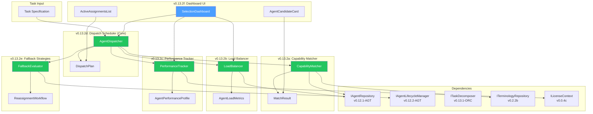
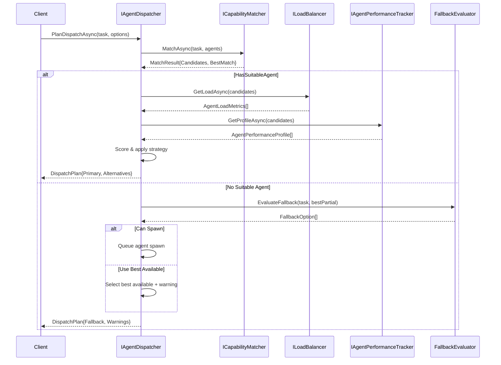

# LCS-SBD-v0.13.2-ORC: Scope Breakdown — Agent Selection & Dispatch

## Document Control

| Field                | Value                                      |
| :------------------- | :----------------------------------------- |
| **Document ID**      | LCS-SBD-v0.13.2-ORC                       |
| **Feature ID**       | ORC-v0.13.2                                |
| **Feature Name**     | Agent Selection & Dispatch                 |
| **Target Version**   | v0.13.2                                    |
| **Module Scope**     | Lexichord.Orchestration                    |
| **Swimlane**         | Agent Management                           |
| **License Tier**     | WriterPro → Enterprise (tiered)            |
| **Feature Gate Key** | `FeatureFlags.Orchestration.AgentDispatch` |
| **Parent Roadmap**   | [roadmap-v0.13.x.md](../roadmap-v0.13.x.md) |
| **Status**           | Draft                                      |
| **Last Updated**     | 2026-01-31                                 |

---

## 1. Executive Summary

### 1.1 The Vision

**v0.13.2** delivers **Agent Selection & Dispatch** — intelligent routing of tasks to the most suitable agents based on capability matching, current load balancing, and historical performance tracking. This release transforms Lexichord's agent orchestration from static assignment into a sophisticated system that dynamically selects the best agent for each task, manages queue distribution, and gracefully handles fallback scenarios when optimal agents are unavailable.

### 1.2 Business Value

| Value                 | Description                                                       |
| :-------------------- | :---------------------------------------------------------------- |
| **Optimal Routing**    | Tasks matched to agents with best capability/performance fit      |
| **Load Awareness**     | Agent load tracked and balanced to prevent oversubscription      |
| **Performance Driven** | Selection decisions informed by historical success metrics        |
| **Flexible Dispatch**  | Multiple selection strategies support different optimization goals |
| **Graceful Degradation** | Fallback mechanisms handle resource constraints                  |
| **Visibility**         | Dashboard shows agent assignments and selection reasoning         |

### 1.3 Success Criteria

| Criterion                      | Target               | Measurement                  |
| :----------------------------- | :------------------- | :--------------------------- |
| Dispatch planning latency      | < 500ms P95          | End-to-end performance test  |
| Agent capability match rate    | 95%+ suitable matches | Task assignment audit        |
| Load balancer accuracy         | ±10% load estimate   | Real vs. projected load      |
| Fallback execution success     | 90%+ via alternatives | Failed assignment recovery   |
| Selection dashboard responsiveness | < 200ms          | UI performance measurement   |
| Performance tracker accuracy   | ±5% quality scores   | Score validation audit       |

### 1.4 License Gating Strategy

Agent Selection & Dispatch features are gated across license tiers using a **Tiered** strategy:

| Tier       | Manual Selection | Auto-Selection | Strategies | Performance Tracking | Custom Strategies | API Access |
| :--------- | :-------------- | :------------- | :--------- | :------------------ | :---------------- | :--------- |
| Core       | Enabled         | Disabled       | —          | —                   | —                 | —          |
| WriterPro  | Enabled         | Enabled        | 3 (Basic)  | Basic only          | —                 | —          |
| Teams      | Enabled         | Enabled        | 7 (All)    | Full                | —                 | —          |
| Enterprise | Enabled         | Enabled        | 7 (All)    | Full                | Enabled           | Full       |

---

## 2. Dependencies

### 2.1 Upstream Dependencies

| Interface/Class           | Source Version    | Required For                        |
| :------------------------ | :---------------- | :---------------------------------- |
| `ITaskDecomposer`         | v0.13.1-ORC       | Task metadata and requirements      |
| `IAgentRepository`        | v0.12.1-AGT       | Agent capability definitions        |
| `IAgentLifecycleManager`  | v0.12.2-AGT       | Agent state and availability        |
| `ITerminologyRepository`  | v0.2.2b           | Domain-specific capability mapping  |
| `ISettingsService`        | v0.1.6a           | Dispatch policy configuration       |
| `ILicenseContext`         | v0.0.4c           | License tier checking               |
| `IMediator`               | v0.0.7a           | Event publishing                    |
| `ILogger<T>`              | v0.0.3b           | Structured logging                  |
| `IMetricsCollector`       | v0.11.2-OBS       | Performance data collection         |
| `ViewModelBase`           | CommunityToolkit.Mvvm | Observable ViewModel base         |

### 2.2 NuGet Packages

| Package                 | Version | Purpose                 |
| :---------------------- | :------ | :---------------------- |
| `CommunityToolkit.Mvvm` | 8.x     | MVVM source generators  |
| `MediatR`               | 12.x    | Event publishing        |
| `Npgsql`                | 8.x     | PostgreSQL connectivity |
| `Dapper`                | 2.x     | Micro-ORM for queries   |

### 2.3 Downstream Consumers

| Version | Feature              | Consumes                                    |
| :------ | :------------------- | :------------------------------------------ |
| v0.13.3 | Task Execution       | `DispatchPlan` and task assignments         |
| v0.13.4 | Workflow Management  | Agent selection and dispatch capabilities   |
| v0.14.x | Advanced Scheduling  | Performance profiles for optimization       |

---

## 3. Key Interfaces

### 3.1 IAgentDispatcher

```csharp
namespace Lexichord.Abstractions.Contracts;

/// <summary>
/// Coordinates agent selection, planning, and task dispatch.
/// </summary>
public interface IAgentDispatcher
{
    /// <summary>
    /// Plans dispatch for a single task, selecting suitable agent(s).
    /// </summary>
    /// <param name="task">The task requiring assignment.</param>
    /// <param name="options">Dispatch options and preferences.</param>
    /// <param name="cancellationToken">Cancellation token.</param>
    /// <returns>A dispatch plan with assignments and alternatives.</returns>
    Task<DispatchPlan> PlanDispatchAsync(
        TaskSpecification task,
        DispatchOptions? options = null,
        CancellationToken cancellationToken = default);

    /// <summary>
    /// Executes the dispatch plan, sending task to assigned agent.
    /// </summary>
    /// <param name="plan">The dispatch plan to execute.</param>
    /// <param name="cancellationToken">Cancellation token.</param>
    /// <returns>Task assignment confirmation.</returns>
    Task<TaskAssignment> DispatchAsync(
        DispatchPlan plan,
        CancellationToken cancellationToken = default);

    /// <summary>
    /// Reassigns a task to an alternative agent.
    /// </summary>
    /// <param name="taskId">The task to reassign.</param>
    /// <param name="currentAssignmentId">Current assignment ID.</param>
    /// <param name="reason">Reason for reassignment.</param>
    /// <param name="cancellationToken">Cancellation token.</param>
    /// <returns>New task assignment.</returns>
    Task<TaskAssignment> ReassignAsync(
        Guid taskId,
        Guid currentAssignmentId,
        string reason,
        CancellationToken cancellationToken = default);
}
```

### 3.2 DispatchOptions

```csharp
namespace Lexichord.Orchestration.Models;

/// <summary>
/// Configuration options for task dispatch.
/// </summary>
public record DispatchOptions(
    /// <summary>Selection strategy to use.</summary>
    SelectionStrategy Strategy = SelectionStrategy.BestMatch,

    /// <summary>Whether to spawn new agents if needed.</summary>
    bool AllowAgentSpawning = false,

    /// <summary>Maximum number of concurrent agents to use.</summary>
    int MaxConcurrentAgents = 10,

    /// <summary>Prefer agents with specialized skills for this task type.</summary>
    bool PreferSpecialization = true,

    /// <summary>List of preferred agent IDs (prioritized).</summary>
    IReadOnlyList<Guid>? PreferredAgents = null,

    /// <summary>List of agent IDs to exclude from selection.</summary>
    IReadOnlyList<Guid>? ExcludedAgents = null);
```

### 3.3 SelectionStrategy Enum

```csharp
namespace Lexichord.Orchestration.Models;

/// <summary>
/// Strategy for selecting agents for task assignment.
/// </summary>
public enum SelectionStrategy
{
    /// <summary>Select agent with best capability match + performance score.</summary>
    BestMatch = 0,

    /// <summary>Select least busy agent among suitable candidates.</summary>
    LeastBusy = 1,

    /// <summary>Select agent with best historical performance.</summary>
    BestPerformer = 2,

    /// <summary>Rotate through suitable agents in sequence.</summary>
    RoundRobin = 3,

    /// <summary>Select least expensive agent (by resource cost).</summary>
    Cheapest = 4,

    /// <summary>Select fastest agent (by average execution time).</summary>
    Fastest = 5,

    /// <summary>Balance capability, load, and performance equally.</summary>
    Balanced = 6
}
```

### 3.4 DispatchPlan

```csharp
namespace Lexichord.Orchestration.Models;

/// <summary>
/// A dispatch plan for one or more tasks.
/// </summary>
public record DispatchPlan(
    /// <summary>Unique identifier for this plan.</summary>
    Guid PlanId,

    /// <summary>Assignments of tasks to agents.</summary>
    IReadOnlyList<TaskAssignment> Assignments,

    /// <summary>Number of agents required for all assignments.</summary>
    int RequiredAgents,

    /// <summary>List of agent IDs to spawn (if enabled).</summary>
    IReadOnlyList<Guid> AgentsToSpawn,

    /// <summary>Estimated execution time for all assignments (ms).</summary>
    long EstimateMs,

    /// <summary>Any warnings or advisories about the plan.</summary>
    IReadOnlyList<DispatchWarning> Warnings);

/// <summary>
/// A warning or advisory about a dispatch plan.
/// </summary>
public record DispatchWarning(
    /// <summary>Severity level.</summary>
    WarningSeverity Severity,

    /// <summary>Human-readable warning message.</summary>
    string Message);

/// <summary>
/// Severity of a dispatch warning.
/// </summary>
public enum WarningSeverity
{
    Info = 0,
    Warning = 1,
    Error = 2
}
```

### 3.5 TaskAssignment

```csharp
namespace Lexichord.Orchestration.Models;

/// <summary>
/// Assignment of a task to an agent.
/// </summary>
public record TaskAssignment(
    /// <summary>The task being assigned.</summary>
    Guid TaskId,

    /// <summary>The agent to which task is assigned.</summary>
    Guid AssignedAgentId,

    /// <summary>Agent ID to spawn if new agent required (null if existing agent).</summary>
    Guid? AgentToSpawn,

    /// <summary>Match score for this assignment (0.0-1.0).</summary>
    float MatchScore,

    /// <summary>Alternative agent assignments if primary unavailable.</summary>
    IReadOnlyList<AgentCandidate> Alternatives);
```

### 3.6 AgentCandidate

```csharp
namespace Lexichord.Orchestration.Models;

/// <summary>
/// A candidate agent for task assignment with scoring.
/// </summary>
public record AgentCandidate(
    /// <summary>Agent unique identifier.</summary>
    Guid AgentId,

    /// <summary>Human-readable agent name.</summary>
    string AgentName,

    /// <summary>Capability match score (0.0-1.0).</summary>
    float CapabilityScore,

    /// <summary>Availability/load score (0.0-1.0).</summary>
    float AvailabilityScore,

    /// <summary>Historical performance score (0.0-1.0).</summary>
    float PerformanceScore,

    /// <summary>Composite overall score (0.0-1.0).</summary>
    float OverallScore,

    /// <summary>Reason agent was disqualified (null if qualified).</summary>
    string? DisqualificationReason);
```

### 3.7 ICapabilityMatcher

```csharp
namespace Lexichord.Abstractions.Contracts;

/// <summary>
/// Matches task requirements against agent capabilities.
/// </summary>
public interface ICapabilityMatcher
{
    /// <summary>
    /// Finds agents matching task requirements.
    /// </summary>
    /// <param name="task">Task with capability requirements.</param>
    /// <param name="agents">Available agents to consider.</param>
    /// <param name="cancellationToken">Cancellation token.</param>
    /// <returns>Match results with candidates.</returns>
    Task<MatchResult> MatchAsync(
        TaskSpecification task,
        IReadOnlyList<AgentDefinition> agents,
        CancellationToken cancellationToken = default);

    /// <summary>
    /// Scores a specific agent against task requirements.
    /// </summary>
    /// <param name="task">Task with requirements.</param>
    /// <param name="agent">Agent to score.</param>
    /// <param name="cancellationToken">Cancellation token.</param>
    /// <returns>Match score (0.0-1.0) and reasoning.</returns>
    Task<(float Score, string Reasoning)> ScoreMatchAsync(
        TaskSpecification task,
        AgentDefinition agent,
        CancellationToken cancellationToken = default);
}

/// <summary>
/// Results of capability matching.
/// </summary>
public record MatchResult(
    /// <summary>Candidate agents ranked by capability match.</summary>
    IReadOnlyList<AgentCandidate> Candidates,

    /// <summary>Whether at least one suitable agent exists.</summary>
    bool HasSuitableAgent,

    /// <summary>The best matching agent (null if none suitable).</summary>
    AgentCandidate? BestMatch);
```

### 3.8 IAgentPerformanceTracker

```csharp
namespace Lexichord.Abstractions.Contracts;

/// <summary>
/// Tracks agent execution outcomes and performance metrics.
/// </summary>
public interface IAgentPerformanceTracker
{
    /// <summary>
    /// Records the outcome of a task execution.
    /// </summary>
    /// <param name="outcome">Execution result details.</param>
    /// <param name="cancellationToken">Cancellation token.</param>
    Task RecordExecutionAsync(
        ExecutionOutcome outcome,
        CancellationToken cancellationToken = default);

    /// <summary>
    /// Gets performance profile for an agent.
    /// </summary>
    /// <param name="agentId">Agent identifier.</param>
    /// <param name="cancellationToken">Cancellation token.</param>
    /// <returns>Performance profile with aggregated metrics.</returns>
    Task<AgentPerformanceProfile?> GetProfileAsync(
        Guid agentId,
        CancellationToken cancellationToken = default);

    /// <summary>
    /// Gets top performing agents for a task type.
    /// </summary>
    /// <param name="taskType">Task type to filter by.</param>
    /// <param name="limit">Maximum results to return.</param>
    /// <param name="cancellationToken">Cancellation token.</param>
    /// <returns>Top performers ranked by quality score.</returns>
    Task<IReadOnlyList<AgentPerformanceProfile>> GetTopPerformersAsync(
        string taskType,
        int limit = 10,
        CancellationToken cancellationToken = default);
}

/// <summary>
/// Record of a task execution outcome.
/// </summary>
public record ExecutionOutcome(
    /// <summary>Task that was executed.</summary>
    Guid TaskId,

    /// <summary>Agent that executed the task.</summary>
    Guid AgentId,

    /// <summary>Whether execution succeeded.</summary>
    bool Success,

    /// <summary>Execution duration in milliseconds.</summary>
    long DurationMs,

    /// <summary>Tokens consumed during execution.</summary>
    long TokensUsed,

    /// <summary>Quality score for the result (0.0-1.0).</summary>
    float QualityScore,

    /// <summary>Task type identifier.</summary>
    string TaskType,

    /// <summary>Failure reason if not successful.</summary>
    string? FailureReason);

/// <summary>
/// Performance profile for an agent.
/// </summary>
public record AgentPerformanceProfile(
    /// <summary>Agent identifier.</summary>
    Guid AgentId,

    /// <summary>Agent name.</summary>
    string AgentName,

    /// <summary>Total task executions.</summary>
    int TotalExecutions,

    /// <summary>Success rate (0.0-1.0).</summary>
    float SuccessRate,

    /// <summary>Average execution duration (ms).</summary>
    long AverageDurationMs,

    /// <summary>Average quality score (0.0-1.0).</summary>
    float AverageQualityScore,

    /// <summary>Performance metrics by task type.</summary>
    IReadOnlyDictionary<string, TaskTypeMetrics> ByTaskType);

/// <summary>
/// Performance metrics for a specific task type.
/// </summary>
public record TaskTypeMetrics(
    string TaskType,
    int Executions,
    float SuccessRate,
    long AverageDurationMs,
    float AverageQualityScore);
```

### 3.9 ILoadBalancer

```csharp
namespace Lexichord.Abstractions.Contracts;

/// <summary>
/// Tracks and manages agent load distribution.
/// </summary>
public interface ILoadBalancer
{
    /// <summary>
    /// Gets current load metrics for an agent.
    /// </summary>
    /// <param name="agentId">Agent identifier.</param>
    /// <param name="cancellationToken">Cancellation token.</param>
    /// <returns>Load metrics (null if agent not found).</returns>
    Task<AgentLoadMetrics?> GetLoadAsync(
        Guid agentId,
        CancellationToken cancellationToken = default);

    /// <summary>
    /// Finds the least busy agent among suitable candidates.
    /// </summary>
    /// <param name="candidates">Agents to consider.</param>
    /// <param name="cancellationToken">Cancellation token.</param>
    /// <returns>Agent with lowest load (null if all at capacity).</returns>
    Task<AgentCandidate?> GetLeastBusyAsync(
        IReadOnlyList<AgentCandidate> candidates,
        CancellationToken cancellationToken = default);

    /// <summary>
    /// Updates load metrics after task assignment.
    /// </summary>
    /// <param name="agentId">Agent being assigned work.</param>
    /// <param name="taskCount">Number of tasks to add to queue.</param>
    /// <param name="estimatedDurationMs">Estimated execution time.</param>
    /// <param name="cancellationToken">Cancellation token.</param>
    Task UpdateLoadAsync(
        Guid agentId,
        int taskCount,
        long estimatedDurationMs,
        CancellationToken cancellationToken = default);
}

/// <summary>
/// Current load metrics for an agent.
/// </summary>
public record AgentLoadMetrics(
    /// <summary>Agent identifier.</summary>
    Guid AgentId,

    /// <summary>Number of tasks currently queued.</summary>
    int QueuedTaskCount,

    /// <summary>Number of tasks currently executing.</summary>
    int ExecutingTaskCount,

    /// <summary>Estimated time to process all queued tasks (ms).</summary>
    long EstimatedQueueTimeMs,

    /// <summary>Load percentage (0-100).</summary>
    float LoadPercentage,

    /// <summary>Whether agent is at capacity.</summary>
    bool IsAtCapacity,

    /// <summary>Last updated timestamp.</summary>
    DateTime UpdatedAt);
```

---

## 4. Sub-Part Specifications

### 4.1 v0.13.2a: Capability Matcher

| Field                | Value           |
| :------------------- | :-------------- |
| **Sub-Part ID**      | ORC-v0.13.2a    |
| **Title**            | Capability Matcher |
| **Estimated Effort** | 10 hours        |
| **Risk Level**       | Medium          |
| **License Tier**     | Core (included) |

**Goal:** Implement `ICapabilityMatcher` to match task requirements against agent capabilities using semantic and categorical matching.

**Key Deliverables:**

- `ICapabilityMatcher` interface in Lexichord.Abstractions
- `CapabilityMatcher` implementation with multi-factor scoring
- `MatchResult` record with candidate rankings
- Capability requirement parsing from `TaskSpecification`
- Semantic matching for capability synonyms via terminology database
- Categorical matching (exact, partial, derived capabilities)
- Disqualification detection for unsuitable agents
- Unit tests with 90%+ coverage

**Capability Matching Algorithm:**

```
1. Parse task requirements (required capabilities, skill levels, domain)
2. For each agent:
   a. Check hard requirements (disqualifying missing capabilities)
   b. Score matched capabilities (exact > partial > derived)
   c. Weight scores by capability importance
   d. Apply specialization bonus for task-type match
   e. Generate overall capability score (0.0-1.0)
   f. Record disqualification reason if any hard req failed
3. Rank candidates by capability score
4. Return top candidates with BestMatch
```

**Capability Matching Examples:**

| Task Requirement | Agent Capability | Match Score | Reasoning                  |
| :--------------- | :--------------- | :---------- | :------------------------- |
| "Python coding"  | "Python"         | 1.0         | Exact match                |
| "Python coding"  | "Python 3.11"    | 0.95        | Specific version detected  |
| "auth system"    | "authentication" | 0.85        | Synonym match (terminology) |
| "API design"     | "REST API"       | 0.70        | Partial/derived capability |
| "ML tuning"      | "Python coding"  | 0.40        | Base skill but not specialized |

**Dependencies:**

- `IAgentRepository` (v0.12.1-AGT) for agent definitions
- `ITerminologyRepository` (v0.2.2b) for synonym matching

---

### 4.2 v0.13.2b: Load Balancer

| Field                | Value           |
| :------------------- | :-------------- |
| **Sub-Part ID**      | ORC-v0.13.2b    |
| **Title**            | Load Balancer   |
| **Estimated Effort** | 10 hours        |
| **Risk Level**       | Low             |
| **License Tier**     | Core (included) |

**Goal:** Implement `ILoadBalancer` to track agent queue depth, execution capacity, and availability for balanced task distribution.

**Key Deliverables:**

- `ILoadBalancer` interface in Lexichord.Abstractions
- `LoadBalancer` implementation with in-memory tracking
- `AgentLoadMetrics` record with queue and capacity info
- Task queue simulation for load estimation
- Real-time load updates on assignment and completion
- Capacity threshold detection
- Unit tests covering various load scenarios

**Load Metrics Calculation:**

```
LoadPercentage = (QueuedTaskCount + ExecutingTaskCount) / MaxCapacity * 100
EstimatedQueueTime = Sum of estimated durations for queued tasks
IsAtCapacity = LoadPercentage >= 90%
```

**Load Threshold Levels:**

| Level | Load %    | Status          | Dispatch Behavior       |
| :---- | :-------- | :-------------- | :---------------------- |
| Green | 0-60%     | Optimal         | Prefer this agent       |
| Yellow | 60-80%   | Elevated        | Use if suitable         |
| Orange | 80-90%   | High            | Only if best available  |
| Red    | 90-100%  | At Capacity     | Avoid unless unavoidable |

**Dependencies:**

- `IAgentLifecycleManager` (v0.12.2-AGT) for agent state info

---

### 4.3 v0.13.2c: Performance Tracker

| Field                | Value                   |
| :------------------- | :---------------------- |
| **Sub-Part ID**      | ORC-v0.13.2c            |
| **Title**            | Performance Tracker     |
| **Estimated Effort** | 8 hours                 |
| **Risk Level**       | Low                     |
| **License Tier**     | WriterPro+ (Teams tier) |

**Goal:** Implement `IAgentPerformanceTracker` to record execution outcomes and calculate performance profiles for informed selection decisions.

**Key Deliverables:**

- `IAgentPerformanceTracker` interface in Lexichord.Abstractions
- `PerformanceTracker` implementation with PostgreSQL storage
- `agent_performance_executions` and `agent_performance_profiles` database tables
- `ExecutionOutcome` recording with task success/failure tracking
- Performance profile calculation with rolling aggregates
- Performance metrics by task type
- Query methods for top performers by task type
- Unit tests with storage scenarios

**Database Schema:**

```sql
CREATE TABLE agent_performance_executions (
    id UUID PRIMARY KEY DEFAULT gen_random_uuid(),
    agent_id UUID NOT NULL,
    task_id UUID NOT NULL,
    task_type TEXT NOT NULL,
    success BOOLEAN NOT NULL,
    duration_ms BIGINT NOT NULL,
    tokens_used BIGINT NOT NULL,
    quality_score REAL NOT NULL,
    failure_reason TEXT,
    executed_at TIMESTAMPTZ NOT NULL DEFAULT NOW()
);

CREATE INDEX idx_perf_exec_agent ON agent_performance_executions (agent_id);
CREATE INDEX idx_perf_exec_task_type ON agent_performance_executions (task_type);
CREATE INDEX idx_perf_exec_executed_at ON agent_performance_executions (executed_at DESC);

CREATE TABLE agent_performance_profiles (
    agent_id UUID PRIMARY KEY,
    agent_name TEXT NOT NULL,
    total_executions INT NOT NULL DEFAULT 0,
    success_rate REAL NOT NULL DEFAULT 0.0,
    average_duration_ms BIGINT NOT NULL DEFAULT 0,
    average_quality_score REAL NOT NULL DEFAULT 0.0,
    last_updated TIMESTAMPTZ NOT NULL DEFAULT NOW()
);
```

**Performance Scoring:**

```
SuccessRate = (Successful Executions / Total Executions) * 100
AverageDuration = Sum(Duration) / Total Executions
AverageQualityScore = Sum(QualityScore) / Total Executions
PerformanceScore = (SuccessRate * 0.5 + (1 - MinMaxScale(AverageDuration)) * 0.3 + AverageQualityScore * 0.2)
```

**Dependencies:**

- `IMetricsCollector` (v0.11.2-OBS) for optional external metrics
- `ILicenseContext` (v0.0.4c) for feature tier checking

---

### 4.4 v0.13.2d: Dispatch Scheduler

| Field                | Value               |
| :------------------- | :------------------ |
| **Sub-Part ID**      | ORC-v0.13.2d        |
| **Title**            | Dispatch Scheduler  |
| **Estimated Effort** | 10 hours            |
| **Risk Level**       | Medium              |
| **License Tier**     | Core (included)     |

**Goal:** Implement `IAgentDispatcher` to orchestrate task planning and dispatch using capability matching, load balancing, and performance data.

**Key Deliverables:**

- `IAgentDispatcher` interface in Lexichord.Abstractions
- `AgentDispatcher` orchestration implementation
- `DispatchPlan` and `DispatchWarning` record generation
- Multi-strategy dispatch planning (7 strategies)
- Dispatch plan execution with agent task queuing
- Reassignment logic for fallback scenarios
- Task-to-agent assignment confirmation
- Unit and integration tests

**Dispatch Planning Algorithm:**

```
1. Validate task and options
2. Fetch all available agents from repository
3. Match capabilities: ICapabilityMatcher.MatchAsync()
4. If no suitable agent:
   a. If AllowAgentSpawning: mark agents for spawning
   b. Else: return warning and proceed with best available
5. Get load metrics: ILoadBalancer.GetLoadAsync()
6. Get performance profiles: IAgentPerformanceTracker.GetProfileAsync()
7. Score all candidates:
   Capability: 40%, Availability: 30%, Performance: 30%
8. Apply selection strategy:
   - BestMatch: Highest overall score
   - LeastBusy: Lowest load among suitable
   - BestPerformer: Highest performance score
   - RoundRobin: Next in rotation order
   - Cheapest: Lowest resource cost
   - Fastest: Lowest average duration
   - Balanced: Weighted composite
9. Generate alternatives from next-best candidates
10. Create DispatchPlan with estimate and warnings
11. Return plan for approval/execution
```

**Selection Strategy Scoring Matrix:**

| Strategy      | Capability | Availability | Performance | Custom Weights |
| :------------ | :--------- | :----------- | :---------- | :------------- |
| BestMatch     | 40%        | 30%          | 30%         | — |
| LeastBusy     | 20%        | 60%          | 20%         | — |
| BestPerformer | 20%        | 20%          | 60%         | — |
| RoundRobin    | 33%        | 33%          | 33%         | — |
| Cheapest      | 33%        | 33%          | 33% (inverted cost) | Cost factor |
| Fastest       | 30%        | 20%          | 50%         | Speed weight |
| Balanced      | 33%        | 33%          | 33%         | Custom ratios |

**Dependencies:**

- `ICapabilityMatcher` (v0.13.2a)
- `ILoadBalancer` (v0.13.2b)
- `IAgentPerformanceTracker` (v0.13.2c)
- `ITaskDecomposer` (v0.13.1-ORC) for task requirements
- `IAgentRepository` (v0.12.1-AGT)

---

### 4.5 v0.13.2e: Fallback Strategies

| Field                | Value                   |
| :------------------- | :---------------------- |
| **Sub-Part ID**      | ORC-v0.13.2e            |
| **Title**            | Fallback Strategies     |
| **Estimated Effort** | 8 hours                 |
| **Risk Level**       | Medium                  |
| **License Tier**     | WriterPro+ (Teams tier) |

**Goal:** Implement fallback mechanisms for task assignment when primary agents unavailable, including agent spawning and degraded-mode execution.

**Key Deliverables:**

- Fallback evaluation logic in dispatcher
- Fallback strategy configuration (eager, conservative, manual)
- Agent spawning decision logic
- Degraded-mode task execution options
- Fallback success tracking and metrics
- Reassignment workflow for mid-execution failures
- Unit tests for fallback scenarios

**Fallback Strategy Options:**

| Strategy     | Behavior                                       |
| :----------- | :--------------------------------------------- |
| Eager        | Immediately spawn agents if no suitable match |
| Conservative | Exhausts existing agents before spawning       |
| Manual       | Requires explicit approval for spawning       |

**Fallback Execution Flow:**

```
1. Initial dispatch planning fails (no suitable agent)
2. Evaluate available fallback options:
   a. Use partially suitable agent (degraded match)
   b. Use broad-capability agent (lower specialization)
   c. Queue task for when suitable agent becomes available
   d. If enabled: spawn new specialized agent
3. Generate fallback DispatchPlan with warnings
4. If task already executing: evaluate reassignment
   a. Identify why current agent failing
   b. Select alternative from candidates
   c. Migrate task state to new agent
5. Record fallback attempt in telemetry

Fallback Success = Task completes via fallback OR reassignment succeeds
```

**Agent Spawning Logic:**

```
CanSpawn = AllowAgentSpawning AND (LicensedForSpawning OR Manual)
ShouldSpawn = CanSpawn AND CurrentAgentCount < MaxConcurrentAgents AND NoSuitableAgentExists
```

**Dependencies:**

- `IAgentLifecycleManager` (v0.12.2-AGT) for spawning
- `ILicenseContext` (v0.0.4c) for feature availability
- `IDispatcher` (v0.13.2d) for primary dispatch

---

### 4.6 v0.13.2f: Selection Dashboard UI

| Field                | Value                   |
| :------------------- | :---------------------- |
| **Sub-Part ID**      | ORC-v0.13.2f            |
| **Title**            | Selection Dashboard UI  |
| **Estimated Effort** | 6 hours                 |
| **Risk Level**       | Low                     |
| **License Tier**     | WriterPro+ (Teams tier) |

**Goal:** Implement dashboard UI to visualize agent selection decisions, current assignments, and selection reasoning.

**Key Deliverables:**

- `SelectionDashboard` UI view with agent grid
- Agent candidate cards showing scores and reasoning
- Active assignment list with task details
- Performance metrics panel with graphs
- Load heatmap visualization
- Selection strategy comparison view
- Real-time updates via signaling
- MVVM ViewModels with INotifyPropertyChanged
- Unit tests for ViewModel logic

**Dashboard Sections:**

| Section | Content | Refresh Rate |
| :------ | :------ | :----------- |
| Agent Grid | Candidate cards, scores, load | 2s |
| Active Assignments | Task → Agent mapping, progress | 1s |
| Performance Metrics | Success rate, avg duration, quality | 5s |
| Load Heatmap | Agent capacity visualization | 2s |
| Strategy Comparison | Score breakdown by strategy | On demand |

**Agent Candidate Card Layout:**

```
┌─────────────────────────────────────────────────────┐
│ Agent: CodeWriter-v2.1                    [Selected] │
│ ━━━━━━━━━━━━━━━━━━━━━━━━━━━━━━━━━━━━━━━━━━━━━━━━━ │
│                                                      │
│ Overall Score: 0.92 ████████░░ 92%                 │
│                                                      │
│ • Capability:    0.95 ████████░  (Python, Testing)  │
│ • Availability:  0.88 ████████░  (2 queued, 1 busy) │
│ • Performance:   0.92 ████████░  (94% success)      │
│                                                      │
│ Status: Optimal Load (60%)                          │
│ Est. Duration: 2.3s                                 │
│                                                      │
│ Alternative: DocWriter-v1.5 (Score: 0.78)         │
└─────────────────────────────────────────────────────┘
```

**Dependencies:**

- `IAgentDispatcher` (v0.13.2d) for selection data
- `ILoadBalancer` (v0.13.2b) for load metrics
- `IAgentPerformanceTracker` (v0.13.2c) for performance data
- `ViewModelBase` (CommunityToolkit.Mvvm)

---

## 5. Implementation Checklist

### 5.1 v0.13.2a — Capability Matcher

| Step | Task                                              | Est. Hours |
| :--- | :------------------------------------------------ | :--------- |
| 1    | Define `ICapabilityMatcher` and `MatchResult`    | 1.0        |
| 2    | Parse task capability requirements               | 1.5        |
| 3    | Implement capability score calculation           | 2.0        |
| 4    | Implement semantic matching with terminology DB  | 2.0        |
| 5    | Implement disqualification detection             | 1.0        |
| 6    | Implement ranking and candidate selection        | 1.0        |
| 7    | Write comprehensive unit tests                   | 1.5        |
|      | **Subtotal**                                     | **10.0**   |

### 5.2 v0.13.2b — Load Balancer

| Step | Task                                              | Est. Hours |
| :--- | :------------------------------------------------ | :--------- |
| 1    | Define `ILoadBalancer` and `AgentLoadMetrics`   | 1.0        |
| 2    | Implement in-memory load tracking                | 2.0        |
| 3    | Implement capacity threshold detection           | 1.0        |
| 4    | Implement load estimation logic                  | 2.0        |
| 5    | Implement least-busy agent selection             | 1.5        |
| 6    | Implement load update and decay                  | 1.0        |
| 7    | Write unit tests                                 | 1.5        |
|      | **Subtotal**                                     | **10.0**   |

### 5.3 v0.13.2c — Performance Tracker

| Step | Task                                              | Est. Hours |
| :--- | :------------------------------------------------ | :--------- |
| 1    | Define `IAgentPerformanceTracker` interface      | 0.5        |
| 2    | Create database migrations and schema            | 1.5        |
| 3    | Implement execution outcome recording            | 1.5        |
| 4    | Implement profile calculation and aggregation    | 2.0        |
| 5    | Implement task-type metrics breakdown            | 1.0        |
| 6    | Implement top performers query                   | 1.0        |
| 7    | Write unit and integration tests                 | 0.5        |
|      | **Subtotal**                                     | **8.0**    |

### 5.4 v0.13.2d — Dispatch Scheduler

| Step | Task                                              | Est. Hours |
| :--- | :------------------------------------------------ | :--------- |
| 1    | Define `IAgentDispatcher` interface              | 1.0        |
| 2    | Implement dispatch planning orchestration        | 2.5        |
| 3    | Implement multi-strategy selection logic         | 3.0        |
| 4    | Implement alternative candidate generation       | 1.0        |
| 5    | Implement dispatch execution and queuing         | 1.5        |
| 6    | Implement reassignment workflow                  | 1.0        |
| 7    | Write unit and integration tests                 | 1.0        |
|      | **Subtotal**                                     | **10.0**   |

### 5.5 v0.13.2e — Fallback Strategies

| Step | Task                                              | Est. Hours |
| :--- | :------------------------------------------------ | :--------- |
| 1    | Define fallback strategy configuration options   | 0.5        |
| 2    | Implement fallback evaluation logic              | 2.0        |
| 3    | Implement agent spawning decision logic          | 1.5        |
| 4    | Implement degraded-mode execution handling       | 1.5        |
| 5    | Implement mid-execution reassignment             | 1.5        |
| 6    | Implement fallback telemetry and metrics         | 0.5        |
| 7    | Write unit tests for fallback scenarios          | 0.5        |
|      | **Subtotal**                                     | **8.0**    |

### 5.6 v0.13.2f — Selection Dashboard UI

| Step | Task                                              | Est. Hours |
| :--- | :------------------------------------------------ | :--------- |
| 1    | Create `SelectionDashboard` view and XAML        | 1.0        |
| 2    | Create agent candidate card component            | 1.0        |
| 3    | Implement active assignments list                | 1.0        |
| 4    | Implement performance metrics panels             | 1.0        |
| 5    | Implement load heatmap visualization             | 1.0        |
| 6    | Implement ViewModel with real-time updates       | 0.5        |
| 7    | Write UI tests and manual verification           | 0.5        |
|      | **Subtotal**                                     | **6.0**    |

### 5.7 Integration & Testing

| Step | Task                                              | Est. Hours |
| :--- | :------------------------------------------------ | :--------- |
| 1    | DI registration in OrchestratorModule            | 0.5        |
| 2    | End-to-end dispatch pipeline tests               | 2.0        |
| 3    | Performance testing (< 500ms P95 dispatch)       | 1.0        |
| 4    | License tier feature testing                     | 0.5        |
|      | **Subtotal**                                     | **4.0**    |

**Total Estimated Effort: 52 hours**

---

## 6. Architecture Diagram



---

## 7. Sequence Diagram: Dispatch Planning



---

## 8. Dependency Matrix

| Component                    | Depends On                                         |
| :--------------------------- | :------------------------------------------------- |
| `CapabilityMatcher`          | `IAgentRepository` (v0.12.1), `ITerminologyRepository` (v0.2.2b) |
| `LoadBalancer`               | `IAgentRepository` (v0.12.1)                       |
| `PerformanceTracker`         | `IMetricsCollector` (v0.11.2), `ILicenseContext` (v0.0.4c) |
| `AgentDispatcher`            | `CapabilityMatcher`, `LoadBalancer`, `PerformanceTracker`, `FallbackEvaluator` |
| `FallbackEvaluator`          | `IAgentLifecycleManager` (v0.12.2), `ILicenseContext` (v0.0.4c) |
| `SelectionDashboard`         | `IAgentDispatcher`, `ILoadBalancer`, `IAgentPerformanceTracker` |

---

## 9. Risks and Mitigations

| Risk                           | Probability | Impact | Mitigation                                    |
| :----------------------------- | :---------- | :----- | :-------------------------------------------- |
| Capability matching accuracy   | Medium      | High   | Domain expert validation, iterative refinement |
| Load estimation variance       | Medium      | Medium | Conservative estimates, monitoring adjustments |
| Performance data staleness     | Low         | Medium | Rolling window aggregates, expiration policies |
| Dispatch planning latency      | Medium      | High   | Caching, async scoring, P95 profiling        |
| Agent spawning overhead        | Medium      | Medium | Spawn queuing, pre-warming, cost limits       |
| Selection thrashing           | Low         | Medium | Stability criteria, lock-out periods          |
| Unfair load distribution       | Low         | Medium | Regular rebalancing, fairness constraints     |

---

## 10. Performance Targets

| Metric                        | Target      | Measurement Method        |
| :---------------------------- | :---------- | :----------------------- |
| Dispatch planning latency     | < 500ms P95 | End-to-end timer          |
| Capability matching time      | < 100ms     | Component benchmark       |
| Load calculation time         | < 50ms      | Component benchmark       |
| Performance profile lookup    | < 20ms      | Database query timing     |
| Total scoring + selection     | < 150ms     | Orchestrator benchmark    |
| Dashboard UI responsiveness   | < 200ms     | UI interaction test       |
| Agent data refresh latency    | < 2s        | Real-time update test     |

---

## 11. Success Metrics

| Metric                      | Baseline          | Target            | Measurement             |
| :-------------------------- | :---------------- | :---------------- | :---------------------- |
| Task dispatch latency P95   | N/A               | < 500ms           | Performance profiling   |
| Agent capability match rate | N/A               | > 95%             | Assignment audit        |
| Fallback success rate       | N/A               | > 90%             | Fallback tracking       |
| Load distribution fairness  | N/A               | Std Dev < 15%     | Load metrics analysis   |
| Performance tracker accuracy| N/A               | ±5% score delta   | Validation comparison   |
| Dashboard responsiveness    | N/A               | < 200ms updates   | UI performance test     |

---

## 12. License Gating Details

### Core Tier
- Manual agent selection only
- Basic capability matching
- No performance tracking
- No auto-dispatch
- No dashboard

### WriterPro Tier
- Auto-selection with 3 strategies (BestMatch, LeastBusy, Balanced)
- Full capability matching
- Basic performance tracking (success rate, duration)
- Selection dashboard (read-only)
- Feature flag: `FeatureFlags.Orchestration.AutoDispatch`

### Teams Tier
- All 7 selection strategies
- Full performance tracking by task type
- Fallback strategies (Conservative mode)
- Interactive dashboard with details
- Team-level agent pooling
- Feature flag: `FeatureFlags.Orchestration.AdvancedDispatch`

### Enterprise Tier
- All features from Teams
- Custom selection strategies (via API)
- Agent spawning enabled
- Fallback strategies (all modes)
- API access to dispatch planning
- Custom webhooks for selection events
- Feature flag: `FeatureFlags.Orchestration.EnterpriseDispatch`

---

## 13. User Stories

### US-v0.13.2-1: Task Assignment

> **As a** task orchestrator,
> **I want** tasks to be automatically assigned to suitable agents,
> **So that** work is routed to agents with appropriate capabilities.

**Acceptance Criteria:**

- Tasks with capability requirements are matched to capable agents
- Task assignment shows match score and reasoning
- Unsuitable agents are excluded from consideration

### US-v0.13.2-2: Load Balancing

> **As a** system administrator,
> **I want** task load to be distributed evenly across available agents,
> **So that** no single agent becomes overloaded.

**Acceptance Criteria:**

- Agents with lower load are preferred for assignment
- Load metrics are updated in real-time
- Overloaded agents are avoided when alternatives exist

### US-v0.13.2-3: Performance-Driven Selection

> **As a** performance-conscious user (Teams tier),
> **I want** agents to be selected based on historical success rates,
> **So that** tasks are more likely to complete successfully.

**Acceptance Criteria:**

- High-performing agents are prioritized
- Performance metrics are updated after each execution
- Alternative agents are ranked by performance

### US-v0.13.2-4: Fallback Assignment

> **As a** task dispatcher,
> **I want** tasks to be assigned to alternative agents when optimal ones unavailable,
> **So that** work is not blocked by resource constraints.

**Acceptance Criteria:**

- Fallback agents are automatically selected
- Fallback assignments are logged with reasoning
- User is notified if fallback used

### US-v0.13.2-5: Selection Dashboard

> **As a** operations team member (Teams tier),
> **I want** to see which agents are assigned to which tasks,
> **So that** I can monitor work distribution and troubleshoot issues.

**Acceptance Criteria:**

- Agent grid shows current assignments and load
- Performance metrics are visible
- Dashboard updates in real-time

---

## 14. Use Cases

### UC-v0.13.2-1: Optimal Agent Assignment

**Actors:** Task Orchestrator (v0.13.3)

**Preconditions:**

- Task has defined capabilities requirements
- Multiple agents available with varying capabilities
- Performance data exists for agents

**Main Flow:**

1. Task arrives with requirements: `["Python", "Testing", "Code Review"]`
2. Dispatcher calls `PlanDispatchAsync(task, options: BestMatch)`
3. CapabilityMatcher scores agents:
   - CodeWriter-v2: 0.95 (all capabilities match)
   - QAAgent-v1: 0.85 (Python, Testing only)
   - ReviewBot: 0.70 (Code Review only)
4. LoadBalancer checks loads:
   - CodeWriter: 60% load (optimal)
   - QAAgent: 85% load (high)
   - ReviewBot: 40% load (optimal)
5. PerformanceTracker provides profiles:
   - CodeWriter: 94% success, 2.1s avg
   - QAAgent: 89% success, 3.2s avg
   - ReviewBot: 91% success, 1.8s avg
6. BestMatch strategy selects CodeWriter (highest composite score)
7. Plan includes CodeWriter as primary, QAAgent + ReviewBot as alternatives
8. Plan dispatched to CodeWriter

**Postconditions:**

- Task assigned to CodeWriter-v2
- Alternatives available if CodeWriter unavailable
- Dispatch plan recorded in dashboard

### UC-v0.13.2-2: Fallback Assignment

**Actors:** Task Dispatcher, Task Orchestrator

**Preconditions:**

- Task with specific requirements arrives
- No agents have exact capability match
- AllowAgentSpawning = false

**Main Flow:**

1. Task requires: `["Specialized Domain X", "ML Tuning"]`
2. No agents have both specialized skills
3. FallbackEvaluator checks options:
   - Best partial match: ML Expert with 0.70 score (missing domain)
   - Conservative: Use ML Expert with warning
   - Eager: Would spawn specialist (disabled)
4. Conservative fallback selected
5. Plan generated with warning: "No optimal agent for domain specialization"
6. Task assigned to ML Expert
7. Dashboard shows fallback indicator

**Postconditions:**

- Task completes via fallback agent
- Fallback recorded for metrics
- Team alerted of specialization gap

---

## 15. Unit Testing Requirements

### Test Coverage Targets

| Component                | Target Coverage | Critical Paths                  |
| :----------------------- | :-------------- | :------------------------------ |
| `CapabilityMatcher`      | 95%             | Matching logic, scoring, ranking |
| `LoadBalancer`           | 90%             | Load calculations, thresholds    |
| `PerformanceTracker`     | 85%             | Recording, aggregation           |
| `AgentDispatcher`        | 90%             | Planning, strategy application   |
| `FallbackEvaluator`      | 90%             | Fallback logic, spawning         |

### Key Test Scenarios

```csharp
// CapabilityMatcher tests
[Theory]
[InlineData("Python", "Python", 1.0f)]           // Exact match
[InlineData("Authentication", "Auth", 0.85f)]    // Synonym match
[InlineData("API", "REST", 0.70f)]               // Derived match
public async Task ScoreMatchAsync_CalculatesCorrectScore(
    string requirement, string capability, float expected);

[Fact]
public async Task MatchAsync_DisqualifiesAgentWithoutHardRequirement();

[Fact]
public async Task MatchAsync_RanksAgentsByScore();

// LoadBalancer tests
[Fact]
public async Task GetLoadAsync_CalculatesCorrectLoadPercentage();

[Fact]
public async Task GetLeastBusyAsync_IgnoresFullAgents();

[Fact]
public async Task UpdateLoadAsync_TracksQueuedTasks();

// PerformanceTracker tests
[Fact]
public async Task RecordExecutionAsync_StoresOutcome();

[Fact]
public async Task GetProfileAsync_CalculatesSuccessRate();

[Fact]
public async Task GetTopPerformersAsync_RanksByQualityScore();

// AgentDispatcher tests
[Fact]
public async Task PlanDispatchAsync_SelectsOptimalAgent();

[Theory]
[InlineData(SelectionStrategy.BestMatch)]
[InlineData(SelectionStrategy.LeastBusy)]
[InlineData(SelectionStrategy.BestPerformer)]
public async Task PlanDispatchAsync_AppliesStrategyCorrectly(
    SelectionStrategy strategy);

[Fact]
public async Task PlanDispatchAsync_GeneratesAlternatives();

// FallbackEvaluator tests
[Fact]
public async Task EvaluateFallback_UsesPartialMatchWhenNecessary();

[Fact]
public async Task EvaluateFallback_ProposeSpawningWhenEnabled();
```

---

## 16. Logging Specifications

### Log Events by Component

| Component   | Level | Event                  | Template                                                    |
| :---------- | :---- | :--------------------- | :---------------------------------------------------------- |
| Dispatcher  | Info  | Planning started       | `"Planning dispatch for task {TaskId}"`                     |
| Dispatcher  | Debug | Matching complete      | `"Found {CandidateCount} matching agents"`                  |
| Dispatcher  | Info  | Plan created           | `"Plan {PlanId}: {AgentName} selected (score: {Score})"`    |
| Dispatcher  | Warn  | Fallback used          | `"Using fallback: {Reason}"`                                |
| Dispatcher  | Info  | Dispatch executed      | `"Task {TaskId} dispatched to {AgentId}"`                   |
| Matcher     | Debug | Match scoring started  | `"Scoring {AgentCount} agents for {TaskId}"`                |
| Matcher     | Debug | Agent scored           | `"Agent {AgentId}: capability={Cap}, match={Match}"`        |
| LoadBalancer| Debug | Load updated           | `"Agent {AgentId} load: {Queued} queued, {Executing} busy"` |
| Tracker     | Info  | Execution recorded     | `"Agent {AgentId}: {Success} ({Duration}ms, Q={Quality})"`  |
| Tracker     | Debug | Profile updated        | `"Agent {AgentId} profile: {SuccessRate}% success rate"`    |

---

## 17. Acceptance Criteria

| #   | Category       | Criterion                                            | Verification      |
| :-- | :------------- | :--------------------------------------------------- | :---------------- |
| 1   | **Functional** | Capability matching scores agents 0.0-1.0           | Unit test         |
| 2   | **Functional** | Load balancer tracks agent queue depth              | Unit test         |
| 3   | **Functional** | Performance tracker records task outcomes            | Unit test         |
| 4   | **Functional** | Dispatcher selects BestMatch agent correctly        | Unit test         |
| 5   | **Functional** | All 7 strategies produce valid assignments           | Unit test         |
| 6   | **Functional** | Fallback logic activates when no suitable agent     | Unit test         |
| 7   | **Functional** | Reassignment handles mid-execution failures         | Integration test  |
| 8   | **Performance**| Dispatch planning < 500ms P95                       | Performance test  |
| 9   | **Performance**| Individual component latencies meet targets         | Benchmark test    |
| 10  | **UX**         | Dashboard displays agent selection reasoning        | Manual test       |
| 11  | **UX**         | Dashboard updates real-time (< 2s latency)          | Manual test       |
| 12  | **License**    | Core tier: manual selection only                    | Integration test  |
| 13  | **License**    | WriterPro tier: 3 auto-strategies available         | Integration test  |
| 14  | **License**    | Enterprise: custom strategies via API               | Integration test  |

---

## 18. Verification Commands

```bash
# Run unit tests for v0.13.2 components
dotnet test --filter "Feature=v0.13.2"

# Run specific sub-part tests
dotnet test --filter "Feature=v0.13.2a"  # Capability Matcher
dotnet test --filter "Feature=v0.13.2b"  # Load Balancer
dotnet test --filter "Feature=v0.13.2c"  # Performance Tracker
dotnet test --filter "Feature=v0.13.2d"  # Dispatch Scheduler
dotnet test --filter "Feature=v0.13.2e"  # Fallback Strategies
dotnet test --filter "Feature=v0.13.2f"  # Dashboard UI

# Performance profiling
dotnet run --project src/Lexichord.App -- --benchmark dispatch-planning

# Verify database migrations
dotnet ef migrations list --project src/Lexichord.Orchestration

# Test with specific license tiers
dotnet test --filter "Feature=v0.13.2 & LicenseTier=WriterPro"
dotnet test --filter "Feature=v0.13.2 & LicenseTier=Enterprise"
```

---

## 19. Deliverable Checklist

| #   | Deliverable                                                 | Status |
| :-- | :---------------------------------------------------------- | :----- |
| 1   | `ICapabilityMatcher` interface and implementation           | [ ]    |
| 2   | `MatchResult` record with candidates and ranking            | [ ]    |
| 3   | `ILoadBalancer` interface and implementation                | [ ]    |
| 4   | `AgentLoadMetrics` record                                   | [ ]    |
| 5   | `IAgentPerformanceTracker` interface and implementation      | [ ]    |
| 6   | `ExecutionOutcome` and `AgentPerformanceProfile` records    | [ ]    |
| 7   | Performance database migrations                             | [ ]    |
| 8   | `IAgentDispatcher` interface and implementation              | [ ]    |
| 9   | `DispatchPlan`, `DispatchOptions`, `TaskAssignment` records | [ ]    |
| 10  | `SelectionStrategy` enum (7 strategies)                     | [ ]    |
| 11  | `FallbackEvaluator` implementation                          | [ ]    |
| 12  | `ReassignmentWorkflow` implementation                       | [ ]    |
| 13  | `SelectionDashboard` UI view and XAML                       | [ ]    |
| 14  | Agent candidate card component                              | [ ]    |
| 15  | Active assignments list component                           | [ ]    |
| 16  | Performance metrics and load visualization                  | [ ]    |
| 17  | MVVM ViewModels with bindings                               | [ ]    |
| 18  | DI registration in OrchestratorModule                       | [ ]    |
| 19  | Unit tests for all components (90%+ coverage)               | [ ]    |
| 20  | Integration tests for dispatch pipeline                     | [ ]    |
| 21  | Performance benchmarks and profiling                        | [ ]    |
| 22  | License tier feature tests                                  | [ ]    |

---

## 20. Deferred Features

The following features are explicitly **out of scope** for v0.13.2:

| Feature                     | Reason                          | Target Version |
| :------------------------ | :------------------------------ | :------------- |
| ML-based agent selection   | Requires training data pipeline  | v0.14.x        |
| Dynamic cost optimization  | Requires cost model integration  | v0.15.x        |
| Multi-objective optimization | Requires solver framework       | v0.14.x        |
| Agent group constraints    | Requires policy engine           | v0.13.3        |
| Capacity prediction        | Requires time-series analysis   | v0.14.x        |

---

## 21. Document History

| Version | Date       | Author         | Changes                                  |
| :------ | :--------- | :------------- | :--------------------------------------- |
| 1.0     | 2026-01-31 | Documentation  | Initial draft from roadmap specification |
