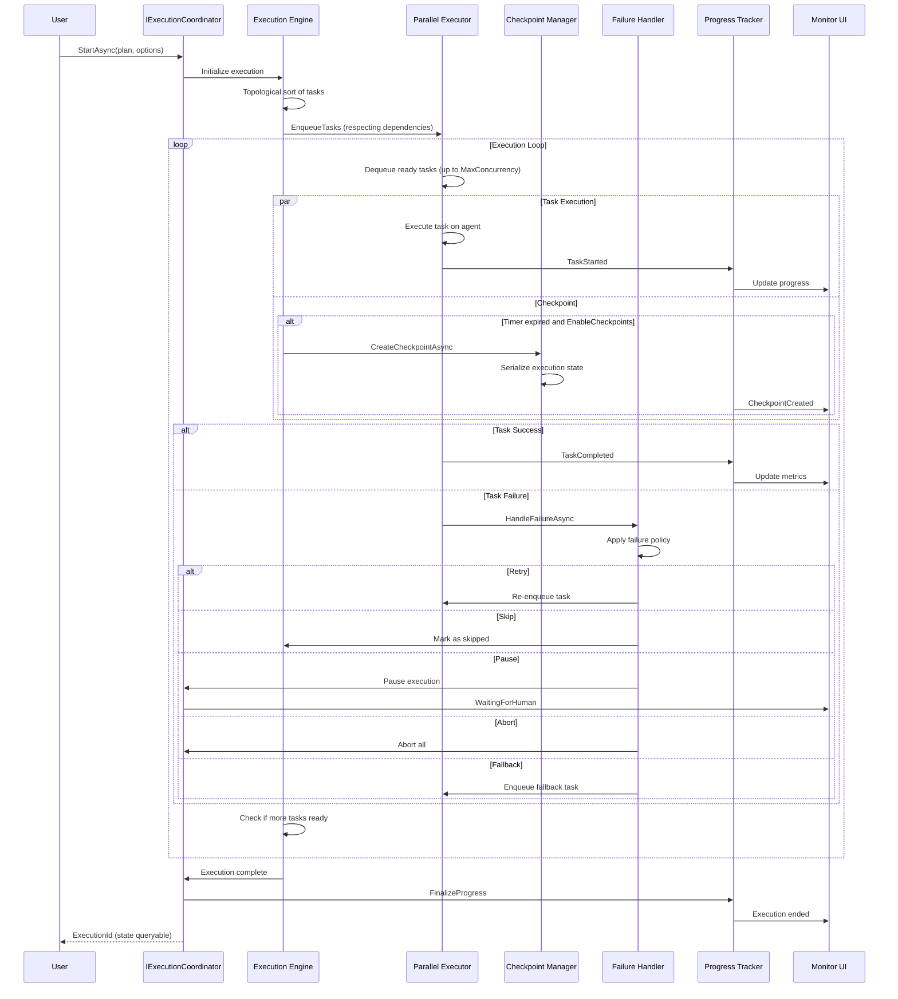
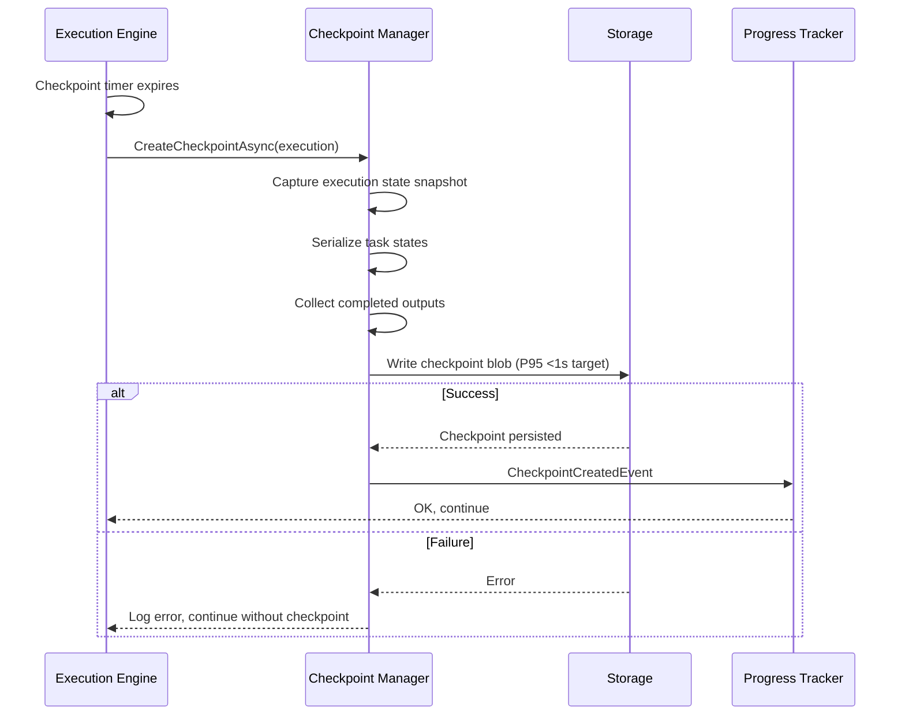
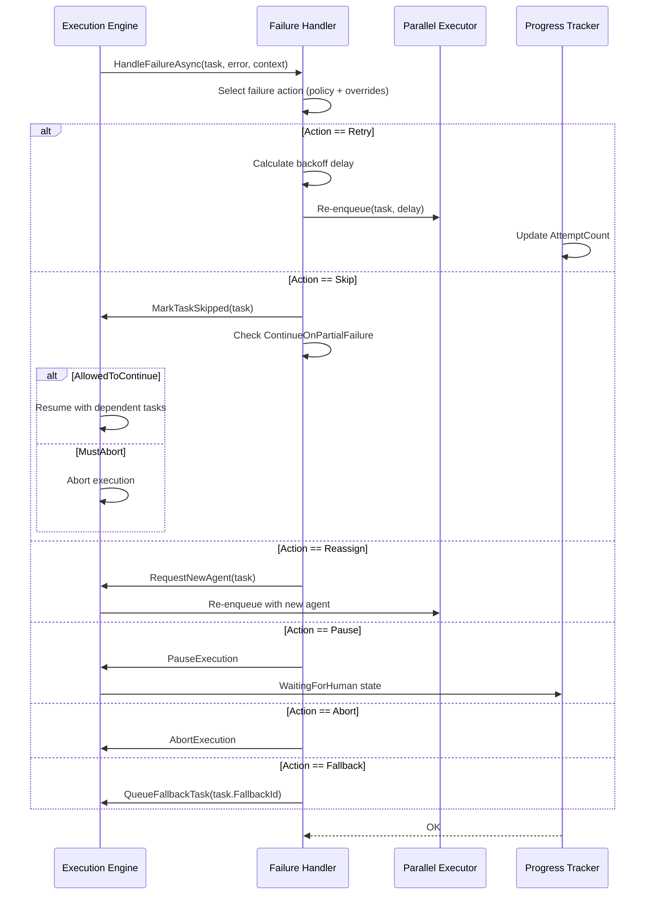

# LCS-SBD-v0.13.3-ORC: Scope Overview — Execution Coordinator

## Document Control

| Field            | Value                                                        |
| :--------------- | :----------------------------------------------------------- |
| **Document ID**  | LCS-SBD-v0.13.3-ORC                                          |
| **Version**      | v0.13.3                                                      |
| **Codename**     | Execution Coordinator (Orchestration Phase 3)                |
| **Status**       | Draft                                                        |
| **Last Updated** | 2026-01-31                                                   |
| **Owner**        | Orchestration Architecture Lead                              |
| **Depends On**   | v0.13.2-ORC (Agent Selection), v0.12.2-AGT (Lifecycle Manager), v0.12.3-AGT (Communication Bus), v0.12.4-AGT (Memory) |

---

## 1. Executive Summary

### 1.1 The Vision

**v0.13.3-ORC** delivers **Execution Coordinator** — the runtime engine that orchestrates the execution of task graphs in Lexichord. This establishes:

- A robust execution engine that processes task graphs in the correct order
- Checkpoint/restore capability for fault tolerance and resumable execution
- Parallel execution of independent tasks with configurable concurrency limits
- Sophisticated failure handling with multiple recovery strategies (retry, skip, reassign, pause, abort, fallback)
- Real-time progress tracking and reporting
- A visual monitoring dashboard for observing execution state

This is the heart of the platform—without reliable execution coordination, intelligent planning is meaningless.

### 1.2 Business Value

- **Reliability:** Checkpoint/restore enables crash recovery without starting over.
- **Efficiency:** Parallel execution reduces total execution time for independent tasks.
- **Flexibility:** Multiple failure policies accommodate diverse business requirements.
- **Visibility:** Real-time progress tracking and monitoring enable proactive intervention.
- **Resilience:** Sophisticated failure recovery prevents cascading failures.
- **Control:** Pause/resume capabilities enable human review and manual intervention.

### 1.3 Success Criteria

1. Task graphs execute in the correct topological order.
2. Checkpoint save completes in <1s P95 latency.
3. Parallel execution achieves near-linear speedup (up to license limits).
4. All failure modes (retry, skip, reassign, pause, abort, fallback) function correctly.
5. Progress updates occur every 500ms or on significant state changes.
6. Execution state is recoverable from checkpoints without data loss.
7. License tiers properly enforce concurrency and feature limits.

---

## 2. Key Deliverables

### 2.1 Sub-Parts

| Sub-Part | Title | Description | Est. Hours |
|:---------|:------|:------------|:-----------|
| v0.13.3a | Execution Engine | Core execution loop for task graphs | 14 |
| v0.13.3b | Checkpoint Manager | Create/restore execution checkpoints | 10 |
| v0.13.3c | Parallel Executor | Execute independent tasks concurrently | 10 |
| v0.13.3d | Failure Handler | Handle task failures with multiple recovery strategies | 10 |
| v0.13.3e | Progress Tracker | Track and report execution progress | 8 |
| v0.13.3f | Execution Monitor UI | Visual monitoring of execution state | 6 |
| **Total** | | | **58 hours** |

### 2.2 Core Interfaces

```csharp
/// <summary>
/// Main coordinator interface for orchestrating task graph execution.
/// Responsible for starting, pausing, resuming, and canceling executions.
/// </summary>
public interface IExecutionCoordinator
{
    /// <summary>
    /// Start executing a task graph with the given options.
    /// Returns immediately with an ExecutionId; execution happens asynchronously.
    /// </summary>
    Task<ExecutionId> StartAsync(
        Plan plan,
        ExecutionOptions options,
        CancellationToken ct = default);

    /// <summary>
    /// Resume a paused execution from its current checkpoint.
    /// </summary>
    Task ResumeAsync(
        ExecutionId executionId,
        CancellationToken ct = default);

    /// <summary>
    /// Pause a running execution at the next safe point (after current task completes).
    /// Execution state is preserved and can be resumed later.
    /// </summary>
    Task PauseAsync(
        ExecutionId executionId,
        CancellationToken ct = default);

    /// <summary>
    /// Cancel a running or paused execution.
    /// Cleanup occurs asynchronously; QueryAsync can be used to check completion.
    /// </summary>
    Task CancelAsync(
        ExecutionId executionId,
        CancellationToken ct = default);

    /// <summary>
    /// Get the current state of an execution.
    /// </summary>
    Task<Execution?> GetExecutionAsync(
        ExecutionId executionId,
        CancellationToken ct = default);

    /// <summary>
    /// Subscribe to execution events (task started, completed, failed, etc).
    /// Returns an async enumerable that yields events as they occur.
    /// </summary>
    IAsyncEnumerable<ExecutionEvent> ObserveAsync(
        ExecutionId executionId,
        CancellationToken ct = default);
}

/// <summary>
/// Immutable identifier for an execution instance.
/// </summary>
public readonly record struct ExecutionId
{
    public Guid Value { get; }

    public ExecutionId(Guid value)
    {
        if (value == Guid.Empty)
            throw new ArgumentException("ExecutionId cannot be empty", nameof(value));
        Value = value;
    }

    public static ExecutionId New() => new(Guid.NewGuid());

    public static ExecutionId Parse(string s) => new(Guid.Parse(s));

    public static bool TryParse(string s, out ExecutionId result)
    {
        if (Guid.TryParse(s, out var guid))
        {
            result = new ExecutionId(guid);
            return true;
        }
        result = default;
        return false;
    }

    public override string ToString() => $"exec:{Value:N}";

    public static implicit operator Guid(ExecutionId id) => id.Value;
}

/// <summary>
/// Configuration options for starting an execution.
/// </summary>
public record ExecutionOptions
{
    /// <summary>
    /// Maximum number of tasks to execute concurrently.
    /// License tier determines actual limit.
    /// </summary>
    public int MaxConcurrency { get; init; } = 1;

    /// <summary>
    /// Whether to create checkpoints during execution for recovery.
    /// </summary>
    public bool EnableCheckpoints { get; init; } = false;

    /// <summary>
    /// Interval at which to create checkpoints (if enabled).
    /// </summary>
    public TimeSpan CheckpointInterval { get; init; } = TimeSpan.FromMinutes(5);

    /// <summary>
    /// Policy for handling task failures.
    /// </summary>
    public FailurePolicy FailurePolicy { get; init; } = new();

    /// <summary>
    /// Maximum time the entire execution can run.
    /// Null means no limit.
    /// </summary>
    public TimeSpan? GlobalTimeout { get; init; } = null;

    /// <summary>
    /// If true, execution pauses when a task requires human review.
    /// Otherwise, human review is logged but execution continues.
    /// </summary>
    public bool PauseOnHumanReview { get; init; } = false;
}

/// <summary>
/// Policy for handling task failures during execution.
/// </summary>
public record FailurePolicy
{
    /// <summary>
    /// Default action when a task fails (before checking overrides).
    /// </summary>
    public FailureAction DefaultAction { get; init; } = FailureAction.Retry;

    /// <summary>
    /// Maximum number of retry attempts for a single task.
    /// </summary>
    public int MaxRetries { get; init; } = 3;

    /// <summary>
    /// Backoff strategy for retries (exponential, linear, constant).
    /// </summary>
    public RetryBackoffStrategy RetryBackoff { get; init; } = RetryBackoffStrategy.Exponential;

    /// <summary>
    /// If true, execution continues even if some tasks fail.
    /// If false, one failure fails the entire execution.
    /// </summary>
    public bool ContinueOnPartialFailure { get; init; } = false;

    /// <summary>
    /// Override default action for specific task types.
    /// Key: task type name, Value: action to take.
    /// </summary>
    public IReadOnlyDictionary<string, FailureAction> TaskTypeOverrides { get; init; } =
        new Dictionary<string, FailureAction>();
}

/// <summary>
/// Actions that can be taken when a task fails.
/// </summary>
public enum FailureAction
{
    /// <summary>Retry the task (respects MaxRetries and RetryBackoff).</summary>
    Retry,

    /// <summary>Skip this task and continue with dependents (if allowed).</summary>
    Skip,

    /// <summary>Try to reassign the task to a different agent.</summary>
    Reassign,

    /// <summary>Pause execution and wait for human intervention.</summary>
    Pause,

    /// <summary>Abort the entire execution immediately.</summary>
    Abort,

    /// <summary>Execute a fallback task if available.</summary>
    Fallback
}

/// <summary>
/// Backoff strategy for retry attempts.
/// </summary>
public enum RetryBackoffStrategy
{
    /// <summary>Fixed delay between retries (1s).</summary>
    Constant,

    /// <summary>Linear increase in delay: attempt * 1s.</summary>
    Linear,

    /// <summary>Exponential increase in delay: 2^attempt * 100ms.</summary>
    Exponential
}

/// <summary>
/// Represents a single execution instance.
/// </summary>
public record Execution
{
    /// <summary>
    /// Unique identifier for this execution.
    /// </summary>
    public required ExecutionId Id { get; init; }

    /// <summary>
    /// The original intent/goal that initiated this execution.
    /// </summary>
    public required Intent OriginalIntent { get; init; }

    /// <summary>
    /// Current state of the execution.
    /// </summary>
    public ExecutionState State { get; init; }

    /// <summary>
    /// The task graph being executed.
    /// </summary>
    public required Plan Plan { get; init; }

    /// <summary>
    /// When execution started.
    /// </summary>
    public DateTimeOffset? StartedAt { get; init; }

    /// <summary>
    /// When execution completed (or was canceled/failed).
    /// </summary>
    public DateTimeOffset? CompletedAt { get; init; }

    /// <summary>
    /// Current progress of the execution.
    /// </summary>
    public ExecutionProgress Progress { get; init; }

    /// <summary>
    /// State of individual task executions.
    /// Key: Task.Id, Value: TaskExecution details.
    /// </summary>
    public IReadOnlyDictionary<string, TaskExecution> TaskExecutions { get; init; } =
        new Dictionary<string, TaskExecution>();

    /// <summary>
    /// Checkpoints created during this execution.
    /// </summary>
    public IReadOnlyList<ExecutionCheckpoint> Checkpoints { get; init; } = [];

    /// <summary>
    /// Final result if execution completed (success or failure details).
    /// </summary>
    public ExecutionResult? Result { get; init; }
}

/// <summary>
/// Current state of an execution.
/// </summary>
public enum ExecutionState
{
    /// <summary>Execution is queued but hasn't started yet.</summary>
    Pending,

    /// <summary>Execution is currently running.</summary>
    Running,

    /// <summary>Execution is paused and can be resumed.</summary>
    Paused,

    /// <summary>Execution is waiting for human review/approval.</summary>
    WaitingForHuman,

    /// <summary>Execution completed successfully.</summary>
    Completed,

    /// <summary>Execution failed and cannot continue.</summary>
    Failed,

    /// <summary>Execution was canceled by user/system.</summary>
    Cancelled
}

/// <summary>
/// Current progress of an execution.
/// </summary>
public record ExecutionProgress
{
    /// <summary>Total number of tasks in the graph.</summary>
    public int TotalTasks { get; init; }

    /// <summary>Number of tasks that have completed successfully.</summary>
    public int CompletedTasks { get; init; }

    /// <summary>Number of tasks that failed.</summary>
    public int FailedTasks { get; init; }

    /// <summary>Number of tasks currently running.</summary>
    public int RunningTasks { get; init; }

    /// <summary>Number of tasks waiting to run.</summary>
    public int PendingTasks { get; init; }

    /// <summary>Percentage complete (0-100).</summary>
    public float PercentComplete { get; init; }

    /// <summary>Time elapsed since execution started.</summary>
    public TimeSpan Elapsed { get; init; }

    /// <summary>Estimated time remaining (or null if unknown).</summary>
    public TimeSpan? EstimatedRemaining { get; init; }
}

/// <summary>
/// Execution result (success or failure).
/// </summary>
public record ExecutionResult
{
    /// <summary>Whether the execution succeeded.</summary>
    public bool IsSuccess { get; init; }

    /// <summary>Error message if failed.</summary>
    public string? ErrorMessage { get; init; }

    /// <summary>Final outputs from tasks that completed.</summary>
    public IReadOnlyDictionary<string, TaskOutput> FinalOutputs { get; init; } =
        new Dictionary<string, TaskOutput>();
}

/// <summary>
/// Represents the execution state of a single task.
/// </summary>
public record TaskExecution
{
    /// <summary>ID of the task being executed.</summary>
    public required string TaskId { get; init; }

    /// <summary>ID of the agent executing this task (if assigned).</summary>
    public AgentId? ExecutingAgentId { get; init; }

    /// <summary>Current state of this task's execution.</summary>
    public TaskExecutionState State { get; init; }

    /// <summary>When this task started executing.</summary>
    public DateTimeOffset? StartedAt { get; init; }

    /// <summary>When this task completed.</summary>
    public DateTimeOffset? CompletedAt { get; init; }

    /// <summary>Number of attempts made (includes retries).</summary>
    public int AttemptCount { get; init; }

    /// <summary>Output produced by the task (if completed).</summary>
    public TaskOutput? Output { get; init; }

    /// <summary>Error message if the task failed.</summary>
    public string? ErrorMessage { get; init; }
}

/// <summary>
/// Current state of a single task execution.
/// </summary>
public enum TaskExecutionState
{
    /// <summary>Task is waiting for its dependencies to complete.</summary>
    Pending,

    /// <summary>Task is in the ready queue, waiting for an agent.</summary>
    Queued,

    /// <summary>Task is currently executing on an agent.</summary>
    Running,

    /// <summary>Task completed successfully.</summary>
    Completed,

    /// <summary>Task failed and exhausted recovery options.</summary>
    Failed,

    /// <summary>Task was skipped (e.g., due to failure policy).</summary>
    Skipped,

    /// <summary>Task was canceled.</summary>
    Cancelled
}

/// <summary>
/// Output produced by a task execution.
/// </summary>
public record TaskOutput
{
    /// <summary>The actual result value.</summary>
    public object? Value { get; init; }

    /// <summary>MIME type of the content (e.g., "text/plain", "application/json").</summary>
    public string? ContentType { get; init; }

    /// <summary>Number of tokens consumed to produce this output.</summary>
    public int? TokensUsed { get; init; }

    /// <summary>Quality score (0.0-1.0) assigned to the output.</summary>
    public float? QualityScore { get; init; }

    /// <summary>Additional metadata about the output.</summary>
    public IReadOnlyDictionary<string, object>? Metadata { get; init; }
}
```

### 2.3 Checkpoint Manager Interface

```csharp
/// <summary>
/// Manages creation and restoration of execution checkpoints.
/// </summary>
public interface ICheckpointManager
{
    /// <summary>
    /// Create a checkpoint of the current execution state.
    /// Returns the checkpoint for reference.
    /// </summary>
    Task<ExecutionCheckpoint> CreateCheckpointAsync(
        ExecutionId executionId,
        Execution execution,
        CancellationToken ct = default);

    /// <summary>
    /// Restore an execution from a checkpoint.
    /// Returns the restored execution state.
    /// </summary>
    Task<Execution> RestoreFromCheckpointAsync(
        ExecutionId checkpointId,
        CancellationToken ct = default);

    /// <summary>
    /// Get all checkpoints for an execution.
    /// </summary>
    Task<IReadOnlyList<ExecutionCheckpoint>> GetCheckpointsAsync(
        ExecutionId executionId,
        CancellationToken ct = default);

    /// <summary>
    /// Remove old checkpoints to save storage.
    /// Keeps the last N checkpoints and removes the rest.
    /// </summary>
    Task PruneCheckpointsAsync(
        ExecutionId executionId,
        int keepCount,
        CancellationToken ct = default);
}

/// <summary>
/// A checkpoint storing the state of an execution at a point in time.
/// </summary>
public record ExecutionCheckpoint
{
    /// <summary>Unique identifier for this checkpoint.</summary>
    public required ExecutionId CheckpointId { get; init; }

    /// <summary>The execution this checkpoint belongs to.</summary>
    public required ExecutionId ExecutionId { get; init; }

    /// <summary>When this checkpoint was created.</summary>
    public DateTimeOffset CreatedAt { get; init; }

    /// <summary>The complete execution state at checkpoint time.</summary>
    public required Execution StateAtCheckpoint { get; init; }

    /// <summary>State of each task at checkpoint time.</summary>
    public IReadOnlyDictionary<string, TaskExecutionState> TaskStates { get; init; } =
        new Dictionary<string, TaskExecutionState>();

    /// <summary>Outputs from completed tasks.</summary>
    public IReadOnlyDictionary<string, TaskOutput> CompletedOutputs { get; init; } =
        new Dictionary<string, TaskOutput>();

    /// <summary>Size of this checkpoint in bytes (for storage management).</summary>
    public long SizeBytes { get; init; }
}
```

### 2.4 Execution Events

```csharp
/// <summary>
/// Base class for events that occur during execution.
/// </summary>
public abstract record ExecutionEvent
{
    /// <summary>The execution this event belongs to.</summary>
    public required ExecutionId ExecutionId { get; init; }

    /// <summary>When the event occurred.</summary>
    public DateTimeOffset OccurredAt { get; init; }
}

/// <summary>
/// Fired when a task starts executing.
/// </summary>
public record TaskStartedEvent : ExecutionEvent
{
    public required string TaskId { get; init; }
    public required AgentId AgentId { get; init; }
}

/// <summary>
/// Fired when a task completes successfully.
/// </summary>
public record TaskCompletedEvent : ExecutionEvent
{
    public required string TaskId { get; init; }
    public required TaskOutput Output { get; init; }
    public TimeSpan Duration { get; init; }
}

/// <summary>
/// Fired when a task fails.
/// </summary>
public record TaskFailedEvent : ExecutionEvent
{
    public required string TaskId { get; init; }
    public required string ErrorMessage { get; init; }
    public int AttemptCount { get; init; }
    public FailureAction ActionTaken { get; init; }
}

/// <summary>
/// Fired when a checkpoint is created.
/// </summary>
public record CheckpointCreatedEvent : ExecutionEvent
{
    public required ExecutionId CheckpointId { get; init; }
    public int CompletedTasks { get; init; }
    public long SizeBytes { get; init; }
}

/// <summary>
/// Fired when a task requires human review.
/// </summary>
public record HumanReviewRequestedEvent : ExecutionEvent
{
    public required string TaskId { get; init; }
    public required string ReviewReason { get; init; }
    public IReadOnlyDictionary<string, object>? Context { get; init; }
}
```

---

## 3. Architecture

### 3.1 Component Overview

```
┌─────────────────────────────────────────────────────────────────────────────┐
│                      Execution Coordinator Layer                             │
├─────────────────────────────────────────────────────────────────────────────┤
│                                                                              │
│  ┌─────────────────────────────────────────────────────────────────────┐   │
│  │                    IExecutionCoordinator                             │   │
│  │  ┌──────────────┐  ┌──────────────┐  ┌──────────────┐              │   │
│  │  │    Start     │  │   Pause/     │  │   Cancel    │              │   │
│  │  │  Execution   │  │   Resume     │  │ Execution   │              │   │
│  │  └──────┬───────┘  └──────┬───────┘  └──────┬───────┘              │   │
│  │         │                 │                 │                       │   │
│  │         ▼                 ▼                 ▼                       │   │
│  │  ┌─────────────────────────────────────────────────────────────┐   │   │
│  │  │                   Execution Engine                           │   │   │
│  │  │  ┌──────────────┐  ┌──────────────┐  ┌──────────────┐      │   │   │
│  │  │  │  Task Graph  │  │   Ready      │  │ Dependency   │      │   │   │
│  │  │  │  Processing  │  │   Queue      │  │ Resolver     │      │   │   │
│  │  │  └──────────────┘  └──────────────┘  └──────────────┘      │   │   │
│  │  └─────────────────────────────────────────────────────────────┘   │   │
│  └─────────────────────────────────────────────────────────────────────┘   │
│                                     │                                       │
│         ┌───────────────────────────┼───────────────────────────┐           │
│         ▼                           ▼                           ▼           │
│  ┌──────────────────────┐  ┌──────────────────────┐  ┌──────────────────┐ │
│  │  Parallel Executor   │  │ Checkpoint Manager   │  │ Failure Handler  │ │
│  │  ┌────────────────┐  │  │ ┌────────────────┐  │  │ ┌──────────────┐ │ │
│  │  │ Concurrency    │  │  │ │ Create/Restore │  │  │ │ Retry Logic  │ │ │
│  │  │ Control        │  │  │ │ Checkpoints    │  │  │ │ Recovery     │ │ │
│  │  │ Task Batching  │  │  │ │ Storage        │  │  │ │ Strategies   │ │ │
│  │  └────────────────┘  │  │ └────────────────┘  │  │ └──────────────┘ │ │
│  └──────────────────────┘  └──────────────────────┘  └──────────────────┘ │
│         │                           │                           │           │
│         │         ┌─────────────────┴─────────────────┐         │           │
│         │         ▼                                   ▼         │           │
│         │    ┌───────────────────────────────────────────┐      │           │
│         │    │        Progress Tracker                   │      │           │
│         │    │  ┌──────────────────────────────────────┐│      │           │
│         │    │  │ • Task state updates                 ││      │           │
│         │    │  │ • Progress % calculation             ││      │           │
│         │    │  │ • Event publishing                   ││      │           │
│         │    │  └──────────────────────────────────────┘│      │           │
│         │    └───────────────────────────────────────────┘      │           │
│         │         │                                       │     │           │
│         └─────────┼───────────────────────────────────────┘     │           │
│                   │                                              │           │
│                   ▼                                              ▼           │
│  ┌───────────────────────────────────────────────────────────────────────┐ │
│  │             Execution Monitor UI                                      │ │
│  │  ┌──────────────────────────────────────────────────────────────────┐│ │
│  │  │ • Execution timeline                                            ││ │
│  │  │ • Task state visualization                                      ││ │
│  │  │ • Progress indicators                                           ││ │
│  │  │ • Log/event stream                                              ││ │
│  │  │ • Controls (Pause/Resume/Cancel)                                ││ │
│  │  └──────────────────────────────────────────────────────────────────┘│ │
│  └───────────────────────────────────────────────────────────────────────┘ │
│                                                                              │
└─────────────────────────────────────────────────────────────────────────────┘
```

### 3.2 Execution Flow



### 3.3 Checkpoint Creation Flow



### 3.4 Failure Handling Flow



---

## 4. Data Model

### 4.1 Database Schema

```sql
-- Executions table
CREATE TABLE executions (
    id UUID PRIMARY KEY DEFAULT gen_random_uuid(),
    original_intent_id UUID NOT NULL,
    plan_id UUID NOT NULL,
    state VARCHAR(50) NOT NULL,
    started_at TIMESTAMPTZ,
    completed_at TIMESTAMPTZ,
    total_tasks INT NOT NULL,
    completed_tasks INT NOT NULL,
    failed_tasks INT NOT NULL,
    running_tasks INT NOT NULL,
    pending_tasks INT NOT NULL,
    percent_complete REAL,
    elapsed_ms BIGINT,
    estimated_remaining_ms BIGINT,
    execution_json JSONB NOT NULL,
    created_at TIMESTAMPTZ NOT NULL DEFAULT NOW(),
    updated_at TIMESTAMPTZ NOT NULL DEFAULT NOW()
);

CREATE INDEX idx_executions_state ON executions(state);
CREATE INDEX idx_executions_created ON executions(created_at DESC);
CREATE INDEX idx_executions_plan ON executions(plan_id);

-- Task executions table
CREATE TABLE task_executions (
    id UUID PRIMARY KEY DEFAULT gen_random_uuid(),
    execution_id UUID NOT NULL REFERENCES executions(id) ON DELETE CASCADE,
    task_id VARCHAR(256) NOT NULL,
    executing_agent_id UUID,
    state VARCHAR(50) NOT NULL,
    started_at TIMESTAMPTZ,
    completed_at TIMESTAMPTZ,
    attempt_count INT NOT NULL,
    output_json JSONB,
    error_message TEXT,
    created_at TIMESTAMPTZ NOT NULL DEFAULT NOW(),
    updated_at TIMESTAMPTZ NOT NULL DEFAULT NOW()
);

CREATE INDEX idx_task_executions_execution ON task_executions(execution_id);
CREATE INDEX idx_task_executions_task ON task_executions(task_id);
CREATE INDEX idx_task_executions_state ON task_executions(state);

-- Checkpoints table
CREATE TABLE execution_checkpoints (
    id UUID PRIMARY KEY DEFAULT gen_random_uuid(),
    execution_id UUID NOT NULL REFERENCES executions(id) ON DELETE CASCADE,
    checkpoint_id UUID NOT NULL,
    created_at TIMESTAMPTZ NOT NULL,
    state_at_checkpoint_json JSONB NOT NULL,
    task_states_json JSONB NOT NULL,
    completed_outputs_json JSONB NOT NULL,
    size_bytes BIGINT NOT NULL,
    created_at_system TIMESTAMPTZ NOT NULL DEFAULT NOW()
);

CREATE INDEX idx_checkpoints_execution ON execution_checkpoints(execution_id);
CREATE INDEX idx_checkpoints_created ON execution_checkpoints(created_at DESC);

-- Execution events table
CREATE TABLE execution_events (
    id UUID PRIMARY KEY DEFAULT gen_random_uuid(),
    execution_id UUID NOT NULL REFERENCES executions(id) ON DELETE CASCADE,
    event_type VARCHAR(50) NOT NULL,
    occurred_at TIMESTAMPTZ NOT NULL,
    event_json JSONB NOT NULL,
    created_at TIMESTAMPTZ NOT NULL DEFAULT NOW()
);

CREATE INDEX idx_execution_events_execution ON execution_events(execution_id);
CREATE INDEX idx_execution_events_type ON execution_events(event_type);
CREATE INDEX idx_execution_events_occurred ON execution_events(occurred_at DESC);
```

### 4.2 Execution JSON Structure

```json
{
  "id": "exec:12345678-1234-5678-1234-567812345678",
  "originalIntent": {
    "id": "intent:...",
    "description": "Process quarterly report"
  },
  "state": "Running",
  "plan": {
    "id": "plan:...",
    "tasks": [
      {
        "id": "task-1",
        "description": "Extract data",
        "type": "extraction",
        "dependencies": []
      },
      {
        "id": "task-2",
        "description": "Analyze metrics",
        "type": "analysis",
        "dependencies": ["task-1"]
      }
    ]
  },
  "startedAt": "2026-01-31T10:00:00Z",
  "completedAt": null,
  "progress": {
    "totalTasks": 5,
    "completedTasks": 2,
    "failedTasks": 0,
    "runningTasks": 1,
    "pendingTasks": 2,
    "percentComplete": 40.0,
    "elapsedMs": 12345,
    "estimatedRemainingMs": 18000
  },
  "taskExecutions": {
    "task-1": {
      "taskId": "task-1",
      "executingAgentId": "agent:abc...",
      "state": "Completed",
      "startedAt": "2026-01-31T10:00:05Z",
      "completedAt": "2026-01-31T10:00:30Z",
      "attemptCount": 1,
      "output": {
        "value": {...},
        "contentType": "application/json",
        "tokensUsed": 250,
        "qualityScore": 0.95
      }
    }
  },
  "checkpoints": [
    {
      "checkpointId": "ckpt:xyz...",
      "executionId": "exec:...",
      "createdAt": "2026-01-31T10:00:15Z",
      "sizeBytes": 524288
    }
  ],
  "result": null
}
```

---

## 5. License Gating

### 5.1 Feature Tiers

| Tier | Concurrency | Checkpoints | Recovery | Distributed | Comments |
|:-----|:------------|:------------|:---------|:-----------|:---------|
| Core | Sequential (1) | No | None | No | Basic single-task execution |
| WriterPro | Up to 3 | Yes | Retry only | No | Parallel execution for small plans |
| Teams | Full (10+) | Yes | All strategies | No | Enterprise-grade execution |
| Enterprise | Unlimited | Yes | All + distributed | Yes | Multi-node execution support |

### 5.2 Feature Enforcement

- **Sequential execution:** Core tier limited to `MaxConcurrency = 1` enforced at runtime
- **Checkpoints:** WriterPro+ can enable `EnableCheckpoints`, Core throws error if attempted
- **Failure policies:** All tiers support default retry; Teams/Enterprise unlock full failure action set
- **Global timeout:** All tiers support (essential safety feature)

---

## 6. Performance Targets

| Metric | Target | Measurement |
|:-------|:-------|:------------|
| Checkpoint save | <1s P95 | Serialization + storage |
| Task dispatch | <50ms P95 | From ready queue to agent |
| Progress update | <100ms P95 | Event publication |
| Dependency resolution | <10ms P95 | Per task at dequeue |
| Concurrent task limit | License-dependent | Up to 1/3/10+ tasks running |

---

## 7. Risk Mitigation

| Risk | Mitigation |
|:-----|:-----------|
| Checkpoint corruption | Checksums, dual-write during transition |
| Cascade failures | Circuit breaker on repeated failures, abort limits |
| Memory exhaustion | Checkpoint pruning, configurable queue limits |
| Deadlocks | Timeout on task completion, dependency cycle detection |
| Progress tracking lag | Event batching with 500ms flush interval |
| Large task outputs | Stream outputs instead of full materialization |

---

## 8. Dependencies

| Component | Source | Usage |
|:----------|:-------|:------|
| `IAgent`, `AgentId` | v0.12.1-AGT | Execute tasks on agents |
| `IPlanningService` | v0.13.2-ORC | Obtain task graphs |
| `ILifecycleManager` | v0.12.2-AGT | Agent lifecycle control |
| `IMessageBus` | v0.12.3-AGT | Event publication |
| `IMemoryService` | v0.12.4-AGT | Task output storage |
| `IAuthorizationService` | v0.11.1-SEC | Permission checks for execution |
| `IEventStore` | Core | Checkpoint and event persistence |

---

## 9. Testing Strategy

### 9.1 Unit Tests

- Execution state machine transitions
- Failure policy evaluation
- Checkpoint serialization/deserialization
- Progress calculation
- Dependency resolution

### 9.2 Integration Tests

- Full execution flow with realistic task graphs
- Pause/resume from checkpoints
- All failure action paths
- Concurrent execution with varying MaxConcurrency
- Event stream ordering and completeness

### 9.3 Performance Tests

- Checkpoint creation latency (<1s P95)
- 100-task graphs with 50% concurrency
- 1000 concurrent event subscribers
- Memory usage with large task outputs
- Checkpoint storage scaling (GB+)

---

## 10. Future Considerations

- **Distributed execution:** Multi-node coordination for Enterprise tier
- **Dynamic agent reassignment:** Proactive task migration on agent degradation
- **Human review integration:** Rich UI for paused executions with suggested actions
- **Advanced visualization:** DAG rendering with live execution overlay
- **Execution profiling:** Per-task timing and resource attribution
- **Advanced retry strategies:** Adaptive backoff based on error patterns

---

