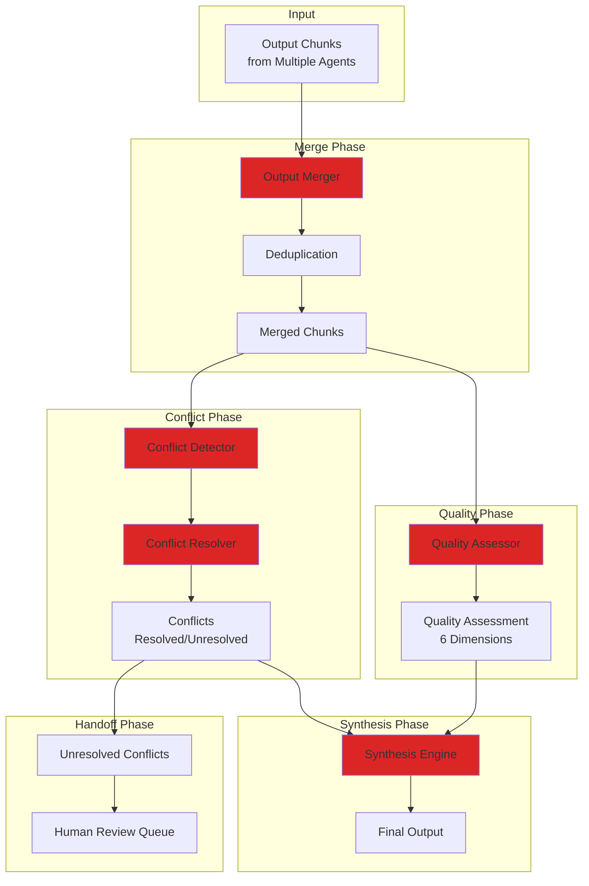
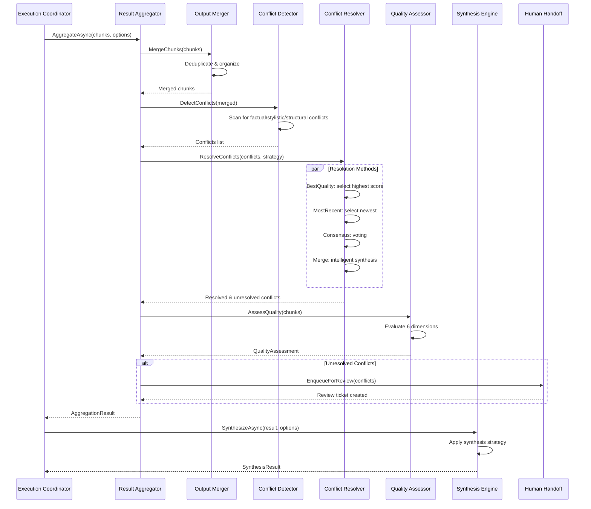

# LCS-SBD-v0.13.4-ORC: Scope Overview — Result Aggregation & Synthesis

## Document Control

| Field            | Value                                                        |
| :--------------- | :----------------------------------------------------------- |
| **Document ID**  | LCS-SBD-v0.13.4-ORC                                          |
| **Version**      | v0.13.4                                                      |
| **Codename**     | Result Aggregation & Synthesis (Orchestration Phase 4)       |
| **Status**       | Draft                                                        |
| **Last Updated** | 2026-01-31                                                   |
| **Owner**        | Orchestration Lead                                           |
| **Depends On**   | v0.13.3-ORC (Execution Coordinator), v0.6.5-KG (Validation Engine), v0.2.3 (Style Checker) |

---

## 1. Executive Summary

### 1.1 The Vision

**v0.13.4-ORC** delivers **Result Aggregation & Synthesis** — a comprehensive system for merging outputs from multiple agents into coherent, high-quality results. This establishes:

- Intelligent merging of outputs from multiple concurrent agents
- Automatic conflict detection and resolution across different agent outputs
- Quality assessment across multiple dimensions (completeness, accuracy, consistency, style, clarity, structure)
- Flexible synthesis strategies (concatenation, interleaving, intelligent synthesis, template-based)
- Human handoff mechanisms for unresolved conflicts
- Visual dashboard for aggregation results and quality metrics

This is the final step in the orchestration pipeline—transforming fragmented agent outputs into unified, validated results.

### 1.2 Business Value

- **Quality Assurance:** Multi-dimensional quality assessment ensures outputs meet standards.
- **Conflict Resolution:** Automatic detection and resolution reduces manual review time.
- **Flexibility:** Multiple synthesis strategies support diverse use cases.
- **Transparency:** Full provenance tracking shows where each piece came from.
- **Governance:** Quality thresholds and license-based feature gating enforce standards.
- **User Control:** Results dashboard provides visibility into aggregation decisions.

### 1.3 Success Criteria

1. Merge outputs from 2+ agents with <1 second latency.
2. Detect all major conflicts (factual, stylistic, structural, terminology, overlap, gap).
3. Resolve conflicts using 5+ strategies with human fallback.
4. Assess quality across 6 dimensions with <3s P95 latency.
5. Synthesize final output using 4+ strategies with <5s P95 latency.
6. Maintain complete provenance for all chunks and conflicts.
7. Display aggregation results with quality metrics in dashboard.

---

## 2. Key Deliverables

### 2.1 Sub-Parts

| Sub-Part | Title | Description | Est. Hours |
|:---------|:------|:------------|:-----------|
| v0.13.4a | Output Merger | Merge outputs from multiple agents | 12 |
| v0.13.4b | Conflict Resolver | Detect and resolve output conflicts | 10 |
| v0.13.4c | Quality Assessor | Assess quality across multiple dimensions | 10 |
| v0.13.4d | Synthesis Engine | Synthesize final output using various strategies | 10 |
| v0.13.4e | Human Handoff | Hand off unresolved conflicts to humans | 6 |
| v0.13.4f | Results Dashboard UI | Visualize aggregation and quality results | 6 |
| **Total** | | | **54 hours** |

### 2.2 Key Interfaces

```csharp
/// <summary>
/// Primary interface for aggregating results from multiple agents.
/// </summary>
public interface IResultAggregator
{
    /// <summary>
    /// Aggregate outputs from multiple execution tasks into a unified result.
    /// </summary>
    Task<AggregationResult> AggregateAsync(
        Guid executionId,
        IReadOnlyList<OutputChunk> chunks,
        AggregationOptions options,
        CancellationToken ct = default);

    /// <summary>
    /// Synthesize aggregated result using specified strategy.
    /// </summary>
    Task<SynthesisResult> SynthesizeAsync(
        AggregationResult aggregatedResult,
        SynthesisOptions options,
        CancellationToken ct = default);
}

/// <summary>
/// Configuration for result aggregation behavior.
/// </summary>
public record AggregationOptions
{
    /// <summary>
    /// Strategy for resolving conflicting chunks.
    /// </summary>
    public ConflictStrategy ConflictStrategy { get; init; } = ConflictStrategy.BestQuality;

    /// <summary>
    /// Whether to preserve provenance information.
    /// </summary>
    public bool IncludeProvenance { get; init; } = true;

    /// <summary>
    /// Minimum quality score required for chunks to be included.
    /// </summary>
    public float MinQualityThreshold { get; init; } = 0.6f;

    /// <summary>
    /// Whether unresolved conflicts require human review.
    /// </summary>
    public bool RequireHumanReview { get; init; } = false;
}

/// <summary>
/// Strategy for resolving conflicting outputs.
/// </summary>
public enum ConflictStrategy
{
    /// <summary>Select chunk with highest quality score.</summary>
    BestQuality,

    /// <summary>Select most recently generated chunk.</summary>
    MostRecent,

    /// <summary>Select based on consensus (voting) from multiple agents.</summary>
    Consensus,

    /// <summary>Defer to manual review.</summary>
    Manual,

    /// <summary>Merge conflicting chunks intelligently.</summary>
    Merge
}

/// <summary>
/// Output chunk from a single agent execution.
/// </summary>
public record OutputChunk
{
    /// <summary>
    /// Unique identifier for this chunk.
    /// </summary>
    public Guid Id { get; init; } = Guid.NewGuid();

    /// <summary>
    /// ID of the execution task that produced this chunk.
    /// </summary>
    public Guid SourceTaskId { get; init; }

    /// <summary>
    /// ID of the agent that produced this chunk.
    /// </summary>
    public Guid ProducingAgentId { get; init; }

    /// <summary>
    /// The actual content of the chunk.
    /// </summary>
    public required string Content { get; init; }

    /// <summary>
    /// Type of content (text, markdown, json, html, etc.).
    /// </summary>
    public string ContentType { get; init; } = "text";

    /// <summary>
    /// Quality score assigned by the agent (0.0-1.0).
    /// </summary>
    public float QualityScore { get; init; } = 0.8f;

    /// <summary>
    /// Tags for categorizing and grouping chunks.
    /// </summary>
    public IReadOnlyList<string> Tags { get; init; } = [];

    /// <summary>
    /// Provenance information about this chunk.
    /// </summary>
    public ChunkProvenance? Provenance { get; init; }
}

/// <summary>
/// Provenance information for tracking chunk origin and dependencies.
/// </summary>
public record ChunkProvenance
{
    /// <summary>
    /// ID of the task that generated this chunk.
    /// </summary>
    public Guid TaskId { get; init; }

    /// <summary>
    /// ID of the agent that generated this chunk.
    /// </summary>
    public Guid AgentId { get; init; }

    /// <summary>
    /// Timestamp when this chunk was generated.
    /// </summary>
    public DateTimeOffset GeneratedAt { get; init; }

    /// <summary>
    /// IDs of source documents used to generate this chunk.
    /// </summary>
    public IReadOnlyList<Guid> SourceDocumentIds { get; init; } = [];

    /// <summary>
    /// IDs of source entities used to generate this chunk.
    /// </summary>
    public IReadOnlyList<Guid> SourceEntityIds { get; init; } = [];
}

/// <summary>
/// Result of aggregating multiple chunks.
/// </summary>
public record AggregationResult
{
    /// <summary>
    /// ID of the orchestration execution.
    /// </summary>
    public Guid ExecutionId { get; init; }

    /// <summary>
    /// All chunks after merging.
    /// </summary>
    public IReadOnlyList<OutputChunk> Chunks { get; init; } = [];

    /// <summary>
    /// All detected conflicts.
    /// </summary>
    public IReadOnlyList<Conflict> Conflicts { get; init; } = [];

    /// <summary>
    /// Conflicts that were automatically resolved.
    /// </summary>
    public IReadOnlyList<Conflict> ResolvedConflicts { get; init; } = [];

    /// <summary>
    /// Conflicts that require human review.
    /// </summary>
    public IReadOnlyList<Conflict> UnresolvedConflicts { get; init; } = [];

    /// <summary>
    /// Overall quality assessment of aggregated result.
    /// </summary>
    public QualityAssessment? Quality { get; init; }
}

/// <summary>
/// A conflict between chunks.
/// </summary>
public record Conflict
{
    /// <summary>
    /// Unique identifier for this conflict.
    /// </summary>
    public Guid ConflictId { get; init; } = Guid.NewGuid();

    /// <summary>
    /// Type of conflict.
    /// </summary>
    public ConflictType Type { get; init; }

    /// <summary>
    /// Chunks involved in this conflict.
    /// </summary>
    public IReadOnlyList<OutputChunk> ConflictingChunks { get; init; } = [];

    /// <summary>
    /// Human-readable description of the conflict.
    /// </summary>
    public string? Description { get; init; }

    /// <summary>
    /// Severity level of the conflict.
    /// </summary>
    public ConflictSeverity Severity { get; init; }

    /// <summary>
    /// Resolution (if resolved).
    /// </summary>
    public ConflictResolution? Resolution { get; init; }
}

/// <summary>
/// Types of conflicts that can occur.
/// </summary>
public enum ConflictType
{
    /// <summary>Conflicting factual information.</summary>
    Factual,

    /// <summary>Different writing styles or tone.</summary>
    Stylistic,

    /// <summary>Different organizational structures.</summary>
    Structural,

    /// <summary>Different terminology for same concept.</summary>
    Terminology,

    /// <summary>Duplicate or overlapping content.</summary>
    Overlap,

    /// <summary>Missing content or gaps.</summary>
    Gap
}

/// <summary>
/// Severity levels for conflicts.
/// </summary>
public enum ConflictSeverity
{
    /// <summary>Minor issue, negligible impact.</summary>
    Low,

    /// <summary>Moderate issue, may affect clarity.</summary>
    Medium,

    /// <summary>Significant issue, impacts quality.</summary>
    High,

    /// <summary>Critical issue, compromises result.</summary>
    Critical
}

/// <summary>
/// Resolution of a conflict.
/// </summary>
public record ConflictResolution
{
    /// <summary>
    /// Method used to resolve the conflict.
    /// </summary>
    public ConflictResolutionMethod Method { get; init; }

    /// <summary>
    /// Selected chunk (if method = Selected).
    /// </summary>
    public OutputChunk? SelectedChunk { get; init; }

    /// <summary>
    /// Merged content (if method = Merged).
    /// </summary>
    public string? MergedContent { get; init; }

    /// <summary>
    /// Explanation of why this resolution was chosen.
    /// </summary>
    public string? Justification { get; init; }

    /// <summary>
    /// Whether this resolution requires human review.
    /// </summary>
    public bool RequiresHumanReview { get; init; }
}

/// <summary>
/// Methods for resolving conflicts.
/// </summary>
public enum ConflictResolutionMethod
{
    /// <summary>Selected one of the conflicting chunks.</summary>
    Selected,

    /// <summary>Merged multiple chunks.</summary>
    Merged,

    /// <summary>Deferred to human review.</summary>
    Deferred,

    /// <summary>Discarded conflicting content.</summary>
    Discarded
}

/// <summary>
/// Interface for assessing quality of content.
/// </summary>
public interface IQualityAssessor
{
    /// <summary>
    /// Assess quality of content across multiple dimensions.
    /// </summary>
    Task<QualityAssessment> AssessAsync(
        string content,
        string contentType,
        IReadOnlyList<OutputChunk>? sourceChunks = null,
        CancellationToken ct = default);
}

/// <summary>
/// Assessment of content quality.
/// </summary>
public record QualityAssessment
{
    /// <summary>
    /// Overall quality score (0.0-1.0).
    /// </summary>
    public float OverallScore { get; init; }

    /// <summary>
    /// Completeness score - all required information present.
    /// </summary>
    public float CompletenessScore { get; init; }

    /// <summary>
    /// Accuracy score - factual correctness.
    /// </summary>
    public float AccuracyScore { get; init; }

    /// <summary>
    /// Consistency score - internal consistency.
    /// </summary>
    public float ConsistencyScore { get; init; }

    /// <summary>
    /// Style compliance score - adherence to style guide.
    /// </summary>
    public float StyleComplianceScore { get; init; }

    /// <summary>
    /// Clarity score - readability and comprehension.
    /// </summary>
    public float ClarityScore { get; init; }

    /// <summary>
    /// Structure score - logical organization.
    /// </summary>
    public float StructureScore { get; init; }

    /// <summary>
    /// Quality issues found.
    /// </summary>
    public IReadOnlyList<QualityIssue> Issues { get; init; } = [];

    /// <summary>
    /// Suggestions for improvement.
    /// </summary>
    public IReadOnlyList<string> Suggestions { get; init; } = [];
}

/// <summary>
/// A quality issue found during assessment.
/// </summary>
public record QualityIssue
{
    /// <summary>
    /// Quality dimension affected.
    /// </summary>
    public QualityDimension Dimension { get; init; }

    /// <summary>
    /// Severity of the issue.
    /// </summary>
    public ConflictSeverity Severity { get; init; }

    /// <summary>
    /// Description of the issue.
    /// </summary>
    public string Description { get; init; } = string.Empty;

    /// <summary>
    /// Chunk affected by this issue.
    /// </summary>
    public OutputChunk? AffectedChunk { get; init; }

    /// <summary>
    /// Suggested fix for the issue.
    /// </summary>
    public string? SuggestedFix { get; init; }
}

/// <summary>
/// Dimensions of content quality.
/// </summary>
public enum QualityDimension
{
    /// <summary>All required information is present.</summary>
    Completeness,

    /// <summary>Content is factually correct.</summary>
    Accuracy,

    /// <summary>Content is internally consistent.</summary>
    Consistency,

    /// <summary>Content follows style guidelines.</summary>
    Style,

    /// <summary>Content is clear and readable.</summary>
    Clarity,

    /// <summary>Content is well-organized.</summary>
    Structure
}

/// <summary>
/// Interface for synthesizing final output.
/// </summary>
public interface ISynthesisEngine
{
    /// <summary>
    /// Synthesize final output from aggregated result.
    /// </summary>
    Task<SynthesisResult> SynthesizeAsync(
        AggregationResult aggregatedResult,
        SynthesisOptions options,
        CancellationToken ct = default);
}

/// <summary>
/// Configuration for synthesis.
/// </summary>
public record SynthesisOptions
{
    /// <summary>
    /// Strategy for synthesizing output.
    /// </summary>
    public SynthesisStrategy Strategy { get; init; } = SynthesisStrategy.Intelligent;

    /// <summary>
    /// Desired output format (markdown, html, json, etc.).
    /// </summary>
    public string OutputFormat { get; init; } = "markdown";

    /// <summary>
    /// Whether to apply style guide during synthesis.
    /// </summary>
    public bool ApplyStyleGuide { get; init; } = true;

    /// <summary>
    /// Whether to include source citations.
    /// </summary>
    public bool IncludeSourceCitations { get; init; } = false;
}

/// <summary>
/// Strategies for synthesizing output.
/// </summary>
public enum SynthesisStrategy
{
    /// <summary>Simple concatenation of chunks.</summary>
    Concatenate,

    /// <summary>Interleave chunks while avoiding duplicates.</summary>
    Interleave,

    /// <summary>Intelligent synthesis with AI-driven organization.</summary>
    Intelligent,

    /// <summary>Fill a predefined template structure.</summary>
    Template
}

/// <summary>
/// Result of synthesis.
/// </summary>
public record SynthesisResult
{
    /// <summary>
    /// The final synthesized output.
    /// </summary>
    public required string FinalOutput { get; init; }

    /// <summary>
    /// Content type of the final output.
    /// </summary>
    public string ContentType { get; init; } = "text";

    /// <summary>
    /// Quality assessment of synthesized output.
    /// </summary>
    public QualityAssessment? Quality { get; init; }

    /// <summary>
    /// Sources (chunks) that contributed to this output.
    /// </summary>
    public IReadOnlyList<OutputChunk> Sources { get; init; } = [];

    /// <summary>
    /// Metadata about the synthesis.
    /// </summary>
    public IReadOnlyDictionary<string, object>? Metadata { get; init; }
}
```

### 2.3 Result Aggregation Architecture



### 2.4 Aggregation Workflow



---

## 3. Conflict Detection & Resolution

### 3.1 Conflict Types and Detection

| Type | Detection Method | Example | Resolution |
|:-----|:-----------------|:--------|:-----------|
| **Factual** | Content comparison, entity extraction | Different dates/numbers for same fact | BestQuality, Consensus |
| **Stylistic** | Grammar/tone analysis | Formal vs casual voice | MostRecent, Manual |
| **Structural** | Organization analysis | Different section orders | Merge, Template |
| **Terminology** | Entity linking | "API" vs "web service" | Consensus, Manual |
| **Overlap** | Similarity matching | Duplicate paragraphs | Deduplication |
| **Gap** | Coverage analysis | Missing sections | Manual, Merge |

### 3.2 Conflict Resolution Strategies

```csharp
// Strategy 1: Best Quality - Select chunk with highest score
ConflictStrategy = ConflictStrategy.BestQuality
// Best for: Accuracy-critical content

// Strategy 2: Most Recent - Select newest chunk
ConflictStrategy = ConflictStrategy.MostRecent
// Best for: Status reports, dynamic content

// Strategy 3: Consensus - Vote across multiple agents
ConflictStrategy = ConflictStrategy.Consensus
// Best for: Validation, correctness verification

// Strategy 4: Merge - Intelligently combine chunks
ConflictStrategy = ConflictStrategy.Merge
// Best for: Comprehensive coverage, different perspectives

// Strategy 5: Manual - Defer to human reviewer
ConflictStrategy = ConflictStrategy.Manual
// Best for: Critical decisions, complex cases
```

---

## 4. Quality Assessment

### 4.1 Quality Dimensions

| Dimension | Measures | Scoring |
|:----------|:---------|:--------|
| **Completeness** | All required information present, no gaps | Coverage analysis, checklist |
| **Accuracy** | Factual correctness, no errors | Fact-checking, entity validation |
| **Consistency** | No contradictions, coherent message | Logical analysis, conflict detection |
| **Style** | Adherence to style guide | Grammar check, formatting rules |
| **Clarity** | Readability, comprehensibility | Readability metrics, semantic analysis |
| **Structure** | Logical organization, proper hierarchy | Outline analysis, topic coherence |

### 4.2 Quality Scoring

Overall score = weighted average of 6 dimensions:
- Completeness: 20%
- Accuracy: 25%
- Consistency: 20%
- Style: 10%
- Clarity: 15%
- Structure: 10%

Each dimension scored 0.0-1.0, aggregated to final score.

---

## 5. Synthesis Strategies

### 5.1 Concatenate
- Simple sequential combination of chunks
- Minimal processing
- Best for: Non-overlapping content, exploratory synthesis
- Latency: <100ms

### 5.2 Interleave
- Merge while removing duplicates
- Maintains logical flow
- Best for: Similar but non-identical content
- Latency: <500ms

### 5.3 Intelligent
- AI-driven synthesis with logical organization
- Resolves overlaps, improves coherence
- Best for: Production output, high quality
- Latency: <5s P95

### 5.4 Template
- Fill predefined structure
- Consistent output format
- Best for: Structured documents, reports
- Latency: <2s

---

## 6. Human Handoff System

```csharp
/// <summary>
/// Interface for handing off unresolved conflicts to humans.
/// </summary>
public interface IHumanHandoff
{
    /// <summary>
    /// Create a review ticket for unresolved conflicts.
    /// </summary>
    Task<ReviewTicket> CreateReviewTicketAsync(
        Guid executionId,
        IReadOnlyList<Conflict> unresolved,
        CancellationToken ct = default);

    /// <summary>
    /// Get pending review tickets.
    /// </summary>
    Task<IReadOnlyList<ReviewTicket>> GetPendingAsync(
        CancellationToken ct = default);

    /// <summary>
    /// Submit human resolution for conflicts.
    /// </summary>
    Task<ReviewResult> SubmitResolutionAsync(
        Guid ticketId,
        IReadOnlyDictionary<Guid, ConflictResolution> resolutions,
        CancellationToken ct = default);
}

public record ReviewTicket
{
    public Guid TicketId { get; init; }
    public Guid ExecutionId { get; init; }
    public IReadOnlyList<Conflict> Conflicts { get; init; } = [];
    public DateTimeOffset CreatedAt { get; init; }
    public int Priority { get; init; } = 2;
    public ReviewStatus Status { get; init; }
}

public enum ReviewStatus
{
    Pending,
    InProgress,
    Resolved,
    Escalated
}
```

---

## 7. Results Dashboard UI

```
┌────────────────────────────────────────────────────────────────────────────┐
│ Result Aggregation Dashboard                              [Refresh] [?]    │
├────────────────────────────────────────────────────────────────────────────┤
│                                                                             │
│ Execution: exec-12345678  Status: ✓ Complete                               │
│ Generated: 2026-01-31 14:32 UTC                                            │
│                                                                             │
│ ═══════════════════════════════════════════════════════════════════════    │
│ Aggregation Summary                                                         │
│ ═══════════════════════════════════════════════════════════════════════    │
│                                                                             │
│  Input Chunks:      8 from 4 agents                                        │
│  Merged Chunks:     6 (1 deduplicated)                                     │
│  Detected Conflicts: 2                                                     │
│  Resolved:          1 (BestQuality)                                        │
│  Pending Review:    1                                                      │
│                                                                             │
│ ═══════════════════════════════════════════════════════════════════════    │
│ Quality Assessment                                                          │
│ ═══════════════════════════════════════════════════════════════════════    │
│                                                                             │
│  Overall Score:     ▓▓▓▓▓▓▓▓░░ 0.82                                        │
│                                                                             │
│  Completeness:      ▓▓▓▓▓▓▓▓░░ 0.85  (All required sections present)       │
│  Accuracy:          ▓▓▓▓▓▓▓▓▓░ 0.88  (High confidence in facts)            │
│  Consistency:       ▓▓▓▓▓▓░░░░ 0.75  (1 minor contradiction)               │
│  Style:             ▓▓▓▓▓▓▓▓░░ 0.80  (Mostly compliant)                    │
│  Clarity:           ▓▓▓▓▓▓▓░░░ 0.78  (Generally clear)                     │
│  Structure:         ▓▓▓▓▓▓▓▓░░ 0.85  (Logical organization)                │
│                                                                             │
│ ═══════════════════════════════════════════════════════════════════════    │
│ Issues Found                                                                │
│ ═══════════════════════════════════════════════════════════════════════    │
│                                                                             │
│  [!] HIGH: Stylistic inconsistency in section 2.1                          │
│      Agent A: Formal tone, Agent B: Casual tone                            │
│      Status: Resolved (selected Agent A)                                   │
│      [View] [Override]                                                     │
│                                                                             │
│  [!] MEDIUM: Terminology mismatch in section 3                             │
│      Agent C uses "API endpoint", Agent D uses "web service"               │
│      Status: ⧗ Pending Review                                             │
│      [Review] [Approve] [Edit]                                             │
│                                                                             │
│ ═══════════════════════════════════════════════════════════════════════    │
│ Synthesis                                                                   │
│ ═══════════════════════════════════════════════════════════════════════    │
│                                                                             │
│  Strategy: Intelligent         Output Format: Markdown                      │
│  Status: ✓ Complete            Execution Time: 2.34s                       │
│                                                                             │
│  [View Output] [Download] [Export as...] [Copy to Clipboard]               │
│                                                                             │
│ ═══════════════════════════════════════════════════════════════════════    │
│ Provenance Tracking                                                         │
│ ═══════════════════════════════════════════════════════════════════════    │
│                                                                             │
│  [View Chunk Origins] [Trace Dependencies] [Export Provenance]              │
│                                                                             │
│  Section 1: chronicler v1.2.0 (score: 0.9)                                │
│  Section 2: scribe v2.0.1 (score: 0.85)                                   │
│  Section 3: validator v1.0.0 (score: 0.8)                                 │
│  ...                                                                        │
│                                                                             │
└────────────────────────────────────────────────────────────────────────────┘
```

---

## 8. Dependencies

| Component | Source | Usage |
|:----------|:-------|:------|
| `IExecutionCoordinator` | v0.13.3-ORC | Receives aggregation requests |
| `IValidationEngine` | v0.6.5-KG | Fact checking and validation |
| `IStyleChecker` | v0.2.3 | Style compliance assessment |
| `ILLMService` | v0.6.1a | AI-driven synthesis and merging |
| `IMediator` | v0.0.7a | Aggregation events |
| `IAuthorizationService` | v0.11.1-SEC | Access control for review |

---

## 9. License Gating

| Tier | Features |
|:-----|:---------|
| **Core** | Basic concatenation, single strategy |
| **WriterPro** | + Conflict detection, 2 resolution strategies |
| **Teams** | + Auto conflict resolution, quality assessment (4 dimensions) |
| **Enterprise** | + AI synthesis, all strategies, full quality assessment (6 dimensions), human review system, complete provenance |

---

## 10. Performance Targets

| Metric | Target | Measurement |
|:-------|:-------|:------------|
| Merge 8 chunks | <1s | P95 timing |
| Detect conflicts | <1s | P95 timing |
| Resolve conflicts | <2s | P95 timing |
| Quality assessment | <3s | P95 timing |
| Result synthesis | <5s | P95 timing |
| Full aggregation | <10s | P95 timing |

---

## 11. Security Considerations

| Concern | Mitigation |
|:--------|:-----------|
| Provenance tampering | Immutable audit trail, signed chunks |
| Quality score manipulation | Independent assessment engine |
| Conflict resolution bias | Transparent resolution logs |
| Sensitive content leakage | Redaction, access controls |
| Manual review access | Authorization checks on handoff |

---

## 12. Risks & Mitigations

| Risk | Mitigation |
|:-----|:-----------|
| Explosion of conflicts | Automatic deduplication, similarity thresholds |
| Quality assessment inaccuracy | Multi-dimensional scoring, human validation |
| Synthesis loss of information | Provenance tracking, fallback to concatenation |
| Human review bottleneck | Prioritization, SLA enforcement, escalation |
| Performance with large outputs | Streaming, chunking, incremental synthesis |
| Conflicting resolution strategies | Clear precedence rules, explainability |

---

## 13. Testing Strategy

### 13.1 Unit Tests

- Conflict detection (all conflict types)
- Resolution strategies (each strategy separately)
- Quality assessment (all dimensions)
- Synthesis strategies (all strategies)
- Provenance tracking

### 13.2 Integration Tests

- Full aggregation workflow (8+ chunks)
- Multi-agent conflict scenarios
- Quality + conflict interaction
- Synthesis with various options
- Human handoff flow

### 13.3 Performance Tests

- Merge 100+ chunks
- 50 concurrent aggregations
- Quality assessment latency
- Synthesis latency for 10KB+ content

### 13.4 Quality Tests

- Accuracy of conflict detection
- Validity of resolutions
- Quality score correlation with manual review
- Provenance correctness

---

## 14. MediatR Events

| Event | Description |
|:------|:------------|
| `ChunksMergedEvent` | Chunks have been merged |
| `ConflictDetectedEvent` | Conflict discovered |
| `ConflictResolvedEvent` | Conflict automatically resolved |
| `ConflictEscalatedEvent` | Conflict sent to human review |
| `QualityAssessmentCompleteEvent` | Quality assessment finished |
| `SynthesisCompleteEvent` | Final output synthesized |
| `AggregationCompleteEvent` | Entire aggregation finished |

---

## 15. Future Enhancements

- Multi-language conflict detection
- Machine learning-based quality prediction
- Collaborative human review (voting)
- Integration with version control
- Real-time conflict visualization
- Automated style guide learning
- Synthesis template library

---
