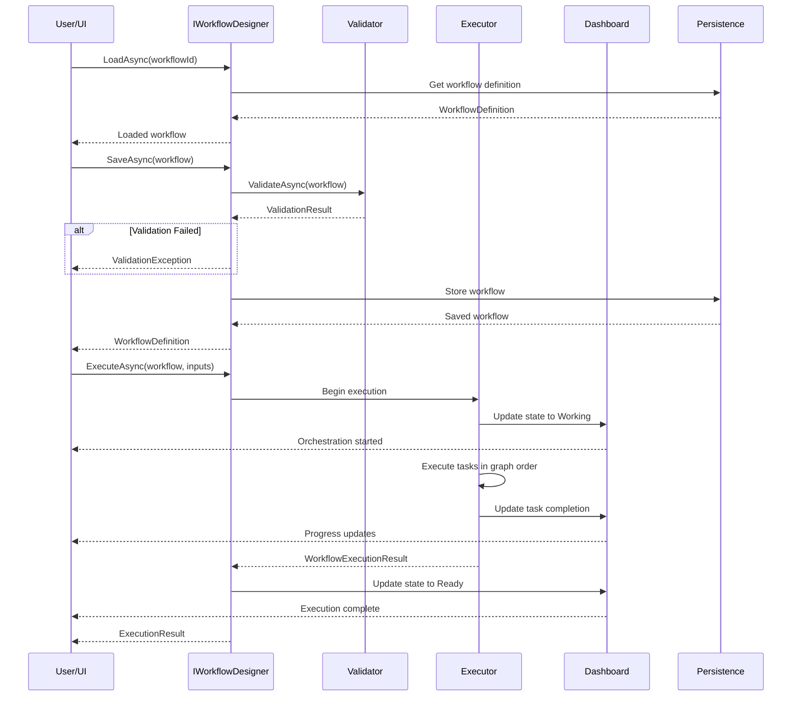
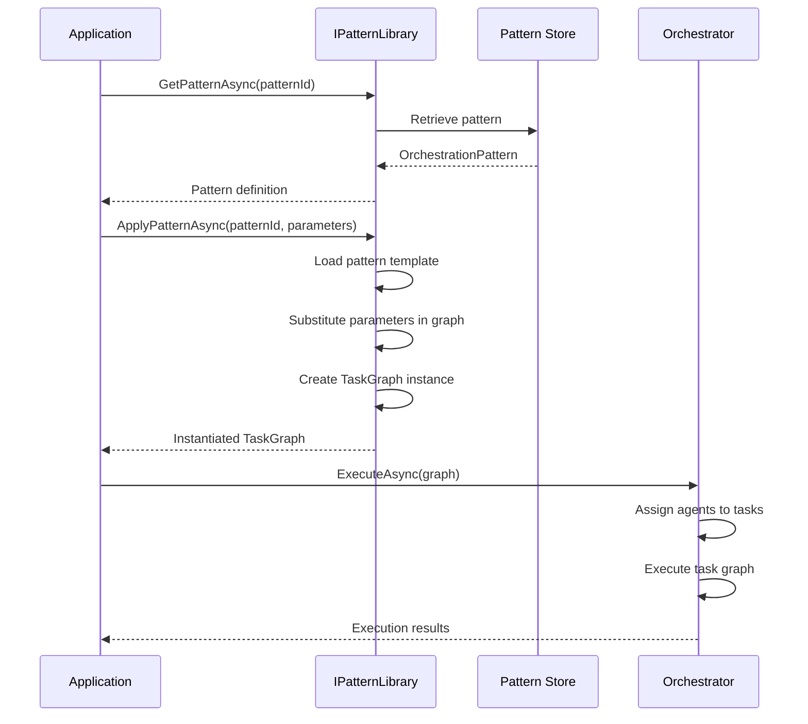

# LCS-SBD-v0.13.5-ORC: Scope Overview — Orchestration Patterns & Templates

## Document Control

| Field            | Value                                                        |
| :--------------- | :----------------------------------------------------------- |
| **Document ID**  | LCS-SBD-v0.13.5-ORC                                          |
| **Version**      | v0.13.5                                                      |
| **Codename**     | Orchestration Patterns & Templates (Orchestration Phase 3)   |
| **Status**       | Draft                                                        |
| **Last Updated** | 2026-01-31                                                   |
| **Owner**        | Orchestration Architecture Lead                              |
| **Depends On**   | v0.13.1-v0.13.4-ORC (orchestration), v0.12.1-AGT (agents)   |

---

## 1. Executive Summary

### 1.1 The Vision

**v0.13.5-ORC** delivers **Orchestration Patterns & Templates** — a comprehensive system for defining, discovering, and reusing orchestration patterns and ensemble configurations. This establishes:

- A library of reusable orchestration patterns for common workflows
- Pre-built ensemble templates that accelerate multi-agent coordination
- A visual designer for creating and modifying orchestration workflows
- Persistence layer for saving and loading workflow definitions
- A conductor dashboard for monitoring and controlling orchestrations
- A marketplace for discovering and sharing patterns across the community

This completes the orchestration infrastructure by enabling pattern-driven development and community-powered knowledge sharing.

### 1.2 Business Value

- **Reusability:** Common patterns eliminate redundant workflow definition.
- **Acceleration:** Pre-built templates reduce time-to-orchestration.
- **Standardization:** Shared patterns ensure consistency across teams.
- **Visibility:** Dashboard provides real-time monitoring and control.
- **Community:** Marketplace enables knowledge sharing and collaboration.
- **Visual Development:** Designer makes orchestration accessible to non-code users.

### 1.3 Success Criteria

1. Pattern library contains 7 built-in patterns covering all major use cases.
2. 4 ensemble templates provide ready-to-use multi-agent configurations.
3. Pattern designer supports drag-and-drop workflow creation.
4. Workflow persistence handles save/load with <100ms latency.
5. Dashboard updates orchestration state with <2s latency.
6. Marketplace enables pattern discovery and sharing with search <500ms.
7. All patterns are fully typed and validated before execution.

---

## 2. Key Deliverables

### 2.1 Sub-Parts

| Sub-Part | Title | Description | Est. Hours |
|:---------|:------|:------------|:-----------|
| v0.13.5a | Pattern Library | Manage reusable orchestration patterns | 10 |
| v0.13.5b | Ensemble Templates | Pre-built ensemble configurations | 10 |
| v0.13.5c | Pattern Designer | Visual workflow designer | 12 |
| v0.13.5d | Workflow Persistence | Save and load workflow definitions | 8 |
| v0.13.5e | Conductor Dashboard | Monitor and control orchestrations | 10 |
| v0.13.5f | Ensemble Marketplace | Share and discover patterns/ensembles | 6 |
| **Total** | | | **56 hours** |

### 2.2 Core Interfaces

```csharp
/// <summary>
/// Manages the library of reusable orchestration patterns.
/// Provides pattern discovery, application, and persistence.
/// </summary>
public interface IPatternLibrary
{
    /// <summary>
    /// Get all patterns, optionally filtered by category.
    /// </summary>
    Task<IReadOnlyList<OrchestrationPattern>> GetPatternsAsync(
        PatternCategory? category = null,
        CancellationToken ct = default);

    /// <summary>
    /// Get a specific pattern by ID.
    /// </summary>
    Task<OrchestrationPattern?> GetPatternAsync(
        string patternId,
        CancellationToken ct = default);

    /// <summary>
    /// Apply a pattern to create a task graph instance.
    /// Substitutes pattern parameters with actual values.
    /// </summary>
    Task<TaskGraph> ApplyPatternAsync(
        string patternId,
        Dictionary<string, object> parameters,
        CancellationToken ct = default);

    /// <summary>
    /// Save an orchestration as a reusable pattern.
    /// </summary>
    Task<OrchestrationPattern> SaveAsPatternAsync(
        string patternName,
        string description,
        PatternCategory category,
        TaskGraph graph,
        IReadOnlyList<string> parameterNames,
        CancellationToken ct = default);
}

/// <summary>
/// Represents a reusable orchestration pattern template.
/// </summary>
public record OrchestrationPattern
{
    /// <summary>
    /// Unique identifier for this pattern.
    /// </summary>
    public required string Id { get; init; }

    /// <summary>
    /// Human-readable name.
    /// </summary>
    public required string Name { get; init; }

    /// <summary>
    /// Detailed description of what this pattern does.
    /// </summary>
    public string? Description { get; init; }

    /// <summary>
    /// Category this pattern belongs to.
    /// </summary>
    public PatternCategory Category { get; init; }

    /// <summary>
    /// Template for the task graph with placeholders.
    /// </summary>
    public required TaskGraphTemplate GraphTemplate { get; init; }

    /// <summary>
    /// Parameters that can be customized when applying this pattern.
    /// </summary>
    public IReadOnlyList<PatternParameter> Parameters { get; init; } = [];

    /// <summary>
    /// Agent types required by this pattern.
    /// </summary>
    public IReadOnlyList<string> RequiredAgentTypes { get; init; } = [];

    /// <summary>
    /// Performance metrics and SLOs for this pattern.
    /// </summary>
    public PatternMetrics? Metrics { get; init; }

    /// <summary>
    /// Tags for searching and categorizing.
    /// </summary>
    public IReadOnlyDictionary<string, string> Tags { get; init; } =
        new Dictionary<string, string>();

    /// <summary>
    /// Version of this pattern.
    /// </summary>
    public string Version { get; init; } = "1.0.0";

    /// <summary>
    /// When this pattern was created.
    /// </summary>
    public DateTimeOffset CreatedAt { get; init; }
}

/// <summary>
/// Categories for orchestration patterns.
/// </summary>
public enum PatternCategory
{
    /// <summary>Generate and format documentation.</summary>
    Documentation,

    /// <summary>Research and gather information.</summary>
    Research,

    /// <summary>Analyze content and data.</summary>
    Analysis,

    /// <summary>Transform content between formats.</summary>
    Transformation,

    /// <summary>Review and validate work.</summary>
    Review,

    /// <summary>Publish and distribute content.</summary>
    Publishing,

    /// <summary>Custom user-defined pattern.</summary>
    Custom
}

/// <summary>
/// A customizable parameter in a pattern.
/// </summary>
public record PatternParameter
{
    /// <summary>
    /// Parameter name used in templates as {paramName}.
    /// </summary>
    public required string Name { get; init; }

    /// <summary>
    /// Description of what this parameter is.
    /// </summary>
    public string? Description { get; init; }

    /// <summary>
    /// Data type of this parameter.
    /// </summary>
    public string Type { get; init; } = "string";

    /// <summary>
    /// Default value if not provided.
    /// </summary>
    public object? DefaultValue { get; init; }

    /// <summary>
    /// Whether this parameter is required.
    /// </summary>
    public bool IsRequired { get; init; }
}

/// <summary>
/// Performance metrics for a pattern.
/// </summary>
public record PatternMetrics
{
    /// <summary>
    /// Typical execution time for this pattern.
    /// </summary>
    public TimeSpan TypicalDuration { get; init; }

    /// <summary>
    /// Estimated token cost.
    /// </summary>
    public int EstimatedTokens { get; init; }

    /// <summary>
    /// Number of times this pattern has been executed.
    /// </summary>
    public long ExecutionCount { get; init; }

    /// <summary>
    /// Success rate as a percentage (0-100).
    /// </summary>
    public float SuccessRate { get; init; }
}

/// <summary>
/// Template for a task graph with parameterized nodes and edges.
/// </summary>
public record TaskGraphTemplate
{
    /// <summary>
    /// Nodes in the template, with objective templates.
    /// </summary>
    public required IReadOnlyList<TaskNodeTemplate> Nodes { get; init; }

    /// <summary>
    /// Edges connecting nodes.
    /// </summary>
    public IReadOnlyList<Edge> Edges { get; init; } = [];
}

/// <summary>
/// A task node in a pattern template.
/// Objectives support {parameterName} placeholders.
/// </summary>
public record TaskNodeTemplate
{
    /// <summary>
    /// Template ID used in this orchestration.
    /// </summary>
    public required string TemplateId { get; init; }

    /// <summary>
    /// Display name for this node.
    /// </summary>
    public required string Name { get; init; }

    /// <summary>
    /// Type of task this node represents.
    /// </summary>
    public string Type { get; init; } = "Task";

    /// <summary>
    /// Objective template with {parameterName} placeholders.
    /// Will be substituted when pattern is applied.
    /// </summary>
    public required string ObjectiveTemplate { get; init; }

    /// <summary>
    /// Capabilities required from agents assigned to this node.
    /// </summary>
    public IReadOnlyList<string> RequiredCapabilities { get; init; } = [];

    /// <summary>
    /// Preferred agent type for this node.
    /// If empty, any agent with required capabilities works.
    /// </summary>
    public string? PreferredAgentType { get; init; }
}

/// <summary>
/// Manages pre-built ensemble templates.
/// </summary>
public interface IEnsembleTemplates
{
    /// <summary>
    /// Get all available ensemble templates.
    /// </summary>
    Task<IReadOnlyList<EnsembleTemplate>> GetTemplatesAsync(
        CancellationToken ct = default);

    /// <summary>
    /// Create an ensemble instance from a template.
    /// </summary>
    Task<Ensemble> CreateEnsembleAsync(
        string templateId,
        string ensembleName,
        CancellationToken ct = default);
}

/// <summary>
/// A template for creating ensemble instances.
/// </summary>
public record EnsembleTemplate
{
    /// <summary>
    /// Unique identifier for this template.
    /// </summary>
    public required string Id { get; init; }

    /// <summary>
    /// Display name.
    /// </summary>
    public required string Name { get; init; }

    /// <summary>
    /// Description of this ensemble.
    /// </summary>
    public string? Description { get; init; }

    /// <summary>
    /// Roles that must be filled in this ensemble.
    /// </summary>
    public required IReadOnlyList<AgentRole> Roles { get; init; }

    /// <summary>
    /// Default orchestration pattern for this ensemble.
    /// </summary>
    public string? DefaultPattern { get; init; }

    /// <summary>
    /// Capabilities this ensemble provides.
    /// </summary>
    public IReadOnlyList<string> Capabilities { get; init; } = [];
}

/// <summary>
/// A role within an ensemble.
/// </summary>
public record AgentRole
{
    /// <summary>
    /// Unique identifier for this role.
    /// </summary>
    public required string RoleId { get; init; }

    /// <summary>
    /// Display name for this role.
    /// </summary>
    public required string Name { get; init; }

    /// <summary>
    /// Description of responsibilities.
    /// </summary>
    public string? Description { get; init; }

    /// <summary>
    /// Agent type that should fill this role.
    /// </summary>
    public required string AgentType { get; init; }

    /// <summary>
    /// Minimum instances of this role.
    /// </summary>
    public int MinInstances { get; init; } = 1;

    /// <summary>
    /// Maximum instances of this role.
    /// </summary>
    public int MaxInstances { get; init; } = 1;

    /// <summary>
    /// Responsibilities this role has.
    /// </summary>
    public IReadOnlyList<string> Responsibilities { get; init; } = [];
}

/// <summary>
/// An instantiated ensemble with active agents.
/// </summary>
public record Ensemble
{
    /// <summary>
    /// Unique identifier for this ensemble instance.
    /// </summary>
    public required string EnsembleId { get; init; }

    /// <summary>
    /// Display name.
    /// </summary>
    public required string Name { get; init; }

    /// <summary>
    /// Template this ensemble is based on.
    /// </summary>
    public required string TemplateId { get; init; }

    /// <summary>
    /// Members in this ensemble.
    /// </summary>
    public required IReadOnlyList<EnsembleMember> Members { get; init; }

    /// <summary>
    /// Current state of the ensemble.
    /// </summary>
    public EnsembleState State { get; init; } = EnsembleState.Inactive;

    /// <summary>
    /// Currently active orchestration pattern.
    /// </summary>
    public string? ActivePattern { get; init; }
}

/// <summary>
/// A member of an ensemble.
/// </summary>
public record EnsembleMember
{
    /// <summary>
    /// Role this member fills.
    /// </summary>
    public required string RoleId { get; init; }

    /// <summary>
    /// Agent ID of this member.
    /// </summary>
    public required string AgentId { get; init; }

    /// <summary>
    /// Current state of this member.
    /// </summary>
    public AgentState State { get; init; }
}

/// <summary>
/// States of an ensemble.
/// </summary>
public enum EnsembleState
{
    /// <summary>Not yet activated.</summary>
    Inactive,

    /// <summary>Being brought online.</summary>
    Activating,

    /// <summary>Ready to work.</summary>
    Ready,

    /// <summary>Currently executing work.</summary>
    Working,

    /// <summary>Temporarily suspended.</summary>
    Paused
}

/// <summary>
/// Designer interface for creating and modifying workflows.
/// </summary>
public interface IWorkflowDesigner
{
    /// <summary>
    /// Load a workflow definition for editing.
    /// </summary>
    Task<WorkflowDefinition> LoadAsync(
        string workflowId,
        CancellationToken ct = default);

    /// <summary>
    /// Save a workflow definition.
    /// </summary>
    Task<WorkflowDefinition> SaveAsync(
        WorkflowDefinition workflow,
        CancellationToken ct = default);

    /// <summary>
    /// Validate a workflow definition.
    /// </summary>
    Task<ValidationResult> ValidateAsync(
        WorkflowDefinition workflow,
        CancellationToken ct = default);

    /// <summary>
    /// Execute a workflow.
    /// </summary>
    Task<WorkflowExecutionResult> ExecuteAsync(
        WorkflowDefinition workflow,
        Dictionary<string, object>? inputs = null,
        CancellationToken ct = default);
}

/// <summary>
/// Definition of a workflow that can be saved and executed.
/// </summary>
public record WorkflowDefinition
{
    /// <summary>
    /// Unique identifier for this workflow.
    /// </summary>
    public required string Id { get; init; }

    /// <summary>
    /// Display name.
    /// </summary>
    public required string Name { get; init; }

    /// <summary>
    /// Description of what this workflow does.
    /// </summary>
    public string? Description { get; init; }

    /// <summary>
    /// The task graph defining execution flow.
    /// </summary>
    public required TaskGraph Graph { get; init; }

    /// <summary>
    /// Input parameters this workflow accepts.
    /// </summary>
    public IReadOnlyList<WorkflowParameter> Parameters { get; init; } = [];

    /// <summary>
    /// Triggers that can start this workflow.
    /// </summary>
    public IReadOnlyList<WorkflowTrigger> Triggers { get; init; } = [];

    /// <summary>
    /// When this workflow was created.
    /// </summary>
    public DateTimeOffset CreatedAt { get; init; }

    /// <summary>
    /// When this workflow was last modified.
    /// </summary>
    public DateTimeOffset ModifiedAt { get; init; }
}

/// <summary>
/// A parameter that a workflow accepts.
/// </summary>
public record WorkflowParameter
{
    /// <summary>
    /// Parameter name.
    /// </summary>
    public required string Name { get; init; }

    /// <summary>
    /// Parameter description.
    /// </summary>
    public string? Description { get; init; }

    /// <summary>
    /// Data type.
    /// </summary>
    public string Type { get; init; } = "string";

    /// <summary>
    /// Default value.
    /// </summary>
    public object? DefaultValue { get; init; }

    /// <summary>
    /// Whether required.
    /// </summary>
    public bool IsRequired { get; init; }
}

/// <summary>
/// Something that can trigger workflow execution.
/// </summary>
public record WorkflowTrigger
{
    /// <summary>
    /// Type of trigger.
    /// </summary>
    public required TriggerType Type { get; init; }

    /// <summary>
    /// Cron schedule for Scheduled triggers.
    /// Example: "0 9 * * MON" (9 AM on Mondays).
    /// </summary>
    public string? Schedule { get; init; }

    /// <summary>
    /// Event type for Event triggers.
    /// </summary>
    public string? EventType { get; init; }

    /// <summary>
    /// Conditions that must be met to fire this trigger.
    /// </summary>
    public IReadOnlyDictionary<string, object>? Conditions { get; init; }
}

/// <summary>
/// Types of triggers for workflows.
/// </summary>
public enum TriggerType
{
    /// <summary>Manual invocation only.</summary>
    Manual,

    /// <summary>Scheduled via cron expression.</summary>
    Scheduled,

    /// <summary>Triggered by an event.</summary>
    Event,

    /// <summary>Triggered via webhook.</summary>
    Webhook
}

/// <summary>
/// Result of a workflow execution.
/// </summary>
public record WorkflowExecutionResult
{
    /// <summary>
    /// Whether execution succeeded.
    /// </summary>
    public bool Success { get; init; }

    /// <summary>
    /// Output produced by the workflow.
    /// </summary>
    public Dictionary<string, object>? Output { get; init; }

    /// <summary>
    /// Error message if execution failed.
    /// </summary>
    public string? ErrorMessage { get; init; }

    /// <summary>
    /// Duration of execution.
    /// </summary>
    public TimeSpan Duration { get; init; }

    /// <summary>
    /// Token cost of execution.
    /// </summary>
    public int TokensCost { get; init; }
}

/// <summary>
/// Validation error for workflows.
/// </summary>
public record ValidationError
{
    /// <summary>
    /// Error code.
    /// </summary>
    public required string Code { get; init; }

    /// <summary>
    /// Human-readable message.
    /// </summary>
    public required string Message { get; init; }

    /// <summary>
    /// Location in workflow definition.
    /// </summary>
    public string? Path { get; init; }
}

/// <summary>
/// Overall validation result.
/// </summary>
public record ValidationResult
{
    /// <summary>
    /// Whether validation passed.
    /// </summary>
    public bool IsValid { get; init; }

    /// <summary>
    /// Errors that prevented validation.
    /// </summary>
    public IReadOnlyList<ValidationError> Errors { get; init; } = [];

    /// <summary>
    /// Warnings that don't prevent execution.
    /// </summary>
    public IReadOnlyList<ValidationError> Warnings { get; init; } = [];
}
```

---

## 3. Built-in Patterns

### 3.1 Pattern Library

| Pattern ID | Name | Category | Agent Types | Complexity |
|:-----------|:-----|:---------|:-----------|:-----------|
| `api-docs-generator` | API Documentation Generator | Documentation | Scribe, Validator | Medium |
| `release-notes` | Release Notes Composer | Documentation | Chronicler, Scribe, Reviewer | High |
| `doc-updater` | Documentation Updater | Transformation | Researcher, Writer, Validator | Medium |
| `terminology-audit` | Terminology Consistency Audit | Analysis | Analyzer, Reviewer | Medium |
| `translation-pipeline` | Multi-Language Translation | Transformation | Translator, Reviewer | High |
| `research-and-write` | Research & Content Writing | Research | Researcher, Writer | High |
| `review-and-publish` | Review & Publish Pipeline | Publishing | Reviewer, Editor, Publisher | Medium |

### 3.2 Pattern Descriptions

#### API Documentation Generator
Automatically generates API documentation from code comments and schemas. Input: API endpoint signatures; Output: Formatted API docs in Markdown/HTML.

#### Release Notes Composer
Synthesizes release notes from Git commits, tickets, and PRs. Input: Git history, ticket tracking; Output: Polished release notes.

#### Documentation Updater
Updates existing documentation to reflect code changes. Input: Documentation, Code changes; Output: Updated documentation.

#### Terminology Consistency Audit
Checks documentation for consistent terminology usage. Input: Documentation set; Output: Inconsistency report with suggestions.

#### Translation Pipeline
Translates documentation to multiple languages with review. Input: English documentation; Output: Reviewed translations in target languages.

#### Research & Content Writing
Researches topic and produces comprehensive written content. Input: Research topic/outline; Output: Full article/documentation.

#### Review & Publish Pipeline
Reviews content and publishes to multiple targets. Input: Draft content; Output: Published on web, email, RSS.

---

## 4. Built-in Ensembles

### 4.1 Ensemble Templates

| Template ID | Name | Roles | Default Pattern |
|:-----------|:-----|:------|:-----------------|
| `technical-writing-team` | Technical Writing Team | Researcher, Writer, Editor, Validator | `research-and-write` |
| `api-documentation` | API Documentation | Scribe, Validator | `api-docs-generator` |
| `release-management` | Release Management | Chronicler, Formatter, Publisher | `release-notes` |
| `content-review` | Content Review | Analyzer, Reviewer, Editor | `review-and-publish` |

### 4.2 Ensemble Descriptions

#### Technical Writing Team
A 4-member ensemble for comprehensive technical writing. Researcher gathers information, Writer produces draft, Editor refines, Validator ensures quality.

#### API Documentation
Specialist ensemble for API documentation. Scribe generates docs from schemas, Validator ensures accuracy and completeness.

#### Release Management
Specializes in coordinating release activities. Chronicler extracts changelog, Formatter prepares release notes, Publisher distributes.

#### Content Review
Focused on reviewing and publishing content. Analyzer evaluates content, Reviewer provides feedback, Editor makes improvements.

---

## 5. Architecture

### 5.1 Component Overview

```
┌─────────────────────────────────────────────────────────────────────────────┐
│                     Orchestration Patterns & Templates Layer                 │
├─────────────────────────────────────────────────────────────────────────────┤
│                                                                              │
│  ┌─────────────────────────────────────────────────────────────────────┐   │
│  │                        IPatternLibrary                               │   │
│  │  ┌──────────────┐  ┌──────────────┐  ┌──────────────┐              │   │
│  │  │   Get        │  │    Apply     │  │   Save As    │              │   │
│  │  │   Patterns   │  │   Pattern    │  │   Pattern    │              │   │
│  │  └──────┬───────┘  └──────┬───────┘  └──────┬───────┘              │   │
│  │         │                 │                 │                       │   │
│  │         ▼                 ▼                 ▼                       │   │
│  │  ┌─────────────────────────────────────────────────────────────┐   │   │
│  │  │                  Pattern Store                               │   │   │
│  │  │  ┌───────────┐  ┌───────────┐  ┌───────────┐                │   │   │
│  │  │  │api-docs-  │  │release-   │  │research-  │  ...           │   │   │
│  │  │  │ generator │  │ notes     │  │and-write  │                │   │   │
│  │  │  └───────────┘  └───────────┘  └───────────┘                │   │   │
│  │  └─────────────────────────────────────────────────────────────┘   │   │
│  └─────────────────────────────────────────────────────────────────────┘   │
│                                     │                                       │
│                    ┌────────────────┼────────────────┐                      │
│                    ▼                ▼                ▼                      │
│  ┌──────────────────────┐ ┌──────────────────────┐ ┌──────────────────────┐│
│  │ IEnsembleTemplates   │ │ IWorkflowDesigner    │ │ Conductor Dashboard  ││
│  │ ┌────────────────┐   │ │ ┌────────────────┐   │ │ ┌────────────────┐   ││
│  │ │Create Ensemble │   │ │ │  Save/Load     │   │ │ │  Monitor       │   ││
│  │ │from Template   │   │ │ │  Workflows     │   │ │ │  Orchestrations│   ││
│  │ └────────────────┘   │ │ │ │  Execute      │   │ │ │ │ │ Control States ││
│  │                      │ │ │  Validate      │   │ │ │ │ │                ││
│  │                      │ │ └────────────────┘   │ │ └────────────────┘   ││
│  └──────────────────────┘ └──────────────────────┘ └──────────────────────┘│
│                                     │                                       │
│                                     ▼                                       │
│  ┌─────────────────────────────────────────────────────────────────────┐   │
│  │                     Ensemble Marketplace                             │   │
│  │  ┌──────────────────────────────────────────────────────────────┐  │   │
│  │  │ Search patterns by category, tags, or name                   │  │   │
│  │  │ Share and discover community patterns                        │  │   │
│  │  │ Version control and update notifications                    │  │   │
│  │  └──────────────────────────────────────────────────────────────┘  │   │
│  └─────────────────────────────────────────────────────────────────────┘   │
│                                                                              │
└─────────────────────────────────────────────────────────────────────────────┘
```

### 5.2 Workflow Execution Flow



### 5.3 Pattern Application Flow



---

## 6. Workflow & Pattern Persistence

### 6.1 Storage Format (JSON)

```json
{
  "id": "wf-api-docs-2024",
  "name": "API Documentation Generator",
  "description": "Generates API documentation from schemas",
  "graph": {
    "nodes": [
      {
        "id": "extract-schema",
        "name": "Extract API Schema",
        "type": "Task",
        "objective": "Extract API schema from {apiPath}",
        "requiredCapabilities": ["code-analysis"],
        "preferredAgentType": "analyzer"
      },
      {
        "id": "generate-docs",
        "name": "Generate Documentation",
        "type": "Task",
        "objective": "Generate comprehensive API documentation from extracted schema",
        "requiredCapabilities": ["text-generation", "formatting"],
        "preferredAgentType": "scribe"
      },
      {
        "id": "validate-docs",
        "name": "Validate Documentation",
        "type": "Task",
        "objective": "Validate API documentation for completeness and accuracy",
        "requiredCapabilities": ["validation"],
        "preferredAgentType": "validator"
      }
    ],
    "edges": [
      { "from": "extract-schema", "to": "generate-docs" },
      { "from": "generate-docs", "to": "validate-docs" }
    ]
  },
  "parameters": [
    {
      "name": "apiPath",
      "description": "Path to API source code",
      "type": "string",
      "isRequired": true
    },
    {
      "name": "outputFormat",
      "description": "Output format for documentation",
      "type": "string",
      "defaultValue": "markdown",
      "isRequired": false
    }
  ],
  "triggers": [
    {
      "type": "Manual"
    },
    {
      "type": "Scheduled",
      "schedule": "0 9 * * MON"
    }
  ],
  "createdAt": "2026-01-31T10:00:00Z",
  "modifiedAt": "2026-01-31T10:00:00Z"
}
```

### 6.2 Pattern Store Schema

```sql
-- Patterns table
CREATE TABLE orchestration_patterns (
    id VARCHAR(100) PRIMARY KEY,
    name VARCHAR(200) NOT NULL,
    description TEXT,
    category VARCHAR(50) NOT NULL,
    version VARCHAR(50) DEFAULT '1.0.0',
    graph_template JSONB NOT NULL,
    parameters JSONB,
    required_agent_types JSONB,
    metrics JSONB,
    tags JSONB,
    created_at TIMESTAMPTZ NOT NULL DEFAULT NOW(),
    updated_at TIMESTAMPTZ NOT NULL DEFAULT NOW()
);

CREATE INDEX idx_patterns_category ON orchestration_patterns(category);
CREATE INDEX idx_patterns_name ON orchestration_patterns(name);

-- Workflows table
CREATE TABLE workflows (
    id VARCHAR(100) PRIMARY KEY,
    name VARCHAR(200) NOT NULL,
    description TEXT,
    graph JSONB NOT NULL,
    parameters JSONB,
    triggers JSONB,
    created_at TIMESTAMPTZ NOT NULL DEFAULT NOW(),
    modified_at TIMESTAMPTZ NOT NULL DEFAULT NOW()
);

CREATE INDEX idx_workflows_name ON workflows(name);
CREATE INDEX idx_workflows_created ON workflows(created_at);

-- Ensemble templates table
CREATE TABLE ensemble_templates (
    id VARCHAR(100) PRIMARY KEY,
    name VARCHAR(200) NOT NULL,
    description TEXT,
    roles JSONB NOT NULL,
    default_pattern VARCHAR(100),
    capabilities JSONB,
    created_at TIMESTAMPTZ NOT NULL DEFAULT NOW()
);

CREATE INDEX idx_ensemble_templates_name ON ensemble_templates(name);
```

---

## 7. Conductor Dashboard

### 7.1 Dashboard Features

**Real-time Monitoring:**
- Active orchestration instances with live status
- Task-level progress and state
- Agent assignments and availability
- Performance metrics and timing

**Orchestration Control:**
- Pause/resume running orchestrations
- Cancel tasks or entire orchestrations
- Trigger manual workflows
- Modify ensemble configurations

**Analytics & Insights:**
- Pattern execution statistics
- Success/failure rates by pattern
- Performance trends over time
- Token cost analysis

### 7.2 Dashboard UI Mockup

```
┌────────────────────────────────────────────────────────────────────────────┐
│ Conductor Dashboard                        [⚙ Settings] [👤 User Menu]     │
├────────────────────────────────────────────────────────────────────────────┤
│                                                                              │
│ Active Orchestrations (3)              Ensembles (2)                         │
│ ═════════════════════════════════════════════════════════════════           │
│                                                                              │
│ ┌──────────────────────────────────────────────────────────────────────┐   │
│ │ 📊 api-docs-generator (in progress)                    [⏸ Pause]     │   │
│ │ Status: extract-schema [✓] → generate-docs [▶] → validate-docs      │   │
│ │ Progress: 67%   Elapsed: 2m 15s   Est. remaining: 1m 05s            │   │
│ │ Agents: Analyzer (extract-schema), Scribe (generate-docs)            │   │
│ │ Token Cost: 12,450 / 25,000 budget                                   │   │
│ └──────────────────────────────────────────────────────────────────────┘   │
│                                                                              │
│ ┌──────────────────────────────────────────────────────────────────────┐   │
│ │ 📝 release-notes (in progress)                          [⏸ Pause]     │   │
│ │ Status: extract-commits [✓] → compose-notes [▶] → review [⏳]        │   │
│ │ Progress: 45%   Elapsed: 3m 42s   Est. remaining: 4m 30s            │   │
│ │ Agents: Chronicler (extract), Scribe (compose), Reviewer (review)    │   │
│ │ Token Cost: 18,900 / 40,000 budget                                   │   │
│ └──────────────────────────────────────────────────────────────────────┘   │
│                                                                              │
│ ┌──────────────────────────────────────────────────────────────────────┐   │
│ │ 🧪 test-pipeline (idle)                                 [▶ Resume]   │   │
│ │ Status: All tasks completed successfully                            │   │
│ │ Progress: 100%   Total duration: 8m 23s                              │   │
│ │ Agents: 4 agents, all idle                                           │   │
│ │ Token Cost: 28,500 / 50,000 budget                                   │   │
│ └──────────────────────────────────────────────────────────────────────┘   │
│                                                                              │
├────────────────────────────────────────────────────────────────────────────┤
│ Recent Patterns                                                              │
│ ═════════════════════════════════════════════════════════════════           │
│                                                                              │
│ [✓] research-and-write (2h ago) - Success - 34m 15s - 45,200 tokens       │
│ [✓] doc-updater (4h ago) - Success - 12m 08s - 15,850 tokens              │
│ [✗] translation-pipeline (5h ago) - Failed - 8m 42s - 12,300 tokens       │
│                                                                              │
└────────────────────────────────────────────────────────────────────────────┘
```

---

## 8. Ensemble Marketplace

### 8.1 Marketplace Features

**Discovery & Search:**
- Browse patterns by category
- Search by name, tags, capabilities
- Filter by complexity, required agent types
- Star/bookmark favorite patterns

**Community Sharing:**
- Publish custom patterns to marketplace
- Version control for patterns
- Community ratings and reviews
- Download statistics

**Integration:**
- One-click pattern install
- Automatic dependency resolution
- Update notifications
- Fork and customize patterns

### 8.2 Marketplace UI Mockup

```
┌────────────────────────────────────────────────────────────────────────────┐
│ Pattern Marketplace                    Search: [____________________] [🔍] │
├────────────────────────────────────────────────────────────────────────────┤
│                                                                              │
│ Categories: [Documentation ▼] [Research ▼] [Analysis ▼] [More ▼]           │
│ Tags: [automation] [writing] [review] [translation] [custom]                │
│                                                                              │
│ ═══════════════════════════════════════════════════════════════════════    │
│                                                                              │
│ ┌──────────────────────────────────────────────────────────────────────┐   │
│ │ 📚 API Documentation Generator                         ⭐⭐⭐⭐⭐        │   │
│ │ by Lexichord Team  |  v1.2.0  |  Category: Documentation            │   │
│ │                                                                       │   │
│ │ Automatically generates API documentation from code schemas.        │   │
│ │ Supports multiple output formats (Markdown, HTML, PDF).             │   │
│ │                                                                       │   │
│ │ Tags: #documentation #api #automation                                │   │
│ │ Requirements: Scribe, Validator agents                               │   │
│ │ Downloads: 1,245  |  Success Rate: 98%  |  Avg Duration: 3m 45s     │   │
│ │                                                            [📥 Install] │   │
│ └──────────────────────────────────────────────────────────────────────┘   │
│                                                                              │
│ ┌──────────────────────────────────────────────────────────────────────┐   │
│ │ 🔬 Research & Content Writer                            ⭐⭐⭐⭐         │   │
│ │ by Sarah Chen  |  v2.1.0  |  Category: Research                     │   │
│ │                                                                       │   │
│ │ Performs in-depth research and writes comprehensive content.        │   │
│ │ Custom pattern combining multiple agents for quality writing.       │   │
│ │                                                                       │   │
│ │ Tags: #research #writing #custom #high-quality                       │   │
│ │ Requirements: Researcher, Writer, Editor agents                      │   │
│ │ Downloads: 892  |  Success Rate: 96%  |  Avg Duration: 15m 30s      │   │
│ │                                                            [📥 Install] │   │
│ └──────────────────────────────────────────────────────────────────────┘   │
│                                                                              │
│ ┌──────────────────────────────────────────────────────────────────────┐   │
│ │ 🌍 Multi-Language Translation Pipeline                  ⭐⭐⭐⭐         │   │
│ │ by Translation Team  |  v1.5.0  |  Category: Transformation         │   │
│ │                                                                       │   │
│ │ Translates content to multiple languages with native review.        │   │
│ │ Supports 25+ language pairs with quality assurance.                 │   │
│ │                                                                       │   │
│ │ Tags: #translation #multilingual #automation #publishing             │   │
│ │ Requirements: Translator, Reviewer agents                            │   │
│ │ Downloads: 756  |  Success Rate: 94%  |  Avg Duration: 22m 15s      │   │
│ │                                                            [📥 Install] │   │
│ └──────────────────────────────────────────────────────────────────────┘   │
│                                                                              │
│ Showing 3 of 127 patterns                              [Load More]         │
└────────────────────────────────────────────────────────────────────────────┘
```

---

## 9. Dependencies

| Component | Source | Usage |
|:----------|:-------|:------|
| `IOrchestrator` | v0.13.1-ORC | Orchestration execution engine |
| `ITaskGraphExecutor` | v0.13.2-ORC | Task graph execution |
| `IEnsembleManager` | v0.13.3-ORC | Ensemble orchestration |
| `IAgentRegistry` | v0.12.1-AGT | Agent discovery for patterns |
| `IAgentContext` | v0.12.1-AGT | Agent configuration context |
| `IDiagram` | BlazorDiagram 3.x | Visual workflow design |
| `IGraphTemplate` | DotNetGraph 3.x | Graph template processing |
| `ICronExpression` | Cronos 0.8.x | Cron-based trigger scheduling |

---

## 10. License Gating

| Tier | Patterns | Ensembles | Designer | Marketplace |
|:-----|:---------|:----------|:---------|:------------|
| Core | 3 built-in | Read-only | No | Search only |
| WriterPro | +5 custom | Create from templates | Yes | Upload patterns |
| Teams | Unlimited | Full management | Yes | Full access |
| Enterprise | Unlimited | Full management | Yes | Private marketplace |

**License Details:**
- **Core:** 3 built-in patterns (api-docs-generator, release-notes, doc-updater)
- **WriterPro:** +5 custom patterns, full designer access
- **Teams:** Unlimited patterns, ensemble creation, marketplace participation
- **Enterprise:** All features + private marketplace, RBAC, audit logging

---

## 11. Performance Targets

| Metric | Target | Measurement |
|:-------|:-------|:------------|
| Pattern load | <50ms | P95 time to retrieve pattern |
| Pattern application | <100ms | P95 time to substitute parameters |
| Workflow save | <150ms | P95 time to persist workflow |
| Workflow load | <100ms | P95 time to retrieve workflow |
| Dashboard update | <2s | P95 latency for state updates |
| Marketplace search | <500ms | P95 time for search query |
| Workflow validation | <200ms | P95 time for full validation |

---

## 12. Testing Strategy

### 12.1 Unit Tests

- Pattern parameter substitution
- Workflow validation rules
- Trigger scheduling logic (cron parsing)
- Ensemble state transitions
- Dashboard state management

### 12.2 Integration Tests

- Full pattern application workflow
- Workflow save/load cycle
- Ensemble creation and activation
- Pattern marketplace upload/download
- Dashboard orchestration updates
- Concurrent workflow execution

### 12.3 Performance Tests

- 500 patterns in library
- Patterns with 10-50 node graphs
- 100 concurrent workflow executions
- Dashboard with 10+ active orchestrations
- Marketplace search across 1000+ patterns

### 12.4 UI Tests

- Pattern designer canvas interactions
- Workflow parameter binding
- Dashboard real-time updates
- Marketplace search and filter

---

## 13. Risks & Mitigations

| Risk | Impact | Mitigation |
|:-----|:-------|:-----------|
| Pattern parameter injection | Security | Strict validation of parameter names/values; no code execution |
| Circular dependencies in graphs | Execution failure | Graph cycle detection during validation |
| Marketplace malicious patterns | Security/stability | Code review, rating system, sandboxed execution |
| Performance with many patterns | User experience | Pagination, caching, indexed search |
| Workflow state corruption | Data loss | Transactional persistence, versioning |
| Designer usability | Adoption | User testing, drag-drop interaction polish |
| Trigger execution reliability | Missed workflows | Persistent queue for triggers, retry logic |

---

## 14. Roadmap Alignment

This release completes the Orchestration Phase (v0.13.1–v0.13.5):
- v0.13.1: Orchestration Core & Execution
- v0.13.2: Task Graphs & Agents
- v0.13.3: Ensemble Management
- v0.13.4: Parallel & Conditional Execution
- **v0.13.5: Orchestration Patterns & Templates** ← This release

Post-release, the platform moves into the **Knowledge Management Phase (v0.14.x)** with semantic search, knowledge graphs, and learning systems.

---

## 15. Success Metrics

- **Adoption:** 75% of teams using at least one built-in pattern within Q1
- **Reusability:** Average pattern applied 5+ times per month
- **Community:** 50+ custom patterns shared in marketplace within 6 months
- **Performance:** 99% of pattern application completes within SLA
- **User Satisfaction:** NPS >50 for pattern designer UI
- **Marketplace Usage:** 10k+ pattern downloads in first 3 months

---
