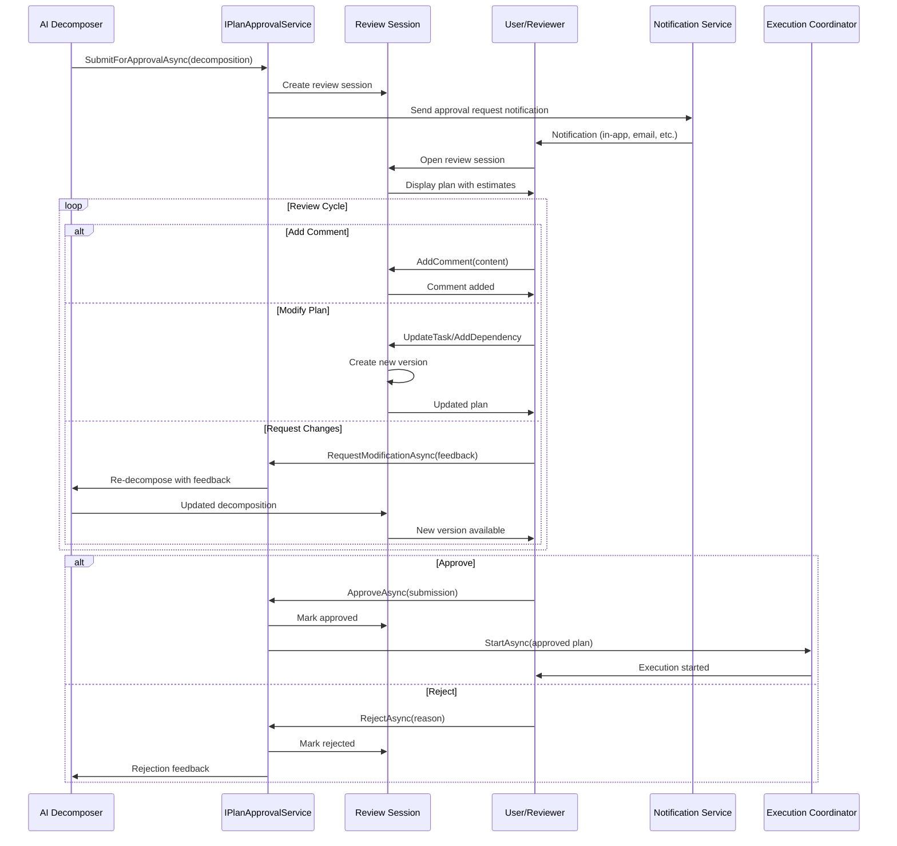

# LCS-SBD-v0.13.6-ORC: Scope Overview — Planning & Approval Workflows

## Document Control

| Field            | Value                                                        |
| :--------------- | :----------------------------------------------------------- |
| **Document ID**  | LCS-SBD-v0.13.6-ORC                                          |
| **Version**      | v0.13.6                                                      |
| **Codename**     | Planning & Approval Workflows (Human-in-the-Loop Phase 1)    |
| **Status**       | Draft                                                        |
| **Last Updated** | 2026-02-03                                                   |
| **Owner**        | Orchestration Architecture Lead                              |
| **Depends On**   | v0.13.1-ORC (decomposition), v0.13.2-ORC (dispatch), v0.12.1-AGT (agents) |

---

## 1. Executive Summary

### 1.1 Terminology: Plans vs. Task Planning

This specification distinguishes between two related but distinct concepts:

| Concept | Scope | Artifact | Approval Level |
|:--------|:------|:---------|:---------------|
| **Plan** (Execution Plan) | High-level orchestration artifact defining overall work: goals, strategies, agent assignments, dependencies, and coordinated multi-agent effort | `ExecutionPlan`, `DecompositionResult` | **This specification** — requires explicit user approval |
| **Task Planning** | Granular breakdown of individual work items into actionable steps — a bulleted/numbered list of discrete operations an agent executes sequentially | `ITaskPlanningService`, task step lists | Agent-level — executes within approved plan scope |

**Key Distinction:**
- A **Plan** answers: *"What work will be done, by which agents, in what order, with what dependencies?"*
- **Task Planning** answers: *"What specific steps will this agent take to complete its assigned work item?"*

The `IPlanApprovalService` in this specification reviews **Plans** (orchestration-level), not task-level step breakdowns. Once a Plan is approved, individual agents perform their own task planning within the scope of their assigned work.

### 1.2 The Vision

**v0.13.6-ORC** delivers **Plan Approval Workflows** — a comprehensive human-in-the-loop system that presents AI-generated execution plans to users for review, commenting, modification, and approval before execution proceeds. This establishes:

- Plan presentation with cost/resource estimates and risk factors
- Interactive plan editor for modifying work items, agent assignments, dependencies, and objectives
- Threaded commenting system for feedback on plans and individual work items
- Approval gates that block execution until explicit user consent
- Plan versioning to track modifications and enable rollback
- Notification system for approval requests across channels
- Visual dashboard for managing pending plan reviews

Users maintain full control over AI orchestration — no complex multi-agent execution plan proceeds without explicit user approval.

> **Note:** Task-level step planning (the bulleted breakdown of how an agent accomplishes its assigned work) occurs after plan approval and is handled by `ITaskPlanningService` within each agent's execution context.

### 1.3 Business Value

- **Control:** Users approve all AI-generated execution plans before orchestration begins, preventing unwanted actions.
- **Transparency:** Full visibility into planned work items, agent assignments, resource usage, and estimated costs.
- **Collaboration:** Comments and annotations enable team review of complex orchestration workflows.
- **Auditability:** Complete history of plan versions, comments, and approval decisions.
- **Risk Mitigation:** Users can modify plans to address concerns before execution.
- **Trust:** Building confidence in AI systems through human oversight at the orchestration level.

### 1.4 Success Criteria

1. All execution plans require explicit approval before orchestration begins.
2. Plan presentation displays estimates within ±20% of actual execution.
3. Comment system supports threaded replies with resolution tracking.
4. Plan versioning captures all modifications with complete diffs.
5. Approval decisions are captured with full audit trail.
6. P95 plan presentation latency is <500ms.
7. Users can modify any aspect of a plan (work items, agent assignments, dependencies) before approval.

---

## 2. Key Deliverables

### 2.1 Sub-Parts

| Sub-Part | Title | Description | Est. Hours |
|:---------|:------|:------------|:-----------|
| v0.13.6a | Plan Presentation Engine | Display execution plans with estimates and risk factors | 10 |
| v0.13.6b | Interactive Plan Editor | Modify work items, agent assignments, dependencies, objectives | 12 |
| v0.13.6c | Comment & Annotation System | Threaded comments on plans and work items | 10 |
| v0.13.6d | Approval Gate Manager | Block orchestration execution pending approval | 10 |
| v0.13.6e | Plan Versioning & History | Track all plan modifications | 8 |
| v0.13.6f | Approval Notification System | Multi-channel notifications | 6 |
| v0.13.6g | Plan Review Dashboard UI | Manage pending reviews | 6 |
| **Total** | | | **62 hours** |

> **Scope Clarification:** This approval workflow operates at the **Plan level** (orchestration). Individual agents perform their own task planning (step-by-step breakdowns) after the plan is approved, within the boundaries of their assigned work items.

### 2.2 Core Interfaces

```csharp
/// <summary>
/// Manages the approval workflow for execution plans (orchestration-level).
/// Presents AI-generated plans to users and collects feedback before orchestration begins.
///
/// NOTE: This service handles Plan approval, not task-level step planning.
/// - Plan: The high-level orchestration artifact (goals, work items, agent assignments, dependencies)
/// - Task Planning: Granular step breakdowns handled by ITaskPlanningService within each agent
///
/// Once a Plan is approved here, individual agents perform their own task planning
/// within the scope of their assigned work items.
/// </summary>
public interface IPlanApprovalService
{
    /// <summary>
    /// Submit an execution plan (decomposition result) for user approval.
    /// Creates a new review session and notifies approvers.
    /// </summary>
    Task<PlanReviewSession> SubmitForApprovalAsync(
        DecompositionResult decomposition,
        ApprovalRequestOptions options,
        CancellationToken ct = default);

    /// <summary>
    /// Get the current state of a plan review session.
    /// </summary>
    Task<PlanReviewSession> GetSessionAsync(
        PlanReviewSessionId sessionId,
        CancellationToken ct = default);

    /// <summary>
    /// Get all pending approval sessions for a user.
    /// </summary>
    Task<IReadOnlyList<PlanReviewSession>> GetPendingSessionsAsync(
        UserId userId,
        CancellationToken ct = default);

    /// <summary>
    /// Wait for approval decision (blocks until user acts or timeout).
    /// </summary>
    Task<ApprovalDecision> WaitForDecisionAsync(
        PlanReviewSessionId sessionId,
        TimeSpan? timeout = null,
        CancellationToken ct = default);

    /// <summary>
    /// Submit user approval for a plan.
    /// </summary>
    Task<ApprovalResult> ApproveAsync(
        PlanReviewSessionId sessionId,
        ApprovalSubmission submission,
        CancellationToken ct = default);

    /// <summary>
    /// Submit user rejection for a plan.
    /// </summary>
    Task<RejectionResult> RejectAsync(
        PlanReviewSessionId sessionId,
        RejectionSubmission submission,
        CancellationToken ct = default);

    /// <summary>
    /// Request plan modification based on user feedback.
    /// Returns new decomposition with modifications applied.
    /// </summary>
    Task<DecompositionResult> RequestModificationAsync(
        PlanReviewSessionId sessionId,
        PlanModificationRequest request,
        CancellationToken ct = default);

    /// <summary>
    /// Observable stream of approval events.
    /// </summary>
    IObservable<PlanApprovalEvent> ApprovalEvents { get; }
}

public readonly record struct PlanReviewSessionId(Guid Value)
{
    public static PlanReviewSessionId New() => new(Guid.NewGuid());
}

/// <summary>
/// Options for submitting a plan for approval.
/// </summary>
public record ApprovalRequestOptions
{
    /// <summary>
    /// Whether approval is required before execution.
    /// </summary>
    public bool RequireExplicitApproval { get; init; } = true;

    /// <summary>
    /// How long to wait for approval before timing out.
    /// </summary>
    public TimeSpan? ApprovalTimeout { get; init; }

    /// <summary>
    /// Action to take if approval times out.
    /// </summary>
    public TimeoutAction TimeoutAction { get; init; } = TimeoutAction.Cancel;

    /// <summary>
    /// Users who can approve this plan.
    /// </summary>
    public IReadOnlyList<UserId>? AuthorizedApprovers { get; init; }

    /// <summary>
    /// Whether to allow partial approval (approve some work items, reject others).
    /// </summary>
    public bool AllowPartialApproval { get; init; } = true;

    /// <summary>
    /// Whether to show cost/resource estimates to user.
    /// </summary>
    public bool ShowEstimates { get; init; } = true;

    /// <summary>
    /// Whether to allow user comments on individual work items in the plan.
    /// </summary>
    public bool AllowWorkItemComments { get; init; } = true;

    /// <summary>
    /// Notification channels for approval request.
    /// </summary>
    public IReadOnlyList<NotificationChannel>? NotifyOn { get; init; }

    /// <summary>
    /// Custom message to display to reviewers.
    /// </summary>
    public string? ReviewerMessage { get; init; }

    /// <summary>
    /// Priority level for this approval request.
    /// </summary>
    public ApprovalPriority Priority { get; init; } = ApprovalPriority.Normal;
}

public enum TimeoutAction
{
    Cancel,     // Cancel the plan entirely
    Proceed,    // Proceed with default approval
    Escalate,   // Escalate to another approver
    Remind      // Send reminder and extend timeout
}

public enum ApprovalPriority
{
    Low,
    Normal,
    High,
    Urgent
}

public enum NotificationChannel
{
    InApp,
    Email,
    Slack,
    Teams,
    Webhook
}

/// <summary>
/// Represents an active plan review session.
/// </summary>
public record PlanReviewSession
{
    public PlanReviewSessionId Id { get; init; }
    public DecompositionResult Plan { get; init; } = null!;
    public PlanReviewState State { get; init; }
    public DateTimeOffset CreatedAt { get; init; }
    public DateTimeOffset? ExpiresAt { get; init; }
    public UserId? AssignedReviewer { get; init; }
    public IReadOnlyList<UserId> AuthorizedApprovers { get; init; } = [];
    public IReadOnlyList<PlanComment> Comments { get; init; } = [];
    public IReadOnlyList<TaskApprovalStatus> TaskStatuses { get; init; } = [];
    public IReadOnlyList<PlanVersion> Versions { get; init; } = [];
    public ApprovalDecision? Decision { get; init; }
    public PlanEstimate Estimate { get; init; } = new();
    public ApprovalPriority Priority { get; init; }
    public string? ReviewerMessage { get; init; }
}

public enum PlanReviewState
{
    Pending,            // Waiting for review
    InReview,           // User is actively reviewing
    ModificationRequested, // User requested changes
    Approved,           // Plan approved
    PartiallyApproved,  // Some tasks approved
    Rejected,           // Plan rejected
    TimedOut,           // Approval window expired
    Cancelled           // Session cancelled
}

/// <summary>
/// Manages comments and annotations on plans.
/// </summary>
public interface IPlanCommentService
{
    /// <summary>
    /// Add a comment to a plan or task.
    /// </summary>
    Task<PlanComment> AddCommentAsync(
        PlanReviewSessionId sessionId,
        CommentContent content,
        CancellationToken ct = default);

    /// <summary>
    /// Reply to an existing comment.
    /// </summary>
    Task<PlanComment> ReplyAsync(
        Guid parentCommentId,
        CommentContent content,
        CancellationToken ct = default);

    /// <summary>
    /// Edit a comment.
    /// </summary>
    Task<PlanComment> EditCommentAsync(
        Guid commentId,
        string newContent,
        CancellationToken ct = default);

    /// <summary>
    /// Delete a comment.
    /// </summary>
    Task DeleteCommentAsync(
        Guid commentId,
        CancellationToken ct = default);

    /// <summary>
    /// Mark a comment as resolved.
    /// </summary>
    Task ResolveCommentAsync(
        Guid commentId,
        string? resolution = null,
        CancellationToken ct = default);

    /// <summary>
    /// Get all comments for a session.
    /// </summary>
    Task<IReadOnlyList<PlanComment>> GetCommentsAsync(
        PlanReviewSessionId sessionId,
        CancellationToken ct = default);
}

public record CommentContent
{
    public required string Text { get; init; }
    public CommentScope Scope { get; init; } = CommentScope.Plan;
    public TaskNodeId? TargetTaskId { get; init; }
    public CommentType Type { get; init; } = CommentType.General;
}

/// <summary>
/// A comment or annotation on a plan or task.
/// </summary>
public record PlanComment
{
    public Guid CommentId { get; init; } = Guid.NewGuid();
    public UserId Author { get; init; }
    public string AuthorName { get; init; } = "";
    public DateTimeOffset CreatedAt { get; init; }
    public DateTimeOffset? ModifiedAt { get; init; }
    public string Content { get; init; } = "";
    public CommentScope Scope { get; init; }
    public TaskNodeId? TargetTaskId { get; init; }
    public CommentType Type { get; init; }
    public IReadOnlyList<PlanComment> Replies { get; init; } = [];
    public Guid? ParentCommentId { get; init; }
    public bool IsResolved { get; init; }
    public string? Resolution { get; init; }
    public DateTimeOffset? ResolvedAt { get; init; }
    public UserId? ResolvedBy { get; init; }
}

public enum CommentScope
{
    Plan,       // Comment on the entire execution plan
    WorkItem,   // Comment on a specific work item (TaskNode) in the plan
    Edge,       // Comment on a dependency relationship between work items
    Estimate    // Comment on resource estimates
}

public enum CommentType
{
    General,        // General feedback
    Question,       // Asking for clarification
    Concern,        // Expressing concern
    Suggestion,     // Suggesting improvement
    Approval,       // Noting approval
    Rejection,      // Noting rejection reason
    Modification    // Requesting specific change
}

/// <summary>
/// Manages plan versioning and history.
/// </summary>
public interface IPlanVersioningService
{
    /// <summary>
    /// Create a new version when plan is modified.
    /// </summary>
    Task<PlanVersion> CreateVersionAsync(
        PlanReviewSessionId sessionId,
        DecompositionResult newPlan,
        string changeDescription,
        IReadOnlyList<PlanChange> changes,
        CancellationToken ct = default);

    /// <summary>
    /// Get all versions for a session.
    /// </summary>
    Task<IReadOnlyList<PlanVersion>> GetVersionsAsync(
        PlanReviewSessionId sessionId,
        CancellationToken ct = default);

    /// <summary>
    /// Get a specific version.
    /// </summary>
    Task<PlanVersion?> GetVersionAsync(
        PlanReviewSessionId sessionId,
        int versionNumber,
        CancellationToken ct = default);

    /// <summary>
    /// Compare two versions.
    /// </summary>
    Task<VersionComparison> CompareVersionsAsync(
        PlanReviewSessionId sessionId,
        int fromVersion,
        int toVersion,
        CancellationToken ct = default);

    /// <summary>
    /// Restore a previous version.
    /// </summary>
    Task<PlanVersion> RestoreVersionAsync(
        PlanReviewSessionId sessionId,
        int versionNumber,
        CancellationToken ct = default);
}

/// <summary>
/// A version of the plan (for tracking modifications).
/// </summary>
public record PlanVersion
{
    public int VersionNumber { get; init; }
    public DecompositionResult Plan { get; init; } = null!;
    public DateTimeOffset CreatedAt { get; init; }
    public string ChangeDescription { get; init; } = "";
    public UserId? ModifiedBy { get; init; }
    public string? ModifiedByName { get; init; }
    public IReadOnlyList<PlanChange> Changes { get; init; } = [];
    public PlanEstimate Estimate { get; init; } = new();
}

public record PlanChange
{
    public PlanChangeType Type { get; init; }
    public TaskNodeId? AffectedTaskId { get; init; }
    public string? AffectedTaskName { get; init; }
    public string Description { get; init; } = "";
    public object? OldValue { get; init; }
    public object? NewValue { get; init; }
}

/// <summary>
/// Types of changes that can be made to an execution plan.
/// Note: These refer to work items (TaskNodes) in the plan, not task-level step planning.
/// </summary>
public enum PlanChangeType
{
    WorkItemAdded,          // New work item added to plan
    WorkItemRemoved,        // Work item removed from plan
    WorkItemModified,       // Work item properties changed
    WorkItemObjectiveChanged,   // Work item objective updated
    WorkItemConstraintsChanged, // Work item constraints updated
    AgentAssignmentChanged, // Agent assignment for work item changed
    DependencyAdded,        // Dependency between work items added
    DependencyRemoved,      // Dependency between work items removed
    DependencyTypeChanged,  // Type of dependency changed
    StrategyChanged,        // Overall plan strategy changed
    EstimateUpdated,        // Resource estimates updated
    PriorityChanged         // Work item priority changed
}

public record VersionComparison
{
    public int FromVersion { get; init; }
    public int ToVersion { get; init; }
    public IReadOnlyList<PlanChange> Changes { get; init; } = [];
    public int WorkItemsAdded { get; init; }
    public int WorkItemsRemoved { get; init; }
    public int WorkItemsModified { get; init; }
    public int DependenciesAdded { get; init; }
    public int DependenciesRemoved { get; init; }
    public PlanEstimate FromEstimate { get; init; } = new();
    public PlanEstimate ToEstimate { get; init; } = new();
}

/// <summary>
/// Estimate information displayed to users during plan review.
/// These are orchestration-level estimates for the entire execution plan.
/// </summary>
public record PlanEstimate
{
    public int TotalWorkItems { get; init; }
    public int ResearchWorkItems { get; init; }
    public int GenerationWorkItems { get; init; }
    public int ValidationWorkItems { get; init; }
    public int ReviewWorkItems { get; init; }
    public int EstimatedTokens { get; init; }
    public TimeSpan EstimatedDuration { get; init; }
    public int RequiredAgents { get; init; }
    public IReadOnlyList<string> RequiredAgentTypes { get; init; } = [];
    public decimal? EstimatedCost { get; init; }
    public IReadOnlyList<string> ResourceRequirements { get; init; } = [];
    public IReadOnlyList<RiskFactor> RiskFactors { get; init; } = [];
    public float ConfidenceScore { get; init; }
}

public record RiskFactor
{
    public string Code { get; init; } = "";
    public string Description { get; init; } = "";
    public RiskSeverity Severity { get; init; }
    public string? Mitigation { get; init; }
}

public enum RiskSeverity
{
    Low,
    Medium,
    High,
    Critical
}

/// <summary>
/// Interactive plan editor for modifying work items and dependencies in an execution plan.
///
/// NOTE: This editor operates on the Plan level (orchestration), not task-level step planning.
/// - Work items here are TaskNodes in the execution plan (what work to do, who does it)
/// - Task planning (bulleted step breakdowns) happens later within each agent's execution
/// </summary>
public interface IInteractivePlanEditor
{
    /// <summary>
    /// Add a new work item to the execution plan.
    /// </summary>
    Task<TaskNode> AddWorkItemAsync(
        PlanReviewSessionId sessionId,
        TaskNodeCreation taskCreation,
        CancellationToken ct = default);

    /// <summary>
    /// Remove a work item from the execution plan.
    /// </summary>
    Task RemoveWorkItemAsync(
        PlanReviewSessionId sessionId,
        TaskNodeId workItemId,
        CancellationToken ct = default);

    /// <summary>
    /// Update a work item's properties.
    /// </summary>
    Task<TaskNode> UpdateWorkItemAsync(
        PlanReviewSessionId sessionId,
        TaskNodeId workItemId,
        TaskNodeUpdate update,
        CancellationToken ct = default);

    /// <summary>
    /// Add a dependency between work items.
    /// </summary>
    Task<TaskEdge> AddDependencyAsync(
        PlanReviewSessionId sessionId,
        TaskNodeId fromWorkItemId,
        TaskNodeId toWorkItemId,
        EdgeType edgeType = EdgeType.Dependency,
        CancellationToken ct = default);

    /// <summary>
    /// Remove a dependency between work items.
    /// </summary>
    Task RemoveDependencyAsync(
        PlanReviewSessionId sessionId,
        TaskNodeId fromWorkItemId,
        TaskNodeId toWorkItemId,
        CancellationToken ct = default);

    /// <summary>
    /// Split a work item into multiple work items.
    /// </summary>
    Task<IReadOnlyList<TaskNode>> SplitWorkItemAsync(
        PlanReviewSessionId sessionId,
        TaskNodeId workItemId,
        IReadOnlyList<TaskNodeCreation> newWorkItems,
        CancellationToken ct = default);

    /// <summary>
    /// Merge multiple work items into one.
    /// </summary>
    Task<TaskNode> MergeWorkItemsAsync(
        PlanReviewSessionId sessionId,
        IReadOnlyList<TaskNodeId> workItemIds,
        TaskNodeCreation mergedWorkItem,
        CancellationToken ct = default);

    /// <summary>
    /// Reorder work item priorities.
    /// </summary>
    Task ReorderWorkItemsAsync(
        PlanReviewSessionId sessionId,
        IReadOnlyList<TaskNodeId> workItemOrder,
        CancellationToken ct = default);

    /// <summary>
    /// Validate current plan state.
    /// </summary>
    Task<PlanValidationResult> ValidateAsync(
        PlanReviewSessionId sessionId,
        CancellationToken ct = default);
}

/// <summary>
/// Data for creating a new work item (TaskNode) in the execution plan.
/// This defines WHAT work to do and WHO does it — not HOW (step-by-step).
/// The assigned agent will perform its own task planning for the "how".
/// </summary>
public record WorkItemCreation
{
    public required string Name { get; init; }
    public required string Description { get; init; }
    public TaskType Type { get; init; } = TaskType.Generation;
    public TaskPriority Priority { get; init; } = TaskPriority.Normal;
    public required TaskObjective Objective { get; init; }
    public IReadOnlyList<TaskNodeId>? DependsOn { get; init; }
    public IReadOnlyList<string>? RequiredCapabilities { get; init; }
    public string? PreferredAgentType { get; init; }
}

/// <summary>
/// Data for updating an existing work item in the execution plan.
/// </summary>
public record WorkItemUpdate
{
    public string? Name { get; init; }
    public string? Description { get; init; }
    public TaskType? Type { get; init; }
    public TaskPriority? Priority { get; init; }
    public TaskObjective? Objective { get; init; }
    public TaskConstraints? Constraints { get; init; }
    public string? PreferredAgentType { get; init; }
}

public record PlanValidationResult
{
    public bool IsValid { get; init; }
    public IReadOnlyList<PlanValidationError> Errors { get; init; } = [];
    public IReadOnlyList<PlanValidationWarning> Warnings { get; init; } = [];
}

public record PlanValidationError
{
    public string Code { get; init; } = "";
    public string Message { get; init; } = "";
    public TaskNodeId? AffectedWorkItemId { get; init; }
}

public record PlanValidationWarning
{
    public string Code { get; init; } = "";
    public string Message { get; init; } = "";
    public TaskNodeId? AffectedWorkItemId { get; init; }
}
```

---

## 3. Architecture

### 3.1 Component Overview

```
┌─────────────────────────────────────────────────────────────────────────────┐
│                     Plan Approval Workflows Layer (Orchestration-Level)      │
├─────────────────────────────────────────────────────────────────────────────┤
│                                                                              │
│  ┌─────────────────────────────────────────────────────────────────────┐   │
│  │                      IPlanApprovalService                            │   │
│  │  ┌──────────────┐  ┌──────────────┐  ┌──────────────┐              │   │
│  │  │   Submit     │  │    Wait      │  │   Approve    │              │   │
│  │  │  For Review  │  │  For Decision│  │   / Reject   │              │   │
│  │  └──────┬───────┘  └──────┬───────┘  └──────┬───────┘              │   │
│  │         │                 │                 │                       │   │
│  │         ▼                 ▼                 ▼                       │   │
│  │  ┌─────────────────────────────────────────────────────────────┐   │   │
│  │  │               Plan Review Session Store                      │   │   │
│  │  └─────────────────────────────────────────────────────────────┘   │   │
│  └─────────────────────────────────────────────────────────────────────┘   │
│                                     │                                       │
│              ┌──────────────────────┼───────────────────┐                  │
│              ▼                      ▼                   ▼                  │
│  ┌──────────────────────┐ ┌──────────────────────┐ ┌──────────────────────┐│
│  │ IPlanCommentService  │ │ IPlanVersioningService│ │ IInteractivePlanEditor││
│  │ ┌────────────────┐   │ │ ┌────────────────┐   │ │ ┌────────────────┐   ││
│  │ │ Add/Reply      │   │ │ │ Create Version │   │ │ │ Add/Remove     │   ││
│  │ │ Comments       │   │ │ │ Compare/Restore│   │ │ │ Tasks          │   ││
│  │ └────────────────┘   │ │ └────────────────┘   │ │ └────────────────┘   ││
│  │ ┌────────────────┐   │ │                      │ │ ┌────────────────┐   ││
│  │ │ Resolve        │   │ │                      │ │ │ Modify         │   ││
│  │ │ Threads        │   │ │                      │ │ │ Dependencies   │   ││
│  │ └────────────────┘   │ │                      │ │ └────────────────┘   ││
│  └──────────────────────┘ └──────────────────────┘ └──────────────────────┘│
│                                     │                                       │
│                                     ▼                                       │
│  ┌─────────────────────────────────────────────────────────────────────┐   │
│  │                  Plan Estimate Calculator                            │   │
│  │  ┌───────────────────────────────────────────────────────────────┐  │   │
│  │  │ Token estimation, duration prediction, cost calculation       │  │   │
│  │  │ Risk factor analysis, agent requirement determination         │  │   │
│  │  └───────────────────────────────────────────────────────────────┘  │   │
│  └─────────────────────────────────────────────────────────────────────┘   │
│                                     │                                       │
│                                     ▼                                       │
│  ┌─────────────────────────────────────────────────────────────────────┐   │
│  │                  Approval Notification Service                       │   │
│  │  ┌──────────┐  ┌──────────┐  ┌──────────┐  ┌──────────┐           │   │
│  │  │  In-App  │  │  Email   │  │  Slack   │  │  Webhook │           │   │
│  │  └──────────┘  └──────────┘  └──────────┘  └──────────┘           │   │
│  └─────────────────────────────────────────────────────────────────────┘   │
│                                                                              │
└─────────────────────────────────────────────────────────────────────────────┘
```

### 3.2 Approval Flow



### 3.3 Plan Review State Machine

```
                    ┌─────────────┐
                    │   Pending   │◄───────────────────┐
                    └──────┬──────┘                    │
                           │ User opens review         │
                           ▼                           │ Resubmit
                    ┌─────────────┐                    │
            ┌───────│  In Review  │───────┐            │
            │       └──────┬──────┘       │            │
            │              │              │            │
     Request│              │              │Reject      │
   Modification            │Approve       │            │
            │              │              ▼            │
            ▼              │       ┌───────────┐       │
     ┌──────────────┐      │       │  Rejected │       │
     │ Modification │      │       └───────────┘       │
     │  Requested   │──────┴───────────────────────────┘
     └──────────────┘
            │
            │ AI Modifies
            ▼
     ┌─────────────┐
     │  Approved   │───────▶ Begin Execution
     └─────────────┘

     Note: PartiallyApproved state allows some work items
     to be approved while others are skipped.

     Timeout from Pending/InReview triggers
     TimeoutAction (Cancel, Proceed, Escalate, Remind)
```

---

## 4. Database Schema

> **Note:** This schema stores execution plan approval data (orchestration-level).
> Task-level step planning data is managed separately by `ITaskPlanningService`.

```sql
-- Plan review sessions (execution plan approval tracking)
-- Each session represents one plan submitted for user approval
CREATE TABLE plan_review_sessions (
    id UUID PRIMARY KEY DEFAULT gen_random_uuid(),
    decomposition_id UUID NOT NULL,
    state VARCHAR(30) NOT NULL DEFAULT 'pending',
    priority VARCHAR(20) NOT NULL DEFAULT 'normal',
    created_at TIMESTAMPTZ NOT NULL DEFAULT NOW(),
    expires_at TIMESTAMPTZ,
    assigned_reviewer UUID REFERENCES users(id),
    authorized_approvers UUID[] DEFAULT '{}',
    current_version INT NOT NULL DEFAULT 1,
    reviewer_message TEXT,
    metadata JSONB DEFAULT '{}'
);

CREATE INDEX idx_review_sessions_state ON plan_review_sessions(state);
CREATE INDEX idx_review_sessions_reviewer ON plan_review_sessions(assigned_reviewer);
CREATE INDEX idx_review_sessions_expires ON plan_review_sessions(expires_at);

-- Plan versions
CREATE TABLE plan_versions (
    id UUID PRIMARY KEY DEFAULT gen_random_uuid(),
    session_id UUID NOT NULL REFERENCES plan_review_sessions(id) ON DELETE CASCADE,
    version_number INT NOT NULL,
    plan_json JSONB NOT NULL,
    estimate_json JSONB NOT NULL,
    changes_json JSONB DEFAULT '[]',
    change_description TEXT,
    modified_by UUID REFERENCES users(id),
    created_at TIMESTAMPTZ NOT NULL DEFAULT NOW(),

    UNIQUE(session_id, version_number)
);

CREATE INDEX idx_plan_versions_session ON plan_versions(session_id);

-- Plan comments (comments on the execution plan or its work items)
CREATE TABLE plan_comments (
    id UUID PRIMARY KEY DEFAULT gen_random_uuid(),
    session_id UUID NOT NULL REFERENCES plan_review_sessions(id) ON DELETE CASCADE,
    parent_comment_id UUID REFERENCES plan_comments(id),
    author_id UUID NOT NULL REFERENCES users(id),
    content TEXT NOT NULL,
    scope VARCHAR(20) NOT NULL DEFAULT 'plan',  -- 'plan' or 'work_item'
    target_work_item_id UUID,                    -- TaskNodeId if scope = 'work_item'
    comment_type VARCHAR(30) NOT NULL DEFAULT 'general',
    is_resolved BOOLEAN DEFAULT FALSE,
    resolution TEXT,
    resolved_at TIMESTAMPTZ,
    resolved_by UUID REFERENCES users(id),
    created_at TIMESTAMPTZ NOT NULL DEFAULT NOW(),
    modified_at TIMESTAMPTZ
);

CREATE INDEX idx_comments_session ON plan_comments(session_id);
CREATE INDEX idx_comments_parent ON plan_comments(parent_comment_id);
CREATE INDEX idx_comments_work_item ON plan_comments(target_work_item_id);
CREATE INDEX idx_comments_resolved ON plan_comments(is_resolved);

-- Work item approval statuses (per-work-item approval in partial approval scenarios)
CREATE TABLE work_item_approval_statuses (
    id UUID PRIMARY KEY DEFAULT gen_random_uuid(),
    session_id UUID NOT NULL REFERENCES plan_review_sessions(id) ON DELETE CASCADE,
    work_item_id UUID NOT NULL,                  -- TaskNodeId from the execution plan
    state VARCHAR(20) NOT NULL DEFAULT 'pending',
    approved_by UUID REFERENCES users(id),
    decided_at TIMESTAMPTZ,
    notes TEXT,

    UNIQUE(session_id, work_item_id)
);

CREATE INDEX idx_work_item_statuses_session ON work_item_approval_statuses(session_id);

-- Approval decisions (overall plan approval decision)
CREATE TABLE approval_decisions (
    id UUID PRIMARY KEY DEFAULT gen_random_uuid(),
    session_id UUID NOT NULL REFERENCES plan_review_sessions(id),
    outcome VARCHAR(30) NOT NULL,
    decided_by UUID NOT NULL REFERENCES users(id),
    decided_at TIMESTAMPTZ NOT NULL DEFAULT NOW(),
    reason TEXT,
    approved_work_items UUID[] DEFAULT '{}',     -- TaskNodeIds that were approved
    rejected_work_items UUID[] DEFAULT '{}'      -- TaskNodeIds that were rejected,
    conditions JSONB DEFAULT '[]',
    metadata JSONB DEFAULT '{}'
);

CREATE INDEX idx_decisions_session ON approval_decisions(session_id);
CREATE INDEX idx_decisions_outcome ON approval_decisions(outcome);

-- Approval notifications
CREATE TABLE approval_notifications (
    id UUID PRIMARY KEY DEFAULT gen_random_uuid(),
    session_id UUID NOT NULL REFERENCES plan_review_sessions(id) ON DELETE CASCADE,
    user_id UUID NOT NULL REFERENCES users(id),
    channel VARCHAR(20) NOT NULL,
    status VARCHAR(20) NOT NULL DEFAULT 'pending',
    sent_at TIMESTAMPTZ,
    delivered_at TIMESTAMPTZ,
    error_message TEXT,
    retry_count INT DEFAULT 0,
    created_at TIMESTAMPTZ NOT NULL DEFAULT NOW()
);

CREATE INDEX idx_notifications_session ON approval_notifications(session_id);
CREATE INDEX idx_notifications_user ON approval_notifications(user_id);
CREATE INDEX idx_notifications_status ON approval_notifications(status);
```

---

## 5. MediatR Events

```csharp
/// <summary>
/// Events published during the approval workflow.
/// </summary>
public abstract record PlanApprovalEvent
{
    public PlanReviewSessionId SessionId { get; init; }
    public DateTimeOffset Timestamp { get; init; } = DateTimeOffset.UtcNow;
}

public record PlanSubmittedForApprovalEvent : PlanApprovalEvent
{
    public DecompositionResult Plan { get; init; } = null!;
    public ApprovalRequestOptions Options { get; init; } = null!;
}

public record PlanReviewStartedEvent : PlanApprovalEvent
{
    public UserId ReviewerId { get; init; }
}

public record PlanCommentAddedEvent : PlanApprovalEvent
{
    public PlanComment Comment { get; init; } = null!;
}

public record PlanCommentResolvedEvent : PlanApprovalEvent
{
    public Guid CommentId { get; init; }
    public UserId ResolvedBy { get; init; }
}

public record PlanModificationRequestedEvent : PlanApprovalEvent
{
    public PlanModificationRequest Request { get; init; } = null!;
    public UserId RequestedBy { get; init; }
}

public record PlanVersionCreatedEvent : PlanApprovalEvent
{
    public PlanVersion Version { get; init; } = null!;
}

public record PlanApprovedEvent : PlanApprovalEvent
{
    public ApprovalDecision Decision { get; init; } = null!;
}

public record PlanPartiallyApprovedEvent : PlanApprovalEvent
{
    public ApprovalDecision Decision { get; init; } = null!;
    public IReadOnlyList<TaskNodeId> ApprovedTasks { get; init; } = [];
    public IReadOnlyList<TaskNodeId> SkippedTasks { get; init; } = [];
}

public record PlanRejectedEvent : PlanApprovalEvent
{
    public RejectionSubmission Rejection { get; init; } = null!;
}

public record ApprovalTimeoutEvent : PlanApprovalEvent
{
    public TimeoutAction ActionTaken { get; init; }
}

public record ApprovalReminderSentEvent : PlanApprovalEvent
{
    public IReadOnlyList<UserId> Recipients { get; init; } = [];
    public NotificationChannel Channel { get; init; }
}
```

---

## 6. License Gating

| Tier | Features |
|:-----|:---------|
| Core | Basic approve/reject only, no comments, single approver |
| WriterPro | + Comments, partial approval, 3 approvers |
| Teams | + Plan versioning, multiple approvers, notifications |
| Enterprise | + Custom approval workflows, SLAs, audit logs, API |

**License Details:**
- **Core:** Simple yes/no approval, no modification support
- **WriterPro:** Full comment system, partial task approval
- **Teams:** Version history, team collaboration, all notifications
- **Enterprise:** Custom workflows, compliance reporting, webhook integrations

---

## 7. Performance Targets

| Metric | Target | Measurement |
|:-------|:-------|:------------|
| Plan presentation | <500ms | P95 time to display plan with estimates |
| Comment add/reply | <200ms | P95 latency |
| Version creation | <300ms | P95 time to save new version |
| Plan validation | <400ms | P95 time to validate plan state |
| Notification delivery | <5s | P95 time to send notification |
| Dashboard load | <1s | P95 time to load pending reviews |

---

## 8. Testing Strategy

### 8.1 Unit Tests

- Approval state machine transitions
- Plan estimate calculations
- Comment threading logic
- Version diff generation
- Validation rules

### 8.2 Integration Tests

- Full approval workflow (submit → review → approve)
- Modification cycle (request → modify → resubmit)
- Multi-approver scenarios
- Timeout handling
- Notification delivery

### 8.3 Performance Tests

- 100 concurrent review sessions
- Plans with 50+ tasks
- Comment threads with 100+ comments
- 10 versions per session

### 8.4 UI Tests

- Plan graph visualization
- Comment interaction
- Inline task editing
- Approval button states

---

## 9. Risks & Mitigations

| Risk | Impact | Mitigation |
|:-----|:-------|:-----------|
| Approval bottleneck | Delays | Timeout actions, escalation, reminders |
| Comment spam | Noise | Rate limiting, moderation |
| Plan complexity | UX | Collapsible sections, summary views |
| Version bloat | Storage | Automatic pruning, diff-only storage |
| Notification fatigue | Ignored requests | Aggregation, priority levels |
| Concurrent edits | Conflicts | Optimistic locking, merge support |

---

## 10. Success Metrics

- **Approval Rate:** >80% of plans approved without major modifications
- **Time to Decision:** <10 minutes average for standard plans
- **Comment Resolution:** >90% of comments resolved before approval
- **User Satisfaction:** NPS >50 for approval workflow
- **Estimate Accuracy:** Actual execution within ±20% of estimates

---
