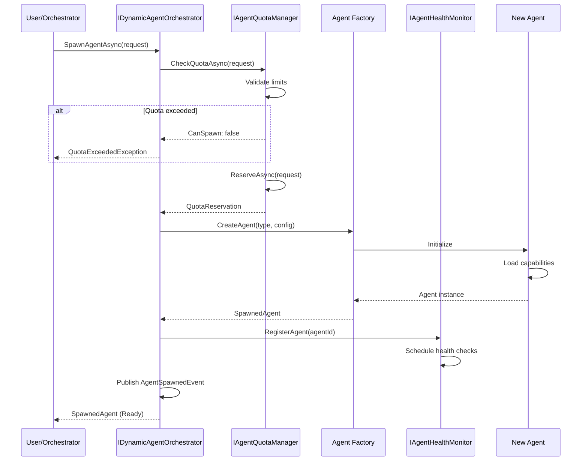
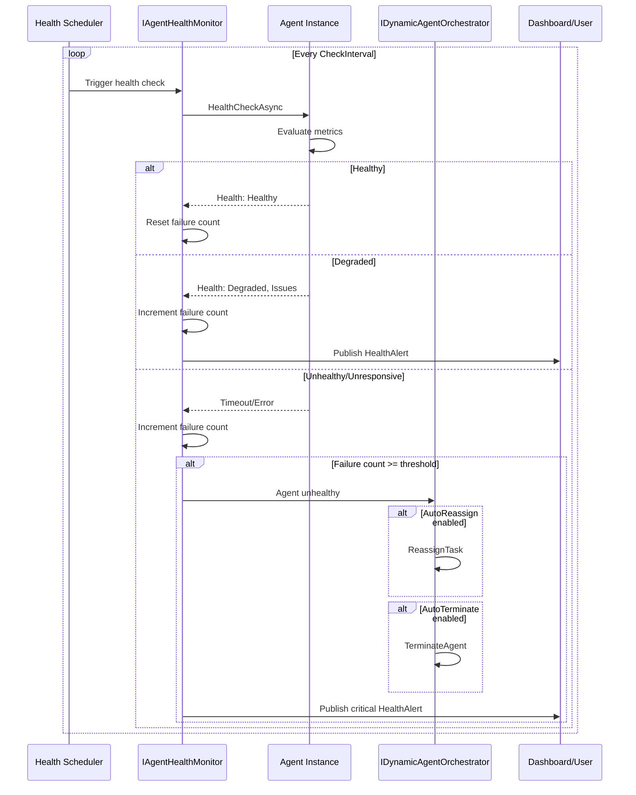

# LCS-SBD-v0.13.7-ORC: Scope Overview — Dynamic Agent Orchestration

## Document Control

| Field            | Value                                                        |
| :--------------- | :----------------------------------------------------------- |
| **Document ID**  | LCS-SBD-v0.13.7-ORC                                          |
| **Version**      | v0.13.7                                                      |
| **Codename**     | Dynamic Agent Orchestration (Human-in-the-Loop Phase 2)      |
| **Status**       | Draft                                                        |
| **Last Updated** | 2026-02-03                                                   |
| **Owner**        | Orchestration Architecture Lead                              |
| **Depends On**   | v0.13.2-ORC (dispatch), v0.13.3-ORC (execution), v0.13.6-ORC (approval), v0.12.2-AGT (lifecycle) |

---

## 1. Executive Summary

### 1.1 The Vision

**v0.13.7-ORC** delivers **Dynamic Agent Orchestration** — a comprehensive system for creating, monitoring, and managing agents at runtime during orchestration. This establishes:

- Dynamic agent spawning for sub-tasks during execution
- Real-time agent status monitoring with health checks
- Lifecycle control (pause, resume, terminate) for individual agents
- Resource quota management to prevent runaway consumption
- Task reassignment between agents when issues arise
- Visual dashboard for controlling active agent ensembles

Users gain fine-grained control over the agent workforce — spawning specialized agents on demand, monitoring their progress, and intervening when necessary.

### 1.2 Business Value

- **Flexibility:** Spawn agents dynamically based on discovered task requirements.
- **Visibility:** Real-time monitoring of agent status, health, and performance.
- **Control:** Pause, resume, or terminate agents at any time.
- **Efficiency:** Reassign tasks from struggling agents to better-suited ones.
- **Resource Management:** Enforce quotas to control costs and prevent abuse.
- **Reliability:** Health monitoring enables proactive intervention before failures.

### 1.3 Success Criteria

1. Agents can be spawned on-demand within 2s of request.
2. Agent status updates are reflected in dashboard within 1s.
3. Health checks detect degraded agents within 30s.
4. Task reassignment completes within 5s with no data loss.
5. Resource quotas are enforced with <100ms overhead.
6. Lifecycle commands (pause/resume/terminate) take effect within 1s.
7. Dashboard supports monitoring 50+ concurrent agents.

---

## 2. Key Deliverables

### 2.1 Sub-Parts

| Sub-Part | Title | Description | Est. Hours |
|:---------|:------|:------------|:-----------|
| v0.13.7a | Dynamic Agent Spawner | Create agents on-demand for sub-tasks | 12 |
| v0.13.7b | Agent Status Monitor | Real-time status tracking and metrics | 10 |
| v0.13.7c | Agent Health Checker | Periodic health checks with alerting | 8 |
| v0.13.7d | Lifecycle Controller | Pause, resume, terminate agents | 10 |
| v0.13.7e | Resource Quota Manager | Enforce resource limits | 8 |
| v0.13.7f | Agent Control Dashboard UI | Visual management interface | 10 |
| **Total** | | | **58 hours** |

### 2.2 Core Interfaces

```csharp
/// <summary>
/// Manages dynamic agent creation and orchestration during execution.
/// Provides on-demand agent spawning, monitoring, and lifecycle control.
/// </summary>
public interface IDynamicAgentOrchestrator
{
    /// <summary>
    /// Spawn a new agent for a specific task or sub-task.
    /// </summary>
    Task<SpawnedAgent> SpawnAgentAsync(
        AgentSpawnRequest request,
        CancellationToken ct = default);

    /// <summary>
    /// Spawn multiple agents in parallel.
    /// </summary>
    Task<IReadOnlyList<SpawnedAgent>> SpawnAgentBatchAsync(
        IReadOnlyList<AgentSpawnRequest> requests,
        CancellationToken ct = default);

    /// <summary>
    /// Get status of all active agents in an execution.
    /// </summary>
    Task<IReadOnlyList<AgentStatus>> GetActiveAgentsAsync(
        ExecutionId executionId,
        CancellationToken ct = default);

    /// <summary>
    /// Get detailed status of a specific agent.
    /// </summary>
    Task<AgentStatus> GetAgentStatusAsync(
        AgentId agentId,
        CancellationToken ct = default);

    /// <summary>
    /// Pause an agent's execution.
    /// Agent will complete current operation then wait.
    /// </summary>
    Task PauseAgentAsync(
        AgentId agentId,
        string? reason = null,
        CancellationToken ct = default);

    /// <summary>
    /// Resume a paused agent.
    /// </summary>
    Task ResumeAgentAsync(
        AgentId agentId,
        CancellationToken ct = default);

    /// <summary>
    /// Terminate an agent.
    /// </summary>
    Task TerminateAgentAsync(
        AgentId agentId,
        TerminationReason reason,
        CancellationToken ct = default);

    /// <summary>
    /// Reassign a task from one agent to another.
    /// Creates new agent if preferredAgentId is null.
    /// </summary>
    Task<AgentId> ReassignTaskAsync(
        TaskNodeId taskId,
        AgentId? preferredAgentId = null,
        string? reassignmentReason = null,
        CancellationToken ct = default);

    /// <summary>
    /// Get history of agent lifecycle events.
    /// </summary>
    Task<IReadOnlyList<AgentLifecycleEvent>> GetLifecycleHistoryAsync(
        AgentId agentId,
        CancellationToken ct = default);

    /// <summary>
    /// Observable stream of agent lifecycle events.
    /// </summary>
    IObservable<AgentLifecycleEvent> LifecycleEvents { get; }
}

/// <summary>
/// Request to spawn a new agent.
/// </summary>
public record AgentSpawnRequest
{
    /// <summary>
    /// Type of agent to spawn (e.g., "Chronicler", "Scribe", "Validator").
    /// </summary>
    public required string AgentType { get; init; }

    /// <summary>
    /// Custom name for this agent instance.
    /// </summary>
    public string? CustomName { get; init; }

    /// <summary>
    /// Task this agent is being spawned for.
    /// </summary>
    public TaskNodeId? AssignedTaskId { get; init; }

    /// <summary>
    /// Execution context for the agent.
    /// </summary>
    public ExecutionId? ExecutionId { get; init; }

    /// <summary>
    /// Configuration overrides for this instance.
    /// </summary>
    public AgentConfiguration? Configuration { get; init; }

    /// <summary>
    /// Resource limits for this agent.
    /// </summary>
    public AgentResourceLimits? ResourceLimits { get; init; }

    /// <summary>
    /// Priority level for resource allocation.
    /// </summary>
    public SpawnPriority Priority { get; init; } = SpawnPriority.Normal;

    /// <summary>
    /// Whether to wait for agent to be ready before returning.
    /// </summary>
    public bool WaitForReady { get; init; } = true;

    /// <summary>
    /// Timeout for agent initialization.
    /// </summary>
    public TimeSpan? InitTimeout { get; init; }

    /// <summary>
    /// Initial context to provide to the agent.
    /// </summary>
    public IReadOnlyDictionary<string, object>? InitialContext { get; init; }
}

public enum SpawnPriority
{
    Low,
    Normal,
    High,
    Critical
}

/// <summary>
/// A spawned agent instance.
/// </summary>
public record SpawnedAgent
{
    public AgentId Id { get; init; }
    public string AgentType { get; init; } = "";
    public string Name { get; init; } = "";
    public AgentState State { get; init; }
    public DateTimeOffset SpawnedAt { get; init; }
    public TaskNodeId? AssignedTaskId { get; init; }
    public ExecutionId? ExecutionId { get; init; }
    public AgentResourceLimits ResourceLimits { get; init; } = new();
    public AgentCapabilities Capabilities { get; init; } = new();
    public string? SpawnReason { get; init; }
}

/// <summary>
/// Resource limits for an agent.
/// </summary>
public record AgentResourceLimits
{
    /// <summary>
    /// Maximum tokens per single LLM request.
    /// </summary>
    public int? MaxTokensPerRequest { get; init; }

    /// <summary>
    /// Maximum total tokens for this agent's lifetime.
    /// </summary>
    public int? MaxTotalTokens { get; init; }

    /// <summary>
    /// Maximum execution time for this agent.
    /// </summary>
    public TimeSpan? MaxExecutionTime { get; init; }

    /// <summary>
    /// Maximum memory usage.
    /// </summary>
    public long? MaxMemoryBytes { get; init; }

    /// <summary>
    /// Maximum concurrent tool invocations.
    /// </summary>
    public int? MaxConcurrentTools { get; init; }

    /// <summary>
    /// Maximum retries per operation.
    /// </summary>
    public int? MaxRetries { get; init; }

    /// <summary>
    /// Maximum number of tasks this agent can handle.
    /// </summary>
    public int? MaxTasks { get; init; }
}

/// <summary>
/// Current status of an agent.
/// </summary>
public record AgentStatus
{
    public AgentId Id { get; init; }
    public string Name { get; init; } = "";
    public string AgentType { get; init; } = "";
    public AgentState State { get; init; }
    public AgentHealth Health { get; init; }
    public TaskNodeId? CurrentTaskId { get; init; }
    public string? CurrentTaskName { get; init; }
    public string? CurrentActivity { get; init; }
    public AgentMetrics Metrics { get; init; } = new();
    public AgentResourceUsage ResourceUsage { get; init; } = new();
    public DateTimeOffset SpawnedAt { get; init; }
    public DateTimeOffset LastActivityAt { get; init; }
    public IReadOnlyList<AgentIssue> Issues { get; init; } = [];
    public ExecutionId? ExecutionId { get; init; }
    public string? PauseReason { get; init; }
}

public enum AgentState
{
    Initializing,   // Agent is starting up
    Ready,          // Agent is idle and ready for work
    Working,        // Agent is executing a task
    Paused,         // Agent is paused by user
    Waiting,        // Agent is waiting for input/dependency
    Error,          // Agent encountered an error
    Terminating,    // Agent is shutting down
    Terminated      // Agent has been terminated
}

public enum AgentHealth
{
    Healthy,        // Operating normally
    Degraded,       // Working but with issues
    Unhealthy,      // Significant problems
    Unresponsive,   // Not responding to health checks
    Unknown         // Status cannot be determined
}

/// <summary>
/// Runtime metrics for an agent.
/// </summary>
public record AgentMetrics
{
    public int TasksCompleted { get; init; }
    public int TasksFailed { get; init; }
    public int TasksInProgress { get; init; }
    public int TotalTokensUsed { get; init; }
    public TimeSpan TotalRunTime { get; init; }
    public TimeSpan CurrentTaskDuration { get; init; }
    public float SuccessRate => TasksCompleted + TasksFailed > 0
        ? (float)TasksCompleted / (TasksCompleted + TasksFailed)
        : 0;
    public TimeSpan AverageTaskDuration { get; init; }
    public int RetryCount { get; init; }
    public int ToolInvocations { get; init; }
    public int ErrorCount { get; init; }
    public float TokensPerMinute { get; init; }
}

/// <summary>
/// Current resource usage vs limits.
/// </summary>
public record AgentResourceUsage
{
    public int TokensUsed { get; init; }
    public int? TokenLimit { get; init; }
    public TimeSpan TimeElapsed { get; init; }
    public TimeSpan? TimeLimit { get; init; }
    public long MemoryUsedBytes { get; init; }
    public long? MemoryLimit { get; init; }
    public int TasksProcessed { get; init; }
    public int? TaskLimit { get; init; }

    public float TokenUtilization => TokenLimit > 0 ? (float)TokensUsed / TokenLimit.Value : 0;
    public float TimeUtilization => TimeLimit.HasValue && TimeLimit.Value > TimeSpan.Zero
        ? (float)TimeElapsed.Ticks / TimeLimit.Value.Ticks : 0;
    public bool IsNearLimit => TokenUtilization > 0.9f || TimeUtilization > 0.9f;
}

/// <summary>
/// An issue affecting an agent.
/// </summary>
public record AgentIssue
{
    public Guid IssueId { get; init; } = Guid.NewGuid();
    public IssueSeverity Severity { get; init; }
    public string Code { get; init; } = "";
    public string Description { get; init; } = "";
    public DateTimeOffset DetectedAt { get; init; }
    public bool IsResolved { get; init; }
    public string? Resolution { get; init; }
    public DateTimeOffset? ResolvedAt { get; init; }
}

public enum IssueSeverity
{
    Info,
    Warning,
    Error,
    Critical
}

/// <summary>
/// Reason for terminating an agent.
/// </summary>
public record TerminationReason
{
    public TerminationType Type { get; init; }
    public string? Description { get; init; }
    public bool SaveState { get; init; } = true;
    public bool GracefulShutdown { get; init; } = true;
    public TimeSpan? GracePeriod { get; init; }
}

public enum TerminationType
{
    TaskComplete,       // Task finished successfully
    TaskFailed,         // Task failed permanently
    UserRequested,      // User requested termination
    ResourceExhausted,  // Hit resource limits
    Timeout,            // Execution timeout
    Error,              // Unrecoverable error
    Reassigned,         // Task reassigned to another agent
    ExecutionCancelled, // Parent execution cancelled
    HealthCheckFailed   // Failed too many health checks
}

/// <summary>
/// Monitors agent health and performance.
/// </summary>
public interface IAgentHealthMonitor
{
    /// <summary>
    /// Perform health check on an agent.
    /// </summary>
    Task<HealthCheckResult> CheckHealthAsync(
        AgentId agentId,
        CancellationToken ct = default);

    /// <summary>
    /// Get health history for an agent.
    /// </summary>
    Task<IReadOnlyList<HealthCheckResult>> GetHealthHistoryAsync(
        AgentId agentId,
        TimeSpan period,
        CancellationToken ct = default);

    /// <summary>
    /// Configure health check settings for an agent.
    /// </summary>
    Task ConfigureHealthChecksAsync(
        AgentId agentId,
        HealthCheckConfiguration config,
        CancellationToken ct = default);

    /// <summary>
    /// Get global health configuration.
    /// </summary>
    Task<HealthCheckConfiguration> GetDefaultConfigurationAsync(
        CancellationToken ct = default);

    /// <summary>
    /// Update global health configuration.
    /// </summary>
    Task UpdateDefaultConfigurationAsync(
        HealthCheckConfiguration config,
        CancellationToken ct = default);

    /// <summary>
    /// Observable stream of health alerts.
    /// </summary>
    IObservable<HealthAlert> HealthAlerts { get; }
}

public record HealthCheckResult
{
    public AgentId AgentId { get; init; }
    public AgentHealth Health { get; init; }
    public AgentHealth PreviousHealth { get; init; }
    public DateTimeOffset CheckedAt { get; init; }
    public TimeSpan ResponseTime { get; init; }
    public IReadOnlyList<HealthCheckItem> Items { get; init; } = [];
    public string? Summary { get; init; }
    public bool RequiresAttention { get; init; }
}

public record HealthCheckItem
{
    public string Name { get; init; } = "";
    public bool Passed { get; init; }
    public string? Details { get; init; }
    public string? Metric { get; init; }
    public string? Threshold { get; init; }
}

public record HealthCheckConfiguration
{
    /// <summary>
    /// Interval between health checks.
    /// </summary>
    public TimeSpan CheckInterval { get; init; } = TimeSpan.FromSeconds(30);

    /// <summary>
    /// Timeout for health check response.
    /// </summary>
    public TimeSpan CheckTimeout { get; init; } = TimeSpan.FromSeconds(10);

    /// <summary>
    /// Number of consecutive failures before marking unhealthy.
    /// </summary>
    public int UnhealthyThreshold { get; init; } = 3;

    /// <summary>
    /// Number of consecutive successes to restore healthy status.
    /// </summary>
    public int HealthyThreshold { get; init; } = 2;

    /// <summary>
    /// Whether to auto-terminate unhealthy agents.
    /// </summary>
    public bool AutoTerminateUnhealthy { get; init; } = false;

    /// <summary>
    /// Whether to auto-reassign tasks from unhealthy agents.
    /// </summary>
    public bool AutoReassignOnUnhealthy { get; init; } = true;

    /// <summary>
    /// Custom health check items to evaluate.
    /// </summary>
    public IReadOnlyList<CustomHealthCheck>? CustomChecks { get; init; }
}

public record CustomHealthCheck
{
    public string Name { get; init; } = "";
    public string MetricName { get; init; } = "";
    public ComparisonOperator Operator { get; init; }
    public double Threshold { get; init; }
    public bool FailOnBreach { get; init; } = true;
}

public enum ComparisonOperator
{
    LessThan,
    LessThanOrEqual,
    GreaterThan,
    GreaterThanOrEqual,
    Equal,
    NotEqual
}

public record HealthAlert
{
    public AgentId AgentId { get; init; }
    public string AgentName { get; init; } = "";
    public AgentHealth PreviousHealth { get; init; }
    public AgentHealth CurrentHealth { get; init; }
    public DateTimeOffset Timestamp { get; init; }
    public string Description { get; init; } = "";
    public IReadOnlyList<AgentIssue> Issues { get; init; } = [];
    public SuggestedAction? Suggestion { get; init; }
}

public record SuggestedAction
{
    public string Description { get; init; } = "";
    public ActionType Type { get; init; }
    public bool AutomatedAvailable { get; init; }
    public string? AutomationDetails { get; init; }
}

public enum ActionType
{
    Restart,
    Reassign,
    Terminate,
    Investigate,
    ScaleUp,
    Ignore
}

/// <summary>
/// Manages resource quotas for agent orchestration.
/// </summary>
public interface IAgentQuotaManager
{
    /// <summary>
    /// Check if resources are available for spawning.
    /// </summary>
    Task<QuotaCheckResult> CheckQuotaAsync(
        AgentSpawnRequest request,
        CancellationToken ct = default);

    /// <summary>
    /// Reserve resources for an agent.
    /// </summary>
    Task<QuotaReservation> ReserveAsync(
        AgentSpawnRequest request,
        CancellationToken ct = default);

    /// <summary>
    /// Release reserved resources.
    /// </summary>
    Task ReleaseAsync(
        QuotaReservationId reservationId,
        CancellationToken ct = default);

    /// <summary>
    /// Get current quota usage.
    /// </summary>
    Task<QuotaUsage> GetUsageAsync(
        ExecutionId? executionId = null,
        CancellationToken ct = default);

    /// <summary>
    /// Get quota limits.
    /// </summary>
    Task<QuotaLimits> GetLimitsAsync(
        CancellationToken ct = default);

    /// <summary>
    /// Update quota limits (admin only).
    /// </summary>
    Task UpdateLimitsAsync(
        QuotaLimits limits,
        CancellationToken ct = default);

    /// <summary>
    /// Get usage history over time.
    /// </summary>
    Task<IReadOnlyList<QuotaSnapshot>> GetUsageHistoryAsync(
        TimeSpan period,
        CancellationToken ct = default);

    /// <summary>
    /// Observable stream of quota alerts.
    /// </summary>
    IObservable<QuotaAlert> QuotaAlerts { get; }
}

public readonly record struct QuotaReservationId(Guid Value)
{
    public static QuotaReservationId New() => new(Guid.NewGuid());
}

public record QuotaCheckResult
{
    public bool CanSpawn { get; init; }
    public string? BlockingReason { get; init; }
    public QuotaUsage CurrentUsage { get; init; } = new();
    public IReadOnlyList<QuotaWarning> Warnings { get; init; } = [];
    public TimeSpan? EstimatedWaitTime { get; init; }
}

public record QuotaWarning
{
    public string Resource { get; init; } = "";
    public float UtilizationPercent { get; init; }
    public string Message { get; init; } = "";
}

public record QuotaReservation
{
    public QuotaReservationId Id { get; init; }
    public AgentSpawnRequest Request { get; init; } = null!;
    public DateTimeOffset ReservedAt { get; init; }
    public DateTimeOffset ExpiresAt { get; init; }
    public QuotaUsage ReservedResources { get; init; } = new();
}

public record QuotaUsage
{
    public int ActiveAgents { get; init; }
    public int MaxAgents { get; init; }
    public int TokensUsedToday { get; init; }
    public int DailyTokenLimit { get; init; }
    public int ConcurrentTasks { get; init; }
    public int MaxConcurrentTasks { get; init; }
    public long MemoryUsedBytes { get; init; }
    public long MaxMemoryBytes { get; init; }
    public int ExecutionsToday { get; init; }
    public int DailyExecutionLimit { get; init; }

    public float AgentUtilization => MaxAgents > 0 ? (float)ActiveAgents / MaxAgents : 0;
    public float TokenUtilization => DailyTokenLimit > 0 ? (float)TokensUsedToday / DailyTokenLimit : 0;
    public float TaskUtilization => MaxConcurrentTasks > 0 ? (float)ConcurrentTasks / MaxConcurrentTasks : 0;
    public float MemoryUtilization => MaxMemoryBytes > 0 ? (float)MemoryUsedBytes / MaxMemoryBytes : 0;
}

public record QuotaLimits
{
    public int MaxConcurrentAgents { get; init; }
    public int DailyTokenLimit { get; init; }
    public int MaxConcurrentTasks { get; init; }
    public long MaxMemoryBytes { get; init; }
    public int DailyExecutionLimit { get; init; }
    public TimeSpan MaxAgentLifetime { get; init; }
    public int MaxAgentsPerExecution { get; init; }
}

public record QuotaSnapshot
{
    public DateTimeOffset Timestamp { get; init; }
    public QuotaUsage Usage { get; init; } = new();
}

public record QuotaAlert
{
    public string Resource { get; init; } = "";
    public float UtilizationPercent { get; init; }
    public QuotaAlertSeverity Severity { get; init; }
    public string Message { get; init; } = "";
    public DateTimeOffset Timestamp { get; init; }
}

public enum QuotaAlertSeverity
{
    Info,       // Usage above 50%
    Warning,    // Usage above 75%
    Critical    // Usage above 90%
}

/// <summary>
/// Events for agent lifecycle changes.
/// </summary>
public abstract record AgentLifecycleEvent
{
    public AgentId AgentId { get; init; }
    public string AgentName { get; init; } = "";
    public DateTimeOffset Timestamp { get; init; } = DateTimeOffset.UtcNow;
}

public record AgentSpawnedEvent : AgentLifecycleEvent
{
    public SpawnedAgent Agent { get; init; } = null!;
    public AgentSpawnRequest Request { get; init; } = null!;
}

public record AgentStateChangedEvent : AgentLifecycleEvent
{
    public AgentState PreviousState { get; init; }
    public AgentState NewState { get; init; }
    public string? Reason { get; init; }
}

public record AgentHealthChangedEvent : AgentLifecycleEvent
{
    public AgentHealth PreviousHealth { get; init; }
    public AgentHealth NewHealth { get; init; }
    public IReadOnlyList<AgentIssue> Issues { get; init; } = [];
}

public record AgentTaskAssignedEvent : AgentLifecycleEvent
{
    public TaskNodeId TaskId { get; init; }
    public string TaskName { get; init; } = "";
}

public record AgentTaskCompletedEvent : AgentLifecycleEvent
{
    public TaskNodeId TaskId { get; init; }
    public string TaskName { get; init; } = "";
    public TaskOutput Output { get; init; } = null!;
    public AgentMetrics MetricsSnapshot { get; init; } = null!;
}

public record AgentTaskFailedEvent : AgentLifecycleEvent
{
    public TaskNodeId TaskId { get; init; }
    public string TaskName { get; init; } = "";
    public string Error { get; init; } = "";
    public bool WillRetry { get; init; }
}

public record AgentPausedEvent : AgentLifecycleEvent
{
    public string? Reason { get; init; }
    public UserId? PausedBy { get; init; }
}

public record AgentResumedEvent : AgentLifecycleEvent
{
    public UserId? ResumedBy { get; init; }
}

public record AgentTerminatedEvent : AgentLifecycleEvent
{
    public TerminationReason Reason { get; init; } = null!;
    public AgentMetrics FinalMetrics { get; init; } = null!;
}

public record AgentReassignedEvent : AgentLifecycleEvent
{
    public TaskNodeId TaskId { get; init; }
    public string TaskName { get; init; } = "";
    public AgentId NewAgentId { get; init; }
    public string NewAgentName { get; init; } = "";
    public string? ReassignmentReason { get; init; }
}

public record AgentResourceLimitReachedEvent : AgentLifecycleEvent
{
    public string Resource { get; init; } = "";
    public object CurrentValue { get; init; } = null!;
    public object Limit { get; init; } = null!;
}
```

---

## 3. Architecture

### 3.1 Component Overview

```
┌─────────────────────────────────────────────────────────────────────────────┐
│                     Dynamic Agent Orchestration Layer                        │
├─────────────────────────────────────────────────────────────────────────────┤
│                                                                              │
│  ┌─────────────────────────────────────────────────────────────────────┐   │
│  │                    IDynamicAgentOrchestrator                         │   │
│  │  ┌──────────────┐  ┌──────────────┐  ┌──────────────┐              │   │
│  │  │    Spawn     │  │    Get       │  │  Lifecycle   │              │   │
│  │  │    Agent     │  │   Status     │  │   Control    │              │   │
│  │  └──────┬───────┘  └──────┬───────┘  └──────┬───────┘              │   │
│  │         │                 │                 │                       │   │
│  │         ▼                 ▼                 ▼                       │   │
│  │  ┌─────────────────────────────────────────────────────────────┐   │   │
│  │  │                  Agent Instance Registry                     │   │   │
│  │  └─────────────────────────────────────────────────────────────┘   │   │
│  └─────────────────────────────────────────────────────────────────────┘   │
│                                     │                                       │
│              ┌──────────────────────┼───────────────────┐                  │
│              ▼                      ▼                   ▼                  │
│  ┌──────────────────────┐ ┌──────────────────────┐ ┌──────────────────────┐│
│  │ IAgentHealthMonitor  │ │ IAgentQuotaManager   │ │ Agent Factory        ││
│  │ ┌────────────────┐   │ │ ┌────────────────┐   │ │ ┌────────────────┐   ││
│  │ │ Health Checks  │   │ │ │ Check Quota    │   │ │ │ Create Agent   │   ││
│  │ │ at Interval    │   │ │ │ Reserve/Release│   │ │ │ by Type        │   ││
│  │ └────────────────┘   │ │ └────────────────┘   │ │ └────────────────┘   ││
│  │ ┌────────────────┐   │ │ ┌────────────────┐   │ │ ┌────────────────┐   ││
│  │ │ Generate       │   │ │ │ Track Usage    │   │ │ │ Configure      │   ││
│  │ │ Alerts         │   │ │ │ Enforce Limits │   │ │ │ Instance       │   ││
│  │ └────────────────┘   │ │ └────────────────┘   │ │ └────────────────┘   ││
│  └──────────────────────┘ └──────────────────────┘ └──────────────────────┘│
│                                     │                                       │
│                                     ▼                                       │
│  ┌─────────────────────────────────────────────────────────────────────┐   │
│  │                      Agent Lifecycle Manager                         │   │
│  │  ┌───────────────────────────────────────────────────────────────┐  │   │
│  │  │ State transitions: Initialize → Ready ⇄ Working ⇄ Paused     │  │   │
│  │  │ Handle: Pause, Resume, Terminate, Reassign                    │  │   │
│  │  └───────────────────────────────────────────────────────────────┘  │   │
│  └─────────────────────────────────────────────────────────────────────┘   │
│                                     │                                       │
│                                     ▼                                       │
│  ┌─────────────────────────────────────────────────────────────────────┐   │
│  │                  Agent Control Dashboard (UI)                        │   │
│  │  ┌──────────┐  ┌──────────┐  ┌──────────┐  ┌──────────┐           │   │
│  │  │ Active   │  │ Metrics  │  │ Health   │  │ Actions  │           │   │
│  │  │ Agents   │  │ Display  │  │ Status   │  │ Panel    │           │   │
│  │  └──────────┘  └──────────┘  └──────────┘  └──────────┘           │   │
│  └─────────────────────────────────────────────────────────────────────┘   │
│                                                                              │
└─────────────────────────────────────────────────────────────────────────────┘
```

### 3.2 Agent Spawn Flow



### 3.3 Agent Lifecycle State Machine

```
                              SpawnRequested
                                    │
                                    ▼
                            ┌───────────────┐
                            │ Initializing  │
                            └───────┬───────┘
                                    │ Initialization complete
                                    ▼
                ┌───────────────────────────────────────┐
                │                                       │
          Pause │            ┌─────────┐              │ TaskAssigned
                │       ┌───▶│  Ready  │◀───┐         │
                ▼       │    └────┬────┘    │         ▼
          ┌─────────┐   │         │         │   ┌─────────┐
          │ Paused  │◀──┤   Assign│Task  Complete│─▶│ Working │
          └────┬────┘   │         ▼         │   └────┬────┘
               │        │   ┌──────────┐    │        │
          Resume│       │   │ Waiting  │────┘        │ Error
               │        │   │(for dep) │             │
               └────────┘   └──────────┘             ▼
                                               ┌─────────┐
                                               │  Error  │
                                               └────┬────┘
                                                    │ Recover
                                                    │ or
                        Terminate (any state)       │ Terminate
                               │                    │
                               ▼                    ▼
                         ┌─────────────┐    ┌─────────────┐
                         │ Terminating │───▶│ Terminated  │
                         └─────────────┘    └─────────────┘

Transitions:
- Ready → Working: Task assigned
- Working → Ready: Task completed successfully
- Working → Waiting: Dependency not ready
- Waiting → Working: Dependency ready
- Working → Error: Task failed
- Error → Ready: Auto-recovery (if enabled)
- Error → Terminated: Unrecoverable error
- Any → Paused: User pause command
- Paused → Ready/Working: User resume command
- Any → Terminating: Terminate command
- Terminating → Terminated: Cleanup complete
```

### 3.4 Health Check Flow



---

## 4. Database Schema

```sql
-- Agent instances (runtime)
CREATE TABLE agent_instances (
    id UUID PRIMARY KEY DEFAULT gen_random_uuid(),
    agent_type VARCHAR(100) NOT NULL,
    name VARCHAR(200) NOT NULL,
    state VARCHAR(30) NOT NULL DEFAULT 'initializing',
    health VARCHAR(30) NOT NULL DEFAULT 'unknown',
    execution_id UUID,
    current_task_id UUID,
    current_activity TEXT,
    pause_reason TEXT,
    spawned_at TIMESTAMPTZ NOT NULL DEFAULT NOW(),
    last_activity_at TIMESTAMPTZ NOT NULL DEFAULT NOW(),
    terminated_at TIMESTAMPTZ,
    termination_reason JSONB,
    configuration JSONB DEFAULT '{}',
    resource_limits JSONB DEFAULT '{}',
    capabilities JSONB DEFAULT '[]',
    spawn_priority VARCHAR(20) DEFAULT 'normal',
    spawn_reason TEXT
);

CREATE INDEX idx_agent_instances_state ON agent_instances(state);
CREATE INDEX idx_agent_instances_health ON agent_instances(health);
CREATE INDEX idx_agent_instances_execution ON agent_instances(execution_id);
CREATE INDEX idx_agent_instances_active ON agent_instances(state) WHERE state NOT IN ('terminated');

-- Agent metrics (periodically updated)
CREATE TABLE agent_metrics (
    id UUID PRIMARY KEY DEFAULT gen_random_uuid(),
    agent_id UUID NOT NULL REFERENCES agent_instances(id) ON DELETE CASCADE,
    tasks_completed INT DEFAULT 0,
    tasks_failed INT DEFAULT 0,
    tasks_in_progress INT DEFAULT 0,
    total_tokens_used INT DEFAULT 0,
    total_run_time_ms BIGINT DEFAULT 0,
    retry_count INT DEFAULT 0,
    tool_invocations INT DEFAULT 0,
    error_count INT DEFAULT 0,
    last_updated_at TIMESTAMPTZ NOT NULL DEFAULT NOW(),

    UNIQUE(agent_id)
);

CREATE INDEX idx_agent_metrics_agent ON agent_metrics(agent_id);

-- Agent resource usage
CREATE TABLE agent_resource_usage (
    id UUID PRIMARY KEY DEFAULT gen_random_uuid(),
    agent_id UUID NOT NULL REFERENCES agent_instances(id) ON DELETE CASCADE,
    tokens_used INT DEFAULT 0,
    memory_used_bytes BIGINT DEFAULT 0,
    tasks_processed INT DEFAULT 0,
    time_elapsed_ms BIGINT DEFAULT 0,
    last_updated_at TIMESTAMPTZ NOT NULL DEFAULT NOW(),

    UNIQUE(agent_id)
);

CREATE INDEX idx_agent_resource_agent ON agent_resource_usage(agent_id);

-- Agent issues
CREATE TABLE agent_issues (
    id UUID PRIMARY KEY DEFAULT gen_random_uuid(),
    agent_id UUID NOT NULL REFERENCES agent_instances(id) ON DELETE CASCADE,
    severity VARCHAR(20) NOT NULL,
    code VARCHAR(100) NOT NULL,
    description TEXT NOT NULL,
    detected_at TIMESTAMPTZ NOT NULL DEFAULT NOW(),
    is_resolved BOOLEAN DEFAULT FALSE,
    resolution TEXT,
    resolved_at TIMESTAMPTZ
);

CREATE INDEX idx_agent_issues_agent ON agent_issues(agent_id);
CREATE INDEX idx_agent_issues_severity ON agent_issues(severity);
CREATE INDEX idx_agent_issues_unresolved ON agent_issues(agent_id, is_resolved) WHERE is_resolved = FALSE;

-- Health check history
CREATE TABLE health_check_history (
    id UUID PRIMARY KEY DEFAULT gen_random_uuid(),
    agent_id UUID NOT NULL REFERENCES agent_instances(id) ON DELETE CASCADE,
    health VARCHAR(30) NOT NULL,
    previous_health VARCHAR(30),
    response_time_ms INT,
    check_items JSONB DEFAULT '[]',
    summary TEXT,
    checked_at TIMESTAMPTZ NOT NULL DEFAULT NOW()
);

CREATE INDEX idx_health_history_agent ON health_check_history(agent_id);
CREATE INDEX idx_health_history_time ON health_check_history(checked_at DESC);

-- Quota reservations
CREATE TABLE quota_reservations (
    id UUID PRIMARY KEY DEFAULT gen_random_uuid(),
    execution_id UUID,
    agent_type VARCHAR(100) NOT NULL,
    reserved_agents INT DEFAULT 1,
    reserved_tokens INT DEFAULT 0,
    reserved_at TIMESTAMPTZ NOT NULL DEFAULT NOW(),
    expires_at TIMESTAMPTZ NOT NULL,
    released_at TIMESTAMPTZ,
    metadata JSONB DEFAULT '{}'
);

CREATE INDEX idx_quota_reservations_active ON quota_reservations(expires_at) WHERE released_at IS NULL;
CREATE INDEX idx_quota_reservations_execution ON quota_reservations(execution_id);

-- Quota usage snapshots (for history)
CREATE TABLE quota_usage_snapshots (
    id UUID PRIMARY KEY DEFAULT gen_random_uuid(),
    active_agents INT NOT NULL,
    tokens_used_today INT NOT NULL,
    concurrent_tasks INT NOT NULL,
    memory_used_bytes BIGINT NOT NULL,
    executions_today INT NOT NULL,
    snapshot_at TIMESTAMPTZ NOT NULL DEFAULT NOW()
);

CREATE INDEX idx_quota_snapshots_time ON quota_usage_snapshots(snapshot_at DESC);

-- Agent lifecycle events (audit)
CREATE TABLE agent_lifecycle_events (
    id UUID PRIMARY KEY DEFAULT gen_random_uuid(),
    agent_id UUID NOT NULL,
    agent_name VARCHAR(200),
    event_type VARCHAR(50) NOT NULL,
    event_data JSONB NOT NULL,
    occurred_at TIMESTAMPTZ NOT NULL DEFAULT NOW()
) PARTITION BY RANGE (occurred_at);

CREATE INDEX idx_lifecycle_events_agent ON agent_lifecycle_events(agent_id);
CREATE INDEX idx_lifecycle_events_type ON agent_lifecycle_events(event_type);
CREATE INDEX idx_lifecycle_events_time ON agent_lifecycle_events(occurred_at DESC);
```

---

## 5. Dashboard UI Design

### 5.1 Agent Control Dashboard

```
┌────────────────────────────────────────────────────────────────────────────┐
│ Agent Orchestration Control Panel          Execution: #exec-7890-abcd     │
├────────────────────────────────────────────────────────────────────────────┤
│                                                                             │
│ RESOURCE USAGE:                                                            │
│ ┌─────────────────────────────────────────────────────────────────────────┐│
│ │ Agents: [████████░░] 4/5     Tokens: [██████░░░░] 12.5k/25k today      ││
│ │ Memory: [███░░░░░░░] 256MB/1GB    Tasks: [███████░░░] 7/10 concurrent  ││
│ └─────────────────────────────────────────────────────────────────────────┘│
│                                                                             │
│ ACTIVE AGENTS (4):                                                         │
│ ┌─────────────────────────────────────────────────────────────────────────┐│
│ │ 🟢 Chronicler-1    │ WORKING │ Task: Research Git commits              ││
│ │    ├── Tokens: 2,340 | Runtime: 2m 15s | Health: Healthy               ││
│ │    └── Progress: Analyzing 47 commits...                               ││
│ │    [⏸ Pause] [📊 Details] [🔄 Reassign] [⏹ Terminate]                 ││
│ ├─────────────────────────────────────────────────────────────────────────┤│
│ │ 🟢 Scribe-1        │ WORKING │ Task: Generate API overview             ││
│ │    ├── Tokens: 4,120 | Runtime: 3m 42s | Health: Healthy               ││
│ │    └── Progress: Writing section 3 of 5...                             ││
│ │    [⏸ Pause] [📊 Details] [🔄 Reassign] [⏹ Terminate]                 ││
│ ├─────────────────────────────────────────────────────────────────────────┤│
│ │ 🟡 Validator-1     │ WAITING │ Task: Validate output                   ││
│ │    ├── Tokens: 0 | Runtime: 0s | Health: Healthy                       ││
│ │    └── Status: Waiting for Scribe-1 to complete...                     ││
│ │    [⏭ Skip Wait] [📊 Details] [⏹ Terminate]                           ││
│ ├─────────────────────────────────────────────────────────────────────────┤│
│ │ 🟠 Researcher-2    │ DEGRADED │ Task: Fetch external docs              ││
│ │    ├── Tokens: 1,890 | Runtime: 5m 10s | Health: Degraded              ││
│ │    └── ⚠️ Issue: Rate limited by external API, retrying in 30s...     ││
│ │    [⏸ Pause] [📊 Details] [🔄 Reassign] [⏹ Terminate]                 ││
│ └─────────────────────────────────────────────────────────────────────────┘│
│                                                                             │
│ TERMINATED/COMPLETED AGENTS (2):                                           │
│ ┌─────────────────────────────────────────────────────────────────────────┐│
│ │ ⚫ Chronicler-0    │ TaskComplete │ 10 min ago │ 3,200 tokens │ 2 tasks││
│ │ ⚫ Helper-1        │ Reassigned   │ 5 min ago  │ 890 tokens   │ 0 tasks ││
│ └─────────────────────────────────────────────────────────────────────────┘│
│                                                                             │
│ QUICK ACTIONS:                                                             │
│ ┌─────────────────────────────────────────────────────────────────────────┐│
│ │ [+ Spawn Agent] [⏸ Pause All] [▶ Resume All] [⏹ Terminate All]        ││
│ │ [📊 View Full Metrics] [⚙ Health Config] [📋 Export Logs]              ││
│ └─────────────────────────────────────────────────────────────────────────┘│
│                                                                             │
│ RECENT EVENTS:                                                             │
│ ┌─────────────────────────────────────────────────────────────────────────┐│
│ │ 14:26:45 │ INFO  │ Chronicler-1 assigned to task "Research commits"    ││
│ │ 14:26:47 │ INFO  │ Scribe-1 spawned for task "Generate overview"       ││
│ │ 14:28:12 │ WARN  │ Researcher-2 health degraded: API rate limit        ││
│ │ 14:29:30 │ INFO  │ Chronicler-0 terminated: task complete              ││
│ │ 14:30:15 │ INFO  │ Validator-1 state changed: Ready → Waiting          ││
│ └─────────────────────────────────────────────────────────────────────────┘│
│                                                                             │
└────────────────────────────────────────────────────────────────────────────┘
```

### 5.2 Agent Details Modal

```
┌────────────────────────────────────────────────────────────────────────────┐
│ Agent Details: Chronicler-1                                    [Close ×]  │
├────────────────────────────────────────────────────────────────────────────┤
│                                                                             │
│ IDENTITY                              │ CURRENT STATE                       │
│ ├─ Type: Chronicler                  │ ├─ State: 🟢 Working                │
│ ├─ ID: agt-abc123-def456            │ ├─ Health: Healthy                  │
│ ├─ Spawned: 5 min ago               │ ├─ Task: Research Git commits       │
│ └─ Execution: #exec-7890-abcd       │ └─ Activity: Analyzing commit diff  │
│                                                                             │
│ METRICS                                                                    │
│ ┌─────────────────────────────────────────────────────────────────────────┐│
│ │ Tasks Completed: 2      │ Tasks Failed: 0       │ Success Rate: 100%   ││
│ │ Tokens Used: 2,340      │ Token Limit: 10,000   │ Utilization: 23%     ││
│ │ Runtime: 5m 23s         │ Time Limit: 30m       │ Utilization: 18%     ││
│ │ Tool Calls: 12          │ Retries: 0            │ Errors: 0            ││
│ └─────────────────────────────────────────────────────────────────────────┘│
│                                                                             │
│ CAPABILITIES                                                               │
│ ┌─────────────────────────────────────────────────────────────────────────┐│
│ │ ✓ Git Analysis    ✓ Code Review    ✓ Documentation                     ││
│ │ ✓ Summarization   ✓ Text Generation                                    ││
│ └─────────────────────────────────────────────────────────────────────────┘│
│                                                                             │
│ RESOURCE LIMITS                                                            │
│ ┌─────────────────────────────────────────────────────────────────────────┐│
│ │ Max Tokens/Request: 4,096   │ Max Total Tokens: 10,000                 ││
│ │ Max Execution Time: 30min   │ Max Memory: 256MB                        ││
│ │ Max Concurrent Tools: 3     │ Max Retries: 3                           ││
│ └─────────────────────────────────────────────────────────────────────────┘│
│                                                                             │
│ HEALTH CHECK HISTORY (Last 5)                                              │
│ ┌─────────────────────────────────────────────────────────────────────────┐│
│ │ 14:30:00 │ Healthy │ Response: 45ms │ All checks passed                ││
│ │ 14:29:30 │ Healthy │ Response: 52ms │ All checks passed                ││
│ │ 14:29:00 │ Healthy │ Response: 48ms │ All checks passed                ││
│ │ 14:28:30 │ Healthy │ Response: 51ms │ All checks passed                ││
│ │ 14:28:00 │ Healthy │ Response: 47ms │ All checks passed                ││
│ └─────────────────────────────────────────────────────────────────────────┘│
│                                                                             │
│ ACTIONS:                                                                   │
│ ┌─────────────────────────────────────────────────────────────────────────┐│
│ │ [⏸ Pause Agent] [🔄 Reassign Task] [⏹ Terminate] [📋 View Full Logs]  ││
│ └─────────────────────────────────────────────────────────────────────────┘│
│                                                                             │
└────────────────────────────────────────────────────────────────────────────┘
```

---

## 6. License Gating

| Tier | Features |
|:-----|:---------|
| Core | Max 2 concurrent agents, basic status only |
| WriterPro | Max 5 agents, health monitoring, basic control |
| Teams | Max 10 agents, full lifecycle control, quotas |
| Enterprise | Unlimited agents, custom quotas, API, audit logs |

**License Details:**
- **Core:** Limited agents, no pause/resume, no reassignment
- **WriterPro:** Health monitoring, basic pause/resume
- **Teams:** Full lifecycle control, configurable quotas
- **Enterprise:** Unlimited scaling, API access, custom health checks

---

## 7. Performance Targets

| Metric | Target | Measurement |
|:-------|:-------|:------------|
| Agent spawn | <2s | P95 time from request to Ready state |
| Status update | <1s | P95 latency to reflect state change |
| Health check | <500ms | P95 response time |
| Pause/Resume | <1s | P95 time to complete command |
| Terminate | <2s | P95 time for graceful shutdown |
| Reassignment | <5s | P95 time including agent spawn |
| Dashboard load | <1s | P95 time to load 50 agents |
| Event delivery | <500ms | P95 latency for lifecycle events |

---

## 8. Testing Strategy

### 8.1 Unit Tests

- Agent state machine transitions
- Quota calculation logic
- Health check evaluation
- Resource limit enforcement
- Event serialization

### 8.2 Integration Tests

- Full spawn → work → terminate lifecycle
- Concurrent agent spawning (10 agents)
- Health degradation → auto-reassignment
- Quota exhaustion handling
- Pause/resume during task execution

### 8.3 Performance Tests

- Spawn 50 agents in parallel
- Monitor 100 active agents
- Health checks every 30s for 100 agents
- Dashboard with 50 agents updating

### 8.4 UI Tests

- Agent list updates in real-time
- Detail modal interactions
- Bulk action buttons
- Resource usage visualizations

---

## 9. Risks & Mitigations

| Risk | Impact | Mitigation |
|:-----|:-------|:-----------|
| Runaway agent spawning | Resource exhaustion | Strict quotas, rate limiting |
| Health check storms | Performance degradation | Staggered checks, backoff |
| Orphaned agents | Resource leak | Cleanup job, execution tracking |
| State inconsistency | Data corruption | Distributed locking, event sourcing |
| Terminate data loss | Lost work | Graceful shutdown, state persistence |
| Dashboard overload | UI freeze | Pagination, virtualization, sampling |

---

## 10. Success Metrics

- **Spawn Reliability:** >99% of spawn requests succeed
- **Health Detection:** >95% of issues detected within 60s
- **Reassignment Success:** >90% of reassignments complete without data loss
- **Quota Compliance:** 100% enforcement of resource limits
- **Dashboard Responsiveness:** <100ms for all UI interactions
- **User Satisfaction:** NPS >50 for agent control experience

---
