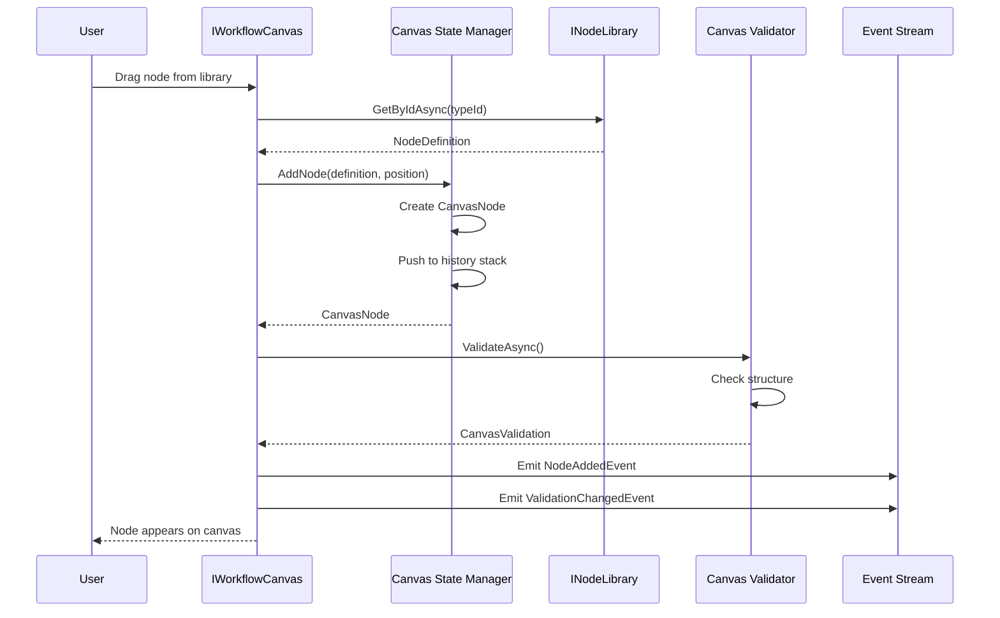
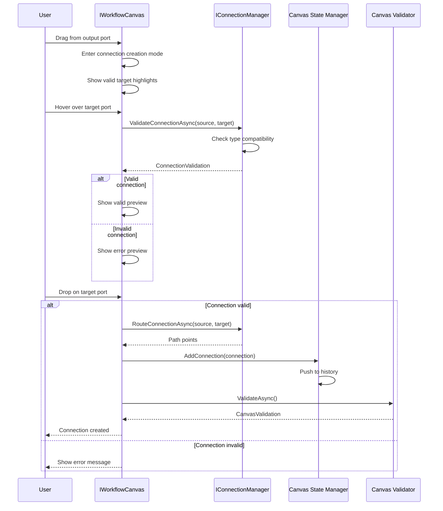

# LCS-SBD-v0.14.1-STU: Scope Overview — Visual Workflow Canvas

## Document Control

| Field            | Value                                                        |
| :--------------- | :----------------------------------------------------------- |
| **Document ID**  | LCS-SBD-v0.14.1-STU                                          |
| **Version**      | v0.14.1                                                      |
| **Codename**     | Visual Workflow Canvas (Agent Studio Phase 1)                |
| **Status**       | Draft                                                        |
| **Last Updated** | 2026-01-31                                                   |
| **Owner**        | Studio Architecture Lead                                     |
| **Depends On**   | v0.13.5-ORC (Workflow Designer), v0.13.1-ORC (Task Decomposition), v0.12.1-AGT (Agent Definition) |

---

## 1. Executive Summary

### 1.1 The Vision

**v0.14.1-STU** delivers **Visual Workflow Canvas** — the foundational visual programming environment that transforms users from orchestration consumers to orchestration composers. This establishes:

- A drag-and-drop canvas infrastructure for designing agent workflows visually
- A comprehensive node system representing agents, control flow, data operations, and integrations
- A connection manager for creating and validating data flow between nodes
- An extensive node library with built-in agent, control, data, integration, and utility nodes
- Real-time canvas validation ensuring workflows are correct before execution
- Intuitive canvas controls UI with zoom, pan, selection, and undo/redo operations

This is the cornerstone of the Agent Studio—without visual workflow design, users cannot compose complex orchestrations without code.

### 1.2 Business Value

- **Accessibility:** Non-technical users can design complex agent workflows visually.
- **Productivity:** Drag-and-drop design is faster than writing orchestration code.
- **Discoverability:** Node library makes available capabilities visible and explorable.
- **Validation:** Real-time feedback prevents invalid workflow configurations.
- **Iteration:** Visual editing enables rapid workflow prototyping and refinement.
- **Collaboration:** Visual workflows are easier to review, share, and discuss than code.

### 1.3 Success Criteria

1. Canvas renders 100+ nodes with 60fps performance (frame time <16ms).
2. All node operations (add, remove, move, duplicate) complete in <50ms.
3. Connection validation provides real-time feedback during drag operations.
4. Node library contains all built-in agent types and control flow elements.
5. Canvas export produces valid `WorkflowDefinition` compatible with v0.13.x orchestration.
6. Undo/redo supports 50+ operations with instant response.
7. Canvas validation catches 100% of structural errors before workflow export.

---

## 2. Key Deliverables

### 2.1 Sub-Parts

| Sub-Part | Title | Description | Est. Hours |
|:---------|:------|:------------|:-----------|
| v0.14.1e | Canvas Infrastructure | Core canvas rendering, viewport management, coordinate systems | 12 |
| v0.14.1f | Node System | Node representation, rendering, configuration, and state management | 10 |
| v0.14.1g | Connection Manager | Edge creation, validation, routing, and data flow visualization | 10 |
| v0.14.1h | Node Library | Built-in node definitions for agents, control, data, integrations | 8 |
| v0.14.1i | Canvas Validation | Real-time validation of workflow structure and connections | 8 |
| v0.14.1j | Canvas Controls UI | Toolbar, minimap, zoom controls, selection tools, undo/redo | 6 |
| **Total** | | | **54 hours** |

### 2.2 Core Interfaces

```csharp
/// <summary>
/// The visual workflow canvas for designing agent orchestrations.
/// Provides drag-and-drop editing of workflows with real-time validation.
/// </summary>
public interface IWorkflowCanvas
{
    /// <summary>
    /// Current state of the canvas (zoom, pan, selection, dirty flag).
    /// </summary>
    CanvasState State { get; }

    /// <summary>
    /// The workflow definition currently being edited.
    /// </summary>
    WorkflowDefinition CurrentWorkflow { get; }

    /// <summary>
    /// Add a new node to the canvas at the specified position.
    /// </summary>
    Task<CanvasNode> AddNodeAsync(
        NodeDefinition definition,
        CanvasPosition position,
        CancellationToken ct = default);

    /// <summary>
    /// Remove a node and all its connections from the canvas.
    /// </summary>
    Task RemoveNodeAsync(CanvasNodeId nodeId, CancellationToken ct = default);

    /// <summary>
    /// Move a node to a new position on the canvas.
    /// </summary>
    Task MoveNodeAsync(
        CanvasNodeId nodeId,
        CanvasPosition position,
        CancellationToken ct = default);

    /// <summary>
    /// Duplicate a node with a new ID at an offset position.
    /// </summary>
    Task<CanvasNode> DuplicateNodeAsync(
        CanvasNodeId nodeId,
        CancellationToken ct = default);

    /// <summary>
    /// Create a connection between two node ports.
    /// </summary>
    Task<CanvasConnection> ConnectAsync(
        ConnectionEndpoint source,
        ConnectionEndpoint target,
        CancellationToken ct = default);

    /// <summary>
    /// Remove a connection between nodes.
    /// </summary>
    Task DisconnectAsync(
        CanvasConnectionId connectionId,
        CancellationToken ct = default);

    /// <summary>
    /// Validate the current canvas state.
    /// </summary>
    Task<CanvasValidation> ValidateAsync(CancellationToken ct = default);

    /// <summary>
    /// Export the canvas to a WorkflowDefinition for execution.
    /// </summary>
    Task<WorkflowDefinition> ExportAsync(CancellationToken ct = default);

    /// <summary>
    /// Import a WorkflowDefinition into the canvas for editing.
    /// </summary>
    Task ImportAsync(
        WorkflowDefinition workflow,
        CancellationToken ct = default);

    /// <summary>
    /// Clear all nodes and connections from the canvas.
    /// </summary>
    Task ClearAsync(CancellationToken ct = default);

    /// <summary>
    /// Select specific nodes on the canvas.
    /// </summary>
    Task SelectAsync(
        IReadOnlyList<CanvasNodeId> nodeIds,
        CancellationToken ct = default);

    /// <summary>
    /// Select all nodes on the canvas.
    /// </summary>
    Task SelectAllAsync(CancellationToken ct = default);

    /// <summary>
    /// Clear the current selection.
    /// </summary>
    Task ClearSelectionAsync(CancellationToken ct = default);

    /// <summary>
    /// Set the canvas zoom level.
    /// </summary>
    Task ZoomAsync(float level, CancellationToken ct = default);

    /// <summary>
    /// Pan the canvas viewport by an offset.
    /// </summary>
    Task PanAsync(CanvasOffset offset, CancellationToken ct = default);

    /// <summary>
    /// Fit all nodes into the visible viewport.
    /// </summary>
    Task FitToViewAsync(CancellationToken ct = default);

    /// <summary>
    /// Undo the last operation.
    /// </summary>
    Task UndoAsync(CancellationToken ct = default);

    /// <summary>
    /// Redo the last undone operation.
    /// </summary>
    Task RedoAsync(CancellationToken ct = default);

    /// <summary>
    /// Observable stream of canvas events for real-time updates.
    /// </summary>
    IObservable<CanvasEvent> Events { get; }
}

/// <summary>
/// Current state of the workflow canvas.
/// </summary>
public record CanvasState
{
    /// <summary>
    /// Current zoom level (1.0 = 100%, range 0.1 to 3.0).
    /// </summary>
    public float Zoom { get; init; } = 1.0f;

    /// <summary>
    /// Current pan offset from origin.
    /// </summary>
    public CanvasOffset Pan { get; init; } = new(0, 0);

    /// <summary>
    /// Currently selected node IDs.
    /// </summary>
    public IReadOnlyList<CanvasNodeId> SelectedNodes { get; init; } = [];

    /// <summary>
    /// Whether the canvas has unsaved changes.
    /// </summary>
    public bool IsDirty { get; init; }

    /// <summary>
    /// Whether the current workflow is structurally valid.
    /// </summary>
    public bool IsValid { get; init; }

    /// <summary>
    /// Total number of nodes on the canvas.
    /// </summary>
    public int NodeCount { get; init; }

    /// <summary>
    /// Total number of connections on the canvas.
    /// </summary>
    public int ConnectionCount { get; init; }

    /// <summary>
    /// Whether undo is available.
    /// </summary>
    public bool CanUndo { get; init; }

    /// <summary>
    /// Whether redo is available.
    /// </summary>
    public bool CanRedo { get; init; }
}

/// <summary>
/// A node on the canvas representing a task or control flow element.
/// </summary>
public record CanvasNode
{
    /// <summary>
    /// Unique identifier for this node instance.
    /// </summary>
    public CanvasNodeId Id { get; init; }

    /// <summary>
    /// Definition of this node's type and behavior.
    /// </summary>
    public required NodeDefinition Definition { get; init; }

    /// <summary>
    /// Position of this node on the canvas.
    /// </summary>
    public CanvasPosition Position { get; init; }

    /// <summary>
    /// Size of this node (may vary by type).
    /// </summary>
    public CanvasSize Size { get; init; }

    /// <summary>
    /// Current visual state of the node.
    /// </summary>
    public NodeVisualState VisualState { get; init; }

    /// <summary>
    /// User-configured values for this node instance.
    /// </summary>
    public IReadOnlyDictionary<string, object> Configuration { get; init; } =
        new Dictionary<string, object>();

    /// <summary>
    /// Input ports for receiving data from other nodes.
    /// </summary>
    public IReadOnlyList<NodePort> Inputs { get; init; } = [];

    /// <summary>
    /// Output ports for sending data to other nodes.
    /// </summary>
    public IReadOnlyList<NodePort> Outputs { get; init; } = [];

    /// <summary>
    /// User-provided label for this node (overrides default).
    /// </summary>
    public string? Label { get; init; }

    /// <summary>
    /// User-provided description or notes.
    /// </summary>
    public string? Notes { get; init; }
}

/// <summary>
/// Strongly-typed identifier for a canvas node.
/// </summary>
public readonly record struct CanvasNodeId(Guid Value)
{
    public static CanvasNodeId New() => new(Guid.NewGuid());
    public static CanvasNodeId Parse(string s) => new(Guid.Parse(s));
    public override string ToString() => $"node:{Value:N}";
}

/// <summary>
/// Position on the canvas in logical coordinates.
/// </summary>
public record CanvasPosition(double X, double Y)
{
    public static CanvasPosition Zero => new(0, 0);

    public CanvasPosition Offset(double dx, double dy) => new(X + dx, Y + dy);
    public CanvasPosition Offset(CanvasOffset offset) => new(X + offset.X, Y + offset.Y);
}

/// <summary>
/// Size of an element on the canvas.
/// </summary>
public record CanvasSize(double Width, double Height)
{
    public static CanvasSize Default => new(200, 100);
}

/// <summary>
/// Offset for panning or relative positioning.
/// </summary>
public record CanvasOffset(double X, double Y)
{
    public static CanvasOffset Zero => new(0, 0);
}

/// <summary>
/// Visual state of a node on the canvas.
/// </summary>
public enum NodeVisualState
{
    /// <summary>Normal, unselected state.</summary>
    Normal,

    /// <summary>Node is currently selected.</summary>
    Selected,

    /// <summary>Node is highlighted (e.g., hover or search result).</summary>
    Highlighted,

    /// <summary>Node has validation errors.</summary>
    Error,

    /// <summary>Node is currently executing (live mode).</summary>
    Running,

    /// <summary>Node has completed execution (live mode).</summary>
    Completed,

    /// <summary>Node execution failed (live mode).</summary>
    Failed
}

/// <summary>
/// Definition of a node type available in the palette.
/// </summary>
public record NodeDefinition
{
    /// <summary>
    /// Unique type identifier (e.g., "agent.researcher", "control.if-else").
    /// </summary>
    public required string TypeId { get; init; }

    /// <summary>
    /// Human-readable name shown in the UI.
    /// </summary>
    public required string Name { get; init; }

    /// <summary>
    /// Detailed description of what this node does.
    /// </summary>
    public string? Description { get; init; }

    /// <summary>
    /// Category for grouping in the node library.
    /// </summary>
    public NodeCategory Category { get; init; }

    /// <summary>
    /// Path to the icon for this node type.
    /// </summary>
    public string? IconPath { get; init; }

    /// <summary>
    /// Color theme for this node (hex or named color).
    /// </summary>
    public string? Color { get; init; }

    /// <summary>
    /// Input port definitions.
    /// </summary>
    public IReadOnlyList<NodePortDefinition> InputPorts { get; init; } = [];

    /// <summary>
    /// Output port definitions.
    /// </summary>
    public IReadOnlyList<NodePortDefinition> OutputPorts { get; init; } = [];

    /// <summary>
    /// Configurable properties shown in the node inspector.
    /// </summary>
    public IReadOnlyList<NodeConfigProperty> ConfigProperties { get; init; } = [];

    /// <summary>
    /// Function to convert node configuration to a TaskNode for execution.
    /// </summary>
    public Func<NodeConfiguration, TaskNode>? ToTaskNode { get; init; }

    /// <summary>
    /// Minimum license tier required to use this node.
    /// </summary>
    public LicenseTier MinimumTier { get; init; } = LicenseTier.Core;
}

/// <summary>
/// Categories for grouping nodes in the library.
/// </summary>
public enum NodeCategory
{
    /// <summary>Agent invocation nodes (Researcher, Writer, Editor, etc.).</summary>
    Agent,

    /// <summary>Control flow nodes (If/Else, Switch, Loop, Parallel, etc.).</summary>
    Control,

    /// <summary>Data transformation nodes (Transform, Filter, Merge, etc.).</summary>
    Data,

    /// <summary>External integration nodes (Git, HTTP, CKVS, etc.).</summary>
    Integration,

    /// <summary>Utility nodes (Comment, Note, Log, Delay, etc.).</summary>
    Utility,

    /// <summary>User-defined custom nodes.</summary>
    Custom
}

/// <summary>
/// Definition of a node port (input or output).
/// </summary>
public record NodePortDefinition
{
    /// <summary>
    /// Unique identifier within the node.
    /// </summary>
    public required string Id { get; init; }

    /// <summary>
    /// Human-readable name shown in the UI.
    /// </summary>
    public required string Name { get; init; }

    /// <summary>
    /// Data type accepted/produced by this port.
    /// </summary>
    public required PortDataType DataType { get; init; }

    /// <summary>
    /// Whether a connection to this port is required.
    /// </summary>
    public bool Required { get; init; } = true;

    /// <summary>
    /// Whether multiple connections are allowed.
    /// </summary>
    public bool AllowMultiple { get; init; }

    /// <summary>
    /// Description of what this port expects/produces.
    /// </summary>
    public string? Description { get; init; }

    /// <summary>
    /// Default value if no connection is made.
    /// </summary>
    public object? DefaultValue { get; init; }
}

/// <summary>
/// Data types for node ports.
/// </summary>
public enum PortDataType
{
    /// <summary>Plain text or string data.</summary>
    Text,

    /// <summary>Structured document (markdown, HTML, etc.).</summary>
    Document,

    /// <summary>Entity reference from CKVS.</summary>
    Entity,

    /// <summary>List/array of items.</summary>
    List,

    /// <summary>Boolean true/false value.</summary>
    Boolean,

    /// <summary>Numeric value.</summary>
    Number,

    /// <summary>JSON object.</summary>
    Object,

    /// <summary>Any data type (flexible).</summary>
    Any,

    /// <summary>Custom user-defined type.</summary>
    Custom
}

/// <summary>
/// A configurable property on a node.
/// </summary>
public record NodeConfigProperty
{
    /// <summary>
    /// Property identifier.
    /// </summary>
    public required string Id { get; init; }

    /// <summary>
    /// Display name in the inspector.
    /// </summary>
    public required string Name { get; init; }

    /// <summary>
    /// Property data type.
    /// </summary>
    public required ConfigPropertyType Type { get; init; }

    /// <summary>
    /// Description or help text.
    /// </summary>
    public string? Description { get; init; }

    /// <summary>
    /// Default value.
    /// </summary>
    public object? DefaultValue { get; init; }

    /// <summary>
    /// Whether this property is required.
    /// </summary>
    public bool Required { get; init; }

    /// <summary>
    /// Validation constraints (e.g., min, max, pattern).
    /// </summary>
    public IReadOnlyDictionary<string, object>? Constraints { get; init; }

    /// <summary>
    /// Options for select/dropdown types.
    /// </summary>
    public IReadOnlyList<ConfigOption>? Options { get; init; }
}

/// <summary>
/// Types of configurable properties.
/// </summary>
public enum ConfigPropertyType
{
    String, Number, Boolean, Select, MultiSelect, TextArea, Code, File, Agent, Entity
}

/// <summary>
/// Option for select/dropdown properties.
/// </summary>
public record ConfigOption(string Value, string Label, string? Description = null);

/// <summary>
/// Runtime configuration for a node instance.
/// </summary>
public record NodeConfiguration
{
    /// <summary>
    /// The node definition.
    /// </summary>
    public required NodeDefinition Definition { get; init; }

    /// <summary>
    /// Configured property values.
    /// </summary>
    public required IReadOnlyDictionary<string, object> Properties { get; init; }

    /// <summary>
    /// Input connections from other nodes.
    /// </summary>
    public IReadOnlyList<PortConnection>? InputConnections { get; init; }
}

/// <summary>
/// A port on a node instance.
/// </summary>
public record NodePort
{
    /// <summary>
    /// Port definition.
    /// </summary>
    public required NodePortDefinition Definition { get; init; }

    /// <summary>
    /// Whether this port has at least one connection.
    /// </summary>
    public bool IsConnected { get; init; }

    /// <summary>
    /// Number of connections to this port.
    /// </summary>
    public int ConnectionCount { get; init; }
}

/// <summary>
/// A connection between two ports.
/// </summary>
public record PortConnection
{
    /// <summary>
    /// Source node ID.
    /// </summary>
    public required CanvasNodeId SourceNodeId { get; init; }

    /// <summary>
    /// Source port ID.
    /// </summary>
    public required string SourcePortId { get; init; }
}

/// <summary>
/// Library of available node types.
/// </summary>
public interface INodeLibrary
{
    /// <summary>
    /// Get all available node definitions.
    /// </summary>
    Task<IReadOnlyList<NodeDefinition>> GetAllAsync(CancellationToken ct = default);

    /// <summary>
    /// Get node definitions by category.
    /// </summary>
    Task<IReadOnlyList<NodeDefinition>> GetByCategoryAsync(
        NodeCategory category,
        CancellationToken ct = default);

    /// <summary>
    /// Get a specific node definition by type ID.
    /// </summary>
    Task<NodeDefinition?> GetByIdAsync(
        string typeId,
        CancellationToken ct = default);

    /// <summary>
    /// Search node definitions by name or description.
    /// </summary>
    Task<IReadOnlyList<NodeDefinition>> SearchAsync(
        string query,
        CancellationToken ct = default);

    /// <summary>
    /// Register a custom node definition.
    /// </summary>
    Task RegisterAsync(
        NodeDefinition definition,
        CancellationToken ct = default);

    /// <summary>
    /// Unregister a custom node definition.
    /// </summary>
    Task UnregisterAsync(
        string typeId,
        CancellationToken ct = default);

    /// <summary>
    /// Get node definitions available for the current license tier.
    /// </summary>
    Task<IReadOnlyList<NodeDefinition>> GetAvailableForTierAsync(
        LicenseTier tier,
        CancellationToken ct = default);
}

/// <summary>
/// Connection between nodes on the canvas.
/// </summary>
public record CanvasConnection
{
    /// <summary>
    /// Unique identifier for this connection.
    /// </summary>
    public CanvasConnectionId Id { get; init; }

    /// <summary>
    /// Source endpoint (node and port).
    /// </summary>
    public ConnectionEndpoint Source { get; init; }

    /// <summary>
    /// Target endpoint (node and port).
    /// </summary>
    public ConnectionEndpoint Target { get; init; }

    /// <summary>
    /// Current visual state.
    /// </summary>
    public ConnectionVisualState VisualState { get; init; }

    /// <summary>
    /// Path points for rendering (auto-routed).
    /// </summary>
    public IReadOnlyList<CanvasPosition>? PathPoints { get; init; }

    /// <summary>
    /// User-provided label for this connection.
    /// </summary>
    public string? Label { get; init; }
}

/// <summary>
/// Strongly-typed identifier for a canvas connection.
/// </summary>
public readonly record struct CanvasConnectionId(Guid Value)
{
    public static CanvasConnectionId New() => new(Guid.NewGuid());
    public override string ToString() => $"conn:{Value:N}";
}

/// <summary>
/// Endpoint of a connection (node + port).
/// </summary>
public record ConnectionEndpoint
{
    /// <summary>
    /// Node ID.
    /// </summary>
    public CanvasNodeId NodeId { get; init; }

    /// <summary>
    /// Port ID within the node.
    /// </summary>
    public string PortId { get; init; } = "";
}

/// <summary>
/// Visual state of a connection.
/// </summary>
public enum ConnectionVisualState
{
    /// <summary>Normal, inactive connection.</summary>
    Normal,

    /// <summary>Connection is highlighted (hover or selection).</summary>
    Highlighted,

    /// <summary>Connection has validation errors.</summary>
    Error,

    /// <summary>Data is actively flowing through this connection.</summary>
    DataFlowing,

    /// <summary>Connection is being created (drag in progress).</summary>
    Creating
}

/// <summary>
/// Manages connections between nodes with validation.
/// </summary>
public interface IConnectionManager
{
    /// <summary>
    /// Check if a connection between two endpoints is valid.
    /// </summary>
    Task<ConnectionValidation> ValidateConnectionAsync(
        ConnectionEndpoint source,
        ConnectionEndpoint target,
        CancellationToken ct = default);

    /// <summary>
    /// Get all valid target endpoints for a source endpoint.
    /// </summary>
    Task<IReadOnlyList<ConnectionEndpoint>> GetValidTargetsAsync(
        ConnectionEndpoint source,
        CancellationToken ct = default);

    /// <summary>
    /// Auto-route a connection path between two endpoints.
    /// </summary>
    Task<IReadOnlyList<CanvasPosition>> RouteConnectionAsync(
        ConnectionEndpoint source,
        ConnectionEndpoint target,
        CancellationToken ct = default);
}

/// <summary>
/// Result of connection validation.
/// </summary>
public record ConnectionValidation
{
    /// <summary>
    /// Whether the connection is valid.
    /// </summary>
    public bool IsValid { get; init; }

    /// <summary>
    /// Reason for invalidity (if not valid).
    /// </summary>
    public string? Reason { get; init; }

    /// <summary>
    /// Whether data type conversion is needed.
    /// </summary>
    public bool RequiresConversion { get; init; }

    /// <summary>
    /// Suggested conversion if needed.
    /// </summary>
    public string? SuggestedConversion { get; init; }
}

/// <summary>
/// Canvas validation result.
/// </summary>
public record CanvasValidation
{
    /// <summary>
    /// Whether the canvas represents a valid workflow.
    /// </summary>
    public bool IsValid { get; init; }

    /// <summary>
    /// Validation errors that must be fixed.
    /// </summary>
    public IReadOnlyList<CanvasValidationError> Errors { get; init; } = [];

    /// <summary>
    /// Validation warnings that should be reviewed.
    /// </summary>
    public IReadOnlyList<CanvasValidationWarning> Warnings { get; init; } = [];
}

/// <summary>
/// A validation error on the canvas.
/// </summary>
public record CanvasValidationError
{
    /// <summary>
    /// Node that has the error (null for canvas-level errors).
    /// </summary>
    public CanvasNodeId? NodeId { get; init; }

    /// <summary>
    /// Connection that has the error (null if node or canvas error).
    /// </summary>
    public CanvasConnectionId? ConnectionId { get; init; }

    /// <summary>
    /// Error code for programmatic handling.
    /// </summary>
    public required string Code { get; init; }

    /// <summary>
    /// Human-readable error message.
    /// </summary>
    public required string Message { get; init; }

    /// <summary>
    /// Suggested fix for the error.
    /// </summary>
    public string? Suggestion { get; init; }
}

/// <summary>
/// A validation warning on the canvas.
/// </summary>
public record CanvasValidationWarning
{
    /// <summary>
    /// Node that has the warning.
    /// </summary>
    public CanvasNodeId? NodeId { get; init; }

    /// <summary>
    /// Warning code.
    /// </summary>
    public required string Code { get; init; }

    /// <summary>
    /// Human-readable warning message.
    /// </summary>
    public required string Message { get; init; }
}

/// <summary>
/// Validation codes for canvas errors.
/// </summary>
public static class CanvasValidationCodes
{
    // Structure errors
    public const string NoStartNode = "CANVAS_NO_START";
    public const string NoEndNode = "CANVAS_NO_END";
    public const string DisconnectedNode = "CANVAS_DISCONNECTED_NODE";
    public const string CyclicDependency = "CANVAS_CYCLIC";
    public const string UnreachableNode = "CANVAS_UNREACHABLE";

    // Connection errors
    public const string InvalidConnection = "CONN_INVALID";
    public const string TypeMismatch = "CONN_TYPE_MISMATCH";
    public const string RequiredPortUnconnected = "CONN_REQUIRED_MISSING";
    public const string MultipleConnectionsNotAllowed = "CONN_MULTIPLE_NOT_ALLOWED";

    // Node errors
    public const string MissingConfiguration = "NODE_CONFIG_MISSING";
    public const string InvalidConfiguration = "NODE_CONFIG_INVALID";
    public const string AgentNotFound = "NODE_AGENT_NOT_FOUND";
    public const string InsufficientLicense = "NODE_LICENSE_REQUIRED";

    // Warnings
    public const string LongPath = "WARN_LONG_PATH";
    public const string ManyParallelBranches = "WARN_MANY_BRANCHES";
    public const string UnusedOutput = "WARN_UNUSED_OUTPUT";
}

/// <summary>
/// Events emitted by the canvas.
/// </summary>
public abstract record CanvasEvent
{
    /// <summary>
    /// Timestamp of the event.
    /// </summary>
    public DateTimeOffset Timestamp { get; init; } = DateTimeOffset.UtcNow;
}

public record NodeAddedEvent(CanvasNode Node) : CanvasEvent;
public record NodeRemovedEvent(CanvasNodeId NodeId) : CanvasEvent;
public record NodeMovedEvent(CanvasNodeId NodeId, CanvasPosition OldPosition, CanvasPosition NewPosition) : CanvasEvent;
public record NodeConfiguredEvent(CanvasNodeId NodeId, IReadOnlyDictionary<string, object> Configuration) : CanvasEvent;
public record ConnectionAddedEvent(CanvasConnection Connection) : CanvasEvent;
public record ConnectionRemovedEvent(CanvasConnectionId ConnectionId) : CanvasEvent;
public record SelectionChangedEvent(IReadOnlyList<CanvasNodeId> SelectedNodes) : CanvasEvent;
public record ValidationChangedEvent(CanvasValidation Validation) : CanvasEvent;
public record CanvasStateChangedEvent(CanvasState State) : CanvasEvent;
```

---

## 3. Architecture

### 3.1 Component Overview

```
┌─────────────────────────────────────────────────────────────────────────────┐
│                        Visual Workflow Canvas                                │
├─────────────────────────────────────────────────────────────────────────────┤
│                                                                              │
│  ┌─────────────────────────────────────────────────────────────────────┐   │
│  │                        IWorkflowCanvas                               │   │
│  │  ┌──────────────┐  ┌──────────────┐  ┌──────────────┐              │   │
│  │  │   Add/Remove │  │   Connect/   │  │   Validate/  │              │   │
│  │  │    Nodes     │  │  Disconnect  │  │    Export    │              │   │
│  │  └──────┬───────┘  └──────┬───────┘  └──────┬───────┘              │   │
│  │         │                 │                 │                       │   │
│  │         ▼                 ▼                 ▼                       │   │
│  │  ┌─────────────────────────────────────────────────────────────┐   │   │
│  │  │                    Canvas State Manager                      │   │   │
│  │  │  ┌───────────┐  ┌───────────┐  ┌───────────┐                │   │   │
│  │  │  │   Nodes   │  │Connections│  │  History   │                │   │   │
│  │  │  │   Store   │  │   Store   │  │   Stack    │                │   │   │
│  │  │  └───────────┘  └───────────┘  └───────────┘                │   │   │
│  │  └─────────────────────────────────────────────────────────────┘   │   │
│  └─────────────────────────────────────────────────────────────────────┘   │
│                                     │                                       │
│              ┌──────────────────────┼──────────────────────┐               │
│              ▼                      ▼                      ▼               │
│  ┌───────────────────┐  ┌───────────────────┐  ┌───────────────────────┐  │
│  │   INodeLibrary    │  │IConnectionManager │  │  Canvas Validator     │  │
│  │                   │  │                   │  │                       │  │
│  │ • Get nodes       │  │ • Validate conns  │  │ • Structure checks    │  │
│  │ • By category     │  │ • Auto-route      │  │ • Type checks         │  │
│  │ • Search          │  │ • Type compat.    │  │ • Cyclic detection    │  │
│  └───────────────────┘  └───────────────────┘  └───────────────────────┘  │
│                                                                              │
│  ┌─────────────────────────────────────────────────────────────────────┐   │
│  │                      Canvas Rendering Layer                          │   │
│  │  ┌─────────────────┐  ┌─────────────────┐  ┌─────────────────────┐  │   │
│  │  │  Node Renderer  │  │  Edge Renderer  │  │ Viewport Controller │  │   │
│  │  │  (Blazor.Diag)  │  │  (Bezier/Ortho) │  │  (Zoom/Pan/Select)  │  │   │
│  │  └─────────────────┘  └─────────────────┘  └─────────────────────┘  │   │
│  └─────────────────────────────────────────────────────────────────────┘   │
│                                                                              │
│  ┌─────────────────────────────────────────────────────────────────────┐   │
│  │                        Canvas Controls UI                            │   │
│  │  ┌──────────┐  ┌─────────┐  ┌──────────┐  ┌──────────┐  ┌────────┐ │   │
│  │  │ Toolbar  │  │ Minimap │  │  Zoom    │  │Selection │  │ Undo/  │ │   │
│  │  │          │  │         │  │ Controls │  │  Tools   │  │ Redo   │ │   │
│  │  └──────────┘  └─────────┘  └──────────┘  └──────────┘  └────────┘ │   │
│  └─────────────────────────────────────────────────────────────────────┘   │
│                                                                              │
└─────────────────────────────────────────────────────────────────────────────┘
```

### 3.2 Canvas Operation Flow



### 3.3 Connection Creation Flow



---

## 4. Data Model

### 4.1 Database Schema

```sql
-- Canvas workflows (in-progress designs)
CREATE TABLE canvas_workflows (
    id UUID PRIMARY KEY DEFAULT gen_random_uuid(),
    name VARCHAR(200) NOT NULL,
    description TEXT,
    owner_id UUID NOT NULL,
    canvas_state_json JSONB NOT NULL,
    workflow_definition_json JSONB,
    is_valid BOOLEAN NOT NULL DEFAULT FALSE,
    is_template BOOLEAN NOT NULL DEFAULT FALSE,
    created_at TIMESTAMPTZ NOT NULL DEFAULT NOW(),
    updated_at TIMESTAMPTZ NOT NULL DEFAULT NOW(),

    INDEX idx_canvas_workflows_owner ON canvas_workflows(owner_id),
    INDEX idx_canvas_workflows_template ON canvas_workflows(is_template) WHERE is_template = TRUE
);

-- Canvas nodes
CREATE TABLE canvas_nodes (
    id UUID PRIMARY KEY DEFAULT gen_random_uuid(),
    workflow_id UUID NOT NULL REFERENCES canvas_workflows(id) ON DELETE CASCADE,
    node_type_id VARCHAR(100) NOT NULL,
    position_x REAL NOT NULL,
    position_y REAL NOT NULL,
    width REAL NOT NULL DEFAULT 200,
    height REAL NOT NULL DEFAULT 100,
    label VARCHAR(200),
    notes TEXT,
    configuration_json JSONB,
    visual_state VARCHAR(50) NOT NULL DEFAULT 'Normal',

    INDEX idx_canvas_nodes_workflow ON canvas_nodes(workflow_id),
    INDEX idx_canvas_nodes_type ON canvas_nodes(node_type_id)
);

-- Canvas connections
CREATE TABLE canvas_connections (
    id UUID PRIMARY KEY DEFAULT gen_random_uuid(),
    workflow_id UUID NOT NULL REFERENCES canvas_workflows(id) ON DELETE CASCADE,
    source_node_id UUID NOT NULL REFERENCES canvas_nodes(id) ON DELETE CASCADE,
    source_port_id VARCHAR(100) NOT NULL,
    target_node_id UUID NOT NULL REFERENCES canvas_nodes(id) ON DELETE CASCADE,
    target_port_id VARCHAR(100) NOT NULL,
    label VARCHAR(200),
    path_points_json JSONB,

    UNIQUE(workflow_id, source_node_id, source_port_id, target_node_id, target_port_id),
    INDEX idx_canvas_connections_workflow ON canvas_connections(workflow_id),
    INDEX idx_canvas_connections_source ON canvas_connections(source_node_id),
    INDEX idx_canvas_connections_target ON canvas_connections(target_node_id)
);

-- Custom node definitions
CREATE TABLE custom_node_definitions (
    id UUID PRIMARY KEY DEFAULT gen_random_uuid(),
    owner_id UUID NOT NULL,
    type_id VARCHAR(100) NOT NULL,
    name VARCHAR(200) NOT NULL,
    description TEXT,
    category VARCHAR(50) NOT NULL,
    icon_path VARCHAR(500),
    color VARCHAR(50),
    definition_json JSONB NOT NULL,
    is_shared BOOLEAN NOT NULL DEFAULT FALSE,
    created_at TIMESTAMPTZ NOT NULL DEFAULT NOW(),

    UNIQUE(owner_id, type_id),
    INDEX idx_custom_nodes_owner ON custom_node_definitions(owner_id),
    INDEX idx_custom_nodes_shared ON custom_node_definitions(is_shared) WHERE is_shared = TRUE
);

-- Canvas history for undo/redo
CREATE TABLE canvas_history (
    id UUID PRIMARY KEY DEFAULT gen_random_uuid(),
    workflow_id UUID NOT NULL REFERENCES canvas_workflows(id) ON DELETE CASCADE,
    sequence_number INT NOT NULL,
    operation_type VARCHAR(50) NOT NULL,
    operation_data_json JSONB NOT NULL,
    created_at TIMESTAMPTZ NOT NULL DEFAULT NOW(),

    UNIQUE(workflow_id, sequence_number),
    INDEX idx_canvas_history_workflow ON canvas_history(workflow_id, sequence_number DESC)
);
```

### 4.2 Canvas State JSON Structure

```json
{
  "zoom": 1.0,
  "pan": { "x": 0, "y": 0 },
  "selectedNodes": ["node-uuid-1", "node-uuid-2"],
  "isDirty": true,
  "isValid": true,
  "nodes": [
    {
      "id": "node-uuid-1",
      "typeId": "agent.researcher",
      "position": { "x": 100, "y": 200 },
      "size": { "width": 200, "height": 100 },
      "label": "Research Competitors",
      "configuration": {
        "agentId": "researcher-default",
        "maxSources": 10,
        "includeUrls": true
      },
      "visualState": "Normal"
    },
    {
      "id": "node-uuid-2",
      "typeId": "agent.writer",
      "position": { "x": 400, "y": 200 },
      "size": { "width": 200, "height": 100 },
      "label": "Write Report",
      "configuration": {
        "agentId": "scribe-default",
        "outputFormat": "markdown"
      },
      "visualState": "Normal"
    }
  ],
  "connections": [
    {
      "id": "conn-uuid-1",
      "source": { "nodeId": "node-uuid-1", "portId": "output" },
      "target": { "nodeId": "node-uuid-2", "portId": "input" },
      "pathPoints": [
        { "x": 300, "y": 250 },
        { "x": 350, "y": 250 },
        { "x": 400, "y": 250 }
      ]
    }
  ]
}
```

---

## 5. Built-in Node Types

### 5.1 Agent Nodes

| Node | Type ID | Description | Inputs | Outputs |
|:-----|:--------|:------------|:-------|:--------|
| Researcher | `agent.researcher` | Gathers information from sources | Query (Text) | Research (Document) |
| Writer | `agent.writer` | Generates text content | Input (Document), Instructions (Text) | Output (Document) |
| Editor | `agent.editor` | Reviews and improves text | Draft (Document), Guidelines (Text) | Edited (Document) |
| Validator | `agent.validator` | Validates content against rules | Content (Document), Rules (Text) | Result (Object) |
| Translator | `agent.translator` | Translates between languages | Source (Text), TargetLang (Text) | Translated (Text) |
| Custom Agent | `agent.custom` | Invokes any registered agent | Input (Any) | Output (Any) |

### 5.2 Control Nodes

| Node | Type ID | Description | Inputs | Outputs |
|:-----|:--------|:------------|:-------|:--------|
| Start | `control.start` | Entry point of workflow | - | Trigger (Any) |
| End | `control.end` | Exit point of workflow | Result (Any) | - |
| If/Else | `control.if-else` | Conditional branching | Condition (Boolean), Input (Any) | True (Any), False (Any) |
| Switch | `control.switch` | Multi-way branching | Value (Any), Cases (List) | Case1...CaseN (Any), Default (Any) |
| Loop | `control.loop` | Iterate over items | Items (List), MaxIterations (Number) | Item (Any), Index (Number), Done (Boolean) |
| Parallel | `control.parallel` | Execute branches in parallel | Input (Any) | Branch1...BranchN (Any) |
| Join | `control.join` | Merge parallel branches | Branch1...BranchN (Any) | Combined (List) |
| Wait | `control.wait` | Delay execution | Duration (Number) | Trigger (Any) |

### 5.3 Data Nodes

| Node | Type ID | Description | Inputs | Outputs |
|:-----|:--------|:------------|:-------|:--------|
| Transform | `data.transform` | Apply transformation to data | Input (Any), Expression (Text) | Output (Any) |
| Filter | `data.filter` | Filter list items | Items (List), Predicate (Text) | Filtered (List) |
| Merge | `data.merge` | Combine multiple inputs | Input1...InputN (Any) | Merged (Any) |
| Split | `data.split` | Split data into parts | Input (Any), Delimiter (Text) | Parts (List) |
| Map | `data.map` | Apply function to each item | Items (List), Function (Text) | Mapped (List) |
| Aggregate | `data.aggregate` | Aggregate list to single value | Items (List), Aggregator (Text) | Result (Any) |

### 5.4 Integration Nodes

| Node | Type ID | Description | Inputs | Outputs |
|:-----|:--------|:------------|:-------|:--------|
| Git | `integration.git` | Git operations | Command (Text), Params (Object) | Result (Object) |
| CKVS Query | `integration.ckvs` | Query knowledge store | Query (Text), Filters (Object) | Results (List) |
| File Read | `integration.file-read` | Read file contents | Path (Text) | Content (Text) |
| File Write | `integration.file-write` | Write file contents | Path (Text), Content (Text) | Success (Boolean) |
| HTTP | `integration.http` | HTTP request | URL (Text), Method (Text), Body (Any) | Response (Object) |
| Webhook | `integration.webhook` | Receive webhook | - | Payload (Object) |

### 5.5 Utility Nodes

| Node | Type ID | Description | Inputs | Outputs |
|:-----|:--------|:------------|:-------|:--------|
| Comment | `utility.comment` | Documentation only | - | - |
| Note | `utility.note` | Sticky note | - | - |
| Log | `utility.log` | Log to console/audit | Message (Text), Level (Text) | - |
| Delay | `utility.delay` | Add time delay | Duration (Number) | Trigger (Any) |
| Variable | `utility.variable` | Store/retrieve variable | Name (Text), Value (Any) | Value (Any) |

---

## 6. Canvas Controls UI

### 6.1 Main Canvas Interface

```
┌────────────────────────────────────────────────────────────────────────────┐
│ Visual Workflow Designer: "Customer Analysis Pipeline"      [Save] [Run ▶] │
├────────────────────────────────────────────────────────────────────────────┤
│                                                                             │
│ ┌──────────────┐ ┌────────────────────────────────────────────────────────┐│
│ │ Node Library │ │                                                         ││
│ │              │ │                                                         ││
│ │ 🔍 Search... │ │                     ┌─────────────┐                    ││
│ │              │ │                     │   Start     │                    ││
│ │ ▼ Agents     │ │                     │  control    │                    ││
│ │  ├ Researcher│ │                     └──────┬──────┘                    ││
│ │  ├ Writer    │ │                            │                           ││
│ │  ├ Editor    │ │                            ▼                           ││
│ │  ├ Validator │ │                     ┌─────────────┐                    ││
│ │  └ Custom    │ │                     │ Researcher  │                    ││
│ │              │ │                     │  🔍 agent   │                    ││
│ │ ▼ Control    │ │                     │             │                    ││
│ │  ├ Start     │ │                     └──────┬──────┘                    ││
│ │  ├ End       │ │                            │                           ││
│ │  ├ If/Else   │ │              ┌─────────────┴─────────────┐             ││
│ │  ├ Loop      │ │              │                           │             ││
│ │  ├ Parallel  │ │              ▼                           ▼             ││
│ │  └ Join      │ │       ┌─────────────┐             ┌─────────────┐      ││
│ │              │ │       │   Writer    │             │  Validator  │      ││
│ │ ▼ Data       │ │       │  ✍️ agent   │             │   ✓ agent   │      ││
│ │  ├ Transform │ │       │             │             │             │      ││
│ │  ├ Filter    │ │       └──────┬──────┘             └──────┬──────┘      ││
│ │  └ Merge     │ │              │                           │             ││
│ │              │ │              └─────────────┬─────────────┘             ││
│ │ ▼ Integration│ │                            │                           ││
│ │  ├ Git       │ │                            ▼                           ││
│ │  ├ CKVS      │ │                     ┌─────────────┐                    ││
│ │  └ HTTP      │ │                     │    End      │                    ││
│ │              │ │                     │  control    │                    ││
│ └──────────────┘ │                     └─────────────┘                    ││
│                  │                                                         ││
│                  │ ┌──────┐ ┌───────────────────────────────────────────┐ ││
│                  │ │Minimap │ [−] 100% [+]  │ Undo │ Redo │ Fit │ Grid  │ ││
│                  │ │ ░░░░░ │ └───────────────────────────────────────────┘ ││
│                  │ │ ░░░░░ │                                               ││
│                  │ └──────┘                                               ││
│                  └────────────────────────────────────────────────────────┘│
│                                                                             │
│ ┌─ Node Inspector ─────────────────────────────────────────────────────────┐│
│ │ Researcher: "Customer Research"                                          ││
│ │                                                                          ││
│ │ Agent:     [researcher-default ▼]                                       ││
│ │ Query:     [Analyze customer feedback for product...]                   ││
│ │ Max Sources: [10    ]                                                   ││
│ │ Include URLs: [✓]                                                       ││
│ │                                                                          ││
│ │ Inputs:  query (Text) ← Start                                           ││
│ │ Outputs: research (Document) → Writer, Validator                        ││
│ └──────────────────────────────────────────────────────────────────────────┘│
│                                                                             │
│ Status: ✓ Valid workflow │ 6 nodes │ 7 connections │ Est. 45 min, 15k tokens│
└────────────────────────────────────────────────────────────────────────────┘
```

### 6.2 Keyboard Shortcuts

| Shortcut | Action |
|:---------|:-------|
| `Ctrl+Z` / `Cmd+Z` | Undo |
| `Ctrl+Y` / `Cmd+Shift+Z` | Redo |
| `Delete` / `Backspace` | Delete selected |
| `Ctrl+A` / `Cmd+A` | Select all |
| `Ctrl+D` / `Cmd+D` | Duplicate selected |
| `Ctrl+C` / `Cmd+C` | Copy selected |
| `Ctrl+V` / `Cmd+V` | Paste |
| `Ctrl+S` / `Cmd+S` | Save workflow |
| `Space` + drag | Pan canvas |
| `Scroll` | Zoom in/out |
| `F` | Fit to view |
| `G` | Toggle grid |
| `Escape` | Cancel operation / Clear selection |

---

## 7. Dependencies

| Component | Source | Usage |
|:----------|:-------|:------|
| `IWorkflowDesigner` | v0.13.5-ORC | WorkflowDefinition export format |
| `ITaskDecomposer` | v0.13.1-ORC | TaskNode, TaskGraph structures |
| `IAgentRegistry` | v0.12.1-AGT | Agent node definitions |
| `ILicenseService` | v0.2.1a | License tier checks for nodes |
| `ISettingsService` | v0.1.6a | User preferences for canvas |
| `IMediator` | v0.0.7a | Canvas events |
| `Blazor.Diagrams` | 3.x | Canvas rendering library |

---

## 8. License Gating

| Tier | Features |
|:-----|:---------|
| **Core** | View-only canvas; cannot edit or create workflows |
| **WriterPro** | Basic editing; 10 built-in node types; max 20 nodes per workflow |
| **Teams** | Full editing; all built-in nodes; max 100 nodes; workflow sharing |
| **Enterprise** | + Custom node definitions; unlimited nodes; export/import; API access |

---

## 9. Performance Targets

| Metric | Target | Measurement |
|:-------|:-------|:------------|
| Canvas render | <16ms | P95 frame time (60fps) |
| Node add/remove | <50ms | P95 operation time |
| Connection create | <30ms | P95 operation time |
| Validation | <100ms | P95 for 100-node canvas |
| Export to workflow | <200ms | P95 for 100-node canvas |
| Undo/redo | <20ms | P95 operation time |
| Search node library | <50ms | P95 for 100+ node types |

---

## 10. Testing Strategy

### 10.1 Unit Tests

- Node creation with all property types
- Connection validation (type compatibility, cycles)
- Canvas state management (undo/redo stack)
- WorkflowDefinition export correctness
- Validation rule coverage

### 10.2 Integration Tests

- Full canvas operation flow (create, connect, validate, export)
- Import existing WorkflowDefinition
- Concurrent canvas operations
- Database persistence and recovery
- License tier enforcement

### 10.3 Performance Tests

- 100+ nodes rendering at 60fps
- 200+ connections routing
- Rapid undo/redo (50+ operations)
- Large workflow export (<500ms)

### 10.4 UI Tests

- Drag-and-drop node creation
- Connection creation with mouse
- Zoom/pan/selection tools
- Keyboard shortcuts
- Mobile/touch responsiveness

---

## 11. Risks & Mitigations

| Risk | Impact | Mitigation |
|:-----|:-------|:-----------|
| Rendering performance with many nodes | Poor UX | Virtualized rendering; level-of-detail; culling |
| Complex connection routing | Visual clutter | Orthogonal routing; manual path adjustment |
| WorkflowDefinition compatibility | Export failures | Strict validation; version migration |
| Undo/redo memory usage | Memory exhaustion | Operation compression; history limits |
| Browser compatibility | Inconsistent behavior | Blazor WASM; polyfills; progressive enhancement |
| Touch device support | Limited mobile UX | Touch-optimized gestures; responsive layout |

---

## 12. MediatR Events

| Event | Description |
|:------|:------------|
| `CanvasNodeAddedEvent` | Node added to canvas |
| `CanvasNodeRemovedEvent` | Node removed from canvas |
| `CanvasNodeMovedEvent` | Node position changed |
| `CanvasConnectionAddedEvent` | Connection created |
| `CanvasConnectionRemovedEvent` | Connection removed |
| `CanvasValidationChangedEvent` | Validation state changed |
| `WorkflowExportedEvent` | Canvas exported to WorkflowDefinition |
| `WorkflowImportedEvent` | WorkflowDefinition imported to canvas |
| `CanvasSavedEvent` | Canvas saved to storage |

---

## Appendix A: Example Workflows

### Example 1: Simple Research Pipeline

```
Start → Researcher → Writer → Editor → End
```

4 nodes, 3 connections, linear flow.

### Example 2: Parallel Analysis

```
         ┌→ Analyzer A →┐
Start → ─┼→ Analyzer B →┼→ Merge → Report → End
         └→ Analyzer C →┘
```

7 nodes, 8 connections, parallel execution.

### Example 3: Conditional Processing

```
Start → Classifier → If/Else ─┬→ Path A → End
                               └→ Path B → End
```

6 nodes, 5 connections, conditional branching.

---

**Document End**
