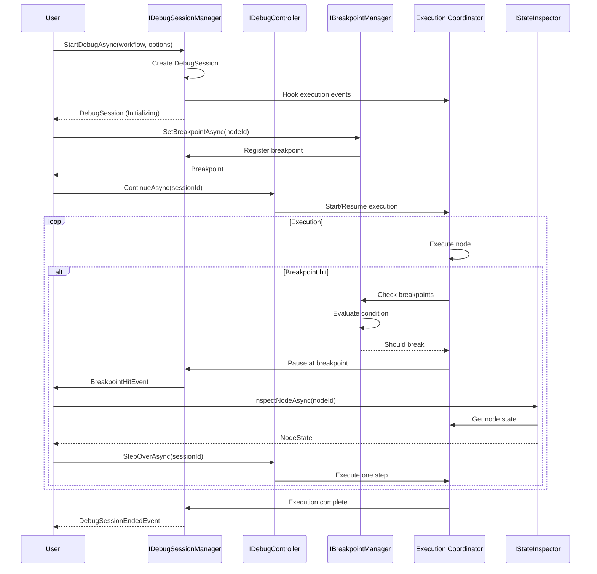
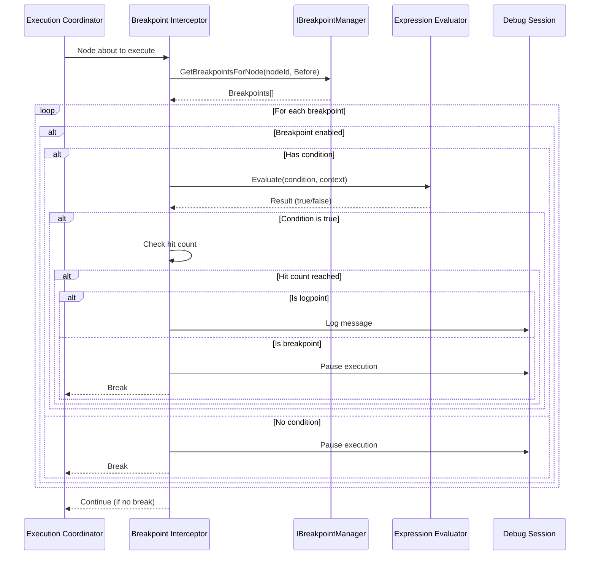

# LCS-SBD-v0.14.2-STU: Scope Overview — Agent Debugger

## Document Control

| Field            | Value                                                        |
| :--------------- | :----------------------------------------------------------- |
| **Document ID**  | LCS-SBD-v0.14.2-STU                                          |
| **Version**      | v0.14.2                                                      |
| **Codename**     | Agent Debugger (Agent Studio Phase 2)                        |
| **Status**       | Draft                                                        |
| **Last Updated** | 2026-01-31                                                   |
| **Owner**        | Studio Architecture Lead                                     |
| **Depends On**   | v0.14.1-STU (Visual Workflow Canvas), v0.13.3-ORC (Execution Coordinator), v0.12.2-AGT (Agent Lifecycle) |

---

## 1. Executive Summary

### 1.1 The Vision

**v0.14.2-STU** delivers **Agent Debugger** — a comprehensive debugging environment enabling step-by-step execution of agent workflows with breakpoints, state inspection, and execution control. This establishes:

- A debug session manager for starting, attaching to, and managing debug sessions
- A breakpoint system supporting conditional breakpoints, hit counts, and logpoints
- A state inspector for examining node inputs, outputs, variables, and agent state
- A step controller for step-over, step-into, step-out, and run-to-cursor operations
- A variable watch system for monitoring expressions across execution
- A debug console UI presenting execution state and controls

This is essential for workflow development—without debugging capabilities, users cannot diagnose and fix complex orchestration issues.

### 1.2 Business Value

- **Productivity:** Step-through debugging accelerates workflow development and troubleshooting.
- **Visibility:** State inspection reveals exactly what data flows between nodes.
- **Confidence:** Breakpoints allow controlled execution to verify behavior at key points.
- **Learning:** Watch expressions help users understand data transformations.
- **Quality:** Debugging catches logic errors before production deployment.
- **Support:** Debug sessions can be shared for collaborative troubleshooting.

### 1.3 Success Criteria

1. Debug sessions attach to running executions in <500ms.
2. Step operations (over/into/out) complete in <100ms.
3. Breakpoints trigger reliably with <50ms latency.
4. State inspector displays node state within <200ms of pause.
5. Watch expressions evaluate in <100ms.
6. Call stack displays accurate execution hierarchy.
7. Debug UI updates in real-time during execution.

---

## 2. Key Deliverables

### 2.1 Sub-Parts

| Sub-Part | Title | Description | Est. Hours |
|:---------|:------|:------------|:-----------|
| v0.14.2e | Debug Session Manager | Create, attach, detach, and manage debug sessions | 12 |
| v0.14.2f | Breakpoint System | Set, toggle, remove breakpoints with conditions and logpoints | 10 |
| v0.14.2g | State Inspector | Inspect node state, agent state, and variables at pause points | 10 |
| v0.14.2h | Step Controller | Step over, step into, step out, run to cursor, continue, pause | 10 |
| v0.14.2i | Variable Watch | Watch expressions, evaluate on demand, track changes | 8 |
| v0.14.2j | Debug Console UI | Integrated debug view with controls, state, and output | 6 |
| **Total** | | | **56 hours** |

### 2.2 Core Interfaces

```csharp
/// <summary>
/// Manages debug sessions for workflow execution.
/// Allows starting new debug sessions or attaching to running executions.
/// </summary>
public interface IDebugSessionManager
{
    /// <summary>
    /// Start a new debug session for a workflow.
    /// </summary>
    Task<DebugSession> StartDebugAsync(
        WorkflowDefinition workflow,
        DebugOptions options,
        CancellationToken ct = default);

    /// <summary>
    /// Attach debugger to an already-running execution.
    /// </summary>
    Task<DebugSession> AttachAsync(
        ExecutionId executionId,
        CancellationToken ct = default);

    /// <summary>
    /// Detach from a debug session without stopping execution.
    /// </summary>
    Task DetachAsync(
        DebugSessionId sessionId,
        CancellationToken ct = default);

    /// <summary>
    /// Get an existing debug session by ID.
    /// </summary>
    Task<DebugSession?> GetSessionAsync(
        DebugSessionId sessionId,
        CancellationToken ct = default);

    /// <summary>
    /// Get all active debug sessions for the current user.
    /// </summary>
    Task<IReadOnlyList<DebugSession>> GetActiveSessionsAsync(
        CancellationToken ct = default);

    /// <summary>
    /// Subscribe to debug session events.
    /// </summary>
    IObservable<DebugSessionEvent> Events { get; }
}

/// <summary>
/// Strongly-typed identifier for a debug session.
/// </summary>
public readonly record struct DebugSessionId(Guid Value)
{
    public static DebugSessionId New() => new(Guid.NewGuid());
    public static DebugSessionId Parse(string s) => new(Guid.Parse(s));
    public override string ToString() => $"debug:{Value:N}";
}

/// <summary>
/// A debug session tracking execution state and breakpoints.
/// </summary>
public record DebugSession
{
    /// <summary>
    /// Unique identifier for this session.
    /// </summary>
    public DebugSessionId Id { get; init; }

    /// <summary>
    /// The workflow being debugged.
    /// </summary>
    public WorkflowDefinition Workflow { get; init; } = null!;

    /// <summary>
    /// ID of the execution being debugged (null if not yet started).
    /// </summary>
    public ExecutionId? ExecutionId { get; init; }

    /// <summary>
    /// Current state of the debug session.
    /// </summary>
    public DebugSessionState State { get; init; }

    /// <summary>
    /// ID of the node where execution is currently paused.
    /// </summary>
    public CanvasNodeId? CurrentNodeId { get; init; }

    /// <summary>
    /// All breakpoints set in this session.
    /// </summary>
    public IReadOnlyList<Breakpoint> Breakpoints { get; init; } = [];

    /// <summary>
    /// All watch expressions in this session.
    /// </summary>
    public IReadOnlyList<WatchExpression> Watches { get; init; } = [];

    /// <summary>
    /// Current debug context with variables and state.
    /// </summary>
    public DebugContext Context { get; init; } = new();

    /// <summary>
    /// When the session was created.
    /// </summary>
    public DateTimeOffset CreatedAt { get; init; } = DateTimeOffset.UtcNow;

    /// <summary>
    /// When the session was last active.
    /// </summary>
    public DateTimeOffset LastActivityAt { get; init; } = DateTimeOffset.UtcNow;
}

/// <summary>
/// States of a debug session.
/// </summary>
public enum DebugSessionState
{
    /// <summary>Session is being initialized.</summary>
    Initializing,

    /// <summary>Execution is running (not paused).</summary>
    Running,

    /// <summary>Execution is paused by user request.</summary>
    Paused,

    /// <summary>Execution is paused at a breakpoint.</summary>
    AtBreakpoint,

    /// <summary>Stepping to next instruction.</summary>
    Stepping,

    /// <summary>Execution completed successfully.</summary>
    Completed,

    /// <summary>Execution terminated with an error.</summary>
    Error,

    /// <summary>Session was terminated by user.</summary>
    Terminated
}

/// <summary>
/// Options for starting a debug session.
/// </summary>
public record DebugOptions
{
    /// <summary>
    /// Whether to pause at the first node.
    /// </summary>
    public bool BreakAtStart { get; init; } = false;

    /// <summary>
    /// Whether to pause on unhandled exceptions.
    /// </summary>
    public bool BreakOnException { get; init; } = true;

    /// <summary>
    /// Whether to pause when an agent fails.
    /// </summary>
    public bool BreakOnAgentFailure { get; init; } = true;

    /// <summary>
    /// Initial input values for the workflow.
    /// </summary>
    public IReadOnlyDictionary<string, object>? InitialInputs { get; init; }

    /// <summary>
    /// Maximum execution time before automatic termination.
    /// </summary>
    public TimeSpan? Timeout { get; init; }

    /// <summary>
    /// Whether to record execution for replay.
    /// </summary>
    public bool RecordExecution { get; init; } = false;
}

/// <summary>
/// Controls execution flow during debugging.
/// </summary>
public interface IDebugController
{
    /// <summary>
    /// Continue execution until next breakpoint or completion.
    /// </summary>
    Task ContinueAsync(
        DebugSessionId sessionId,
        CancellationToken ct = default);

    /// <summary>
    /// Pause execution at current point.
    /// </summary>
    Task PauseAsync(
        DebugSessionId sessionId,
        CancellationToken ct = default);

    /// <summary>
    /// Execute current node and pause at the next node.
    /// </summary>
    Task StepOverAsync(
        DebugSessionId sessionId,
        CancellationToken ct = default);

    /// <summary>
    /// Step into the current node's internal execution (agent internals).
    /// </summary>
    Task StepIntoAsync(
        DebugSessionId sessionId,
        CancellationToken ct = default);

    /// <summary>
    /// Complete current node/agent and return to caller.
    /// </summary>
    Task StepOutAsync(
        DebugSessionId sessionId,
        CancellationToken ct = default);

    /// <summary>
    /// Run until execution reaches the specified node.
    /// </summary>
    Task RunToNodeAsync(
        DebugSessionId sessionId,
        CanvasNodeId targetNode,
        CancellationToken ct = default);

    /// <summary>
    /// Stop execution immediately and terminate the session.
    /// </summary>
    Task StopAsync(
        DebugSessionId sessionId,
        CancellationToken ct = default);

    /// <summary>
    /// Restart execution from the beginning.
    /// </summary>
    Task RestartAsync(
        DebugSessionId sessionId,
        CancellationToken ct = default);
}

/// <summary>
/// Manages breakpoints in debug sessions.
/// </summary>
public interface IBreakpointManager
{
    /// <summary>
    /// Set a breakpoint at a location.
    /// </summary>
    Task<Breakpoint> SetBreakpointAsync(
        DebugSessionId sessionId,
        BreakpointLocation location,
        BreakpointOptions? options = null,
        CancellationToken ct = default);

    /// <summary>
    /// Remove a breakpoint.
    /// </summary>
    Task RemoveBreakpointAsync(
        DebugSessionId sessionId,
        BreakpointId breakpointId,
        CancellationToken ct = default);

    /// <summary>
    /// Enable or disable a breakpoint.
    /// </summary>
    Task<Breakpoint> ToggleBreakpointAsync(
        DebugSessionId sessionId,
        BreakpointId breakpointId,
        CancellationToken ct = default);

    /// <summary>
    /// Update breakpoint options (condition, hit count, etc.).
    /// </summary>
    Task<Breakpoint> UpdateBreakpointAsync(
        DebugSessionId sessionId,
        BreakpointId breakpointId,
        BreakpointOptions options,
        CancellationToken ct = default);

    /// <summary>
    /// Remove all breakpoints from the session.
    /// </summary>
    Task ClearAllBreakpointsAsync(
        DebugSessionId sessionId,
        CancellationToken ct = default);

    /// <summary>
    /// Get all breakpoints in the session.
    /// </summary>
    Task<IReadOnlyList<Breakpoint>> GetBreakpointsAsync(
        DebugSessionId sessionId,
        CancellationToken ct = default);
}

/// <summary>
/// Strongly-typed identifier for a breakpoint.
/// </summary>
public readonly record struct BreakpointId(Guid Value)
{
    public static BreakpointId New() => new(Guid.NewGuid());
    public override string ToString() => $"bp:{Value:N}";
}

/// <summary>
/// A breakpoint in a debug session.
/// </summary>
public record Breakpoint
{
    /// <summary>
    /// Unique identifier.
    /// </summary>
    public BreakpointId Id { get; init; }

    /// <summary>
    /// Where the breakpoint is set.
    /// </summary>
    public BreakpointLocation Location { get; init; }

    /// <summary>
    /// Whether the breakpoint is currently enabled.
    /// </summary>
    public bool IsEnabled { get; init; } = true;

    /// <summary>
    /// Condition expression (break only when true).
    /// </summary>
    public string? Condition { get; init; }

    /// <summary>
    /// Break after this many hits (null = always).
    /// </summary>
    public int? HitCount { get; init; }

    /// <summary>
    /// Current hit count.
    /// </summary>
    public int CurrentHitCount { get; init; }

    /// <summary>
    /// Log message instead of breaking (logpoint).
    /// </summary>
    public string? LogMessage { get; init; }

    /// <summary>
    /// Whether this is a logpoint (log only, don't break).
    /// </summary>
    public bool IsLogpoint => LogMessage != null;
}

/// <summary>
/// Location where a breakpoint can be set.
/// </summary>
public record BreakpointLocation
{
    /// <summary>
    /// Node where the breakpoint is set.
    /// </summary>
    public CanvasNodeId NodeId { get; init; }

    /// <summary>
    /// When to trigger relative to node execution.
    /// </summary>
    public BreakpointPosition Position { get; init; } = BreakpointPosition.Before;
}

/// <summary>
/// When to trigger a breakpoint relative to node execution.
/// </summary>
public enum BreakpointPosition
{
    /// <summary>Break before the node executes.</summary>
    Before,

    /// <summary>Break after the node completes successfully.</summary>
    After,

    /// <summary>Break when the node fails with an error.</summary>
    OnError
}

/// <summary>
/// Options for a breakpoint.
/// </summary>
public record BreakpointOptions
{
    /// <summary>
    /// Condition expression (JavaScript-like syntax).
    /// </summary>
    public string? Condition { get; init; }

    /// <summary>
    /// Number of hits before breaking.
    /// </summary>
    public int? HitCount { get; init; }

    /// <summary>
    /// Log message (makes this a logpoint).
    /// </summary>
    public string? LogMessage { get; init; }
}

/// <summary>
/// Inspects state during debugging.
/// </summary>
public interface IStateInspector
{
    /// <summary>
    /// Inspect the state of a specific node.
    /// </summary>
    Task<NodeState> InspectNodeAsync(
        DebugSessionId sessionId,
        CanvasNodeId nodeId,
        CancellationToken ct = default);

    /// <summary>
    /// Inspect the state of an agent.
    /// </summary>
    Task<AgentDebugState> InspectAgentAsync(
        DebugSessionId sessionId,
        AgentId agentId,
        CancellationToken ct = default);

    /// <summary>
    /// Get variables at a specific scope.
    /// </summary>
    Task<IReadOnlyDictionary<string, VariableValue>> GetVariablesAsync(
        DebugSessionId sessionId,
        VariableScope scope,
        CancellationToken ct = default);

    /// <summary>
    /// Evaluate an expression in the current context.
    /// </summary>
    Task<EvaluationResult> EvaluateExpressionAsync(
        DebugSessionId sessionId,
        string expression,
        CancellationToken ct = default);

    /// <summary>
    /// Get the current call stack.
    /// </summary>
    Task<CallStack> GetCallStackAsync(
        DebugSessionId sessionId,
        CancellationToken ct = default);
}

/// <summary>
/// State of a node during debugging.
/// </summary>
public record NodeState
{
    /// <summary>
    /// Node identifier.
    /// </summary>
    public CanvasNodeId NodeId { get; init; }

    /// <summary>
    /// Node name for display.
    /// </summary>
    public string NodeName { get; init; } = "";

    /// <summary>
    /// Current execution state.
    /// </summary>
    public NodeExecutionState ExecutionState { get; init; }

    /// <summary>
    /// Input values received by the node.
    /// </summary>
    public IReadOnlyDictionary<string, VariableValue> Inputs { get; init; } =
        new Dictionary<string, VariableValue>();

    /// <summary>
    /// Output values produced by the node (if completed).
    /// </summary>
    public IReadOnlyDictionary<string, VariableValue>? Outputs { get; init; }

    /// <summary>
    /// Local variables within the node.
    /// </summary>
    public IReadOnlyDictionary<string, VariableValue> LocalVariables { get; init; } =
        new Dictionary<string, VariableValue>();

    /// <summary>
    /// When the node started executing.
    /// </summary>
    public DateTimeOffset? StartedAt { get; init; }

    /// <summary>
    /// How long the node has been executing.
    /// </summary>
    public TimeSpan? Duration { get; init; }

    /// <summary>
    /// Error message if the node failed.
    /// </summary>
    public string? ErrorMessage { get; init; }

    /// <summary>
    /// Stack trace if the node failed.
    /// </summary>
    public string? ErrorStackTrace { get; init; }
}

/// <summary>
/// Execution state of a node.
/// </summary>
public enum NodeExecutionState
{
    /// <summary>Node has not yet executed.</summary>
    Pending,

    /// <summary>Node is waiting for inputs.</summary>
    WaitingForInputs,

    /// <summary>Node is currently executing.</summary>
    Executing,

    /// <summary>Node is paused at breakpoint.</summary>
    Paused,

    /// <summary>Node completed successfully.</summary>
    Completed,

    /// <summary>Node failed with an error.</summary>
    Failed,

    /// <summary>Node was skipped (conditional).</summary>
    Skipped
}

/// <summary>
/// Debug state of an agent.
/// </summary>
public record AgentDebugState
{
    /// <summary>
    /// Agent identifier.
    /// </summary>
    public AgentId AgentId { get; init; }

    /// <summary>
    /// Agent manifest name.
    /// </summary>
    public string AgentName { get; init; } = "";

    /// <summary>
    /// Current agent operational state.
    /// </summary>
    public AgentState State { get; init; }

    /// <summary>
    /// Current request being processed.
    /// </summary>
    public AgentRequest? CurrentRequest { get; init; }

    /// <summary>
    /// Working memory contents.
    /// </summary>
    public IReadOnlyDictionary<string, VariableValue>? WorkingMemory { get; init; }

    /// <summary>
    /// Messages in agent conversation history.
    /// </summary>
    public IReadOnlyList<AgentMessage>? ConversationHistory { get; init; }

    /// <summary>
    /// Tokens consumed by this agent.
    /// </summary>
    public int TokensConsumed { get; init; }

    /// <summary>
    /// Time spent executing.
    /// </summary>
    public TimeSpan ExecutionTime { get; init; }
}

/// <summary>
/// A message in agent conversation history.
/// </summary>
public record AgentMessage
{
    /// <summary>
    /// Message role (system, user, assistant).
    /// </summary>
    public required string Role { get; init; }

    /// <summary>
    /// Message content.
    /// </summary>
    public required string Content { get; init; }

    /// <summary>
    /// When the message was sent.
    /// </summary>
    public DateTimeOffset Timestamp { get; init; }
}

/// <summary>
/// A variable value with type information.
/// </summary>
public record VariableValue
{
    /// <summary>
    /// Variable name.
    /// </summary>
    public required string Name { get; init; }

    /// <summary>
    /// Variable value (may be null).
    /// </summary>
    public object? Value { get; init; }

    /// <summary>
    /// Type name for display.
    /// </summary>
    public required string TypeName { get; init; }

    /// <summary>
    /// Whether the value is expandable (object/array).
    /// </summary>
    public bool IsExpandable { get; init; }

    /// <summary>
    /// Child values for expandable types.
    /// </summary>
    public IReadOnlyList<VariableValue>? Children { get; init; }

    /// <summary>
    /// String representation for display.
    /// </summary>
    public string? DisplayValue { get; init; }

    /// <summary>
    /// Whether this value changed since last inspection.
    /// </summary>
    public bool HasChanged { get; init; }
}

/// <summary>
/// Scope for variable inspection.
/// </summary>
public enum VariableScope
{
    /// <summary>Variables local to current node.</summary>
    Local,

    /// <summary>Variables from parent/calling context.</summary>
    Parent,

    /// <summary>Global workflow variables.</summary>
    Global,

    /// <summary>All scopes combined.</summary>
    All
}

/// <summary>
/// Result of expression evaluation.
/// </summary>
public record EvaluationResult
{
    /// <summary>
    /// The expression that was evaluated.
    /// </summary>
    public required string Expression { get; init; }

    /// <summary>
    /// Whether evaluation succeeded.
    /// </summary>
    public bool Success { get; init; }

    /// <summary>
    /// Evaluated value (if successful).
    /// </summary>
    public VariableValue? Value { get; init; }

    /// <summary>
    /// Error message (if failed).
    /// </summary>
    public string? Error { get; init; }
}

/// <summary>
/// Call stack showing execution hierarchy.
/// </summary>
public record CallStack
{
    /// <summary>
    /// Stack frames from current to root.
    /// </summary>
    public IReadOnlyList<StackFrame> Frames { get; init; } = [];

    /// <summary>
    /// Total depth of the stack.
    /// </summary>
    public int Depth => Frames.Count;
}

/// <summary>
/// A frame in the call stack.
/// </summary>
public record StackFrame
{
    /// <summary>
    /// Depth in the stack (0 = current).
    /// </summary>
    public int Depth { get; init; }

    /// <summary>
    /// Node at this frame.
    /// </summary>
    public CanvasNodeId NodeId { get; init; }

    /// <summary>
    /// Node name for display.
    /// </summary>
    public string NodeName { get; init; } = "";

    /// <summary>
    /// Agent executing this frame (if any).
    /// </summary>
    public AgentId? AgentId { get; init; }

    /// <summary>
    /// Agent name for display.
    /// </summary>
    public string? AgentName { get; init; }

    /// <summary>
    /// When this frame was entered.
    /// </summary>
    public DateTimeOffset EnteredAt { get; init; }

    /// <summary>
    /// Source location for display.
    /// </summary>
    public string? SourceLocation { get; init; }
}

/// <summary>
/// Watches expressions and variables across execution.
/// </summary>
public interface IVariableWatch
{
    /// <summary>
    /// Add a watch expression.
    /// </summary>
    Task<WatchId> AddWatchAsync(
        DebugSessionId sessionId,
        string expression,
        CancellationToken ct = default);

    /// <summary>
    /// Remove a watch expression.
    /// </summary>
    Task RemoveWatchAsync(
        DebugSessionId sessionId,
        WatchId watchId,
        CancellationToken ct = default);

    /// <summary>
    /// Evaluate all watch expressions.
    /// </summary>
    Task<IReadOnlyList<WatchResult>> EvaluateWatchesAsync(
        DebugSessionId sessionId,
        CancellationToken ct = default);

    /// <summary>
    /// Get all watch expressions in the session.
    /// </summary>
    Task<IReadOnlyList<WatchExpression>> GetWatchesAsync(
        DebugSessionId sessionId,
        CancellationToken ct = default);
}

/// <summary>
/// Strongly-typed identifier for a watch expression.
/// </summary>
public readonly record struct WatchId(Guid Value)
{
    public static WatchId New() => new(Guid.NewGuid());
    public override string ToString() => $"watch:{Value:N}";
}

/// <summary>
/// A watch expression in a debug session.
/// </summary>
public record WatchExpression
{
    /// <summary>
    /// Unique identifier.
    /// </summary>
    public WatchId Id { get; init; }

    /// <summary>
    /// Expression to evaluate.
    /// </summary>
    public required string Expression { get; init; }
}

/// <summary>
/// Result of evaluating a watch expression.
/// </summary>
public record WatchResult
{
    /// <summary>
    /// Watch identifier.
    /// </summary>
    public WatchId Id { get; init; }

    /// <summary>
    /// Expression that was evaluated.
    /// </summary>
    public string Expression { get; init; } = "";

    /// <summary>
    /// Evaluated value (if successful).
    /// </summary>
    public VariableValue? Value { get; init; }

    /// <summary>
    /// Error message (if evaluation failed).
    /// </summary>
    public string? Error { get; init; }

    /// <summary>
    /// Whether the value changed since last evaluation.
    /// </summary>
    public bool HasChanged { get; init; }
}

/// <summary>
/// Debug context containing current execution state.
/// </summary>
public record DebugContext
{
    /// <summary>
    /// Current node being debugged.
    /// </summary>
    public CanvasNodeId? CurrentNodeId { get; init; }

    /// <summary>
    /// Current agent being debugged.
    /// </summary>
    public AgentId? CurrentAgentId { get; init; }

    /// <summary>
    /// Global workflow variables.
    /// </summary>
    public IReadOnlyDictionary<string, VariableValue> GlobalVariables { get; init; } =
        new Dictionary<string, VariableValue>();

    /// <summary>
    /// Execution progress (0.0 - 1.0).
    /// </summary>
    public float Progress { get; init; }

    /// <summary>
    /// Total tokens consumed.
    /// </summary>
    public int TotalTokensConsumed { get; init; }

    /// <summary>
    /// Total execution time.
    /// </summary>
    public TimeSpan TotalExecutionTime { get; init; }
}

/// <summary>
/// Events emitted by the debug session.
/// </summary>
public abstract record DebugSessionEvent
{
    public DebugSessionId SessionId { get; init; }
    public DateTimeOffset Timestamp { get; init; } = DateTimeOffset.UtcNow;
}

public record DebugSessionStartedEvent(DebugSessionId SessionId) : DebugSessionEvent;
public record DebugSessionEndedEvent(DebugSessionId SessionId, DebugSessionState FinalState) : DebugSessionEvent;
public record BreakpointHitEvent(DebugSessionId SessionId, BreakpointId BreakpointId, CanvasNodeId NodeId) : DebugSessionEvent;
public record ExecutionPausedEvent(DebugSessionId SessionId, CanvasNodeId? NodeId, string Reason) : DebugSessionEvent;
public record ExecutionResumedEvent(DebugSessionId SessionId) : DebugSessionEvent;
public record StepCompletedEvent(DebugSessionId SessionId, CanvasNodeId FromNode, CanvasNodeId ToNode) : DebugSessionEvent;
public record NodeStateChangedEvent(DebugSessionId SessionId, CanvasNodeId NodeId, NodeExecutionState NewState) : DebugSessionEvent;
public record LogpointTriggeredEvent(DebugSessionId SessionId, BreakpointId BreakpointId, string Message) : DebugSessionEvent;
```

---

## 3. Architecture

### 3.1 Component Overview

```
┌─────────────────────────────────────────────────────────────────────────────┐
│                           Agent Debugger                                      │
├─────────────────────────────────────────────────────────────────────────────┤
│                                                                              │
│  ┌─────────────────────────────────────────────────────────────────────┐   │
│  │                    IDebugSessionManager                              │   │
│  │  ┌──────────────┐  ┌──────────────┐  ┌──────────────┐              │   │
│  │  │  Start/Attach│  │    Manage    │  │   Detach/    │              │   │
│  │  │   Session    │  │   Sessions   │  │    Stop      │              │   │
│  │  └──────┬───────┘  └──────┬───────┘  └──────┬───────┘              │   │
│  │         │                 │                 │                       │   │
│  │         ▼                 ▼                 ▼                       │   │
│  │  ┌─────────────────────────────────────────────────────────────┐   │   │
│  │  │                    Debug Session Store                       │   │   │
│  │  │  ┌───────────┐  ┌───────────┐  ┌───────────┐                │   │   │
│  │  │  │ Session 1 │  │ Session 2 │  │ Session N │                │   │   │
│  │  │  │ Breakpts  │  │ Breakpts  │  │ Breakpts  │                │   │   │
│  │  │  │ Watches   │  │ Watches   │  │ Watches   │                │   │   │
│  │  │  └───────────┘  └───────────┘  └───────────┘                │   │   │
│  │  └─────────────────────────────────────────────────────────────┘   │   │
│  └─────────────────────────────────────────────────────────────────────┘   │
│                                     │                                       │
│              ┌──────────────────────┼──────────────────────┐               │
│              ▼                      ▼                      ▼               │
│  ┌───────────────────┐  ┌───────────────────┐  ┌───────────────────────┐  │
│  │IBreakpointManager │  │  IDebugController │  │   IStateInspector     │  │
│  │                   │  │                   │  │                       │  │
│  │ • Set breakpoints │  │ • Continue/Pause  │  │ • Node state          │  │
│  │ • Conditions      │  │ • Step over/into  │  │ • Agent state         │  │
│  │ • Logpoints       │  │ • Run to cursor   │  │ • Variables           │  │
│  └───────────────────┘  └───────────────────┘  └───────────────────────┘  │
│              │                      │                      │               │
│              └──────────────────────┼──────────────────────┘               │
│                                     ▼                                       │
│  ┌─────────────────────────────────────────────────────────────────────┐   │
│  │                  Execution Coordinator Integration                    │   │
│  │  ┌─────────────────┐  ┌─────────────────┐  ┌─────────────────────┐  │   │
│  │  │   Breakpoint    │  │    Execution    │  │    State           │  │   │
│  │  │   Interceptor   │  │    Controller   │  │    Collector        │  │   │
│  │  └─────────────────┘  └─────────────────┘  └─────────────────────┘  │   │
│  └─────────────────────────────────────────────────────────────────────┘   │
│                                     │                                       │
│                                     ▼                                       │
│  ┌─────────────────────────────────────────────────────────────────────┐   │
│  │                      Debug Console UI                                │   │
│  │  ┌──────────┐  ┌─────────┐  ┌──────────┐  ┌─────────┐  ┌─────────┐ │   │
│  │  │ Controls │  │Breakpts │  │Call Stack│  │ Watch   │  │ Console │ │   │
│  │  │ Toolbar  │  │  Panel  │  │  Panel   │  │  Panel  │  │  Output │ │   │
│  │  └──────────┘  └─────────┘  └──────────┘  └─────────┘  └─────────┘ │   │
│  └─────────────────────────────────────────────────────────────────────┘   │
│                                                                              │
└─────────────────────────────────────────────────────────────────────────────┘
```

### 3.2 Debug Session Flow



### 3.3 Breakpoint Evaluation Flow



---

## 4. Data Model

### 4.1 Database Schema

```sql
-- Debug sessions
CREATE TABLE debug_sessions (
    id UUID PRIMARY KEY DEFAULT gen_random_uuid(),
    owner_id UUID NOT NULL,
    workflow_id UUID NOT NULL,
    execution_id UUID,
    state VARCHAR(50) NOT NULL DEFAULT 'Initializing',
    current_node_id UUID,
    options_json JSONB NOT NULL,
    context_json JSONB NOT NULL DEFAULT '{}',
    created_at TIMESTAMPTZ NOT NULL DEFAULT NOW(),
    last_activity_at TIMESTAMPTZ NOT NULL DEFAULT NOW(),
    ended_at TIMESTAMPTZ,

    INDEX idx_debug_sessions_owner ON debug_sessions(owner_id),
    INDEX idx_debug_sessions_state ON debug_sessions(state) WHERE state NOT IN ('Completed', 'Terminated', 'Error'),
    INDEX idx_debug_sessions_execution ON debug_sessions(execution_id)
);

-- Breakpoints
CREATE TABLE debug_breakpoints (
    id UUID PRIMARY KEY DEFAULT gen_random_uuid(),
    session_id UUID NOT NULL REFERENCES debug_sessions(id) ON DELETE CASCADE,
    node_id UUID NOT NULL,
    position VARCHAR(20) NOT NULL DEFAULT 'Before',
    is_enabled BOOLEAN NOT NULL DEFAULT TRUE,
    condition_expression TEXT,
    hit_count_target INT,
    hit_count_current INT NOT NULL DEFAULT 0,
    log_message TEXT,
    created_at TIMESTAMPTZ NOT NULL DEFAULT NOW(),

    INDEX idx_debug_breakpoints_session ON debug_breakpoints(session_id),
    INDEX idx_debug_breakpoints_node ON debug_breakpoints(node_id)
);

-- Watch expressions
CREATE TABLE debug_watches (
    id UUID PRIMARY KEY DEFAULT gen_random_uuid(),
    session_id UUID NOT NULL REFERENCES debug_sessions(id) ON DELETE CASCADE,
    expression TEXT NOT NULL,
    last_value_json JSONB,
    last_evaluated_at TIMESTAMPTZ,
    created_at TIMESTAMPTZ NOT NULL DEFAULT NOW(),

    INDEX idx_debug_watches_session ON debug_watches(session_id)
);

-- Debug logs/output
CREATE TABLE debug_logs (
    id UUID PRIMARY KEY DEFAULT gen_random_uuid(),
    session_id UUID NOT NULL REFERENCES debug_sessions(id) ON DELETE CASCADE,
    timestamp TIMESTAMPTZ NOT NULL DEFAULT NOW(),
    level VARCHAR(20) NOT NULL,
    source VARCHAR(100),
    message TEXT NOT NULL,
    node_id UUID,
    agent_id UUID,
    context_json JSONB,

    INDEX idx_debug_logs_session ON debug_logs(session_id, timestamp DESC)
);

-- Debug history for step tracking
CREATE TABLE debug_step_history (
    id UUID PRIMARY KEY DEFAULT gen_random_uuid(),
    session_id UUID NOT NULL REFERENCES debug_sessions(id) ON DELETE CASCADE,
    sequence_number INT NOT NULL,
    step_type VARCHAR(50) NOT NULL,
    from_node_id UUID,
    to_node_id UUID,
    timestamp TIMESTAMPTZ NOT NULL DEFAULT NOW(),
    state_snapshot_json JSONB,

    UNIQUE(session_id, sequence_number),
    INDEX idx_debug_history_session ON debug_step_history(session_id, sequence_number DESC)
);
```

### 4.2 Debug Session JSON Structure

```json
{
  "id": "debug-session-uuid",
  "workflowId": "workflow-uuid",
  "executionId": "execution-uuid",
  "state": "AtBreakpoint",
  "currentNodeId": "node-uuid-3",
  "breakpoints": [
    {
      "id": "bp-uuid-1",
      "nodeId": "node-uuid-2",
      "position": "Before",
      "isEnabled": true,
      "condition": "inputs.count > 10",
      "hitCount": null,
      "currentHitCount": 3,
      "logMessage": null
    },
    {
      "id": "bp-uuid-2",
      "nodeId": "node-uuid-5",
      "position": "After",
      "isEnabled": true,
      "condition": null,
      "hitCount": 5,
      "currentHitCount": 2,
      "logMessage": null
    }
  ],
  "watches": [
    {
      "id": "watch-uuid-1",
      "expression": "currentDocument.wordCount"
    },
    {
      "id": "watch-uuid-2",
      "expression": "researchResults.length"
    }
  ],
  "context": {
    "currentNodeId": "node-uuid-3",
    "currentAgentId": "agent-uuid-1",
    "globalVariables": {
      "inputQuery": { "name": "inputQuery", "value": "competitor analysis", "typeName": "String" }
    },
    "progress": 0.45,
    "totalTokensConsumed": 8500,
    "totalExecutionTime": "PT2M30S"
  },
  "createdAt": "2026-01-31T14:00:00Z",
  "lastActivityAt": "2026-01-31T14:02:30Z"
}
```

---

## 5. Debug Features

### 5.1 Step Operations

| Operation | Keyboard | Description |
|:----------|:---------|:------------|
| Continue | `F5` | Run until next breakpoint or completion |
| Pause | `F6` | Pause execution at current point |
| Step Over | `F10` | Execute current node, pause at next |
| Step Into | `F11` | Step into agent's internal execution |
| Step Out | `Shift+F11` | Complete current agent, return to caller |
| Run to Cursor | `Ctrl+F10` | Run until selected node |
| Restart | `Ctrl+Shift+F5` | Restart execution from beginning |
| Stop | `Shift+F5` | Stop execution and end session |

### 5.2 Breakpoint Types

| Type | Description | Use Case |
|:-----|:------------|:---------|
| Unconditional | Always breaks | Simple debugging |
| Conditional | Breaks when expression is true | Complex logic debugging |
| Hit Count | Breaks after N hits | Loop debugging |
| Logpoint | Logs message, doesn't break | Non-intrusive logging |

### 5.3 Expression Syntax

```javascript
// Variable access
inputs.query
outputs.result
globals.apiKey

// Object properties
document.metadata.author
agent.state

// Array access
results[0]
results.length

// Comparisons
inputs.count > 10
outputs.status == "success"

// Logical operators
inputs.a && inputs.b
!isValid || hasErrors

// String operations
query.contains("search")
name.startsWith("test")
```

---

## 6. Debug Console UI

### 6.1 Main Debug Interface

```
┌────────────────────────────────────────────────────────────────────────────┐
│ Debug: "Customer Analysis Pipeline"                        [Detach] [Stop] │
├────────────────────────────────────────────────────────────────────────────┤
│ [▶ Continue] [⏸ Pause] [↷ Step Over] [↓ Step Into] [↑ Step Out] [⟳ Restart]│
├────────────────────────────────────────────────────────────────────────────┤
│                                                                             │
│ ┌─ Canvas (Debug View) ───────────────────────────────────────────────────┐│
│ │                                                                          ││
│ │    ┌─────────────┐                                                      ││
│ │    │   Start     │ ✓ Completed                                          ││
│ │    └──────┬──────┘                                                      ││
│ │           │                                                              ││
│ │           ▼                                                              ││
│ │    ┌─────────────┐                                                      ││
│ │    │ Researcher  │ ✓ Completed (2.3s, 3.2k tokens)                      ││
│ │    │ 🔴 BP       │                                                      ││
│ │    └──────┬──────┘                                                      ││
│ │           │                                                              ││
│ │           ▼                                                              ││
│ │    ╔═════════════╗                                                      ││
│ │    ║   Writer    ║ ▶ PAUSED AT BREAKPOINT                               ││
│ │    ║ 🔴 BP       ║                                                      ││
│ │    ╚═════════════╝                                                      ││
│ │           │                                                              ││
│ │           ▼                                                              ││
│ │    ┌─────────────┐                                                      ││
│ │    │  Validator  │ ○ Pending                                            ││
│ │    └─────────────┘                                                      ││
│ │                                                                          ││
│ └──────────────────────────────────────────────────────────────────────────┘│
│                                                                             │
│ ┌─ Breakpoints ─────┐ ┌─ Call Stack ────────────────────────────────────┐  │
│ │                   │ │                                                  │  │
│ │ 🔴 Researcher     │ │ ▶ Writer [agent.writer]                         │  │
│ │    Before         │ │   ↳ scribe-default (processing)                 │  │
│ │    Hits: 1        │ │ ▶ Researcher [agent.researcher]                 │  │
│ │                   │ │   ↳ researcher-default (completed)              │  │
│ │ 🔴 Writer         │ │ ▶ Start [control.start]                         │  │
│ │    Before ✓ Active│ │                                                  │  │
│ │    Hits: 1        │ │                                                  │  │
│ │                   │ └──────────────────────────────────────────────────┘  │
│ │ [+ Add Breakpoint]│                                                       │
│ └───────────────────┘                                                       │
│                                                                             │
│ ┌─ Variables ───────────────────────────┐ ┌─ Watch ─────────────────────┐  │
│ │                                        │ │                             │  │
│ │ ▼ Inputs                               │ │ researchResults.length: 5   │  │
│ │   └─ query: "competitor analysis"      │ │ currentDoc.wordCount: 1247  │  │
│ │   └─ maxSources: 10                    │ │ agent.tokensUsed: 3245      │  │
│ │                                        │ │                             │  │
│ │ ▼ Outputs (pending)                    │ │ [+ Add Watch]               │  │
│ │                                        │ │                             │  │
│ │ ▼ Local Variables                      │ └─────────────────────────────┘  │
│ │   └─ researchResults: Array(5)         │                                  │
│ │       └─ [0]: {title: "Competitor A"}  │                                  │
│ │       └─ [1]: {title: "Competitor B"}  │                                  │
│ │                                        │                                  │
│ └────────────────────────────────────────┘                                  │
│                                                                             │
│ ┌─ Debug Console ───────────────────────────────────────────────────────┐  │
│ │ [14:02:28] Started debug session                                       │  │
│ │ [14:02:28] Execution started                                           │  │
│ │ [14:02:29] Node "Start" completed                                      │  │
│ │ [14:02:30] Breakpoint hit: Researcher (Before)                         │  │
│ │ [14:02:35] Stepped over to Writer                                      │  │
│ │ [14:02:35] Breakpoint hit: Writer (Before)                             │  │
│ │ [14:02:36] ▶ Paused at Writer                                          │  │
│ │                                                                        │  │
│ │ > evaluate researchResults[0].title                                    │  │
│ │ "Competitor A Market Analysis"                                         │  │
│ └────────────────────────────────────────────────────────────────────────┘  │
│                                                                             │
│ Status: Paused at breakpoint │ Node: Writer │ Tokens: 3.2k │ Time: 2:30     │
└────────────────────────────────────────────────────────────────────────────┘
```

### 6.2 Node Inspection Panel

```
┌────────────────────────────────────────────────────────────────────────────┐
│ Node: Writer                                                      [Close]   │
├────────────────────────────────────────────────────────────────────────────┤
│                                                                             │
│ Status: Paused at breakpoint (Before execution)                            │
│ Agent: scribe-default                                                       │
│ Started: 14:02:35  Duration: 1.2s  Tokens: 0 (pending)                     │
│                                                                             │
│ ┌─ Inputs ─────────────────────────────────────────────────────────────────┐│
│ │                                                                          ││
│ │ researchData (Document):                                                 ││
│ │ ┌──────────────────────────────────────────────────────────────────────┐ ││
│ │ │ {                                                                     │ ││
│ │ │   "competitors": [                                                    │ ││
│ │ │     {"name": "Competitor A", "marketShare": 0.35, "strengths": [...]} │ ││
│ │ │     {"name": "Competitor B", "marketShare": 0.28, "strengths": [...]} │ ││
│ │ │   ],                                                                  │ ││
│ │ │   "marketTrends": [...],                                              │ ││
│ │ │   "sourcesUsed": 5                                                    │ ││
│ │ │ }                                                                     │ ││
│ │ └──────────────────────────────────────────────────────────────────────┘ ││
│ │                                                                          ││
│ │ instructions (Text): "Generate a comprehensive market analysis report"   ││
│ │                                                                          ││
│ └──────────────────────────────────────────────────────────────────────────┘│
│                                                                             │
│ ┌─ Agent State ────────────────────────────────────────────────────────────┐│
│ │                                                                          ││
│ │ Agent ID: agent:a1b2c3d4                                                 ││
│ │ State: Processing                                                        ││
│ │ Conversation: 2 messages                                                 ││
│ │                                                                          ││
│ │ ▼ Working Memory                                                         ││
│ │   └─ context: "Market analysis for Q4 2025"                             ││
│ │   └─ outputFormat: "markdown"                                           ││
│ │                                                                          ││
│ │ ▼ Conversation History                                                   ││
│ │   └─ [System] You are a professional writer...                          ││
│ │   └─ [User] Generate a market analysis based on...                      ││
│ │                                                                          ││
│ └──────────────────────────────────────────────────────────────────────────┘│
│                                                                             │
│ [Step Into Agent] [View Full State] [Copy State]                           │
└────────────────────────────────────────────────────────────────────────────┘
```

---

## 7. Dependencies

| Component | Source | Usage |
|:----------|:-------|:------|
| `IWorkflowCanvas` | v0.14.1-STU | Debug view integration |
| `IExecutionCoordinator` | v0.13.3-ORC | Execution control hooks |
| `IAgentLifecycleManager` | v0.12.2-AGT | Agent state inspection |
| `IAgentMemory` | v0.12.4-AGT | Memory inspection |
| `IMediator` | v0.0.7a | Debug events |
| `SignalR` | 8.x | Real-time updates |

---

## 8. License Gating

| Tier | Features |
|:-----|:---------|
| **Core** | Not available |
| **WriterPro** | Basic debugging; 5 breakpoints max; step over only |
| **Teams** | Full debugging; unlimited breakpoints; all step operations |
| **Enterprise** | + Remote debugging; API access; session sharing |

---

## 9. Performance Targets

| Metric | Target | Measurement |
|:-------|:-------|:------------|
| Attach to execution | <500ms | P95 timing |
| Step over | <100ms | P95 timing |
| Step into | <150ms | P95 timing |
| Breakpoint hit | <50ms | P95 latency |
| State inspection | <200ms | P95 timing |
| Watch evaluation | <100ms | P95 timing |
| Call stack retrieval | <50ms | P95 timing |
| UI update on pause | <100ms | P95 timing |

---

## 10. Testing Strategy

### 10.1 Unit Tests

- Breakpoint condition evaluation
- Hit count tracking
- Expression evaluation (all operators)
- State serialization/deserialization
- Step operation state machine

### 10.2 Integration Tests

- Full debug session lifecycle
- Breakpoint triggering during execution
- State inspection accuracy
- Watch expression updates
- Remote attach to running execution

### 10.3 Performance Tests

- Debug overhead (<10% execution slowdown)
- 50+ breakpoints in single session
- Rapid step operations (100+ in sequence)
- Large state inspection (100+ variables)

### 10.4 UI Tests

- Debug controls responsiveness
- Real-time state updates
- Variable tree expansion
- Call stack navigation
- Console input/output

---

## 11. Risks & Mitigations

| Risk | Impact | Mitigation |
|:-----|:-------|:-----------|
| Debug overhead affecting execution | Slower workflows | Lazy state collection; configurable verbosity |
| Expression evaluation security | Code injection | Sandboxed evaluation; whitelisted functions |
| Large state causing memory issues | OOM errors | State pagination; configurable depth limits |
| Race conditions in step operations | Inconsistent state | Mutex on debug operations; atomic state updates |
| Network latency for remote debug | Poor UX | Local caching; optimistic UI updates |
| Stale breakpoints after workflow edit | Confusion | Breakpoint validation on edit; auto-removal |

---

## 12. MediatR Events

| Event | Description |
|:------|:------------|
| `DebugSessionStartedEvent` | Debug session created |
| `DebugSessionEndedEvent` | Debug session terminated |
| `BreakpointHitEvent` | Execution paused at breakpoint |
| `BreakpointAddedEvent` | New breakpoint set |
| `BreakpointRemovedEvent` | Breakpoint removed |
| `ExecutionSteppedEvent` | Step operation completed |
| `WatchValueChangedEvent` | Watch expression value changed |
| `DebugLogEntryEvent` | Log entry added |

---

**Document End**
