# LCS-SBD-v0.14.3-STU: Scope Overview — Live Monitoring Dashboard

## Document Control

| Field            | Value                                                        |
| :--------------- | :----------------------------------------------------------- |
| **Document ID**  | LCS-SBD-v0.14.3-STU                                          |
| **Version**      | v0.14.3                                                      |
| **Codename**     | Live Monitoring Dashboard (Agent Studio Phase 3)             |
| **Status**       | Draft                                                        |
| **Last Updated** | 2026-01-31                                                   |
| **Owner**        | Studio Architecture Lead                                     |
| **Depends On**   | v0.14.1-STU (Visual Workflow Canvas), v0.13.3-ORC (Execution Coordinator), v0.12.2-AGT (Agent Lifecycle) |

---

## 1. Executive Summary

### 1.1 The Vision

**v0.14.3-STU** delivers **Live Monitoring Dashboard** — a real-time visualization system for observing running orchestrations with comprehensive metrics, resource monitoring, and alerting. This establishes:

- A live graph renderer showing real-time workflow execution state with animated data flow
- A metrics collector aggregating execution statistics, token usage, and performance data
- A resource monitor tracking system resources, active agents, and queue depths
- An alert system with configurable rules, severity levels, and notification actions
- Customizable dashboard widgets for different monitoring perspectives
- A responsive dashboard layout supporting multiple viewing configurations

This is essential for production operations—without live monitoring, teams cannot observe system health or respond to issues in real-time.

### 1.2 Business Value

- **Visibility:** Real-time view of all running orchestrations and their state.
- **Performance:** Metrics enable identification of bottlenecks and optimization opportunities.
- **Reliability:** Alerts enable proactive response to issues before user impact.
- **Capacity:** Resource monitoring supports capacity planning and scaling decisions.
- **Accountability:** Historical metrics provide audit trail and SLA reporting.
- **Operations:** Dashboard enables NOC-style monitoring for enterprise deployments.

### 1.3 Success Criteria

1. Live graph updates within 500ms of execution state changes.
2. Metrics collection adds <5% overhead to execution.
3. Dashboard refreshes at configurable intervals (minimum 1 second).
4. Alerts fire within 10 seconds of threshold breach.
5. Dashboard supports 100+ concurrent executions display.
6. Resource monitor accuracy within 5% of actual values.
7. Widgets render and update without UI blocking.

---

## 2. Key Deliverables

### 2.1 Sub-Parts

| Sub-Part | Title | Description | Est. Hours |
|:---------|:------|:------------|:-----------|
| v0.14.3e | Live Graph Renderer | Real-time workflow visualization with animated state | 12 |
| v0.14.3f | Metrics Collector | Collect, aggregate, and query execution metrics | 10 |
| v0.14.3g | Resource Monitor | System resource tracking (CPU, memory, agents, tokens) | 8 |
| v0.14.3h | Alert System | Rule-based alerting with conditions and actions | 10 |
| v0.14.3i | Dashboard Widgets | Configurable widget library for different views | 8 |
| v0.14.3j | Dashboard Layout UI | Responsive layout manager with persistence | 4 |
| **Total** | | | **52 hours** |

### 2.2 Core Interfaces

```csharp
/// <summary>
/// Live monitoring dashboard for running orchestrations.
/// Provides real-time visualization, metrics, and alerting.
/// </summary>
public interface IMonitoringDashboard
{
    /// <summary>
    /// Create a new dashboard configuration.
    /// </summary>
    Task<Dashboard> CreateDashboardAsync(
        DashboardConfiguration config,
        CancellationToken ct = default);

    /// <summary>
    /// Get a dashboard by ID.
    /// </summary>
    Task<Dashboard> GetDashboardAsync(
        DashboardId dashboardId,
        CancellationToken ct = default);

    /// <summary>
    /// Update dashboard layout and widgets.
    /// </summary>
    Task UpdateLayoutAsync(
        DashboardId dashboardId,
        DashboardLayout layout,
        CancellationToken ct = default);

    /// <summary>
    /// Delete a dashboard.
    /// </summary>
    Task DeleteDashboardAsync(
        DashboardId dashboardId,
        CancellationToken ct = default);

    /// <summary>
    /// Get all dashboards for the current user.
    /// </summary>
    Task<IReadOnlyList<Dashboard>> GetDashboardsAsync(
        CancellationToken ct = default);

    /// <summary>
    /// Set the default dashboard.
    /// </summary>
    Task SetDefaultDashboardAsync(
        DashboardId dashboardId,
        CancellationToken ct = default);
}

/// <summary>
/// Strongly-typed identifier for a dashboard.
/// </summary>
public readonly record struct DashboardId(Guid Value)
{
    public static DashboardId New() => new(Guid.NewGuid());
    public override string ToString() => $"dashboard:{Value:N}";
}

/// <summary>
/// A monitoring dashboard configuration.
/// </summary>
public record Dashboard
{
    /// <summary>
    /// Unique identifier.
    /// </summary>
    public DashboardId Id { get; init; }

    /// <summary>
    /// Dashboard name.
    /// </summary>
    public required string Name { get; init; }

    /// <summary>
    /// Optional description.
    /// </summary>
    public string? Description { get; init; }

    /// <summary>
    /// Layout configuration.
    /// </summary>
    public DashboardLayout Layout { get; init; } = new();

    /// <summary>
    /// Widgets on this dashboard.
    /// </summary>
    public IReadOnlyList<DashboardWidget> Widgets { get; init; } = [];

    /// <summary>
    /// Default time range for queries.
    /// </summary>
    public TimeRange DefaultTimeRange { get; init; } = TimeRange.LastHour;

    /// <summary>
    /// Auto-refresh interval.
    /// </summary>
    public TimeSpan RefreshInterval { get; init; } = TimeSpan.FromSeconds(5);

    /// <summary>
    /// Whether this is the default dashboard.
    /// </summary>
    public bool IsDefault { get; init; }

    /// <summary>
    /// When the dashboard was created.
    /// </summary>
    public DateTimeOffset CreatedAt { get; init; }

    /// <summary>
    /// When the dashboard was last modified.
    /// </summary>
    public DateTimeOffset ModifiedAt { get; init; }
}

/// <summary>
/// Dashboard layout configuration.
/// </summary>
public record DashboardLayout
{
    /// <summary>
    /// Number of columns in the grid.
    /// </summary>
    public int Columns { get; init; } = 12;

    /// <summary>
    /// Row height in pixels.
    /// </summary>
    public int RowHeight { get; init; } = 50;

    /// <summary>
    /// Gap between widgets in pixels.
    /// </summary>
    public int Gap { get; init; } = 8;

    /// <summary>
    /// Whether widgets can be dragged.
    /// </summary>
    public bool Draggable { get; init; } = true;

    /// <summary>
    /// Whether widgets can be resized.
    /// </summary>
    public bool Resizable { get; init; } = true;
}

/// <summary>
/// A widget on the dashboard.
/// </summary>
public record DashboardWidget
{
    /// <summary>
    /// Unique identifier within the dashboard.
    /// </summary>
    public Guid WidgetId { get; init; } = Guid.NewGuid();

    /// <summary>
    /// Type of widget.
    /// </summary>
    public required WidgetType Type { get; init; }

    /// <summary>
    /// Widget title.
    /// </summary>
    public required string Title { get; init; }

    /// <summary>
    /// Position in the grid (column, row).
    /// </summary>
    public WidgetPosition Position { get; init; }

    /// <summary>
    /// Size in grid units (columns, rows).
    /// </summary>
    public WidgetSize Size { get; init; }

    /// <summary>
    /// Widget-specific configuration.
    /// </summary>
    public IReadOnlyDictionary<string, object> Configuration { get; init; } =
        new Dictionary<string, object>();

    /// <summary>
    /// Time range override (null = use dashboard default).
    /// </summary>
    public TimeRange? TimeRangeOverride { get; init; }
}

/// <summary>
/// Types of dashboard widgets.
/// </summary>
public enum WidgetType
{
    /// <summary>Real-time workflow execution graph.</summary>
    LiveGraph,

    /// <summary>Time-series metrics chart.</summary>
    MetricsChart,

    /// <summary>List of active agents.</summary>
    AgentList,

    /// <summary>List of running/recent executions.</summary>
    ExecutionList,

    /// <summary>Resource usage gauge (CPU/Memory/Tokens).</summary>
    ResourceGauge,

    /// <summary>Recent alerts feed.</summary>
    AlertFeed,

    /// <summary>Live log stream.</summary>
    LogStream,

    /// <summary>Single metric value card.</summary>
    StatCard,

    /// <summary>Table of data.</summary>
    DataTable,

    /// <summary>Pie/donut chart.</summary>
    PieChart,

    /// <summary>Heatmap visualization.</summary>
    Heatmap
}

/// <summary>
/// Widget position in grid.
/// </summary>
public record WidgetPosition(int Column, int Row);

/// <summary>
/// Widget size in grid units.
/// </summary>
public record WidgetSize(int Columns, int Rows);

/// <summary>
/// Time range for queries.
/// </summary>
public record TimeRange
{
    /// <summary>
    /// Start of the range.
    /// </summary>
    public DateTimeOffset? Start { get; init; }

    /// <summary>
    /// End of the range.
    /// </summary>
    public DateTimeOffset? End { get; init; }

    /// <summary>
    /// Relative duration (for rolling windows).
    /// </summary>
    public TimeSpan? Duration { get; init; }

    // Predefined ranges
    public static TimeRange LastMinute => new() { Duration = TimeSpan.FromMinutes(1) };
    public static TimeRange Last5Minutes => new() { Duration = TimeSpan.FromMinutes(5) };
    public static TimeRange Last15Minutes => new() { Duration = TimeSpan.FromMinutes(15) };
    public static TimeRange LastHour => new() { Duration = TimeSpan.FromHours(1) };
    public static TimeRange Last24Hours => new() { Duration = TimeSpan.FromHours(24) };
    public static TimeRange Last7Days => new() { Duration = TimeSpan.FromDays(7) };
}

/// <summary>
/// Real-time workflow graph visualization.
/// </summary>
public interface ILiveGraphRenderer
{
    /// <summary>
    /// Subscribe to live updates for an execution.
    /// </summary>
    IObservable<LiveGraphState> ObserveExecution(
        ExecutionId executionId,
        LiveGraphOptions options);

    /// <summary>
    /// Get current snapshot of an execution.
    /// </summary>
    Task<LiveGraphSnapshot> GetSnapshotAsync(
        ExecutionId executionId,
        CancellationToken ct = default);

    /// <summary>
    /// Get list of active executions.
    /// </summary>
    Task<IReadOnlyList<ExecutionSummary>> GetActiveExecutionsAsync(
        CancellationToken ct = default);
}

/// <summary>
/// Options for live graph rendering.
/// </summary>
public record LiveGraphOptions
{
    /// <summary>
    /// Whether to animate data flow.
    /// </summary>
    public bool AnimateDataFlow { get; init; } = true;

    /// <summary>
    /// Whether to show timing information.
    /// </summary>
    public bool ShowTimings { get; init; } = true;

    /// <summary>
    /// Whether to show token counts.
    /// </summary>
    public bool ShowTokens { get; init; } = true;

    /// <summary>
    /// Update throttle interval.
    /// </summary>
    public TimeSpan ThrottleInterval { get; init; } = TimeSpan.FromMilliseconds(100);
}

/// <summary>
/// Live state of a running workflow graph.
/// </summary>
public record LiveGraphState
{
    /// <summary>
    /// Execution identifier.
    /// </summary>
    public ExecutionId ExecutionId { get; init; }

    /// <summary>
    /// Workflow name.
    /// </summary>
    public string WorkflowName { get; init; } = "";

    /// <summary>
    /// Current state of all nodes.
    /// </summary>
    public IReadOnlyList<LiveNode> Nodes { get; init; } = [];

    /// <summary>
    /// Current state of all connections.
    /// </summary>
    public IReadOnlyList<LiveConnection> Connections { get; init; } = [];

    /// <summary>
    /// Overall execution progress.
    /// </summary>
    public ExecutionProgress Progress { get; init; } = new();

    /// <summary>
    /// Timestamp of this state.
    /// </summary>
    public DateTimeOffset Timestamp { get; init; } = DateTimeOffset.UtcNow;
}

/// <summary>
/// Live state of a node in execution.
/// </summary>
public record LiveNode
{
    /// <summary>
    /// Node identifier.
    /// </summary>
    public CanvasNodeId NodeId { get; init; }

    /// <summary>
    /// Node name.
    /// </summary>
    public string Name { get; init; } = "";

    /// <summary>
    /// Current execution state.
    /// </summary>
    public LiveNodeState State { get; init; }

    /// <summary>
    /// Assigned agent (if running).
    /// </summary>
    public AgentId? AssignedAgentId { get; init; }

    /// <summary>
    /// Agent name (if running).
    /// </summary>
    public string? AgentName { get; init; }

    /// <summary>
    /// Progress within the node (0.0-1.0).
    /// </summary>
    public float? Progress { get; init; }

    /// <summary>
    /// Time spent executing.
    /// </summary>
    public TimeSpan? Duration { get; init; }

    /// <summary>
    /// Tokens consumed.
    /// </summary>
    public int? TokensUsed { get; init; }

    /// <summary>
    /// Error message if failed.
    /// </summary>
    public string? ErrorMessage { get; init; }
}

/// <summary>
/// Execution state of a live node.
/// </summary>
public enum LiveNodeState
{
    Pending, Queued, Running, Completed, Failed, Skipped
}

/// <summary>
/// Live state of a connection.
/// </summary>
public record LiveConnection
{
    /// <summary>
    /// Connection identifier.
    /// </summary>
    public CanvasConnectionId ConnectionId { get; init; }

    /// <summary>
    /// Current state.
    /// </summary>
    public LiveConnectionState State { get; init; }

    /// <summary>
    /// Whether data is currently flowing.
    /// </summary>
    public bool DataFlowing { get; init; }

    /// <summary>
    /// Data size transferred (bytes).
    /// </summary>
    public long? BytesTransferred { get; init; }
}

/// <summary>
/// State of a live connection.
/// </summary>
public enum LiveConnectionState
{
    Inactive, Active, Completed, Error
}

/// <summary>
/// Overall execution progress.
/// </summary>
public record ExecutionProgress
{
    /// <summary>
    /// Percentage complete (0-100).
    /// </summary>
    public int PercentComplete { get; init; }

    /// <summary>
    /// Nodes completed.
    /// </summary>
    public int NodesCompleted { get; init; }

    /// <summary>
    /// Total nodes.
    /// </summary>
    public int TotalNodes { get; init; }

    /// <summary>
    /// Total tokens consumed.
    /// </summary>
    public int TotalTokens { get; init; }

    /// <summary>
    /// Total elapsed time.
    /// </summary>
    public TimeSpan ElapsedTime { get; init; }

    /// <summary>
    /// Estimated time remaining.
    /// </summary>
    public TimeSpan? EstimatedRemaining { get; init; }
}

/// <summary>
/// Collects and aggregates metrics.
/// </summary>
public interface IMetricsCollector
{
    /// <summary>
    /// Record a metric data point.
    /// </summary>
    Task RecordMetricAsync(
        MetricPoint point,
        CancellationToken ct = default);

    /// <summary>
    /// Query metrics over a time range.
    /// </summary>
    Task<MetricSeries> QueryAsync(
        MetricQuery query,
        CancellationToken ct = default);

    /// <summary>
    /// Subscribe to real-time metric updates.
    /// </summary>
    IObservable<MetricPoint> ObserveMetric(string metricName);

    /// <summary>
    /// Get available metric names.
    /// </summary>
    Task<IReadOnlyList<MetricDefinition>> GetMetricDefinitionsAsync(
        CancellationToken ct = default);
}

/// <summary>
/// A single metric data point.
/// </summary>
public record MetricPoint
{
    /// <summary>
    /// Metric name.
    /// </summary>
    public required string Name { get; init; }

    /// <summary>
    /// Metric value.
    /// </summary>
    public required double Value { get; init; }

    /// <summary>
    /// Timestamp of the measurement.
    /// </summary>
    public DateTimeOffset Timestamp { get; init; } = DateTimeOffset.UtcNow;

    /// <summary>
    /// Tags for filtering and grouping.
    /// </summary>
    public IReadOnlyDictionary<string, string> Tags { get; init; } =
        new Dictionary<string, string>();
}

/// <summary>
/// Definition of a metric.
/// </summary>
public record MetricDefinition
{
    /// <summary>
    /// Metric name.
    /// </summary>
    public required string Name { get; init; }

    /// <summary>
    /// Human-readable description.
    /// </summary>
    public string? Description { get; init; }

    /// <summary>
    /// Unit of measurement.
    /// </summary>
    public string? Unit { get; init; }

    /// <summary>
    /// Type of metric.
    /// </summary>
    public MetricType Type { get; init; }
}

/// <summary>
/// Types of metrics.
/// </summary>
public enum MetricType
{
    Counter, Gauge, Histogram, Summary
}

/// <summary>
/// Query for metrics.
/// </summary>
public record MetricQuery
{
    /// <summary>
    /// Metric name to query.
    /// </summary>
    public required string MetricName { get; init; }

    /// <summary>
    /// Time range for the query.
    /// </summary>
    public TimeRange TimeRange { get; init; } = TimeRange.LastHour;

    /// <summary>
    /// Aggregation interval.
    /// </summary>
    public TimeSpan? AggregationInterval { get; init; }

    /// <summary>
    /// Aggregation function.
    /// </summary>
    public AggregationType AggregationType { get; init; } = AggregationType.Average;

    /// <summary>
    /// Tag filters.
    /// </summary>
    public IReadOnlyDictionary<string, string>? TagFilters { get; init; }

    /// <summary>
    /// Group by tag.
    /// </summary>
    public string? GroupBy { get; init; }
}

/// <summary>
/// Aggregation functions.
/// </summary>
public enum AggregationType
{
    Sum, Average, Min, Max, Count, P50, P90, P95, P99
}

/// <summary>
/// Result of a metric query.
/// </summary>
public record MetricSeries
{
    /// <summary>
    /// Metric name.
    /// </summary>
    public required string MetricName { get; init; }

    /// <summary>
    /// Data points in the series.
    /// </summary>
    public IReadOnlyList<MetricDataPoint> DataPoints { get; init; } = [];

    /// <summary>
    /// Summary statistics.
    /// </summary>
    public MetricSummary? Summary { get; init; }
}

/// <summary>
/// A data point in a metric series.
/// </summary>
public record MetricDataPoint
{
    public DateTimeOffset Timestamp { get; init; }
    public double Value { get; init; }
    public IReadOnlyDictionary<string, string>? Tags { get; init; }
}

/// <summary>
/// Summary statistics for a metric series.
/// </summary>
public record MetricSummary
{
    public double Min { get; init; }
    public double Max { get; init; }
    public double Average { get; init; }
    public double Sum { get; init; }
    public int Count { get; init; }
}

/// <summary>
/// Monitors system resources.
/// </summary>
public interface IResourceMonitor
{
    /// <summary>
    /// Get current resource snapshot.
    /// </summary>
    Task<ResourceSnapshot> GetSnapshotAsync(CancellationToken ct = default);

    /// <summary>
    /// Subscribe to resource updates.
    /// </summary>
    IObservable<ResourceSnapshot> Observe(TimeSpan interval);

    /// <summary>
    /// Get resource history.
    /// </summary>
    Task<IReadOnlyList<ResourceSnapshot>> GetHistoryAsync(
        TimeRange timeRange,
        CancellationToken ct = default);
}

/// <summary>
/// Snapshot of system resources.
/// </summary>
public record ResourceSnapshot
{
    /// <summary>
    /// Timestamp of the snapshot.
    /// </summary>
    public DateTimeOffset Timestamp { get; init; } = DateTimeOffset.UtcNow;

    /// <summary>
    /// CPU usage percentage (0-100).
    /// </summary>
    public double CpuPercent { get; init; }

    /// <summary>
    /// Memory used in bytes.
    /// </summary>
    public long MemoryUsedBytes { get; init; }

    /// <summary>
    /// Total memory in bytes.
    /// </summary>
    public long MemoryTotalBytes { get; init; }

    /// <summary>
    /// Memory usage percentage.
    /// </summary>
    public double MemoryPercent => MemoryTotalBytes > 0
        ? (double)MemoryUsedBytes / MemoryTotalBytes * 100
        : 0;

    /// <summary>
    /// Number of active agents.
    /// </summary>
    public int ActiveAgents { get; init; }

    /// <summary>
    /// Number of running executions.
    /// </summary>
    public int ActiveExecutions { get; init; }

    /// <summary>
    /// Tokens consumed per minute.
    /// </summary>
    public int TokensPerMinute { get; init; }

    /// <summary>
    /// Number of tasks in queue.
    /// </summary>
    public int QueuedTasks { get; init; }

    /// <summary>
    /// Average task latency (P95).
    /// </summary>
    public TimeSpan P95Latency { get; init; }
}

/// <summary>
/// Alert management.
/// </summary>
public interface IAlertManager
{
    /// <summary>
    /// Create an alert rule.
    /// </summary>
    Task<AlertRule> CreateRuleAsync(
        AlertRuleDefinition definition,
        CancellationToken ct = default);

    /// <summary>
    /// Update an alert rule.
    /// </summary>
    Task<AlertRule> UpdateRuleAsync(
        AlertRuleId ruleId,
        AlertRuleDefinition definition,
        CancellationToken ct = default);

    /// <summary>
    /// Delete an alert rule.
    /// </summary>
    Task DeleteRuleAsync(
        AlertRuleId ruleId,
        CancellationToken ct = default);

    /// <summary>
    /// Get all alert rules.
    /// </summary>
    Task<IReadOnlyList<AlertRule>> GetRulesAsync(
        CancellationToken ct = default);

    /// <summary>
    /// Get active alerts.
    /// </summary>
    Task<IReadOnlyList<Alert>> GetActiveAlertsAsync(
        AlertSeverity? minSeverity = null,
        CancellationToken ct = default);

    /// <summary>
    /// Acknowledge an alert.
    /// </summary>
    Task AcknowledgeAlertAsync(
        AlertId alertId,
        string? comment = null,
        CancellationToken ct = default);

    /// <summary>
    /// Resolve an alert.
    /// </summary>
    Task ResolveAlertAsync(
        AlertId alertId,
        string? comment = null,
        CancellationToken ct = default);

    /// <summary>
    /// Subscribe to alerts.
    /// </summary>
    IObservable<Alert> ObserveAlerts();
}

/// <summary>
/// Strongly-typed identifier for an alert rule.
/// </summary>
public readonly record struct AlertRuleId(Guid Value)
{
    public static AlertRuleId New() => new(Guid.NewGuid());
}

/// <summary>
/// Strongly-typed identifier for an alert.
/// </summary>
public readonly record struct AlertId(Guid Value)
{
    public static AlertId New() => new(Guid.NewGuid());
}

/// <summary>
/// Definition of an alert rule.
/// </summary>
public record AlertRuleDefinition
{
    /// <summary>
    /// Rule name.
    /// </summary>
    public required string Name { get; init; }

    /// <summary>
    /// Description of what this rule monitors.
    /// </summary>
    public string? Description { get; init; }

    /// <summary>
    /// Condition expression (e.g., "cpu_percent > 80").
    /// </summary>
    public required string Condition { get; init; }

    /// <summary>
    /// Alert severity when triggered.
    /// </summary>
    public required AlertSeverity Severity { get; init; }

    /// <summary>
    /// How often to evaluate the condition.
    /// </summary>
    public TimeSpan EvaluationInterval { get; init; } = TimeSpan.FromMinutes(1);

    /// <summary>
    /// How long condition must be true before alerting.
    /// </summary>
    public TimeSpan? ForDuration { get; init; }

    /// <summary>
    /// Actions to take when alert fires.
    /// </summary>
    public IReadOnlyList<AlertAction>? Actions { get; init; }

    /// <summary>
    /// Message template for the alert.
    /// </summary>
    public string? MessageTemplate { get; init; }

    /// <summary>
    /// Whether the rule is enabled.
    /// </summary>
    public bool IsEnabled { get; init; } = true;
}

/// <summary>
/// An alert rule.
/// </summary>
public record AlertRule
{
    public AlertRuleId Id { get; init; }
    public required string Name { get; init; }
    public string? Description { get; init; }
    public required string Condition { get; init; }
    public AlertSeverity Severity { get; init; }
    public TimeSpan EvaluationInterval { get; init; }
    public TimeSpan? ForDuration { get; init; }
    public IReadOnlyList<AlertAction>? Actions { get; init; }
    public bool IsEnabled { get; init; }
    public AlertRuleState State { get; init; }
    public DateTimeOffset? LastEvaluatedAt { get; init; }
    public DateTimeOffset CreatedAt { get; init; }
}

/// <summary>
/// State of an alert rule.
/// </summary>
public enum AlertRuleState
{
    Normal, Pending, Firing, Error
}

/// <summary>
/// An alert instance.
/// </summary>
public record Alert
{
    /// <summary>
    /// Alert identifier.
    /// </summary>
    public AlertId Id { get; init; }

    /// <summary>
    /// Rule that triggered this alert.
    /// </summary>
    public AlertRuleId RuleId { get; init; }

    /// <summary>
    /// Rule name.
    /// </summary>
    public required string RuleName { get; init; }

    /// <summary>
    /// Alert message.
    /// </summary>
    public required string Message { get; init; }

    /// <summary>
    /// Alert severity.
    /// </summary>
    public required AlertSeverity Severity { get; init; }

    /// <summary>
    /// Current alert state.
    /// </summary>
    public AlertState State { get; init; }

    /// <summary>
    /// When the alert fired.
    /// </summary>
    public DateTimeOffset FiredAt { get; init; }

    /// <summary>
    /// When the alert was acknowledged.
    /// </summary>
    public DateTimeOffset? AcknowledgedAt { get; init; }

    /// <summary>
    /// Who acknowledged the alert.
    /// </summary>
    public string? AcknowledgedBy { get; init; }

    /// <summary>
    /// Acknowledgment comment.
    /// </summary>
    public string? AcknowledgeComment { get; init; }

    /// <summary>
    /// When the alert was resolved.
    /// </summary>
    public DateTimeOffset? ResolvedAt { get; init; }

    /// <summary>
    /// Current metric value that triggered the alert.
    /// </summary>
    public double? CurrentValue { get; init; }

    /// <summary>
    /// Threshold that was breached.
    /// </summary>
    public double? Threshold { get; init; }
}

/// <summary>
/// Alert severity levels.
/// </summary>
public enum AlertSeverity
{
    Info, Warning, Error, Critical
}

/// <summary>
/// Alert state.
/// </summary>
public enum AlertState
{
    Firing, Acknowledged, Resolved
}

/// <summary>
/// Action to take when an alert fires.
/// </summary>
public record AlertAction
{
    /// <summary>
    /// Action type.
    /// </summary>
    public required AlertActionType Type { get; init; }

    /// <summary>
    /// Action configuration.
    /// </summary>
    public IReadOnlyDictionary<string, object>? Configuration { get; init; }
}

/// <summary>
/// Types of alert actions.
/// </summary>
public enum AlertActionType
{
    Email, Webhook, Slack, PagerDuty, Log
}
```

---

## 3. Architecture

### 3.1 Component Overview

```
┌─────────────────────────────────────────────────────────────────────────────┐
│                      Live Monitoring Dashboard                               │
├─────────────────────────────────────────────────────────────────────────────┤
│                                                                              │
│  ┌─────────────────────────────────────────────────────────────────────┐   │
│  │                    IMonitoringDashboard                              │   │
│  │  ┌──────────────┐  ┌──────────────┐  ┌──────────────┐              │   │
│  │  │   Manage     │  │    Layout    │  │    Widget    │              │   │
│  │  │  Dashboards  │  │   Manager    │  │   Renderer   │              │   │
│  │  └──────┬───────┘  └──────┬───────┘  └──────┬───────┘              │   │
│  │         │                 │                 │                       │   │
│  │         ▼                 ▼                 ▼                       │   │
│  │  ┌─────────────────────────────────────────────────────────────┐   │   │
│  │  │                  Dashboard Configuration Store               │   │   │
│  │  └─────────────────────────────────────────────────────────────┘   │   │
│  └─────────────────────────────────────────────────────────────────────┘   │
│                                     │                                       │
│              ┌──────────────────────┼──────────────────────┐               │
│              ▼                      ▼                      ▼               │
│  ┌───────────────────┐  ┌───────────────────┐  ┌───────────────────────┐  │
│  │ILiveGraphRenderer │  │ IMetricsCollector │  │  IResourceMonitor     │  │
│  │                   │  │                   │  │                       │  │
│  │ • Real-time graph │  │ • Record metrics  │  │ • CPU/Memory          │  │
│  │ • Animation       │  │ • Query/aggregate │  │ • Agents/Executions   │  │
│  │ • State updates   │  │ • Time series     │  │ • Tokens/Queue        │  │
│  └───────────────────┘  └───────────────────┘  └───────────────────────┘  │
│              │                      │                      │               │
│              └──────────────────────┼──────────────────────┘               │
│                                     ▼                                       │
│  ┌─────────────────────────────────────────────────────────────────────┐   │
│  │                         IAlertManager                                │   │
│  │  ┌─────────────────┐  ┌─────────────────┐  ┌─────────────────────┐  │   │
│  │  │   Rule Engine   │  │  Alert Store    │  │  Action Dispatcher  │  │   │
│  │  │   Evaluator     │  │                 │  │  (Email/Webhook)    │  │   │
│  │  └─────────────────┘  └─────────────────┘  └─────────────────────┘  │   │
│  └─────────────────────────────────────────────────────────────────────┘   │
│                                                                              │
│  ┌─────────────────────────────────────────────────────────────────────┐   │
│  │                      Dashboard UI Layer                              │   │
│  │  ┌──────────┐  ┌─────────┐  ┌──────────┐  ┌──────────┐  ┌────────┐ │   │
│  │  │Live Graph│  │ Metrics │  │ Resource │  │  Alert   │  │  Stat  │ │   │
│  │  │  Widget  │  │  Chart  │  │  Gauge   │  │   Feed   │  │  Card  │ │   │
│  │  └──────────┘  └─────────┘  └──────────┘  └──────────┘  └────────┘ │   │
│  └─────────────────────────────────────────────────────────────────────┘   │
│                                                                              │
└─────────────────────────────────────────────────────────────────────────────┘
```

### 3.2 Metrics Collection Flow

```mermaid
sequenceDiagram
    participant Execution as Execution Coordinator
    participant Collector as IMetricsCollector
    participant Store as Metrics Store
    participant Alert as IAlertManager
    participant Dashboard as Dashboard UI

    loop Execution runs
        Execution->>Collector: RecordMetricAsync(point)
        Collector->>Store: Store data point
        Collector->>Alert: Evaluate against rules

        alt Alert condition met
            Alert->>Alert: Check for duration
            alt Duration threshold met
                Alert->>Alert: Fire alert
                Alert->>Dashboard: ObserveAlerts() → Alert
            end
        end
    end

    Dashboard->>Collector: QueryAsync(query)
    Collector->>Store: Query time range
    Store-->>Collector: MetricSeries
    Collector-->>Dashboard: MetricSeries

    Dashboard->>Dashboard: Render chart
```



---

## 4. Data Model

### 4.1 Database Schema

```sql
-- Dashboards
CREATE TABLE monitoring_dashboards (
    id UUID PRIMARY KEY DEFAULT gen_random_uuid(),
    owner_id UUID NOT NULL,
    name VARCHAR(200) NOT NULL,
    description TEXT,
    layout_json JSONB NOT NULL DEFAULT '{}',
    default_time_range_json JSONB,
    refresh_interval_ms INT NOT NULL DEFAULT 5000,
    is_default BOOLEAN NOT NULL DEFAULT FALSE,
    is_shared BOOLEAN NOT NULL DEFAULT FALSE,
    created_at TIMESTAMPTZ NOT NULL DEFAULT NOW(),
    modified_at TIMESTAMPTZ NOT NULL DEFAULT NOW(),

    INDEX idx_dashboards_owner ON monitoring_dashboards(owner_id),
    INDEX idx_dashboards_default ON monitoring_dashboards(is_default) WHERE is_default = TRUE
);

-- Dashboard widgets
CREATE TABLE dashboard_widgets (
    id UUID PRIMARY KEY DEFAULT gen_random_uuid(),
    dashboard_id UUID NOT NULL REFERENCES monitoring_dashboards(id) ON DELETE CASCADE,
    widget_type VARCHAR(50) NOT NULL,
    title VARCHAR(200) NOT NULL,
    position_col INT NOT NULL,
    position_row INT NOT NULL,
    size_cols INT NOT NULL DEFAULT 4,
    size_rows INT NOT NULL DEFAULT 4,
    configuration_json JSONB NOT NULL DEFAULT '{}',
    time_range_override_json JSONB,

    INDEX idx_widgets_dashboard ON dashboard_widgets(dashboard_id)
);

-- Metrics data (time-series)
CREATE TABLE metrics_data (
    id UUID PRIMARY KEY DEFAULT gen_random_uuid(),
    metric_name VARCHAR(100) NOT NULL,
    value DOUBLE PRECISION NOT NULL,
    timestamp TIMESTAMPTZ NOT NULL DEFAULT NOW(),
    tags JSONB,

    INDEX idx_metrics_name_time ON metrics_data(metric_name, timestamp DESC),
    INDEX idx_metrics_timestamp ON metrics_data(timestamp DESC)
) PARTITION BY RANGE (timestamp);

-- Create partitions for metrics (example for daily partitions)
-- Would be created dynamically in production

-- Alert rules
CREATE TABLE alert_rules (
    id UUID PRIMARY KEY DEFAULT gen_random_uuid(),
    owner_id UUID NOT NULL,
    name VARCHAR(200) NOT NULL,
    description TEXT,
    condition_expression TEXT NOT NULL,
    severity VARCHAR(20) NOT NULL,
    evaluation_interval_ms INT NOT NULL DEFAULT 60000,
    for_duration_ms INT,
    actions_json JSONB,
    message_template TEXT,
    is_enabled BOOLEAN NOT NULL DEFAULT TRUE,
    state VARCHAR(20) NOT NULL DEFAULT 'Normal',
    last_evaluated_at TIMESTAMPTZ,
    created_at TIMESTAMPTZ NOT NULL DEFAULT NOW(),

    INDEX idx_alert_rules_owner ON alert_rules(owner_id),
    INDEX idx_alert_rules_enabled ON alert_rules(is_enabled) WHERE is_enabled = TRUE
);

-- Alerts
CREATE TABLE alerts (
    id UUID PRIMARY KEY DEFAULT gen_random_uuid(),
    rule_id UUID NOT NULL REFERENCES alert_rules(id),
    rule_name VARCHAR(200) NOT NULL,
    message TEXT NOT NULL,
    severity VARCHAR(20) NOT NULL,
    state VARCHAR(20) NOT NULL DEFAULT 'Firing',
    fired_at TIMESTAMPTZ NOT NULL DEFAULT NOW(),
    acknowledged_at TIMESTAMPTZ,
    acknowledged_by VARCHAR(200),
    acknowledge_comment TEXT,
    resolved_at TIMESTAMPTZ,
    current_value DOUBLE PRECISION,
    threshold_value DOUBLE PRECISION,

    INDEX idx_alerts_rule ON alerts(rule_id),
    INDEX idx_alerts_state ON alerts(state) WHERE state = 'Firing',
    INDEX idx_alerts_severity ON alerts(severity, fired_at DESC)
);
```

---

## 5. Default Metrics

| Metric | Description | Unit | Type |
|:-------|:------------|:-----|:-----|
| `executions.active` | Currently running orchestrations | count | Gauge |
| `executions.completed` | Completed in time window | count | Counter |
| `executions.failed` | Failed in time window | count | Counter |
| `agents.active` | Running agent instances | count | Gauge |
| `agents.spawned` | Agents spawned in time window | count | Counter |
| `tokens.used` | LLM tokens consumed | count | Counter |
| `tokens.rate` | Tokens per minute | tokens/min | Gauge |
| `tasks.completed` | Tasks completed | count | Counter |
| `tasks.failed` | Tasks failed | count | Counter |
| `tasks.queued` | Tasks waiting in queue | count | Gauge |
| `latency.p50` | 50th percentile task latency | ms | Gauge |
| `latency.p95` | 95th percentile task latency | ms | Gauge |
| `latency.p99` | 99th percentile task latency | ms | Gauge |
| `memory.used` | Memory usage | bytes | Gauge |
| `cpu.percent` | CPU utilization | percent | Gauge |

---

## 6. Dashboard UI

### 6.1 Main Dashboard Interface

```
┌────────────────────────────────────────────────────────────────────────────┐
│ Monitoring Dashboard: "Production Overview"     [Time: Last 1 hour ▼] [⟳ 5s]│
├────────────────────────────────────────────────────────────────────────────┤
│                                                                             │
│ ┌─ Active Executions ────────────┐ ┌─ Tokens/min ────────────────────────┐│
│ │                                 │ │                                     ││
│ │          ╭───────╮              │ │     ▲                               ││
│ │          │  12   │              │ │    ╱│╲     3,245 tokens/min        ││
│ │          │ active│              │ │   ╱ │ ╲                             ││
│ │          ╰───────╯              │ │  ╱  │  ╲                            ││
│ │   ↑ 3 from 1 hour ago           │ │ ╱   │   ╲___                        ││
│ │                                 │ │╱____|______╲___________             ││
│ └─────────────────────────────────┘ └─────────────────────────────────────┘│
│                                                                             │
│ ┌─ Task Latency (P95) ───────────────────────────────────────────────────┐ │
│ │     ms                                                                  │ │
│ │ 800─┤                                                                   │ │
│ │     │              ╭──╮                                                │ │
│ │ 600─┤             ╱    ╲          ╭─╮                                  │ │
│ │     │    ╭──╮    ╱      ╲        ╱   ╲                                 │ │
│ │ 400─┤   ╱    ╲  ╱        ╲      ╱     ╲    ╭─────                      │ │
│ │     │  ╱      ╲╱          ╲____╱       ╲__╱                            │ │
│ │ 200─┤╱                                                                 │ │
│ │     └──────────────────────────────────────────────────────────────────│ │
│ │       14:00   14:15   14:30   14:45   15:00                            │ │
│ └─────────────────────────────────────────────────────────────────────────┘ │
│                                                                             │
│ ┌─ Live Execution: "Customer Analysis" ─────────────────────────────────┐  │
│ │                                                                        │  │
│ │   ●──────────●──────────◉──────────○──────────○                       │  │
│ │  Start    Research    Writer    Validator    End                      │  │
│ │  (done)    (done)    (running)  (pending)  (pending)                  │  │
│ │                                                                        │  │
│ │  Progress: 45% │ Tokens: 4.2k │ Time: 1m 23s │ ETA: ~1m 45s           │  │
│ └────────────────────────────────────────────────────────────────────────┘  │
│                                                                             │
│ ┌─ Resource Utilization ─────────┐ ┌─ Alerts ────────────────────────────┐ │
│ │                                 │ │                                     │ │
│ │ CPU    [████████░░░░░] 67%     │ │ 🔴 CRITICAL: Token rate exceeded    │ │
│ │ Memory [██████░░░░░░░] 52%     │ │    tokens.rate > 5000 (5,234)       │ │
│ │ Agents [████░░░░░░░░░] 8/20    │ │    Fired: 2 min ago                 │ │
│ │ Queue  [██░░░░░░░░░░░] 3 tasks │ │                                     │ │
│ │                                 │ │ 🟡 WARNING: High latency            │ │
│ │                                 │ │    latency.p95 > 500ms (623ms)     │ │
│ │                                 │ │    Fired: 15 min ago [Ack]         │ │
│ └─────────────────────────────────┘ └─────────────────────────────────────┘ │
│                                                                             │
│ ┌─ Recent Executions ────────────────────────────────────────────────────┐ │
│ │ Name                    Status      Duration    Tokens    Completed     │ │
│ │ ─────────────────────────────────────────────────────────────────────── │ │
│ │ Customer Analysis       ▶ Running   1m 23s      4.2k      -            │ │
│ │ Weekly Report           ✓ Done      3m 45s      12.1k     14:45        │ │
│ │ Data Migration          ✓ Done      8m 12s      28.3k     14:32        │ │
│ │ Email Campaign          ✗ Failed    2m 01s      6.8k      14:28        │ │
│ │ Content Review          ✓ Done      1m 58s      5.2k      14:15        │ │
│ └────────────────────────────────────────────────────────────────────────┘ │
│                                                                             │
│ [+ Add Widget] [⚙ Configure Dashboard] [📊 Export] [📋 Share]              │
└────────────────────────────────────────────────────────────────────────────┘
```

---

## 7. Dependencies

| Component | Source | Usage |
|:----------|:-------|:------|
| `IWorkflowCanvas` | v0.14.1-STU | Live graph rendering base |
| `IExecutionCoordinator` | v0.13.3-ORC | Execution state events |
| `IAgentLifecycleManager` | v0.12.2-AGT | Agent count/state |
| `IMediator` | v0.0.7a | Event subscriptions |
| `SignalR` | 8.x | Real-time updates |
| `OxyPlot.Avalonia` | 2.x | Charts rendering |

---

## 8. License Gating

| Tier | Features |
|:-----|:---------|
| **Core** | Basic execution list only |
| **WriterPro** | + Live graph; 3 widgets max; 1 dashboard |
| **Teams** | Full dashboard; unlimited widgets; alerts; 5 dashboards |
| **Enterprise** | + Custom dashboards; export; API; unlimited dashboards |

---

## 9. Performance Targets

| Metric | Target | Measurement |
|:-------|:-------|:------------|
| Dashboard refresh | <500ms | P95 full refresh |
| Live graph update | <100ms | P95 per update |
| Metrics query | <200ms | P95 for 24h range |
| Alert evaluation | <100ms | P95 per rule |
| Widget render | <50ms | P95 per widget |
| Resource snapshot | <20ms | P95 timing |

---

## 10. Testing Strategy

### 10.1 Unit Tests

- Metric aggregation functions
- Alert condition evaluation
- Dashboard layout calculations
- Time range calculations

### 10.2 Integration Tests

- Full metrics collection flow
- Alert firing and actions
- Dashboard persistence
- Real-time update delivery

### 10.3 Performance Tests

- 100+ concurrent executions display
- 1M+ metric data points query
- 50+ alert rules evaluation
- Dashboard with 20+ widgets

---

## 11. Risks & Mitigations

| Risk | Impact | Mitigation |
|:-----|:-------|:-----------|
| Metric storage growth | Disk exhaustion | Partitioning; retention policies; downsampling |
| Real-time update flood | UI freeze | Throttling; batching; virtual scrolling |
| Alert spam | Alert fatigue | Deduplication; grouping; rate limiting |
| Dashboard rendering perf | Poor UX | Lazy loading; widget virtualization |
| Metric accuracy drift | Incorrect data | Calibration tests; validation rules |

---

## 12. MediatR Events

| Event | Description |
|:------|:------------|
| `AlertFiredEvent` | Alert triggered |
| `AlertAcknowledgedEvent` | Alert acknowledged |
| `AlertResolvedEvent` | Alert resolved |
| `DashboardCreatedEvent` | Dashboard created |
| `DashboardUpdatedEvent` | Dashboard modified |
| `MetricRecordedEvent` | Metric data point recorded |

---

**Document End**
