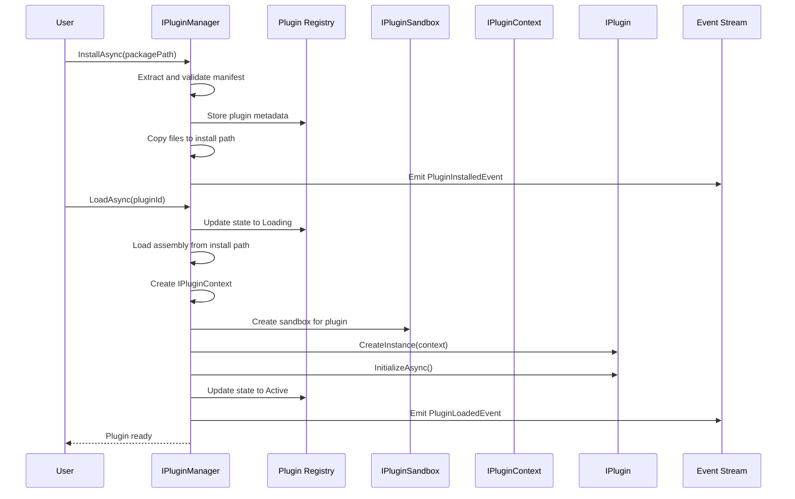
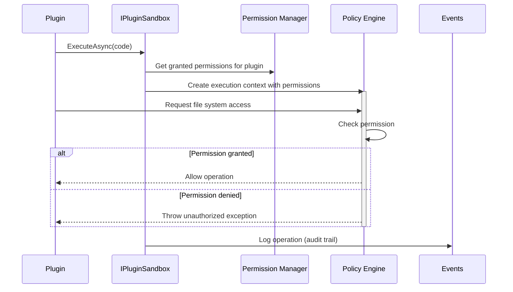
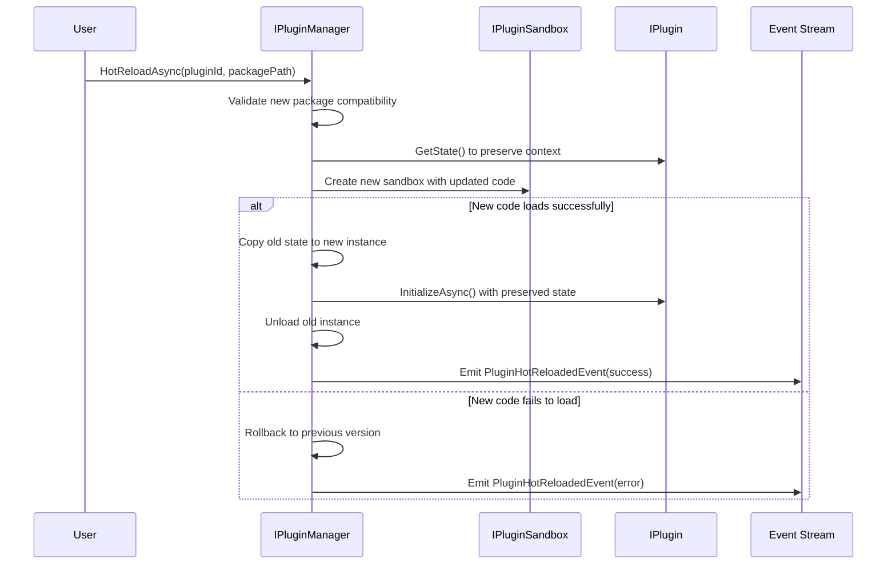

# LCS-SBD-v0.15.1-MKT: Scope Overview — Plugin Architecture

## Document Control

| Field            | Value                                                        |
| :--------------- | :----------------------------------------------------------- |
| **Document ID**  | LCS-SBD-v0.15.1-MKT                                          |
| **Version**      | v0.15.1                                                      |
| **Codename**     | Plugin Architecture                                          |
| **Status**       | Draft                                                        |
| **Last Updated** | 2026-01-31                                                   |
| **Owner**        | Plugin Architecture Lead                                     |
| **Depends On**   | v0.12.1-AGT (Agent Definition), v0.12.5-AGT (Tool Registry), v0.11.1-SEC (Authorization), v0.11.3-SEC (Encryption) |

---

## 1. Executive Summary

### 1.1 The Vision

**v0.15.1-MKT** delivers **Plugin Architecture** — a robust and secure system for enabling third-party extensions while maintaining application integrity through sandboxing, permission management, and lifecycle controls. This establishes:

- A comprehensive plugin SDK enabling developers to create extensions without modifying core code
- A secure sandbox runtime that isolates plugins and controls their access to system resources
- A lifecycle manager handling plugin discovery, loading, enabling, disabling, and unloading
- A plugin configuration system supporting schema-based settings with validation
- Hot reload capability allowing plugins to be updated without restarting the application
- A visual Plugin Manager UI for installation, configuration, and lifecycle management
- License gating limiting plugin capacity by tier (Core: 2, WriterPro: 10, Teams: Unlimited, Enterprise: Custom)

This is the foundation for a vibrant plugin ecosystem—without a secure, extensible plugin system, third-party developers cannot safely extend Lexichord's capabilities.

### 1.2 Business Value

- **Extensibility:** Third-party developers can extend Lexichord without modifying core code.
- **Ecosystem:** Plugin marketplace drives revenue and increases platform stickiness.
- **Safety:** Sandbox containment prevents malicious or buggy plugins from crashing the application.
- **Control:** Granular permissions ensure plugins only access resources they need.
- **Agility:** Hot reload enables rapid plugin iteration without full application restart.
- **Compliance:** License gating ensures customers only pay for capabilities they use.
- **Customization:** Organizations can build private plugins for custom workflows.

### 1.3 Success Criteria

1. Plugin SDK supports creating agents, tools, and data sources without framework knowledge.
2. Sandbox prevents file system access, network calls, and privilege escalation via plugin code.
3. Lifecycle manager supports discovery, loading, enabling, disabling, and unloading with zero downtime.
4. Plugin configuration validates against schema with strong typing and runtime checks.
5. Hot reload updates plugin code and configuration without application restart (>95% success rate).
6. Plugin Manager UI enables non-technical users to manage plugins with full discoverability.
7. License gating enforces tier limits with clear messaging for exceeded capacity.

---

## 2. Key Deliverables

### 2.1 Sub-Parts

| Sub-Part | Title | Description | Est. Hours |
|:---------|:------|:------------|:-----------|
| v0.15.1e | Plugin SDK | Core SDK interfaces for IPlugin, PluginManifest, capabilities, permissions, dependencies | 12 |
| v0.15.1f | Plugin Sandbox | Runtime isolation, resource limits, capability filtering, secure execution context | 12 |
| v0.15.1g | Lifecycle Manager | Discovery, load, enable, disable, unload with state transitions and event notifications | 10 |
| v0.15.1h | Plugin Configuration | Schema-based configuration, validation, hot update, persistence | 6 |
| v0.15.1i | Hot Reload | Dynamic assembly loading, state preservation, rollback on failure | 8 |
| v0.15.1j | Plugin Manager UI | Discovery, installation, configuration, enable/disable, removal | 6 |
| **Total** | | | **54 hours** |

### 2.2 Core Interfaces

```csharp
/// <summary>
/// Strongly-typed identifier for a plugin.
/// </summary>
public readonly record struct PluginId(Guid Value)
{
    public static PluginId New() => new(Guid.NewGuid());
    public static PluginId Parse(string s) => new(Guid.Parse(s));
    public override string ToString() => $"plugin:{Value:N}";
}

/// <summary>
/// Plugin manifest describing metadata, capabilities, permissions, and dependencies.
/// </summary>
public record PluginManifest
{
    /// <summary>
    /// Unique identifier for this plugin.
    /// </summary>
    public required string Id { get; init; }

    /// <summary>
    /// Semantic version of the plugin.
    /// </summary>
    public required string Version { get; init; }

    /// <summary>
    /// Human-readable name.
    /// </summary>
    public required string Name { get; init; }

    /// <summary>
    /// Short description of plugin purpose.
    /// </summary>
    public string? Description { get; init; }

    /// <summary>
    /// Plugin author name.
    /// </summary>
    public string? Author { get; init; }

    /// <summary>
    /// Plugin author contact email.
    /// </summary>
    public string? AuthorEmail { get; init; }

    /// <summary>
    /// Plugin homepage URL.
    /// </summary>
    public string? Homepage { get; init; }

    /// <summary>
    /// Plugin license identifier (SPDX).
    /// </summary>
    public string? License { get; init; }

    /// <summary>
    /// Minimum Lexichord version required.
    /// </summary>
    public required string MinimumLexichordVersion { get; init; }

    /// <summary>
    /// Maximum Lexichord version (null = no limit).
    /// </summary>
    public string? MaximumLexichordVersion { get; init; }

    /// <summary>
    /// Type of plugin content (Agent, Tool, DataSource, Integration, Custom).
    /// </summary>
    public required PluginContentType ContentType { get; init; }

    /// <summary>
    /// Path to plugin entry point assembly relative to plugin root.
    /// </summary>
    public required string EntryPoint { get; init; }

    /// <summary>
    /// Class implementing IPlugin interface.
    /// </summary>
    public required string PluginClassName { get; init; }

    /// <summary>
    /// Capabilities declared by this plugin.
    /// </summary>
    public IReadOnlyList<PluginCapability> Capabilities { get; init; } = [];

    /// <summary>
    /// Permissions required by this plugin.
    /// </summary>
    public IReadOnlyList<PluginPermission> Permissions { get; init; } = [];

    /// <summary>
    /// Plugin dependencies on other plugins.
    /// </summary>
    public IReadOnlyList<PluginDependency> Dependencies { get; init; } = [];

    /// <summary>
    /// Minimum license tier required to use this plugin.
    /// </summary>
    public LicenseTier MinimumLicenseTier { get; init; } = LicenseTier.Core;

    /// <summary>
    /// Configuration schema in JSON Schema format.
    /// </summary>
    public object? ConfigurationSchema { get; init; }

    /// <summary>
    /// Icon URL or data URI.
    /// </summary>
    public string? IconUrl { get; init; }

    /// <summary>
    /// Custom metadata key-value pairs.
    /// </summary>
    public IReadOnlyDictionary<string, string> Metadata { get; init; } = new Dictionary<string, string>();
}

/// <summary>
/// Type of plugin content.
/// </summary>
public enum PluginContentType
{
    /// <summary>Plugin provides one or more agents.</summary>
    Agent,

    /// <summary>Plugin provides tools for agents.</summary>
    Tool,

    /// <summary>Plugin provides data sources for knowledge retrieval.</summary>
    DataSource,

    /// <summary>Plugin integrates with external services.</summary>
    Integration,

    /// <summary>Plugin with custom functionality.</summary>
    Custom
}

/// <summary>
/// Capability offered by a plugin.
/// </summary>
public record PluginCapability
{
    /// <summary>
    /// Type of capability (Agent, Tool, DataSource, etc.).
    /// </summary>
    public required PluginCapabilityType Type { get; init; }

    /// <summary>
    /// Unique identifier for this capability within the plugin.
    /// </summary>
    public required string Id { get; init; }

    /// <summary>
    /// Human-readable name.
    /// </summary>
    public required string Name { get; init; }

    /// <summary>
    /// Description of what this capability does.
    /// </summary>
    public string? Description { get; init; }

    /// <summary>
    /// Schema/interface this capability implements.
    /// </summary>
    public string? Interface { get; init; }

    /// <summary>
    /// Custom metadata.
    /// </summary>
    public IReadOnlyDictionary<string, object>? Metadata { get; init; }
}

/// <summary>
/// Types of capabilities plugins can offer.
/// </summary>
public enum PluginCapabilityType
{
    /// <summary>Agent implementation.</summary>
    Agent,

    /// <summary>Tool/skill for agents.</summary>
    Tool,

    /// <summary>Data source for knowledge.</summary>
    DataSource,

    /// <summary>Event handler/listener.</summary>
    EventHandler,

    /// <summary>Middleware/interceptor.</summary>
    Middleware,

    /// <summary>Custom capability type.</summary>
    Custom
}

/// <summary>
/// Permission required by a plugin.
/// </summary>
public record PluginPermission
{
    /// <summary>
    /// Type of permission (FileSystem, Network, Database, etc.).
    /// </summary>
    public required PluginPermissionType Type { get; init; }

    /// <summary>
    /// Permission scope/resource.
    /// </summary>
    public required string Resource { get; init; }

    /// <summary>
    /// Permission level (Read, Write, Execute, Admin).
    /// </summary>
    public required PluginPermissionLevel Level { get; init; }

    /// <summary>
    /// Human-readable description of why this permission is needed.
    /// </summary>
    public string? Description { get; init; }

    /// <summary>
    /// Whether user/admin approval is required to grant this permission.
    /// </summary>
    public bool RequiresApproval { get; init; } = true;
}

/// <summary>
/// Types of permissions plugins can request.
/// </summary>
public enum PluginPermissionType
{
    /// <summary>File system access.</summary>
    FileSystem,

    /// <summary>Network access (HTTP, WebSocket).</summary>
    Network,

    /// <summary>Database access.</summary>
    Database,

    /// <summary>Access to CKVS store.</summary>
    Knowledge,

    /// <summary>Access to other plugins.</summary>
    PluginInterop,

    /// <summary>Access to user data/settings.</summary>
    UserData,

    /// <summary>Administrative access.</summary>
    Admin,

    /// <summary>Custom permission type.</summary>
    Custom
}

/// <summary>
/// Permission levels.
/// </summary>
public enum PluginPermissionLevel
{
    /// <summary>Read-only access.</summary>
    Read,

    /// <summary>Read and write access.</summary>
    Write,

    /// <summary>Execute/invoke capability.</summary>
    Execute,

    /// <summary>Administrative/full access.</summary>
    Admin
}

/// <summary>
/// Dependency on another plugin.
/// </summary>
public record PluginDependency
{
    /// <summary>
    /// Plugin ID of the dependency.
    /// </summary>
    public required string PluginId { get; init; }

    /// <summary>
    /// Minimum version required (semantic versioning).
    /// </summary>
    public required string MinimumVersion { get; init; }

    /// <summary>
    /// Maximum version allowed (null = no limit).
    /// </summary>
    public string? MaximumVersion { get; init; }

    /// <summary>
    /// Whether this dependency is optional.
    /// </summary>
    public bool IsOptional { get; init; } = false;

    /// <summary>
    /// Description of what the dependency is used for.
    /// </summary>
    public string? Description { get; init; }
}

/// <summary>
/// Requirements for a plugin to run.
/// </summary>
public record PluginRequirements
{
    /// <summary>
    /// Minimum memory required (MB).
    /// </summary>
    public int? MinimumMemoryMb { get; init; }

    /// <summary>
    /// Minimum disk space required (MB).
    /// </summary>
    public int? MinimumDiskSpaceMb { get; init; }

    /// <summary>
    /// Required operating systems.
    /// </summary>
    public IReadOnlyList<string>? SupportedOperatingSystems { get; init; }

    /// <summary>
    /// Required .NET versions.
    /// </summary>
    public IReadOnlyList<string>? SupportedDotNetVersions { get; init; }

    /// <summary>
    /// Custom requirements as key-value pairs.
    /// </summary>
    public IReadOnlyDictionary<string, string>? CustomRequirements { get; init; }
}

/// <summary>
/// Core interface all plugins must implement.
/// </summary>
public interface IPlugin
{
    /// <summary>
    /// Gets the plugin manifest.
    /// </summary>
    PluginManifest Manifest { get; }

    /// <summary>
    /// Initialize the plugin within a context.
    /// </summary>
    Task InitializeAsync(IPluginContext context, CancellationToken ct = default);

    /// <summary>
    /// Dispose plugin resources.
    /// </summary>
    Task DisposeAsync();

    /// <summary>
    /// Check if the plugin is available (all dependencies met, permissions granted).
    /// </summary>
    Task<bool> IsAvailableAsync(CancellationToken ct = default);

    /// <summary>
    /// Get current plugin state.
    /// </summary>
    PluginState GetState();
}

/// <summary>
/// Context provided to plugins for accessing framework services.
/// </summary>
public interface IPluginContext
{
    /// <summary>
    /// Unique identifier for this plugin instance.
    /// </summary>
    PluginId PluginId { get; }

    /// <summary>
    /// Plugin manifest.
    /// </summary>
    PluginManifest Manifest { get; }

    /// <summary>
    /// Current configuration for this plugin.
    /// </summary>
    IReadOnlyDictionary<string, object> Configuration { get; }

    /// <summary>
    /// Logger for this plugin.
    /// </summary>
    ILogger Logger { get; }

    /// <summary>
    /// Access to other plugins (with permission checks).
    /// </summary>
    IPluginInterop Interop { get; }

    /// <summary>
    /// Register a capability provided by this plugin.
    /// </summary>
    Task RegisterCapabilityAsync<T>(
        PluginCapability capability,
        T implementation,
        CancellationToken ct = default);

    /// <summary>
    /// Unregister a previously registered capability.
    /// </summary>
    Task UnregisterCapabilityAsync(
        string capabilityId,
        CancellationToken ct = default);

    /// <summary>
    /// Subscribe to framework events.
    /// </summary>
    IDisposable SubscribeToEvent<TEvent>(
        Func<TEvent, Task> handler)
        where TEvent : class;

    /// <summary>
    /// Publish an event from this plugin.
    /// </summary>
    Task PublishEventAsync<TEvent>(TEvent @event, CancellationToken ct = default)
        where TEvent : class;
}

/// <summary>
/// Interface for plugin-to-plugin communication (with permission checks).
/// </summary>
public interface IPluginInterop
{
    /// <summary>
    /// Call another plugin's capability.
    /// </summary>
    Task<object?> CallCapabilityAsync(
        string pluginId,
        string capabilityId,
        IReadOnlyDictionary<string, object> parameters,
        CancellationToken ct = default);

    /// <summary>
    /// Get metadata about another plugin.
    /// </summary>
    Task<PluginManifest?> GetPluginManifestAsync(
        string pluginId,
        CancellationToken ct = default);

    /// <summary>
    /// Check if a capability is available.
    /// </summary>
    Task<bool> IsCapabilityAvailableAsync(
        string pluginId,
        string capabilityId,
        CancellationToken ct = default);
}

/// <summary>
/// State of a plugin instance.
/// </summary>
public enum PluginState
{
    /// <summary>Plugin discovered but not loaded.</summary>
    Discovered,

    /// <summary>Plugin being loaded.</summary>
    Loading,

    /// <summary>Plugin loaded but not initialized.</summary>
    Loaded,

    /// <summary>Plugin being initialized.</summary>
    Initializing,

    /// <summary>Plugin ready and active.</summary>
    Active,

    /// <summary>Plugin temporarily disabled (but not unloaded).</summary>
    Disabled,

    /// <summary>Plugin being unloaded.</summary>
    Unloading,

    /// <summary>Plugin unloaded from memory.</summary>
    Unloaded,

    /// <summary>Plugin encountered an error.</summary>
    Error,

    /// <summary>Plugin being hot-reloaded.</summary>
    HotReloading
}

/// <summary>
/// A plugin installed and registered in the system.
/// </summary>
public record InstalledPlugin
{
    /// <summary>
    /// Unique identifier for this installation.
    /// </summary>
    public required PluginId Id { get; init; }

    /// <summary>
    /// Plugin manifest.
    /// </summary>
    public required PluginManifest Manifest { get; init; }

    /// <summary>
    /// Root directory where plugin is installed.
    /// </summary>
    public required string InstallPath { get; init; }

    /// <summary>
    /// Current state of the plugin.
    /// </summary>
    public PluginState State { get; init; }

    /// <summary>
    /// Current configuration.
    /// </summary>
    public IReadOnlyDictionary<string, object> Configuration { get; init; } = new Dictionary<string, object>();

    /// <summary>
    /// Whether plugin is enabled by user.
    /// </summary>
    public bool IsEnabled { get; init; } = true;

    /// <summary>
    /// Whether plugin was loaded at startup.
    /// </summary>
    public bool AutoLoad { get; init; } = true;

    /// <summary>
    /// When plugin was installed.
    /// </summary>
    public DateTimeOffset InstalledAt { get; init; }

    /// <summary>
    /// When plugin was last updated.
    /// </summary>
    public DateTimeOffset? UpdatedAt { get; init; }

    /// <summary>
    /// Granted permissions (subset of requested permissions).
    /// </summary>
    public IReadOnlyList<PluginPermission> GrantedPermissions { get; init; } = [];

    /// <summary>
    /// Denied permissions (for audit trail).
    /// </summary>
    public IReadOnlyList<PluginPermission> DeniedPermissions { get; init; } = [];

    /// <summary>
    /// Any error message if state is Error.
    /// </summary>
    public string? ErrorMessage { get; init; }
}

/// <summary>
/// Manages plugin discovery, loading, configuration, and lifecycle.
/// </summary>
public interface IPluginManager
{
    /// <summary>
    /// Discover plugins in the configured plugin directories.
    /// </summary>
    Task<IReadOnlyList<PluginManifest>> DiscoverAsync(
        CancellationToken ct = default);

    /// <summary>
    /// Install a plugin from a package.
    /// </summary>
    Task<InstalledPlugin> InstallAsync(
        string packagePath,
        PluginInstallOptions? options = null,
        CancellationToken ct = default);

    /// <summary>
    /// Uninstall an installed plugin.
    /// </summary>
    Task UninstallAsync(
        PluginId pluginId,
        CancellationToken ct = default);

    /// <summary>
    /// Load a plugin into memory.
    /// </summary>
    Task LoadAsync(
        PluginId pluginId,
        CancellationToken ct = default);

    /// <summary>
    /// Unload a plugin from memory.
    /// </summary>
    Task UnloadAsync(
        PluginId pluginId,
        CancellationToken ct = default);

    /// <summary>
    /// Enable a plugin (allow it to run).
    /// </summary>
    Task EnableAsync(
        PluginId pluginId,
        CancellationToken ct = default);

    /// <summary>
    /// Disable a plugin (prevent it from running).
    /// </summary>
    Task DisableAsync(
        PluginId pluginId,
        CancellationToken ct = default);

    /// <summary>
    /// Update plugin configuration.
    /// </summary>
    Task UpdateConfigurationAsync(
        PluginId pluginId,
        IReadOnlyDictionary<string, object> configuration,
        CancellationToken ct = default);

    /// <summary>
    /// Hot reload a plugin (update code without full restart).
    /// </summary>
    Task HotReloadAsync(
        PluginId pluginId,
        string? packagePath = null,
        CancellationToken ct = default);

    /// <summary>
    /// Get all installed plugins.
    /// </summary>
    Task<IReadOnlyList<InstalledPlugin>> GetInstalledAsync(
        CancellationToken ct = default);

    /// <summary>
    /// Get a specific installed plugin.
    /// </summary>
    Task<InstalledPlugin?> GetInstalledAsync(
        PluginId pluginId,
        CancellationToken ct = default);

    /// <summary>
    /// Get plugins available for the current license tier.
    /// </summary>
    Task<IReadOnlyList<InstalledPlugin>> GetAvailableForTierAsync(
        LicenseTier tier,
        CancellationToken ct = default);

    /// <summary>
    /// Grant a permission to a plugin.
    /// </summary>
    Task GrantPermissionAsync(
        PluginId pluginId,
        PluginPermission permission,
        CancellationToken ct = default);

    /// <summary>
    /// Revoke a permission from a plugin.
    /// </summary>
    Task RevokePermissionAsync(
        PluginId pluginId,
        PluginPermissionType type,
        string resource,
        CancellationToken ct = default);

    /// <summary>
    /// Observable stream of plugin lifecycle events.
    /// </summary>
    IObservable<PluginEvent> Events { get; }
}

/// <summary>
/// Options for installing a plugin.
/// </summary>
public record PluginInstallOptions
{
    /// <summary>
    /// Whether to auto-load plugin at startup.
    /// </summary>
    public bool AutoLoad { get; init; } = true;

    /// <summary>
    /// Whether to auto-enable plugin after installation.
    /// </summary>
    public bool AutoEnable { get; init; } = true;

    /// <summary>
    /// Initial configuration.
    /// </summary>
    public IReadOnlyDictionary<string, object>? Configuration { get; init; }
}

/// <summary>
/// Sandbox for secure plugin execution.
/// </summary>
public interface IPluginSandbox
{
    /// <summary>
    /// Execute code within the sandbox with permission checks.
    /// </summary>
    Task<T> ExecuteAsync<T>(
        Func<IPluginContext, Task<T>> code,
        PluginId pluginId,
        SandboxOptions? options = null,
        CancellationToken ct = default);

    /// <summary>
    /// Check if a plugin has a specific permission.
    /// </summary>
    Task<bool> HasPermissionAsync(
        PluginId pluginId,
        PluginPermissionType type,
        string resource,
        CancellationToken ct = default);

    /// <summary>
    /// Get granted permissions for a plugin.
    /// </summary>
    Task<IReadOnlyList<PluginPermission>> GetGrantedPermissionsAsync(
        PluginId pluginId,
        CancellationToken ct = default);
}

/// <summary>
/// Configuration for sandbox execution.
/// </summary>
public record SandboxOptions
{
    /// <summary>
    /// Maximum execution time (default 30 seconds).
    /// </summary>
    public TimeSpan ExecutionTimeout { get; init; } = TimeSpan.FromSeconds(30);

    /// <summary>
    /// Maximum memory usage in MB (default 512 MB).
    /// </summary>
    public int? MaxMemoryMb { get; init; } = 512;

    /// <summary>
    /// Allowed permission overrides for this execution.
    /// </summary>
    public IReadOnlyList<PluginPermission>? PermissionOverrides { get; init; }

    /// <summary>
    /// Whether to capture and log plugin output.
    /// </summary>
    public bool CaptureOutput { get; init; } = true;

    /// <summary>
    /// Whether to enforce strict isolation.
    /// </summary>
    public bool StrictIsolation { get; init; } = true;
}

/// <summary>
/// A plugin running within a sandbox.
/// </summary>
public interface ISandboxedPlugin
{
    /// <summary>
    /// The wrapped plugin instance.
    /// </summary>
    IPlugin Plugin { get; }

    /// <summary>
    /// The plugin context.
    /// </summary>
    IPluginContext Context { get; }

    /// <summary>
    /// Permissions granted to this plugin.
    /// </summary>
    IReadOnlyList<PluginPermission> GrantedPermissions { get; }

    /// <summary>
    /// Whether the plugin is currently executing code.
    /// </summary>
    bool IsExecuting { get; }

    /// <summary>
    /// Last execution error (if any).
    /// </summary>
    Exception? LastError { get; }
}

/// <summary>
/// Events emitted during plugin lifecycle.
/// </summary>
public abstract record PluginEvent
{
    /// <summary>
    /// Timestamp of the event.
    /// </summary>
    public DateTimeOffset Timestamp { get; init; } = DateTimeOffset.UtcNow;
}

public record PluginDiscoveredEvent(PluginManifest Manifest) : PluginEvent;
public record PluginInstalledEvent(InstalledPlugin Plugin) : PluginEvent;
public record PluginUninstalledEvent(PluginId PluginId, string PluginName) : PluginEvent;
public record PluginLoadedEvent(PluginId PluginId, PluginManifest Manifest) : PluginEvent;
public record PluginUnloadedEvent(PluginId PluginId) : PluginEvent;
public record PluginEnabledEvent(PluginId PluginId) : PluginEvent;
public record PluginDisabledEvent(PluginId PluginId, string? Reason = null) : PluginEvent;
public record PluginConfigurationChangedEvent(PluginId PluginId, IReadOnlyDictionary<string, object> NewConfiguration) : PluginEvent;
public record PluginPermissionGrantedEvent(PluginId PluginId, PluginPermission Permission) : PluginEvent;
public record PluginPermissionRevokedEvent(PluginId PluginId, PluginPermissionType Type, string Resource) : PluginEvent;
public record PluginHotReloadedEvent(PluginId PluginId, string? ErrorMessage = null) : PluginEvent;
public record PluginErrorEvent(PluginId PluginId, string ErrorMessage, Exception? Exception = null) : PluginEvent;
```

---

## 3. Architecture

### 3.1 Component Overview

```
┌─────────────────────────────────────────────────────────────────────────────┐
│                        Plugin Architecture System                            │
├─────────────────────────────────────────────────────────────────────────────┤
│                                                                              │
│  ┌─────────────────────────────────────────────────────────────────────┐   │
│  │                    IPluginManager                                    │   │
│  │  ┌──────────────┐  ┌──────────────┐  ┌──────────────┐              │   │
│  │  │  Discover &  │  │  Load/Unload │  │  Enable/     │              │   │
│  │  │  Install     │  │  Plugins     │  │  Disable     │              │   │
│  │  └──────┬───────┘  └──────┬───────┘  └──────┬───────┘              │   │
│  │         │                 │                 │                       │   │
│  │         ▼                 ▼                 ▼                       │   │
│  │  ┌─────────────────────────────────────────────────────────────┐   │   │
│  │  │                  Plugin Registry                             │   │   │
│  │  │  ┌───────────────┐  ┌────────────────┐  ┌──────────────┐   │   │   │
│  │  │  │  Manifest     │  │  Installation  │  │  Lifecycle   │   │   │   │
│  │  │  │  Store        │  │  Store         │  │  State       │   │   │   │
│  │  │  └───────────────┘  └────────────────┘  └──────────────┘   │   │   │
│  │  └─────────────────────────────────────────────────────────────┘   │   │
│  └─────────────────────────────────────────────────────────────────────┘   │
│                                     │                                       │
│              ┌──────────────────────┼──────────────────────┐               │
│              ▼                      ▼                      ▼               │
│  ┌───────────────────┐  ┌───────────────────┐  ┌───────────────────────┐  │
│  │  IPluginSandbox   │  │  Configuration    │  │  Hot Reload Manager   │  │
│  │                   │  │  Manager          │  │                       │  │
│  │ • Execution       │  │                   │  │ • Assembly loading    │  │
│  │ • Permission      │  │ • Schema valid.   │  │ • State preservation  │  │
│  │   checks          │  │ • Hot update      │  │ • Rollback            │  │
│  │ • Isolation       │  │ • Persistence     │  │ • Versioning          │  │
│  └───────────────────┘  └───────────────────┘  └───────────────────────┘  │
│                                                                              │
│  ┌─────────────────────────────────────────────────────────────────────┐   │
│  │                  Lifecycle State Machine                             │   │
│  │  Discovered → Loading → Loaded → Initializing → Active ⇄ Disabled  │   │
│  │                 ↓                                      ↓              │   │
│  │              HotReloading ────────────────────────────┘              │   │
│  │                 ↓                                                     │   │
│  │              Unloading → Unloaded                                     │   │
│  └─────────────────────────────────────────────────────────────────────┘   │
│                                                                              │
│  ┌─────────────────────────────────────────────────────────────────────┐   │
│  │                      Plugin Manager UI                               │   │
│  │  ┌──────────────┐  ┌──────────────┐  ┌──────────────┐              │   │
│  │  │ Discovery &  │  │ Configuration │  │ Lifecycle   │              │   │
│  │  │ Installation │  │ Management    │  │ Controls    │              │   │
│  │  └──────────────┘  └──────────────┘  └──────────────┘              │   │
│  └─────────────────────────────────────────────────────────────────────┘   │
│                                                                              │
└─────────────────────────────────────────────────────────────────────────────┘
```

### 3.2 Plugin Loading Flow



### 3.3 Permission Enforcement Flow



### 3.4 Hot Reload Flow



---

## 4. Data Model

### 4.1 Database Schema

```sql
-- Discovered and installed plugins
CREATE TABLE plugins (
    id UUID PRIMARY KEY DEFAULT gen_random_uuid(),
    manifest_id VARCHAR(100) NOT NULL UNIQUE,
    manifest_version VARCHAR(50) NOT NULL,
    name VARCHAR(200) NOT NULL,
    description TEXT,
    author VARCHAR(100),
    author_email VARCHAR(100),
    homepage VARCHAR(500),
    license VARCHAR(50),
    content_type VARCHAR(50) NOT NULL,
    minimum_lexichord_version VARCHAR(50) NOT NULL,
    maximum_lexichord_version VARCHAR(50),
    minimum_license_tier VARCHAR(50) NOT NULL DEFAULT 'Core',
    icon_url VARCHAR(1000),
    entry_point VARCHAR(500) NOT NULL,
    plugin_class_name VARCHAR(500) NOT NULL,
    manifest_json JSONB NOT NULL,
    install_path VARCHAR(1000),
    state VARCHAR(50) NOT NULL DEFAULT 'Discovered',
    is_enabled BOOLEAN NOT NULL DEFAULT TRUE,
    auto_load BOOLEAN NOT NULL DEFAULT TRUE,
    installed_by_user_id UUID,
    installed_at TIMESTAMPTZ,
    updated_at TIMESTAMPTZ,
    error_message TEXT,
    created_at TIMESTAMPTZ NOT NULL DEFAULT NOW(),

    INDEX idx_plugins_manifest_id ON plugins(manifest_id),
    INDEX idx_plugins_state ON plugins(state),
    INDEX idx_plugins_tier ON plugins(minimum_license_tier),
    INDEX idx_plugins_enabled ON plugins(is_enabled) WHERE is_enabled = TRUE,
    INDEX idx_plugins_user ON plugins(installed_by_user_id)
);

-- Plugin capabilities
CREATE TABLE plugin_capabilities (
    id UUID PRIMARY KEY DEFAULT gen_random_uuid(),
    plugin_id UUID NOT NULL REFERENCES plugins(id) ON DELETE CASCADE,
    capability_type VARCHAR(50) NOT NULL,
    capability_id VARCHAR(200) NOT NULL,
    name VARCHAR(200) NOT NULL,
    description TEXT,
    interface VARCHAR(500),
    metadata_json JSONB,

    UNIQUE(plugin_id, capability_id),
    INDEX idx_capabilities_plugin ON plugin_capabilities(plugin_id),
    INDEX idx_capabilities_type ON plugin_capabilities(capability_type)
);

-- Plugin permissions (requested and granted)
CREATE TABLE plugin_permissions (
    id UUID PRIMARY KEY DEFAULT gen_random_uuid(),
    plugin_id UUID NOT NULL REFERENCES plugins(id) ON DELETE CASCADE,
    permission_type VARCHAR(50) NOT NULL,
    resource VARCHAR(500) NOT NULL,
    permission_level VARCHAR(50) NOT NULL,
    description TEXT,
    requires_approval BOOLEAN NOT NULL DEFAULT TRUE,
    is_granted BOOLEAN NOT NULL DEFAULT FALSE,
    granted_by_user_id UUID,
    granted_at TIMESTAMPTZ,
    created_at TIMESTAMPTZ NOT NULL DEFAULT NOW(),

    UNIQUE(plugin_id, permission_type, resource),
    INDEX idx_permissions_plugin ON plugin_permissions(plugin_id),
    INDEX idx_permissions_granted ON plugin_permissions(is_granted) WHERE is_granted = TRUE
);

-- Plugin dependencies
CREATE TABLE plugin_dependencies (
    id UUID PRIMARY KEY DEFAULT gen_random_uuid(),
    plugin_id UUID NOT NULL REFERENCES plugins(id) ON DELETE CASCADE,
    dependency_plugin_id VARCHAR(100) NOT NULL,
    minimum_version VARCHAR(50) NOT NULL,
    maximum_version VARCHAR(50),
    is_optional BOOLEAN NOT NULL DEFAULT FALSE,
    description TEXT,

    INDEX idx_dependencies_plugin ON plugin_dependencies(plugin_id),
    INDEX idx_dependencies_dep ON plugin_dependencies(dependency_plugin_id)
);

-- Plugin configuration
CREATE TABLE plugin_configurations (
    id UUID PRIMARY KEY DEFAULT gen_random_uuid(),
    plugin_id UUID NOT NULL REFERENCES plugins(id) ON DELETE CASCADE,
    user_id UUID NOT NULL,
    configuration_json JSONB NOT NULL,
    is_active BOOLEAN NOT NULL DEFAULT TRUE,
    created_at TIMESTAMPTZ NOT NULL DEFAULT NOW(),
    updated_at TIMESTAMPTZ NOT NULL DEFAULT NOW(),

    UNIQUE(plugin_id, user_id),
    INDEX idx_config_plugin ON plugin_configurations(plugin_id),
    INDEX idx_config_user ON plugin_configurations(user_id)
);

-- Plugin audit trail
CREATE TABLE plugin_audit_log (
    id UUID PRIMARY KEY DEFAULT gen_random_uuid(),
    plugin_id UUID NOT NULL REFERENCES plugins(id) ON DELETE CASCADE,
    user_id UUID,
    action VARCHAR(50) NOT NULL,
    details_json JSONB,
    permission_required VARCHAR(200),
    permission_granted BOOLEAN,
    result_message TEXT,
    created_at TIMESTAMPTZ NOT NULL DEFAULT NOW(),

    INDEX idx_audit_plugin ON plugin_audit_log(plugin_id),
    INDEX idx_audit_user ON plugin_audit_log(user_id),
    INDEX idx_audit_action ON plugin_audit_log(action),
    INDEX idx_audit_date ON plugin_audit_log(created_at)
);

-- Plugin versions/releases
CREATE TABLE plugin_versions (
    id UUID PRIMARY KEY DEFAULT gen_random_uuid(),
    plugin_id UUID NOT NULL REFERENCES plugins(id) ON DELETE CASCADE,
    version VARCHAR(50) NOT NULL,
    manifest_json JSONB NOT NULL,
    release_date TIMESTAMPTZ NOT NULL,
    is_current BOOLEAN NOT NULL DEFAULT FALSE,
    release_notes TEXT,
    compatibility_status VARCHAR(50),

    UNIQUE(plugin_id, version),
    INDEX idx_versions_plugin ON plugin_versions(plugin_id),
    INDEX idx_versions_current ON plugin_versions(is_current) WHERE is_current = TRUE
);
```

### 4.2 Plugin Configuration JSON Structure

```json
{
  "id": "my-research-plugin",
  "version": "1.0.0",
  "name": "Advanced Research Plugin",
  "description": "Extends research capabilities with custom sources",
  "author": "Research Team",
  "contentType": "Tool",
  "entryPoint": "bin/Release/net8.0/MyPlugin.dll",
  "pluginClassName": "MyPlugin.ResearchPlugin",
  "minimumLexichordVersion": "0.15.1",
  "minimumLicenseTier": "WriterPro",
  "capabilities": [
    {
      "type": "Tool",
      "id": "academic-search",
      "name": "Academic Search Tool",
      "description": "Search academic databases",
      "interface": "ITool"
    }
  ],
  "permissions": [
    {
      "type": "Network",
      "resource": "https://api.example.com",
      "level": "Execute",
      "description": "Access external research API",
      "requiresApproval": true
    },
    {
      "type": "Knowledge",
      "resource": "research-documents",
      "level": "Read",
      "description": "Query research documents from knowledge store",
      "requiresApproval": false
    }
  ],
  "dependencies": [
    {
      "pluginId": "base-research-plugin",
      "minimumVersion": "1.0.0",
      "isOptional": false
    }
  ],
  "configurationSchema": {
    "$schema": "http://json-schema.org/draft-07/schema#",
    "type": "object",
    "properties": {
      "apiKey": {
        "type": "string",
        "description": "API key for research service"
      },
      "maxResults": {
        "type": "integer",
        "minimum": 1,
        "maximum": 100,
        "default": 20
      },
      "timeout": {
        "type": "integer",
        "description": "Request timeout in seconds",
        "default": 30
      }
    },
    "required": ["apiKey"]
  }
}
```

### 4.3 Plugin Instance Configuration

```json
{
  "pluginId": "my-research-plugin",
  "userId": "user-123",
  "configuration": {
    "apiKey": "sk-xxxxxxxxxxxx",
    "maxResults": 50,
    "timeout": 60
  },
  "grantedPermissions": [
    {
      "type": "Network",
      "resource": "https://api.example.com",
      "level": "Execute"
    },
    {
      "type": "Knowledge",
      "resource": "research-documents",
      "level": "Read"
    }
  ],
  "isEnabled": true,
  "autoLoad": true
}
```

---

## 5. Plugin Configuration

### 5.1 Configuration Schema Support

Plugins declare configuration requirements via JSON Schema:

```json
{
  "configurationSchema": {
    "$schema": "http://json-schema.org/draft-07/schema#",
    "type": "object",
    "properties": {
      "enabled": {
        "type": "boolean",
        "default": true
      },
      "apiKey": {
        "type": "string",
        "minLength": 10
      },
      "apiEndpoint": {
        "type": "string",
        "format": "uri"
      },
      "options": {
        "type": "object",
        "properties": {
          "retryAttempts": {
            "type": "integer",
            "minimum": 1,
            "default": 3
          },
          "timeout": {
            "type": "integer",
            "minimum": 1000,
            "maximum": 60000,
            "default": 5000
          }
        }
      }
    },
    "required": ["apiKey", "apiEndpoint"]
  }
}
```

### 5.2 Configuration Update Validation

- Schema validation before persistence
- Type checking and constraint enforcement
- Default value application
- Hot update of configuration without reload
- Rollback on validation failure

---

## 6. Plugin Manager UI Mockups

### 6.1 Plugin Discovery & Installation

```
┌────────────────────────────────────────────────────────────────────────────┐
│ Plugin Manager                                                [Hide] [×]    │
├────────────────────────────────────────────────────────────────────────────┤
│                                                                             │
│ ┌─ Tabs ──────────────────────────────────────────────────────────────────┐│
│ │ [📦 Discover] [📂 Installed] [⚙ Permissions] [📋 Audit Log]             ││
│ └─────────────────────────────────────────────────────────────────────────┘│
│                                                                             │
│ 🔍 [Search plugins...                              ]  [Category ▼] [Sort ▼]│
│                                                                             │
│ ┌─ Featured Plugins ────────────────────────────────────────────────────────┐│
│ │                                                                            ││
│ │ ┌─────────────────────────────────┐ ┌─────────────────────────────────┐ ││
│ │ │ 🔬 Research Plus               │ │ 📚 Knowledge Extractor         │ ││
│ │ │ Advanced research with ML       │ │ Auto-extract insights          │ ││
│ │ │ by Research Team               │ │ by Data Labs                   │ ││
│ │ │ ★★★★★ 234 reviews            │ │ ★★★★☆ 128 reviews            │ ││
│ │ │ Version: 2.1.0                 │ │ Version: 1.5.3                 │ ││
│ │ │ License: MIT                   │ │ License: Apache 2.0            │ ││
│ │ │ [Install] [Info]               │ │ [Install] [Info]               │ ││
│ │ └─────────────────────────────────┘ └─────────────────────────────────┘ ││
│ │                                                                            ││
│ │ ┌─────────────────────────────────┐ ┌─────────────────────────────────┐ ││
│ │ │ 🌐 External Integration         │ │ 📊 Analytics Plugin            │ ││
│ │ │ Connect to external APIs        │ │ Usage metrics & insights       │ ││
│ │ │ by Integration Hub              │ │ by Analytics                   │ ││
│ │ │ ★★★★☆ 89 reviews             │ │ ★★★☆☆ 34 reviews             │ ││
│ │ │ Version: 1.2.1                 │ │ Version: 0.8.0                 │ ││
│ │ │ License: MIT                   │ │ License: Commercial            │ ││
│ │ │ [Install] [Info]               │ │ [Purchase] [Info]              │ ││
│ │ └─────────────────────────────────┘ └─────────────────────────────────┘ ││
│ │                                                                            ││
│ └────────────────────────────────────────────────────────────────────────────┘│
│                                                                             │
│ [Load more...] or [Upload custom plugin]                                  │
│                                                                             │
└────────────────────────────────────────────────────────────────────────────┘
```

### 6.2 Installed Plugins

```
┌────────────────────────────────────────────────────────────────────────────┐
│ Plugin Manager > Installed                                    [Hide] [×]    │
├────────────────────────────────────────────────────────────────────────────┤
│                                                                             │
│ Your License: WriterPro  │  Plugins installed: 4 / 10  ⟨▓▓▓▓░░░░░░⟩      │
│                                                                             │
│ ┌─ Installed Plugins ────────────────────────────────────────────────────────┐│
│ │                                                                            ││
│ │ ┌─ Research Plus (2.1.0) ───────────────────── [Enabled ✓] [⋮]  ──────┐ ││
│ │ │ Advanced research with ML                                         │ ││
│ │ │ by Research Team  •  Installed: Jan 25, 2026                    │ ││
│ │ │                                                                  │ ││
│ │ │ Status: Active | Startup Load: Yes | Auto-enabled: Yes          │ ││
│ │ │ Permissions: Network (api.research.com), Knowledge (articles)   │ ││
│ │ │                                                                  │ ││
│ │ │ [Configure] [Permissions] [Uninstall] [Check for updates]       │ ││
│ │ └──────────────────────────────────────────────────────────────────┘ ││
│ │                                                                            ││
│ │ ┌─ Knowledge Extractor (1.5.3) ───────────────── [Enabled ✓] [⋮] ──────┐ ││
│ │ │ Auto-extract insights                                            │ ││
│ │ │ by Data Labs  •  Installed: Dec 10, 2025                        │ ││
│ │ │                                                                  │ ││
│ │ │ Status: Active | Startup Load: Yes | Auto-enabled: Yes          │ ││
│ │ │ Permissions: Knowledge (all documents), FileSystem (temp)        │ ││
│ │ │                                                                  │ ││
│ │ │ [Configure] [Permissions] [Uninstall] [Check for updates]       │ ││
│ │ └──────────────────────────────────────────────────────────────────┘ ││
│ │                                                                            ││
│ │ ┌─ External Integration (1.2.1) ──────────────── [Disabled] [⋮] ───────┐ ││
│ │ │ Connect to external APIs                                         │ ││
│ │ │ by Integration Hub  •  Installed: Oct 3, 2025                   │ ││
│ │ │                                                                  │ ││
│ │ │ Status: Disabled | Startup Load: Yes | Auto-enabled: No         │ ││
│ │ │ Permissions: Network (multiple), Admin (settings)                │ ││
│ │ │                                                                  │ ││
│ │ │ [Configure] [Enable] [Permissions] [Uninstall] [⋮]              │ ││
│ │ └──────────────────────────────────────────────────────────────────┘ ││
│ │                                                                            ││
│ │ ┌─ Custom Tools (0.1.0) ──────────────────────── [Error] [⋮] ─────────┐ ││
│ │ │ Organization custom plugin                                       │ ││
│ │ │ by Internal Team  •  Installed: Feb 1, 2026                     │ ││
│ │ │                                                                  │ ││
│ │ │ Status: Error | Error: Missing dependency "base-plugin" v2.0+   │ ││
│ │ │ Permissions: Knowledge (all), FileSystem (workspace)             │ ││
│ │ │                                                                  │ ││
│ │ │ [Configure] [Uninstall] [View error] [Retry load] [⋮]           │ ││
│ │ └──────────────────────────────────────────────────────────────────┘ ││
│ │                                                                            ││
│ └────────────────────────────────────────────────────────────────────────────┘│
│                                                                             │
└────────────────────────────────────────────────────────────────────────────┘
```

### 6.3 Plugin Configuration Dialog

```
┌────────────────────────────────────────────────────────────────────────────┐
│ Configure: Research Plus (2.1.0)                              [?] [×]      │
├────────────────────────────────────────────────────────────────────────────┤
│                                                                             │
│ ┌─ Settings ─────────────────────────────────────────────────────────────┐ │
│ │                                                                        │ │
│ │ Enabled ●○ (toggle to enable/disable without uninstalling)           │ │
│ │                                                                        │ │
│ │ Auto-load at startup ☑                                               │ │
│ │                                                                        │ │
│ │ ─────────────────────────────────────────────────────────────────────│ │
│ │                                                                        │ │
│ │ API Key                                                              │ │
│ │ [•••••••••••••••••••••] [Reveal]                                    │ │
│ │                                                                        │ │
│ │ API Endpoint                                                         │ │
│ │ [https://api.research.example.com]                                 │ │
│ │                                                                        │ │
│ │ Max Concurrent Requests                                             │ │
│ │ [5] (min: 1, max: 50)                                              │ │
│ │                                                                        │ │
│ │ Request Timeout (seconds)                                           │ │
│ │ [30] (min: 5, max: 300)                                            │ │
│ │                                                                        │ │
│ │ Include Sources in Results ☑                                         │ │
│ │                                                                        │ │
│ │ Cache Results ☑  Expiry (hours): [24]                               │ │
│ │                                                                        │ │
│ └────────────────────────────────────────────────────────────────────────┘ │
│                                                                             │
│ ┌─ Permissions ──────────────────────────────────────────────────────────┐ │
│ │                                                                        │ │
│ │ This plugin requests:                                                │ │
│ │  ☑ Network access to api.research.example.com (Execute)            │ │
│ │  ☑ Read access to Knowledge (articles)                             │ │
│ │  ☐ Write access to Knowledge (custom collections)                  │ │
│ │                                                                        │ │
│ │ ℹ️  [Request additional permission]                                  │ │
│ │                                                                        │ │
│ └────────────────────────────────────────────────────────────────────────┘ │
│                                                                             │
│ [Test Configuration] [Apply] [Save & Reload Plugin] [Cancel]              │
│                                                                             │
└────────────────────────────────────────────────────────────────────────────┘
```

---

## 7. Dependencies

| Component | Source | Usage |
|:----------|:-------|:------|
| `IAgentRegistry` | v0.12.1-AGT | Register agent plugins |
| `IToolRegistry` | v0.12.5-AGT | Register tool plugins |
| `IAuthorizationService` | v0.11.1-SEC | Permission evaluation |
| `IEncryptionService` | v0.11.3-SEC | Encrypt sensitive config |
| `ISettingsService` | v0.1.6a | User plugin preferences |
| `IMediator` | v0.0.7a | Plugin events |
| `ILicenseService` | v0.2.1a | License tier enforcement |
| `AppDomain` / `AssemblyLoadContext` | .NET Framework | Plugin isolation |

---

## 8. License Gating

| Tier | Plugin Limit | Features | Notes |
|:-----|:-------------|:---------|:------|
| **Core** | 2 | Built-in plugins only; cannot install custom | Suitable for evaluation |
| **WriterPro** | 10 | Curated marketplace plugins | Popular plugins available |
| **Teams** | Unlimited | Full marketplace + private plugins | Team collaboration |
| **Enterprise** | Unlimited | + Custom SDK + unsigned plugins | Max control and flexibility |

---

## 9. Performance Targets

| Metric | Target | Measurement |
|:-------|:-------|:------------|
| Plugin discovery | <500ms | P95 for 100+ plugins |
| Plugin load | <2s | P95 per plugin |
| Permission check | <10ms | P95 per check |
| Configuration update | <100ms | P95 without reload |
| Hot reload | <5s | P95 per plugin |
| Plugin execution | <30s timeout | Default sandbox timeout |
| UI responsiveness | <200ms | P95 for plugin operations |

---

## 10. Testing Strategy

### 10.1 Unit Tests

- Plugin manifest parsing and validation
- Permission evaluation and enforcement
- Configuration schema validation
- Capability registration/unregistration
- Lifecycle state transitions
- Sandbox execution with permission checks

### 10.2 Integration Tests

- Full plugin installation flow
- Plugin loading with dependency resolution
- Configuration persistence and updates
- Hot reload with state preservation
- Multi-plugin interaction with permission checks
- License tier enforcement
- Database persistence and recovery

### 10.3 Security Tests

- Sandbox isolation (file system, network, memory)
- Permission escalation attempts
- Malicious plugin behavior containment
- Sensitive data encryption (API keys, config)
- Audit trail completeness
- Cross-plugin interference prevention

### 10.4 Performance Tests

- 50+ plugins loaded without performance degradation
- Concurrent plugin operations
- Large configuration updates
- Rapid enable/disable cycles
- Hot reload under load
- UI responsiveness with many plugins

### 10.5 UI Tests

- Plugin discovery, installation, configuration
- Permission approval workflow
- Lifecycle controls (enable/disable/uninstall)
- Configuration validation feedback
- Error handling and recovery

---

## 11. Risks & Mitigations

| Risk | Impact | Mitigation |
|:-----|:-------|:-----------|
| Malicious plugin code | Security breach | Sandbox isolation + permission checks + code review process |
| Plugin dependency conflicts | Load failures | Dependency resolution algorithm; version constraints |
| Configuration data leakage | Credential exposure | AES-256 encryption for sensitive fields; audit logging |
| Hot reload failures | Service disruption | Transactional load; rollback on error; version tracking |
| Plugin API changes | Third-party breaks | Semantic versioning; deprecation period; migration guides |
| Performance degradation | Slow app | Lazy loading; async sandbox; resource limits; profiling |
| License bypass | Revenue loss | Server-side validation; license checks at every tier gate |
| Database schema conflicts | Data corruption | Migration tooling; backward compatibility; schema versioning |

---

## 12. MediatR Events

| Event | Description |
|:------|:------------|
| `PluginDiscoveredEvent` | New plugin manifest discovered |
| `PluginInstalledEvent` | Plugin successfully installed |
| `PluginUninstalledEvent` | Plugin uninstalled |
| `PluginLoadedEvent` | Plugin loaded into memory |
| `PluginUnloadedEvent` | Plugin unloaded from memory |
| `PluginEnabledEvent` | Plugin enabled and active |
| `PluginDisabledEvent` | Plugin disabled (with reason) |
| `PluginInitializedEvent` | Plugin initialization complete |
| `PluginConfigurationChangedEvent` | Configuration updated (with new values) |
| `PluginPermissionGrantedEvent` | Permission approved and granted |
| `PluginPermissionRevokedEvent` | Permission revoked |
| `PluginHotReloadedEvent` | Hot reload completed (with success/error) |
| `PluginCapabilityRegisteredEvent` | Capability registered by plugin |
| `PluginCapabilityUnregisteredEvent` | Capability unregistered |
| `PluginErrorEvent` | Plugin encountered runtime error |
| `PluginAuditEvent` | Operation logged for audit trail |

---

## Appendix A: Example Plugins

### Example 1: Simple Research Tool Plugin

```csharp
public class ResearchToolPlugin : IPlugin
{
    public PluginManifest Manifest => new()
    {
        Id = "research-tool-plugin",
        Version = "1.0.0",
        Name = "Research Tool Plugin",
        ContentType = PluginContentType.Tool,
        EntryPoint = "bin/Release/net8.0/ResearchPlugin.dll",
        PluginClassName = "ResearchToolPlugin.ResearchToolPlugin",
        MinimumLexichordVersion = "0.15.1",
        Permissions = new[]
        {
            new PluginPermission
            {
                Type = PluginPermissionType.Network,
                Resource = "https://api.research.example.com",
                Level = PluginPermissionLevel.Execute
            }
        },
        Capabilities = new[]
        {
            new PluginCapability
            {
                Type = PluginCapabilityType.Tool,
                Id = "academic-search",
                Name = "Academic Search Tool"
            }
        }
    };

    public async Task InitializeAsync(IPluginContext context, CancellationToken ct)
    {
        context.Logger.LogInformation("Research Tool Plugin initializing");
        // Register capabilities
        await context.RegisterCapabilityAsync(
            new PluginCapability { Type = PluginCapabilityType.Tool, Id = "academic-search" },
            new AcademicSearchTool(context),
            ct);
    }

    public async Task DisposeAsync()
    {
        // Cleanup
        await Task.CompletedTask;
    }

    public async Task<bool> IsAvailableAsync(CancellationToken ct)
    {
        // Check dependencies, permissions
        return await Task.FromResult(true);
    }

    public PluginState GetState() => PluginState.Active;
}
```

### Example 2: Data Source Plugin

```csharp
public class CustomDataSourcePlugin : IPlugin
{
    public PluginManifest Manifest => new()
    {
        Id = "custom-datasource-plugin",
        Version = "2.0.0",
        Name = "Custom Data Source Plugin",
        ContentType = PluginContentType.DataSource,
        MinimumLexichordVersion = "0.15.1",
        Permissions = new[]
        {
            new PluginPermission
            {
                Type = PluginPermissionType.Database,
                Resource = "customer-db",
                Level = PluginPermissionLevel.Read
            }
        },
        ConfigurationSchema = new
        {
            type = "object",
            properties = new
            {
                connectionString = new { type = "string" },
                timeout = new { type = "integer", minimum = 5 }
            },
            required = new[] { "connectionString" }
        }
    };

    public async Task InitializeAsync(IPluginContext context, CancellationToken ct)
    {
        var connString = context.Configuration["connectionString"];
        // Initialize data source connection
    }

    // ... other methods
}
```

---

## Appendix B: Plugin SDK Development Guide

### Quick Start

1. Create new .NET class library project
2. Add Lexichord.Plugins NuGet package
3. Implement IPlugin interface
4. Create plugin.manifest.json in root
5. Build and package as .nupkg or .zip
6. Install via Plugin Manager

### Plugin Manifest Template

```json
{
  "id": "my-custom-plugin",
  "version": "1.0.0",
  "name": "My Custom Plugin",
  "description": "Description of what this plugin does",
  "author": "Your Name",
  "license": "MIT",
  "minimumLexichordVersion": "0.15.1",
  "contentType": "Tool|Agent|DataSource|Integration|Custom",
  "entryPoint": "bin/Release/net8.0/MyPlugin.dll",
  "pluginClassName": "MyPlugin.MyCustomPlugin",
  "permissions": [],
  "capabilities": [],
  "configurationSchema": {}
}
```

---

**Document End**
