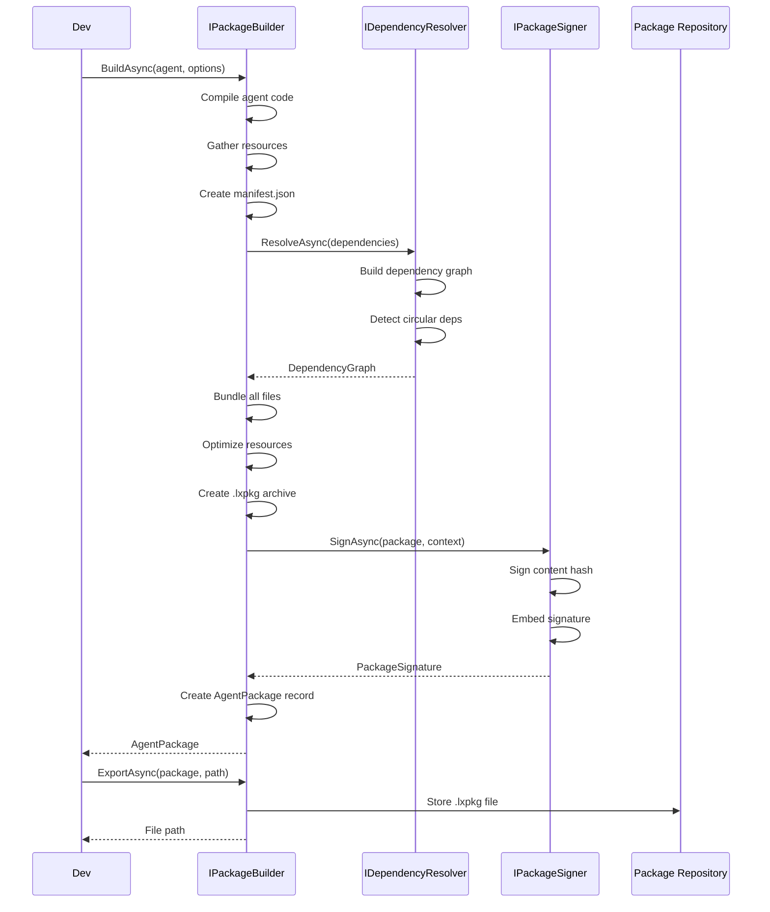
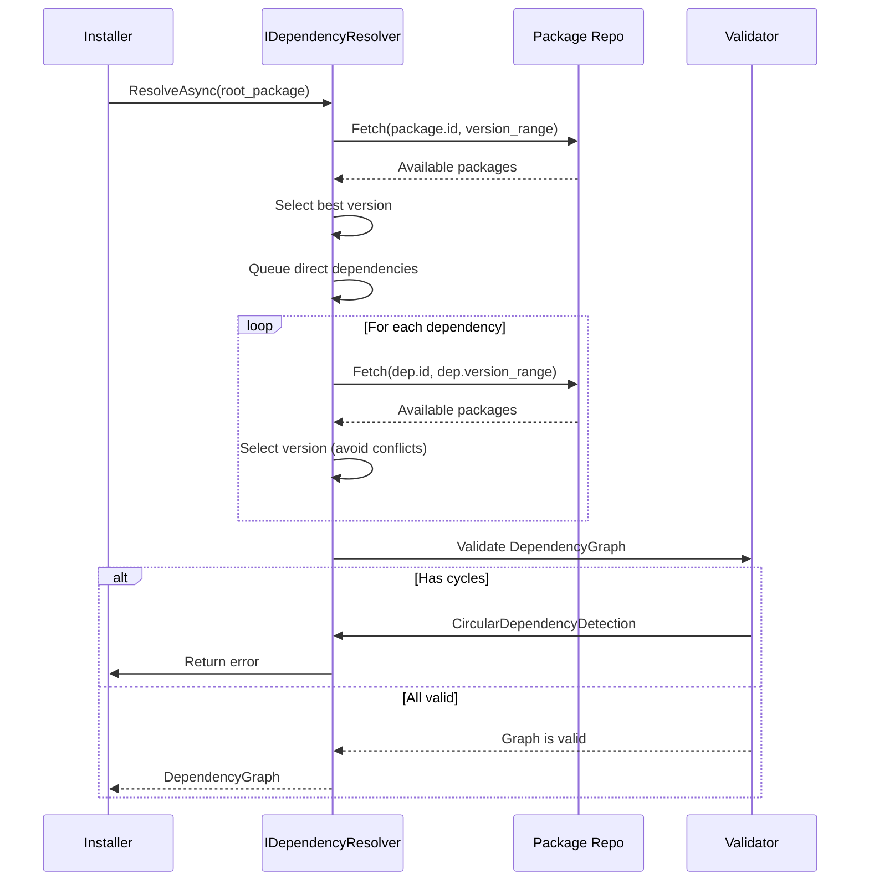
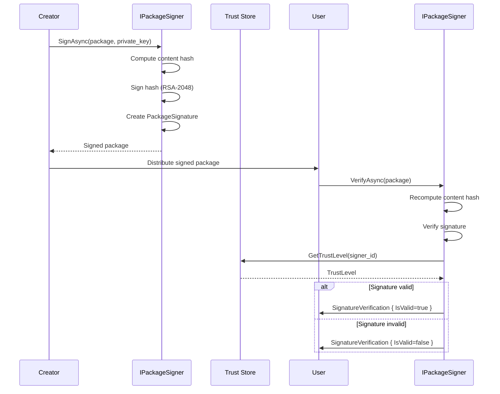

# LCS-SBD-v0.15.2-MKT: Scope Overview — Agent Packaging

## Document Control

| Field            | Value                                                        |
| :--------------- | :----------------------------------------------------------- |
| **Document ID**  | LCS-SBD-v0.15.2-MKT                                          |
| **Version**      | v0.15.2                                                      |
| **Codename**     | Agent Packaging (Agent Distribution Phase 1)                 |
| **Status**       | Draft                                                        |
| **Last Updated** | 2026-01-31                                                   |
| **Owner**        | Distribution Architecture Lead                               |
| **Depends On**   | v0.15.1-MKT (Plugin Architecture), v0.12.1-AGT (Agent Definition), v0.11.3-SEC (Encryption) |

---

## 1. Executive Summary

### 1.1 The Vision

**v0.15.2-MKT** delivers **Agent Packaging** — the foundational infrastructure that transforms agent distribution from ad-hoc sharing to standardized, versioned, signed, and distributable packages. This establishes:

- A standardized `.lxpkg` bundle format containing agents, dependencies, metadata, and resources
- A semantic versioning system for agents with compatibility resolution
- A dependency resolver that builds resolution graphs and detects conflicts
- A package builder that compiles agents with all dependencies into sealed bundles
- Package signing and cryptographic verification for supply chain security
- A version manager for tracking installed packages and updates
- A Package Explorer UI for discovering, installing, and managing agent packages

This is the foundation for the Agent Marketplace—without standardized packaging, agents cannot be reliably shared, versioned, or distributed at scale.

### 1.2 Business Value

- **Standardization:** All agents follow the same distribution format, reducing complexity.
- **Versioning:** Semantic versioning enables backward compatibility and clear upgrade paths.
- **Security:** Cryptographic signing ensures packages haven't been tampered with.
- **Dependency Management:** Automatic resolution prevents version conflicts.
- **Distribution:** Standardized format enables marketplace, registries, and sharing.
- **License Compliance:** Package metadata enforces license tier requirements.
- **Offline Use:** Sealed packages work without network access.
- **Auditability:** Package manifests provide clear supply chain visibility.

### 1.3 Success Criteria

1. Package builder creates valid `.lxpkg` files for all agent types in <2 seconds.
2. Dependency resolver handles 100+ dependency graphs with circular detection.
3. Package signer/verifier provides cryptographic proof of origin and integrity.
4. Version manager tracks installed packages with instant lookup (<10ms).
5. Package Explorer UI shows 1000+ packages with <100ms search response.
6. Package installation handles missing dependencies with automatic resolution.
7. License gating prevents unauthorized package features based on tier.
8. All packages meet 100% schema validation before installation.

---

## 2. Key Deliverables

### 2.1 Sub-Parts

| Sub-Part | Title | Description | Est. Hours |
|:---------|:------|:------------|:-----------|
| v0.15.2e | Bundle Format | Package structure, manifest schema, resource layout | 10 |
| v0.15.2f | Dependency Resolver | Version ranges, conflict detection, resolution graphs | 10 |
| v0.15.2g | Package Builder | Compilation, bundling, resource optimization | 8 |
| v0.15.2h | Signing & Verification | Cryptographic signing, signature validation, trust levels | 10 |
| v0.15.2i | Version Manager | Installation tracking, upgrades, rollback | 6 |
| v0.15.2j | Package Explorer UI | Discovery, search, installation, management UI | 6 |
| **Total** | | | **50 hours** |

### 2.2 Core Interfaces

```csharp
/// <summary>
/// Represents a packaged agent with dependencies and metadata.
/// </summary>
public record AgentPackage
{
    /// <summary>
    /// Package identifier (name).
    /// </summary>
    public required string Id { get; init; }

    /// <summary>
    /// Semantic version of this package.
    /// </summary>
    public required SemanticVersion Version { get; init; }

    /// <summary>
    /// Human-readable display name.
    /// </summary>
    public required string DisplayName { get; init; }

    /// <summary>
    /// Package description.
    /// </summary>
    public string? Description { get; init; }

    /// <summary>
    /// Package author/publisher.
    /// </summary>
    public string? Author { get; init; }

    /// <summary>
    /// License identifier (SPDX format).
    /// </summary>
    public string? License { get; init; }

    /// <summary>
    /// Minimum license tier required.
    /// </summary>
    public LicenseTier MinimumLicenseTier { get; init; } = LicenseTier.Core;

    /// <summary>
    /// Package dependencies with version constraints.
    /// </summary>
    public IReadOnlyList<PackageDependency> Dependencies { get; init; } = [];

    /// <summary>
    /// Files included in the package.
    /// </summary>
    public IReadOnlyList<PackageFile> Files { get; init; } = [];

    /// <summary>
    /// Package manifest data (JSON).
    /// </summary>
    public required string Manifest { get; init; }

    /// <summary>
    /// Optional cryptographic signature.
    /// </summary>
    public PackageSignature? Signature { get; init; }

    /// <summary>
    /// Timestamp when package was created.
    /// </summary>
    public DateTimeOffset CreatedAt { get; init; } = DateTimeOffset.UtcNow;

    /// <summary>
    /// Content hash for integrity verification.
    /// </summary>
    public string? ContentHash { get; init; }
}

/// <summary>
/// Semantic version following SemVer 2.0.0 specification.
/// </summary>
public record SemanticVersion
{
    /// <summary>
    /// Major version number.
    /// </summary>
    public int Major { get; init; }

    /// <summary>
    /// Minor version number.
    /// </summary>
    public int Minor { get; init; }

    /// <summary>
    /// Patch version number.
    /// </summary>
    public int Patch { get; init; }

    /// <summary>
    /// Prerelease identifier (e.g., "alpha.1", "beta.2").
    /// </summary>
    public string? Prerelease { get; init; }

    /// <summary>
    /// Build metadata (e.g., build timestamp).
    /// </summary>
    public string? Metadata { get; init; }

    /// <summary>
    /// Check if this version satisfies a range constraint.
    /// </summary>
    public bool Satisfies(VersionRange range) =>
        Compare(range.Min) >= 0 && Compare(range.Max) <= 0;

    /// <summary>
    /// Compare this version to another.
    /// Returns: -1 if this < other, 0 if equal, 1 if this > other.
    /// </summary>
    public int Compare(SemanticVersion other)
    {
        if (Major != other.Major) return Major.CompareTo(other.Major);
        if (Minor != other.Minor) return Minor.CompareTo(other.Minor);
        if (Patch != other.Patch) return Patch.CompareTo(other.Patch);
        return ComparePrereleases(Prerelease, other.Prerelease);
    }

    private static int ComparePrereleases(string? a, string? b) =>
        (a, b) switch
        {
            (null, null) => 0,
            (null, _) => 1,        // Release > prerelease
            (_, null) => -1,       // Prerelease < release
            _ => string.Compare(a, b, StringComparison.OrdinalIgnoreCase)
        };

    public override string ToString() =>
        Prerelease != null
            ? $"{Major}.{Minor}.{Patch}-{Prerelease}"
            : $"{Major}.{Minor}.{Patch}";

    public static SemanticVersion Parse(string version)
    {
        var parts = version.Split(['-', '+'], StringSplitOptions.RemoveEmptyEntries);
        var versionParts = parts[0].Split('.');

        return new SemanticVersion
        {
            Major = int.Parse(versionParts[0]),
            Minor = versionParts.Length > 1 ? int.Parse(versionParts[1]) : 0,
            Patch = versionParts.Length > 2 ? int.Parse(versionParts[2]) : 0,
            Prerelease = parts.Length > 1 && !version.Contains('+') ? parts[1] : null,
            Metadata = version.Split('+').Length > 1 ? version.Split('+')[1] : null
        };
    }
}

/// <summary>
/// Represents a version constraint for dependency resolution.
/// </summary>
public record VersionRange
{
    /// <summary>
    /// Constraint operator (=, ~, ^, >=, <=, etc.).
    /// </summary>
    public required string Operator { get; init; }

    /// <summary>
    /// Minimum version in the range.
    /// </summary>
    public required SemanticVersion Min { get; init; }

    /// <summary>
    /// Maximum version in the range.
    /// </summary>
    public required SemanticVersion Max { get; init; }

    /// <summary>
    /// Whether the minimum is inclusive.
    /// </summary>
    public bool MinInclusive { get; init; } = true;

    /// <summary>
    /// Whether the maximum is inclusive.
    /// </summary>
    public bool MaxInclusive { get; init; } = true;

    /// <summary>
    /// Check if a version satisfies this range.
    /// </summary>
    public bool Satisfies(SemanticVersion version)
    {
        var minCheck = MinInclusive
            ? version.Compare(Min) >= 0
            : version.Compare(Min) > 0;

        var maxCheck = MaxInclusive
            ? version.Compare(Max) <= 0
            : version.Compare(Max) < 0;

        return minCheck && maxCheck;
    }

    /// <summary>
    /// Parse a constraint string (e.g., "^1.0.0", ">=2.0.0 <3.0.0").
    /// </summary>
    public static VersionRange Parse(string constraint)
    {
        return constraint.Trim() switch
        {
            var s when s.StartsWith("^") => ParseCaret(s[1..]),
            var s when s.StartsWith("~") => ParseTilde(s[1..]),
            var s when s.StartsWith(">=") => ParseGreaterEqual(s[2..]),
            var s when s.StartsWith("<=") => ParseLessEqual(s[2..]),
            var s when s.StartsWith(">") => ParseGreater(s[1..]),
            var s when s.StartsWith("<") => ParseLess(s[1..]),
            var s when s.StartsWith("=") => ParseExact(s[1..]),
            _ => throw new ArgumentException($"Invalid version constraint: {constraint}")
        };
    }

    private static VersionRange ParseCaret(string version)
    {
        var min = SemanticVersion.Parse(version);
        var max = new SemanticVersion
        {
            Major = min.Major + 1,
            Minor = 0,
            Patch = 0
        };
        return new VersionRange
        {
            Operator = "^",
            Min = min,
            Max = max,
            MaxInclusive = false
        };
    }

    private static VersionRange ParseTilde(string version)
    {
        var min = SemanticVersion.Parse(version);
        var max = new SemanticVersion
        {
            Major = min.Major,
            Minor = min.Minor + 1,
            Patch = 0
        };
        return new VersionRange
        {
            Operator = "~",
            Min = min,
            Max = max,
            MaxInclusive = false
        };
    }

    private static VersionRange ParseGreaterEqual(string version)
    {
        var min = SemanticVersion.Parse(version);
        return new VersionRange
        {
            Operator = ">=",
            Min = min,
            Max = new SemanticVersion { Major = int.MaxValue, Minor = 0, Patch = 0 }
        };
    }

    private static VersionRange ParseLessEqual(string version)
    {
        var max = SemanticVersion.Parse(version);
        return new VersionRange
        {
            Operator = "<=",
            Min = new SemanticVersion { Major = 0, Minor = 0, Patch = 0 },
            Max = max
        };
    }

    private static VersionRange ParseGreater(string version)
    {
        var min = SemanticVersion.Parse(version);
        return new VersionRange
        {
            Operator = ">",
            Min = min,
            Max = new SemanticVersion { Major = int.MaxValue, Minor = 0, Patch = 0 },
            MinInclusive = false
        };
    }

    private static VersionRange ParseLess(string version)
    {
        var max = SemanticVersion.Parse(version);
        return new VersionRange
        {
            Operator = "<",
            Min = new SemanticVersion { Major = 0, Minor = 0, Patch = 0 },
            Max = max,
            MaxInclusive = false
        };
    }

    private static VersionRange ParseExact(string version)
    {
        var ver = SemanticVersion.Parse(version);
        return new VersionRange { Operator = "=", Min = ver, Max = ver };
    }
}

/// <summary>
/// A package dependency specification.
/// </summary>
public record PackageDependency
{
    /// <summary>
    /// Identifier of the required package.
    /// </summary>
    public required string PackageId { get; init; }

    /// <summary>
    /// Version constraint for the dependency.
    /// </summary>
    public required VersionRange VersionRange { get; init; }

    /// <summary>
    /// Whether this dependency is optional.
    /// </summary>
    public bool IsOptional { get; init; }

    /// <summary>
    /// Description of why this dependency is needed.
    /// </summary>
    public string? Description { get; init; }
}

/// <summary>
/// Service for building packages from agents and dependencies.
/// </summary>
public interface IPackageBuilder
{
    /// <summary>
    /// Build a package from an agent definition.
    /// </summary>
    Task<AgentPackage> BuildAsync(
        AgentDefinition agent,
        PackBuildContext context,
        CancellationToken ct = default);

    /// <summary>
    /// Build a package with custom options.
    /// </summary>
    Task<AgentPackage> BuildAsync(
        AgentDefinition agent,
        PackOptions options,
        CancellationToken ct = default);

    /// <summary>
    /// Export a package to a .lxpkg file.
    /// </summary>
    Task<string> ExportAsync(
        AgentPackage package,
        string outputPath,
        CancellationToken ct = default);

    /// <summary>
    /// Import a package from a .lxpkg file.
    /// </summary>
    Task<AgentPackage> ImportAsync(
        string packagePath,
        CancellationToken ct = default);

    /// <summary>
    /// Validate a package against schema and dependencies.
    /// </summary>
    Task<PackageValidation> ValidateAsync(
        AgentPackage package,
        CancellationToken ct = default);
}

/// <summary>
/// Context for package building operation.
/// </summary>
public record PackBuildContext
{
    /// <summary>
    /// Agent being packaged.
    /// </summary>
    public required AgentDefinition Agent { get; init; }

    /// <summary>
    /// All dependencies to include.
    /// </summary>
    public IReadOnlyList<AgentPackage>? Dependencies { get; init; }

    /// <summary>
    /// Build options.
    /// </summary>
    public PackOptions? Options { get; init; }
}

/// <summary>
/// Package building options.
/// </summary>
public record PackOptions
{
    /// <summary>
    /// Whether to include source code (vs compiled only).
    /// </summary>
    public bool IncludeSource { get; init; }

    /// <summary>
    /// Whether to minify/optimize resources.
    /// </summary>
    public bool Optimize { get; init; } = true;

    /// <summary>
    /// Whether to include documentation.
    /// </summary>
    public bool IncludeDocs { get; init; } = true;

    /// <summary>
    /// Whether to include example workflows.
    /// </summary>
    public bool IncludeExamples { get; init; }

    /// <summary>
    /// Compression level (0-9, 0=none, 9=max).
    /// </summary>
    public int CompressionLevel { get; init; } = 6;

    /// <summary>
    /// Custom metadata to include.
    /// </summary>
    public IReadOnlyDictionary<string, object>? CustomMetadata { get; init; }
}

/// <summary>
/// Service for resolving package dependencies.
/// </summary>
public interface IDependencyResolver
{
    /// <summary>
    /// Resolve all dependencies for a package.
    /// </summary>
    Task<DependencyGraph> ResolveAsync(
        AgentPackage package,
        CancellationToken ct = default);

    /// <summary>
    /// Check for circular dependencies.
    /// </summary>
    Task<CircularDependencyDetection> DetectCircularAsync(
        AgentPackage package,
        CancellationToken ct = default);

    /// <summary>
    /// Find all packages that satisfy a version constraint.
    /// </summary>
    Task<IReadOnlyList<ResolvedPackage>> FindPackagesAsync(
        string packageId,
        VersionRange versionRange,
        CancellationToken ct = default);

    /// <summary>
    /// Check if dependencies are satisfied in the environment.
    /// </summary>
    Task<DependencySatisfactionCheck> CheckSatisfactionAsync(
        AgentPackage package,
        CancellationToken ct = default);
}

/// <summary>
/// Graph of resolved package dependencies.
/// </summary>
public record DependencyGraph
{
    /// <summary>
    /// Root package being resolved.
    /// </summary>
    public required ResolvedPackage Root { get; init; }

    /// <summary>
    /// All packages in the resolution graph.
    /// </summary>
    public IReadOnlyList<ResolvedPackage> AllPackages { get; init; } = [];

    /// <summary>
    /// Direct dependencies of the root.
    /// </summary>
    public IReadOnlyList<ResolvedPackage> DirectDependencies { get; init; } = [];

    /// <summary>
    /// Total number of packages (including transitive).
    /// </summary>
    public int TotalPackageCount => AllPackages.Count;

    /// <summary>
    /// Total download size in bytes.
    /// </summary>
    public long TotalDownloadSize { get; init; }

    /// <summary>
    /// Whether the graph is valid and fully resolved.
    /// </summary>
    public bool IsValid { get; init; }

    /// <summary>
    /// Validation errors if any.
    /// </summary>
    public IReadOnlyList<string> Errors { get; init; } = [];
}

/// <summary>
/// A package in a resolved dependency graph.
/// </summary>
public record ResolvedPackage
{
    /// <summary>
    /// The resolved package.
    /// </summary>
    public required AgentPackage Package { get; init; }

    /// <summary>
    /// Why this package is needed.
    /// </summary>
    public IReadOnlyList<string> ResolvedBy { get; init; } = [];

    /// <summary>
    /// Version that was selected from available options.
    /// </summary>
    public required SemanticVersion SelectedVersion { get; init; }

    /// <summary>
    /// All candidate versions that satisfied constraints.
    /// </summary>
    public IReadOnlyList<SemanticVersion> Candidates { get; init; } = [];

    /// <summary>
    /// Size in bytes.
    /// </summary>
    public long Size { get; init; }

    /// <summary>
    /// Download URL if remote.
    /// </summary>
    public Uri? DownloadUrl { get; init; }
}

/// <summary>
/// Result of circular dependency detection.
/// </summary>
public record CircularDependencyDetection
{
    /// <summary>
    /// Whether any circular dependencies were found.
    /// </summary>
    public bool HasCircularDependencies { get; init; }

    /// <summary>
    /// Paths that form cycles.
    /// </summary>
    public IReadOnlyList<IReadOnlyList<string>> CyclePaths { get; init; } = [];
}

/// <summary>
/// Service for signing and verifying packages.
/// </summary>
public interface IPackageSigner
{
    /// <summary>
    /// Sign a package with a private key.
    /// </summary>
    Task<PackageSignature> SignAsync(
        AgentPackage package,
        SigningContext context,
        CancellationToken ct = default);

    /// <summary>
    /// Verify a package signature.
    /// </summary>
    Task<SignatureVerification> VerifyAsync(
        AgentPackage package,
        CancellationToken ct = default);

    /// <summary>
    /// Register a trusted signer's public key.
    /// </summary>
    Task RegisterSignerAsync(
        string signerId,
        string publicKey,
        CancellationToken ct = default);

    /// <summary>
    /// Get the trust level of a signer.
    /// </summary>
    Task<TrustLevel> GetTrustLevelAsync(
        string signerId,
        CancellationToken ct = default);
}

/// <summary>
/// Cryptographic signature of a package.
/// </summary>
public record PackageSignature
{
    /// <summary>
    /// Identifier of the signer.
    /// </summary>
    public required string SignerId { get; init; }

    /// <summary>
    /// The signature bytes (base64 encoded).
    /// </summary>
    public required string SignatureData { get; init; }

    /// <summary>
    /// Algorithm used for signing (RSA-2048, ECDSA-256, etc.).
    /// </summary>
    public required string Algorithm { get; init; }

    /// <summary>
    /// Hash of the signed content.
    /// </summary>
    public required string ContentHash { get; init; }

    /// <summary>
    /// When the signature was created.
    /// </summary>
    public DateTimeOffset CreatedAt { get; init; } = DateTimeOffset.UtcNow;

    /// <summary>
    /// When the signature expires (null = never).
    /// </summary>
    public DateTimeOffset? ExpiresAt { get; init; }

    /// <summary>
    /// Certificate chain for the signer.
    /// </summary>
    public IReadOnlyList<string>? CertificateChain { get; init; }
}

/// <summary>
/// Result of package signature verification.
/// </summary>
public record SignatureVerification
{
    /// <summary>
    /// Whether the signature is valid.
    /// </summary>
    public bool IsValid { get; init; }

    /// <summary>
    /// Reason for invalidity if not valid.
    /// </summary>
    public string? InvalidReason { get; init; }

    /// <summary>
    /// Who signed the package.
    /// </summary>
    public string? SignerId { get; init; }

    /// <summary>
    /// Trust level of the signer.
    /// </summary>
    public TrustLevel TrustLevel { get; init; }

    /// <summary>
    /// Whether the content has been tampered with.
    /// </summary>
    public bool ContentTampered { get; init; }

    /// <summary>
    /// Whether the signature has expired.
    /// </summary>
    public bool Expired { get; init; }

    /// <summary>
    /// Timestamp when package was signed.
    /// </summary>
    public DateTimeOffset? SignedAt { get; init; }
}

/// <summary>
/// Trust level for a signed package.
/// </summary>
public enum TrustLevel
{
    /// <summary>Signer not recognized.</summary>
    Unknown,

    /// <summary>Signer is in the blocklist.</summary>
    Blocked,

    /// <summary>Signer is in the blocklist due to security incidents.</summary>
    Compromised,

    /// <summary>Signer is not verified but not blocked.</summary>
    Unverified,

    /// <summary>Signer is verified by community.</summary>
    Community,

    /// <summary>Signer is verified by Anthropic.</summary>
    Official,

    /// <summary>Signer is Anthropic staff.</summary>
    StaffOfficial
}

/// <summary>
/// Context for signing operations.
/// </summary>
public record SigningContext
{
    /// <summary>
    /// Private key for signing (PEM format).
    /// </summary>
    public required string PrivateKey { get; init; }

    /// <summary>
    /// Passphrase for the private key (if encrypted).
    /// </summary>
    public string? Passphrase { get; init; }

    /// <summary>
    /// Signer identifier/name.
    /// </summary>
    public required string SignerId { get; init; }

    /// <summary>
    /// Algorithm to use (RSA-2048, ECDSA-256, etc.).
    /// </summary>
    public string Algorithm { get; init; } = "RSA-2048";

    /// <summary>
    /// Optional expiration for the signature.
    /// </summary>
    public DateTimeOffset? ExpiresAt { get; init; }
}

/// <summary>
/// Service for managing installed package versions.
/// </summary>
public interface IPackageVersionManager
{
    /// <summary>
    /// Install a package.
    /// </summary>
    Task<InstalledPackageVersion> InstallAsync(
        AgentPackage package,
        CancellationToken ct = default);

    /// <summary>
    /// Uninstall a package version.
    /// </summary>
    Task UninstallAsync(
        string packageId,
        SemanticVersion version,
        CancellationToken ct = default);

    /// <summary>
    /// Get installed version of a package.
    /// </summary>
    Task<InstalledPackageVersion?> GetInstalledAsync(
        string packageId,
        CancellationToken ct = default);

    /// <summary>
    /// List all installed packages.
    /// </summary>
    Task<IReadOnlyList<InstalledPackageVersion>> ListInstalledAsync(
        CancellationToken ct = default);

    /// <summary>
    /// Check if an update is available.
    /// </summary>
    Task<PackageUpdate?> CheckForUpdateAsync(
        string packageId,
        CancellationToken ct = default);

    /// <summary>
    /// Upgrade to a new version.
    /// </summary>
    Task<InstalledPackageVersion> UpgradeAsync(
        string packageId,
        SemanticVersion targetVersion,
        CancellationToken ct = default);

    /// <summary>
    /// Downgrade to a previous version.
    /// </summary>
    Task<InstalledPackageVersion> DowngradeAsync(
        string packageId,
        SemanticVersion targetVersion,
        CancellationToken ct = default);
}

/// <summary>
/// An installed package version.
/// </summary>
public record InstalledPackageVersion
{
    /// <summary>
    /// Package identifier.
    /// </summary>
    public required string PackageId { get; init; }

    /// <summary>
    /// Installed version.
    /// </summary>
    public required SemanticVersion Version { get; init; }

    /// <summary>
    /// When it was installed.
    /// </summary>
    public DateTimeOffset InstalledAt { get; init; }

    /// <summary>
    /// Location where it's installed.
    /// </summary>
    public required string InstallPath { get; init; }

    /// <summary>
    /// Whether it was installed from a trusted source.
    /// </summary>
    public bool IsFromTrustedSource { get; init; }

    /// <summary>
    /// Size on disk in bytes.
    /// </summary>
    public long Size { get; init; }

    /// <summary>
    /// Hash of the installed files.
    /// </summary>
    public string? ContentHash { get; init; }

    /// <summary>
    /// Whether this is the active version.
    /// </summary>
    public bool IsActive { get; init; }

    /// <summary>
    /// Number of agents depending on this package.
    /// </summary>
    public int DependentCount { get; init; }
}

/// <summary>
/// Available update for an installed package.
/// </summary>
public record PackageUpdate
{
    /// <summary>
    /// Package identifier.
    /// </summary>
    public required string PackageId { get; init; }

    /// <summary>
    /// Current installed version.
    /// </summary>
    public required SemanticVersion CurrentVersion { get; init; }

    /// <summary>
    /// Available update version.
    /// </summary>
    public required SemanticVersion NewVersion { get; init; }

    /// <summary>
    /// Whether this is a major, minor, or patch update.
    /// </summary>
    public UpdateType UpdateType { get; init; }

    /// <summary>
    /// Release notes for the update.
    /// </summary>
    public string? ReleaseNotes { get; init; }

    /// <summary>
    /// Whether the update is marked as security-critical.
    /// </summary>
    public bool IsSecurityUpdate { get; init; }

    /// <summary>
    /// Whether the update requires dependency changes.
    /// </summary>
    public bool RequiresDependencyUpdate { get; init; }
}

/// <summary>
/// Type of package update.
/// </summary>
public enum UpdateType
{
    /// <summary>Breaking changes (major version bump).</summary>
    Major,

    /// <summary>New features (minor version bump).</summary>
    Minor,

    /// <summary>Bug fixes (patch version bump).</summary>
    Patch,

    /// <summary>Prerelease version.</summary>
    Prerelease
}

/// <summary>
/// Result of package validation.
/// </summary>
public record PackageValidation
{
    /// <summary>
    /// Whether the package is valid.
    /// </summary>
    public bool IsValid { get; init; }

    /// <summary>
    /// Validation errors.
    /// </summary>
    public IReadOnlyList<ValidationError> Errors { get; init; } = [];

    /// <summary>
    /// Validation warnings.
    /// </summary>
    public IReadOnlyList<ValidationWarning> Warnings { get; init; } = [];
}

/// <summary>
/// A package validation error.
/// </summary>
public record ValidationError
{
    /// <summary>
    /// Error code.
    /// </summary>
    public required string Code { get; init; }

    /// <summary>
    /// Error message.
    /// </summary>
    public required string Message { get; init; }

    /// <summary>
    /// Path to the problematic file/field.
    /// </summary>
    public string? Path { get; init; }
}

/// <summary>
/// A package validation warning.
/// </summary>
public record ValidationWarning
{
    /// <summary>
    /// Warning code.
    /// </summary>
    public required string Code { get; init; }

    /// <summary>
    /// Warning message.
    /// </summary>
    public required string Message { get; init; }
}

/// <summary>
/// File within a package.
/// </summary>
public record PackageFile
{
    /// <summary>
    /// Relative path within the package.
    /// </summary>
    public required string Path { get; init; }

    /// <summary>
    /// MIME type of the file.
    /// </summary>
    public string? MimeType { get; init; }

    /// <summary>
    /// File size in bytes.
    /// </summary>
    public long Size { get; init; }

    /// <summary>
    /// Hash of the file content.
    /// </summary>
    public string? Hash { get; init; }

    /// <summary>
    /// Whether this file is essential.
    /// </summary>
    public bool IsRequired { get; init; }
}

/// <summary>
/// Check for dependency satisfaction.
/// </summary>
public record DependencySatisfactionCheck
{
    /// <summary>
    /// Whether all dependencies are installed.
    /// </summary>
    public bool AllSatisfied { get; init; }

    /// <summary>
    /// Missing dependencies.
    /// </summary>
    public IReadOnlyList<MissingDependency> Missing { get; init; } = [];

    /// <summary>
    /// Unsatisfiable constraints.
    /// </summary>
    public IReadOnlyList<ConflictingDependency> Conflicts { get; init; } = [];
}

/// <summary>
/// A missing dependency.
/// </summary>
public record MissingDependency
{
    /// <summary>
    /// Package ID.
    /// </summary>
    public required string PackageId { get; init; }

    /// <summary>
    /// Required version range.
    /// </summary>
    public required VersionRange VersionRange { get; init; }

    /// <summary>
    /// Available versions that could be installed.
    /// </summary>
    public IReadOnlyList<SemanticVersion> AvailableVersions { get; init; } = [];
}

/// <summary>
/// A conflicting dependency.
/// </summary>
public record ConflictingDependency
{
    /// <summary>
    /// Package ID.
    /// </summary>
    public required string PackageId { get; init; }

    /// <summary>
    /// Required by package A.
    /// </summary>
    public required PackageDependency DependencyA { get; init; }

    /// <summary>
    /// Required by package B.
    /// </summary>
    public required PackageDependency DependencyB { get; init; }

    /// <summary>
    /// Description of the conflict.
    /// </summary>
    public string? Description { get; init; }
}
```

---

## 3. Architecture

### 3.1 Component Overview

```
┌─────────────────────────────────────────────────────────────────────────────┐
│                         Agent Packaging System                               │
├─────────────────────────────────────────────────────────────────────────────┤
│                                                                              │
│  ┌─────────────────────────────────────────────────────────────────────┐   │
│  │                      IPackageBuilder                                 │   │
│  │  ┌──────────────┐  ┌──────────────┐  ┌──────────────┐              │   │
│  │  │   Build from │  │   Compile    │  │   Bundle &   │              │   │
│  │  │   Agent Def  │  │  Resources   │  │   Optimize   │              │   │
│  │  └──────┬───────┘  └──────┬───────┘  └──────┬───────┘              │   │
│  │         │                 │                 │                       │   │
│  │         └─────────────────┼─────────────────┘                       │   │
│  │                           ▼                                         │   │
│  │                    AgentPackage (.lxpkg)                            │   │
│  └─────────────────────────────────────────────────────────────────────┘   │
│                                     │                                       │
│                ┌────────────────────┼────────────────────┐                 │
│                ▼                    ▼                    ▼                 │
│  ┌─────────────────────┐  ┌──────────────────┐  ┌──────────────────────┐  │
│  │ IDependencyResolver │  │ IPackageSigner   │  │IPackageVersionManager│  │
│  │                     │  │                  │  │                      │  │
│  │ • Resolve deps      │  │ • Sign packages  │  │ • Install packages   │  │
│  │ • Detect cycles     │  │ • Verify sigs    │  │ • Track versions     │  │
│  │ • Build graphs      │  │ • Manage trust   │  │ • Check updates      │  │
│  │ • Check conflicts   │  │ • Certificate    │  │ • Manage upgrades    │  │
│  └─────────────────────┘  │   validation     │  └──────────────────────┘  │
│                           └──────────────────┘                             │
│                                     │                                       │
│                                     ▼                                       │
│                          ┌──────────────────────┐                           │
│                          │  Package Repository  │                           │
│                          │  (Local/Remote)      │                           │
│                          │  • Installation DB   │                           │
│                          │  • Trust Store       │                           │
│                          │  • Version Index     │                           │
│                          └──────────────────────┘                           │
│                                     │                                       │
│                                     ▼                                       │
│          ┌──────────────────────────────────────────────────┐              │
│          │          Package Explorer UI                     │              │
│          │  ┌──────────────┐  ┌──────────────┐             │              │
│          │  │   Search &   │  │  Installation│             │              │
│          │  │  Discovery   │  │  Management  │             │              │
│          │  └──────────────┘  └──────────────┘             │              │
│          └──────────────────────────────────────────────────┘              │
│                                                                              │
└─────────────────────────────────────────────────────────────────────────────┘
```

### 3.2 Package Building Flow



### 3.3 Dependency Resolution Flow



### 3.4 Package Signing & Verification Flow



---

## 4. Package Structure & Schema

### 4.1 .lxpkg File Format

A `.lxpkg` file is a ZIP archive with the following structure:

```
my-agent-1.0.0.lxpkg
├── manifest.json         # Package metadata
├── agent.json            # Agent definition
├── prompts/
│   ├── system.md
│   ├── user.md
│   └── examples.json
├── tools/
│   ├── tools.json        # Tool definitions
│   └── implementations/
│       ├── tool1.cs
│       └── tool2.cs
├── workflows/
│   ├── workflow1.json
│   └── workflow2.json
├── resources/
│   ├── models/
│   ├── data/
│   └── assets/
├── LICENSE
├── README.md
├── MANIFEST_SIGNATURE    # Cryptographic signature (if signed)
└── package-lock.json     # Locked dependency versions
```

### 4.2 Manifest Schema (manifest.json)

```json
{
  "id": "my-agent",
  "version": "1.0.0",
  "displayName": "My Agent",
  "description": "Agent description",
  "author": "Author Name",
  "license": "MIT",
  "minimumLicenseTier": "WriterPro",
  "keywords": ["ai", "agent", "writing"],
  "homepage": "https://example.com",
  "repository": {
    "type": "git",
    "url": "https://github.com/example/my-agent"
  },
  "bugs": {
    "url": "https://github.com/example/my-agent/issues"
  },
  "engines": {
    "lexichord": ">=0.15.2"
  },
  "dependencies": {
    "plugin-base": {
      "version": "^1.0.0",
      "optional": false,
      "description": "Base plugin utilities"
    },
    "nlp-tools": {
      "version": ">=2.0.0 <3.0.0",
      "optional": true,
      "description": "Optional NLP enhancements"
    }
  },
  "files": [
    "agent.json",
    "prompts/",
    "tools/",
    "workflows/",
    "resources/",
    "LICENSE",
    "README.md"
  ],
  "contentHash": "sha256:abc123def456...",
  "createdAt": "2026-01-31T12:00:00Z",
  "signature": {
    "signerId": "author@example.com",
    "algorithm": "RSA-2048",
    "contentHash": "sha256:abc123def456...",
    "createdAt": "2026-01-31T12:00:00Z"
  }
}
```

### 4.3 Database Schema

```sql
-- Installed packages
CREATE TABLE installed_packages (
    id UUID PRIMARY KEY DEFAULT gen_random_uuid(),
    package_id VARCHAR(200) NOT NULL,
    version VARCHAR(50) NOT NULL,
    display_name VARCHAR(200) NOT NULL,
    description TEXT,
    author VARCHAR(200),
    license VARCHAR(100),
    minimum_license_tier VARCHAR(50) NOT NULL DEFAULT 'Core',
    install_path VARCHAR(1000) NOT NULL,
    is_active BOOLEAN NOT NULL DEFAULT TRUE,
    content_hash VARCHAR(256),
    is_from_trusted_source BOOLEAN NOT NULL DEFAULT FALSE,
    size_bytes BIGINT,
    dependent_count INT NOT NULL DEFAULT 0,
    installed_at TIMESTAMPTZ NOT NULL DEFAULT NOW(),
    updated_at TIMESTAMPTZ NOT NULL DEFAULT NOW(),
    manifest_json JSONB NOT NULL,

    UNIQUE(package_id, version),
    INDEX idx_installed_packages_id ON installed_packages(package_id),
    INDEX idx_installed_packages_active ON installed_packages(package_id) WHERE is_active = TRUE
);

-- Package dependencies
CREATE TABLE package_dependencies (
    id UUID PRIMARY KEY DEFAULT gen_random_uuid(),
    package_id VARCHAR(200) NOT NULL,
    package_version VARCHAR(50) NOT NULL,
    dependency_package_id VARCHAR(200) NOT NULL,
    version_constraint VARCHAR(100) NOT NULL,
    is_optional BOOLEAN NOT NULL DEFAULT FALSE,
    description TEXT,

    UNIQUE(package_id, package_version, dependency_package_id),
    INDEX idx_pkg_deps_package ON package_dependencies(package_id),
    INDEX idx_pkg_deps_dependency ON package_dependencies(dependency_package_id)
);

-- Package signatures (trust store)
CREATE TABLE package_signatures (
    id UUID PRIMARY KEY DEFAULT gen_random_uuid(),
    package_id VARCHAR(200) NOT NULL,
    package_version VARCHAR(50) NOT NULL,
    signer_id VARCHAR(200) NOT NULL,
    algorithm VARCHAR(50) NOT NULL,
    signature_data TEXT NOT NULL,
    content_hash VARCHAR(256) NOT NULL,
    trust_level VARCHAR(50) NOT NULL DEFAULT 'Unknown',
    is_compromised BOOLEAN NOT NULL DEFAULT FALSE,
    created_at TIMESTAMPTZ NOT NULL DEFAULT NOW(),
    expires_at TIMESTAMPTZ,

    UNIQUE(package_id, package_version, signer_id),
    INDEX idx_signatures_signer ON package_signatures(signer_id),
    INDEX idx_signatures_trust ON package_signatures(trust_level)
);

-- Trust management
CREATE TABLE trusted_signers (
    id UUID PRIMARY KEY DEFAULT gen_random_uuid(),
    signer_id VARCHAR(200) NOT NULL UNIQUE,
    public_key TEXT NOT NULL,
    trust_level VARCHAR(50) NOT NULL,
    organization VARCHAR(200),
    email VARCHAR(200),
    verified_at TIMESTAMPTZ,
    created_at TIMESTAMPTZ NOT NULL DEFAULT NOW(),

    INDEX idx_trusted_signers_level ON trusted_signers(trust_level)
);

-- Package version history
CREATE TABLE package_version_history (
    id UUID PRIMARY KEY DEFAULT gen_random_uuid(),
    package_id VARCHAR(200) NOT NULL,
    version VARCHAR(50) NOT NULL,
    action VARCHAR(50) NOT NULL,
    action_data JSONB,
    performed_by VARCHAR(200),
    performed_at TIMESTAMPTZ NOT NULL DEFAULT NOW(),

    INDEX idx_version_history_package ON package_version_history(package_id, performed_at DESC)
);

-- Available remote packages (registry cache)
CREATE TABLE remote_packages (
    id UUID PRIMARY KEY DEFAULT gen_random_uuid(),
    package_id VARCHAR(200) NOT NULL,
    version VARCHAR(50) NOT NULL,
    registry_url VARCHAR(500) NOT NULL,
    display_name VARCHAR(200),
    description TEXT,
    author VARCHAR(200),
    download_url VARCHAR(1000),
    size_bytes BIGINT,
    release_notes TEXT,
    is_prerelease BOOLEAN NOT NULL DEFAULT FALSE,
    is_security_update BOOLEAN NOT NULL DEFAULT FALSE,
    published_at TIMESTAMPTZ,
    cached_at TIMESTAMPTZ NOT NULL DEFAULT NOW(),

    UNIQUE(package_id, version, registry_url),
    INDEX idx_remote_packages_id ON remote_packages(package_id),
    INDEX idx_remote_packages_prerelease ON remote_packages(package_id) WHERE is_prerelease = FALSE
);
```

---

## 5. Package Builder Implementation

### 5.1 Build Process Steps

```
┌──────────────────────────────────────────────────────────────┐
│ 1. Prepare Build Context                                     │
│    - Validate agent definition                               │
│    - Load build options                                      │
│    - Initialize output directory                             │
└──────────────────────────────────────────────────────────────┘
                           ▼
┌──────────────────────────────────────────────────────────────┐
│ 2. Resolve Dependencies                                      │
│    - Compute dependency graph                                │
│    - Lock versions                                           │
│    - Detect conflicts/cycles                                 │
└──────────────────────────────────────────────────────────────┘
                           ▼
┌──────────────────────────────────────────────────────────────┐
│ 3. Compile Agent                                             │
│    - Compile agent code (if applicable)                      │
│    - Include tool implementations                            │
│    - Copy workflows and prompts                              │
└──────────────────────────────────────────────────────────────┘
                           ▼
┌──────────────────────────────────────────────────────────────┐
│ 4. Gather Resources                                          │
│    - Copy models, data, assets                               │
│    - Optimize media files (if enabled)                       │
│    - Include documentation (if enabled)                      │
└──────────────────────────────────────────────────────────────┘
                           ▼
┌──────────────────────────────────────────────────────────────┐
│ 5. Create Package Structure                                  │
│    - Create manifest.json                                    │
│    - Create agent.json                                       │
│    - Create package-lock.json                                │
│    - Organize file hierarchy                                 │
└──────────────────────────────────────────────────────────────┘
                           ▼
┌──────────────────────────────────────────────────────────────┐
│ 6. Validate Package                                          │
│    - Validate manifest schema                                │
│    - Check all dependencies present                          │
│    - Verify required files                                   │
│    - Check license consistency                               │
└──────────────────────────────────────────────────────────────┘
                           ▼
┌──────────────────────────────────────────────────────────────┐
│ 7. Sign Package (Optional)                                   │
│    - Compute content hash                                    │
│    - Create signature (if context provided)                  │
│    - Embed signature in manifest                             │
└──────────────────────────────────────────────────────────────┘
                           ▼
┌──────────────────────────────────────────────────────────────┐
│ 8. Create Archive                                            │
│    - Compress files (ZIP format)                             │
│    - Set compression level                                   │
│    - Create final .lxpkg file                                │
└──────────────────────────────────────────────────────────────┘
```

---

## 6. UI Mockups

### 6.1 Package Explorer Main View

```
┌────────────────────────────────────────────────────────────────────────────┐
│ Package Explorer                          [Search...] [Installed] [Remote] │
├────────────────────────────────────────────────────────────────────────────┤
│                                                                             │
│ Filters:                    All Packages (247)                             │
│ ▼ Category                                                                  │
│  ├ Writing                  ┌─────────────────────────────────────────────┐│
│  ├ Research                 │ researcher-pro                    v2.3.1     ││
│  ├ Coding                   │ Advanced research agent with web search      ││
│  ├ Analysis                 │ ⭐⭐⭐⭐⭐ (1,234 ratings)                    ││
│  └ Utility                  │ By: Anthropic ✓  | WriterPro+ | 15.2 MB     ││
│                             │ [Install] [Upgrade] [Info]                  ││
│ ▼ License Tier             │                                              ││
│  ├ Core                     ├─────────────────────────────────────────────┤│
│  ├ WriterPro                │ scribe-ai                        v1.9.0      ││
│  ├ Teams                    │ AI writing assistant with style guides      ││
│  ├ Enterprise               │ ⭐⭐⭐⭐ (892 ratings)                       ││
│                             │ By: Community | Core | 8.4 MB              ││
│ ▼ Trust Level              │ [Install]                                   ││
│  ├ Official ✓               │                                              ││
│  ├ Community                ├─────────────────────────────────────────────┤│
│  ├ Unverified               │ code-reviewer                    v1.0.2      ││
│  └ Blocked                  │ Code review and quality analysis agent      ││
│                             │ ⭐⭐⭐ (234 ratings)                        ││
│ ▼ Sort By                  │ By: john.doe | Teams | 12.1 MB             ││
│  ├ Downloads                │ [Install]                                   ││
│  ├ Rating                   │                                              ││
│  ├ Updated                  ├─────────────────────────────────────────────┤│
│  └ Name                     │ translator-multi                v3.5.0       ││
│                             │ Multi-language translation agent             ││
│                             │ ⭐⭐⭐⭐⭐ (2,156 ratings)                    ││
│                             │ By: Anthropic ✓  | Enterprise | 22.3 MB     ││
│                             │ [Install] [Info]                            ││
│                             │                                              ││
│                             └─────────────────────────────────────────────┘│
│                                                                             │
└────────────────────────────────────────────────────────────────────────────┘
```

### 6.2 Package Details View

```
┌────────────────────────────────────────────────────────────────────────────┐
│ Package Details: researcher-pro (v2.3.1)            [Install] [Info ▼]    │
├────────────────────────────────────────────────────────────────────────────┤
│                                                                             │
│ Description:                                                               │
│ Advanced research agent with web search, citation tracking, and fact       │
│ verification. Supports 50+ languages and specialized domains.             │
│                                                                             │
│ Metadata:                                                                  │
│  Author: Anthropic (Official ✓)    License: MIT                          │
│  Size: 15.2 MB                     Downloads: 45,234                     │
│  Rating: ⭐⭐⭐⭐⭐ (1,234)          Updated: 2026-01-31                    │
│                                                                             │
│ Version History:                                                           │
│  ▼ v2.3.1 (Current)  2026-01-31    [Install] [Release Notes]             │
│    - Fixed search timeout issue                                            │
│    - Improved citation formatting                                          │
│    - Added Japanese language support                                       │
│                                                                             │
│  ▼ v2.3.0            2026-01-20    [Install]                             │
│    - New web search backend                                                │
│    - Performance improvements                                              │
│                                                                             │
│  ▼ v2.2.5 (Installed) 2026-01-10  [Reinstall] [Uninstall]               │
│    - Security update                                                       │
│    - Bug fixes                                                             │
│                                                                             │
│ Dependencies:                                                              │
│  ├ plugin-base (^1.0.0)                [✓ v1.2.3 installed]              │
│  ├ nlp-tools (^2.1.0, optional)       [- not installed]                 │
│  └ web-scraper (>=3.0.0 <4.0.0)      [✓ v3.4.1 installed]              │
│                                                                             │
│ Installation Details (Current):                                            │
│  Path: ~/.lexichord/packages/researcher-pro/2.2.5                        │
│  Installed: 2026-01-15 at 10:45 UTC                                      │
│  Dependents: 3 agents rely on this version                                │
│                                                                             │
│                                     [Back] [Edit Metadata] [View Files]   │
│                                                                             │
└────────────────────────────────────────────────────────────────────────────┘
```

### 6.3 Installation Dialog

```
┌────────────────────────────────────────────────────────────────────────────┐
│ Install Package: researcher-pro                                            │
├────────────────────────────────────────────────────────────────────────────┤
│                                                                             │
│ Package Information:                                                       │
│  Name:     researcher-pro                                                 │
│  Version:  v2.3.1                                                         │
│  Author:   Anthropic (Official ✓)                                         │
│  License:  MIT                                                             │
│  Size:     15.2 MB (compressed), 42.5 MB (uncompressed)                   │
│  Requires: WriterPro or higher license                                    │
│                                                                             │
│ Dependency Resolution:                                                     │
│  ✓ plugin-base (v1.2.3) - Already installed                              │
│  + nlp-tools (v2.5.0) - Will be installed                                │
│  ✓ web-scraper (v3.4.1) - Already installed                             │
│                                                                             │
│ Installation Settings:                                                     │
│  Install Location: [~/.lexichord/packages/researcher-pro] [Browse...]    │
│  ☑ Install missing dependencies automatically                             │
│  ☑ Verify package signature                                               │
│  ☑ Set as active version                                                  │
│  ☑ Create shortcut in agent library                                       │
│                                                                             │
│ Trust & Security:                                                          │
│  Signature: Valid (RSA-2048) ✓                                            │
│  Signer:    Anthropic (Official Staff)                                    │
│  Trust:     Official ✓                                                     │
│                                                                             │
│                         [Cancel] [Review Dependencies...] [Install]       │
│                                                                             │
└────────────────────────────────────────────────────────────────────────────┘
```

### 6.4 Installed Packages Management

```
┌────────────────────────────────────────────────────────────────────────────┐
│ Installed Packages                            [Install New] [Update All]   │
├────────────────────────────────────────────────────────────────────────────┤
│                                                                             │
│ Search: [                  ] [Filters ▼] [Sort ▼]                         │
│                                                                             │
│ Installed Packages (12):                                                   │
│                                                                             │
│ ┌──────────────────────────────────────────────────────────────────────┐  │
│ │ researcher-pro                         v2.2.5 (Active)  [v↑ 2.3.1]  │  │
│ │ Research and analysis agent            Size: 42.5 MB | Installed:   │  │
│ │ By: Anthropic ✓                        2026-01-15 | Dependents: 3  │  │
│ │ [Details] [Update] [Uninstall] [Versions ▼] [Settings]             │  │
│ └──────────────────────────────────────────────────────────────────────┘  │
│                                                                             │
│ ┌──────────────────────────────────────────────────────────────────────┐  │
│ │ scribe-ai                              v1.9.0 (Active)  [✓ Latest]  │  │
│ │ AI writing assistant                   Size: 8.4 MB | Installed:   │  │
│ │ By: Community                          2026-01-22 | Dependents: 1  │  │
│ │ [Details] [Uninstall] [Versions ▼] [Settings]                     │  │
│ └──────────────────────────────────────────────────────────────────────┘  │
│                                                                             │
│ ┌──────────────────────────────────────────────────────────────────────┐  │
│ │ code-reviewer                          v1.0.2 (Active)  [⚠ 1.0.3]   │  │
│ │ Code review and quality analysis       Size: 12.1 MB | Installed:  │  │
│ │ By: john.doe                           2025-12-01 | Dependents: 0  │  │
│ │ [Details] [Update] [Uninstall] [Versions ▼] [Settings]             │  │
│ └──────────────────────────────────────────────────────────────────────┘  │
│                                                                             │
│ ┌──────────────────────────────────────────────────────────────────────┐  │
│ │ plugin-base                            v1.2.3 (Active)  [✓ Latest]  │  │
│ │ Base plugin framework                  Size: 2.3 MB | Installed:   │  │
│ │ By: Anthropic ✓                        2026-01-10 | Dependents: 5  │  │
│ │ [Details] [Uninstall] [Versions ▼] [Settings]                     │  │
│ │ ⚠ Required by 5 packages. Use care when uninstalling.              │  │
│ └──────────────────────────────────────────────────────────────────────┘  │
│                                                                             │
│ ┌──────────────────────────────────────────────────────────────────────┐  │
│ │ nlp-tools                              v2.5.0 (Inactive)            │  │
│ │ Natural language processing tools      Size: 18.7 MB | Installed:  │  │
│ │ By: Anthropic ✓                        2025-11-15 | Dependents: 0  │  │
│ │ [Details] [Activate] [Uninstall] [Versions ▼] [Settings]           │  │
│ └──────────────────────────────────────────────────────────────────────┘  │
│                                                                             │
└────────────────────────────────────────────────────────────────────────────┘
```

---

## 7. Dependencies

| Component | Source | Usage |
|:----------|:-------|:------|
| `IAgentDefinition` | v0.12.1-AGT | Agent metadata and structure |
| `IPluginRegistry` | v0.15.1-MKT | Plugin discovery and loading |
| `ICryptoService` | v0.11.3-SEC | RSA-2048 signing and verification |
| `ILicenseService` | v0.2.1a | License tier validation |
| `IStorageService` | v0.1.6a | Package file storage |
| `IMediator` | v0.0.7a | Package events |
| `System.IO.Compression` | .NET | ZIP archive creation |
| `System.Security.Cryptography` | .NET | Hash and signature algorithms |

---

## 8. License Gating

| Tier | Features |
|:-----|:---------|
| **Core** | Install only from core registry; read-only package browser |
| **WriterPro** | + Build and package custom agents; 5 free packages/month |
| **Teams** | + Publish to team registry; unlimited packaging; team package sharing |
| **Enterprise** | + Private registry hosting; signing with custom certificates; full API access; audit logging |

---

## 9. Performance Targets

| Metric | Target | Measurement |
|:-------|:-------|:------------|
| Package build | <2 seconds | Single agent, small deps |
| Dependency resolution | <500ms | 100-package graph |
| Package signing | <50ms | Standard RSA-2048 |
| Signature verification | <100ms | Full chain validation |
| Package installation | <5 seconds | Medium package (20MB) |
| Version lookup | <10ms | Installed package query |
| Package Explorer search | <100ms | 1000+ packages |
| Remote registry sync | <30 seconds | 10000+ packages |

---

## 10. Testing Strategy

### 10.1 Unit Tests

- SemanticVersion parsing and comparison
- VersionRange satisfaction checking
- Package manifest validation
- Dependency graph construction
- Circular dependency detection
- Signature creation and verification
- Version selection algorithm

### 10.2 Integration Tests

- Full package build workflow
- Dependency resolution with conflicts
- Package installation and uninstallation
- Update and downgrade scenarios
- Signature validation with trust store
- License tier enforcement

### 10.3 Performance Tests

- Build 100+ packages concurrently
- Resolve 100-package dependency graphs
- Search 10,000+ packages
- Signature verification at scale

### 10.4 Security Tests

- Tamper detection (modified files)
- Signature forgery prevention
- Trust level enforcement
- License bypass prevention
- Malicious dependency injection

---

## 11. Risks & Mitigations

| Risk | Impact | Mitigation |
|:-----|:-------|:-----------|
| Circular dependencies | Unresolvable conflicts | Cycle detection; clear error messaging |
| Version conflicts | Installation failures | Conflict resolution strategy; user override |
| Signature key compromise | Trust violation | Certificate revocation; key rotation |
| Bloated packages | Slow downloads | Compression; resource optimization |
| License bypass | Compliance violation | Runtime license checks; sealed packages |
| Network failures | Incomplete resolution | Offline mode; dependency caching |
| Package storage corruption | Data loss | Integrity hashing; backup retention |
| Trust store poisoning | Security breach | Signed trust store updates; audit logging |

---

## 12. MediatR Events

| Event | Description |
|:------|:------------|
| `PackageBuildStartedEvent` | Package build initiated |
| `PackageBuildCompletedEvent` | Package build finished |
| `PackageBuildFailedEvent` | Package build failed |
| `DependencyResolutionStartedEvent` | Dependency resolution begun |
| `DependencyResolutionCompletedEvent` | Dependency resolution finished |
| `CircularDependencyDetectedEvent` | Circular dependency found |
| `PackageSignedEvent` | Package signed |
| `PackageSignatureVerifiedEvent` | Signature verified |
| `PackageInstalledEvent` | Package installed |
| `PackageUninstalledEvent` | Package uninstalled |
| `PackageUpgradedEvent` | Package upgraded |
| `PackageDowngradedEvent` | Package downgraded |
| `TrustedSignerRegisteredEvent` | Signer added to trust store |
| `PackageValidationFailedEvent` | Package validation error |

---

## Appendix A: Example Package Manifest

```json
{
  "id": "research-master",
  "version": "2.5.0",
  "displayName": "Research Master Agent",
  "description": "Enterprise-grade research agent with advanced filtering, citation tracking, and bias detection.",
  "author": "Anthropic",
  "license": "MIT",
  "minimumLicenseTier": "Teams",
  "homepage": "https://anthropic.com/agents/research-master",
  "repository": {
    "type": "git",
    "url": "https://github.com/anthropic/research-master"
  },
  "keywords": ["research", "analysis", "enterprise"],
  "engines": {
    "lexichord": ">=0.15.2"
  },
  "dependencies": {
    "plugin-base": {
      "version": "^1.0.0",
      "optional": false,
      "description": "Base plugin framework"
    },
    "nlp-tools": {
      "version": "^2.5.0",
      "optional": false,
      "description": "NLP and text analysis"
    },
    "web-scraper": {
      "version": ">=3.0.0 <4.0.0",
      "optional": true,
      "description": "Web scraping utilities"
    }
  },
  "files": [
    "agent.json",
    "prompts/",
    "tools/",
    "workflows/",
    "resources/",
    "LICENSE",
    "README.md"
  ],
  "contentHash": "sha256:abc123def456789ghi...",
  "createdAt": "2026-01-31T12:00:00Z",
  "signature": {
    "signerId": "anthropic@anthropic.com",
    "algorithm": "RSA-2048",
    "contentHash": "sha256:abc123def456789ghi...",
    "createdAt": "2026-01-31T12:00:00Z",
    "trustLevel": "StaffOfficial"
  }
}
```

---

**Document End**
