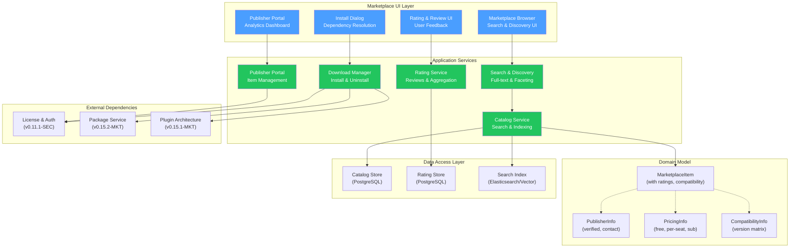

# LCS-SBD-v0.15.3-MKT: Scope Overview — Marketplace Platform

## Document Control

| Field            | Value                                                          |
| :--------------- | :------------------------------------------------------------- |
| **Document ID**  | LCS-SBD-v0.15.3-MKT                                            |
| **Version**      | v0.15.3                                                        |
| **Codename**     | Marketplace Platform (Distribution & Discovery)                |
| **Status**       | Draft                                                          |
| **Last Updated** | 2026-01-31                                                     |
| **Owner**        | Lead Architect                                                 |
| **Depends On**   | v0.15.2-MKT (Agent Packaging), v0.15.1-MKT (Plugin Arch), v0.11.1-SEC (Authorization) |

---

## 1. Executive Summary

### 1.1 The Vision

**v0.15.3-MKT** delivers the **Marketplace Platform** — a complete discovery, rating, and distribution system for sharing agents, plugins, and patterns across the Lexichord community. While v0.15.2-MKT packages agents and v0.15.1-MKT defines plugin architecture, the Marketplace Platform transforms Lexichord from a single-user tool into a collaborative ecosystem where developers can discover, evaluate, install, and monetize custom components.

This release enables:
- **Discovery:** Search and filter marketplace items by category, compatibility, and rating
- **Trust:** Community ratings, reviews, and verified publisher badges
- **Monetization:** Flexible pricing models (free, per-seat, subscription) with license gating
- **Analytics:** Publisher insights into adoption, ratings, and performance
- **Distribution:** One-click installation with dependency resolution

### 1.2 Business Value

- **Community Growth:** Lower barriers to discovery increase component adoption and ecosystem participation.
- **Quality Signals:** Ratings and reviews enable users to identify high-quality, well-maintained components.
- **Monetization Path:** Teams and Enterprise can monetize their custom agents and plugins.
- **Publisher Control:** Verified publishers have dedicated portal for managing listings, pricing, and analytics.
- **Content Curation:** Featured content and collections drive discovery of premium components.
- **Enterprise Compliance:** License gating and compatibility matrix ensure organizations deploy supported versions.

### 1.3 Success Criteria

1. Catalog Service indexes 500+ marketplace items with <100ms search response.
2. Search & Discovery supports full-text, category, compatibility, and trending filters.
3. Rating System captures ≥80% of installations with average rating displayed prominently.
4. Publisher Portal enables analytics dashboard showing adoption metrics and revenue.
5. Download Manager resolves dependencies and handles 99% of installs without errors.
6. Marketplace UI achieves 4.5+ star rating in usability surveys (Teams/Enterprise).
7. License gating enforces tier restrictions: Core (browse only), WriterPro (install + rate), Teams (+ publish), Enterprise (+ analytics + featuring).

---

## 2. Relationship to Prior Versions

The Marketplace Platform integrates critical components from earlier releases:

- **v0.15.2-MKT (Agent Packaging):** Provides packaged agent distribution format (`.lagent` bundles).
- **v0.15.1-MKT (Plugin Architecture):** Defines plugin contract (`ILexichordPlugin`) for extensibility.
- **v0.11.1-SEC (Authorization):** Enforcement of license tiers and publisher verification.

Marketplace Platform sits at the distribution boundary—taking packaged components and making them discoverable, installable, and trustworthy through ratings and verification.

---

## 3. Key Deliverables

### 3.1 Sub-Parts

| Sub-Part | Title | Description | Est. Hours |
|:---------|:------|:------------|:-----------|
| v0.15.3e | Catalog Service | Index marketplace items with search capabilities | 12 |
| v0.15.3f | Search & Discovery | Full-text, faceted, and trending search | 10 |
| v0.15.3g | Rating System | Capture, aggregate, and display community ratings & reviews | 8 |
| v0.15.3h | Publisher Portal | Dashboard for publishers to manage listings and analytics | 10 |
| v0.15.3i | Download Manager | Install/update/uninstall with dependency resolution | 6 |
| v0.15.3j | Marketplace UI | Browse, install, rate UI components | 6 |
| **Total** | | | **52 hours** |

### 3.2 Key Interfaces

```csharp
namespace Lexichord.Abstractions.Marketplace;

/// <summary>
/// Manages the marketplace catalog of agents, plugins, and patterns.
/// </summary>
public interface IMarketplaceCatalog
{
    /// <summary>
    /// Searches the catalog using multiple criteria.
    /// </summary>
    /// <param name="query">Search parameters including keywords, filters, sorting.</param>
    /// <param name="ct">Cancellation token.</param>
    /// <returns>Paginated search results with metadata.</returns>
    Task<CatalogSearchResult> SearchAsync(
        CatalogSearchQuery query,
        CancellationToken ct = default);

    /// <summary>
    /// Gets a specific marketplace item by ID.
    /// </summary>
    /// <param name="itemId">Unique marketplace item identifier.</param>
    /// <param name="ct">Cancellation token.</param>
    /// <returns>Complete item details or null if not found.</returns>
    Task<MarketplaceItem?> GetItemByIdAsync(
        Guid itemId,
        CancellationToken ct = default);

    /// <summary>
    /// Gets detailed publisher information.
    /// </summary>
    /// <param name="publisherId">Publisher identifier.</param>
    /// <param name="ct">Cancellation token.</param>
    /// <returns>Publisher profile with verification status.</returns>
    Task<PublisherInfo?> GetPublisherAsync(
        Guid publisherId,
        CancellationToken ct = default);

    /// <summary>
    /// Lists trending items in a category.
    /// </summary>
    /// <param name="category">Marketplace category.</param>
    /// <param name="limit">Maximum items to return (default 10).</param>
    /// <param name="ct">Cancellation token.</param>
    /// <returns>List of trending items sorted by adoption.</returns>
    Task<IReadOnlyList<MarketplaceItem>> GetTrendingAsync(
        MarketplaceCategory category,
        int limit = 10,
        CancellationToken ct = default);
}

/// <summary>
/// Search query for catalog items with filtering and sorting.
/// </summary>
/// <param name="Query">Freetext search keywords (nullable).</param>
/// <param name="Categories">Filter by category (empty = all).</param>
/// <param name="MarketplaceItemTypes">Filter by type (agent, plugin, pattern).</param>
/// <param name="MinRating">Minimum average rating (0.0-5.0).</param>
/// <param name="CompatibilityVersion">Filter by Lexichord version compatibility.</param>
/// <param name="VerifiedPublishersOnly">Only results from verified publishers.</param>
/// <param name="IncludeFeatured">Include featured items in results.</param>
/// <param name="SortOrder">Sort by relevance, rating, downloads, recent.</param>
/// <param name="PageNumber">1-indexed page number (default 1).</param>
/// <param name="PageSize">Items per page (max 100, default 20).</param>
public record CatalogSearchQuery(
    string? Query = null,
    IReadOnlyList<string>? Categories = null,
    IReadOnlyList<MarketplaceItemType>? MarketplaceItemTypes = null,
    float MinRating = 0f,
    string? CompatibilityVersion = null,
    bool VerifiedPublishersOnly = false,
    bool IncludeFeatured = true,
    SortOrder SortOrder = SortOrder.Relevance,
    int PageNumber = 1,
    int PageSize = 20);

/// <summary>
/// Search result with pagination metadata.
/// </summary>
/// <param name="Items">Matching marketplace items.</param>
/// <param name="TotalCount">Total matching items (all pages).</param>
/// <param name="PageNumber">Current page number.</param>
/// <param name="PageSize">Items per page.</param>
/// <param name="TrendingItems">Trending items in this category (if applicable).</param>
public record CatalogSearchResult(
    IReadOnlyList<MarketplaceItem> Items,
    int TotalCount,
    int PageNumber,
    int PageSize,
    IReadOnlyList<MarketplaceItem>? TrendingItems = null);

/// <summary>
/// Type of marketplace item.
/// </summary>
public enum MarketplaceItemType
{
    Agent,           // AI agent component
    Plugin,          // Plugin extending Lexichord
    Pattern,         // Reusable pattern/template
    Workflow,        // Multi-step workflow
    Integration      // Third-party integration
}

/// <summary>
/// Sort order for search results.
/// </summary>
public enum SortOrder
{
    Relevance,       // Full-text search relevance
    Rating,          // Average rating descending
    Downloads,       // Download count descending
    Recent,          // Recently published descending
    Trending         // Trending velocity (7-day downloads)
}

/// <summary>
/// A complete marketplace item with metadata.
/// </summary>
/// <param name="Id">Unique marketplace identifier.</param>
/// <param name="Name">Item display name.</param>
/// <param name="Description">Short description (max 500 chars).</param>
/// <param name="FullDescription">Detailed markdown description.</param>
/// <param name="ItemType">Type of marketplace item.</param>
/// <param name="Category">Primary category.</param>
/// <param name="Version">Semantic version (e.g., 1.2.3).</param>
/// <param name="PublisherId">ID of publishing organization.</param>
/// <param name="Publisher">Publisher profile (denormalized).</param>
/// <param name="Pricing">Pricing model and information.</param>
/// <param name="AverageRating">Average rating 0.0-5.0 (null = no ratings).</param>
/// <param name="RatingCount">Number of ratings received.</param>
/// <param name="DownloadCount">Total installs/downloads.</param>
/// <param name="CompatibilityInfo">Version compatibility matrix.</param>
/// <param name="Tags">Search tags for categorization.</param>
/// <param name="IconUrl">URL to item icon/thumbnail.</param>
/// <param name="IsVerified">Whether publisher is verified.</param>
/// <param name="IsFeatured">Whether item is featured content.</param>
/// <param name="CreatedAt">Publication timestamp.</param>
/// <param name="UpdatedAt">Last update timestamp.</param>
public record MarketplaceItem(
    Guid Id,
    string Name,
    string Description,
    string FullDescription,
    MarketplaceItemType ItemType,
    string Category,
    string Version,
    Guid PublisherId,
    PublisherInfo Publisher,
    PricingInfo Pricing,
    float? AverageRating,
    int RatingCount,
    int DownloadCount,
    CompatibilityInfo CompatibilityInfo,
    IReadOnlyList<string> Tags,
    string? IconUrl,
    bool IsVerified,
    bool IsFeatured,
    DateTime CreatedAt,
    DateTime UpdatedAt);

/// <summary>
/// Publisher organization profile.
/// </summary>
/// <param name="Id">Publisher identifier.</param>
/// <param name="Name">Organization name.</param>
/// <param name="Website">Publisher website URL.</param>
/// <param name="Logo">Publisher logo URL.</param>
/// <param name="IsVerified">Verified publisher badge.</param>
/// <param name="VerifiedSince">When verification was granted.</param>
/// <param name="ContactEmail">Support email.</param>
public record PublisherInfo(
    Guid Id,
    string Name,
    string? Website,
    string? Logo,
    bool IsVerified,
    DateTime? VerifiedSince,
    string? ContactEmail);

/// <summary>
/// Pricing model and product information.
/// </summary>
/// <param name="Model">Free, per-seat, subscription, or one-time purchase.</param>
/// <param name="BaseCost">Price in USD (null for free).</param>
/// <param name="Currency">ISO 4217 currency code (default USD).</param>
/// <param name="BillingCycle">For subscriptions: monthly, yearly.</param>
/// <param name="TrialDays">Free trial period in days (if applicable).</param>
public record PricingInfo(
    PricingModel Model,
    decimal? BaseCost = null,
    string Currency = "USD",
    string? BillingCycle = null,
    int TrialDays = 0);

/// <summary>
/// Pricing model types.
/// </summary>
public enum PricingModel
{
    Free,            // No cost
    PerSeat,         // Cost per team member
    Subscription,    // Recurring monthly/yearly
    OneTime          // One-time purchase
}

/// <summary>
/// Version compatibility information.
/// </summary>
/// <param name="MinVersion">Minimum Lexichord version required.</param>
/// <param name="MaxVersion">Maximum supported version (null = no limit).</param>
/// <param name="SupportedFeatures">Features required to run (e.g., ["agents", "plugins"]).</param>
public record CompatibilityInfo(
    string MinVersion,
    string? MaxVersion = null,
    IReadOnlyList<string>? SupportedFeatures = null);

/// <summary>
/// Service for capturing and retrieving ratings and reviews.
/// </summary>
public interface IRatingService
{
    /// <summary>
    /// Submits a rating and optional review.
    /// </summary>
    /// <param name="itemId">Marketplace item identifier.</param>
    /// <param name="rating">Rating 1-5 stars.</param>
    /// <param name="reviewText">Optional review text (max 1000 chars).</param>
    /// <param name="ct">Cancellation token.</param>
    /// <returns>Saved review record.</returns>
    Task<Review> SubmitReviewAsync(
        Guid itemId,
        int rating,
        string? reviewText = null,
        CancellationToken ct = default);

    /// <summary>
    /// Gets aggregated ratings for an item.
    /// </summary>
    /// <param name="itemId">Marketplace item identifier.</param>
    /// <param name="ct">Cancellation token.</param>
    /// <returns>Rating statistics and distribution.</returns>
    Task<ItemRatings> GetRatingsAsync(
        Guid itemId,
        CancellationToken ct = default);

    /// <summary>
    /// Gets reviews with pagination and filtering.
    /// </summary>
    /// <param name="query">Review search/filter parameters.</param>
    /// <param name="ct">Cancellation token.</param>
    /// <returns>Paginated reviews.</returns>
    Task<IReadOnlyList<Review>> GetReviewsAsync(
        ReviewQuery query,
        CancellationToken ct = default);

    /// <summary>
    /// Marks a review as helpful.
    /// </summary>
    /// <param name="reviewId">Review identifier.</param>
    /// <param name="ct">Cancellation token.</param>
    Task MarkHelpfulAsync(Guid reviewId, CancellationToken ct = default);
}

/// <summary>
/// A user review with rating.
/// </summary>
/// <param name="Id">Unique review identifier.</param>
/// <param name="ItemId">Marketplace item being reviewed.</param>
/// <param name="UserId">User who submitted the review.</param>
/// <param name="Rating">Rating 1-5 stars.</param>
/// <param name="Title">Review title (optional).</param>
/// <param name="Text">Review body text.</param>
/// <param name="HelpfulCount">Number of users who marked helpful.</param>
/// <param name="UnhelpfulCount">Number of users who marked unhelpful.</param>
/// <param name="CreatedAt">Review submission timestamp.</param>
/// <param name="UpdatedAt">Last edit timestamp.</param>
public record Review(
    Guid Id,
    Guid ItemId,
    Guid UserId,
    int Rating,
    string? Title,
    string Text,
    int HelpfulCount,
    int UnhelpfulCount,
    DateTime CreatedAt,
    DateTime UpdatedAt);

/// <summary>
/// Aggregated rating statistics for a marketplace item.
/// </summary>
/// <param name="ItemId">Item being rated.</param>
/// <param name="AverageRating">Mean rating 0.0-5.0.</param>
/// <param name="TotalRatings">Number of ratings.</param>
/// <param name="Distribution">Count of ratings per star (1-5 index).</param>
/// <param name="RecentTrend">Rating trend last 30 days (+1.0 to -1.0).</param>
public record ItemRatings(
    Guid ItemId,
    float AverageRating,
    int TotalRatings,
    IReadOnlyList<int> Distribution,
    float RecentTrend);

/// <summary>
/// Query for retrieving reviews.
/// </summary>
/// <param name="ItemId">Filter by item.</param>
/// <param name="MinRating">Minimum rating filter.</param>
/// <param name="SortBy">Sort by helpful, recent, rating.</param>
/// <param name="PageNumber">Page number (1-indexed, default 1).</param>
/// <param name="PageSize">Reviews per page (default 10, max 50).</param>
public record ReviewQuery(
    Guid ItemId,
    int MinRating = 1,
    string SortBy = "helpful",
    int PageNumber = 1,
    int PageSize = 10);

/// <summary>
/// Portal for publishers to manage listings and analytics.
/// </summary>
public interface IPublisherPortal
{
    /// <summary>
    /// Publishes or updates a marketplace item.
    /// </summary>
    /// <param name="request">Publication request with item details.</param>
    /// <param name="ct">Cancellation token.</param>
    /// <returns>Publication result with item ID and status.</returns>
    Task<PublishResult> PublishAsync(
        PublishRequest request,
        CancellationToken ct = default);

    /// <summary>
    /// Gets analytics for published items.
    /// </summary>
    /// <param name="publisherId">Publisher identifier.</param>
    /// <param name="dateRange">Optional date range for metrics.</param>
    /// <param name="ct">Cancellation token.</param>
    /// <returns>Analytics dashboard data.</returns>
    Task<PublisherAnalytics> GetAnalyticsAsync(
        Guid publisherId,
        DateRange? dateRange = null,
        CancellationToken ct = default);

    /// <summary>
    /// Updates pricing for a published item.
    /// </summary>
    /// <param name="itemId">Marketplace item identifier.</param>
    /// <param name="pricing">New pricing information.</param>
    /// <param name="ct">Cancellation token.</param>
    Task UpdatePricingAsync(
        Guid itemId,
        PricingInfo pricing,
        CancellationToken ct = default);
}

/// <summary>
/// Request to publish a new marketplace item.
/// </summary>
/// <param name="Name">Item display name.</param>
/// <param name="Description">Short description.</param>
/// <param name="FullDescription">Detailed markdown description.</param>
/// <param name="ItemType">Type of item (agent, plugin, pattern, etc).</param>
/// <param name="Category">Primary category.</param>
/// <param name="Version">Semantic version string.</param>
/// <param name="PackageUrl">URL to packaged item bundle.</param>
/// <param name="Pricing">Pricing model and cost.</param>
/// <param name="MinLexichordVersion">Minimum version required.</param>
/// <param name="Tags">Search tags.</param>
/// <param name="IconUrl">Item icon URL.</param>
public record PublishRequest(
    string Name,
    string Description,
    string FullDescription,
    MarketplaceItemType ItemType,
    string Category,
    string Version,
    string PackageUrl,
    PricingInfo Pricing,
    string MinLexichordVersion,
    IReadOnlyList<string> Tags,
    string? IconUrl = null);

/// <summary>
/// Result of publishing an item.
/// </summary>
/// <param name="ItemId">Newly created item identifier.</param>
/// <param name="Status">Publication status (pending, published, rejected).</param>
/// <param name="Message">Status message (null if successful).</param>
/// <param name="PublishedAt">Timestamp when published (null if pending).</param>
public record PublishResult(
    Guid ItemId,
    string Status,
    string? Message = null,
    DateTime? PublishedAt = null);

/// <summary>
/// Analytics metrics for a publisher.
/// </summary>
/// <param name="PublisherId">Publisher identifier.</param>
/// <param name="TotalDownloads">Total lifetime installs.</param>
/// <param name="AverageRating">Weighted average rating across items.</param>
/// <param name="ItemCount">Number of published items.</param>
/// <param name="RevenueUsd">Revenue in USD (paid items only).</param>
/// <param name="ActiveInstalls">Currently active installations.</param>
/// <param name="RetentionRate">Percentage of users who keep item installed.</param>
/// <param name="TopItems">Top 5 items by downloads.</param>
public record PublisherAnalytics(
    Guid PublisherId,
    int TotalDownloads,
    float AverageRating,
    int ItemCount,
    decimal RevenueUsd,
    int ActiveInstalls,
    float RetentionRate,
    IReadOnlyList<(string Name, int Downloads)> TopItems);
```

### 3.3 Marketplace Architecture



---

## 4. Sub-Part Specifications

### 4.1 v0.15.3e: Catalog Service (12h)

**Goal:** Implement searchable index of marketplace items with full-text, faceted, and trending search capabilities.

**Key Deliverables:**

- `IMarketplaceCatalog` interface in Abstractions
- `MarketplaceItem`, `MarketplaceItemType`, `SortOrder` data models
- PostgreSQL schema for items, publishers, pricing
- Full-text search index with vector embeddings
- Trending algorithm (7-day weighted downloads)
- Dependency resolution graph
- Unit tests for search and trending

**Catalog Database Schema:**

```sql
CREATE TABLE marketplace_items (
    id UUID PRIMARY KEY,
    name VARCHAR(255) NOT NULL,
    description VARCHAR(500),
    full_description TEXT,
    item_type VARCHAR(50) NOT NULL, -- agent, plugin, pattern, workflow, integration
    category VARCHAR(100),
    version VARCHAR(50) NOT NULL,
    publisher_id UUID NOT NULL REFERENCES publishers(id),
    pricing_model VARCHAR(50),
    base_cost DECIMAL(10, 2),
    currency VARCHAR(3) DEFAULT 'USD',
    average_rating FLOAT DEFAULT 0.0,
    rating_count INT DEFAULT 0,
    download_count INT DEFAULT 0,
    min_lexichord_version VARCHAR(50),
    max_lexichord_version VARCHAR(50),
    icon_url TEXT,
    is_verified BOOLEAN DEFAULT FALSE,
    is_featured BOOLEAN DEFAULT FALSE,
    created_at TIMESTAMP DEFAULT CURRENT_TIMESTAMP,
    updated_at TIMESTAMP DEFAULT CURRENT_TIMESTAMP,
    full_text_search TSVECTOR,
    tags TEXT[] -- Array of search tags
);

CREATE INDEX idx_marketplace_items_category ON marketplace_items(category);
CREATE INDEX idx_marketplace_items_rating ON marketplace_items(average_rating DESC);
CREATE INDEX idx_marketplace_items_downloads ON marketplace_items(download_count DESC);
CREATE INDEX idx_marketplace_items_verified ON marketplace_items(is_verified) WHERE is_verified = TRUE;
CREATE INDEX idx_marketplace_items_fts ON marketplace_items USING GIN(full_text_search);

CREATE TABLE publishers (
    id UUID PRIMARY KEY,
    name VARCHAR(255) NOT NULL,
    website VARCHAR(255),
    logo_url TEXT,
    is_verified BOOLEAN DEFAULT FALSE,
    verified_since TIMESTAMP,
    contact_email VARCHAR(255),
    created_at TIMESTAMP DEFAULT CURRENT_TIMESTAMP
);

CREATE TABLE marketplace_dependencies (
    id UUID PRIMARY KEY,
    item_id UUID NOT NULL REFERENCES marketplace_items(id),
    depends_on_item_id UUID NOT NULL REFERENCES marketplace_items(id),
    constraint_version VARCHAR(100), -- Semantic version constraint
    is_optional BOOLEAN DEFAULT FALSE
);

CREATE INDEX idx_dependencies_item ON marketplace_dependencies(item_id);
CREATE INDEX idx_dependencies_depends_on ON marketplace_dependencies(depends_on_item_id);
```

**Search Index Strategy:**

- Full-text search on name, description, tags via PostgreSQL tsvector
- Vector embedding for semantic search (optional Elasticsearch)
- Faceted filtering on category, type, verified status, version compatibility
- Trending calculation: downloads in last 7 days / total downloads

---

### 4.2 v0.15.3f: Search & Discovery (10h)

**Goal:** Implement full-text, faceted, and trending search with category filtering and smart suggestions.

**Key Deliverables:**

- Full-text search with ranking by relevance
- Faceted filtering (category, type, rating, compatibility)
- Trending items algorithm (7-day velocity)
- Category browser with item counts
- Search suggestions (typo correction, popular terms)
- Marketplace Collections (curated lists)
- Unit and integration tests

**Search Query Flow:**

```
User Search Query
    ↓
[Parse & Tokenize]
    ↓
[Apply Filters] (category, type, rating, version)
    ↓
[Full-Text Search] (name, description, tags)
    ↓
[Rank Results] (relevance, rating, downloads)
    ↓
[Paginate] (20 items/page)
    ↓
Marketplace Results
```

**Trending Algorithm:**

```csharp
// Trending Score = (7-day downloads / total downloads) * rating * verified_multiplier
decimal trendingScore =
    (recentDownloads / Math.Max(totalDownloads, 1f)) *
    Math.Max(averageRating / 5f, 0.1m) *
    (isVerified ? 1.5m : 1.0m);
```

---

### 4.3 v0.15.3g: Rating System (8h)

**Goal:** Capture, aggregate, and display community ratings with review moderation.

**Key Deliverables:**

- `IRatingService` interface
- Review submission with rating validation
- Review moderation queue (spam, abuse detection)
- Helpful/unhelpful voting
- Rating aggregation (average, distribution, trend)
- Markdown rendering for reviews
- Unit tests for rating logic

**Rating Database Schema:**

```sql
CREATE TABLE marketplace_reviews (
    id UUID PRIMARY KEY,
    item_id UUID NOT NULL REFERENCES marketplace_items(id),
    user_id UUID NOT NULL,
    rating INT NOT NULL CHECK (rating >= 1 AND rating <= 5),
    title VARCHAR(200),
    text TEXT NOT NULL,
    helpful_count INT DEFAULT 0,
    unhelpful_count INT DEFAULT 0,
    is_verified_purchase BOOLEAN DEFAULT FALSE,
    created_at TIMESTAMP DEFAULT CURRENT_TIMESTAMP,
    updated_at TIMESTAMP DEFAULT CURRENT_TIMESTAMP
);

CREATE INDEX idx_reviews_item ON marketplace_reviews(item_id);
CREATE INDEX idx_reviews_rating ON marketplace_reviews(rating);
CREATE INDEX idx_reviews_helpful ON marketplace_reviews(helpful_count DESC);

CREATE TABLE review_helpful_votes (
    id UUID PRIMARY KEY,
    review_id UUID NOT NULL REFERENCES marketplace_reviews(id),
    user_id UUID NOT NULL,
    is_helpful BOOLEAN NOT NULL,
    created_at TIMESTAMP DEFAULT CURRENT_TIMESTAMP,
    UNIQUE(review_id, user_id) -- One vote per user per review
);
```

---

### 4.4 v0.15.3h: Publisher Portal (10h)

**Goal:** Dashboard for publishers to manage listings, pricing, and view analytics.

**Key Deliverables:**

- `IPublisherPortal` interface
- Dashboard with adoption metrics (downloads, active users, retention)
- Item management (create, edit, update version, unpublish)
- Pricing configuration (free/paid/per-seat/subscription)
- Analytics graphs (download trend, rating distribution, revenue)
- Revenue tracking and payout management
- Publisher verification workflow
- Integration with license system for paid items
- Unit and integration tests

**Publisher Portal UI Structure:**

```
┌─────────────────────────────────────────────────────────────────┐
│  Publisher Portal — My Items                                    │
├─────────────────────────────────────────────────────────────────┤
│ [📊 Analytics] [📦 Manage Items] [💰 Revenue] [⚙️ Settings]     │
├─────────────────────────────────────────────────────────────────┤
│                                                                 │
│  Total Downloads: 15,234   Avg Rating: 4.2 ⭐   Revenue: $3,420│
│                                                                 │
│  MY PUBLISHED ITEMS:                                            │
│                                                                 │
│  [Agent] GPT-4 Integration v1.2.1                               │
│  Downloads: 8,234 | Rating: 4.5 ⭐ | Status: ✅ Published       │
│  [✏️ Edit] [📊 Analytics] [💲 Pricing] [🔗 Share]                │
│                                                                 │
│  [Plugin] Code Review Automation v2.0.0                         │
│  Downloads: 4,120 | Rating: 4.1 ⭐ | Status: ✅ Published       │
│  [✏️ Edit] [📊 Analytics] [💲 Pricing] [🔗 Share]                │
│                                                                 │
│  [📦 Publish New Item]                                          │
│                                                                 │
└─────────────────────────────────────────────────────────────────┘
```

---

### 4.5 v0.15.3i: Download Manager (6h)

**Goal:** Handle installation, update, and removal of marketplace items with dependency resolution.

**Key Deliverables:**

- `IDownloadManager` interface
- Dependency resolution with conflict detection
- Async installation with progress tracking
- Version compatibility checking
- License tier enforcement (license gating)
- Rollback on failure
- Uninstall with cleanup
- Installed items registry
- Unit tests for dependency resolution

**Installation Flow:**

```
User Clicks "Install"
    ↓
[Check License Tier] → Enforce pricing
    ↓
[Resolve Dependencies] → Check version constraints
    ↓
[Download Package] → From CDN or marketplace
    ↓
[Verify Signature] → Security check
    ↓
[Extract Bundle] → To plugins directory
    ↓
[Register Plugin] → Update installed items registry
    ↓
[Initialize Component] → Call ILexichordPlugin.Initialize()
    ↓
Installation Complete ✓
```

---

### 4.6 v0.15.3j: Marketplace UI (6h)

**Goal:** Build the user-facing marketplace browser with search, filtering, installation, and rating.

**Key Deliverables:**

- Marketplace browser window (WPF/Avalonia)
- Search bar with suggestions
- Faceted filter sidebar (category, type, rating, version)
- Item grid/list view with icon, name, rating, downloads
- Item detail modal with full description, reviews, compatibility
- Install button with progress bar
- Rating & review submission UI
- License tier upgrade prompts for restricted features
- Unit tests for UI state management

**Marketplace UI Wireframe:**

```
┌──────────────────────────────────────────────────────────────────────┐
│ 🔍 [Search agents, plugins...]                                       │
├────────────────────────────────────────────────────────────────────┬─┤
│ FILTERS            │ RESULTS                                        │ │
│                    │                                                │ │
│ Category ▼         │ [Agent] Task Scheduler v1.0          ⭐ 4.8   │ │
│  ☑ All             │ 2,341 downloads | By: Lexichord Inc  ✓        │ │
│  ☑ Agents (42)     │ Automate task scheduling with cron...          │ │
│  ☑ Plugins (31)    │ [Install] [Add to Collection]                 │ │
│  ☑ Patterns (18)   │                                                │ │
│                    │ [Plugin] Code Review v2.1            ⭐ 4.2   │ │
│ Type ▼             │ 1,823 downloads | By: DevTools Inc   ✓        │ │
│  ☑ All             │ Automated code review with ML...               │ │
│  ☑ Agent           │ [Install] [Add to Collection]                 │ │
│  ☑ Plugin          │                                                │ │
│  ☑ Pattern         │ [Pattern] REST API Template v1.0     ⭐ 4.5   │ │
│                    │ 892 downloads | By: API Masters               │ │
│ Rating ▼           │ Boilerplate for RESTful APIs...                │ │
│  ◉ Any             │ [Install] [Add to Collection]                 │ │
│  ○ 4+ stars        │                                                │ │
│  ○ 3+ stars        │ [Next Page →]                                 │ │
│  ○ 2+ stars        │                                                │ │
│                    │                                                │ │
│ License ▼          │                                                │ │
│  ☑ Free (71)       │                                                │ │
│  ☑ Paid (20)       │                                                │ │
│                    │                                                │ │
└────────────────────────────────────────────────────────────────────┴─┘
```

---

## 5. Dependencies

| Component | Source | Usage |
|:----------|:-------|:------|
| `ILexichordPlugin` | v0.15.1-MKT | Plugin contract for extensibility |
| `IPackageService` | v0.15.2-MKT | Package distribution format |
| `ILicenseContext` | v0.11.1-SEC | License tier gating enforcement |
| `IAuthorization` | v0.11.1-SEC | Publisher verification & authorization |
| PostgreSQL | External | Persistent storage for catalog, ratings |
| Elasticsearch (optional) | External | Full-text search acceleration |

---

## 6. License Gating

| Feature | Core | WriterPro | Teams | Enterprise |
|:--------|:-----|:----------|:------|:-----------|
| Browse marketplace | ✓ | ✓ | ✓ | ✓ |
| Search & filter | ✓ | ✓ | ✓ | ✓ |
| View ratings & reviews | ✓ | ✓ | ✓ | ✓ |
| Install free items | ✓ | ✓ | ✓ | ✓ |
| Submit ratings & reviews | — | ✓ | ✓ | ✓ |
| Install paid items | — | — | ✓ | ✓ |
| Publish items | — | — | ✓ | ✓ |
| Publisher portal | — | — | ✓ | ✓ |
| Analytics (adoption, revenue) | — | — | — | ✓ |
| Featured placement | — | — | — | ✓ |
| Custom collections | — | — | — | ✓ |

---

## 7. Performance Targets

| Metric | Target | Measurement |
|:-------|:-------|:------------|
| Search response time | <100ms | Benchmark with 10k items |
| Catalog load time | <500ms | Load all marketplace on startup |
| Install resolution | <5s | Dependency graph calculation |
| Trending calculation | <30s | Daily batch job |
| UI load time | <1s | Marketplace window open |
| Search index size | <100MB | Full-text index footprint |
| Review fetch latency | <50ms | Load top 10 reviews |

---

## 8. Risks & Mitigations

| Risk | Impact | Probability | Mitigation |
|:-----|:-------|:------------|:-----------|
| Malicious packages distributed | High | Low | Code review, signature verification, abuse reports |
| Dependency resolution conflicts | Medium | Medium | Constraint solver, version compatibility matrix |
| Search index inconsistency | Medium | Low | Event-sourced catalog updates, cache invalidation |
| Review spam and abuse | Medium | Medium | Rate limiting, NLP moderation, user reports |
| Rating manipulation | Medium | Low | Verified purchase flag, temporal analysis |
| Publisher verification fraud | High | Low | Manual review + document verification |
| Scale issues (10k+ items) | Medium | Low | Elasticsearch, pagination, caching |

---

## 9. Success Metrics

| Metric | Target | Measurement |
|:-------|:-------|:------------|
| Marketplace items indexed | 500+ | Catalog size |
| Search success rate | 95%+ | User finds desired item in 3 searches |
| Installation success rate | 99%+ | Dependency resolution without errors |
| Average item rating | 4.0+ | Quality signal of indexed items |
| Publisher adoption | 50+ | Active publishing organizations |
| Review submission rate | 30%+ | % of installers who rate items |
| Repeat installation rate | 70%+ | Users who install multiple items |

---

## 10. What This Enables

After v0.15.3-MKT, the Lexichord ecosystem will support:

- **v0.15.4-MKT (Marketplace Growth):** Community collections, trending dashboards, featured placement campaigns.
- **v0.16.x (Monetization Scaling):** Advanced analytics, revenue optimization, affiliate programs.
- **v0.16.x+ (Ecosystem):** Plugin marketplace becomes primary distribution channel for agents, patterns, and integrations.

---

## 11. Testing Strategy

### 11.1 Unit Tests

```csharp
[Trait("Category", "Unit")]
[Trait("Feature", "v0.15.3e")]
public class CatalogServiceTests
{
    [Fact]
    public async Task SearchAsync_WithTrendingSort_ReturnsByDownloadVelocity()
    {
        // Arrange: Create items with different trending metrics
        var item1 = new MarketplaceItem(/* 100 downloads, 20 recent */);
        var item2 = new MarketplaceItem(/* 50 downloads, 30 recent */);

        var query = new CatalogSearchQuery(SortOrder: SortOrder.Trending);

        // Act
        var result = await _sut.SearchAsync(query);

        // Assert: Item with higher velocity trends higher
        result.Items[0].Id.Should().Be(item2.Id);
    }

    [Fact]
    public async Task GetItemByIdAsync_WithDependencies_LoadsDependencyGraph()
    {
        // Arrange
        var itemId = Guid.NewGuid();
        var depId = Guid.NewGuid();

        // Act
        var item = await _sut.GetItemByIdAsync(itemId);

        // Assert
        item?.Dependencies?.Should().Contain(d => d.DependsOnItemId == depId);
    }
}

[Trait("Category", "Unit")]
[Trait("Feature", "v0.15.3i")]
public class DownloadManagerTests
{
    [Fact]
    public async Task InstallAsync_WithUnmetDependency_ThrowsIncompatibilityException()
    {
        // Arrange: Item requires v0.15.2 but only v0.15.1 is available
        var installRequest = new InstallRequest(itemId: Guid.NewGuid());

        // Act & Assert
        await _sut.Invoking(x => x.InstallAsync(installRequest))
            .Should().ThrowAsync<DependencyConflictException>();
    }

    [Fact]
    public async Task InstallAsync_WithCoreUserAndPaidItem_EnforcesLicenseGate()
    {
        // Arrange
        var paidItem = new MarketplaceItem(Pricing: new(Model: PricingModel.PerSeat));
        _licenseContext.CurrentTier.Returns(LicenseTier.Core);

        // Act & Assert
        await _sut.Invoking(x => x.InstallAsync(new InstallRequest(paidItem.Id)))
            .Should().ThrowAsync<LicenseGatingException>();
    }
}
```

### 11.2 Integration Tests

```csharp
[Trait("Category", "Integration")]
[Trait("Feature", "v0.15.3")]
public class MarketplaceIntegrationTests
{
    [Fact]
    public async Task CompleteMarketplaceFlow_PublishSearchInstallRate()
    {
        // Arrange
        var publisherId = Guid.NewGuid();
        var itemRequest = new PublishRequest(
            Name: "Test Agent",
            ItemType: MarketplaceItemType.Agent,
            Version: "1.0.0",
            /* ... */);

        // Act 1: Publish item
        var publishResult = await _publisherPortal.PublishAsync(itemRequest);
        publishResult.Status.Should().Be("published");

        // Act 2: Search for item
        var searchResult = await _catalog.SearchAsync(
            new(Query: "Test Agent"));
        searchResult.Items.Should().ContainSingle(i => i.Id == publishResult.ItemId);

        // Act 3: Install item (Teams license)
        _licenseContext.CurrentTier.Returns(LicenseTier.Teams);
        var installResult = await _downloadManager.InstallAsync(
            new(ItemId: publishResult.ItemId));
        installResult.Success.Should().BeTrue();

        // Act 4: Submit rating
        await _ratingService.SubmitReviewAsync(
            publishResult.ItemId,
            rating: 5,
            reviewText: "Excellent!");

        // Act 5: Verify rating appears in catalog
        var updatedItem = await _catalog.GetItemByIdAsync(publishResult.ItemId);
        updatedItem?.AverageRating.Should().BeGreaterThan(0);
    }
}
```

### 11.3 Performance Tests

```bash
# Search performance with 10k items
dotnet test --filter "FullyQualifiedName~MarketplacePerformanceTests"

# Benchmark installation resolution
dotnet test --filter "FullyQualifiedName~DependencyResolutionBenchmarks"

# Rating aggregation performance
dotnet test --filter "FullyQualifiedName~RatingAggregationBenchmarks"
```

---

## 12. MediatR Events

### 12.1 Marketplace Events

```csharp
namespace Lexichord.Modules.Marketplace.Events;

/// <summary>
/// Published when an item is successfully published to marketplace.
/// </summary>
public record ItemPublishedEvent(
    Guid ItemId,
    string Name,
    Guid PublisherId,
    DateTime PublishedAt) : INotification;

/// <summary>
/// Published when an item receives a new rating/review.
/// </summary>
public record ReviewSubmittedEvent(
    Guid ReviewId,
    Guid ItemId,
    int Rating,
    Guid UserId,
    DateTime SubmittedAt) : INotification;

/// <summary>
/// Published when an item is installed by a user.
/// </summary>
public record ItemInstalledEvent(
    Guid ItemId,
    Guid UserId,
    string Version,
    DateTime InstalledAt) : INotification;

/// <summary>
/// Published when an item is uninstalled.
/// </summary>
public record ItemUninstalledEvent(
    Guid ItemId,
    Guid UserId,
    DateTime UninstalledAt) : INotification;

/// <summary>
/// Published to recalculate trending scores (daily).
/// </summary>
public record TrendingRecalculatedEvent(
    DateTime CalculatedAt) : INotification;

/// <summary>
/// Published when publisher rating is updated.
/// </summary>
public record PublisherVerificationStatusChangedEvent(
    Guid PublisherId,
    bool IsNowVerified,
    DateTime UpdatedAt) : INotification;
```

---

## 13. Observability & Logging

| Level   | Source              | Message Template |
|:--------|:-------------------|:-----------------|
| Debug   | CatalogService      | `"Searching marketplace: {QueryTerm}, filters: {FilterCount}"` |
| Debug   | DownloadManager     | `"Resolving dependencies for {ItemId}: {DependencyCount} items"` |
| Info    | RatingService       | `"Review submitted for {ItemId}: {Rating} stars"` |
| Info    | PublisherPortal     | `"Item published: {Name} v{Version} by {PublisherId}"` |
| Warning | DownloadManager     | `"Dependency conflict detected: {ConflictDescription}"` |
| Warning | RatingService       | `"Potential review spam detected: {ReviewId}"` |
| Error   | CatalogService      | `"Failed to index item {ItemId}: {Error}"` |
| Error   | DownloadManager     | `"Installation failed for {ItemId}: {Error}"` |

---

## 14. Database Schema Overview

The Marketplace Platform uses PostgreSQL with the following core tables:

- `marketplace_items` — Catalog of agents, plugins, patterns
- `publishers` — Publishing organizations with verification status
- `marketplace_dependencies` — Dependency graph between items
- `marketplace_reviews` — User ratings and reviews
- `review_helpful_votes` — Voting on review helpfulness
- `installed_items` — Registry of user-installed components

Full schema in section 4.1 and 4.3.

---

## 15. Acceptance Criteria (QA)

| # | Category | Criterion |
|:--|:---------|:----------|
| 1 | **Functional** | User can search marketplace by keyword with <100ms response |
| 2 | **Functional** | Search results can be filtered by category, type, rating, version |
| 3 | **Functional** | User can install free items with single click |
| 4 | **Functional** | User can submit 1-5 star rating and text review |
| 5 | **Functional** | Publisher can publish new item and see it in marketplace |
| 6 | **Functional** | Publisher analytics show download trend, ratings, revenue |
| 7 | **License Gate** | Core users cannot install paid items |
| 8 | **License Gate** | Only Teams+ can access Publisher Portal |
| 9 | **Performance** | Installation completes with dependency resolution in <5s |
| 10 | **Performance** | Marketplace UI loads in <1 second |
| 11 | **Compatibility** | Items show min/max version compatibility in details |
| 12 | **Security** | Reviews with spam/abuse can be flagged and hidden |
| 13 | **Edge Case** | Circular dependency detection prevents installation |
| 14 | **Edge Case** | Installing item with missing dependency shows clear error |
| 15 | **Accessibility** | Search, filtering, installation flow keyboard navigable |

---

## 16. Marketplace Content Moderation Policy

- **Auto-moderation:** Spam detection on reviews, inappropriate language filtering
- **Manual review:** New items from unverified publishers
- **Appeal process:** Rejected publishers can appeal to support team
- **Removal criteria:** Malware, security vulnerabilities, copyright infringement, abandoned projects (1+ year no updates)

---

## 17. Example Data Models (Reference)

### Category Options

```csharp
public static class MarketplaceCategories
{
    public const string AgentAssistants = "Agent Assistants";
    public const string DataProcessing = "Data Processing";
    public const string CodeGeneration = "Code Generation";
    public const string Documentation = "Documentation";
    public const string Integration = "Integration";
    public const string Analytics = "Analytics";
    public const string Security = "Security";
    public const string Productivity = "Productivity";
}
```

### Supported Features (for Compatibility)

```csharp
public static class SupportedFeatures
{
    public const string Agents = "agents";
    public const string Plugins = "plugins";
    public const string Patterns = "patterns";
    public const string Workflows = "workflows";
    public const string LLMIntegration = "llm_integration";
    public const string VectorSearch = "vector_search";
}
```

---

## 18. Future Enhancements (Not in v0.15.3)

| Feature | Target Version | Description |
|:--------|:-------|:------------|
| Marketplace Collections | v0.15.4 | Curated lists of complementary items |
| Advanced Search | v0.15.4 | Vector semantic search, tag-based discovery |
| Affiliate Program | v0.16.x | Revenue sharing for marketers/referrers |
| Plugin Versioning | v0.16.x | Support multiple versions of same item |
| A/B Testing | v0.16.x | Test featured placements, pricing models |
| Machine Learning | v0.17.x | Personalized recommendations based on usage |

---

## 19. Verification Commands

```bash
# Build solution
dotnet build

# Run marketplace unit tests
dotnet test --filter "Category=Unit&Feature~v0.15.3"

# Run specific component tests
dotnet test --filter "FullyQualifiedName~CatalogServiceTests"
dotnet test --filter "FullyQualifiedName~RatingServiceTests"
dotnet test --filter "FullyQualifiedName~DownloadManagerTests"

# Run integration tests
dotnet test --filter "Category=Integration&Feature~v0.15.3"

# Performance benchmarks
dotnet test --filter "FullyQualifiedName~*PerformanceTests" --configuration Release

# Manual verification:
# 1. Open Marketplace from Lexichord UI
# 2. Search for "agent" - should return results in <100ms
# 3. Filter by category "Agent Assistants" - UI responsive
# 4. Click on item - detail view loads correctly
# 5. As WriterPro user: Submit rating and review
# 6. As Teams user: Publish test item from portal
# 7. As Teams user: View analytics for published item
# 8. Install free item - should complete successfully
# 9. Try installing paid item as Core user - should show upgrade prompt
```

---

## 20. Deliverable Checklist

| # | Deliverable | Status |
|:--|:------------|:-------|
| 1 | `IMarketplaceCatalog` interface | [ ] |
| 2 | `MarketplaceItem` and related data models | [ ] |
| 3 | PostgreSQL catalog schema | [ ] |
| 4 | Full-text search index | [ ] |
| 5 | Trending algorithm implementation | [ ] |
| 6 | `IRatingService` interface | [ ] |
| 7 | Review submission and aggregation | [ ] |
| 8 | Rating database schema | [ ] |
| 9 | `IPublisherPortal` interface | [ ] |
| 10 | Publisher dashboard UI | [ ] |
| 11 | Analytics metrics calculation | [ ] |
| 12 | `IDownloadManager` interface | [ ] |
| 13 | Dependency resolution solver | [ ] |
| 14 | Installation with progress tracking | [ ] |
| 15 | License gating enforcement | [ ] |
| 16 | Marketplace browser UI (Search, Filter, Install, Rate) | [ ] |
| 17 | Item detail view with reviews | [ ] |
| 18 | MediatR events (ItemPublished, ReviewSubmitted, ItemInstalled) | [ ] |
| 19 | Unit tests for all services | [ ] |
| 20 | Integration tests for end-to-end flows | [ ] |
| 21 | DI registration in marketplace module | [ ] |

---

## 21. Related Documentation

- **v0.15.2-MKT Spec:** Agent Packaging and Distribution Format
- **v0.15.1-MKT Spec:** Plugin Architecture and ILexichordPlugin Contract
- **v0.11.1-SEC Spec:** Authorization and License Tier Enforcement
- **Roadmap v0.15.x:** Full feature roadmap for release cycle

---

## 22. Sign-Off

Document prepared for v0.15.3-MKT scope review. Specification subject to refinement pending architecture review and stakeholder feedback.

**Owner:** Lead Architect
**Version:** Draft
**Date:** 2026-01-31
