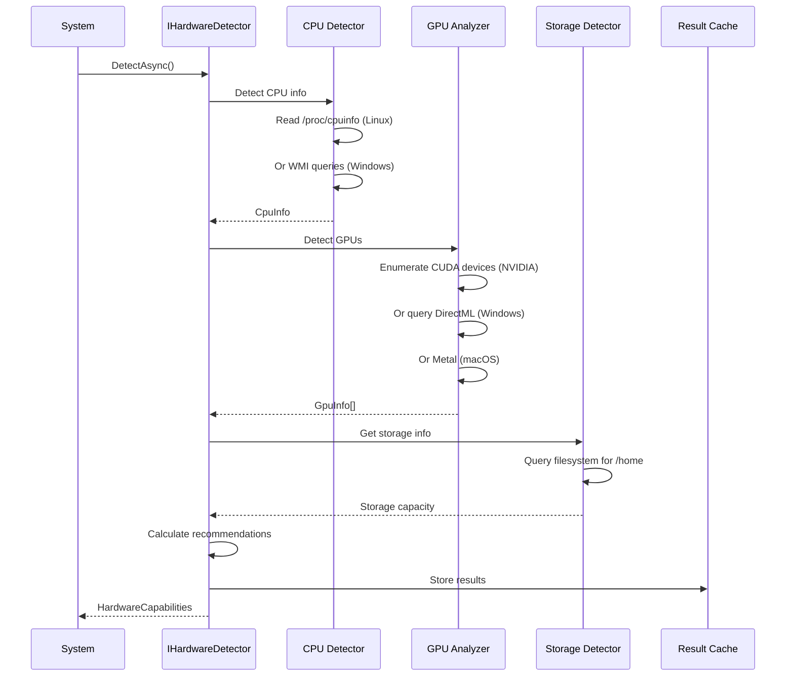

# LCS-SBD-v0.16.1-LLM: Scope Overview — Hardware & Backends

## Document Control

| Field            | Value                                                        |
| :--------------- | :----------------------------------------------------------- |
| **Document ID**  | LCS-SBD-v0.16.1-LLM                                          |
| **Version**      | v0.16.1                                                      |
| **Codename**     | Hardware & Backends                                          |
| **Status**       | Draft                                                        |
| **Last Updated** | 2026-01-31                                                   |
| **Owner**        | LLM Integration Lead                                         |
| **Depends On**   | Core system architecture; Ollama SDK                         |

---

## 1. Executive Summary

### 1.1 The Vision

**v0.16.1-LLM** delivers **Hardware & Backends** — the foundational infrastructure for local LLM inference that establishes:

- Comprehensive hardware detection capabilities for CPU, GPU, memory, and storage resources
- A pluggable backend abstraction layer supporting multiple inference engines
- Ollama as the primary recommended backend with hybrid system/bundled deployment options
- GPU capability analysis with vendor-specific optimizations (NVIDIA, AMD, Apple, Intel)
- Real-time backend health monitoring and automatic fallback mechanisms
- Hardware-aware model size recommendations based on detected capabilities
- A settings-driven UI for managing hardware, backends, and model deployment
- License-gated access to backend features across all subscription tiers

This is the cornerstone of the LLM subsystem—without robust hardware detection and backend abstraction, users cannot reliably run local models across diverse hardware configurations.

### 1.2 Business Value

- **Accessibility:** Users can run LLMs locally regardless of hardware configuration.
- **Flexibility:** Support for multiple backends (Ollama, LM Studio, llama.cpp, vLLM, etc.) prevents vendor lock-in.
- **Reliability:** Hardware detection and health monitoring prevent mysterious failures and silent performance degradation.
- **Guidance:** Model size recommendations eliminate guesswork about which models fit their hardware.
- **Deployment:** Bundled Ollama option provides zero-config experience; system Ollama option supports advanced users.
- **Scalability:** Backend abstraction enables future addition of cloud inference, API services, and custom backends.
- **Transparency:** Users understand hardware limitations and can make informed decisions about model selection.

### 1.3 Success Criteria

1. Hardware detection identifies CPU cores, RAM, GPU type/VRAM, disk space, and OS architecture.
2. GPU capability analyzer correctly identifies NVIDIA CUDA, AMD ROCm, Apple Metal, Intel, and Vulkan support.
3. Backend abstraction layer supports ≥4 different inference engines with consistent interface.
4. Ollama backend integration works with both system-installed and bundled versions.
5. Backend health monitor detects and reports unavailability, high latency, or resource exhaustion within 5 seconds.
6. Model size recommendations provide ≥4 viable options across size/quantization spectrum.
7. Hardware settings UI displays all detected capabilities and allows backend configuration.
8. All backend operations (list models, load model, generate) complete within documented timeouts.

---

## 2. Key Deliverables

### 2.1 Sub-Parts

| Sub-Part | Title | Description | Est. Hours |
|:---------|:------|:------------|:-----------|
| v0.16.1e | Hardware Detection Service | System CPU, GPU, memory, storage detection | 12 |
| v0.16.1f | GPU Capability Analyzer | GPU vendor/driver detection, compute capability analysis | 10 |
| v0.16.1g | Backend Abstraction Layer | IInferenceBackend interface, backend manager, type system | 10 |
| v0.16.1h | Ollama Backend Integration | Ollama protocol implementation, model management, streaming | 10 |
| v0.16.1i | Backend Health Monitor | Health checks, status tracking, automatic recovery | 6 |
| v0.16.1j | Hardware Settings UI | Settings page, hardware display, backend configuration | 6 |
| **Total** | | | **54 hours** |

### 2.2 Core Interfaces

```csharp
/// <summary>
/// Detects and reports hardware capabilities for local LLM inference.
/// </summary>
public interface IHardwareDetector
{
    /// <summary>
    /// Detect all hardware capabilities of the current system.
    /// </summary>
    Task<HardwareCapabilities> DetectAsync(CancellationToken ct = default);

    /// <summary>
    /// Get detailed information about available GPUs.
    /// </summary>
    Task<IReadOnlyList<GpuInfo>> GetGpusAsync(CancellationToken ct = default);

    /// <summary>
    /// Check if a specific backend is supported on this hardware.
    /// </summary>
    Task<BackendSupport> CheckBackendSupportAsync(
        InferenceBackendType backend,
        CancellationToken ct = default);

    /// <summary>
    /// Observable stream of hardware changes (GPU added/removed, memory changes).
    /// </summary>
    IObservable<HardwareChangeEvent> HardwareChanges { get; }
}

/// <summary>
/// Complete hardware capabilities of the system.
/// </summary>
public record HardwareCapabilities
{
    // System identification
    public required string OperatingSystem { get; init; }
    public required string Architecture { get; init; }  // x64, arm64

    // CPU
    public required CpuInfo Cpu { get; init; }

    // Memory
    public required long TotalRamBytes { get; init; }
    public required long AvailableRamBytes { get; init; }

    // GPU(s)
    public IReadOnlyList<GpuInfo> Gpus { get; init; } = [];
    public GpuInfo? PrimaryGpu => Gpus.FirstOrDefault();
    public long TotalVramBytes => Gpus.Sum(g => g.VramBytes);

    // Storage
    public required long AvailableDiskBytes { get; init; }
    public required string ModelStoragePath { get; init; }

    // Derived recommendations
    public required ModelSizeRecommendation Recommendation { get; init; }
}

public record CpuInfo
{
    public required string Name { get; init; }
    public required int PhysicalCores { get; init; }
    public required int LogicalCores { get; init; }
    public long? L3CacheBytes { get; init; }
    public bool SupportsAvx { get; init; }
    public bool SupportsAvx2 { get; init; }
    public bool SupportsAvx512 { get; init; }
}

public record GpuInfo
{
    public required string Id { get; init; }
    public required string Name { get; init; }
    public required GpuVendor Vendor { get; init; }
    public required long VramBytes { get; init; }
    public long? AvailableVramBytes { get; init; }
    public required GpuBackend SupportedBackend { get; init; }
    public string? DriverVersion { get; init; }
    public int? ComputeCapability { get; init; }  // CUDA compute capability
    public bool IsIntegrated { get; init; }
}

public enum GpuVendor
{
    Unknown, Nvidia, Amd, Intel, Apple
}

public enum GpuBackend
{
    None,       // No GPU acceleration
    Cuda,       // NVIDIA CUDA
    Metal,      // Apple Metal
    Rocm,       // AMD ROCm (Linux)
    Vulkan,     // Cross-platform (fallback)
    DirectML,   // Windows DirectX ML
    Sycl        // Intel oneAPI
}

/// <summary>
/// Model size recommendations based on hardware.
/// </summary>
public record ModelSizeRecommendation
{
    public required ModelSizeCategory MaxRecommendedSize { get; init; }
    public required QuantizationType RecommendedQuantization { get; init; }
    public required int RecommendedContextLength { get; init; }
    public required int EstimatedGpuLayers { get; init; }
    public required InferenceMode RecommendedMode { get; init; }
    public string? Explanation { get; init; }

    public IReadOnlyList<ModelSizeOption> AvailableOptions { get; init; } = [];
}

public record ModelSizeOption
{
    public required ModelSizeCategory Size { get; init; }
    public required QuantizationType Quantization { get; init; }
    public required CompatibilityLevel Compatibility { get; init; }
    public required long EstimatedMemoryBytes { get; init; }
    public float? EstimatedTokensPerSecond { get; init; }
}

public enum ModelSizeCategory
{
    Tiny,       // 1-3B parameters
    Small,      // 7-8B parameters
    Medium,     // 13-14B parameters
    Large,      // 30-34B parameters
    XLarge,     // 65-70B parameters
    XXLarge     // 100B+ parameters
}

public enum CompatibilityLevel
{
    Optimal,        // Will run great, recommended
    Comfortable,    // Will run well with good performance
    Constrained,    // Will run but may be slow
    Marginal,       // Might work with aggressive settings
    Incompatible    // Won't run on this hardware
}

public enum InferenceMode
{
    FullGpu,        // All layers on GPU
    HybridGpuCpu,   // Some layers on GPU, rest on CPU
    CpuOnly         // All layers on CPU
}

/// <summary>
/// Quantization types for model compression.
/// </summary>
public enum QuantizationType
{
    F32,        // Full 32-bit precision (largest, most accurate)
    F16,        // Half 16-bit precision
    BF16,       // Brain float 16-bit
    Q8_0,       // 8-bit quantization
    Q6_K,       // 6-bit k-quant
    Q5_K_M,     // 5-bit k-quant medium
    Q5_K_S,     // 5-bit k-quant small
    Q4_K_M,     // 4-bit k-quant medium (recommended balance)
    Q4_K_S,     // 4-bit k-quant small
    Q4_0,       // 4-bit legacy
    Q3_K_M,     // 3-bit k-quant medium
    Q3_K_S,     // 3-bit k-quant small
    Q2_K,       // 2-bit (significant quality loss)
    IQ4_XS,     // Importance-weighted 4-bit extra small
    IQ4_NL,     // Importance-weighted 4-bit non-linear
    IQ3_M,      // Importance-weighted 3-bit medium
    IQ2_XXS     // Importance-weighted 2-bit (experimental)
}

/// <summary>
/// Abstraction over different LLM inference backends.
/// </summary>
public interface IInferenceBackend
{
    /// <summary>
    /// Backend identifier.
    /// </summary>
    InferenceBackendType Type { get; }

    /// <summary>
    /// Human-readable name.
    /// </summary>
    string Name { get; }

    /// <summary>
    /// Whether this backend is currently available.
    /// </summary>
    Task<bool> IsAvailableAsync(CancellationToken ct = default);

    /// <summary>
    /// Get backend version and capabilities.
    /// </summary>
    Task<BackendInfo> GetInfoAsync(CancellationToken ct = default);

    /// <summary>
    /// List models available through this backend.
    /// </summary>
    Task<IReadOnlyList<BackendModel>> ListModelsAsync(CancellationToken ct = default);

    /// <summary>
    /// Load a model for inference.
    /// </summary>
    Task<IModelInstance> LoadModelAsync(
        string modelId,
        ModelLoadOptions options,
        CancellationToken ct = default);

    /// <summary>
    /// Pull/download a model through this backend.
    /// </summary>
    Task<ModelPullResult> PullModelAsync(
        string modelId,
        IProgress<ModelPullProgress>? progress = null,
        CancellationToken ct = default);

    /// <summary>
    /// Delete a model from this backend.
    /// </summary>
    Task DeleteModelAsync(string modelId, CancellationToken ct = default);

    /// <summary>
    /// Health check for the backend.
    /// </summary>
    Task<BackendHealth> CheckHealthAsync(CancellationToken ct = default);
}

public enum InferenceBackendType
{
    Ollama,         // Ollama server
    LmStudio,       // LM Studio local server
    LlamaCpp,       // Direct llama.cpp integration
    Vllm,           // vLLM server
    TextGenWebUI,   // Text Generation WebUI
    LocalAI,        // LocalAI server
    Custom          // Custom OpenAI-compatible endpoint
}

public record BackendInfo
{
    public required InferenceBackendType Type { get; init; }
    public required string Version { get; init; }
    public IReadOnlyList<GpuBackend> SupportedGpuBackends { get; init; } = [];
    public IReadOnlyList<string> SupportedModelFormats { get; init; } = [];
    public bool SupportsStreaming { get; init; }
    public bool SupportsEmbeddings { get; init; }
    public bool SupportsConcurrentRequests { get; init; }
    public int? MaxConcurrentRequests { get; init; }
    public Uri? Endpoint { get; init; }
}

public record BackendModel
{
    public required string Id { get; init; }
    public required string Name { get; init; }
    public long? SizeBytes { get; init; }
    public string? Family { get; init; }        // llama, mistral, etc.
    public string? ParameterSize { get; init; } // 7B, 13B, etc.
    public QuantizationType? Quantization { get; init; }
    public int? ContextLength { get; init; }
    public DateTimeOffset? ModifiedAt { get; init; }
}

public record ModelLoadOptions
{
    public int? NumGpuLayers { get; init; }     // -1 for all, 0 for CPU only
    public int? ContextLength { get; init; }
    public int? NumThreads { get; init; }
    public int? BatchSize { get; init; }
    public bool UseMemoryMap { get; init; } = true;
    public bool UseMemoryLock { get; init; } = false;
    public string? GpuDeviceId { get; init; }   // For multi-GPU
    public float? RopeFrequencyBase { get; init; }
    public float? RopeFrequencyScale { get; init; }
}

/// <summary>
/// A loaded model instance ready for inference.
/// </summary>
public interface IModelInstance : IAsyncDisposable
{
    Guid InstanceId { get; }
    string ModelId { get; }
    ModelInstanceStatus Status { get; }
    ModelLoadOptions LoadOptions { get; }

    /// <summary>
    /// Generate a completion (non-streaming).
    /// </summary>
    Task<GenerationResult> GenerateAsync(
        GenerationRequest request,
        CancellationToken ct = default);

    /// <summary>
    /// Generate a completion with streaming.
    /// </summary>
    IAsyncEnumerable<GenerationToken> GenerateStreamAsync(
        GenerationRequest request,
        CancellationToken ct = default);

    /// <summary>
    /// Generate embeddings for text.
    /// </summary>
    Task<EmbeddingResult> EmbedAsync(
        EmbeddingRequest request,
        CancellationToken ct = default);

    /// <summary>
    /// Get current resource usage.
    /// </summary>
    Task<ModelResourceUsage> GetResourceUsageAsync(CancellationToken ct = default);

    /// <summary>
    /// Observable stream of status changes.
    /// </summary>
    IObservable<ModelInstanceStatus> StatusChanges { get; }
}

public enum ModelInstanceStatus
{
    Loading,
    Ready,
    Generating,
    Embedding,
    Unloading,
    Error,
    Disposed
}

public record GenerationRequest
{
    public required string Prompt { get; init; }
    public string? SystemPrompt { get; init; }
    public IReadOnlyList<ChatMessage>? Messages { get; init; }

    // Generation parameters
    public int? MaxTokens { get; init; }
    public float? Temperature { get; init; }
    public float? TopP { get; init; }
    public int? TopK { get; init; }
    public float? RepetitionPenalty { get; init; }
    public float? FrequencyPenalty { get; init; }
    public float? PresencePenalty { get; init; }
    public IReadOnlyList<string>? StopSequences { get; init; }
    public int? Seed { get; init; }

    // Output format
    public ResponseFormat? Format { get; init; }
}

public record ChatMessage
{
    public required ChatRole Role { get; init; }
    public required string Content { get; init; }
}

public enum ChatRole { System, User, Assistant }

public record GenerationResult
{
    public required string Text { get; init; }
    public required GenerationUsage Usage { get; init; }
    public string? FinishReason { get; init; }
    public TimeSpan Duration { get; init; }
    public float TokensPerSecond { get; init; }
}

public record GenerationToken
{
    public required string Text { get; init; }
    public bool IsComplete { get; init; }
    public string? FinishReason { get; init; }
}

public record GenerationUsage
{
    public int PromptTokens { get; init; }
    public int CompletionTokens { get; init; }
    public int TotalTokens => PromptTokens + CompletionTokens;
}

public record EmbeddingRequest
{
    public required string Text { get; init; }
}

public record EmbeddingResult
{
    public required float[] Embedding { get; init; }
    public required GenerationUsage Usage { get; init; }
}

public record ModelResourceUsage
{
    public long RamBytes { get; init; }
    public long? VramBytes { get; init; }
    public float? GpuUtilizationPercent { get; init; }
    public float CpuUtilizationPercent { get; init; }
    public int LoadedLayers { get; init; }
    public int GpuLayers { get; init; }
    public int CpuLayers { get; init; }
}

public record ModelPullResult
{
    public bool Success { get; init; }
    public string? Error { get; init; }
    public long? SizeBytes { get; init; }
}

public record ModelPullProgress
{
    public long BytesDownloaded { get; init; }
    public long TotalBytes { get; init; }
    public string? CurrentFile { get; init; }
    public float PercentComplete { get; init; }
}

public record BackendHealth
{
    public bool IsHealthy { get; init; }
    public string? ErrorMessage { get; init; }
    public TimeSpan? ResponseTime { get; init; }
    public int? LoadedModels { get; init; }
    public long? MemoryUsageBytes { get; init; }
    public DateTimeOffset LastChecked { get; init; }
}

/// <summary>
/// Manages multiple inference backends.
/// </summary>
public interface IBackendManager
{
    /// <summary>
    /// Get all registered backends.
    /// </summary>
    Task<IReadOnlyList<IInferenceBackend>> GetBackendsAsync(
        CancellationToken ct = default);

    /// <summary>
    /// Get available (running) backends.
    /// </summary>
    Task<IReadOnlyList<IInferenceBackend>> GetAvailableBackendsAsync(
        CancellationToken ct = default);

    /// <summary>
    /// Get the preferred backend based on configuration and availability.
    /// </summary>
    Task<IInferenceBackend?> GetPreferredBackendAsync(
        CancellationToken ct = default);

    /// <summary>
    /// Register a custom backend.
    /// </summary>
    Task RegisterBackendAsync(
        IInferenceBackend backend,
        CancellationToken ct = default);

    /// <summary>
    /// Set the preferred backend.
    /// </summary>
    Task SetPreferredBackendAsync(
        InferenceBackendType type,
        CancellationToken ct = default);

    /// <summary>
    /// Start a backend if it's a managed service (e.g., bundled Ollama).
    /// </summary>
    Task<BackendStartResult> StartBackendAsync(
        InferenceBackendType type,
        CancellationToken ct = default);

    /// <summary>
    /// Stop a managed backend.
    /// </summary>
    Task StopBackendAsync(
        InferenceBackendType type,
        CancellationToken ct = default);

    /// <summary>
    /// Observable stream of backend status changes.
    /// </summary>
    IObservable<BackendStatusEvent> StatusChanges { get; }
}

public record BackendStartResult
{
    public bool Success { get; init; }
    public string? Error { get; init; }
    public Uri? Endpoint { get; init; }
    public int? ProcessId { get; init; }
}

public record BackendStatusEvent
{
    public required InferenceBackendType Backend { get; init; }
    public required BackendStatus Status { get; init; }
    public string? Message { get; init; }
    public DateTimeOffset Timestamp { get; init; }
}

public enum BackendStatus
{
    Unknown, Starting, Running, Stopping, Stopped, Error
}

public record BackendSupport
{
    public InferenceBackendType Backend { get; init; }
    public bool IsSupported { get; init; }
    public string? Reason { get; init; }
    public IReadOnlyList<string> RequiredDrivers { get; init; } = [];
}

public record HardwareChangeEvent
{
    public required string ChangeType { get; init; }  // "gpu_added", "gpu_removed", "memory_change"
    public string? Details { get; init; }
    public DateTimeOffset Timestamp { get; init; }
}
```

---

## 3. Architecture

### 3.1 Component Overview

```
┌─────────────────────────────────────────────────────────────────────────────┐
│                       Hardware & Backends Layer                              │
├─────────────────────────────────────────────────────────────────────────────┤
│                                                                              │
│  ┌─────────────────────────────────────────────────────────────────────┐   │
│  │                    IHardwareDetector                                 │   │
│  │  ┌──────────────┐  ┌──────────────┐  ┌──────────────┐              │   │
│  │  │    Detect    │  │   Get GPUs   │  │  Check       │              │   │
│  │  │  Capabilities│  │   Info       │  │  Backend     │              │   │
│  │  │              │  │              │  │  Support     │              │   │
│  │  └──────┬───────┘  └──────┬───────┘  └──────┬───────┘              │   │
│  │         │                 │                 │                       │   │
│  │         ▼                 ▼                 ▼                       │   │
│  │  ┌─────────────────────────────────────────────────────────────┐   │   │
│  │  │            System Information Detectors                      │   │   │
│  │  │  ┌──────────────┐  ┌──────────────┐  ┌──────────────┐      │   │   │
│  │  │  │   CPU Info   │  │   GPU Analyzer  │  │  Memory &  │      │   │   │
│  │  │  │   (cores,    │  │   (Vendor,   │  │  Disk Info  │      │   │   │
│  │  │  │   features)  │  │   VRAM,      │  │             │      │   │   │
│  │  │  │              │  │   capability)   │  │             │      │   │   │
│  │  │  └──────────────┘  └──────────────┘  └──────────────┘      │   │   │
│  │  └─────────────────────────────────────────────────────────────┘   │   │
│  └─────────────────────────────────────────────────────────────────────┘   │
│                                     │                                       │
│  ┌─────────────────────────────────────────────────────────────────────┐   │
│  │                       IBackendManager                                │   │
│  │  ┌──────────────┐  ┌──────────────┐  ┌──────────────┐              │   │
│  │  │  Get All     │  │  Get         │  │  Register/   │              │   │
│  │  │  Backends    │  │  Available   │  │  Start/Stop  │              │   │
│  │  │              │  │  Backends    │  │  Backends    │              │   │
│  │  └──────┬───────┘  └──────┬───────┘  └──────┬───────┘              │   │
│  │         │                 │                 │                       │   │
│  │         ▼                 ▼                 ▼                       │   │
│  │  ┌─────────────────────────────────────────────────────────────┐   │   │
│  │  │           Backend Registry & Configuration                   │   │   │
│  │  │  ┌──────────────────────────────────────────────────────┐   │   │   │
│  │  │  │  Ollama  │  LM Studio  │  llama.cpp  │  vLLM  │...  │   │   │   │
│  │  │  └──────────────────────────────────────────────────────┘   │   │   │
│  │  └─────────────────────────────────────────────────────────────┘   │   │
│  └─────────────────────────────────────────────────────────────────────┘   │
│                                     │                                       │
│  ┌─────────────────────────────────────────────────────────────────────┐   │
│  │                    IInferenceBackend                                │   │
│  │  (Implemented by Ollama, LM Studio, llama.cpp, etc.)               │   │
│  │  ┌──────────────┐  ┌──────────────┐  ┌──────────────┐              │   │
│  │  │  List        │  │  Load Model  │  │  Health      │              │   │
│  │  │  Models      │  │  Instance    │  │  Check       │              │   │
│  │  │              │  │              │  │              │              │   │
│  │  └──────┬───────┘  └──────┬───────┘  └──────┬───────┘              │   │
│  │         │                 │                 │                       │   │
│  │         ▼                 ▼                 ▼                       │   │
│  │  ┌─────────────────────────────────────────────────────────────┐   │   │
│  │  │              IModelInstance (Loaded Model)                   │   │   │
│  │  │  ┌──────────────┐  ┌──────────────┐  ┌──────────────┐      │   │   │
│  │  │  │   Generate   │  │   Generate   │  │   Embed      │      │   │   │
│  │  │  │   (Sync)     │  │   Stream     │  │              │      │   │   │
│  │  │  │              │  │              │  │              │      │   │   │
│  │  │  └──────────────┘  └──────────────┘  └──────────────┘      │   │   │
│  │  └─────────────────────────────────────────────────────────────┘   │   │
│  └─────────────────────────────────────────────────────────────────────┘   │
│                                     │                                       │
│  ┌─────────────────────────────────────────────────────────────────────┐   │
│  │                   Backend Health Monitor                             │   │
│  │  ┌──────────────┐  ┌──────────────┐  ┌──────────────┐              │   │
│  │  │ Periodic     │  │ Event-driven │  │ Automatic    │              │   │
│  │  │ Checks       │  │ Status       │  │ Recovery &   │              │   │
│  │  │ (every 30s)  │  │ Reporting    │  │ Fallback     │              │   │
│  │  └──────────────┘  └──────────────┘  └──────────────┘              │   │
│  └─────────────────────────────────────────────────────────────────────┘   │
│                                                                              │
│  ┌─────────────────────────────────────────────────────────────────────┐   │
│  │             Hardware Settings UI (Settings Page)                    │   │
│  │  ┌──────────────┐  ┌──────────────┐  ┌──────────────┐              │   │
│  │  │ Hardware     │  │ Backend      │  │ Model Load   │              │   │
│  │  │ Display      │  │ Configuration│  │ Options      │              │   │
│  │  │              │  │              │  │              │              │   │
│  │  └──────────────┘  └──────────────┘  └──────────────┘              │   │
│  └─────────────────────────────────────────────────────────────────────┘   │
│                                                                              │
└─────────────────────────────────────────────────────────────────────────────┘
```

### 3.2 Hardware Detection Flow



### 3.3 Ollama Hybrid Deployment Model

```
┌──────────────────────────────────────────────────────────────────────┐
│           Ollama Backend Integration (Hybrid Approach)               │
├──────────────────────────────────────────────────────────────────────┤
│                                                                       │
│  On Application Startup:                                             │
│  ┌─────────────────────────────────────────────────────────────┐   │
│  │                                                              │   │
│  │  1. Check for System Ollama                                 │   │
│  │     • Try connecting to http://localhost:11434              │   │
│  │     • If available → register as "system" backend            │   │
│  │     • Skip bundled version                                  │   │
│  │                                                              │   │
│  │  2. If System Ollama not found                              │   │
│  │     • Check for bundled Ollama binary in app directory      │   │
│  │     • If not present, offer download in Settings            │   │
│  │     • If present → start on-demand when needed              │   │
│  │                                                              │   │
│  │  3. Hybrid Configuration                                    │   │
│  │     • Both can coexist (user chooses primary)               │   │
│  │     • Model library can be shared if configured              │   │
│  │     • Automatic fallback if primary fails                   │   │
│  │                                                              │   │
│  └─────────────────────────────────────────────────────────────┘   │
│                                                                       │
│  Runtime Decision Tree:                                              │
│                                                                       │
│           Want to use Ollama?                                        │
│                 │                                                    │
│        ┌────────┴────────┐                                           │
│        ▼                 ▼                                           │
│   System Ollama    Bundled Ollama                                    │
│   available?       available?                                        │
│        │                 │                                           │
│   YES  │ NO         YES  │  NO                                       │
│        │                 │                                           │
│        ▼                 ▼                                           │
│      Use it    → Try bundled   → Offer download                      │
│                                                                       │
└──────────────────────────────────────────────────────────────────────┘
```

---

## 4. Data Model

### 4.1 Database Schema

```sql
-- Backend configurations
CREATE TABLE backend_configurations (
    id UUID PRIMARY KEY DEFAULT gen_random_uuid(),
    user_id UUID NOT NULL,
    backend_type VARCHAR(50) NOT NULL,
    backend_name VARCHAR(200) NOT NULL,
    endpoint_url VARCHAR(500),
    api_key VARCHAR(500),
    is_preferred BOOLEAN NOT NULL DEFAULT FALSE,
    is_bundled BOOLEAN NOT NULL DEFAULT FALSE,
    auto_start BOOLEAN NOT NULL DEFAULT FALSE,
    created_at TIMESTAMPTZ NOT NULL DEFAULT NOW(),
    updated_at TIMESTAMPTZ NOT NULL DEFAULT NOW(),

    UNIQUE(user_id, backend_type, endpoint_url),
    INDEX idx_backend_user ON backend_configurations(user_id),
    INDEX idx_backend_preferred ON backend_configurations(user_id, is_preferred)
);

-- Hardware detection cache
CREATE TABLE hardware_detection_cache (
    id UUID PRIMARY KEY DEFAULT gen_random_uuid(),
    user_id UUID NOT NULL,
    os_name VARCHAR(100) NOT NULL,
    architecture VARCHAR(50) NOT NULL,
    cpu_name VARCHAR(200),
    cpu_cores INT,
    cpu_threads INT,
    total_ram_bytes BIGINT,
    available_ram_bytes BIGINT,
    total_vram_bytes BIGINT,
    disk_available_bytes BIGINT,
    model_storage_path VARCHAR(500),
    hardware_json JSONB,
    recommendation_json JSONB,
    detected_at TIMESTAMPTZ NOT NULL DEFAULT NOW(),
    expires_at TIMESTAMPTZ,

    INDEX idx_hardware_user ON hardware_detection_cache(user_id),
    INDEX idx_hardware_expires ON hardware_detection_cache(expires_at)
);

-- GPU information cache
CREATE TABLE gpu_cache (
    id UUID PRIMARY KEY DEFAULT gen_random_uuid(),
    user_id UUID NOT NULL,
    gpu_id VARCHAR(100) NOT NULL,
    vendor VARCHAR(50) NOT NULL,
    name VARCHAR(200) NOT NULL,
    vram_bytes BIGINT,
    available_vram_bytes BIGINT,
    backend_type VARCHAR(50),
    driver_version VARCHAR(100),
    compute_capability INT,
    is_integrated BOOLEAN,
    last_updated TIMESTAMPTZ NOT NULL DEFAULT NOW(),

    UNIQUE(user_id, gpu_id),
    INDEX idx_gpu_user ON gpu_cache(user_id)
);

-- Backend health history
CREATE TABLE backend_health_history (
    id UUID PRIMARY KEY DEFAULT gen_random_uuid(),
    user_id UUID NOT NULL,
    backend_type VARCHAR(50) NOT NULL,
    is_healthy BOOLEAN NOT NULL,
    response_time_ms INT,
    error_message TEXT,
    checked_at TIMESTAMPTZ NOT NULL DEFAULT NOW(),

    INDEX idx_health_backend ON backend_health_history(user_id, backend_type, checked_at DESC),
    INDEX idx_health_recent ON backend_health_history(checked_at DESC) WHERE checked_at > NOW() - INTERVAL '7 days'
);

-- Model compatibility cache
CREATE TABLE model_compatibility_cache (
    id UUID PRIMARY KEY DEFAULT gen_random_uuid(),
    user_id UUID NOT NULL,
    model_id VARCHAR(200) NOT NULL,
    hardware_signature VARCHAR(200) NOT NULL,
    compatibility_level VARCHAR(50) NOT NULL,
    estimated_memory_bytes BIGINT,
    estimated_tokens_per_second FLOAT,
    cached_at TIMESTAMPTZ NOT NULL DEFAULT NOW(),

    UNIQUE(user_id, model_id, hardware_signature),
    INDEX idx_compat_user ON model_compatibility_cache(user_id)
);
```

### 4.2 Hardware Capabilities JSON Structure

```json
{
  "os": "Linux",
  "architecture": "x64",
  "cpu": {
    "name": "Intel(R) Core(TM) i9-10900K CPU @ 3.70GHz",
    "physicalCores": 10,
    "logicalCores": 20,
    "l3CacheBytes": 20971520,
    "supportsAvx": true,
    "supportsAvx2": true,
    "supportsAvx512": true
  },
  "memory": {
    "totalRamBytes": 68719476736,
    "availableRamBytes": 34359738368
  },
  "gpus": [
    {
      "id": "cuda:0",
      "name": "NVIDIA GeForce RTX 3090",
      "vendor": "Nvidia",
      "vramBytes": 24696061952,
      "availableVramBytes": 22548578304,
      "supportedBackend": "Cuda",
      "driverVersion": "525.125.06",
      "computeCapability": 86,
      "isIntegrated": false
    }
  ],
  "storage": {
    "availableDiskBytes": 1099511627776,
    "modelStoragePath": "/home/user/.cache/lexichord/models"
  },
  "recommendation": {
    "maxRecommendedSize": "XLarge",
    "recommendedQuantization": "Q4_K_M",
    "recommendedContextLength": 8192,
    "estimatedGpuLayers": 95,
    "recommendedMode": "FullGpu",
    "explanation": "High-end desktop with RTX 3090 supports full model quantization",
    "availableOptions": [
      {
        "size": "XLarge",
        "quantization": "Q4_K_M",
        "compatibility": "Optimal",
        "estimatedMemoryBytes": 18253611008,
        "estimatedTokensPerSecond": 25.5
      },
      {
        "size": "Large",
        "quantization": "Q4_K_M",
        "compatibility": "Optimal",
        "estimatedMemoryBytes": 15032385536,
        "estimatedTokensPerSecond": 35.0
      }
    ]
  }
}
```

---

## 5. Ollama Integration Specification

### 5.1 Ollama API Endpoints

```
GET    /api/tags                    - List models
POST   /api/pull                    - Download model
DELETE /api/delete                  - Delete model
POST   /api/generate                - Generate (streaming)
POST   /api/embed                   - Generate embeddings
GET    /api/ps                      - Show running models
POST   /api/show                    - Get model info
GET    /api/version                 - Get server version
POST   /api/chat                    - Chat endpoint (OpenAI compatible)
```

### 5.2 Model Discovery

- Ollama library available at `https://ollama.ai/library`
- Models are identified as `namespace/name:tag` (e.g., `meta-llama/llama2:7b-chat`)
- Model metadata includes parameters, quantization, context length
- Local models stored in `OLLAMA_MODELS` directory

---

## 6. Hardware Settings UI

### 6.1 Hardware Information Display

```
┌────────────────────────────────────────────────────────────────────────────┐
│ Settings > Hardware & Model Inference                                      │
├────────────────────────────────────────────────────────────────────────────┤
│                                                                             │
│ System Information                                                          │
│ ──────────────────────────────────────────────────────────────────────     │
│ OS: macOS 14.2 (Sonoma)  Architecture: arm64                               │
│                                                                             │
│ CPU                                                                         │
│ ──────────────────────────────────────────────────────────────────────     │
│ Model:    Apple M3 Max                                                      │
│ Cores:    12 physical (8 performance + 4 efficiency)                       │
│ Threads:  12 logical                                                       │
│ Cache:    18 MB L3                                                         │
│ Features: AVX2, Metal acceleration                                         │
│                                                                             │
│ Memory                                                                      │
│ ──────────────────────────────────────────────────────────────────────     │
│ Total:     36 GB RAM                                                        │
│ Available: 18 GB RAM (50%)                                                 │
│                                                                             │
│ GPU (1 of 1)                                                               │
│ ──────────────────────────────────────────────────────────────────────     │
│ ┌─ GPU 0: Apple M3 Max GPU ───────────────────────────────────────────┐   │
│ │ Vendor:         Apple                                                │   │
│ │ VRAM:           18 GB                                                │   │
│ │ Available VRAM: 16 GB (89%)                                          │   │
│ │ Backend:        Metal (Recommended for macOS)                        │   │
│ │ Integrated:     Yes (System on a Chip)                               │   │
│ │                                                                       │   │
│ │ Supported Backends: Metal, CPU                                       │   │
│ │ Optimal Inference:  Full GPU (all layers on accelerator)             │   │
│ └───────────────────────────────────────────────────────────────────────┘   │
│                                                                             │
│ Storage                                                                     │
│ ──────────────────────────────────────────────────────────────────────     │
│ Model Path: /Users/user/.cache/lexichord/models                           │
│ Available:  500 GB                                                         │
│                                                                             │
│ Model Size Recommendations                                                 │
│ ──────────────────────────────────────────────────────────────────────     │
│ ┌─ Recommended: 70B Model (Q4_K_M quantization) ─────────────────────┐   │
│ │ This hardware can run large models efficiently.                    │   │
│ │ Expected memory: 42 GB (fits in system + GPU)                      │   │
│ │ Expected speed:  25 tokens/second                                  │   │
│ │ Compatibility:   ✓ Optimal                                         │   │
│ └───────────────────────────────────────────────────────────────────────┘   │
│                                                                             │
│ ┌─ Alternative Options ─────────────────────────────────────────────┐     │
│ │ • 30B model (Q4_K_M):   30 GB memory, 40 tokens/s                 │     │
│ │ • 7B model (Q4_K_M):    5 GB memory, 80 tokens/s                  │     │
│ └───────────────────────────────────────────────────────────────────────┘   │
│                                                                             │
└────────────────────────────────────────────────────────────────────────────┘
```

### 6.2 Backend Configuration UI

```
┌────────────────────────────────────────────────────────────────────────────┐
│ Settings > Hardware & Model Inference > Backends                           │
├────────────────────────────────────────────────────────────────────────────┤
│                                                                             │
│ Inference Backends                                                          │
│ ──────────────────────────────────────────────────────────────────────     │
│                                                                             │
│ ┌─ Ollama (System) ─────────────────────────── ✓ Running ───────────┐    │
│ │ Status:       Connected (http://localhost:11434)                 │    │
│ │ Version:      0.1.0                                              │    │
│ │ Models:       Llama 2 7B, Mistral 7B, Neural Chat 7B (3 total)   │    │
│ │ Primary:      ☑ Use as primary backend                           │    │
│ │ Auto-start:   ☐ Start when Lexichord launches                    │    │
│ │                                                                  │    │
│ │ [View Models] [Manage Models] [Stop Service]                    │    │
│ └────────────────────────────────────────────────────────────────────┘    │
│                                                                             │
│ ┌─ Ollama (Bundled) ────────────────────── ⚠ Not Running ──────────┐    │
│ │ Status:       Not running (can be started on-demand)             │    │
│ │ Version:      0.1.0                                              │    │
│ │ Models:       None (same library as system Ollama if configured) │    │
│ │ Primary:      ☐ Use as primary backend                           │    │
│ │ Auto-start:   ☐ Start when Lexichord launches                    │    │
│ │                                                                  │    │
│ │ [Start Service] [Download Update] [Uninstall]                   │    │
│ └────────────────────────────────────────────────────────────────────┘    │
│                                                                             │
│ ┌─ LM Studio (Custom) ────────────────────── ✓ Available ──────────┐    │
│ │ Status:       Connected (http://127.0.0.1:1234)                 │    │
│ │ Type:         Custom OpenAI-compatible endpoint                  │    │
│ │ Primary:      ☐ Use as primary backend                           │    │
│ │                                                                  │    │
│ │ [Configure] [Test Connection] [Remove]                          │    │
│ └────────────────────────────────────────────────────────────────────┘    │
│                                                                             │
│ Add Backend                                                                 │
│ ┌────────────────────────────────────────────────────────────────────┐    │
│ │ Type:         [Ollama ▼]                                          │    │
│ │ Name:         [Custom Ollama Instance        ]                    │    │
│ │ Endpoint:     [http://192.168.1.100:11434    ]                    │    │
│ │ API Key:      [                              ] (optional)         │    │
│ │                                                                  │    │
│ │ [Test Connection] [Add Backend]                                 │    │
│ └────────────────────────────────────────────────────────────────────┘    │
│                                                                             │
└────────────────────────────────────────────────────────────────────────────┘
```

---

## 7. Dependencies

| Component | Source | Usage |
|:----------|:-------|:------|
| `Ollama REST API` | External | Model inference, embeddings |
| `System APIs` | OS (Linux/Windows/macOS) | CPU, GPU, memory detection |
| `NVIDIA CUDA Toolkit` | External | NVIDIA GPU detection & acceleration |
| `AMD ROCm` | External | AMD GPU acceleration |
| `Apple Metal` | System | Metal acceleration on macOS |
| `LM Studio API` | External | Alternative backend support |
| `llama.cpp` | External | Alternative backend support |
| `vLLM` | External | Alternative backend support |
| `ILicenseService` | v0.2.1a | License tier checks |
| `ISettingsService` | v0.1.6a | Backend/hardware configuration |
| `IMediator` | v0.0.7a | Backend status events |

---

## 8. License Gating

| Tier | Features |
|:-----|:---------|
| **Core** | Hardware detection (read-only); read-only backend status display |
| **WriterPro** | 1 active backend; basic model loading; hardware detection; recommended models only |
| **Teams** | Multiple backends (up to 5); all configuration options; custom Ollama endpoints; model management |
| **Enterprise** | Unlimited backends; managed backend deployment; custom backend development; API access |

---

## 9. Performance Targets

| Metric | Target | Measurement |
|:-------|:-------|:------------|
| Hardware detection | <2 seconds | Initial detection on app startup |
| GPU capability analysis | <1 second | Per GPU analyzed |
| Backend availability check | <500ms | Per backend check |
| Backend health check | <2 seconds | Periodic check interval: 30s |
| Model list retrieval | <3 seconds | From Ollama with 50+ models |
| Model load time | <30 seconds | Loading 7B model on GPU |
| Token generation | ≥15 tokens/s | Baseline on recommended hardware |
| Recommendation calculation | <200ms | Based on detected hardware |

---

## 10. Testing Strategy

### 10.1 Unit Tests

- CPU/GPU/Memory detection on various platforms (Linux, Windows, macOS)
- Quantization enum coverage and memory calculations
- Backend type enum coverage
- Model size recommendation algorithm with edge cases
- Health check status transitions

### 10.2 Integration Tests

- Full hardware detection flow on target platforms
- Backend registration and availability checks
- Ollama backend model listing and loading
- Health monitor periodic checks and recovery
- License tier gating for backend operations
- Multi-backend failover scenarios

### 10.3 Hardware-Specific Tests

- NVIDIA GPU detection (CUDA, multiple GPUs)
- AMD GPU detection (ROCm on Linux)
- Apple Metal GPU detection (M1/M2/M3)
- Intel Arc GPU detection
- CPU feature detection (AVX, AVX2, AVX512)

### 10.4 Performance Tests

- Hardware detection completes <2s even with 4+ GPUs
- Health monitoring overhead <5% CPU
- Model recommendations calculated <200ms
- Backend response times tracked and alerted

### 10.5 UI Tests

- Hardware information displays accurately
- Backend status updates in real-time
- Settings UI responds to hardware changes
- Model recommendations update based on selected backend

---

## 11. Risks & Mitigations

| Risk | Impact | Mitigation |
|:-----|:-------|:-----------|
| GPU detection fails on exotic hardware | Cannot run local models | Graceful fallback to CPU; clear error messaging |
| Bundled Ollama version conflicts with system | Version confusion | Isolate bundled version; clear UI labeling |
| Backend becomes unavailable mid-inference | Loss of inference results | Automatic health checks; status notification |
| Model memory calculations inaccurate | OOM during inference | Conservative estimates; monitor actual usage |
| Multiple backends interfere with each other | Unpredictable behavior | Clear isolation; single primary backend |
| Driver updates break GPU detection | Silent GPU loss | Driver version detection; fallback validation |
| Poor performance on underpowered hardware | Bad user experience | Realistic recommendations; aggressive quantization |
| Ollama API changes break integration | Service unavailable | Version pinning; API compatibility testing |

---

## 12. MediatR Events

| Event | Description |
|:------|:------------|
| `HardwareDetectedEvent` | Hardware capabilities detected/updated |
| `GpuDetectedEvent` | GPU device detected and analyzed |
| `BackendRegisteredEvent` | New backend registered |
| `BackendAvailableEvent` | Backend became available |
| `BackendUnavailableEvent` | Backend became unavailable |
| `BackendHealthCheckEvent` | Backend health check completed |
| `BackendStatusChangedEvent` | Backend status changed (Starting, Running, Stopped, Error) |
| `ModelLoadedEvent` | Model instance loaded and ready |
| `ModelLoadFailedEvent` | Model load failed |
| `BackendPreferenceChangedEvent` | User selected different primary backend |
| `HardwareRecommendationChangedEvent` | Model recommendations updated |

---

## 13. Sub-Part Breakdown

### v0.16.1e: Hardware Detection Service (12h)

**Scope:**
- Detect CPU properties: name, physical/logical cores, cache, feature flags (AVX, AVX2, AVX512)
- Detect system memory: total, available
- Detect storage: disk space, model directory location
- Enumerate GPUs (separate into v0.16.1f)
- Implement caching with 1-hour expiration
- Observable stream for hardware changes

**Deliverables:**
- `IHardwareDetector` interface
- `HardwareCapabilities`, `CpuInfo` records
- Platform-specific implementations (Linux, Windows, macOS)
- Hardware change detection and observable

### v0.16.1f: GPU Capability Analyzer (10h)

**Scope:**
- Detect GPU presence: NVIDIA, AMD, Intel, Apple
- Query GPU properties: VRAM, driver version, compute capability
- Determine backend support: CUDA, ROCm, Metal, Vulkan, DirectML, SYCL
- Calculate GPU layer count for model quantization
- Estimate token generation speed per GPU type

**Deliverables:**
- `GpuInfo`, `GpuVendor`, `GpuBackend` records
- GPU enumeration for each platform
- GPU feature detection and capability analysis
- Performance metrics per GPU type

### v0.16.1g: Backend Abstraction Layer (10h)

**Scope:**
- Define `IInferenceBackend` interface with common operations
- Implement `IBackendManager` for backend registry
- Support backend registration, enumeration, preference management
- Type system for `InferenceBackendType` enum
- Health status tracking and status events
- License gating for multi-backend support

**Deliverables:**
- Backend abstraction interfaces
- Backend registry and manager implementation
- Backend configuration persistence
- Status tracking and events

### v0.16.1h: Ollama Backend Integration (10h)

**Scope:**
- Implement Ollama REST API client
- Hybrid Ollama deployment: system vs. bundled
- Model listing, pulling, deletion via Ollama
- Model loading with `ModelLoadOptions`
- Streaming generation support
- Embeddings generation
- Model instance lifecycle management

**Deliverables:**
- `OllamaBackend` implementation of `IInferenceBackend`
- Ollama client for REST API
- Bundled Ollama management (download, start, stop)
- Model loading and generation
- Full streaming support

### v0.16.1i: Backend Health Monitor (6h)

**Scope:**
- Periodic health checks (configurable, default 30s)
- Health check implementation: ping endpoint, check status, measure latency
- Status transitions and events
- Automatic recovery attempts (restart, failover)
- Health history tracking for diagnostics
- Alert for backend unavailability

**Deliverables:**
- `IBackendHealthMonitor` service
- Health check scheduler
- Status tracking and events
- Recovery mechanism implementation

### v0.16.1j: Hardware Settings UI (6h)

**Scope:**
- Hardware information display (CPU, GPU, memory, storage)
- Model size recommendation display and selection
- Backend configuration UI
- Backend status display with actions (start, stop, configure)
- Add custom backend form
- Settings persistence

**Deliverables:**
- Hardware settings page component
- Hardware display section
- Backend configuration section
- Model recommendation section
- Settings page integration

---

## Appendix A: Quantization Size Reference

```
Model Parameter Count → Quantization → Approximate Memory

7B Parameters:
- F32: 28 GB RAM
- F16: 14 GB RAM
- Q4_K_M: 3.5 GB RAM (recommended for most systems)
- Q3_K_M: 2.5 GB RAM
- Q2_K: 1.8 GB RAM

13B Parameters:
- Q4_K_M: 6.5 GB RAM
- Q3_K_M: 4.5 GB RAM
- Q2_K: 3.5 GB RAM

30B Parameters:
- Q4_K_M: 15 GB RAM
- Q3_K_M: 10 GB RAM

70B Parameters:
- Q4_K_M: 35 GB RAM
- Q3_K_M: 25 GB RAM
```

---

## Appendix B: Backend Support Matrix

```
┌──────────────────┬──────────┬────────────┬────────────┬──────────┐
│ Backend          │ Linux    │ Windows    │ macOS      │ Cost     │
├──────────────────┼──────────┼────────────┼────────────┼──────────┤
│ Ollama           │ ✓ CUDA   │ ✓ CPU      │ ✓ Metal    │ Free     │
│                  │ ✓ ROCm   │            │            │          │
│ LM Studio        │ ✓ CUDA   │ ✓ CUDA     │ ✓ Metal    │ Free     │
│ llama.cpp        │ ✓ All    │ ✓ All      │ ✓ All      │ Free     │
│ vLLM             │ ✓ CUDA   │ ✓ CPU      │ ○ Limited  │ Free     │
│ Text Gen WebUI   │ ✓ CUDA   │ ✓ CUDA     │ ✓ Metal    │ Free     │
│ LocalAI          │ ✓ GPU    │ ✓ GPU      │ ✓ Metal    │ Free     │
└──────────────────┴──────────┴────────────┴────────────┴──────────┘
```

---

**Document End**
