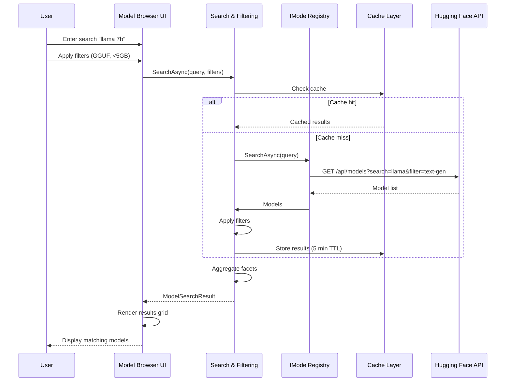
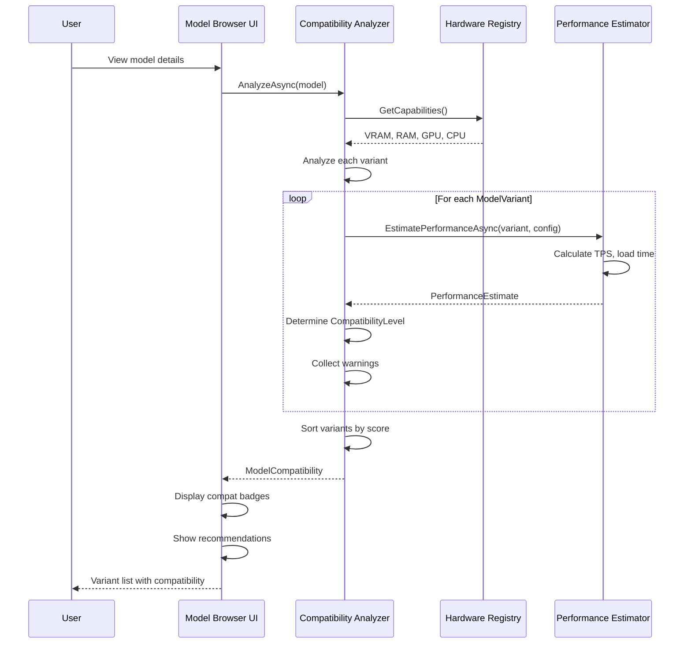

# LCS-SBD-v0.16.2-LLM: Scope Overview — Model Discovery

## Document Control

| Field            | Value                                                        |
| :--------------- | :----------------------------------------------------------- |
| **Document ID**  | LCS-SBD-v0.16.2-LLM                                          |
| **Version**      | v0.16.2                                                      |
| **Codename**     | Model Discovery (LLM Registry Integration Phase 1)           |
| **Status**       | Draft                                                        |
| **Last Updated** | 2026-01-31                                                   |
| **Owner**        | LLM Architecture Lead                                        |
| **Depends On**   | v0.16.1-LLM (Model Configuration), v0.15.x (Hardware Registry) |

---

## 1. Executive Summary

### 1.1 The Vision

**v0.16.2-LLM** delivers **Model Discovery** — the comprehensive model finding and evaluation system that transforms users from model configuration experts to explorers. This establishes:

- A unified abstraction over multiple model registries (Hugging Face Hub, Ollama Library, custom sources)
- Advanced search and filtering capabilities across 100,000+ models with faceted navigation
- Real-time compatibility analysis that matches models to available hardware
- Intelligent variant recommendations suggesting optimal quantization and format choices
- A browser UI for discovering, comparing, and previewing models before download
- Performance estimation enabling users to predict inference speed and resource usage

This is the cornerstone of the LLM discovery experience—without model discovery, users cannot find appropriate models for their specific hardware and use cases.

### 1.2 Business Value

- **Discoverability:** Users can find models suited to their hardware without deep technical knowledge.
- **Compatibility:** Real-time analysis prevents hardware mismatches and download failures.
- **Efficiency:** Variant recommendations reduce wasted bandwidth by suggesting optimal quantizations.
- **Exploration:** Multi-registry support gives users access to Hugging Face's 100k+ models plus private sources.
- **Confidence:** Performance estimates enable informed decisions before long downloads.
- **Licensing:** License-gating ensures feature parity with user tiers and prevents API quota abuse.

### 1.3 Success Criteria

1. Search across 100,000+ models in <2 seconds (p95) with optional offline cache.
2. Compatibility analysis completes in <500ms for any model variant.
3. Performance estimate confidence level ≥0.85 for common hardware configurations.
4. All search queries cached to respect Hugging Face API rate limits (30/hour anon, 1000/hour auth).
5. Model browser renders with 60fps performance even with 1000+ search results displayed.
6. License gating enforces 10 searches/day for WriterPro, unlimited for Teams+.
7. Support discovery of GGUF, GPTQ, AWQ, and SafeTensors formats with accurate quantization parsing.

---

## 2. Key Deliverables

### 2.1 Sub-Parts

| Sub-Part | Title | Description | Est. Hours |
|:---------|:------|:------------|:-----------|
| v0.16.2e | Model Registry Abstraction | Unified interface over multiple registries with adapter pattern | 10 |
| v0.16.2f | Hugging Face Hub Integration | HF API client, caching, rate limiting, GGUF detection | 12 |
| v0.16.2g | Model Compatibility Analyzer | Hardware analysis and variant compatibility assessment | 10 |
| v0.16.2h | Model Search & Filtering | Query builder, faceted search, advanced filters, sorting | 8 |
| v0.16.2i | Model Details & Variants | Model card parsing, variant enumeration, metadata extraction | 6 |
| v0.16.2j | Model Browser UI | Search interface, results grid, filters panel, detail view | 6 |
| **Total** | | | **52 hours** |

### 2.2 Core Interfaces

```csharp
/// <summary>
/// Abstraction over model registries (Hugging Face, Ollama Library, etc.).
/// </summary>
public interface IModelRegistry
{
    /// <summary>
    /// Registry identifier.
    /// </summary>
    ModelRegistryType Type { get; }

    /// <summary>
    /// Human-readable name.
    /// </summary>
    string Name { get; }

    /// <summary>
    /// Search for models.
    /// </summary>
    Task<ModelSearchResult> SearchAsync(
        ModelSearchQuery query,
        CancellationToken ct = default);

    /// <summary>
    /// Get detailed information about a model.
    /// </summary>
    Task<RemoteModel?> GetModelAsync(
        string modelId,
        CancellationToken ct = default);

    /// <summary>
    /// Get available variants/files for a model.
    /// </summary>
    Task<IReadOnlyList<ModelVariant>> GetVariantsAsync(
        string modelId,
        CancellationToken ct = default);

    /// <summary>
    /// Get trending/popular models.
    /// </summary>
    Task<IReadOnlyList<RemoteModel>> GetTrendingAsync(
        int limit = 20,
        CancellationToken ct = default);

    /// <summary>
    /// Get models by category/task.
    /// </summary>
    Task<IReadOnlyList<RemoteModel>> GetByCategoryAsync(
        ModelCategory category,
        int limit = 20,
        CancellationToken ct = default);
}

public enum ModelRegistryType
{
    HuggingFace,
    OllamaLibrary,
    Custom
}

public record ModelSearchQuery
{
    public string? Query { get; init; }
    public ModelCategory? Category { get; init; }
    public ModelTask? Task { get; init; }
    public ModelSizeCategory? MaxSize { get; init; }
    public IReadOnlyList<ModelFormat>? Formats { get; init; }
    public IReadOnlyList<QuantizationType>? Quantizations { get; init; }
    public string? BaseModel { get; init; }     // llama, mistral, etc.
    public string? Author { get; init; }
    public bool? OnlyGGUF { get; init; }        // Filter to GGUF format
    public bool OnlyCompatible { get; init; }   // Filter by hardware
    public ModelSortOrder Sort { get; init; } = ModelSortOrder.Trending;
    public int Skip { get; init; }
    public int Take { get; init; } = 20;
}

public enum ModelCategory
{
    TextGeneration,
    ChatCompletion,
    CodeGeneration,
    Embedding,
    ImageGeneration,
    SpeechToText,
    TextToSpeech,
    Translation,
    Summarization,
    QuestionAnswering
}

public enum ModelTask
{
    GeneralChat,
    CreativeWriting,
    CodeAssistant,
    DataAnalysis,
    Research,
    Roleplay,
    Instruction,
    Uncensored
}

public enum ModelFormat
{
    GGUF,           // llama.cpp native format
    GPTQ,           // GPU quantized
    AWQ,            // Activation-aware quantized
    GGML,           // Legacy llama.cpp format
    SafeTensors,    // Full precision
    PyTorch,        // .bin files
    ONNX,           // ONNX format
    MLX             // Apple MLX format
}

public enum ModelSortOrder
{
    Trending,
    Downloads,
    Likes,
    Recent,
    Name,
    Size
}

public record ModelSearchResult
{
    public IReadOnlyList<RemoteModel> Models { get; init; } = [];
    public int TotalCount { get; init; }
    public IReadOnlyList<SearchFacet> Facets { get; init; } = [];
}

public record SearchFacet
{
    public required string Name { get; init; }
    public IReadOnlyList<FacetValue> Values { get; init; } = [];
}

public record FacetValue
{
    public required string Value { get; init; }
    public int Count { get; init; }
}

/// <summary>
/// A model available for download from a registry.
/// </summary>
public record RemoteModel
{
    public required string Id { get; init; }
    public required string Name { get; init; }
    public required ModelRegistryType Registry { get; init; }
    public string? Description { get; init; }
    public string? Author { get; init; }
    public Uri? Homepage { get; init; }
    public Uri? Repository { get; init; }

    // Model characteristics
    public string? BaseModel { get; init; }         // llama-3, mistral, etc.
    public string? ParameterCount { get; init; }    // 7B, 13B, 70B
    public int? ContextLength { get; init; }
    public string? Architecture { get; init; }
    public IReadOnlyList<ModelTask> Tasks { get; init; } = [];

    // Available variants (different quantizations/formats)
    public IReadOnlyList<ModelVariant> Variants { get; init; } = [];
    public ModelVariant? RecommendedVariant { get; init; }

    // Metrics
    public int Downloads { get; init; }
    public int Likes { get; init; }
    public float? AverageRating { get; init; }

    // Licensing
    public string? License { get; init; }
    public bool CommercialUseAllowed { get; init; }
    public IReadOnlyList<string>? Restrictions { get; init; }

    // Tags and metadata
    public IReadOnlyList<string> Tags { get; init; } = [];
    public DateTimeOffset? CreatedAt { get; init; }
    public DateTimeOffset? UpdatedAt { get; init; }
}

/// <summary>
/// A specific variant (quantization/format) of a model.
/// </summary>
public record ModelVariant
{
    public required string VariantId { get; init; }
    public required string Filename { get; init; }
    public required ModelFormat Format { get; init; }
    public QuantizationType? Quantization { get; init; }
    public required long SizeBytes { get; init; }
    public string? Sha256 { get; init; }
    public Uri? DownloadUrl { get; init; }

    // Performance characteristics
    public long? EstimatedVramBytes { get; init; }
    public long? EstimatedRamBytes { get; init; }
    public float? EstimatedQualityScore { get; init; }  // Relative quality 0-1

    // Compatibility
    public int? MinContextLength { get; init; }
    public int? MaxContextLength { get; init; }
}

/// <summary>
/// Analyzes model compatibility with current hardware.
/// </summary>
public interface IModelCompatibilityAnalyzer
{
    /// <summary>
    /// Analyze compatibility of a model with current hardware.
    /// </summary>
    Task<ModelCompatibility> AnalyzeAsync(
        RemoteModel model,
        CancellationToken ct = default);

    /// <summary>
    /// Analyze compatibility of a specific variant.
    /// </summary>
    Task<VariantCompatibility> AnalyzeVariantAsync(
        ModelVariant variant,
        CancellationToken ct = default);

    /// <summary>
    /// Get recommended variants for a model based on hardware.
    /// </summary>
    Task<IReadOnlyList<VariantRecommendation>> GetRecommendationsAsync(
        RemoteModel model,
        CancellationToken ct = default);

    /// <summary>
    /// Estimate performance for a model/variant combination.
    /// </summary>
    Task<PerformanceEstimate> EstimatePerformanceAsync(
        ModelVariant variant,
        InferenceConfig config,
        CancellationToken ct = default);
}

public record ModelCompatibility
{
    public required string ModelId { get; init; }
    public required CompatibilityLevel OverallLevel { get; init; }
    public IReadOnlyList<VariantCompatibility> VariantCompatibilities { get; init; } = [];
    public ModelVariant? RecommendedVariant { get; init; }
    public InferenceConfig? RecommendedConfig { get; init; }
    public string? Summary { get; init; }
    public IReadOnlyList<CompatibilityWarning> Warnings { get; init; } = [];
}

public record VariantCompatibility
{
    public required ModelVariant Variant { get; init; }
    public required CompatibilityLevel Level { get; init; }
    public required InferenceMode RecommendedMode { get; init; }
    public int? RecommendedGpuLayers { get; init; }
    public int? RecommendedContextLength { get; init; }
    public string? Reason { get; init; }
    public IReadOnlyList<CompatibilityWarning> Warnings { get; init; } = [];
}

public record VariantRecommendation
{
    public required ModelVariant Variant { get; init; }
    public required CompatibilityLevel Compatibility { get; init; }
    public required float Score { get; init; }  // 0-1, higher is better
    public required string Rationale { get; init; }
    public InferenceConfig RecommendedConfig { get; init; } = new();
    public PerformanceEstimate? EstimatedPerformance { get; init; }
}

public record PerformanceEstimate
{
    public float TokensPerSecondMin { get; init; }
    public float TokensPerSecondMax { get; init; }
    public float TokensPerSecondExpected { get; init; }
    public TimeSpan EstimatedLoadTime { get; init; }
    public long EstimatedRamUsage { get; init; }
    public long? EstimatedVramUsage { get; init; }
    public float ConfidenceLevel { get; init; }  // 0-1
}

public record CompatibilityWarning
{
    public required CompatibilityWarningType Type { get; init; }
    public required string Message { get; init; }
    public WarningSeverity Severity { get; init; }
    public string? Suggestion { get; init; }
}

public enum CompatibilityWarningType
{
    InsufficientVram,
    InsufficientRam,
    SlowPerformance,
    ContextLengthLimited,
    NoGpuAcceleration,
    UnsupportedFormat,
    ExperimentalQuantization,
    LicenseRestriction
}

public enum WarningSeverity { Info, Warning, Error }

public enum CompatibilityLevel { Incompatible, Poor, Fair, Good, Excellent }
```

---

## 3. Architecture

### 3.1 Component Overview

```
┌─────────────────────────────────────────────────────────────────────────────┐
│                          Model Discovery System                              │
├─────────────────────────────────────────────────────────────────────────────┤
│                                                                              │
│  ┌─────────────────────────────────────────────────────────────────────┐   │
│  │                    IModelRegistry (Abstraction)                      │   │
│  │  ┌──────────────┐  ┌──────────────┐  ┌──────────────┐              │   │
│  │  │   Hugging    │  │    Ollama    │  │    Custom    │              │   │
│  │  │   Face Hub   │  │   Library    │  │  Registries  │              │   │
│  │  └──────┬───────┘  └──────┬───────┘  └──────┬───────┘              │   │
│  │         │                 │                 │                       │   │
│  │         └─────────────────┴─────────────────┘                       │   │
│  │                           │                                         │   │
│  │                           ▼                                         │   │
│  │         ┌──────────────────────────────────────┐                    │   │
│  │         │    Model Registry Manager            │                    │   │
│  │         │  • Search                            │                    │   │
│  │         │  • Get model details                 │                    │   │
│  │         │  • Enumerate variants                │                    │   │
│  │         │  • Get trending/categories           │                    │   │
│  │         └──────────────────────────────────────┘                    │   │
│  └─────────────────────────────────────────────────────────────────────┘   │
│                                     │                                       │
│              ┌──────────────────────┼──────────────────────┐               │
│              ▼                      ▼                      ▼               │
│  ┌───────────────────┐  ┌───────────────────┐  ┌───────────────────────┐  │
│  │ Model Search &    │  │ Model Compat.     │  │  Model Details &      │  │
│  │ Filtering Engine  │  │ Analyzer          │  │  Variant Enumerator   │  │
│  │                   │  │                   │  │                       │  │
│  │ • Query builder   │  │ • Hardware detect │  │ • Card parser         │  │
│  │ • Facet agg       │  │ • Variant analysis│  │ • Metadata extract    │  │
│  │ • Advanced filters│  │ • Perf estimate   │  │ • Format detect       │  │
│  │ • Caching         │  │ • Warnings        │  │ • Quant parsing       │  │
│  └───────────────────┘  └───────────────────┘  └───────────────────────┘  │
│                                                                              │
│  ┌─────────────────────────────────────────────────────────────────────┐   │
│  │                      Model Browser UI Layer                          │   │
│  │  ┌──────────────────┐  ┌──────────────────┐  ┌──────────────────┐   │   │
│  │  │  Search Form     │  │  Results Grid    │  │  Detail View     │   │   │
│  │  │  • Query input   │  │  • Cards layout  │  │  • Full metadata │   │   │
│  │  │  • Filters panel │  │  • Sorting       │  │  • Variants      │   │   │
│  │  │  • Categories    │  │  • Pagination    │  │  • Compatibility │   │   │
│  │  │  • Tasks         │  │  • Compat badges │  │  • Preview       │   │   │
│  │  └──────────────────┘  └──────────────────┘  └──────────────────┘   │   │
│  └─────────────────────────────────────────────────────────────────────┘   │
│                                                                              │
│  ┌─────────────────────────────────────────────────────────────────────┐   │
│  │                        Storage & Caching Layer                       │   │
│  │  ┌──────────────────────────────────────────────────────────────┐   │   │
│  │  │ • Search result cache (5 min TTL)                            │   │   │
│  │  │ • Model detail cache (24h TTL)                               │   │   │
│  │  │ • Variant list cache (24h TTL)                               │   │   │
│  │  │ • Rate limit tracking                                         │   │   │
│  │  │ • Search quota enforcement                                    │   │   │
│  │  └──────────────────────────────────────────────────────────────┘   │   │
│  └─────────────────────────────────────────────────────────────────────┘   │
│                                                                              │
└─────────────────────────────────────────────────────────────────────────────┘
```

### 3.2 Model Search Flow



### 3.3 Compatibility Analysis Flow



### 3.4 Hugging Face Hub Integration Detail

```
┌─────────────────────────────────────────────────────────────────────────┐
│                     Hugging Face Hub Integration                         │
├─────────────────────────────────────────────────────────────────────────┤
│                                                                          │
│  Endpoints Used:                                                         │
│  ┌───────────────────────────────────────────────────────────────────┐  │
│  │ GET /api/models                    - Search models                 │  │
│  │ GET /api/models/{model_id}         - Get model details             │  │
│  │ GET /api/models/{model_id}/tree    - List files in repo            │  │
│  │ GET /{model_id}/resolve/{file}     - Download file                 │  │
│  └───────────────────────────────────────────────────────────────────┘  │
│                                                                          │
│  Filtering Strategy:                                                     │
│  ┌───────────────────────────────────────────────────────────────────┐  │
│  │ 1. Filter by pipeline_tag: text-generation                        │  │
│  │ 2. Filter by library: transformers, gguf                          │  │
│  │ 3. Search in model card for GGUF files                            │  │
│  │ 4. Parse filenames for quantization type                          │  │
│  │    e.g., "model-7b-q4_k_m.gguf" → Q4_K_M                          │  │
│  └───────────────────────────────────────────────────────────────────┘  │
│                                                                          │
│  Rate Limiting:                                                          │
│  ┌───────────────────────────────────────────────────────────────────┐  │
│  │ • Anonymous: ~30 requests/hour                                     │  │
│  │ • With token: ~1000 requests/hour                                  │  │
│  │ • Implement caching (1 hour for model lists, 24h for details)      │  │
│  │ • Optional: User can provide their own HF token                    │  │
│  └───────────────────────────────────────────────────────────────────┘  │
│                                                                          │
└─────────────────────────────────────────────────────────────────────────┘
```

---

## 4. Data Model

### 4.1 Database Schema

```sql
-- Remote models (cached from registries)
CREATE TABLE remote_models (
    id UUID PRIMARY KEY DEFAULT gen_random_uuid(),
    model_id VARCHAR(255) NOT NULL,
    registry_type VARCHAR(50) NOT NULL,
    name VARCHAR(255) NOT NULL,
    description TEXT,
    author VARCHAR(255),
    base_model VARCHAR(100),
    parameter_count VARCHAR(50),
    context_length INT,
    architecture VARCHAR(100),
    homepage_url VARCHAR(500),
    repository_url VARCHAR(500),

    -- Metrics
    downloads INT DEFAULT 0,
    likes INT DEFAULT 0,
    average_rating FLOAT,

    -- Licensing
    license VARCHAR(255),
    commercial_use_allowed BOOLEAN DEFAULT FALSE,
    restrictions TEXT,

    -- Tags and metadata
    tags TEXT[], -- JSON array
    tasks VARCHAR(100)[], -- JSON array
    created_at TIMESTAMPTZ,
    updated_at TIMESTAMPTZ,

    -- Caching
    cached_at TIMESTAMPTZ NOT NULL DEFAULT NOW(),
    cache_ttl_minutes INT DEFAULT 1440,

    UNIQUE(model_id, registry_type),
    INDEX idx_remote_models_registry ON remote_models(registry_type),
    INDEX idx_remote_models_author ON remote_models(author),
    INDEX idx_remote_models_cached ON remote_models(cached_at)
);

-- Model variants (quantizations, formats)
CREATE TABLE model_variants (
    id UUID PRIMARY KEY DEFAULT gen_random_uuid(),
    model_id UUID NOT NULL REFERENCES remote_models(id) ON DELETE CASCADE,
    variant_id VARCHAR(255) NOT NULL,
    filename VARCHAR(255) NOT NULL,
    format VARCHAR(50) NOT NULL,
    quantization VARCHAR(50),
    size_bytes BIGINT NOT NULL,
    sha256 VARCHAR(64),
    download_url VARCHAR(500),

    -- Performance characteristics
    estimated_vram_bytes BIGINT,
    estimated_ram_bytes BIGINT,
    estimated_quality_score FLOAT,

    -- Compatibility
    min_context_length INT,
    max_context_length INT,

    -- Metadata
    created_at TIMESTAMPTZ DEFAULT NOW(),

    UNIQUE(model_id, variant_id),
    INDEX idx_model_variants_model ON model_variants(model_id),
    INDEX idx_model_variants_format ON model_variants(format),
    INDEX idx_model_variants_quantization ON model_variants(quantization)
);

-- Search result cache
CREATE TABLE search_cache (
    id UUID PRIMARY KEY DEFAULT gen_random_uuid(),
    query_hash VARCHAR(64) NOT NULL,
    query_json JSONB NOT NULL,
    result_json JSONB NOT NULL,
    result_count INT NOT NULL,
    created_at TIMESTAMPTZ NOT NULL DEFAULT NOW(),
    expires_at TIMESTAMPTZ NOT NULL,
    registry_type VARCHAR(50) NOT NULL,

    UNIQUE(query_hash, registry_type),
    INDEX idx_search_cache_expires ON search_cache(expires_at),
    INDEX idx_search_cache_query ON search_cache(query_hash)
);

-- Model detail cache
CREATE TABLE model_cache (
    id UUID PRIMARY KEY DEFAULT gen_random_uuid(),
    remote_model_id UUID NOT NULL REFERENCES remote_models(id) ON DELETE CASCADE,
    details_json JSONB NOT NULL,
    created_at TIMESTAMPTZ NOT NULL DEFAULT NOW(),
    expires_at TIMESTAMPTZ NOT NULL,

    UNIQUE(remote_model_id),
    INDEX idx_model_cache_expires ON model_cache(expires_at)
);

-- Compatibility analysis results (cached)
CREATE TABLE compatibility_cache (
    id UUID PRIMARY KEY DEFAULT gen_random_uuid(),
    model_id UUID NOT NULL REFERENCES remote_models(id) ON DELETE CASCADE,
    hardware_profile_hash VARCHAR(64) NOT NULL,
    compatibility_json JSONB NOT NULL,
    created_at TIMESTAMPTZ NOT NULL DEFAULT NOW(),
    expires_at TIMESTAMPTZ NOT NULL,

    UNIQUE(model_id, hardware_profile_hash),
    INDEX idx_compat_cache_hardware ON compatibility_cache(hardware_profile_hash),
    INDEX idx_compat_cache_expires ON compatibility_cache(expires_at)
);

-- Search quota tracking
CREATE TABLE search_quota (
    id UUID PRIMARY KEY DEFAULT gen_random_uuid(),
    user_id UUID NOT NULL,
    quota_period_start TIMESTAMPTZ NOT NULL,
    quota_period_end TIMESTAMPTZ NOT NULL,
    searches_used INT DEFAULT 0,
    quota_limit INT NOT NULL,

    UNIQUE(user_id, quota_period_start),
    INDEX idx_search_quota_user ON search_quota(user_id),
    INDEX idx_search_quota_period ON search_quota(quota_period_start)
);

-- Rate limit tracking for API calls
CREATE TABLE api_rate_limit (
    id UUID PRIMARY KEY DEFAULT gen_random_uuid(),
    registry_type VARCHAR(50) NOT NULL,
    request_token VARCHAR(255),
    request_count INT DEFAULT 1,
    window_start TIMESTAMPTZ NOT NULL DEFAULT NOW(),
    window_end TIMESTAMPTZ NOT NULL,

    UNIQUE(registry_type, request_token),
    INDEX idx_rate_limit_window ON api_rate_limit(window_end)
);
```

### 4.2 Search Query JSON Structure

```json
{
  "query": "llama chat",
  "category": "TextGeneration",
  "task": "GeneralChat",
  "maxSize": "7B",
  "formats": ["GGUF"],
  "quantizations": ["Q4_K_M", "Q5_K_M"],
  "baseModel": "llama-2",
  "author": "meta-llama",
  "onlyGGUF": true,
  "onlyCompatible": true,
  "sort": "Trending",
  "skip": 0,
  "take": 20
}
```

### 4.3 Model Compatibility JSON Structure

```json
{
  "modelId": "meta-llama/Llama-2-7b-chat-hf",
  "overallLevel": "Good",
  "summary": "Model is well-suited for your hardware with recommended quantization Q4_K_M",
  "recommendedVariant": {
    "variantId": "llama-2-7b-q4_k_m",
    "filename": "llama-2-7b-chat.Q4_K_M.gguf",
    "format": "GGUF",
    "quantization": "Q4_K_M",
    "sizeBytes": 3825173504,
    "estimatedVramBytes": 6442450944,
    "estimatedRamBytes": 2147483648
  },
  "variantCompatibilities": [
    {
      "variant": { "variantId": "llama-2-7b-q4_k_m" },
      "level": "Good",
      "recommendedMode": "GPU",
      "recommendedGpuLayers": 40,
      "recommendedContextLength": 2048,
      "reason": "Fits in VRAM with GPU acceleration enabled"
    },
    {
      "variant": { "variantId": "llama-2-7b-q5_k_m" },
      "level": "Fair",
      "recommendedMode": "Mixed",
      "recommendedGpuLayers": 20,
      "reason": "Requires offloading some layers to RAM"
    }
  ],
  "warnings": [
    {
      "type": "SlowPerformance",
      "message": "CPU-only inference will be very slow (~0.5 tokens/sec)",
      "severity": "Warning",
      "suggestion": "Consider Q3_K variant for CPU fallback"
    }
  ]
}
```

---

## 5. Search Capabilities

### 5.1 Search Filters & Facets

| Filter | Type | Values | Usage |
|:-------|:-----|:-------|:------|
| Query | Text | Free-form | Search model names, descriptions |
| Category | Select | TextGeneration, ChatCompletion, CodeGeneration, Embedding, etc. | Filter by task category |
| Task | Select | GeneralChat, CreativeWriting, CodeAssistant, DataAnalysis, Research, etc. | Filter by specific use case |
| Base Model | Select | llama-2, llama-3, mistral, mixtral, phi, etc. | Filter by foundation model |
| Size | Select | 1B, 3B, 7B, 13B, 70B, 200B+ | Filter by parameter count |
| Format | MultiSelect | GGUF, GPTQ, AWQ, SafeTensors, PyTorch, ONNX, MLX | Filter by quantization format |
| Quantization | MultiSelect | Q2_K, Q3_K, Q4_K_M, Q5_K_M, Q6_K, Q8_0, fp16, etc. | Filter by quantization type |
| Author | Text | huggingface, meta-llama, TheBloke, etc. | Filter by model creator |
| Only GGUF | Toggle | true/false | Show only GGUF-quantized variants |
| Only Compatible | Toggle | true/false | Filter to hardware-compatible models |
| Compatibility | Select | Excellent, Good, Fair, Poor | Filter by hardware fit |
| Sort | Select | Trending, Downloads, Likes, Recent, Name, Size | Sort results |
| Rating | Slider | 0.0-5.0 | Filter by minimum rating |

### 5.2 Result Facets (Aggregations)

- **By Category:** TextGeneration (12,543), ChatCompletion (8,291), CodeGeneration (3,847), ...
- **By Base Model:** llama-2 (2,943), mistral (1,847), phi (891), mixtral (743), ...
- **By Format:** GGUF (4,231), SafeTensors (2,847), PyTorch (1,923), GPTQ (1,847), ...
- **By Size:** 7B (2,943), 13B (1,847), 70B (891), 3B (743), ...
- **By Author:** TheBloke (243), meta-llama (147), Microsoft (89), Intel (67), ...

---

## 6. Model Browser UI

### 6.1 Main Search Interface

```
┌────────────────────────────────────────────────────────────────────────────┐
│ Model Browser: "Discover LLMs for Your Hardware"                           │
├────────────────────────────────────────────────────────────────────────────┤
│                                                                             │
│ ┌──────────────────────┐ ┌──────────────────────────────────────────────┐ │
│ │ FILTERS             │ │ RESULTS (12,543 models)                      │ │
│ │                     │ │                                              │ │
│ │ 🔍 Search...        │ │ ┌────────────────────────────────────────┐  │ │
│ │                     │ │ │ Llama-2-7b-chat-hf            ⭐⭐⭐⭐  │  │ │
│ │ Category ▼          │ │ │ meta-llama / 7B params          ✓ Good  │  │ │
│ │ ├ Text Generation   │ │ │                                        │  │ │
│ │ ├ Chat Completion   │ │ │ Advanced chat model trained on 2T     │  │ │
│ │ ├ Code Generation   │ │ │ tokens. Available in GGUF, Q4_K_M.   │  │ │
│ │ ├ Embedding         │ │ │                                        │  │ │
│ │ └ ...               │ │ │ Variants: ✓ Q4_K_M (3.8 GB)           │  │ │
│ │                     │ │ │          ◐ Q5_K_M (4.7 GB)           │  │ │
│ │ Base Model ▼        │ │ │          ✗ fp16 (13.5 GB)            │  │ │
│ │ ├ llama-2 (2,943)   │ │ │                                        │  │ │
│ │ ├ mistral (1,847)   │ │ │ ↓ VIEW DETAILS │ ↓ CHECK COMPAT        │  │ │
│ │ ├ mixtral (743)     │ │ └────────────────────────────────────────┘  │  │ │
│ │ └ ...               │ │                                              │ │
│ │                     │ │ ┌────────────────────────────────────────┐  │ │
│ │ Size                │ │ │ Mistral-7b-instruct-v0.2   ⭐⭐⭐⭐⭐ │  │ │
│ │ ○ 3B                │ │ │ mistralai / 7B params        ✗ Fair    │  │ │
│ │ ○ 7B                │ │ │                                        │  │ │
│ │ ○ 13B               │ │ │ Instruct-tuned Mistral for better     │  │ │
│ │ ○ 70B               │ │ │ instruction following.                 │  │ │
│ │ ● All               │ │ │                                        │  │ │
│ │                     │ │ │ Variants: ◐ Q4_K_M (3.8 GB)           │  │ │
│ │ Format              │ │ │          ◐ Q5_K_M (4.7 GB)           │  │ │
│ │ ☑ GGUF              │ │ │          ✗ fp16 (14.3 GB)            │  │ │
│ │ ☐ GPTQ              │ │ │                                        │  │ │
│ │ ☐ SafeTensors       │ │ │ ↓ VIEW DETAILS │ ↓ CHECK COMPAT        │  │ │
│ │ ☐ PyTorch           │ │ └────────────────────────────────────────┘  │  │ │
│ │                     │ │                                              │ │
│ │ Rating              │ │ [Previous 1 2 3 4 ... Next]                 │ │
│ │ ⭐⭐⭐⭐⭐ (4.0+)     │ │                                              │ │
│ │                     │ │ Sorted by: Trending ▼                       │ │
│ │ [Apply] [Reset]    │ │                                              │ │
│ │                     │ │                                              │ │
│ └──────────────────────┘ └──────────────────────────────────────────────┘ │
│                                                                             │
└────────────────────────────────────────────────────────────────────────────┘
```

### 6.2 Model Detail View

```
┌────────────────────────────────────────────────────────────────────────────┐
│ ◄ Back to Search                                                            │
├────────────────────────────────────────────────────────────────────────────┤
│                                                                             │
│ LLAMA-2-7B-CHAT-HF                                           ⭐⭐⭐⭐ 4.2  │
│ meta-llama / 847.5K downloads / 45.3K likes                  ✓ COMPATIBLE │
│                                                                             │
│ ┌─────────────────────────────┐  ┌────────────────────────────────────┐  │
│ │ MODEL INFORMATION            │  │ YOUR HARDWARE ANALYSIS             │  │
│ │                              │  │                                    │  │
│ │ Base Model: llama-2          │  │ ┌─ RECOMMENDED VARIANT ──────────┐ │  │
│ │ Architecture: Llama          │  │ │ Q4_K_M Quantization            │ │  │
│ │ Parameters: 7B               │  │ │ Format: GGUF                   │ │  │
│ │ Context Length: 4096         │  │ │ Size: 3.8 GB                   │ │  │
│ │ License: Llama 2 Community   │  │ │                                │ │  │
│ │ Commercial Use: ✓            │  │ │ ┌─ COMPATIBILITY ─────────────┐│ │  │
│ │ Created: Jan 2023            │  │ │ │ Overall: GOOD                ││ │  │
│ │ Updated: May 2023            │  │ │ │ VRAM: 6.4 GB available       ││ │  │
│ │                              │  │ │ │ RAM: 2.1 GB available        ││ │  │
│ │ Tags:                        │  │ │ │ GPU: RTX 3090                ││ │  │
│ │ • chat • instruction-tuned   │  │ │ │ CPU: Ryzen 5950X             ││ │  │
│ │ • creative • general-purpose │  │ │ │                                ││ │  │
│ │                              │  │ │ ┌─ PERFORMANCE ESTIMATE ────────││ │  │
│ │ Repository:                  │  │ │ │ Inference Speed: 45 tok/sec   ││ │  │
│ │ https://huggingface.co/...   │  │ │ │ Load Time: 2.1 seconds        ││ │  │
│ │                              │  │ │ │ Confidence: 82%                ││ │  │
│ │                              │  │ │ └────────────────────────────────┘│ │  │
│ │                              │  │ └─────────────────────────────────────┘ │  │
│ └─────────────────────────────┘  │                                       │  │
│                                                                             │
│ DESCRIPTION                                                                 │
│ ┌────────────────────────────────────────────────────────────────────────┐  │
│ │ Llama 2 Chat is optimized for dialogue use cases and has been tuned    │  │
│ │ using RLHF techniques. The model is trained using supervised fine-     │  │
│ │ tuning (SFT) and RLHF. It demonstrates strong performance compared to │  │
│ │ other open-source chat alternatives.                                   │  │
│ └────────────────────────────────────────────────────────────────────────┘  │
│                                                                             │
│ AVAILABLE VARIANTS                                                          │
│ ┌────────────────────────────────────────────────────────────────────────┐  │
│ │ Format  │ Quantization │ Size  │ Quality │ VRAM  │ Compat │ Action    │  │
│ ├─────────┼──────────────┼───────┼─────────┼───────┼────────┼───────────┤  │
│ │ GGUF    │ Q4_K_M       │ 3.8GB │ 95%     │ 6.4GB │ ✓ Good │ Download  │  │
│ │ GGUF    │ Q5_K_M       │ 4.7GB │ 98%     │ 7.6GB │ ◐ Fair │ Download  │  │
│ │ GGUF    │ Q6_K         │ 5.7GB │ 99%     │ 8.9GB │ ✗ Poor │ Download  │  │
│ │ GPTQ    │ 4bit         │ 4.2GB │ 92%     │ --    │ ? Test │ Download  │  │
│ │ AWQ     │ 4bit         │ 4.1GB │ 93%     │ --    │ ? Test │ Download  │  │
│ │ SafeTensors│ fp16      │13.5GB │ 100%    │23.1GB │ ✗ Poor │ Download  │  │
│ │ PyTorch │ fp32         │27.0GB │ 100%    │32.8GB │ ✗ Fail │ Download  │  │
│ └────────────────────────────────────────────────────────────────────────┘  │
│                                                                             │
│ ⚠ WARNINGS                                                                  │
│ • CPU-only inference will be very slow (0.5 tok/sec). GPU recommended.     │
│ • Context length limited to 2048 on your hardware.                         │
│                                                                             │
│ [Download Recommended Variant] [Compare Variants] [View Full Card]         │
│                                                                             │
└────────────────────────────────────────────────────────────────────────────┘
```

### 6.3 Compatibility Indicators

| Indicator | Meaning | Color |
|:----------|:--------|:------|
| ✓ Good / Excellent | Model runs well on your hardware | Green |
| ◐ Fair | Model runs but with some limitations | Yellow |
| ✗ Poor | Model will be slow or require workarounds | Orange |
| ✗ Fail / Incompatible | Model cannot run on your hardware | Red |
| ? Test | Compatibility untested; proceed with caution | Gray |

---

## 7. Dependencies

| Component | Source | Usage |
|:----------|:-------|:------|
| `IHardwareRegistry` | v0.15.x | Hardware capabilities detection |
| `IInferenceConfigService` | v0.16.1-LLM | Inference mode and context recommendations |
| `ILicenseService` | v0.2.1a | License tier checks for search quotas |
| `ISettingsService` | v0.1.6a | User preferences, HF token storage |
| `IMediator` | v0.0.7a | Discovery events and telemetry |
| `IHttpClientFactory` | System | HTTP requests to Hugging Face API |
| `IDistributedCache` | System | Search result caching |

---

## 8. License Gating

| Tier | Features |
|:-----|:---------|
| **Core** | Browse Ollama library only (read-only, 20 models shown) |
| **WriterPro** | + Hugging Face search; 10 searches/day limit; basic filters only |
| **Teams** | Unlimited search; all filters; compatibility analysis; custom registries disabled |
| **Enterprise** | + Custom registry support; bulk analysis (up to 100 models); API access to discovery endpoints |

---

## 9. Performance Targets

| Metric | Target | Measurement |
|:-------|:-------|:------------|
| Search (cached) | <100ms | P95 response time |
| Search (uncached) | <2 sec | P95 response time |
| Model details fetch | <500ms | P95 response time |
| Compatibility analysis | <500ms | P95 for single model |
| Bulk compat analysis | <30 sec | P95 for 100 models (Teams+) |
| Variant enumeration | <200ms | P95 to list all variants |
| UI render (results) | <16ms | P95 frame time (60fps) |
| Filter aggregation | <50ms | P95 for facet computation |
| Cache hit rate | >85% | % of searches from cache |
| API rate limit | <100ms | Response time under rate limit |

---

## 10. Testing Strategy

### 10.1 Unit Tests

- IModelRegistry implementations (mock and real Hugging Face)
- Search query validation and sanitization
- Variant enumeration and quantization parsing
- Compatibility level calculation
- Performance estimation algorithms
- Cache hit/miss logic
- License quota enforcement

### 10.2 Integration Tests

- Full search flow (query → registry → filter → facets)
- Model detail retrieval and variant enumeration
- Compatibility analysis with real hardware profiles
- Cache invalidation and TTL behavior
- Hugging Face API interaction (throttled)
- Rate limit tracking and quota enforcement
- License tier-based feature access

### 10.3 Performance Tests

- Search with 100k+ models in cache
- Bulk compatibility analysis (100 models)
- UI responsiveness with 1000+ search results displayed
- API rate limit behavior under load
- Cache efficiency (hit/miss ratio)

### 10.4 UI Tests

- Search form submission and validation
- Filter application (category, format, size, etc.)
- Facet aggregation and display
- Results pagination and sorting
- Model detail modal loading
- Compatibility indicator rendering
- Keyboard navigation and accessibility

---

## 11. Risks & Mitigations

| Risk | Impact | Mitigation |
|:-----|:-------|:-----------|
| Hugging Face API changes | Search breaks | Adapter pattern; version pinning; monitoring |
| High API rate limiting | Search failures | Aggressive caching; user-provided tokens; fallback to cache |
| Stale cached results | Outdated model info | Configurable TTLs; manual refresh option; version tracking |
| Incorrect compatibility analysis | Wrong recommendations | Hardware profile accuracy; performance estimate validation |
| Large result sets (10k+) | UI performance degradation | Pagination; virtualization; lazy loading |
| GGUF quantization parsing errors | Incorrect variant classification | Regex refinement; manual overrides; validation rules |
| License quota exhaustion | Blocked searches mid-session | Pro-rata quotas; grace periods; clear warnings |
| Malicious HF model cards | XSS or injection attacks | HTML sanitization; markdown rendering safety |
| Network timeouts | Incomplete search results | Retry logic; caching; graceful degradation |

---

## 12. MediatR Events

| Event | Description |
|:------|:------------|
| `ModelSearchInitiatedEvent` | User starts a search |
| `ModelSearchCompletedEvent` | Search results received |
| `ModelDetailsLoadedEvent` | Model card and variants loaded |
| `CompatibilityAnalyzedEvent` | Compatibility analysis completed |
| `VariantRecommendedEvent` | System recommends a variant |
| `ModelBrowserOpenedEvent` | Discovery UI opened |
| `ModelBrowserClosedEvent` | Discovery UI closed |
| `SearchQuotaCheckEvent` | Search quota validated |
| `RegistryIntegrationErrorEvent` | Registry API error occurred |
| `RegistryResultsCachedEvent` | Search results cached |

---

## 13. Search Performance Optimization Strategy

### 13.1 Caching Layers

1. **Search Result Cache** (5 min TTL)
   - Store full search results (models + facets)
   - Cache key: SHA256(query JSON)
   - Invalidate on: new model publication, filter changes

2. **Model Detail Cache** (24h TTL)
   - Store model metadata, description, links
   - Invalidate on: model card update detected
   - Fallback: Serve stale data if API fails

3. **Variant List Cache** (24h TTL)
   - Store enumerated variants with sizes and metadata
   - Invalidate on: new variant detected
   - Refresh: Background job checks daily

4. **Compatibility Result Cache** (7-day TTL)
   - Store hardware-specific compatibility analysis
   - Cache key: SHA256(model_id + hardware_profile)
   - Invalidate on: hardware change or new variant

### 13.2 API Rate Limit Strategy

- **Anonymous requests:** 30/hour → aggressive caching, queue searches
- **Authenticated requests:** 1000/hour → user provides HF token
- **Internal service:** Dedicated token with higher limits
- **Fallback:** Serve cached results when rate-limited

---

## 14. Variant Recommendation Algorithm

```
For each ModelVariant in model.Variants:
  1. Check hardware compatibility
     - VRAM required ≤ available VRAM?
     - RAM required ≤ available RAM?
     - Format supported by inference engine?

  2. Assign compatibility level
     - Incompatible: Fails hardware checks
     - Poor: Requires workarounds (CPU fallback, slow)
     - Fair: Some limitations (layer offloading, context limited)
     - Good: Runs well with minor limitations
     - Excellent: Optimal fit

  3. Estimate performance
     - Token/sec based on model size, quantization, hardware
     - Load time based on file size, hardware speed
     - Confidence based on hardware profile completeness

  4. Calculate recommendation score (0-1)
     score = compatibility_weight * compat_level
           + perf_weight * normalize(tokens_per_sec)
           + quality_weight * variant.estimated_quality_score
           - size_weight * normalize(file_size)

  5. Rank by score descending
```

---

## Appendix A: Example Searches

### Example 1: Finding a 7B Chat Model

**Query:**
```json
{
  "query": "chat",
  "category": "ChatCompletion",
  "maxSize": "7B",
  "formats": ["GGUF"],
  "onlyCompatible": true,
  "sort": "Trending"
}
```

**Results:** 247 models, top 5:
1. Llama-2-7b-chat-hf (⭐⭐⭐⭐, 847k downloads) — ✓ Good
2. Mistral-7b-instruct-v0.2 (⭐⭐⭐⭐⭐, 543k downloads) — ✓ Good
3. Neural-chat-7b-v3 (⭐⭐⭐⭐, 231k downloads) — ✓ Good
4. Zephyr-7b-beta (⭐⭐⭐⭐, 187k downloads) — ◐ Fair
5. Dolphin-2.1-mistral-7b (⭐⭐⭐⭐, 165k downloads) — ✓ Good

### Example 2: Finding a Code Model for Limited VRAM

**Query:**
```json
{
  "query": "code",
  "category": "CodeGeneration",
  "maxSize": "3B",
  "formats": ["GGUF"],
  "quantizations": ["Q4_K_M", "Q3_K"],
  "onlyCompatible": true,
  "sort": "Downloads"
}
```

**Results:** 43 models
- StarCoder 3B Q4 — ✓ Excellent (fits in 4GB VRAM)
- CodeGemma 2B Q3 — ✓ Good (high quality, smallest)
- Phi-2 2.7B Q4 — ✓ Good (general-purpose code)

### Example 3: Bulk Analysis (Teams+)

**Query:**
```json
{
  "modelIds": [
    "meta-llama/Llama-2-7b-chat-hf",
    "mistralai/Mistral-7B-Instruct-v0.2",
    "TheBloke/Llama-2-13B-Chat-GGUF",
    "NousResearch/Hermes-2-Pro-Mistral-7B"
  ],
  "analyzePerformance": true
}
```

**Results:** Compatibility analysis for all 4 models with ranking.

---

## Appendix B: Quantization Reference

| Quantization | Bits | Quality | Size Reduction | Hardware | Notes |
|:-------------|:-----|:--------|:---------------|:---------|:------|
| fp32 | 32 | 100% | 0% | CPU/GPU | Full precision, very large |
| fp16 | 16 | 100% | 50% | GPU | Half-precision, standard |
| Q8_0 | 8 | 99% | 75% | CPU/GPU | Per-block quantization |
| Q6_K | 6 | 99% | 81% | CPU/GPU | High quality, balanced |
| Q5_K_M | 5-6 | 98% | 84% | CPU/GPU | Recommended for quality |
| Q4_K_M | 4-5 | 95% | 88% | CPU/GPU | **Best overall** quality/size |
| Q3_K | 3-4 | 92% | 91% | CPU/GPU | Small, still good quality |
| Q2_K | 2-3 | 85% | 94% | CPU/GPU | Very small, lower quality |
| GPTQ | 3-4 | 90% | 90% | GPU | GPU-optimized quantization |
| AWQ | 4 | 95% | 88% | GPU | Activation-aware quantization |

---

**Document End**
