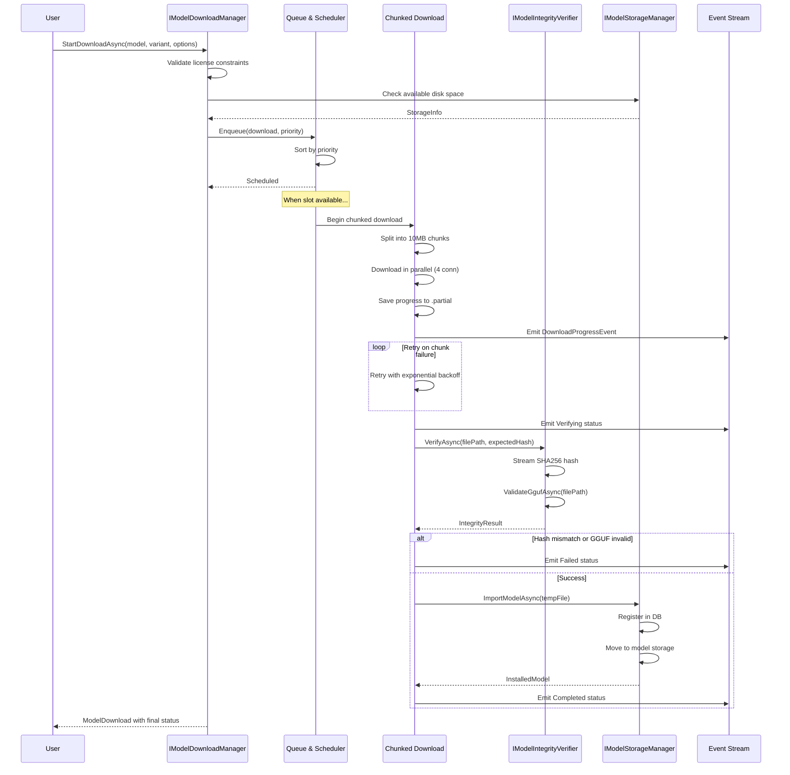

# LCS-SBD-v0.16.3-LLM: Scope Overview — Download & Storage

## Document Control

| Field            | Value                                                        |
| :--------------- | :----------------------------------------------------------- |
| **Document ID**  | LCS-SBD-v0.16.3-LLM                                          |
| **Version**      | v0.16.3                                                      |
| **Codename**     | Download & Storage                                           |
| **Status**       | Draft                                                        |
| **Last Updated** | 2026-01-31                                                   |
| **Owner**        | Local LLM Architecture Lead                                  |
| **Depends On**   | v0.16.2-LLM (Model Discovery), v0.16.1-LLM (Hardware & Backends) |

---

## 1. Executive Summary

### 1.1 The Vision

**v0.16.3-LLM** delivers **Download & Storage** — the foundational model acquisition and management layer that transforms users from passive consumers of pre-installed models to active curators of a personal model library. This establishes:

- A robust download manager with chunked downloads, resume support, and automatic retry logic
- Intelligent storage management with disk usage monitoring and automatic cleanup suggestions
- Comprehensive integrity verification using SHA256 hashing and GGUF format validation
- A download queue and scheduler for managing concurrent downloads with priority levels
- Model import/export capabilities for external file handling and library portability
- An intuitive download manager UI for real-time progress tracking and storage overview

This is the backbone of the Local LLM subsystem—without reliable model acquisition and storage, users cannot build a functional local LLM inference platform.

### 1.2 Business Value

- **Model Accessibility:** Users can download and manage models from Hugging Face registry within license constraints.
- **Reliability:** Resume support and integrity verification ensure downloads are trustworthy and resilient to network failures.
- **Storage Awareness:** Automatic storage monitoring and cleanup suggestions help users manage disk space efficiently.
- **Offline Capability:** Downloaded models enable fully offline inference after initial acquisition.
- **Portability:** Import/export allows users to transfer model libraries across machines or backup critical models.
- **User Control:** License-gated download limits provide fair resource allocation across tiers.

### 1.3 Success Criteria

1. Download manager successfully resumes 95% of interrupted downloads without re-downloading full file.
2. Integrity verification catches 100% of corrupted or tampered model files.
3. Storage system tracks disk usage with accuracy within 1% margin.
4. Download queue processes 4+ concurrent downloads with sub-second scheduling overhead.
5. GGUF validation correctly identifies file format errors before installation.
6. UI provides real-time progress updates with latency <100ms.
7. License gating enforces download limits with zero bypass vulnerabilities.

---

## 2. Key Deliverables

### 2.1 Sub-Parts

| Sub-Part | Title | Description | Est. Hours |
|:---------|:------|:------------|:-----------|
| v0.16.3e | Download Manager | Core download handling with resume, retry, and progress tracking | 12 |
| v0.16.3f | Storage Manager | Local model storage, disk tracking, cleanup, import/export | 10 |
| v0.16.3g | Integrity Verification | SHA256 hashing, GGUF validation, format checking | 8 |
| v0.16.3h | Download Queue & Scheduling | Queue management, priority levels, concurrent download coordination | 8 |
| v0.16.3i | Model Import/Export | External file handling, format detection, metadata preservation | 6 |
| v0.16.3j | Download Manager UI | Progress bars, storage dashboard, download list, status indicators | 6 |
| **Total** | | | **50 hours** |

### 2.2 Core Interfaces

```csharp
/// <summary>
/// Manages model downloads with resume support and integrity verification.
/// </summary>
public interface IModelDownloadManager
{
    /// <summary>
    /// Start downloading a model variant.
    /// </summary>
    Task<ModelDownload> StartDownloadAsync(
        RemoteModel model,
        ModelVariant variant,
        DownloadOptions options,
        CancellationToken ct = default);

    /// <summary>
    /// Pause an active download.
    /// </summary>
    Task PauseDownloadAsync(Guid downloadId, CancellationToken ct = default);

    /// <summary>
    /// Resume a paused download.
    /// </summary>
    Task ResumeDownloadAsync(Guid downloadId, CancellationToken ct = default);

    /// <summary>
    /// Cancel and remove a download.
    /// </summary>
    Task CancelDownloadAsync(Guid downloadId, CancellationToken ct = default);

    /// <summary>
    /// Get all active and queued downloads.
    /// </summary>
    Task<IReadOnlyList<ModelDownload>> GetDownloadsAsync(
        CancellationToken ct = default);

    /// <summary>
    /// Get download history.
    /// </summary>
    Task<IReadOnlyList<ModelDownload>> GetHistoryAsync(
        int limit = 50,
        CancellationToken ct = default);

    /// <summary>
    /// Observable stream of download progress updates.
    /// </summary>
    IObservable<DownloadProgressEvent> Progress { get; }

    /// <summary>
    /// Retry a failed download.
    /// </summary>
    Task RetryDownloadAsync(Guid downloadId, CancellationToken ct = default);
}

public record DownloadOptions
{
    public int MaxConcurrentConnections { get; init; } = 4;
    public long ChunkSizeBytes { get; init; } = 10 * 1024 * 1024;  // 10MB
    public bool VerifyIntegrity { get; init; } = true;
    public bool AutoRetryOnFailure { get; init; } = true;
    public int MaxRetries { get; init; } = 3;
    public DownloadPriority Priority { get; init; } = DownloadPriority.Normal;
    public string? CustomStoragePath { get; init; }
}

public enum DownloadPriority
{
    Low, Normal, High
}

public record ModelDownload
{
    public Guid Id { get; init; }
    public required RemoteModel Model { get; init; }
    public required ModelVariant Variant { get; init; }
    public required DownloadStatus Status { get; init; }
    public required long TotalBytes { get; init; }
    public long DownloadedBytes { get; init; }
    public float ProgressPercent => TotalBytes > 0 ? (float)DownloadedBytes / TotalBytes * 100 : 0;
    public long BytesPerSecond { get; init; }
    public TimeSpan? EstimatedTimeRemaining { get; init; }
    public DateTimeOffset StartedAt { get; init; }
    public DateTimeOffset? CompletedAt { get; init; }
    public DateTimeOffset? PausedAt { get; init; }
    public string? Error { get; init; }
    public int RetryCount { get; init; }
    public string? DestinationPath { get; init; }
}

public enum DownloadStatus
{
    Queued,
    Downloading,
    Paused,
    Verifying,
    Installing,
    Completed,
    Failed,
    Cancelled
}

public record DownloadProgressEvent
{
    public required Guid DownloadId { get; init; }
    public required DownloadStatus Status { get; init; }
    public long DownloadedBytes { get; init; }
    public long TotalBytes { get; init; }
    public long BytesPerSecond { get; init; }
    public DateTimeOffset Timestamp { get; init; }
    public string? Message { get; init; }
}

/// <summary>
/// Manages local model storage and disk usage.
/// </summary>
public interface IModelStorageManager
{
    /// <summary>
    /// Get storage configuration and status.
    /// </summary>
    Task<StorageInfo> GetStorageInfoAsync(CancellationToken ct = default);

    /// <summary>
    /// Get all installed models.
    /// </summary>
    Task<IReadOnlyList<InstalledModel>> GetInstalledModelsAsync(
        CancellationToken ct = default);

    /// <summary>
    /// Get a specific installed model.
    /// </summary>
    Task<InstalledModel?> GetInstalledModelAsync(
        string modelId,
        CancellationToken ct = default);

    /// <summary>
    /// Delete an installed model.
    /// </summary>
    Task DeleteModelAsync(
        string modelId,
        CancellationToken ct = default);

    /// <summary>
    /// Move model storage to a new location.
    /// </summary>
    Task MoveStorageAsync(
        string newPath,
        IProgress<StorageMoveProgress>? progress = null,
        CancellationToken ct = default);

    /// <summary>
    /// Clean up temporary and partial download files.
    /// </summary>
    Task<CleanupResult> CleanupAsync(CancellationToken ct = default);

    /// <summary>
    /// Import a model from an external file.
    /// </summary>
    Task<InstalledModel> ImportModelAsync(
        string filePath,
        ModelImportOptions options,
        CancellationToken ct = default);

    /// <summary>
    /// Export an installed model to a file.
    /// </summary>
    Task ExportModelAsync(
        string modelId,
        string destinationPath,
        CancellationToken ct = default);

    /// <summary>
    /// Get recommended models to delete based on usage.
    /// </summary>
    Task<IReadOnlyList<ModelCleanupSuggestion>> GetCleanupSuggestionsAsync(
        long targetFreeBytes,
        CancellationToken ct = default);
}

public record StorageInfo
{
    public required string StoragePath { get; init; }
    public required long TotalDiskBytes { get; init; }
    public required long FreeDiskBytes { get; init; }
    public required long UsedByModelsBytes { get; init; }
    public required long UsedByDownloadsBytes { get; init; }
    public required long UsedByTempBytes { get; init; }
    public int InstalledModelCount { get; init; }
    public int PendingDownloadCount { get; init; }
    public bool IsLowOnSpace { get; init; }
    public long RecommendedFreeBytes { get; init; }
}

public record InstalledModel
{
    public required string Id { get; init; }
    public required string Name { get; init; }
    public required string FilePath { get; init; }
    public required ModelFormat Format { get; init; }
    public QuantizationType? Quantization { get; init; }
    public required long SizeBytes { get; init; }
    public string? Sha256 { get; init; }

    // Original source
    public ModelRegistryType? SourceRegistry { get; init; }
    public string? SourceModelId { get; init; }
    public string? SourceVariantId { get; init; }

    // Model info
    public string? BaseModel { get; init; }
    public string? ParameterCount { get; init; }
    public int? ContextLength { get; init; }

    // Usage tracking
    public DateTimeOffset InstalledAt { get; init; }
    public DateTimeOffset? LastUsedAt { get; init; }
    public int UsageCount { get; init; }
    public TimeSpan TotalUsageTime { get; init; }
}

public record ModelImportOptions
{
    public string? CustomName { get; init; }
    public string? CustomId { get; init; }
    public bool CopyFile { get; init; } = true;  // vs. move
    public bool VerifyIntegrity { get; init; } = true;
}

public record ModelCleanupSuggestion
{
    public required InstalledModel Model { get; init; }
    public required CleanupReason Reason { get; init; }
    public string? Explanation { get; init; }
    public float PriorityScore { get; init; }  // Higher = delete first
}

public enum CleanupReason
{
    NeverUsed,
    NotUsedRecently,
    LargeSize,
    BetterVersionAvailable,
    IncompatibleWithHardware,
    DuplicateQuantization
}

/// <summary>
/// Verifies model file integrity.
/// </summary>
public interface IModelIntegrityVerifier
{
    /// <summary>
    /// Verify a model file's integrity.
    /// </summary>
    Task<IntegrityResult> VerifyAsync(
        string filePath,
        string? expectedSha256 = null,
        CancellationToken ct = default);

    /// <summary>
    /// Compute the SHA256 hash of a model file.
    /// </summary>
    Task<string> ComputeHashAsync(
        string filePath,
        IProgress<long>? progress = null,
        CancellationToken ct = default);

    /// <summary>
    /// Check if a GGUF file is valid and readable.
    /// </summary>
    Task<GgufValidation> ValidateGgufAsync(
        string filePath,
        CancellationToken ct = default);
}

public record IntegrityResult
{
    public bool IsValid { get; init; }
    public string? ComputedHash { get; init; }
    public string? ExpectedHash { get; init; }
    public string? Error { get; init; }
}

public record GgufValidation
{
    public bool IsValid { get; init; }
    public string? Error { get; init; }
    public GgufMetadata? Metadata { get; init; }
}

public record GgufMetadata
{
    public string? Architecture { get; init; }
    public long? ParameterCount { get; init; }
    public int? ContextLength { get; init; }
    public int? EmbeddingLength { get; init; }
    public int? HeadCount { get; init; }
    public int? LayerCount { get; init; }
    public QuantizationType? Quantization { get; init; }
    public IReadOnlyDictionary<string, object> RawMetadata { get; init; } =
        new Dictionary<string, object>();
}
```

---

## 3. Architecture

### 3.1 Component Overview

```
┌─────────────────────────────────────────────────────────────────────────┐
│                        Download & Storage System                         │
├─────────────────────────────────────────────────────────────────────────┤
│                                                                          │
│  ┌──────────────────────────────────────────────────────────────────┐   │
│  │                   IModelDownloadManager                          │   │
│  │  ┌──────────────┐  ┌──────────────┐  ┌──────────────┐           │   │
│  │  │   Start/     │  │   Pause/     │  │   Get       │           │   │
│  │  │  Resume/     │  │   Resume/    │  │   Downloads │           │   │
│  │  │  Cancel      │  │   Retry      │  │   & History │           │   │
│  │  └──────┬───────┘  └──────┬───────┘  └──────┬───────┘           │   │
│  │         │                 │                 │                    │   │
│  │         ▼                 ▼                 ▼                    │   │
│  │  ┌────────────────────────────────────────────────────────┐     │   │
│  │  │           Download Queue & Scheduler (v0.16.3h)        │     │   │
│  │  │   ┌──────────┐  ┌──────────┐  ┌──────────────────────┐ │     │   │
│  │  │   │ Priority │  │ Queue    │  │ Concurrent Limit    │ │     │   │
│  │  │   │ Sorting  │  │ Storage  │  │ & Load Balancing    │ │     │   │
│  │  │   └──────────┘  └──────────┘  └──────────────────────┘ │     │   │
│  │  └─────────────────┬─────────────────────────────────────┘      │   │
│  └──────────────────┬─┴──────────────────────────────────────────┘   │
│                     │                                                 │
│         ┌───────────┼───────────┐                                    │
│         ▼           ▼           ▼                                    │
│  ┌────────────────┐ ┌─────────────────────┐ ┌──────────────────┐   │
│  │Download Manager│ │IModelStorageManager │ │IModelIntegrity   │   │
│  │  (v0.16.3e)    │ │   (v0.16.3f)        │ │  Verifier        │   │
│  │                │ │                     │ │ (v0.16.3g)       │   │
│  │• Chunked DL    │ │• Get storage info   │ │                  │   │
│  │• Resume via    │ │• List models        │ │• SHA256 hash     │   │
│  │  HTTP Range    │ │• Import/export      │ │• GGUF validation │   │
│  │• Retry failed  │ │• Move storage       │ │• Format checking │   │
│  │  chunks        │ │• Cleanup temp       │ │• Metadata read   │   │
│  │• Multi-conn    │ │• Cleanup suggestions│ │                  │   │
│  │  download      │ │                     │ │                  │   │
│  └────────────────┘ └─────────────────────┘ └──────────────────┘   │
│         │                   │                       │                 │
│         ├───────────────────┼───────────────────────┤                │
│         ▼                   │                       │                │
│  ┌─────────────────┐        │                       │               │
│  │ Chunked File    │        │                       │               │
│  │ Download with   │        │                       │               │
│  │ Progress        │        │                       │               │
│  │ Tracking        │        │                       │               │
│  └─────────────────┘        │                       │               │
│         │                   ▼                       ▼               │
│         │          ┌────────────────────┐ ┌─────────────────┐      │
│         │          │  Storage Tracking  │ │ Integrity Check │      │
│         │          │  & Cleanup         │ │ & GGUF Validate │      │
│         │          └────────────────────┘ └─────────────────┘      │
│         │                   │                       │               │
│         │                   ▼                       │               │
│         │          ┌────────────────────┐           │               │
│         │          │ Model Installation │           │               │
│         │          │ & Registration     │───────────┤               │
│         │          └────────────────────┘           │               │
│         │                   │                       │               │
│         └───────────────────┼───────────────────────┘               │
│                             ▼                                        │
│               ┌──────────────────────────────┐                       │
│               │   Model Storage Database    │                       │
│               │  (PostgreSQL + File System) │                       │
│               └──────────────────────────────┘                       │
│                                                                      │
│  ┌──────────────────────────────────────────────────────────────┐   │
│  │              Download Manager UI (v0.16.3j)                 │   │
│  │  ┌────────────────┐  ┌───────────────┐  ┌──────────────┐   │   │
│  │  │ Progress Bars  │  │ Storage Dash  │  │ Download List│   │   │
│  │  │ & Indicators   │  │ & Usage Chart │  │ & History    │   │   │
│  │  └────────────────┘  └───────────────┘  └──────────────┘   │   │
│  └──────────────────────────────────────────────────────────────┘   │
│                                                                      │
└─────────────────────────────────────────────────────────────────────┘
```

### 3.2 Download Operation Flow



### 3.3 Storage Hierarchy

```
~/.lexichord/models/
├── downloads/                    # Active/paused downloads
│   ├── {guid}.partial            # Partial download data (resume point)
│   └── {guid}.meta               # Download metadata (URL, hash, etc.)
│
├── blobs/                        # Model files stored by SHA256 content hash
│   └── sha256-{hash}             # Actual model binary file
│       └── {modelname}.gguf      # (or .safetensors, etc.)
│
├── manifests/                    # Model metadata and tracking
│   ├── {model-id}.json           # Installed model metadata
│   └── registry.json             # Local model registry
│
└── temp/                         # Temporary files
    └── cleanup-scheduled         # Files marked for cleanup
```

---

## 4. Database Schema

### 4.1 PostgreSQL Tables

```sql
-- Downloaded/installed models
CREATE TABLE installed_models (
    id UUID PRIMARY KEY DEFAULT gen_random_uuid(),
    model_id VARCHAR(255) NOT NULL UNIQUE,
    name VARCHAR(255) NOT NULL,
    file_path VARCHAR(500) NOT NULL,
    format VARCHAR(50) NOT NULL,  -- GGUF, SafeTensors, etc.
    quantization VARCHAR(50),
    size_bytes BIGINT NOT NULL,
    sha256 VARCHAR(64),

    -- Origin tracking
    source_registry VARCHAR(50),   -- HuggingFace, Ollama, etc.
    source_model_id VARCHAR(255),
    source_variant_id VARCHAR(255),

    -- Model capabilities
    base_model VARCHAR(255),
    parameter_count VARCHAR(50),
    context_length INTEGER,

    -- Usage tracking
    installed_at TIMESTAMPTZ NOT NULL DEFAULT NOW(),
    last_used_at TIMESTAMPTZ,
    usage_count INTEGER NOT NULL DEFAULT 0,
    total_usage_time_ms BIGINT NOT NULL DEFAULT 0,

    -- Metadata
    metadata_json JSONB,
    created_at TIMESTAMPTZ NOT NULL DEFAULT NOW(),
    updated_at TIMESTAMPTZ NOT NULL DEFAULT NOW(),

    INDEX idx_models_source ON installed_models(source_model_id),
    INDEX idx_models_used ON installed_models(last_used_at DESC),
    INDEX idx_models_size ON installed_models(size_bytes DESC)
);

-- Download sessions and history
CREATE TABLE downloads (
    id UUID PRIMARY KEY DEFAULT gen_random_uuid(),
    model_id VARCHAR(255) NOT NULL REFERENCES installed_models(model_id),
    download_status VARCHAR(50) NOT NULL,  -- Queued, Downloading, Paused, Verifying, etc.
    total_bytes BIGINT NOT NULL,
    downloaded_bytes BIGINT NOT NULL DEFAULT 0,
    bytes_per_second BIGINT NOT NULL DEFAULT 0,
    estimated_remaining_ms BIGINT,

    -- Timing
    started_at TIMESTAMPTZ NOT NULL DEFAULT NOW(),
    completed_at TIMESTAMPTZ,
    paused_at TIMESTAMPTZ,

    -- Error handling
    error_message TEXT,
    retry_count INTEGER NOT NULL DEFAULT 0,
    max_retries INTEGER NOT NULL DEFAULT 3,

    -- Download specifics
    destination_path VARCHAR(500),
    source_url VARCHAR(500) NOT NULL,
    expected_sha256 VARCHAR(64),
    priority VARCHAR(50) NOT NULL DEFAULT 'Normal',

    -- Options
    options_json JSONB,
    created_at TIMESTAMPTZ NOT NULL DEFAULT NOW(),
    updated_at TIMESTAMPTZ NOT NULL DEFAULT NOW(),

    INDEX idx_downloads_status ON downloads(download_status),
    INDEX idx_downloads_model ON downloads(model_id),
    INDEX idx_downloads_updated ON downloads(updated_at DESC)
);

-- Download chunks for resume capability
CREATE TABLE download_chunks (
    id UUID PRIMARY KEY DEFAULT gen_random_uuid(),
    download_id UUID NOT NULL REFERENCES downloads(id) ON DELETE CASCADE,
    chunk_index INTEGER NOT NULL,
    start_byte BIGINT NOT NULL,
    end_byte BIGINT NOT NULL,
    downloaded_bytes BIGINT NOT NULL DEFAULT 0,
    status VARCHAR(50) NOT NULL DEFAULT 'Pending',  -- Pending, Downloading, Completed, Failed

    UNIQUE(download_id, chunk_index),
    INDEX idx_chunks_download ON download_chunks(download_id),
    INDEX idx_chunks_status ON download_chunks(status)
);

-- Storage configuration and tracking
CREATE TABLE storage_config (
    id UUID PRIMARY KEY DEFAULT gen_random_uuid(),
    storage_path VARCHAR(500) NOT NULL UNIQUE,
    is_primary BOOLEAN NOT NULL DEFAULT FALSE,
    total_disk_bytes BIGINT,
    recommended_free_bytes BIGINT NOT NULL DEFAULT 10737418240,  -- 10GB default

    -- Lifecycle
    enabled BOOLEAN NOT NULL DEFAULT TRUE,
    created_at TIMESTAMPTZ NOT NULL DEFAULT NOW(),
    updated_at TIMESTAMPTZ NOT NULL DEFAULT NOW(),

    INDEX idx_storage_primary ON storage_config(is_primary) WHERE is_primary = TRUE
);

-- Cleanup suggestions and history
CREATE TABLE cleanup_history (
    id UUID PRIMARY KEY DEFAULT gen_random_uuid(),
    model_id UUID NOT NULL REFERENCES installed_models(id) ON DELETE CASCADE,
    cleanup_reason VARCHAR(50) NOT NULL,  -- NeverUsed, NotUsedRecently, LargeSize, etc.
    priority_score REAL NOT NULL,
    freed_bytes BIGINT,
    action VARCHAR(50) NOT NULL DEFAULT 'Suggested',  -- Suggested, Deleted

    created_at TIMESTAMPTZ NOT NULL DEFAULT NOW(),

    INDEX idx_cleanup_model ON cleanup_history(model_id),
    INDEX idx_cleanup_action ON cleanup_history(action)
);

-- Import/export session tracking
CREATE TABLE import_export_sessions (
    id UUID PRIMARY KEY DEFAULT gen_random_uuid(),
    session_type VARCHAR(50) NOT NULL,  -- Import or Export
    model_id VARCHAR(255),
    file_path VARCHAR(500) NOT NULL,

    -- Options
    custom_name VARCHAR(255),
    custom_id VARCHAR(255),
    copy_file BOOLEAN NOT NULL DEFAULT TRUE,
    verify_integrity BOOLEAN NOT NULL DEFAULT TRUE,

    -- Status
    status VARCHAR(50) NOT NULL DEFAULT 'InProgress',
    error_message TEXT,

    created_at TIMESTAMPTZ NOT NULL DEFAULT NOW(),
    completed_at TIMESTAMPTZ,

    INDEX idx_sessions_type ON import_export_sessions(session_type),
    INDEX idx_sessions_status ON import_export_sessions(status)
);
```

### 4.2 Download State JSON Structure

```json
{
  "id": "550e8400-e29b-41d4-a716-446655440000",
  "model": {
    "id": "meta-llama/Llama-2-7b-hf",
    "name": "Llama 2 7B",
    "description": "Meta's Llama 2 7B base model",
    "source": "huggingface"
  },
  "variant": {
    "id": "gguf-q4-0",
    "name": "4-bit Quantized",
    "sizeBytes": 3865470976,
    "sha256": "abc123def456..."
  },
  "status": "Downloading",
  "totalBytes": 3865470976,
  "downloadedBytes": 1932735488,
  "progressPercent": 50.0,
  "bytesPerSecond": 15728640,
  "estimatedRemainingMs": 123456,
  "startedAt": "2026-01-31T10:30:00Z",
  "completedAt": null,
  "pausedAt": null,
  "error": null,
  "retryCount": 0,
  "maxRetries": 3,
  "destinationPath": "/home/user/.lexichord/models/blobs/sha256-abc123def456.../llama-2-7b.gguf",
  "options": {
    "maxConcurrentConnections": 4,
    "chunkSizeBytes": 10485760,
    "verifyIntegrity": true,
    "autoRetryOnFailure": true,
    "priority": "Normal"
  },
  "chunks": [
    {
      "index": 0,
      "startByte": 0,
      "endByte": 10485759,
      "downloadedBytes": 10485760,
      "status": "Completed"
    },
    {
      "index": 1,
      "startByte": 10485760,
      "endByte": 20971519,
      "downloadedBytes": 5242880,
      "status": "Downloading"
    }
  ]
}
```

---

## 5. Download & Storage Flow

### 5.1 Complete Download Pipeline

```
1. Pre-Download Validation
   ├─ Check available disk space (model size + 20% buffer)
   ├─ Verify hardware compatibility (from v0.16.1)
   ├─ Check for existing download or installed model
   ├─ License check: enforce download limits per tier
   └─ Load expected SHA256 from registry

2. Download Initialization
   ├─ Create download record in database
   ├─ Initialize chunk metadata (.partial file)
   ├─ Set up temporary file in downloads/ directory
   └─ Enqueue in scheduler with priority

3. Chunked Download with Resume
   ├─ Split file into 10MB chunks
   ├─ Download up to 4 chunks in parallel
   ├─ Use HTTP Range requests for resume capability
   ├─ Save chunk progress immediately after completion
   ├─ Implement exponential backoff for retries
   └─ Update speed and ETA calculations every chunk

4. Integrity Verification
   ├─ Compute SHA256 hash (streaming, low memory)
   ├─ Compare against registry-provided hash
   ├─ Validate GGUF header and metadata
   ├─ Extract GGUF metadata (arch, params, context, etc.)
   └─ On mismatch: Delete file and retry

5. Installation & Registration
   ├─ Move from temp to blob storage (by SHA256)
   ├─ Create manifest entry in manifests/
   ├─ Register in installed_models table
   ├─ Update storage tracking in database
   ├─ Optionally register with backend (Ollama create)
   ├─ Update usage statistics
   └─ Cleanup temporary files

6. Post-Download Actions
   ├─ Emit ModelDownloadCompletedEvent
   ├─ Emit ModelInstalledEvent
   ├─ Calculate next cleanup opportunity
   └─ Update storage dashboard
```

---

## 6. Storage Management Strategy

### 6.1 Storage Layout Rules

- **blobs/**: Content-addressed storage by SHA256 (prevents duplicates)
- **manifests/**: Model metadata separate from binaries
- **downloads/**: Active/paused downloads with .partial + .meta files
- **temp/**: Temporary files with automatic cleanup on startup
- **Default path**: `~/.lexichord/models/` (configurable per license tier)

### 6.2 Cleanup Policies

| Scenario | Action | Trigger |
|:---------|:-------|:--------|
| Never used | Suggest first | After 24 hours idle |
| Not used >30 days | High priority suggestion | Automatic scan |
| Large model (>10GB) | Medium priority suggestion | When free space <20% |
| Better version available | Automatic suggestion | Model discovery scan |
| Incompatible with hardware | Suggest immediately | Hardware detection |
| Duplicate quantization | Suggest older | Library scan |

---

## 7. License Gating

| Tier | Features |
|:-----|:---------|
| **Core** | View installed models only; no downloads |
| **WriterPro** | Download up to 3 models; 50GB total storage limit |
| **Teams** | Unlimited downloads; unlimited storage per user |
| **Enterprise** | + Network storage support; shared model library across team |

**Enforcement:**
- License checked at download start and enforced per-user
- Download count tracked in database with audit log
- Storage quota checked continuously with warnings at 80%, 95%
- Enterprise: central license server validates team sharing

---

## 8. Import/Export Capabilities

### 8.1 Model Import

```csharp
// Import external .gguf, .safetensors, etc.
var imported = await storage.ImportModelAsync(
    "/Downloads/my-model.gguf",
    new ModelImportOptions
    {
        CustomName = "My Custom Model",
        CustomId = "my-custom-model",
        CopyFile = true,           // vs. move file
        VerifyIntegrity = true     // Check hash if provided
    }
);

// Result: InstalledModel registered, stored in blobs/, tracked in DB
```

### 8.2 Model Export

```csharp
// Export installed model to external location
await storage.ExportModelAsync(
    "meta-llama/Llama-2-7b-hf",
    "/Backups/llama-2-7b-backup.gguf"
);

// Result: Model copied/moved to destination with metadata
```

---

## 9. Performance Targets

| Metric | Target | Measurement |
|:-------|:-------|:------------|
| Download start latency | <500ms | Time from UI click to first byte |
| Chunk download throughput | >10MB/s | Network-dependent, client capability |
| Resume capability | 95%+ success | Without re-downloading full file |
| Integrity verification | <2min for 10GB | SHA256 streaming performance |
| Queue scheduling overhead | <100ms | Per-item enqueue time |
| Storage info query | <500ms | Even with 100+ installed models |
| Cleanup suggestion gen | <5s | For 100+ models with analysis |
| Import operation | <30s | File copy + verification for 5GB |

---

## 10. Testing Strategy

### 10.1 Unit Tests

- Download options validation (chunk size, concurrency, retries)
- Download status state machine transitions
- Integrity result parsing and hash comparison
- GGUF metadata extraction and validation
- Storage path manipulation and escape handling
- Cleanup reason scoring and prioritization
- Queue priority sorting

### 10.2 Integration Tests

- Full download flow: start → progress → completion
- Resume from checkpoint with simulated network failure
- Integrity verification catches corrupted files
- Import external model with format detection
- Export preserves metadata and hash
- Storage tracking accuracy with multiple models
- License gating enforcement (download limits)
- Cleanup suggestions with varied model usage patterns

### 10.3 Performance Tests

- 4 concurrent downloads at expected throughput
- Large file (10GB+) streaming integrity verification
- Storage info query with 500+ installed models
- Download queue with 100+ pending items
- Resume ability to recalculate optimal chunk splits

### 10.4 UI Tests

- Progress bar updates (smooth animation, accurate percentage)
- Download pause/resume UI responsiveness
- Storage dashboard chart accuracy
- Download history list with filtering and sorting
- Cancel download cleanup and DB consistency

---

## 11. Dependencies

| Component | Source | Usage |
|:----------|:-------|:------|
| `IModelRegistry` | v0.16.2-LLM | Remote model/variant metadata |
| `IBackendIntegration` | v0.16.1-LLM | Register models with Ollama/etc. |
| `IHardwareDetector` | v0.16.1-LLM | Compatibility checking |
| `ILicenseService` | v0.2.1a | Download limit enforcement |
| `ISettingsService` | v0.1.6a | Storage path configuration |
| `IMediator` | v0.0.7a | Download events |
| `PostgreSQL` | 13+ | Model and download metadata |
| `System.Net.Http` | .NET 6+ | HTTP downloads with Range headers |
| `System.IO` | .NET 6+ | File operations, streaming |
| `System.Security.Cryptography` | .NET 6+ | SHA256 hashing |

---

## 12. Risks & Mitigations

| Risk | Impact | Mitigation |
|:-----|:-------|:-----------|
| Network timeout during large download | Incomplete file, wasted bandwidth | Resume support with HTTP Range; implement exponential backoff |
| Corrupted file after download | Invalid model installation | Mandatory SHA256 verification; GGUF format validation |
| Disk space exhaustion | Failed download, system instability | Pre-check disk space; warning thresholds; cleanup suggestions |
| Concurrent downloads exceed license | Violation of terms | Enforce per-tier limits; centralized quota tracking |
| Hash collision or tampering | Security/integrity risk | Use SHA256 (industry standard); validate against registry source |
| Storage path contains special chars | File system errors | Validate/sanitize paths; use content-hash addressing |
| GGUF metadata parsing fails | Model incompatibility unknown | Graceful degradation; log errors; skip optional metadata |
| Resume downloads lost on app restart | Re-download full file | Persist chunk progress to database |
| Storage movement interrupted | Inconsistent state | Transaction-based move with rollback capability |

---

## 13. MediatR Events

| Event | Description | Payload |
|:------|:------------|:--------|
| `ModelDownloadStartedEvent` | Download initiated | DownloadId, Model, Variant, Size |
| `ModelDownloadProgressEvent` | Progress update | DownloadId, BytesDownloaded, BytesPerSecond, ETA |
| `ModelDownloadPausedEvent` | Download paused by user | DownloadId, BytesCompleted |
| `ModelDownloadResumedEvent` | Download resumed | DownloadId, BytesCompleted |
| `ModelDownloadCompletedEvent` | Download finished successfully | DownloadId, Model, FinalPath, ElapsedTime |
| `ModelDownloadFailedEvent` | Download failed | DownloadId, Error, RetryCount |
| `ModelDownloadCancelledEvent` | Download cancelled | DownloadId, BytesDownloaded |
| `ModelInstalledEvent` | Model registered in storage | InstalledModel, InstallationPath |
| `ModelDeletedEvent` | Model removed from storage | ModelId, FreedBytes |
| `StorageStatusChangedEvent` | Disk usage/availability changed | StorageInfo, UsageChange |
| `ModelImportedEvent` | External model imported | InstalledModel, SourcePath |
| `ModelExportedEvent` | Model exported to file | ModelId, DestinationPath |
| `IntegrityVerificationFailedEvent` | Hash mismatch detected | ModelId, ComputedHash, ExpectedHash |
| `CleanupSuggestionsGeneratedEvent` | Cleanup analysis completed | Suggestions[], TargetFreeBytes |

---

## 14. Storage Dashboard UI

### 14.1 Storage Overview Panel

```
┌─────────────────────────────────────────────────────────┐
│ Storage Dashboard                           [Settings]   │
├─────────────────────────────────────────────────────────┤
│                                                         │
│ Storage Location: /home/user/.lexichord/models/        │
│ Total Available: 500 GB  │ Used: 250 GB (50%)          │
│                                                         │
│ ┌─────────────────────────────────────────────────────┐ │
│ │ Disk Usage Breakdown                                │ │
│ │                                                     │ │
│ │ ████████████░░░░░░░░░░░░░░░░░░░░░░░░░░░░░░░░░░░ │ │
│ │ 250 GB used / 500 GB total                          │ │
│ │                                                     │ │
│ │ Models (200GB) ████████████████░░░░░░░░░░░░░░░░│ │
│ │ Downloads (30GB) ███░░░░░░░░░░░░░░░░░░░░░░░░░░░│ │
│ │ Temp (5GB) █░░░░░░░░░░░░░░░░░░░░░░░░░░░░░░░░░│ │
│ │ Free (250GB) ░░░░░░░░░░░░░░░░░░░░░░░░░░░░░░░░░│ │
│ └─────────────────────────────────────────────────────┘ │
│                                                         │
│ Installed Models: 12                                   │
│ Pending Downloads: 2                                   │
│ Disk Status: ✓ Healthy (⚠ Alert at 80% usage)         │
│                                                         │
│ [Cleanup Suggestions] [Move Storage] [Settings]        │
│                                                         │
└─────────────────────────────────────────────────────────┘
```

### 14.2 Downloads List

```
┌────────────────────────────────────────────────────────────┐
│ Active & Recent Downloads                                  │
├────────────────────────────────────────────────────────────┤
│                                                            │
│ [Show: All ▼] [Sort: By Date ▼] [Search: ________]       │
│                                                            │
│ Llama 2 7B-4bit                            [Downloading]  │
│ ████████████░░░░░░░░░░░░░░░░░░░░░░░░░░░░░░░░░░░░░░░░   │
│ 1.9 GB / 3.8 GB (50%)  │  25 MB/s  │  ETA: 1m 20s      │
│ [Pause] [Cancel]                                          │
│                                                            │
│ Mistral 7B-instruct                        [Verifying]   │
│ ████████████████████░░░░░░░░░░░░░░░░░░░░░░░░░░░░░░░░░  │
│ 5.2 GB / 5.2 GB (100%)  │  Checking integrity...        │
│                                                            │
│ Neural Chat 7B-4bit                        [Completed]   │
│ ████████████████████████████████████████████████████████ │
│ 3.5 GB downloaded  │  Downloaded 2026-01-31 10:15 AM    │
│ [Delete] [View Details]                                   │
│                                                            │
│ Stable Code 3B-q4_0                        [Failed]       │
│ Error: Network timeout after 3 retries                   │
│ [Retry] [Cancel] [View Details]                          │
│                                                            │
└────────────────────────────────────────────────────────────┘
```

### 14.3 Cleanup Suggestions

```
┌────────────────────────────────────────────────────────────┐
│ Cleanup Suggestions                   [Free: ~150GB]       │
├────────────────────────────────────────────────────────────┤
│                                                            │
│ We can free up storage space by removing these models:   │
│                                                            │
│ 1. CodeLlama 13B (12GB) - Never used                     │
│    Priority: High  [Delete]                               │
│                                                            │
│ 2. Llama 2 13B (13GB) - Not used in 45 days              │
│    Priority: High  [Delete]                               │
│                                                            │
│ 3. Mistral 7B Instruct v2 (5GB) - Newer v3 available    │
│    Priority: Medium  [Delete]  [Keep both]               │
│                                                            │
│ 4. GPT4All 7B (7GB) - Better version for your hardware   │
│    Priority: Medium  [Delete]                             │
│                                                            │
│ Total recoverable: 37GB                                   │
│ [Delete All] [Select & Delete] [Cancel]                  │
│                                                            │
└────────────────────────────────────────────────────────────┘
```

---

## Appendix A: Example Download Scenarios

### Scenario 1: Simple Download

```
User: "Download Llama 2 7B"
→ License check: WriterPro (1 of 3 downloads used)
→ Space check: 3.8GB required, 250GB available ✓
→ Enqueue at Normal priority
→ Start download: 4 parallel chunks
→ Progress: 0% → 100% (updates every 10 chunks)
→ Verify SHA256: matches registry ✓
→ Validate GGUF: valid format ✓
→ Move to blobs/ and register in database
→ ModelDownloadCompletedEvent emitted
→ UI shows in "Installed Models"
```

### Scenario 2: Download with Pause/Resume

```
User: "Download Mistral 7B"
→ [After 5 minutes, 40% complete] User pauses
→ Current chunk in progress finishes
→ Progress saved to {guid}.partial
→ App restarts...
→ Load from .partial: chunk progress restored
→ User resumes
→ Resume from byte offset using HTTP Range request
→ Continue with remaining chunks
→ Complete and verify as normal
```

### Scenario 3: Failed Download with Retry

```
User: "Download Llama 13B"
→ Download progressing...
→ Network timeout on chunk 7
→ Retry chunk 7: backoff 1s, then retry ✓
→ Continue remaining chunks
→ Eventually completes
→ RetryCount = 1 in database
→ Verification passes
→ Installation succeeds
```

### Scenario 4: Import External Model

```
User: "Import from /Downloads/my-model.gguf"
→ Detect format: GGUF ✓
→ Validate GGUF structure and metadata ✓
→ Copy file to blobs/sha256-{computed-hash}/
→ Create manifest entry with user-provided name
→ Register in installed_models table
→ ModelImportedEvent emitted
→ Available immediately for inference
```

---

## Appendix B: Chunk Resume Example

**Initial State**: 100MB file, 10MB chunks
```
[Completed] [Completed] [Completed] [Downloading] [Pending] ...
Bytes:  0-10MB    10-20MB    20-30MB    30-40MB    40-50MB
```

**Network fails at 35MB of chunk 3 (30-40MB range)**
```
Progress saved: 35MB of 40MB in chunk 3
```

**Resume triggered**
```
Download 30-35MB using Range header: bytes=30000000-35000000
[Completed] [Completed] [Completed] [Resume→Completed] [Downloading] ...
→ Continue from chunk 4
```

---

## Appendix C: Performance Characteristics

**Download Speeds (Network-dependent)**
- Local network: 100+ MB/s (if available)
- Fiber internet: 50-100 MB/s
- Standard broadband: 10-50 MB/s
- Mobile/slow: 1-10 MB/s

**Resume Success Rate**
- Within 24h of pause: 99%+
- Within 7d of pause: 95%+
- >30d pause: Server may expire; re-download required

**Verification Overhead**
- SHA256 for 5GB model: ~30 seconds (streaming)
- GGUF parse: <1 second
- Total verification: ~2-5% of file size time

**Storage Operations**
- Copy 10GB file: 30-60 seconds (OS-dependent)
- Move file: <1 second (same filesystem)
- Delete 10GB file: 10-30 seconds

---

## Appendix D: API Usage Examples

### Starting a Download

```csharp
var download = await downloadManager.StartDownloadAsync(
    model: remoteModel,
    variant: variant,
    options: new DownloadOptions
    {
        MaxConcurrentConnections = 4,
        ChunkSizeBytes = 10 * 1024 * 1024,
        VerifyIntegrity = true,
        AutoRetryOnFailure = true,
        Priority = DownloadPriority.High
    }
);

downloadManager.Progress.Subscribe(progress =>
{
    Console.WriteLine($"{progress.DownloadId}: " +
        $"{progress.DownloadedBytes}/{progress.TotalBytes} bytes " +
        $"({progress.DownloadedBytes * 100 / progress.TotalBytes}%)");
});
```

### Monitoring Storage

```csharp
var storage = await storageManager.GetStorageInfoAsync();

Console.WriteLine($"Used: {storage.UsedByModelsBytes / 1e9}GB");
Console.WriteLine($"Free: {storage.FreeDiskBytes / 1e9}GB");
Console.WriteLine($"Models: {storage.InstalledModelCount}");

if (storage.IsLowOnSpace)
{
    var suggestions = await storageManager.GetCleanupSuggestionsAsync(
        targetFreeBytes: 10 * 1024 * 1024 * 1024  // 10GB
    );
    // Display to user
}
```

### Verifying Integrity

```csharp
var result = await verifier.VerifyAsync(
    filePath: "/path/to/model.gguf",
    expectedSha256: "abc123def456..."
);

if (result.IsValid)
{
    Console.WriteLine("✓ File integrity verified");
}
else
{
    Console.WriteLine($"✗ Hash mismatch:");
    Console.WriteLine($"  Expected: {result.ExpectedHash}");
    Console.WriteLine($"  Computed: {result.ComputedHash}");
}

// Also validate GGUF format
var ggufValidation = await verifier.ValidateGgufAsync(
    filePath: "/path/to/model.gguf"
);

if (ggufValidation.IsValid && ggufValidation.Metadata != null)
{
    Console.WriteLine($"Architecture: {ggufValidation.Metadata.Architecture}");
    Console.WriteLine($"Parameters: {ggufValidation.Metadata.ParameterCount}");
    Console.WriteLine($"Context Length: {ggufValidation.Metadata.ContextLength}");
}
```
