# LCS-SBD-v0.16.4-LLM: Scope Overview — Inference Runtime

## Document Control

| Field            | Value                                                        |
| :--------------- | :----------------------------------------------------------- |
| **Document ID**  | LCS-SBD-v0.16.4-LLM                                          |
| **Version**      | v0.16.4                                                      |
| **Codename**     | Inference Runtime (Local LLM Phase 3)                        |
| **Status**       | Draft                                                        |
| **Last Updated** | 2026-01-31                                                   |
| **Owner**        | Local LLM Architecture Lead                                  |
| **Depends On**   | v0.16.1-LLM (Hardware & Backends), v0.16.2-LLM (Model Discovery), v0.16.3-LLM (Download & Storage) |

---

## 1. Executive Summary

### 1.1 The Vision

**v0.16.4-LLM** delivers **Inference Runtime** — the robust execution layer that transforms downloaded models into active inference engines. This establishes:

- A high-level inference manager for loading, managing, and executing models across supported backends
- A model loader that intelligently loads models into memory with configurable layer distribution (CPU/GPU)
- A context manager for handling KV cache, conversation history, and context snapshots
- A resource monitor for real-time tracking of RAM, VRAM, CPU, and GPU utilization
- A performance profiler for measuring tokens/second, latency, and throughput metrics
- An inference runtime UI for monitoring active models, resource usage, and performance metrics

This is the execution heart of the Local LLM system—without robust inference, users cannot actually run models.

### 1.2 Business Value

- **Accessibility:** Users can run full-featured local LLMs without deep ML knowledge.
- **Performance:** Direct inference execution without network round-trips; predictable low latency.
- **Privacy:** All computation stays on-device; no model data sent to external services.
- **Cost:** No per-request charges; electricity cost is orders of magnitude lower than cloud APIs.
- **Control:** Complete visibility into resource usage and performance metrics.
- **Reliability:** Local execution is resilient to internet outages and API rate limits.

### 1.3 Success Criteria

1. Load models successfully on hardware supporting CPU, single GPU, or multi-GPU configurations.
2. Generate completions with throughput ≥ 10 tokens/second on consumer GPUs (RTX 4060+).
3. Stream tokens with <200ms time-to-first-token on standard configurations.
4. Monitor resource usage with <1% overhead; update metrics every 100ms.
5. Support context windows up to model maximum (typically 4K-32K tokens).
6. Measure performance metrics (tokens/s, latency, throughput) with ±5% accuracy.
7. Provide real-time UI reflecting active models, resource allocation, and performance data.
8. Support concurrent requests on Enterprise tier; single-request on lower tiers.

---

## 2. Key Deliverables

### 2.1 Sub-Parts

| Sub-Part | Title | Description | Est. Hours |
|:---------|:------|:------------|:-----------|
| v0.16.4e | Model Loader | Load models from storage; manage VRAM allocation; layer distribution | 12 |
| v0.16.4f | Inference Engine | Execute generation and embedding requests; manage backend routing | 14 |
| v0.16.4g | Context Manager | Manage KV cache; context truncation; snapshot/restore | 10 |
| v0.16.4h | Resource Monitor | Track RAM/VRAM/CPU/GPU; emit alerts; check availability | 10 |
| v0.16.4i | Performance Profiler | Measure tokens/s, latency, throughput; historical tracking | 6 |
| v0.16.4j | Inference Runtime UI | Monitor models, resources, performance; live metrics | 6 |
| **Total** | | | **58 hours** |

### 2.2 Core Interfaces

```csharp
/// <summary>
/// High-level manager for local LLM inference.
/// </summary>
public interface ILocalInferenceManager
{
    /// <summary>
    /// Get currently loaded models.
    /// </summary>
    Task<IReadOnlyList<LoadedModel>> GetLoadedModelsAsync(
        CancellationToken ct = default);

    /// <summary>
    /// Load a model for inference.
    /// </summary>
    Task<LoadedModel> LoadModelAsync(
        string modelId,
        ModelLoadOptions? options = null,
        CancellationToken ct = default);

    /// <summary>
    /// Unload a model from memory.
    /// </summary>
    Task UnloadModelAsync(
        Guid loadedModelId,
        CancellationToken ct = default);

    /// <summary>
    /// Unload all models.
    /// </summary>
    Task UnloadAllAsync(CancellationToken ct = default);

    /// <summary>
    /// Get the active model (if any).
    /// </summary>
    Task<LoadedModel?> GetActiveModelAsync(CancellationToken ct = default);

    /// <summary>
    /// Set the active model for inference.
    /// </summary>
    Task SetActiveModelAsync(
        Guid loadedModelId,
        CancellationToken ct = default);

    /// <summary>
    /// Generate a completion using the active model.
    /// </summary>
    Task<LocalGenerationResult> GenerateAsync(
        LocalGenerationRequest request,
        CancellationToken ct = default);

    /// <summary>
    /// Generate a streaming completion using the active model.
    /// </summary>
    IAsyncEnumerable<LocalGenerationChunk> GenerateStreamAsync(
        LocalGenerationRequest request,
        CancellationToken ct = default);

    /// <summary>
    /// Generate embeddings using the active model.
    /// </summary>
    Task<LocalEmbeddingResult> EmbedAsync(
        LocalEmbeddingRequest request,
        CancellationToken ct = default);

    /// <summary>
    /// Get current resource usage.
    /// </summary>
    Task<InferenceResourceUsage> GetResourceUsageAsync(
        CancellationToken ct = default);

    /// <summary>
    /// Observable stream of inference events.
    /// </summary>
    IObservable<InferenceEvent> Events { get; }
}

public record LoadedModel
{
    public Guid Id { get; init; }
    public required InstalledModel Model { get; init; }
    public required ModelLoadOptions Options { get; init; }
    public required LoadedModelStatus Status { get; init; }
    public DateTimeOffset LoadedAt { get; init; }
    public DateTimeOffset? LastUsedAt { get; init; }
    public int ActiveRequests { get; init; }
    public LoadedModelMetrics Metrics { get; init; } = new();
    public LoadedModelResources Resources { get; init; } = new();
}

public enum LoadedModelStatus
{
    Loading,
    Ready,
    Busy,
    Unloading,
    Error
}

public record LoadedModelMetrics
{
    public int TotalRequests { get; init; }
    public int TotalTokensGenerated { get; init; }
    public TimeSpan TotalInferenceTime { get; init; }
    public float AverageTokensPerSecond { get; init; }
    public float PeakTokensPerSecond { get; init; }
    public TimeSpan AverageTimeToFirstToken { get; init; }
}

public record LoadedModelResources
{
    public long RamBytes { get; init; }
    public long? VramBytes { get; init; }
    public int LoadedLayers { get; init; }
    public int GpuLayers { get; init; }
    public int CpuLayers { get; init; }
    public int ContextSize { get; init; }
    public int ContextUsed { get; init; }
}

public record LocalGenerationRequest
{
    // Input
    public string? Prompt { get; init; }
    public IReadOnlyList<LocalChatMessage>? Messages { get; init; }
    public string? SystemPrompt { get; init; }

    // Generation parameters
    public int? MaxTokens { get; init; }
    public float Temperature { get; init; } = 0.7f;
    public float TopP { get; init; } = 0.9f;
    public int? TopK { get; init; }
    public float RepetitionPenalty { get; init; } = 1.1f;
    public float FrequencyPenalty { get; init; } = 0.0f;
    public float PresencePenalty { get; init; } = 0.0f;
    public IReadOnlyList<string>? StopSequences { get; init; }
    public int? Seed { get; init; }

    // Advanced
    public float? MinP { get; init; }
    public float? TypicalP { get; init; }
    public int? Mirostat { get; init; }  // 0, 1, or 2
    public float? MirostatTau { get; init; }
    public float? MirostatEta { get; init; }

    // Output format
    public LocalResponseFormat? Format { get; init; }
    public string? GrammarSpec { get; init; }  // GBNF grammar
}

public record LocalChatMessage
{
    public required LocalChatRole Role { get; init; }
    public required string Content { get; init; }
    public IReadOnlyList<string>? Images { get; init; }  // For multimodal
}

public enum LocalChatRole
{
    System,
    User,
    Assistant
}

public record LocalResponseFormat
{
    public LocalFormatType Type { get; init; }
    public string? Schema { get; init; }  // JSON schema for structured output
}

public enum LocalFormatType
{
    Text,
    Json,
    JsonSchema
}

public record LocalGenerationResult
{
    public required string Text { get; init; }
    public required LocalGenerationUsage Usage { get; init; }
    public string? FinishReason { get; init; }
    public LocalGenerationMetrics Metrics { get; init; } = new();
}

public record LocalGenerationChunk
{
    public required string Text { get; init; }
    public bool IsComplete { get; init; }
    public string? FinishReason { get; init; }
    public int TokenIndex { get; init; }
}

public record LocalGenerationUsage
{
    public int PromptTokens { get; init; }
    public int CompletionTokens { get; init; }
    public int TotalTokens => PromptTokens + CompletionTokens;
}

public record LocalGenerationMetrics
{
    public TimeSpan TotalTime { get; init; }
    public TimeSpan TimeToFirstToken { get; init; }
    public TimeSpan GenerationTime { get; init; }
    public float TokensPerSecond { get; init; }
    public float PromptEvalTokensPerSecond { get; init; }
}

public record LocalEmbeddingRequest
{
    public required IReadOnlyList<string> Texts { get; init; }
    public bool Normalize { get; init; } = true;
}

public record LocalEmbeddingResult
{
    public required IReadOnlyList<float[]> Embeddings { get; init; }
    public int Dimensions { get; init; }
    public LocalEmbeddingUsage Usage { get; init; } = new();
}

public record LocalEmbeddingUsage
{
    public int TotalTokens { get; init; }
}

/// <summary>
/// Manages inference context and KV cache.
/// </summary>
public interface IContextManager
{
    /// <summary>
    /// Get context status for a loaded model.
    /// </summary>
    Task<ContextStatus> GetStatusAsync(
        Guid loadedModelId,
        CancellationToken ct = default);

    /// <summary>
    /// Clear the context/KV cache.
    /// </summary>
    Task ClearContextAsync(
        Guid loadedModelId,
        CancellationToken ct = default);

    /// <summary>
    /// Truncate context to free memory.
    /// </summary>
    Task TruncateContextAsync(
        Guid loadedModelId,
        int keepTokens,
        CancellationToken ct = default);

    /// <summary>
    /// Save context state for later restoration.
    /// </summary>
    Task<ContextSnapshot> SaveSnapshotAsync(
        Guid loadedModelId,
        CancellationToken ct = default);

    /// <summary>
    /// Restore context from a snapshot.
    /// </summary>
    Task RestoreSnapshotAsync(
        Guid loadedModelId,
        ContextSnapshot snapshot,
        CancellationToken ct = default);
}

public record ContextStatus
{
    public int MaxContextSize { get; init; }
    public int UsedTokens { get; init; }
    public int AvailableTokens => MaxContextSize - UsedTokens;
    public float UsagePercent => MaxContextSize > 0
        ? (float)UsedTokens / MaxContextSize * 100 : 0;
    public long KvCacheBytes { get; init; }
}

public record ContextSnapshot
{
    public Guid Id { get; init; }
    public Guid ModelId { get; init; }
    public int TokenCount { get; init; }
    public long SizeBytes { get; init; }
    public DateTimeOffset CreatedAt { get; init; }
    public byte[] Data { get; init; } = [];
}

/// <summary>
/// Monitors system resources during inference.
/// </summary>
public interface IInferenceResourceMonitor
{
    /// <summary>
    /// Get current resource usage snapshot.
    /// </summary>
    Task<InferenceResourceUsage> GetCurrentUsageAsync(
        CancellationToken ct = default);

    /// <summary>
    /// Observable stream of resource usage updates.
    /// </summary>
    IObservable<InferenceResourceUsage> UsageUpdates { get; }

    /// <summary>
    /// Get resource usage history.
    /// </summary>
    Task<IReadOnlyList<InferenceResourceUsage>> GetHistoryAsync(
        TimeSpan period,
        CancellationToken ct = default);

    /// <summary>
    /// Check if resources are sufficient for an operation.
    /// </summary>
    Task<ResourceCheck> CheckResourcesAsync(
        ResourceRequirements requirements,
        CancellationToken ct = default);

    /// <summary>
    /// Set resource alerts.
    /// </summary>
    Task SetAlertsAsync(
        ResourceAlertConfig config,
        CancellationToken ct = default);
}

public record InferenceResourceUsage
{
    public DateTimeOffset Timestamp { get; init; }

    // Memory
    public long SystemRamBytes { get; init; }
    public long SystemRamUsedBytes { get; init; }
    public long ProcessRamBytes { get; init; }
    public long ModelsRamBytes { get; init; }

    // GPU
    public IReadOnlyList<GpuResourceUsage> GpuUsage { get; init; } = [];

    // CPU
    public float CpuUsagePercent { get; init; }
    public float ProcessCpuPercent { get; init; }

    // Inference
    public int ActiveModels { get; init; }
    public int ActiveRequests { get; init; }
    public float CurrentTokensPerSecond { get; init; }
}

public record GpuResourceUsage
{
    public required string GpuId { get; init; }
    public required string GpuName { get; init; }
    public long VramTotalBytes { get; init; }
    public long VramUsedBytes { get; init; }
    public long VramModelsBytes { get; init; }
    public float GpuUtilizationPercent { get; init; }
    public float TemperatureCelsius { get; init; }
    public float PowerWatts { get; init; }
}

public record ResourceRequirements
{
    public long RamBytes { get; init; }
    public long? VramBytes { get; init; }
    public int? GpuLayers { get; init; }
}

public record ResourceCheck
{
    public bool IsSufficient { get; init; }
    public IReadOnlyList<ResourceIssue> Issues { get; init; } = [];
    public ResourceSuggestion? Suggestion { get; init; }
}

public record ResourceIssue
{
    public required ResourceType Resource { get; init; }
    public required string Message { get; init; }
    public long Required { get; init; }
    public long Available { get; init; }
}

public enum ResourceType { Ram, Vram, Disk, Cpu }

/// <summary>
/// Inference events for monitoring.
/// </summary>
public abstract record InferenceEvent
{
    public DateTimeOffset Timestamp { get; init; } = DateTimeOffset.UtcNow;
}

public record ModelLoadStartedEvent(string ModelId, ModelLoadOptions Options) : InferenceEvent;
public record ModelLoadCompletedEvent(Guid LoadedModelId, TimeSpan Duration) : InferenceEvent;
public record ModelLoadFailedEvent(string ModelId, string Error) : InferenceEvent;
public record ModelUnloadedEvent(Guid LoadedModelId) : InferenceEvent;
public record GenerationStartedEvent(Guid LoadedModelId, int PromptTokens) : InferenceEvent;
public record GenerationCompletedEvent(Guid LoadedModelId, LocalGenerationMetrics Metrics) : InferenceEvent;
public record GenerationFailedEvent(Guid LoadedModelId, string Error) : InferenceEvent;
public record ResourceAlertEvent(ResourceType Resource, float UsagePercent, string Message) : InferenceEvent;
```

---

## 3. Architecture

### 3.1 Component Overview

```
┌─────────────────────────────────────────────────────────────────────────┐
│                      Inference Runtime Architecture                      │
├─────────────────────────────────────────────────────────────────────────┤
│                                                                          │
│  ┌─────────────────────────────────────────────────────────────────┐    │
│  │                    ILocalInferenceManager                        │    │
│  │                                                                  │    │
│  │  ┌──────────────┐  ┌──────────────┐  ┌──────────────┐          │    │
│  │  │ Load Model   │  │  Generate    │  │   Embed      │          │    │
│  │  │              │  │              │  │              │          │    │
│  │  └──────┬───────┘  └──────┬───────┘  └──────┬───────┘          │    │
│  │         │                 │                 │                   │    │
│  └─────────┼─────────────────┼─────────────────┼───────────────────┘    │
│            │                 │                 │                         │
│            ▼                 ▼                 ▼                         │
│  ┌─────────────────────────────────────────────────────────────────┐    │
│  │                      Request Router                              │    │
│  │  ┌───────────────────────────────────────────────────────────┐  │    │
│  │  │ • Select backend based on loaded model                     │  │    │
│  │  │ • Queue management for concurrent requests                 │  │    │
│  │  │ • Timeout and retry handling                               │  │    │
│  │  └───────────────────────────────────────────────────────────┘  │    │
│  └─────────────────────────────────────────────────────────────────┘    │
│            │                                                             │
│            ▼                                                             │
│  ┌─────────────────────────────────────────────────────────────────┐    │
│  │                    Backend Implementations                       │    │
│  │                                                                  │    │
│  │  ┌───────────────┐  ┌───────────────┐  ┌───────────────┐       │    │
│  │  │    Ollama     │  │   LM Studio   │  │   llama.cpp   │       │    │
│  │  │               │  │               │  │               │       │    │
│  │  │ POST /api/    │  │ POST /v1/     │  │ Native API    │       │    │
│  │  │   generate    │  │   completions │  │               │       │    │
│  │  └───────────────┘  └───────────────┘  └───────────────┘       │    │
│  └─────────────────────────────────────────────────────────────────┘    │
│                                                                          │
│  ┌─────────────────────────────────────────────────────────────────┐    │
│  │                    Supporting Services                           │    │
│  │                                                                  │    │
│  │  ┌─────────────┐  ┌─────────────┐  ┌─────────────┐              │    │
│  │  │  Context    │  │  Resource   │  │ Performance │              │    │
│  │  │  Manager    │  │  Monitor    │  │  Profiler   │              │    │
│  │  │             │  │             │  │             │              │    │
│  │  │ • KV cache  │  │ • RAM/VRAM  │  │ • Tokens/s  │              │    │
│  │  │ • Truncate  │  │ • CPU/GPU   │  │ • Latency   │              │    │
│  │  │ • Snapshot  │  │ • Alerts    │  │ • Throughput│              │    │
│  │  └─────────────┘  └─────────────┘  └─────────────┘              │    │
│  └─────────────────────────────────────────────────────────────────┘    │
│                                                                          │
└─────────────────────────────────────────────────────────────────────────┘
```

### 3.2 Model Loading Flow

```mermaid
sequenceDiagram
    participant User
    participant Manager as ILocalInferenceManager
    participant Loader as Model Loader
    participant Backend as Backend Handler
    participant Monitor as Resource Monitor
    participant Events as Event Stream

    User->>Manager: LoadModelAsync(modelId)

    Manager->>Loader: Load model metadata
    Loader->>Loader: Verify model exists
    Loader->>Loader: Determine layer distribution

    Manager->>Monitor: CheckResourcesAsync(requirements)
    alt Insufficient resources
        Monitor-->>Manager: ResourceCheck { IsSufficient = false }
        Manager-->>User: ✗ Load failed
    else Resources available
        Monitor-->>Manager: ResourceCheck { IsSufficient = true }
        Manager->>Events: Emit ModelLoadStartedEvent

        Manager->>Loader: LoadToMemory(model, options)
        Loader->>Backend: Initialize backend
        Backend->>Backend: Load model weights
        Loader-->>Manager: LoadedModel

        Manager->>Events: Emit ModelLoadCompletedEvent
        Manager-->>User: LoadedModel { Status = Ready }
    end
```



### 3.3 Inference Generation Flow


### 3.4 Resource Monitoring Flow


---

## 4. Data Model

### 4.1 Database Schema

```sql
-- Loaded models (runtime state)
CREATE TABLE loaded_models (
    id UUID PRIMARY KEY DEFAULT gen_random_uuid(),
    installed_model_id UUID NOT NULL REFERENCES installed_models(id) ON DELETE CASCADE,
    backend_type VARCHAR(50) NOT NULL,
    status VARCHAR(50) NOT NULL DEFAULT 'Loading',
    loaded_at TIMESTAMPTZ NOT NULL DEFAULT NOW(),
    last_used_at TIMESTAMPTZ,
    active_requests INT NOT NULL DEFAULT 0,
    total_requests INT NOT NULL DEFAULT 0,
    total_tokens_generated INT NOT NULL DEFAULT 0,
    total_inference_time_ms BIGINT NOT NULL DEFAULT 0,
    average_tokens_per_second FLOAT,
    peak_tokens_per_second FLOAT,
    average_ttft_ms INT,
    load_options_json JSONB,
    error_message TEXT,
    created_at TIMESTAMPTZ NOT NULL DEFAULT NOW(),

    INDEX idx_loaded_models_installed ON loaded_models(installed_model_id),
    INDEX idx_loaded_models_status ON loaded_models(status),
    INDEX idx_loaded_models_active ON loaded_models(status) WHERE status = 'Ready'
);

-- Model resources (CPU/GPU/RAM allocation)
CREATE TABLE loaded_model_resources (
    id UUID PRIMARY KEY DEFAULT gen_random_uuid(),
    loaded_model_id UUID NOT NULL REFERENCES loaded_models(id) ON DELETE CASCADE,
    ram_bytes BIGINT NOT NULL,
    vram_bytes BIGINT,
    loaded_layers INT NOT NULL,
    gpu_layers INT NOT NULL,
    cpu_layers INT NOT NULL,
    context_size INT NOT NULL,
    context_used INT NOT NULL,
    last_updated_at TIMESTAMPTZ NOT NULL DEFAULT NOW(),

    UNIQUE(loaded_model_id),
    INDEX idx_model_resources_loaded_model ON loaded_model_resources(loaded_model_id)
);

-- Context snapshots
CREATE TABLE context_snapshots (
    id UUID PRIMARY KEY DEFAULT gen_random_uuid(),
    loaded_model_id UUID NOT NULL REFERENCES loaded_models(id) ON DELETE CASCADE,
    token_count INT NOT NULL,
    size_bytes BIGINT NOT NULL,
    snapshot_data BYTEA NOT NULL,
    created_at TIMESTAMPTZ NOT NULL DEFAULT NOW(),

    INDEX idx_snapshots_model ON context_snapshots(loaded_model_id),
    INDEX idx_snapshots_created ON context_snapshots(created_at DESC)
);

-- Resource usage history
CREATE TABLE resource_usage_history (
    id UUID PRIMARY KEY DEFAULT gen_random_uuid(),
    timestamp TIMESTAMPTZ NOT NULL DEFAULT NOW(),
    system_ram_bytes BIGINT NOT NULL,
    system_ram_used_bytes BIGINT NOT NULL,
    process_ram_bytes BIGINT NOT NULL,
    models_ram_bytes BIGINT NOT NULL,
    cpu_usage_percent FLOAT NOT NULL,
    process_cpu_percent FLOAT NOT NULL,
    active_models INT NOT NULL,
    active_requests INT NOT NULL,
    current_tokens_per_second FLOAT NOT NULL,
    gpu_usage_json JSONB,

    INDEX idx_usage_history_timestamp ON resource_usage_history(timestamp DESC),
    INDEX idx_usage_history_range ON resource_usage_history(timestamp DESC)
        WHERE timestamp > NOW() - INTERVAL '24 hours'
);

-- Generation metrics
CREATE TABLE generation_metrics (
    id UUID PRIMARY KEY DEFAULT gen_random_uuid(),
    loaded_model_id UUID NOT NULL REFERENCES loaded_models(id) ON DELETE CASCADE,
    request_id UUID,
    timestamp TIMESTAMPTZ NOT NULL DEFAULT NOW(),
    total_time_ms INT NOT NULL,
    time_to_first_token_ms INT NOT NULL,
    generation_time_ms INT NOT NULL,
    tokens_per_second FLOAT NOT NULL,
    prompt_eval_tokens_per_second FLOAT NOT NULL,
    prompt_tokens INT NOT NULL,
    completion_tokens INT NOT NULL,
    finish_reason VARCHAR(50),

    INDEX idx_metrics_model ON generation_metrics(loaded_model_id),
    INDEX idx_metrics_timestamp ON generation_metrics(timestamp DESC)
);

-- Inference events
CREATE TABLE inference_events (
    id UUID PRIMARY KEY DEFAULT gen_random_uuid(),
    timestamp TIMESTAMPTZ NOT NULL DEFAULT NOW(),
    event_type VARCHAR(100) NOT NULL,
    loaded_model_id UUID REFERENCES loaded_models(id) ON DELETE CASCADE,
    event_data_json JSONB,

    INDEX idx_events_timestamp ON inference_events(timestamp DESC),
    INDEX idx_events_model ON inference_events(loaded_model_id),
    INDEX idx_events_type ON inference_events(event_type)
);
```

### 4.2 LoadedModel JSON Structure

```json
{
  "id": "loaded-model-uuid-1",
  "model": {
    "id": "installed-model-uuid-1",
    "name": "mistral-7b-instruct",
    "source": "huggingface",
    "backend": "ollama",
    "size_bytes": 3865470976,
    "parameters": 7000000000
  },
  "options": {
    "gpuLayers": 32,
    "contextSize": 8192,
    "batchSize": 256,
    "backend": "ollama",
    "gpuId": "gpu-0"
  },
  "status": "Ready",
  "loadedAt": "2026-01-31T10:30:00Z",
  "lastUsedAt": "2026-01-31T10:35:00Z",
  "activeRequests": 0,
  "metrics": {
    "totalRequests": 42,
    "totalTokensGenerated": 15847,
    "totalInferenceTime": "00:05:23.450",
    "averageTokensPerSecond": 48.6,
    "peakTokensPerSecond": 62.3,
    "averageTimeToFirstToken": "00:00:0.145"
  },
  "resources": {
    "ramBytes": 2147483648,
    "vramBytes": 4294967296,
    "loadedLayers": 32,
    "gpuLayers": 32,
    "cpuLayers": 0,
    "contextSize": 8192,
    "contextUsed": 3421
  }
}
```

---

## 5. Inference Features

### 5.1 Model Loading Options

| Option | Type | Default | Description |
|:-------|:-----|:--------|:------------|
| `GpuLayers` | int | All | Number of layers to offload to GPU |
| `ContextSize` | int | Model max | Context window size in tokens |
| `BatchSize` | int | 256 | Batch processing size |
| `Threads` | int | CPU count | CPU threads for inference |
| `GpuId` | string | Auto | GPU to use (auto-selects best) |
| `MainGpu` | int | 0 | Primary GPU for multi-GPU |
| `TensorSplit` | float[] | None | Layer distribution for multi-GPU |

### 5.2 Generation Parameters

| Parameter | Type | Default | Range | Description |
|:----------|:-----|:--------|:------|:------------|
| `MaxTokens` | int? | Model max | 1-32K | Max tokens to generate |
| `Temperature` | float | 0.7 | 0.0-2.0 | Randomness of output |
| `TopP` | float | 0.9 | 0.0-1.0 | Nucleus sampling threshold |
| `TopK` | int? | None | 1-100+ | Keep top K tokens |
| `RepetitionPenalty` | float | 1.1 | 0.0-2.0 | Penalize token repetition |
| `FrequencyPenalty` | float | 0.0 | 0.0-2.0 | Penalize frequent tokens |
| `PresencePenalty` | float | 0.0 | 0.0-2.0 | Penalize seen tokens |
| `MinP` | float? | None | 0.0-1.0 | Minimum token probability |
| `TypicalP` | float? | None | 0.0-1.0 | Typical probability threshold |
| `Mirostat` | int? | 0 | 0/1/2 | Mirostat mode (0=off) |

### 5.3 Streaming Behavior

- Tokens yielded as they are generated
- <50ms latency between tokens (on consumer GPU)
- Metadata (finish reason, token count) included with final chunk
- Client can cancel mid-stream

### 5.4 Context Management

- **Automatic truncation:** When context approaches limit, oldest tokens removed
- **Snapshots:** Save/restore KV cache for multi-turn conversations
- **Truncation:** Explicitly truncate to free memory during long sessions
- **Clear:** Reset context completely for new conversation

---

## 6. UI Design

### 6.1 Inference Runtime Dashboard

```
┌──────────────────────────────────────────────────────────────────────────────┐
│ Inference Runtime Dashboard                  [Settings] [⚙] [📊] [🔄]       │
├──────────────────────────────────────────────────────────────────────────────┤
│                                                                               │
│  ┌─ Loaded Models ─────────────────────────────────────────────────────────┐ │
│  │ ┌─────────────────────────────────────────────────────────────────────┐ │ │
│  │ │ • mistral-7b-instruct                              ✓ Ready          │ │ │
│  │ │   Backend: Ollama │ GPU: 32/32 layers │ RAM: 2.1GB / 8GB │         │ │ │
│  │ │   Loaded: 45 min ago │ Last used: 2 min ago │ Requests: 42        │ │ │
│  │ │   Performance: ▓▓▓▓▓▓░░ 48.6 tokens/s (peak: 62.3)                │ │ │
│  │ │                                                                     │ │ │
│  │ │ • llama2-chat-7b                                   ⏸ Ready          │ │ │
│  │ │   Backend: llama.cpp │ GPU: 24/32 layers │ RAM: 1.8GB / 8GB │    │ │ │
│  │ │   Loaded: 2 hours ago │ Last used: 45 min ago │ Requests: 156    │ │ │
│  │ │   Performance: ▓▓▓▓▓▓▓░ 52.1 tokens/s (peak: 58.9)                │ │ │
│  │ │                                                                     │ │ │
│  │ │ [Load Model ▼] [Unload Selected] [Unload All]                    │ │ │
│  │ └─────────────────────────────────────────────────────────────────────┘ │ │
│  └──────────────────────────────────────────────────────────────────────────┘ │
│                                                                               │
│  ┌─ System Resources (Real-time) ──────────────────────────────────────────┐ │
│  │                                                                          │ │
│  │  Memory                        GPU VRAM (RTX 4090)                     │ │
│  │  ▓▓▓▓▓▓▓░░░ 14.2 / 32.0 GB     ▓▓▓▓▓▓▓░░░ 20.5 / 24.0 GB             │ │
│  │  Process: 2.1GB │ Models: 3.9GB │ Cached: 8.2GB                      │ │
│  │                                                                          │ │
│  │  CPU Usage         Temperature (RTX 4090)      Active Requests         │ │
│  │  ▓▓▓▓▓░░░░░ 45%    65°C ▓▓▓▓▓░░░░░░            2 concurrent           │ │
│  │  Process: 38%      Power: 285W                  Queued: 0              │ │
│  │                                                                          │ │
│  │  Current Throughput: 50.3 tokens/sec │ Avg TTFT: 142ms               │ │
│  │                                                                          │ │
│  └──────────────────────────────────────────────────────────────────────────┘ │
│                                                                               │
│  ┌─ Performance History (Last 24h) ────────────────────────────────────────┐ │
│  │  Tokens/sec ┤                                          ┌────────┐        │ │
│  │             │                                    ┌─────┘        └───┐   │ │
│  │             │  ┌─────────┬────────┬──────────┐  │                 │   │ │
│  │          60 ├──┤         │        │          │  │                 │   │ │
│  │             │  │         │        │          │  │                 │   │ │
│  │          45 ├──┼─────────┼────────┼──────────┼──┼─────────────────┤   │ │
│  │             │  │         │        │          │  │                 │   │ │
│  │          30 ├──┼─────────┼────────┼──────────┼──┼─────────────────┤   │ │
│  │             │  │         │        │          │  │                 │   │ │
│  │           0 └──┴─────────┴────────┴──────────┴──┴─────────────────┘   │ │
│  │               00:00    06:00   12:00   18:00   Now                     │ │
│  │                                                                         │ │
│  │  [Show RAW] [Show VRAM] [Export]                                       │ │
│  └──────────────────────────────────────────────────────────────────────────┘ │
│                                                                               │
│  ┌─ Alerts & Events ───────────────────────────────────────────────────────┐ │
│  │ ⚠ 10:45 - VRAM usage: 85% (20.4GB / 24GB) - Consider unloading models  │ │
│  │ ⚠ 10:30 - Request timeout after 120s - Model overloaded                │ │
│  │ ✓ 10:15 - Model load completed: mistral-7b-instruct (3.9GB)            │ │
│  │ ✓ 10:00 - Generation completed: 847 tokens, 52.1 tokens/s, 16.2s       │ │
│  │                                                                          │ │
│  │ [Clear]                                                         [↓ Auto]│ │
│  └──────────────────────────────────────────────────────────────────────────┘ │
│                                                                               │
└──────────────────────────────────────────────────────────────────────────────┘
```

### 6.2 Context Manager UI

```
┌──────────────────────────────────────────────────────────────────────────┐
│ Context Management: mistral-7b-instruct                                   │
├──────────────────────────────────────────────────────────────────────────┤
│                                                                            │
│  Context Status:                                                           │
│  ▓▓▓▓▓▓▓░░░░░░░░░░░░░░░░░░░░░░░░░░░░░░░░░░░░░░░░░░░░░░░░░░░░░░░░░░░ │
│  3421 / 8192 tokens (41.8%)  |  KV Cache: 426.5MB                        │
│                                                                            │
│  Conversation History:                                                    │
│  ┌──────────────────────────────────────────────────────────────────────┐ │
│  │ User (2 minutes ago):                                                │ │
│  │ "What is the capital of France?"                          [103 tokens] │ │
│  │                                                                        │ │
│  │ Assistant:                                                            │ │
│  │ "The capital of France is Paris. It is located in the northern      │ │
│  │ part of the country and is known for its iconic landmarks including │ │
│  │ the Eiffel Tower..."                                      [98 tokens] │ │
│  │                                                                        │ │
│  │ User (1 minute ago):                                                 │ │
│  │ "Tell me more about Paris landmarks"                      [87 tokens] │ │
│  │                                                                        │ │
│  │ Assistant:                                                            │ │
│  │ "Paris has many famous landmarks. The Eiffel Tower is a wrought-   │ │
│  │ iron lattice tower..."                                    [156 tokens]│ │
│  │                                                                        │ │
│  │ User (30 seconds ago):                                               │ │
│  │ "What's the population of Paris?"                         [81 tokens] │ │
│  │                                                                        │ │
│  │ (waiting for response...)                                            │ │
│  └──────────────────────────────────────────────────────────────────────┘ │
│                                                                            │
│  Context Actions:                                                         │
│  [Save Snapshot] [Load Snapshot ▼] [Truncate to 2048 tokens] [Clear All] │
│                                                                            │
│  Snapshots:                                                               │
│  • Snapshot: "Paris Discussion - Start" (1203 tokens)                     │
│    Created: 45 min ago │ Size: 151MB                                     │
│  • Snapshot: "Research Checkpoint" (2847 tokens)                          │
│    Created: 30 min ago │ Size: 356MB                                     │
│                                                                            │
└──────────────────────────────────────────────────────────────────────────┘
```

---

## 7. Dependencies

| Component | Source | Usage |
|:----------|:-------|:------|
| `InstalledModel` | v0.16.3-LLM | Model metadata from storage |
| `IBackendHandler` | v0.16.1-LLM | Backend abstraction for inference |
| `IHardwareDetector` | v0.16.1-LLM | Hardware capabilities validation |
| `ILicenseService` | v0.2.1a | License tier checks for features |
| `ISettingsService` | v0.1.6a | User configuration storage |
| `IMediator` | v0.0.7a | Event publishing (MediatR) |
| `ILogger<T>` | Microsoft.Extensions.Logging | Application logging |

---

## 8. License Gating

| Tier | Features |
|:-----|:---------|
| **Core** | Not available |
| **WriterPro** | 1 loaded model; basic generation only (Temperature, TopP); no embeddings |
| **Teams** | Multiple models; all generation parameters; context management; embeddings |
| **Enterprise** | + Concurrent requests (3+); performance profiling; context snapshots; advanced resource management |

---

## 9. Performance Targets

| Metric | Target | Measurement |
|:-------|:-------|:------------|
| Model load | <30s | P95 for 7B model on RTX 4060 |
| Time-to-first-token (TTFT) | <200ms | P95 for 256-token prompt |
| Throughput (tokens/sec) | ≥10 tokens/s | On consumer GPU (RTX 4060+) |
| Resource monitoring overhead | <1% CPU | 100ms update interval |
| Context truncation | <500ms | Truncate 32K to 8K context |
| Snapshot save | <100ms/GB | Store KV cache to disk |
| Generation latency (per token) | <30ms | After TTFT achieved |

---

## 10. Testing Strategy

### 10.1 Unit Tests

- Model loader with various layer distributions
- Generation parameter validation
- Context manager operations (truncate, snapshot)
- Resource requirement calculations
- Performance metric calculations

### 10.2 Integration Tests

- Full load/generate/unload workflow
- Multi-model concurrent loading
- Backend routing and fallback
- Context persistence and restoration
- Resource monitoring accuracy
- Event emission and subscription

### 10.3 Performance Tests

- Load time for models of various sizes
- Generation throughput (tokens/sec)
- Time-to-first-token consistency
- Resource monitoring update latency
- Memory usage with long conversations
- Multiple concurrent generations

### 10.4 Stress Tests

- Load multiple models until OOM
- High-frequency requests (>100 req/s)
- Very long conversations (>100K tokens)
- Rapid model switching
- Extended runtime (24+ hour stability)

---

## 11. Risks & Mitigations

| Risk | Impact | Mitigation |
|:-----|:-------|:-----------|
| VRAM exhaustion during load | Model load fails | Pre-check resources; graceful unload; memory-efficient loading |
| Generation timeout | Poor UX | Configurable timeouts; early token streaming; timeout recovery |
| KV cache memory leak | Gradual OOM | Periodic context truncation; automatic cleanup on model unload |
| Backend communication failure | Generation blocked | Timeout handling; fallback backends; graceful degradation |
| Resource monitor overhead | Reduced throughput | Reduce monitoring frequency; optimize metric collection |
| Performance metric inaccuracy | Misleading diagnostics | Calibrate on reference hardware; include std deviation |
| Context snapshot format incompatibility | Restore failures | Version snapshots; provide migration path |
| Multi-GPU layer distribution bugs | Uneven load | Validate distribution; telemetry for actual usage |

---

## 12. MediatR Events

| Event | Description |
|:------|:------------|
| `ModelLoadStartedEvent` | Model loading initiated |
| `ModelLoadCompletedEvent` | Model successfully loaded and ready |
| `ModelLoadFailedEvent` | Model load failed with error |
| `ModelUnloadedEvent` | Model unloaded from memory |
| `GenerationStartedEvent` | Generation request started |
| `GenerationCompletedEvent` | Generation completed with metrics |
| `GenerationFailedEvent` | Generation failed with error |
| `ResourceAlertEvent` | Resource usage threshold exceeded |
| `ContextTruncatedEvent` | Context was truncated to free memory |
| `SnapshotSavedEvent` | Context snapshot saved |
| `SnapshotRestoredEvent` | Context restored from snapshot |

---

## Appendix A: Example Workflows

### Example 1: Single Model Generation

1. Load mistral-7b-instruct (32 GPU layers, 8K context)
2. Send generation request (250 max tokens, temperature 0.7)
3. Receive streamed tokens
4. Unload model

**Duration:** ~45s (30s load + 2s generation + 13s unload)

### Example 2: Multi-Model Inference

1. Load mistral-7b-instruct (32 GPU layers)
2. Load llama2-chat-7b (24 GPU layers)
3. Alternate generations between models
4. Unload both models

**Result:** ~6GB GPU VRAM used (models share space)

### Example 3: Long Conversation with Context Management

1. Load model
2. Send first message → 256 tokens generated
3. Send follow-up → 200 tokens generated
4. Context now at 6,800/8,192 tokens (83%)
5. Auto-truncate to 4K tokens (keep recent context)
6. Continue conversation without reset
7. Unload model

**Result:** Seamless conversation with automatic memory management

---

**Document End**
