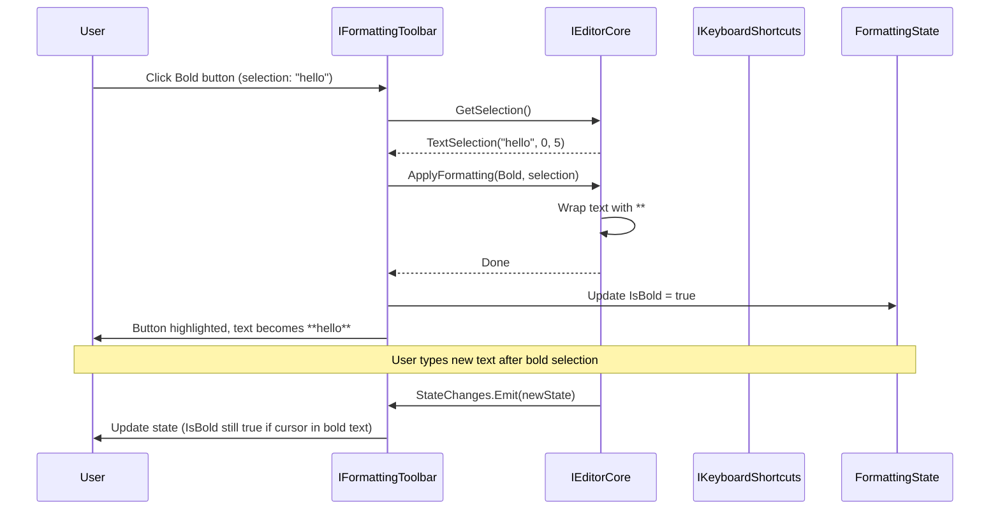
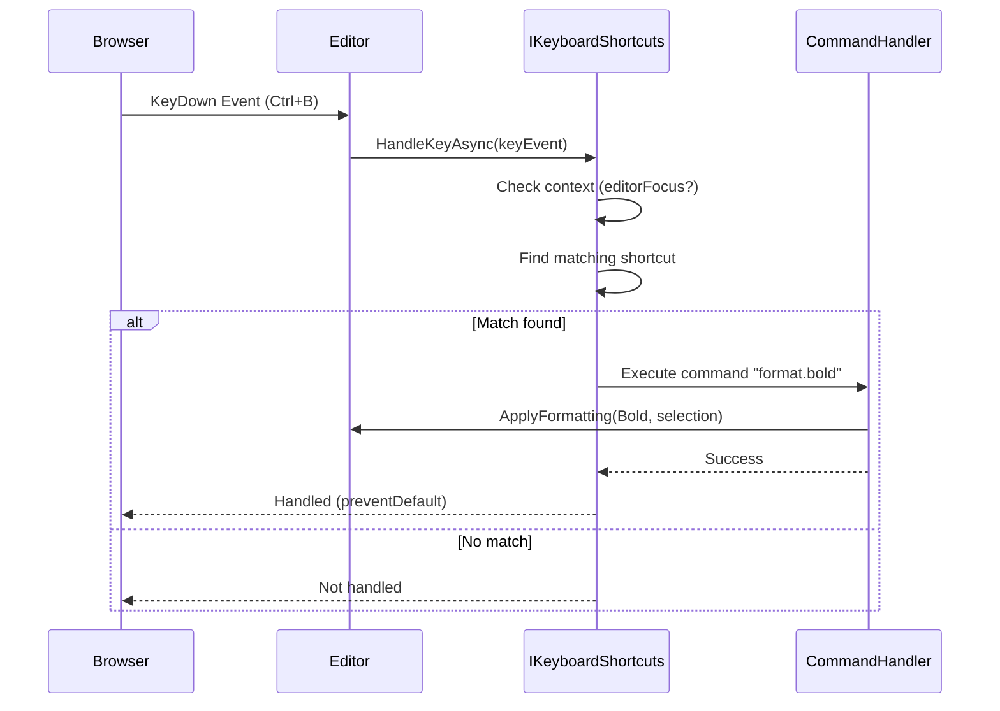
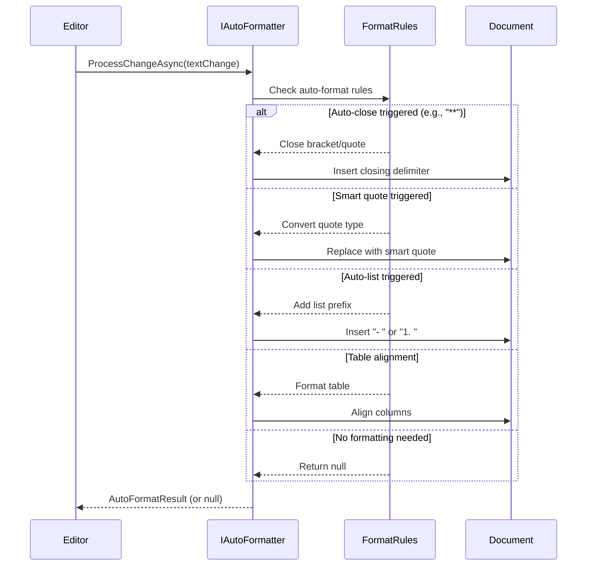

# LCS-SBD-v0.17.2-EDT: Scope Overview — Rich Formatting

## Document Control

| Field            | Value                                                        |
| :--------------- | :----------------------------------------------------------- |
| **Document ID**  | LCS-SBD-v0.17.2-EDT                                          |
| **Version**      | v0.17.2                                                      |
| **Codename**     | Rich Formatting (Intelligent Editor Phase 2)                 |
| **Status**       | Draft                                                        |
| **Last Updated** | 2026-02-01                                                   |
| **Owner**        | Editor Architecture Lead                                     |
| **Depends On**   | v0.17.1-EDT (Editor Foundation) |

---

## 1. Executive Summary

### 1.1 The Vision

**v0.17.2-EDT** delivers **Rich Formatting** — the comprehensive formatting system that transforms the editor from a plain text input into a professional document authoring tool. This establishes:

- A fully-featured formatting toolbar with grouped buttons for efficient formatting discovery
- A keyboard shortcut system supporting custom bindings, context conditions, and conflict detection
- A context menu system providing right-click access to formatting and editing operations
- A format painter tool for copying and applying formatting across multiple selections
- An intelligent auto-formatting engine handling on-type formatting, smart quotes, auto-closing, and table formatting
- Insert wizards for complex elements (links, images, tables, code blocks) with guided workflows

This is essential to the Intelligent Editor—without rich formatting capabilities, users cannot efficiently create and format professional documents.

### 1.2 Business Value

- **Productivity:** Toolbar and shortcuts enable rapid formatting without reaching for menus.
- **Accessibility:** Context menus make actions discoverable through right-click.
- **Polish:** Format painter and auto-formatting provide professional-grade formatting tools.
- **Guidance:** Insert wizards with previews reduce trial-and-error for complex elements.
- **Customization:** Custom keyboard shortcuts allow power users to optimize their workflow.
- **Consistency:** Auto-formatting ensures documents maintain consistent style automatically.

### 1.3 Success Criteria

1. Formatting toolbar renders all 20+ formatting buttons with live state updates (<50ms lag).
2. Keyboard shortcuts execute all 30+ commands with <10ms latency.
3. Context menus generate on right-click in <20ms and display 15+ contextual actions.
4. Format painter correctly copies and applies all formatting types (bold, italic, lists, headings).
5. Auto-formatting handles 10+ automatic transformations without user interaction.
6. Insert wizards provide guided workflows with live preview for links, images, tables, code blocks.
7. No keyboard shortcut conflicts detected across default and custom bindings.
8. 100% of Markdown formatting types (inline, block, lists, tables) supported.

---

## 2. Key Deliverables

### 2.1 Sub-Parts

| Sub-Part | Title | Description | Est. Hours |
|:---------|:------|:------------|:-----------|
| v0.17.2e | Formatting Toolbar | Button-based formatting UI with groups, dropdowns, and state indicators | 12 |
| v0.17.2f | Keyboard Shortcut System | Shortcut registration, binding, conflict detection, custom mappings | 10 |
| v0.17.2g | Context Menu System | Right-click menus with dynamic content, submenus, and action execution | 10 |
| v0.17.2h | Format Painter | Copy formatting state and apply to other selections with lock mode | 8 |
| v0.17.2i | Auto-Formatting Engine | On-type formatting, smart substitutions, auto-closing, table formatting | 8 |
| v0.17.2j | Insert Wizards | Guided workflows for links, images, tables, code blocks with preview | 6 |
| **Total** | | | **54 hours** |

### 2.2 Core Interfaces

```csharp
/// <summary>
/// Formatting toolbar for applying text formatting through UI buttons.
/// </summary>
public interface IFormattingToolbar
{
    /// <summary>
    /// Get all available formatting actions.
    /// </summary>
    Task<IReadOnlyList<FormattingAction>> GetActionsAsync(
        CancellationToken ct = default);

    /// <summary>
    /// Execute a formatting action on the current selection.
    /// </summary>
    Task ExecuteActionAsync(
        FormattingActionId actionId,
        FormattingContext context,
        CancellationToken ct = default);

    /// <summary>
    /// Get current formatting state at cursor position.
    /// </summary>
    Task<FormattingState> GetStateAsync(
        TextPosition position,
        TextSelection? selection,
        CancellationToken ct = default);

    /// <summary>
    /// Toggle formatting on selection (e.g., turn bold on/off).
    /// </summary>
    Task ToggleFormattingAsync(
        FormattingType type,
        TextSelection selection,
        CancellationToken ct = default);

    /// <summary>
    /// Get toolbar configuration (groups, ordering, visibility).
    /// </summary>
    Task<ToolbarConfiguration> GetConfigurationAsync(
        CancellationToken ct = default);

    /// <summary>
    /// Update toolbar configuration.
    /// </summary>
    Task SetConfigurationAsync(
        ToolbarConfiguration configuration,
        CancellationToken ct = default);

    /// <summary>
    /// Observable stream of formatting state changes.
    /// </summary>
    IObservable<FormattingState> StateChanges { get; }
}

public record FormattingAction
{
    public required FormattingActionId Id { get; init; }
    public required string Label { get; init; }
    public required string IconPath { get; init; }
    public string? Tooltip { get; init; }
    public FormattingType Type { get; init; }
    public KeyboardShortcut? Shortcut { get; init; }
    public bool IsToggle { get; init; } = true;
    public FormattingGroup Group { get; init; }
    public int Order { get; init; }
    public bool IsEnabled { get; init; } = true;
}

public readonly record struct FormattingActionId(string Value)
{
    public static FormattingActionId Bold => new("format.bold");
    public static FormattingActionId Italic => new("format.italic");
    public static FormattingActionId Strikethrough => new("format.strikethrough");
    public static FormattingActionId InlineCode => new("format.code");
    public static FormattingActionId Heading1 => new("format.h1");
    public static FormattingActionId Heading2 => new("format.h2");
    public static FormattingActionId Heading3 => new("format.h3");
    public static FormattingActionId BulletList => new("format.list.bullet");
    public static FormattingActionId NumberedList => new("format.list.numbered");
    public static FormattingActionId Link => new("format.link");
    public static FormattingActionId Image => new("format.image");
    public static FormattingActionId Table => new("format.table");
    public static FormattingActionId Quote => new("format.quote");
    public static FormattingActionId CodeBlock => new("format.codeblock");
}

public enum FormattingType
{
    // Inline formatting
    Bold,
    Italic,
    Strikethrough,
    InlineCode,
    Highlight,
    Subscript,
    Superscript,
    Link,

    // Block formatting
    Heading1,
    Heading2,
    Heading3,
    Heading4,
    Heading5,
    Heading6,
    Paragraph,
    Quote,
    CodeBlock,

    // List formatting
    BulletList,
    NumberedList,
    TaskList,
    IndentIncrease,
    IndentDecrease,

    // Complex elements
    HorizontalRule,
    Table,
    Image,
    Footnote,

    // Utilities
    ClearFormatting,
    FormatPainter
}

public enum FormattingGroup
{
    Text,       // Bold, italic, strikethrough, code
    Paragraph,  // Headings, paragraph, quote, alignment
    Lists,      // Bullet, numbered, task, indent
    Insert,     // Link, image, table, code block
    Tools       // Clear formatting, format painter
}

public record FormattingState
{
    public bool IsBold { get; init; }
    public bool IsItalic { get; init; }
    public bool IsStrikethrough { get; init; }
    public bool IsCode { get; init; }
    public bool IsLink { get; init; }
    public bool IsHighlight { get; init; }
    public HeadingLevel? HeadingLevel { get; init; }
    public bool IsQuote { get; init; }
    public bool IsCodeBlock { get; init; }
    public string? CodeBlockLanguage { get; init; }
    public ListType? ListType { get; init; }
    public int IndentLevel { get; init; }
    public bool IsTaskItem { get; init; }
    public bool? TaskChecked { get; init; }
    public TextAlignment Alignment { get; init; } = TextAlignment.Left;
}

public enum HeadingLevel { H1 = 1, H2, H3, H4, H5, H6 }
public enum ListType { Bullet, Numbered, Task }
public enum TextAlignment { Left, Center, Right, Justify }

public record FormattingContext
{
    public required DocumentId DocumentId { get; init; }
    public TextSelection? Selection { get; init; }
    public TextPosition CursorPosition { get; init; }
    public IReadOnlyDictionary<string, object>? Parameters { get; init; }
}

public record ToolbarConfiguration
{
    public IReadOnlyList<FormattingGroup> VisibleGroups { get; init; } = [];
    public IReadOnlyDictionary<FormattingGroup, int> GroupOrder { get; init; } = new Dictionary<FormattingGroup, int>();
    public bool ShowTooltips { get; init; } = true;
    public bool ShowKeyboardShortcuts { get; init; } = true;
    public int ButtonSize { get; init; } = 24;
}

/// <summary>
/// Keyboard shortcut system for editor commands.
/// </summary>
public interface IKeyboardShortcuts
{
    /// <summary>
    /// Get all registered shortcuts.
    /// </summary>
    Task<IReadOnlyList<KeyboardShortcut>> GetShortcutsAsync(
        CancellationToken ct = default);

    /// <summary>
    /// Get shortcuts for a specific command ID.
    /// </summary>
    Task<IReadOnlyList<KeyboardShortcut>> GetByCommandAsync(
        string commandId,
        CancellationToken ct = default);

    /// <summary>
    /// Register a new shortcut.
    /// </summary>
    Task RegisterAsync(
        KeyboardShortcut shortcut,
        CancellationToken ct = default);

    /// <summary>
    /// Unregister a shortcut by command ID.
    /// </summary>
    Task UnregisterAsync(
        string commandId,
        CancellationToken ct = default);

    /// <summary>
    /// Update an existing shortcut binding.
    /// </summary>
    Task UpdateAsync(
        string commandId,
        KeyBinding newBinding,
        CancellationToken ct = default);

    /// <summary>
    /// Handle a keyboard event and execute matching command.
    /// </summary>
    Task<ShortcutHandleResult> HandleKeyAsync(
        KeyEvent keyEvent,
        CancellationToken ct = default);

    /// <summary>
    /// Get all shortcut conflicts.
    /// </summary>
    Task<IReadOnlyList<ShortcutConflict>> GetConflictsAsync(
        CancellationToken ct = default);

    /// <summary>
    /// Check if a binding would conflict with existing shortcuts.
    /// </summary>
    Task<IReadOnlyList<ShortcutConflict>> CheckConflictsAsync(
        KeyBinding binding,
        CancellationToken ct = default);

    /// <summary>
    /// Reset all shortcuts to defaults.
    /// </summary>
    Task ResetToDefaultsAsync(CancellationToken ct = default);

    /// <summary>
    /// Export shortcuts to a portable format.
    /// </summary>
    Task<string> ExportAsync(CancellationToken ct = default);

    /// <summary>
    /// Import shortcuts from a portable format.
    /// </summary>
    Task ImportAsync(
        string content,
        CancellationToken ct = default);
}

public record KeyboardShortcut
{
    public required string CommandId { get; init; }
    public required KeyBinding KeyBinding { get; init; }
    public string? When { get; init; }  // Context condition (e.g., "editorFocus && !selection")
    public bool IsDefault { get; init; }
    public string? Description { get; init; }
    public int Priority { get; init; } = 0;  // Higher priority shortcuts take precedence
}

public record KeyBinding
{
    public required KeyCode Key { get; init; }
    public bool Ctrl { get; init; }
    public bool Alt { get; init; }
    public bool Shift { get; init; }
    public bool Meta { get; init; }  // Cmd on Mac, Win on Windows

    public string ToDisplayString()
    {
        var parts = new List<string>();
        if (Ctrl) parts.Add("Ctrl");
        if (Alt) parts.Add("Alt");
        if (Shift) parts.Add("Shift");
        if (Meta) parts.Add("Cmd");
        parts.Add(Key.ToString());
        return string.Join("+", parts);
    }

    public bool Matches(KeyEvent keyEvent) =>
        Key == keyEvent.Code &&
        Ctrl == keyEvent.CtrlKey &&
        Alt == keyEvent.AltKey &&
        Shift == keyEvent.ShiftKey &&
        Meta == keyEvent.MetaKey;
}

public enum KeyCode
{
    // Letters
    A, B, C, D, E, F, G, H, I, J, K, L, M,
    N, O, P, Q, R, S, T, U, V, W, X, Y, Z,

    // Numbers
    D0, D1, D2, D3, D4, D5, D6, D7, D8, D9,

    // Function keys
    F1, F2, F3, F4, F5, F6, F7, F8, F9, F10, F11, F12,

    // Special
    Enter, Escape, Tab, Space, Backspace, Delete,
    Up, Down, Left, Right, Home, End, PageUp, PageDown,

    // Punctuation
    Minus, Equal, BracketLeft, BracketRight,
    Semicolon, Quote, Backquote, Backslash, Comma, Period, Slash
}

public record ShortcutHandleResult
{
    public bool Handled { get; init; }
    public string? CommandId { get; init; }
    public string? ErrorMessage { get; init; }
}

public record ShortcutConflict
{
    public required string CommandId1 { get; init; }
    public required string CommandId2 { get; init; }
    public required KeyBinding ConflictingBinding { get; init; }
    public ConflictSeverity Severity { get; init; }
}

public enum ConflictSeverity { Warning, Error }

public record KeyEvent
{
    public required KeyCode Code { get; init; }
    public bool CtrlKey { get; init; }
    public bool AltKey { get; init; }
    public bool ShiftKey { get; init; }
    public bool MetaKey { get; init; }
    public bool Repeat { get; init; }
}

/// <summary>
/// Context menu system for right-click actions.
/// </summary>
public interface IContextMenuSystem
{
    /// <summary>
    /// Get context menu for current context.
    /// </summary>
    Task<ContextMenu> GetMenuAsync(
        ContextMenuContext context,
        CancellationToken ct = default);

    /// <summary>
    /// Register a context menu provider.
    /// </summary>
    Task RegisterProviderAsync(
        IContextMenuProvider provider,
        CancellationToken ct = default);

    /// <summary>
    /// Unregister a context menu provider.
    /// </summary>
    Task UnregisterProviderAsync(
        string providerId,
        CancellationToken ct = default);

    /// <summary>
    /// Execute a context menu action.
    /// </summary>
    Task ExecuteActionAsync(
        ContextMenuActionId actionId,
        ContextMenuContext context,
        CancellationToken ct = default);

    /// <summary>
    /// Get all registered providers.
    /// </summary>
    Task<IReadOnlyList<IContextMenuProvider>> GetProvidersAsync(
        CancellationToken ct = default);
}

public interface IContextMenuProvider
{
    /// <summary>
    /// Provider ID for management.
    /// </summary>
    string ProviderId { get; }

    /// <summary>
    /// Get menu items for this context.
    /// </summary>
    Task<IReadOnlyList<ContextMenuItem>> GetItemsAsync(
        ContextMenuContext context,
        CancellationToken ct = default);

    /// <summary>
    /// Check if this provider should contribute to the menu.
    /// </summary>
    Task<bool> AppliesToAsync(
        ContextMenuContext context,
        CancellationToken ct = default);
}

public record ContextMenu
{
    public IReadOnlyList<ContextMenuItem> Items { get; init; } = [];
}

public record ContextMenuItem
{
    public ContextMenuActionId? ActionId { get; init; }
    public string? Label { get; init; }
    public string? IconPath { get; init; }
    public KeyboardShortcut? Shortcut { get; init; }
    public bool IsEnabled { get; init; } = true;
    public bool IsSeparator { get; init; }
    public IReadOnlyList<ContextMenuItem>? Submenu { get; init; }
    public ContextMenuGroup Group { get; init; }
    public int Order { get; init; }
}

public readonly record struct ContextMenuActionId(string Value);

public enum ContextMenuGroup
{
    Edit,           // Cut, copy, paste, delete
    Selection,      // Select all, select word, select line
    Formatting,     // Bold, italic, heading, list
    Insert,         // Link, image, table, code block
    Advanced,       // Find, replace, spell check
    AI,             // AI actions
    Debug           // Development tools
}

public record ContextMenuContext
{
    public required DocumentId DocumentId { get; init; }
    public required TextPosition Position { get; init; }
    public TextSelection? Selection { get; init; }
    public string? Word { get; init; }
    public string? Line { get; init; }
    public ContextType Type { get; init; }
}

public enum ContextType
{
    Empty,
    Word,
    Selection,
    Link,
    Image,
    CodeBlock,
    ListItem,
    Table
}

/// <summary>
/// Format painter for copying and applying formatting.
/// </summary>
public interface IFormatPainter
{
    /// <summary>
    /// Whether format painter is currently active.
    /// </summary>
    bool IsActive { get; }

    /// <summary>
    /// Currently copied format.
    /// </summary>
    CopiedFormat? CopiedFormat { get; }

    /// <summary>
    /// Copy formatting from a selection.
    /// </summary>
    Task CopyFormatAsync(
        DocumentId documentId,
        TextSelection selection,
        CancellationToken ct = default);

    /// <summary>
    /// Apply copied formatting to a selection.
    /// </summary>
    Task ApplyFormatAsync(
        DocumentId documentId,
        TextSelection selection,
        CancellationToken ct = default);

    /// <summary>
    /// Toggle format painter lock mode (apply multiple times).
    /// </summary>
    Task ToggleLockAsync(CancellationToken ct = default);

    /// <summary>
    /// Clear format painter state.
    /// </summary>
    Task ClearAsync(CancellationToken ct = default);

    /// <summary>
    /// Observable stream of format painter state changes.
    /// </summary>
    IObservable<FormatPainterState> StateChanges { get; }
}

public record CopiedFormat
{
    public required FormattingState State { get; init; }
    public string? SourceText { get; init; }
    public DateTimeOffset CopiedAt { get; init; }
}

public record FormatPainterState
{
    public bool IsActive { get; init; }
    public bool IsLocked { get; init; }
    public CopiedFormat? Format { get; init; }
}

/// <summary>
/// Auto-formatting engine for automatic text formatting.
/// </summary>
public interface IAutoFormatter
{
    /// <summary>
    /// Get current auto-format settings.
    /// </summary>
    Task<AutoFormatSettings> GetSettingsAsync(CancellationToken ct = default);

    /// <summary>
    /// Update auto-format settings.
    /// </summary>
    Task UpdateSettingsAsync(
        AutoFormatSettings settings,
        CancellationToken ct = default);

    /// <summary>
    /// Process a text change for auto-formatting.
    /// </summary>
    Task<AutoFormatResult?> ProcessChangeAsync(
        DocumentId documentId,
        TextChange change,
        AutoFormatContext context,
        CancellationToken ct = default);

    /// <summary>
    /// Format an entire document.
    /// </summary>
    Task<FormattedDocument> FormatDocumentAsync(
        DocumentId documentId,
        FormatDocumentOptions options,
        CancellationToken ct = default);

    /// <summary>
    /// Format a selection.
    /// </summary>
    Task<FormattedRange> FormatSelectionAsync(
        DocumentId documentId,
        TextSelection selection,
        FormatSelectionOptions options,
        CancellationToken ct = default);
}

public record AutoFormatSettings
{
    // On-type formatting
    public bool FormatOnType { get; init; } = true;
    public bool AutoCloseBrackets { get; init; } = true;
    public bool AutoCloseQuotes { get; init; } = true;
    public bool AutoCloseMarkdown { get; init; } = true;  // **, __, ``
    public bool AutoIndent { get; init; } = true;
    public bool AutoList { get; init; } = true;  // Continue lists

    // Smart transformations
    public bool ConvertSmartQuotes { get; init; } = false;  // " → ""
    public bool ConvertDashes { get; init; } = false;       // -- → —
    public bool ConvertEllipsis { get; init; } = false;     // ... → …
    public bool ConvertFractions { get; init; } = false;    // 1/2 → ½
    public bool AutoLinkUrls { get; init; } = true;         // URL → [URL](URL)

    // Cleanup formatting
    public bool TrimTrailingWhitespace { get; init; } = true;
    public bool EnsureFinalNewline { get; init; } = true;
    public bool NormalizeIndentation { get; init; } = true;

    // Table formatting
    public bool AutoFormatTables { get; init; } = true;
    public bool AutoAlignTableColumns { get; init; } = true;
    public bool AutoPadTableCells { get; init; } = true;
}

public record AutoFormatResult
{
    public required TextEdit Edit { get; init; }
    public AutoFormatType Type { get; init; }
    public string? Description { get; init; }
}

public enum AutoFormatType
{
    AutoClose,
    AutoIndent,
    AutoList,
    SmartQuotes,
    SmartDashes,
    SmartEllipsis,
    UrlToLink,
    TableFormat,
    WhitespaceTrim,
    FractionConvert,
    Other
}

public record AutoFormatContext
{
    public string? PreviousLine { get; init; }
    public string? CurrentLine { get; init; }
    public string? NextLine { get; init; }
    public TextPosition Position { get; init; }
}

public record FormattedDocument
{
    public required DocumentId DocumentId { get; init; }
    public required string FormattedContent { get; init; }
    public IReadOnlyList<TextEdit> Changes { get; init; } = [];
}

public record FormattedRange
{
    public required TextSelection Selection { get; init; }
    public required string FormattedContent { get; init; }
    public IReadOnlyList<TextEdit> Changes { get; init; } = [];
}

public record FormatDocumentOptions
{
    public bool TrimTrailingWhitespace { get; init; } = true;
    public bool NormalizeIndentation { get; init; } = true;
    public bool EnsureFinalNewline { get; init; } = true;
    public int TabSize { get; init; } = 4;
}

public record FormatSelectionOptions
{
    public bool IncludeSurroundingContext { get; init; } = true;
}

/// <summary>
/// Insert wizards for guided insertion of complex elements.
/// </summary>
public interface IInsertWizards
{
    /// <summary>
    /// Show link insert wizard dialog.
    /// </summary>
    Task<LinkInsertResult?> InsertLinkAsync(
        LinkInsertOptions options,
        CancellationToken ct = default);

    /// <summary>
    /// Show image insert wizard dialog.
    /// </summary>
    Task<ImageInsertResult?> InsertImageAsync(
        ImageInsertOptions options,
        CancellationToken ct = default);

    /// <summary>
    /// Show table insert wizard dialog.
    /// </summary>
    Task<TableInsertResult?> InsertTableAsync(
        TableInsertOptions options,
        CancellationToken ct = default);

    /// <summary>
    /// Show code block insert wizard dialog.
    /// </summary>
    Task<CodeBlockInsertResult?> InsertCodeBlockAsync(
        CodeBlockInsertOptions options,
        CancellationToken ct = default);

    /// <summary>
    /// Show emoji picker dialog.
    /// </summary>
    Task<string?> PickEmojiAsync(CancellationToken ct = default);

    /// <summary>
    /// Get available code block languages.
    /// </summary>
    Task<IReadOnlyList<CodeLanguage>> GetLanguagesAsync(CancellationToken ct = default);
}

public record LinkInsertOptions
{
    public string? InitialUrl { get; init; }
    public string? InitialText { get; init; }
    public string? InitialTitle { get; init; }
    public bool AllowSearch { get; init; } = true;
    public bool AllowKnowledgeBase { get; init; } = true;
}

public record LinkInsertResult
{
    public required string Url { get; init; }
    public string? Text { get; init; }
    public string? Title { get; init; }

    public string ToMarkdown() =>
        string.IsNullOrEmpty(Title)
            ? $"[{Text ?? Url}]({Url})"
            : $"[{Text ?? Url}]({Url} \"{Title}\")";
}

public record ImageInsertOptions
{
    public string? InitialUrl { get; init; }
    public string? InitialAlt { get; init; }
    public string? InitialTitle { get; init; }
    public int? MaxWidth { get; init; }
    public int? MaxHeight { get; init; }
}

public record ImageInsertResult
{
    public required string Url { get; init; }
    public string? Alt { get; init; }
    public string? Title { get; init; }
    public int? Width { get; init; }
    public int? Height { get; init; }

    public string ToMarkdown() =>
        string.IsNullOrEmpty(Title)
            ? $""
            : $"";
}

public record TableInsertOptions
{
    public int InitialRows { get; init; } = 3;
    public int InitialColumns { get; init; } = 3;
    public bool IncludeHeader { get; init; } = true;
    public TableAlignment DefaultAlignment { get; init; } = TableAlignment.Left;
}

public record TableInsertResult
{
    public required int Rows { get; init; }
    public required int Columns { get; init; }
    public bool HasHeader { get; init; }
    public IReadOnlyList<TableAlignment>? ColumnAlignments { get; init; }
    public IReadOnlyList<IReadOnlyList<string>>? InitialData { get; init; }

    public string ToMarkdown()
    {
        var sb = new StringBuilder();
        if (HasHeader && InitialData?.Count > 0)
        {
            // Header row
            sb.AppendLine(string.Join(" | ", InitialData[0]));

            // Separator row
            var alignments = ColumnAlignments ?? Enumerable.Range(0, Columns)
                .Select(_ => TableAlignment.Left).ToList();
            var separators = alignments.Select(a => a switch
            {
                TableAlignment.Center => ":---:",
                TableAlignment.Right => "---:",
                _ => ":---"
            });
            sb.AppendLine(string.Join(" | ", separators));

            // Data rows
            for (int i = 1; i < InitialData.Count; i++)
            {
                sb.AppendLine(string.Join(" | ", InitialData[i]));
            }
        }
        return sb.ToString();
    }
}

public enum TableAlignment { Left, Center, Right }

public record CodeBlockInsertOptions
{
    public string? InitialLanguage { get; init; } = "csharp";
    public string? InitialCode { get; init; }
    public bool ShowLineNumbers { get; init; } = false;
    public bool Highlight { get; init; } = false;
}

public record CodeBlockInsertResult
{
    public required string Language { get; init; }
    public required string Code { get; init; }
    public bool ShowLineNumbers { get; init; }
    public IReadOnlyList<int>? HighlightLines { get; init; }

    public string ToMarkdown() =>
        $"```{Language}\n{Code}\n```";
}

public record CodeLanguage
{
    public required string Id { get; init; }
    public required string Name { get; init; }
    public IReadOnlyList<string> Aliases { get; init; } = [];
}
```

---

## 3. Architecture

### 3.1 Component Overview

```
┌─────────────────────────────────────────────────────────────────────────────┐
│                           Rich Formatting System                             │
├─────────────────────────────────────────────────────────────────────────────┤
│                                                                              │
│  ┌─────────────────────────────────────────────────────────────────────┐   │
│  │                    IFormattingToolbar                                │   │
│  │  ┌──────────────┐  ┌──────────────┐  ┌──────────────┐              │   │
│  │  │ Text Group   │  │ Paragraph    │  │ Lists Group  │              │   │
│  │  │ (B I S C)    │  │ Group        │  │ (• 1. ☐)     │              │   │
│  │  └──────────────┘  └──────────────┘  └──────────────┘              │   │
│  │                                                                      │   │
│  │  ┌──────────────┐  ┌──────────────┐  ┌──────────────┐              │   │
│  │  │ Insert Group │  │ Tools Group  │  │ State Updates│              │   │
│  │  │ (🔗 🖼 📊)   │  │ (🎨 ✨)      │  │ on Selection │              │   │
│  │  └──────────────┘  └──────────────┘  └──────────────┘              │   │
│  └─────────────────────────────────────────────────────────────────────┘   │
│                                                                              │
│  ┌─────────────────────────────────────────────────────────────────────┐   │
│  │                  IKeyboardShortcuts                                  │   │
│  │  ┌──────────────┐  ┌──────────────┐  ┌──────────────┐              │   │
│  │  │ Registration │  │ Event Handler│  │ Conflict     │              │   │
│  │  │ Management   │  │ & Execution  │  │ Detection    │              │   │
│  │  └──────────────┘  └──────────────┘  └──────────────┘              │   │
│  └─────────────────────────────────────────────────────────────────────┘   │
│                                                                              │
│  ┌─────────────────────────────────────────────────────────────────────┐   │
│  │               IContextMenuSystem                                     │   │
│  │  ┌──────────────┐  ┌──────────────┐  ┌──────────────┐              │   │
│  │  │ Provider     │  │ Menu Builder │  │ Event Handler│              │   │
│  │  │ Registry     │  │ & Rendering  │  │ & Execution  │              │   │
│  │  └──────────────┘  └──────────────┘  └──────────────┘              │   │
│  └─────────────────────────────────────────────────────────────────────┘   │
│                                                                              │
│  ┌─────────────────────────────────────────────────────────────────────┐   │
│  │               IFormatPainter                                         │   │
│  │  ┌──────────────┐  ┌──────────────┐  ┌──────────────┐              │   │
│  │  │ Copy Format  │  │ Apply Format │  │ Lock Mode    │              │   │
│  │  │ from         │  │ to           │  │ Toggle       │              │   │
│  │  │ Selection    │  │ Selection    │  │              │              │   │
│  │  └──────────────┘  └──────────────┘  └──────────────┘              │   │
│  └─────────────────────────────────────────────────────────────────────┘   │
│                                                                              │
│  ┌─────────────────────────────────────────────────────────────────────┐   │
│  │               IAutoFormatter                                         │   │
│  │  ┌──────────────┐  ┌──────────────┐  ┌──────────────┐              │   │
│  │  │ On-Type      │  │ Document     │  │ Table Format │              │   │
│  │  │ Processing   │  │ Formatting   │  │ Engine       │              │   │
│  │  └──────────────┘  └──────────────┘  └──────────────┘              │   │
│  └─────────────────────────────────────────────────────────────────────┘   │
│                                                                              │
│  ┌─────────────────────────────────────────────────────────────────────┐   │
│  │               IInsertWizards                                         │   │
│  │  ┌──────────────┐  ┌──────────────┐  ┌──────────────┐              │   │
│  │  │ Link Wizard  │  │ Image Wizard │  │ Table Wizard │              │   │
│  │  │ Dialog       │  │ Dialog       │  │ Dialog       │              │   │
│  │  └──────────────┘  └──────────────┘  └──────────────┘              │   │
│  │                    ┌──────────────┐                                 │   │
│  │                    │ Code Block   │                                 │   │
│  │                    │ Wizard Dialog│                                 │   │
│  │                    └──────────────┘                                 │   │
│  └─────────────────────────────────────────────────────────────────────┘   │
│                                 │                                           │
│              ┌──────────────────┼──────────────────┐                       │
│              ▼                  ▼                  ▼                       │
│  ┌───────────────────┐  ┌─────────────────┐  ┌──────────────────────────┐ │
│  │ IEditorCore       │  │ ITextRepository │  │ IDocumentCache           │ │
│  │ (from v0.17.1)    │  │ (from v0.17.1)  │  │ (from v0.17.1)           │ │
│  └───────────────────┘  └─────────────────┘  └──────────────────────────┘ │
│                                                                              │
└─────────────────────────────────────────────────────────────────────────────┘
```

### 3.2 Formatting Action Flow



### 3.3 Keyboard Shortcut Execution Flow



### 3.4 Auto-Formatting Pipeline



---

## 4. Data Model

### 4.1 Database Schema

```sql
-- Keyboard shortcut customizations per user
CREATE TABLE user_keyboard_shortcuts (
    id UUID PRIMARY KEY DEFAULT gen_random_uuid(),
    user_id UUID NOT NULL,
    command_id VARCHAR(100) NOT NULL,
    key_code VARCHAR(50) NOT NULL,
    ctrl_key BOOLEAN NOT NULL DEFAULT FALSE,
    alt_key BOOLEAN NOT NULL DEFAULT FALSE,
    shift_key BOOLEAN NOT NULL DEFAULT FALSE,
    meta_key BOOLEAN NOT NULL DEFAULT FALSE,
    when_context VARCHAR(500),
    priority INT NOT NULL DEFAULT 0,
    is_custom BOOLEAN NOT NULL DEFAULT TRUE,
    created_at TIMESTAMPTZ NOT NULL DEFAULT NOW(),
    updated_at TIMESTAMPTZ NOT NULL DEFAULT NOW(),

    UNIQUE(user_id, command_id, key_code, ctrl_key, alt_key, shift_key, meta_key),
    INDEX idx_shortcuts_user ON user_keyboard_shortcuts(user_id),
    INDEX idx_shortcuts_command ON user_keyboard_shortcuts(command_id),
    FOREIGN KEY (user_id) REFERENCES users(id) ON DELETE CASCADE
);

-- Auto-formatting preferences per user
CREATE TABLE user_autoformat_settings (
    id UUID PRIMARY KEY DEFAULT gen_random_uuid(),
    user_id UUID NOT NULL UNIQUE,
    format_on_type BOOLEAN NOT NULL DEFAULT TRUE,
    auto_close_brackets BOOLEAN NOT NULL DEFAULT TRUE,
    auto_close_quotes BOOLEAN NOT NULL DEFAULT TRUE,
    auto_close_markdown BOOLEAN NOT NULL DEFAULT TRUE,
    auto_indent BOOLEAN NOT NULL DEFAULT TRUE,
    auto_list BOOLEAN NOT NULL DEFAULT TRUE,
    convert_smart_quotes BOOLEAN NOT NULL DEFAULT FALSE,
    convert_dashes BOOLEAN NOT NULL DEFAULT FALSE,
    convert_ellipsis BOOLEAN NOT NULL DEFAULT FALSE,
    convert_fractions BOOLEAN NOT NULL DEFAULT FALSE,
    auto_link_urls BOOLEAN NOT NULL DEFAULT TRUE,
    trim_trailing_whitespace BOOLEAN NOT NULL DEFAULT TRUE,
    ensure_final_newline BOOLEAN NOT NULL DEFAULT TRUE,
    normalize_indentation BOOLEAN NOT NULL DEFAULT TRUE,
    auto_format_tables BOOLEAN NOT NULL DEFAULT TRUE,
    auto_align_table_columns BOOLEAN NOT NULL DEFAULT TRUE,
    created_at TIMESTAMPTZ NOT NULL DEFAULT NOW(),
    updated_at TIMESTAMPTZ NOT NULL DEFAULT NOW(),

    FOREIGN KEY (user_id) REFERENCES users(id) ON DELETE CASCADE
);

-- Toolbar configuration per user
CREATE TABLE user_toolbar_configs (
    id UUID PRIMARY KEY DEFAULT gen_random_uuid(),
    user_id UUID NOT NULL UNIQUE,
    visible_groups VARCHAR(50)[] NOT NULL DEFAULT ARRAY['Text', 'Paragraph', 'Lists', 'Insert', 'Tools'],
    show_tooltips BOOLEAN NOT NULL DEFAULT TRUE,
    show_keyboard_shortcuts BOOLEAN NOT NULL DEFAULT TRUE,
    button_size INT NOT NULL DEFAULT 24,
    created_at TIMESTAMPTZ NOT NULL DEFAULT NOW(),
    updated_at TIMESTAMPTZ NOT NULL DEFAULT NOW(),

    FOREIGN KEY (user_id) REFERENCES users(id) ON DELETE CASCADE
);

-- Formatting history for undo/redo (per document)
CREATE TABLE document_format_changes (
    id UUID PRIMARY KEY DEFAULT gen_random_uuid(),
    document_id UUID NOT NULL,
    sequence_number INT NOT NULL,
    change_type VARCHAR(50) NOT NULL,
    previous_content TEXT,
    new_content TEXT,
    selection_start INT,
    selection_end INT,
    created_at TIMESTAMPTZ NOT NULL DEFAULT NOW(),

    UNIQUE(document_id, sequence_number),
    INDEX idx_format_changes_document ON document_format_changes(document_id),
    FOREIGN KEY (document_id) REFERENCES documents(id) ON DELETE CASCADE
);

-- Shortcut key bindings (default shortcuts)
CREATE TABLE default_keyboard_shortcuts (
    id UUID PRIMARY KEY DEFAULT gen_random_uuid(),
    command_id VARCHAR(100) NOT NULL UNIQUE,
    key_code VARCHAR(50) NOT NULL,
    ctrl_key BOOLEAN NOT NULL DEFAULT FALSE,
    alt_key BOOLEAN NOT NULL DEFAULT FALSE,
    shift_key BOOLEAN NOT NULL DEFAULT FALSE,
    meta_key BOOLEAN NOT NULL DEFAULT FALSE,
    description VARCHAR(500),
    when_context VARCHAR(500),
    minimum_tier VARCHAR(50) NOT NULL DEFAULT 'Core',
    created_at TIMESTAMPTZ NOT NULL DEFAULT NOW()
);

-- Auto-formatting rule definitions
CREATE TABLE autoformat_rules (
    id UUID PRIMARY KEY DEFAULT gen_random_uuid(),
    rule_name VARCHAR(100) NOT NULL UNIQUE,
    rule_type VARCHAR(50) NOT NULL,
    pattern VARCHAR(500),
    replacement VARCHAR(500),
    enabled_by_default BOOLEAN NOT NULL DEFAULT TRUE,
    minimum_tier VARCHAR(50) NOT NULL DEFAULT 'Core',
    created_at TIMESTAMPTZ NOT NULL DEFAULT NOW()

    -- rule_type: auto_close, smart_quote, smart_dash, ellipsis, fraction, url_link, table, indent, list
);
```

### 4.2 Keyboard Shortcut Configuration JSON

```json
{
  "shortcuts": [
    {
      "commandId": "format.bold",
      "keyBinding": {
        "key": "B",
        "ctrl": true,
        "alt": false,
        "shift": false,
        "meta": false
      },
      "when": "editorFocus",
      "isDefault": true,
      "description": "Toggle bold formatting"
    },
    {
      "commandId": "format.italic",
      "keyBinding": {
        "key": "I",
        "ctrl": true,
        "alt": false,
        "shift": false,
        "meta": false
      },
      "when": "editorFocus",
      "isDefault": true,
      "description": "Toggle italic formatting"
    },
    {
      "commandId": "format.link",
      "keyBinding": {
        "key": "K",
        "ctrl": true,
        "alt": false,
        "shift": false,
        "meta": false
      },
      "when": "editorFocus",
      "isDefault": true,
      "description": "Insert or edit link"
    }
  ]
}
```

### 4.3 Toolbar Configuration JSON

```json
{
  "version": "1.0",
  "groups": [
    {
      "id": "text",
      "label": "Text Formatting",
      "order": 1,
      "buttons": [
        {
          "id": "format.bold",
          "label": "Bold",
          "icon": "bold.svg",
          "tooltip": "Bold (Ctrl+B)",
          "isToggle": true,
          "isVisible": true
        },
        {
          "id": "format.italic",
          "label": "Italic",
          "icon": "italic.svg",
          "tooltip": "Italic (Ctrl+I)",
          "isToggle": true,
          "isVisible": true
        },
        {
          "id": "format.strikethrough",
          "label": "Strikethrough",
          "icon": "strikethrough.svg",
          "tooltip": "Strikethrough",
          "isToggle": true,
          "isVisible": true
        },
        {
          "id": "format.code",
          "label": "Inline Code",
          "icon": "code.svg",
          "tooltip": "Inline Code (Ctrl+`)",
          "isToggle": true,
          "isVisible": true
        }
      ]
    },
    {
      "id": "paragraph",
      "label": "Paragraph",
      "order": 2,
      "buttons": [
        {
          "id": "format.h1",
          "label": "Heading 1",
          "icon": "h1.svg",
          "tooltip": "Heading 1",
          "isToggle": false,
          "isVisible": true
        },
        {
          "id": "format.h2",
          "label": "Heading 2",
          "icon": "h2.svg",
          "tooltip": "Heading 2",
          "isToggle": false,
          "isVisible": true
        },
        {
          "id": "format.quote",
          "label": "Quote",
          "icon": "quote.svg",
          "tooltip": "Block Quote",
          "isToggle": true,
          "isVisible": true
        }
      ]
    }
  ]
}
```

---

## 5. Formatting Toolbar UI

### 5.1 Main Toolbar Layout

```
┌────────────────────────────────────────────────────────────────────────────┐
│ ┌──────────────────────────────────────────────────────────────────────┐   │
│ │ [B] [I] [S] [C] │ [H▾] [¶] │ [•] [1.] [☐] │ [🔗] [🖼] [📊] │ [🎨] [✨] │   │
│ └──────────────────────────────────────────────────────────────────────┘   │
│ ↑ Text             ↑ Paragraph  ↑ Lists        ↑ Insert    ↑ Tools        │
│                                                                             │
│ When text is selected, formatting buttons update to show active state:      │
│                                                                             │
│ Selected text: "**Hello World**" (bold)                                     │
│ Toolbar:       [B̲] [I] [S] [C] │ ...  ← Bold button is highlighted        │
│                                                                             │
│ Tooltip preview on hover:                                                   │
│ Hover [B]:     "Bold (Ctrl+B)" → Show in tooltip                            │
│ Hover [I]:     "Italic (Ctrl+I)"                                            │
│ Hover [🔗]:    "Insert Link (Ctrl+K)"                                       │
│                                                                             │
│ Heading dropdown menu:                                                      │
│ ┌──────────────────┐                                                        │
│ │ ¶  Normal text   │                                                        │
│ │ H1 Heading 1     │                                                        │
│ │ H2 Heading 2     │                                                        │
│ │ H3 Heading 3     │                                                        │
│ │ ─────────────────│                                                        │
│ │ "  Block Quote   │                                                        │
│ │ `  Code Block    │                                                        │
│ └──────────────────┘                                                        │
│                                                                             │
└────────────────────────────────────────────────────────────────────────────┘
```

### 5.2 Format Painter UI

```
When Format Painter is active:
┌─────────────────────────────────────────┐
│ Copy Format                             │
│ Select text with format to copy         │
│ Then click on Format Painter button     │
│ Cursor changes to paintbrush icon       │
└─────────────────────────────────────────┘

After copying format:
┌─────────────────────────────────────────┐
│ [🎨 Format Painter ACTIVE]              │
│ (Click to show format painter options)  │
│                                         │
│ ☐ Lock (apply multiple times)           │
│ ☐ Clear                                 │
│                                         │
│ Copied format: Bold, Italic             │
│ Expires in: 30 seconds                  │
└─────────────────────────────────────────┘

Applying format:
1. Select destination text
2. Cursor shows paintbrush icon
3. Click to apply format
4. If unlocked, format painter deactivates
5. If locked, stay active for next selection
```

### 5.3 Insert Wizard Dialogs

```
Link Insert Wizard:
┌──────────────────────────────────────────┐
│ Insert Link                              │
├──────────────────────────────────────────┤
│                                          │
│ URL:                                     │
│ [_________________________________] 🔍  │
│                                          │
│ Display Text:                            │
│ [_________________________________]      │
│                                          │
│ Title (optional):                        │
│ [_________________________________]      │
│                                          │
│ ☐ Open in new tab                        │
│ ☐ Add to Table of Contents               │
│                                          │
│ ┌─────────────────────────────────────┐  │
│ │ Preview: [Display Text] → URL       │  │
│ └─────────────────────────────────────┘  │
│                                          │
│              [Cancel] [Insert]           │
└──────────────────────────────────────────┘

Table Insert Wizard:
┌──────────────────────────────────────────┐
│ Insert Table                             │
├──────────────────────────────────────────┤
│                                          │
│ Rows:     [3]   Columns: [3]             │
│ ☑ Include header row                     │
│                                          │
│ Alignment:                               │
│ ○ Left  ● Center  ○ Right  ○ Justified   │
│                                          │
│ ┌─────────────────────────────────────┐  │
│ │ Preview:                            │  │
│ │ ┌─────┬─────┬─────┐                 │  │
│ │ │ H1  │ H2  │ H3  │                 │  │
│ │ ├─────┼─────┼─────┤                 │  │
│ │ │ C11 │ C12 │ C13 │                 │  │
│ │ ├─────┼─────┼─────┤                 │  │
│ │ │ C21 │ C22 │ C23 │                 │  │
│ │ └─────┴─────┴─────┘                 │  │
│ └─────────────────────────────────────┘  │
│                                          │
│              [Cancel] [Insert]           │
└──────────────────────────────────────────┘

Code Block Insert Wizard:
┌──────────────────────────────────────────┐
│ Insert Code Block                        │
├──────────────────────────────────────────┤
│                                          │
│ Language:                                │
│ [csharp        ▼]  [Search languages]    │
│                                          │
│ ☐ Show line numbers                      │
│ ☐ Highlight lines                        │
│                                          │
│ Code:                                    │
│ ┌─────────────────────────────────────┐  │
│ │                                     │  │
│ │                                     │  │
│ │ (multi-line text editor)            │  │
│ │                                     │  │
│ └─────────────────────────────────────┘  │
│                                          │
│ ┌─────────────────────────────────────┐  │
│ │ Preview:                            │  │
│ │ ```csharp                           │  │
│ │ [code]                              │  │
│ │ ```                                 │  │
│ └─────────────────────────────────────┘  │
│                                          │
│              [Cancel] [Insert]           │
└──────────────────────────────────────────┘
```

---

## 6. Default Keyboard Shortcuts

### 6.1 Text Formatting Shortcuts

| Command | Windows/Linux | macOS | Context |
|:--------|:-------------|:------|:--------|
| Bold | Ctrl+B | Cmd+B | Selection or line |
| Italic | Ctrl+I | Cmd+I | Selection or line |
| Strikethrough | Ctrl+Shift+X | Cmd+Shift+X | Selection or line |
| Inline Code | Ctrl+` | Cmd+` | Selection or line |
| Highlight | Ctrl+Shift+H | Cmd+Shift+H | Selection |

### 6.2 Paragraph Shortcuts

| Command | Windows/Linux | macOS | Context |
|:--------|:-------------|:------|:--------|
| Heading 1 | Ctrl+Alt+1 | Cmd+Alt+1 | Line |
| Heading 2 | Ctrl+Alt+2 | Cmd+Alt+2 | Line |
| Heading 3 | Ctrl+Alt+3 | Cmd+Alt+3 | Line |
| Block Quote | Ctrl+' | Cmd+' | Line |
| Code Block | Ctrl+Shift+` | Cmd+Shift+` | Line |

### 6.3 List Shortcuts

| Command | Windows/Linux | macOS | Context |
|:--------|:-------------|:------|:--------|
| Bullet List | Ctrl+Shift+L | Cmd+Shift+L | Line |
| Numbered List | Ctrl+Shift+O | Cmd+Shift+O | Line |
| Task List | Ctrl+Shift+[ | Cmd+Shift+[ | Line |
| Indent | Tab | Tab | Line or selection |
| Dedent | Shift+Tab | Shift+Tab | Line or selection |

### 6.4 Insert Shortcuts

| Command | Windows/Linux | macOS | Context |
|:--------|:-------------|:------|:--------|
| Link | Ctrl+K | Cmd+K | Editor focus |
| Image | Ctrl+Shift+I | Cmd+Shift+I | Editor focus |
| Table | Ctrl+Shift+T | Cmd+Shift+T | Editor focus |
| Horizontal Rule | Ctrl+Alt+- | Cmd+Alt+- | Editor focus |

### 6.5 Tools Shortcuts

| Command | Windows/Linux | macOS | Context |
|:--------|:-------------|:------|:--------|
| Clear Formatting | Ctrl+M | Cmd+M | Selection |
| Format Painter | Ctrl+Shift+C | Cmd+Shift+C | Editor focus |
| Format Document | Ctrl+Shift+F | Cmd+Shift+F | Editor focus |

---

## 7. Auto-Formatting Rules

### 7.1 On-Type Formatting

| Rule | Trigger | Action | Example |
|:-----|:--------|:-------|:--------|
| Auto-close brackets | `(`, `[`, `{` | Insert closing bracket | `(` → `()`  |
| Auto-close quotes | `"`, `'`, `` ` `` | Insert closing quote | `"` → `""` |
| Auto-close markdown | `*`, `_`, `` ` `` | Insert closing delimiter | `**` → `****` |
| Smart quotes | `"`, `'` (setting) | Convert to smart quotes | `"hello"` → `"hello"` |
| Smart dashes | `--` (setting) | Convert to em-dash | `hello--world` → `hello—world` |
| Smart ellipsis | `...` (setting) | Convert to ellipsis | `...` → `…` |

### 7.2 Context-Based Formatting

| Rule | Context | Action | Example |
|:-----|:---------|:-------|:--------|
| Auto-list continuation | After `- ` or `* ` | Continue list on new line | Press Enter → New `- ` |
| Auto-indent | In list or block | Maintain indentation | Press Enter → Preserve indent |
| URL to link | Standalone URL | Convert URL to markdown link | `https://example.com` → `[https://example.com](https://example.com)` |
| Table alignment | In table cell | Reformat table after edit | Edit cell → Realign columns |

---

## 8. License Gating

### 8.1 Feature Availability by Tier

| Feature | Core | WriterPro | Teams | Enterprise |
|:--------|:-----|:----------|:------|:-----------|
| Formatting Toolbar | - | ✓ | ✓ | ✓ |
| Toolbar Customization | - | - | ✓ | ✓ |
| Keyboard Shortcuts (default) | ✓ | ✓ | ✓ | ✓ |
| Keyboard Shortcuts (custom) | - | - | - | ✓ |
| Shortcut Conflict Detection | - | ✓ | ✓ | ✓ |
| Context Menus | - | ✓ | ✓ | ✓ |
| Format Painter | - | - | ✓ | ✓ |
| Auto-Formatting (all rules) | - | - | ✓ | ✓ |
| Auto-Formatting (basic only) | ✓ | ✓ | ✓ | ✓ |
| Insert Wizards (all) | - | ✓ | ✓ | ✓ |
| Insert Wizards (link only) | ✓ | ✓ | ✓ | ✓ |
| Emoji Picker | - | - | ✓ | ✓ |

### 8.2 Auto-Formatting Rule Gating

| Rule | Core | WriterPro | Teams | Enterprise |
|:-----|:-----|:----------|:------|:-----------|
| Auto-close brackets | ✓ | ✓ | ✓ | ✓ |
| Auto-indent | ✓ | ✓ | ✓ | ✓ |
| Auto-list continuation | - | ✓ | ✓ | ✓ |
| Smart quotes | - | - | ✓ | ✓ |
| Smart dashes | - | - | ✓ | ✓ |
| Smart ellipsis | - | - | ✓ | ✓ |
| Smart fractions | - | - | ✓ | ✓ |
| URL to link | ✓ | ✓ | ✓ | ✓ |
| Table formatting | - | - | ✓ | ✓ |
| Whitespace cleanup | ✓ | ✓ | ✓ | ✓ |

---

## 9. Dependencies

| Component | Source | Usage |
|:----------|:-------|:------|
| `IEditorCore` | v0.17.1-EDT | Editor instance, text operations |
| `ITextRepository` | v0.17.1-EDT | Document content, selections |
| `IDocumentCache` | v0.17.1-EDT | Cached document state |
| `ILicenseService` | v0.2.1a | License tier checks, feature gating |
| `ISettingsService` | v0.1.6a | User preferences for formatting |
| `IMediator` | v0.0.7a | Event publication for formatting changes |
| `Blazor.Components` | Latest | Dialog components for insert wizards |

---

## 10. Performance Targets

| Metric | Target | Measurement |
|:-------|:-------|:------------|
| Toolbar render | <20ms | Initial render + state updates |
| Format action execute | <10ms | Apply formatting to selection |
| Keyboard shortcut handle | <5ms | Detect and execute shortcut |
| Context menu generation | <20ms | Build and display menu |
| Format painter copy | <5ms | Copy format from selection |
| Format painter apply | <15ms | Apply format to selection |
| Auto-format on-type | <50ms | Process change, apply format |
| Insert wizard dialog open | <100ms | Open and render dialog |
| Conflict detection | <50ms | Detect conflicts for new binding |

---

## 11. Testing Strategy

### 11.1 Unit Tests

- Formatting action execution with all formatting types
- Keyboard shortcut registration, matching, and execution
- Context menu generation and action dispatch
- Format painter copy/apply with all format types
- Auto-formatting rule processing (all 10+ rules)
- Insert wizard input validation and markdown generation
- Shortcut conflict detection and resolution
- Formatting state calculation from text
- License tier enforcement for all features

### 11.2 Integration Tests

- Full formatting toolbar workflow (click button → apply format → update state)
- Keyboard shortcut flow (key event → shortcut match → command execute)
- Context menu flow (right-click → menu build → action execute)
- Format painter lock mode (copy → lock → apply → apply → clear)
- Auto-formatter with complex scenarios (nested lists, tables, code blocks)
- Insert wizard workflows (open → input → preview → generate markdown)
- Concurrent formatting operations on same selection
- Undo/redo with formatting changes
- License tier enforcement across all features

### 11.3 Performance Tests

- Toolbar with 20+ buttons renders at 60fps
- Format action on 1MB document completes <50ms
- Keyboard shortcut from 100+ registered shortcuts executes <10ms
- Context menu with 50+ items builds and displays <30ms
- Auto-formatter processes 1000+ character document <100ms
- Format painter copies/applies format on large selection <20ms
- Insert wizard renders with preview <150ms
- Conflict detection on 200+ shortcuts <100ms

### 11.4 UI Tests

- Toolbar button state updates when selection changes
- Toolbar button click applies formatting correctly
- Keyboard shortcuts execute in all contexts
- Context menu appears on right-click with correct items
- Format painter cursor changes and lock mode works
- Auto-formatting triggers on-type without lag
- Insert wizard dialogs open, validate input, and generate markdown
- Tooltip shows keyboard shortcut for all buttons
- License-gated features are disabled for lower tiers

---

## 12. Risks & Mitigations

| Risk | Impact | Mitigation |
|:-----|:-------|:-----------|
| Keyboard shortcut conflicts | User confusion, unexpected behavior | Conflict detection, warning dialogs, priority system |
| Auto-formatting unwanted | User frustration | User settings per rule, easy disable, undo support |
| Performance with large documents | UI lag, poor UX | Debouncing, async processing, incremental updates |
| Context menu with many items | Slow menu generation | Provider registration, lazy loading, caching |
| Insert wizard complexity | User confusion | Step-by-step guidance, preview, help text |
| Format painter state loss | Lost format on navigation | Timeout warning, lock mode, clear button |
| License gating circumvention | Revenue loss | Strict server-side checks, consistent UI |
| Markdown syntax conflicts | Unexpected results | Rule priority system, collision detection |

---

## 13. MediatR Events

| Event | Description | When |
|:------|:------------|:-----|
| `FormattingActionExecutedEvent` | Formatting action applied to document | After format action completes |
| `KeyboardShortcutFiredEvent` | Keyboard shortcut matched and executed | After shortcut execution |
| `ContextMenuActionExecutedEvent` | Context menu action selected | After action execution |
| `FormatPainterActivatedEvent` | Format painter mode started | When copy format completes |
| `FormatPainterDeactivatedEvent` | Format painter mode ended | When clear or apply completes |
| `AutoFormatAppliedEvent` | Auto-formatting rule applied | After automatic formatting |
| `FormattingStateChangedEvent` | Formatting state updated | When cursor moves or selection changes |
| `InsertWizardCompletedEvent` | Insert wizard generated markdown | After wizard completion |
| `KeyboardShortcutConflictDetectedEvent` | Shortcut conflict found | During registration or binding update |

---

## 14. Appendix A: Markdown Format Support Matrix

### 14.1 Inline Formats

| Format | Markdown | UI Button | Shortcut | Auto-Format | Format Painter |
|:-------|:---------|:----------|:---------|:-----------|:--------|
| Bold | `**text**` | [B] | Ctrl+B | ✓ | ✓ |
| Italic | `*text*` | [I] | Ctrl+I | ✓ | ✓ |
| Strikethrough | `~~text~~` | [S] | Ctrl+Shift+X | ✓ | ✓ |
| Inline Code | `` `text` `` | [C] | Ctrl+` | ✓ | ✓ |
| Highlight | `==text==` | [H] | Ctrl+Shift+H | - | ✓ |
| Subscript | `H~2~O` | - | - | - | ✓ |
| Superscript | `E=mc^2^` | - | - | - | ✓ |
| Link | `[text](url)` | [🔗] | Ctrl+K | ✓ | - |

### 14.2 Block Formats

| Format | Markdown | UI Button | Shortcut | Auto-Format | Format Painter |
|:-------|:---------|:----------|:---------|:-----------|:--------|
| Heading 1 | `# text` | [H1] | Ctrl+Alt+1 | - | ✓ |
| Heading 2 | `## text` | [H2] | Ctrl+Alt+2 | - | ✓ |
| Heading 3 | `### text` | [H3] | Ctrl+Alt+3 | - | ✓ |
| Paragraph | Normal | [¶] | - | - | ✓ |
| Quote | `> text` | ["] | Ctrl+' | ✓ | ✓ |
| Code Block | ` ``` ` | [<>] | Ctrl+Shift+` | - | ✓ |

### 14.3 List Formats

| Format | Markdown | UI Button | Shortcut | Auto-Format | Format Painter |
|:-------|:---------|:----------|:---------|:-----------|:--------|
| Bullet List | `- text` | [•] | Ctrl+Shift+L | ✓ | ✓ |
| Numbered List | `1. text` | [1.] | Ctrl+Shift+O | ✓ | ✓ |
| Task List | `- [ ] text` | [☐] | Ctrl+Shift+[ | ✓ | ✓ |
| Indent | (4 spaces) | [⇢] | Tab | ✓ | ✓ |
| Dedent | (remove spaces) | [⇠] | Shift+Tab | ✓ | ✓ |

### 14.4 Complex Elements

| Element | Markdown | UI Button | Wizard | Auto-Format |
|:--------|:---------|:----------|:-------|:-----------|
| Table | Pipe table | [📊] | ✓ | ✓ |
| Image | `` | [🖼] | ✓ | - |
| Horizontal Rule | `---` | - | - | - |
| Footnote | `[^1]` | - | - | - |

---

## 15. Appendix B: Example Workflows

### Example 1: Creating a Simple Formatted Document

```
User Action                    System Response
─────────────────────────────────────────────────────────────
1. Type "Hello World"
2. Select text                 Toolbar: [B] [I] [S] appear enabled
3. Click [B] button            Text becomes **Hello World**
4. Ctrl+I                      Text becomes ***Hello World***
5. Click [H1]                  Line becomes: # Hello World
6. Click [🔗] button           Link wizard opens
7. Enter URL, text             Markdown generated: [text](url)
8. Result                      # [text](url) Hello World
```

### Example 2: Building a Table with Auto-Formatting

```
User Action                    System Response
─────────────────────────────────────────────────────────────
1. Click [📊] Insert Table      Table wizard opens
2. Set 3 rows, 3 cols          Preview shows 3x3 table
3. Click [Insert]              Empty table inserted
4. Fill in cells               Auto-format aligns columns
5. Edit cell value             Table reformatted automatically
6. Result                      Perfectly aligned Markdown table
```

### Example 3: Using Format Painter

```
User Action                    System Response
─────────────────────────────────────────────────────────────
1. Select "**Bold Text**"      Formatting captured
2. Click [🎨] Format Painter    Paintbrush cursor appears
3. Check ☐ Lock               Format Painter locked
4. Select "Other Text" #1      Format applied → **Other Text**
5. Select "Another Text" #2    Format applied → **Another Text**
6. Click [🎨] to clear         Paint mode exits
```

---

**Document End**
