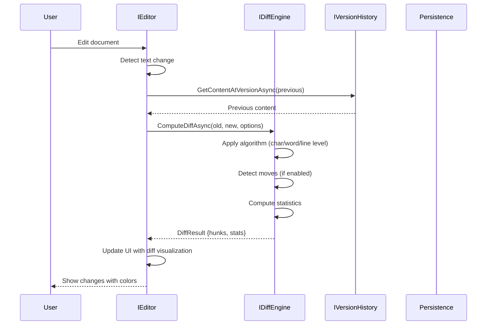
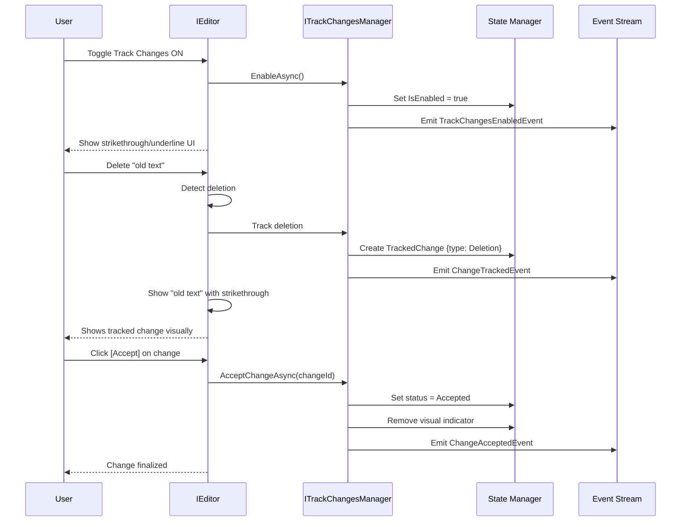
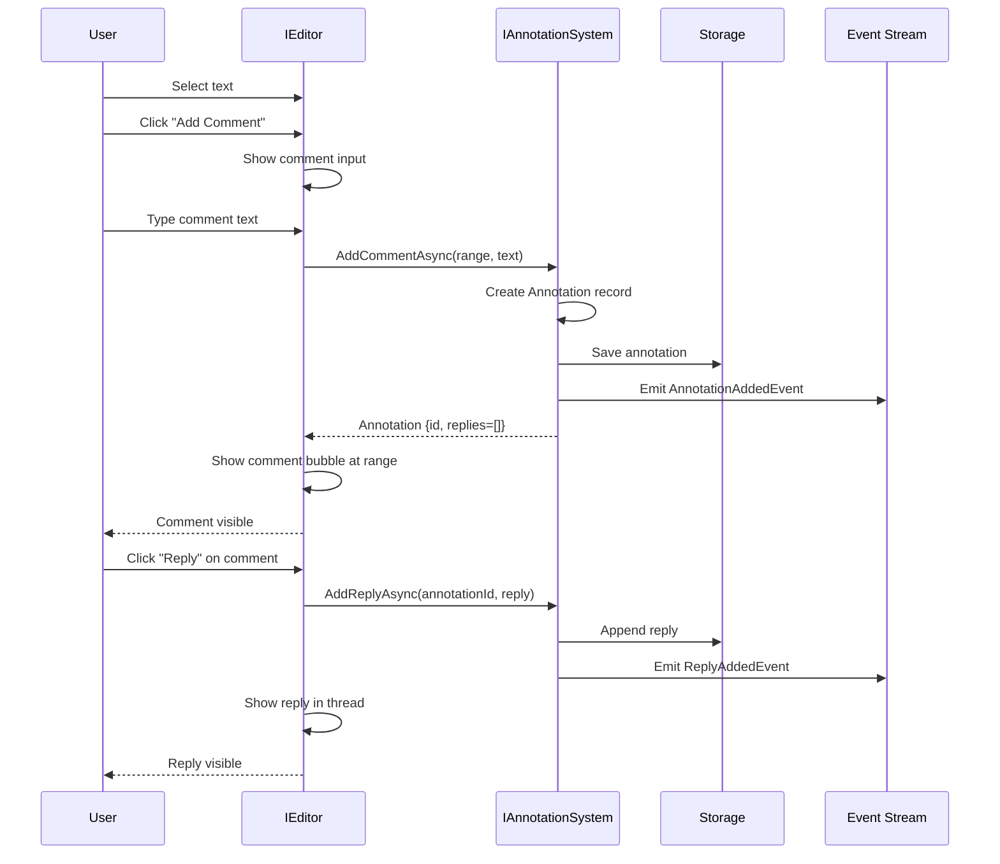

# LCS-SBD-v0.17.3-EDT: Scope Overview — Change Tracking

## Document Control

| Field            | Value                                                        |
| :--------------- | :----------------------------------------------------------- |
| **Document ID**  | LCS-SBD-v0.17.3-EDT                                          |
| **Version**      | v0.17.3                                                      |
| **Codename**     | Change Tracking (Intelligent Editor Phase 3)                 |
| **Status**       | Draft                                                        |
| **Last Updated** | 2026-02-01                                                   |
| **Owner**        | Editor Architecture Lead                                     |
| **Depends On**   | v0.17.1-EDT (Split View), v0.17.2-EDT (Formatting), v0.5.x-CKVS (Document Storage) |

---

## 1. Executive Summary

### 1.1 The Vision

**v0.17.3-EDT** delivers **Change Tracking** — the professional-grade collaboration and versioning system that empowers teams to co-author, review, and refine documents with confidence. This establishes:

- A high-performance diff engine supporting character, word, line, sentence, and paragraph-level comparison
- Comprehensive version history with automatic snapshots, manual checkpoints, and intelligent retention policies
- Track changes mode (Word/Google Docs-style) with insertion, deletion, replacement, and format change tracking
- Rich annotation system supporting comments, highlights, suggestions, questions, and replies
- Intuitive change review UI with accept/reject workflows and navigation
- Merge resolution and conflict detection for collaborative scenarios

This transforms the Lexichord editor from a solo writing tool into an enterprise-grade collaborative authoring platform.

### 1.2 Business Value

- **Collaboration:** Multiple users can safely edit with full visibility of changes and attribution
- **Accountability:** Every change is tracked with author, timestamp, and rationale
- **Confidence:** Document history enables confidence in experimentation and exploration
- **Review Workflows:** Accept/reject UI enables efficient editorial workflows
- **Compliance:** Audit trail and version snapshots meet regulatory requirements
- **Recovery:** Complete version history enables recovery from accidental deletions
- **Transparency:** Annotations enable rich discussion without cluttering the document

### 1.3 Success Criteria

1. Diff computation completes in <200ms for typical 10,000-word documents (P95)
2. Version history supports 1,000+ versions without performance degradation
3. Track changes mode tracks 100% of content mutations with correct attribution
4. Annotation system handles 1,000+ annotations per document
5. Accept/reject operations complete in <50ms for single or batch operations
6. Merge resolution correctly handles 95%+ of non-conflicting concurrent edits
7. License gating enforces feature availability across all 4 tiers

---

## 2. Key Deliverables

### 2.1 Sub-Parts

| Sub-Part | Title | Description | Est. Hours |
|:---------|:------|:------------|:-----------|
| v0.17.3e | Diff Engine | Character/word/line/sentence/paragraph diffing with semantic cleanup | 12 |
| v0.17.3f | Version History | Auto snapshots, checkpoints, retention policies, restoration | 12 |
| v0.17.3g | Track Changes Mode | Insert/delete/replace/format tracking with author/timestamp | 12 |
| v0.17.3h | Annotation System | Comments, highlights, suggestions, replies, resolution | 10 |
| v0.17.3i | Change Review UI | Change panel, accept/reject, navigation, batch operations | 6 |
| v0.17.3j | Merge & Conflict Resolution | Diff-based merge, conflict detection, three-way merge | 6 |
| **Total** | | | **58 hours** |

### 2.2 Core Interfaces

```csharp
/// <summary>
/// Diff engine for comparing document versions.
/// Supports multiple granularities and semantic cleanup.
/// </summary>
public interface IDiffEngine
{
    /// <summary>
    /// Compute diff between two texts.
    /// </summary>
    Task<DiffResult> ComputeDiffAsync(
        string oldText,
        string newText,
        DiffOptions options,
        CancellationToken ct = default);

    /// <summary>
    /// Compute diff between document versions.
    /// </summary>
    Task<DiffResult> ComputeVersionDiffAsync(
        DocumentId documentId,
        VersionId oldVersion,
        VersionId newVersion,
        DiffOptions options,
        CancellationToken ct = default);

    /// <summary>
    /// Get inline diff for display (red/green strikethrough).
    /// </summary>
    Task<InlineDiff> GetInlineDiffAsync(
        DiffResult diff,
        CancellationToken ct = default);

    /// <summary>
    /// Get side-by-side diff for display.
    /// </summary>
    Task<SideBySideDiff> GetSideBySideDiffAsync(
        DiffResult diff,
        CancellationToken ct = default);

    /// <summary>
    /// Detect moved blocks of text.
    /// </summary>
    Task<IReadOnlyList<MovedBlock>> DetectMovedBlocksAsync(
        DiffResult diff,
        CancellationToken ct = default);
}

public record DiffOptions
{
    /// <summary>
    /// Level of granularity for diff.
    /// </summary>
    public DiffGranularity Granularity { get; init; } = DiffGranularity.Word;

    /// <summary>
    /// Ignore whitespace changes.
    /// </summary>
    public bool IgnoreWhitespace { get; init; } = false;

    /// <summary>
    /// Ignore case differences.
    /// </summary>
    public bool IgnoreCase { get; init; } = false;

    /// <summary>
    /// Lines of context to include around changes.
    /// </summary>
    public int ContextLines { get; init; } = 3;

    /// <summary>
    /// Detect and flag moved text blocks.
    /// </summary>
    public bool DetectMoves { get; init; } = true;

    /// <summary>
    /// Apply semantic cleanup (minor reformatting).
    /// </summary>
    public bool SemanticCleanup { get; init; } = true;
}

public enum DiffGranularity
{
    /// <summary>Character-by-character diff.</summary>
    Character,

    /// <summary>Word-by-word diff (space-separated).</summary>
    Word,

    /// <summary>Line-by-line diff.</summary>
    Line,

    /// <summary>Sentence-by-sentence diff.</summary>
    Sentence,

    /// <summary>Paragraph-by-paragraph diff.</summary>
    Paragraph
}

public record DiffResult
{
    /// <summary>
    /// Original text.
    /// </summary>
    public required string OldText { get; init; }

    /// <summary>
    /// New text.
    /// </summary>
    public required string NewText { get; init; }

    /// <summary>
    /// Hunks of changes.
    /// </summary>
    public IReadOnlyList<DiffHunk> Hunks { get; init; } = [];

    /// <summary>
    /// Statistics about the changes.
    /// </summary>
    public DiffStatistics Statistics { get; init; } = new();

    /// <summary>
    /// Whether any changes exist.
    /// </summary>
    public bool HasChanges => Hunks.Count > 0;
}

public record DiffHunk
{
    /// <summary>
    /// Starting line number in old text.
    /// </summary>
    public required int OldStart { get; init; }

    /// <summary>
    /// Number of lines affected in old text.
    /// </summary>
    public required int OldLength { get; init; }

    /// <summary>
    /// Starting line number in new text.
    /// </summary>
    public required int NewStart { get; init; }

    /// <summary>
    /// Number of lines affected in new text.
    /// </summary>
    public required int NewLength { get; init; }

    /// <summary>
    /// Individual line changes in this hunk.
    /// </summary>
    public IReadOnlyList<DiffLine> Lines { get; init; } = [];
}

public record DiffLine
{
    /// <summary>
    /// Type of change for this line.
    /// </summary>
    public required DiffLineType Type { get; init; }

    /// <summary>
    /// Line content.
    /// </summary>
    public required string Content { get; init; }

    /// <summary>
    /// Line number in old text (null if added).
    /// </summary>
    public int? OldLineNumber { get; init; }

    /// <summary>
    /// Line number in new text (null if deleted).
    /// </summary>
    public int? NewLineNumber { get; init; }

    /// <summary>
    /// Inline changes within the line (character/word level).
    /// </summary>
    public IReadOnlyList<DiffSpan>? InlineChanges { get; init; }
}

public enum DiffLineType
{
    /// <summary>No change to this line.</summary>
    Unchanged,

    /// <summary>Line was added.</summary>
    Added,

    /// <summary>Line was deleted.</summary>
    Removed,

    /// <summary>Line was modified (shown with inline changes).</summary>
    Modified
}

public record DiffSpan
{
    /// <summary>
    /// Starting position in the line.
    /// </summary>
    public required int Start { get; init; }

    /// <summary>
    /// Length of the span.
    /// </summary>
    public required int Length { get; init; }

    /// <summary>
    /// Type of change.
    /// </summary>
    public required DiffSpanType Type { get; init; }
}

public enum DiffSpanType
{
    /// <summary>No change.</summary>
    Unchanged,

    /// <summary>Text was added.</summary>
    Added,

    /// <summary>Text was removed.</summary>
    Removed
}

public record DiffStatistics
{
    /// <summary>
    /// Number of lines/words/chars added.
    /// </summary>
    public int Additions { get; init; }

    /// <summary>
    /// Number of lines/words/chars deleted.
    /// </summary>
    public int Deletions { get; init; }

    /// <summary>
    /// Number of lines/words/chars modified (not added/deleted).
    /// </summary>
    public int Modifications { get; init; }

    /// <summary>
    /// Number of text blocks that moved.
    /// </summary>
    public int MovedBlocks { get; init; }

    /// <summary>
    /// Similarity percentage (0-100).
    /// </summary>
    public float SimilarityPercent { get; init; }
}

public record InlineDiff
{
    /// <summary>
    /// Formatted text with inline change indicators.
    /// </summary>
    public required string FormattedText { get; init; }

    /// <summary>
    /// Positions of changes for styling.
    /// </summary>
    public IReadOnlyList<DiffHighlight> Highlights { get; init; } = [];
}

public record SideBySideDiff
{
    /// <summary>
    /// Old version lines.
    /// </summary>
    public IReadOnlyList<DiffLine> OldLines { get; init; } = [];

    /// <summary>
    /// New version lines.
    /// </summary>
    public IReadOnlyList<DiffLine> NewLines { get; init; } = [];

    /// <summary>
    /// Alignment between old and new lines.
    /// </summary>
    public IReadOnlyList<LineAlignment> Alignments { get; init; } = [];
}

public record DiffHighlight
{
    /// <summary>
    /// Position of the change.
    /// </summary>
    public TextRange Range { get; init; }

    /// <summary>
    /// Type of change.
    /// </summary>
    public DiffChangeType ChangeType { get; init; }
}

public enum DiffChangeType { Added, Removed, Modified }

public record LineAlignment
{
    /// <summary>
    /// Index in old text (null if added).
    /// </summary>
    public int? OldLineIndex { get; init; }

    /// <summary>
    /// Index in new text (null if deleted).
    /// </summary>
    public int? NewLineIndex { get; init; }
}

public record MovedBlock
{
    /// <summary>
    /// Original position in old text.
    /// </summary>
    public TextRange OldRange { get; init; }

    /// <summary>
    /// New position in new text.
    /// </summary>
    public TextRange NewRange { get; init; }

    /// <summary>
    /// Content of the moved block.
    /// </summary>
    public string Content { get; init; } = "";

    /// <summary>
    /// Confidence this is actually a move (0-1).
    /// </summary>
    public float Confidence { get; init; }
}

/// <summary>
/// Version history management for documents.
/// Supports auto-snapshots, checkpoints, and retention policies.
/// </summary>
public interface IVersionHistory
{
    /// <summary>
    /// Get version history for a document.
    /// </summary>
    Task<IReadOnlyList<DocumentVersion>> GetHistoryAsync(
        DocumentId documentId,
        VersionHistoryOptions options,
        CancellationToken ct = default);

    /// <summary>
    /// Get a specific version by ID.
    /// </summary>
    Task<DocumentVersion?> GetVersionAsync(
        DocumentId documentId,
        VersionId versionId,
        CancellationToken ct = default);

    /// <summary>
    /// Get content at a specific version.
    /// </summary>
    Task<string> GetContentAtVersionAsync(
        DocumentId documentId,
        VersionId versionId,
        CancellationToken ct = default);

    /// <summary>
    /// Create a named checkpoint version.
    /// </summary>
    Task<DocumentVersion> CreateCheckpointAsync(
        DocumentId documentId,
        string name,
        string? description = null,
        CancellationToken ct = default);

    /// <summary>
    /// Restore document to a previous version.
    /// </summary>
    Task RestoreVersionAsync(
        DocumentId documentId,
        VersionId versionId,
        CancellationToken ct = default);

    /// <summary>
    /// Compare two versions with diff.
    /// </summary>
    Task<DiffResult> CompareVersionsAsync(
        DocumentId documentId,
        VersionId fromVersion,
        VersionId toVersion,
        CancellationToken ct = default);

    /// <summary>
    /// Get latest version number.
    /// </summary>
    Task<int> GetLatestVersionNumberAsync(
        DocumentId documentId,
        CancellationToken ct = default);

    /// <summary>
    /// Purge old versions based on policy.
    /// </summary>
    Task<int> PurgeOldVersionsAsync(
        DocumentId documentId,
        VersionPurgePolicy policy,
        CancellationToken ct = default);

    /// <summary>
    /// Observable stream of version events.
    /// </summary>
    IObservable<VersionEvent> Events { get; }
}

public record DocumentVersion
{
    /// <summary>
    /// Unique version identifier.
    /// </summary>
    public required VersionId Id { get; init; }

    /// <summary>
    /// Document this version belongs to.
    /// </summary>
    public required DocumentId DocumentId { get; init; }

    /// <summary>
    /// Sequential version number.
    /// </summary>
    public required int VersionNumber { get; init; }

    /// <summary>
    /// When this version was created.
    /// </summary>
    public required DateTimeOffset CreatedAt { get; init; }

    /// <summary>
    /// User who created this version.
    /// </summary>
    public string? CreatedBy { get; init; }

    /// <summary>
    /// Type of version (auto, manual, checkpoint, AI, import, merge).
    /// </summary>
    public VersionType Type { get; init; }

    /// <summary>
    /// Name for checkpoint versions.
    /// </summary>
    public string? Name { get; init; }

    /// <summary>
    /// Description or notes.
    /// </summary>
    public string? Description { get; init; }

    /// <summary>
    /// Length of content in this version.
    /// </summary>
    public int ContentLength { get; init; }

    /// <summary>
    /// SHA256 hash of content for deduplication.
    /// </summary>
    public string? ContentHash { get; init; }

    /// <summary>
    /// Additional metadata.
    /// </summary>
    public VersionMetadata Metadata { get; init; } = new();
}

public readonly record struct VersionId(Guid Value)
{
    public static VersionId New() => new(Guid.NewGuid());
    public override string ToString() => $"ver:{Value:N}";
}

public enum VersionType
{
    /// <summary>Automatic save snapshot.</summary>
    Auto,

    /// <summary>User-initiated save.</summary>
    Manual,

    /// <summary>Named checkpoint.</summary>
    Checkpoint,

    /// <summary>Generated by AI expansion/generation.</summary>
    AIGenerated,

    /// <summary>Imported from external source.</summary>
    Import,

    /// <summary>Result of merge operation.</summary>
    Merge
}

public record VersionMetadata
{
    /// <summary>
    /// Word count in this version.
    /// </summary>
    public int WordCount { get; init; }

    /// <summary>
    /// Character count.
    /// </summary>
    public int CharacterCount { get; init; }

    /// <summary>
    /// Paragraph count.
    /// </summary>
    public int ParagraphCount { get; init; }

    /// <summary>
    /// Change statistics vs previous version.
    /// </summary>
    public DiffStatistics? ChangeStats { get; init; }

    /// <summary>
    /// Custom metadata dictionary.
    /// </summary>
    public IReadOnlyDictionary<string, object>? CustomData { get; init; }
}

public record VersionHistoryOptions
{
    /// <summary>
    /// Maximum number of versions to return.
    /// </summary>
    public int? Limit { get; init; } = 100;

    /// <summary>
    /// Skip this many versions (pagination).
    /// </summary>
    public int Offset { get; init; } = 0;

    /// <summary>
    /// Include only these version types.
    /// </summary>
    public IReadOnlyList<VersionType>? TypeFilter { get; init; }

    /// <summary>
    /// Include only checkpoints.
    /// </summary>
    public bool CheckpointsOnly { get; init; } = false;

    /// <summary>
    /// Reverse order (newest first).
    /// </summary>
    public bool DescendingOrder { get; init; } = true;
}

public record VersionPurgePolicy
{
    /// <summary>
    /// Delete versions older than this timespan.
    /// </summary>
    public TimeSpan? MaxAge { get; init; }

    /// <summary>
    /// Keep at most this many versions.
    /// </summary>
    public int? MaxVersions { get; init; }

    /// <summary>
    /// Always keep checkpoint versions.
    /// </summary>
    public bool KeepCheckpoints { get; init; } = true;

    /// <summary>
    /// Keep one version per day.
    /// </summary>
    public bool KeepDailySnapshots { get; init; } = true;

    /// <summary>
    /// Keep one version per hour.
    /// </summary>
    public bool KeepHourlySnapshots { get; init; } = false;
}

/// <summary>
/// Track changes mode for collaborative editing.
/// Similar to Word/Google Docs track changes.
/// </summary>
public interface ITrackChangesManager
{
    /// <summary>
    /// Whether track changes is currently enabled.
    /// </summary>
    bool IsEnabled { get; }

    /// <summary>
    /// Enable track changes mode.
    /// </summary>
    Task EnableAsync(CancellationToken ct = default);

    /// <summary>
    /// Disable track changes mode.
    /// </summary>
    Task DisableAsync(CancellationToken ct = default);

    /// <summary>
    /// Get all tracked changes in document.
    /// </summary>
    Task<IReadOnlyList<TrackedChange>> GetChangesAsync(
        DocumentId documentId,
        TrackedChangeFilter? filter = null,
        CancellationToken ct = default);

    /// <summary>
    /// Accept a single tracked change.
    /// </summary>
    Task AcceptChangeAsync(
        TrackedChangeId changeId,
        CancellationToken ct = default);

    /// <summary>
    /// Reject a single tracked change.
    /// </summary>
    Task RejectChangeAsync(
        TrackedChangeId changeId,
        CancellationToken ct = default);

    /// <summary>
    /// Accept all changes in a document.
    /// </summary>
    Task AcceptAllChangesAsync(
        DocumentId documentId,
        CancellationToken ct = default);

    /// <summary>
    /// Reject all changes in a document.
    /// </summary>
    Task RejectAllChangesAsync(
        DocumentId documentId,
        CancellationToken ct = default);

    /// <summary>
    /// Navigate to next or previous change.
    /// </summary>
    Task<TrackedChange?> NavigateToChangeAsync(
        DocumentId documentId,
        NavigationDirection direction,
        CancellationToken ct = default);

    /// <summary>
    /// Get change at current cursor position.
    /// </summary>
    Task<TrackedChange?> GetChangeAtPositionAsync(
        DocumentId documentId,
        TextPosition position,
        CancellationToken ct = default);

    /// <summary>
    /// Observable stream of track changes events.
    /// </summary>
    IObservable<TrackChangesEvent> Events { get; }
}

public record TrackedChange
{
    /// <summary>
    /// Unique identifier for this change.
    /// </summary>
    public required TrackedChangeId Id { get; init; }

    /// <summary>
    /// Document this change belongs to.
    /// </summary>
    public required DocumentId DocumentId { get; init; }

    /// <summary>
    /// Type of change (insert, delete, replace, format, move).
    /// </summary>
    public required TrackedChangeType Type { get; init; }

    /// <summary>
    /// Position of the change in the document.
    /// </summary>
    public required TextRange Range { get; init; }

    /// <summary>
    /// Original text before change.
    /// </summary>
    public required string OriginalText { get; init; }

    /// <summary>
    /// New text after change.
    /// </summary>
    public required string NewText { get; init; }

    /// <summary>
    /// User who made this change.
    /// </summary>
    public required string Author { get; init; }

    /// <summary>
    /// When the change was made.
    /// </summary>
    public required DateTimeOffset Timestamp { get; init; }

    /// <summary>
    /// Current status (pending, accepted, rejected).
    /// </summary>
    public TrackedChangeStatus Status { get; init; }

    /// <summary>
    /// Optional comment about the change.
    /// </summary>
    public string? Comment { get; init; }
}

public readonly record struct TrackedChangeId(Guid Value)
{
    public static TrackedChangeId New() => new(Guid.NewGuid());
    public override string ToString() => $"tc:{Value:N}";
}

public enum TrackedChangeType
{
    /// <summary>Text was inserted.</summary>
    Insertion,

    /// <summary>Text was deleted.</summary>
    Deletion,

    /// <summary>Text was replaced.</summary>
    Replacement,

    /// <summary>Formatting was changed.</summary>
    FormatChange,

    /// <summary>Text was moved.</summary>
    Move
}

public enum TrackedChangeStatus
{
    /// <summary>Waiting for review.</summary>
    Pending,

    /// <summary>Accepted into document.</summary>
    Accepted,

    /// <summary>Rejected and reverted.</summary>
    Rejected
}

public enum NavigationDirection { Next, Previous, First, Last }

public record TrackedChangeFilter
{
    /// <summary>
    /// Only changes of these types.
    /// </summary>
    public IReadOnlyList<TrackedChangeType>? TypeFilter { get; init; }

    /// <summary>
    /// Only changes by this author.
    /// </summary>
    public string? AuthorFilter { get; init; }

    /// <summary>
    /// Only changes with this status.
    /// </summary>
    public IReadOnlyList<TrackedChangeStatus>? StatusFilter { get; init; }

    /// <summary>
    /// Changes in this date range.
    /// </summary>
    public DateRange? DateRange { get; init; }
}

public record DateRange
{
    public DateTimeOffset Start { get; init; }
    public DateTimeOffset End { get; init; }
}

/// <summary>
/// Annotation system for comments, highlights, and feedback.
/// </summary>
public interface IAnnotationSystem
{
    /// <summary>
    /// Add a comment annotation at a range.
    /// </summary>
    Task<Annotation> AddCommentAsync(
        DocumentId documentId,
        TextRange range,
        string comment,
        CancellationToken ct = default);

    /// <summary>
    /// Add a highlight annotation.
    /// </summary>
    Task<Annotation> AddHighlightAsync(
        DocumentId documentId,
        TextRange range,
        HighlightColor color,
        CancellationToken ct = default);

    /// <summary>
    /// Add a suggestion annotation.
    /// </summary>
    Task<Annotation> AddSuggestionAsync(
        DocumentId documentId,
        TextRange range,
        string suggestion,
        CancellationToken ct = default);

    /// <summary>
    /// Get annotations for a document.
    /// </summary>
    Task<IReadOnlyList<Annotation>> GetAnnotationsAsync(
        DocumentId documentId,
        AnnotationFilter? filter = null,
        CancellationToken ct = default);

    /// <summary>
    /// Add a reply to a comment thread.
    /// </summary>
    Task<AnnotationReply> AddReplyAsync(
        AnnotationId annotationId,
        string comment,
        CancellationToken ct = default);

    /// <summary>
    /// Resolve a comment thread.
    /// </summary>
    Task ResolveAsync(
        AnnotationId annotationId,
        CancellationToken ct = default);

    /// <summary>
    /// Unresolve a comment.
    /// </summary>
    Task UnresolveAsync(
        AnnotationId annotationId,
        CancellationToken ct = default);

    /// <summary>
    /// Delete an annotation.
    /// </summary>
    Task DeleteAsync(
        AnnotationId annotationId,
        CancellationToken ct = default);

    /// <summary>
    /// Observable stream of annotation events.
    /// </summary>
    IObservable<AnnotationEvent> Events { get; }
}

public record Annotation
{
    /// <summary>
    /// Unique annotation identifier.
    /// </summary>
    public required AnnotationId Id { get; init; }

    /// <summary>
    /// Document this annotation belongs to.
    /// </summary>
    public required DocumentId DocumentId { get; init; }

    /// <summary>
    /// Type of annotation.
    /// </summary>
    public required AnnotationType Type { get; init; }

    /// <summary>
    /// Position of annotation in document.
    /// </summary>
    public required TextRange Range { get; init; }

    /// <summary>
    /// User who created this annotation.
    /// </summary>
    public required string Author { get; init; }

    /// <summary>
    /// When created.
    /// </summary>
    public required DateTimeOffset CreatedAt { get; init; }

    /// <summary>
    /// Last update time.
    /// </summary>
    public DateTimeOffset? UpdatedAt { get; init; }

    /// <summary>
    /// Content of comment/suggestion.
    /// </summary>
    public string? Content { get; init; }

    /// <summary>
    /// Color for highlights.
    /// </summary>
    public HighlightColor? Color { get; init; }

    /// <summary>
    /// Current status.
    /// </summary>
    public AnnotationStatus Status { get; init; }

    /// <summary>
    /// Reply thread.
    /// </summary>
    public IReadOnlyList<AnnotationReply> Replies { get; init; } = [];
}

public readonly record struct AnnotationId(Guid Value)
{
    public static AnnotationId New() => new(Guid.NewGuid());
    public override string ToString() => $"ann:{Value:N}";
}

public enum AnnotationType
{
    /// <summary>Comment/feedback.</summary>
    Comment,

    /// <summary>Highlighted text.</summary>
    Highlight,

    /// <summary>AI-generated suggestion.</summary>
    Suggestion,

    /// <summary>Question for AI or reviewer.</summary>
    Question,

    /// <summary>Bookmark.</summary>
    Bookmark
}

public enum HighlightColor
{
    Yellow, Green, Blue, Pink, Purple, Orange
}

public enum AnnotationStatus
{
    /// <summary>Active and unresolved.</summary>
    Active,

    /// <summary>Resolved/closed.</summary>
    Resolved,

    /// <summary>Deleted (soft delete).</summary>
    Deleted
}

public record AnnotationReply
{
    /// <summary>
    /// Unique reply ID.
    /// </summary>
    public required Guid Id { get; init; }

    /// <summary>
    /// User who replied.
    /// </summary>
    public required string Author { get; init; }

    /// <summary>
    /// Reply content.
    /// </summary>
    public required string Content { get; init; }

    /// <summary>
    /// When replied.
    /// </summary>
    public required DateTimeOffset CreatedAt { get; init; }

    /// <summary>
    /// Last update time.
    /// </summary>
    public DateTimeOffset? UpdatedAt { get; init; }
}

public record AnnotationFilter
{
    /// <summary>
    /// Only these annotation types.
    /// </summary>
    public IReadOnlyList<AnnotationType>? TypeFilter { get; init; }

    /// <summary>
    /// Only unresolved.
    /// </summary>
    public bool UnresolvedOnly { get; init; } = false;

    /// <summary>
    /// Only by this author.
    /// </summary>
    public string? AuthorFilter { get; init; }

    /// <summary>
    /// Only in this range.
    /// </summary>
    public TextRange? RangeFilter { get; init; }
}

public record TextRange
{
    /// <summary>
    /// Starting position.
    /// </summary>
    public required TextPosition Start { get; init; }

    /// <summary>
    /// Ending position.
    /// </summary>
    public required TextPosition End { get; init; }

    /// <summary>
    /// Length in characters.
    /// </summary>
    public int Length => End.Offset - Start.Offset;
}

public record TextPosition
{
    /// <summary>
    /// Line number (0-indexed).
    /// </summary>
    public required int Line { get; init; }

    /// <summary>
    /// Column in line (0-indexed).
    /// </summary>
    public required int Column { get; init; }

    /// <summary>
    /// Absolute offset in document.
    /// </summary>
    public required int Offset { get; init; }
}

/// <summary>
/// Manages merging and conflict resolution.
/// </summary>
public interface IMergeManager
{
    /// <summary>
    /// Perform a three-way merge.
    /// </summary>
    Task<MergeResult> MergeAsync(
        DocumentId documentId,
        VersionId baseVersion,
        VersionId version1,
        VersionId version2,
        MergeOptions options,
        CancellationToken ct = default);

    /// <summary>
    /// Get conflicts in a merge.
    /// </summary>
    Task<IReadOnlyList<MergeConflict>> GetConflictsAsync(
        DocumentId documentId,
        CancellationToken ct = default);

    /// <summary>
    /// Resolve a conflict by choosing a version.
    /// </summary>
    Task ResolveConflictAsync(
        DocumentId documentId,
        MergeConflictId conflictId,
        ConflictResolution resolution,
        CancellationToken ct = default);

    /// <summary>
    /// Auto-merge non-conflicting changes.
    /// </summary>
    Task<MergeResult> AutoMergeAsync(
        DocumentId documentId,
        VersionId incomingVersion,
        CancellationToken ct = default);
}

public record MergeResult
{
    /// <summary>
    /// Success or failure.
    /// </summary>
    public required MergeStatus Status { get; init; }

    /// <summary>
    /// Merged content (if successful).
    /// </summary>
    public string? MergedContent { get; init; }

    /// <summary>
    /// Conflicts that need manual resolution.
    /// </summary>
    public IReadOnlyList<MergeConflict> Conflicts { get; init; } = [];

    /// <summary>
    /// Statistics about the merge.
    /// </summary>
    public MergeStatistics Statistics { get; init; } = new();
}

public enum MergeStatus
{
    /// <summary>Merge completed without conflicts.</summary>
    Success,

    /// <summary>Merge has conflicts requiring manual resolution.</summary>
    HasConflicts,

    /// <summary>Merge failed (incompatible changes).</summary>
    Failed
}

public record MergeConflict
{
    /// <summary>
    /// Unique conflict ID.
    /// </summary>
    public required MergeConflictId Id { get; init; }

    /// <summary>
    /// Position of conflict.
    /// </summary>
    public required TextRange Range { get; init; }

    /// <summary>
    /// Text from version 1.
    /// </summary>
    public required string Version1Text { get; init; }

    /// <summary>
    /// Text from version 2.
    /// </summary>
    public required string Version2Text { get; init; }

    /// <summary>
    /// Base version text.
    /// </summary>
    public string? BaseText { get; init; }
}

public readonly record struct MergeConflictId(Guid Value)
{
    public static MergeConflictId New() => new(Guid.NewGuid());
}

public record ConflictResolution
{
    /// <summary>
    /// Which version to keep.
    /// </summary>
    public required ConflictChoice Choice { get; init; }

    /// <summary>
    /// Custom merged text (if Choice is Custom).
    /// </summary>
    public string? CustomText { get; init; }
}

public enum ConflictChoice { Version1, Version2, Custom, Both }

public record MergeOptions
{
    /// <summary>
    /// Strategy for auto-merging non-conflicting changes.
    /// </summary>
    public MergeStrategy Strategy { get; init; } = MergeStrategy.Simple;

    /// <summary>
    /// Ignore whitespace changes.
    /// </summary>
    public bool IgnoreWhitespace { get; init; } = false;

    /// <summary>
    /// Whether to auto-resolve simple conflicts.
    /// </summary>
    public bool AutoResolveSimple { get; init; } = true;
}

public enum MergeStrategy
{
    /// <summary>Line-based merging.</summary>
    Simple,

    /// <summary>Word-level merging (more granular).</summary>
    Granular,

    /// <summary>Semantic merging (understands structure).</summary>
    Semantic
}

public record MergeStatistics
{
    /// <summary>
    /// Total changes from version1.
    /// </summary>
    public int Changes1 { get; init; }

    /// <summary>
    /// Total changes from version2.
    /// </summary>
    public int Changes2 { get; init; }

    /// <summary>
    /// Number of conflicts.
    /// </summary>
    public int ConflictCount { get; init; }

    /// <summary>
    /// Number of auto-resolved changes.
    /// </summary>
    public int AutoResolved { get; init; }
}

// Events for track changes and annotations
public abstract record TrackChangesEvent
{
    public DateTimeOffset Timestamp { get; init; } = DateTimeOffset.UtcNow;
}

public record ChangeTrackedEvent(
    DocumentId DocumentId,
    TrackedChange Change) : TrackChangesEvent;

public record ChangeAcceptedEvent(
    DocumentId DocumentId,
    TrackedChangeId ChangeId) : TrackChangesEvent;

public record ChangeRejectedEvent(
    DocumentId DocumentId,
    TrackedChangeId ChangeId) : TrackChangesEvent;

public abstract record AnnotationEvent
{
    public DateTimeOffset Timestamp { get; init; } = DateTimeOffset.UtcNow;
}

public record AnnotationAddedEvent(
    DocumentId DocumentId,
    Annotation Annotation) : AnnotationEvent;

public record AnnotationResolvedEvent(
    DocumentId DocumentId,
    AnnotationId AnnotationId) : AnnotationEvent;

public record ReplyAddedEvent(
    DocumentId DocumentId,
    AnnotationId AnnotationId,
    AnnotationReply Reply) : AnnotationEvent;

public abstract record VersionEvent
{
    public DateTimeOffset Timestamp { get; init; } = DateTimeOffset.UtcNow;
}

public record VersionCreatedEvent(
    DocumentId DocumentId,
    DocumentVersion Version) : VersionEvent;

public record VersionRestoredEvent(
    DocumentId DocumentId,
    VersionId RestoredVersion) : VersionEvent;

public record CheckpointCreatedEvent(
    DocumentId DocumentId,
    DocumentVersion Checkpoint) : VersionEvent;
```

---

## 3. Architecture

### 3.1 Component Overview

```
┌─────────────────────────────────────────────────────────────────────────────┐
│                         Change Tracking System                               │
├─────────────────────────────────────────────────────────────────────────────┤
│                                                                              │
│  ┌─────────────────────────────────────────────────────────────────────┐   │
│  │                      Change Tracking Core                            │   │
│  │  ┌─────────────────┐  ┌─────────────────┐  ┌─────────────────────┐  │   │
│  │  │  Diff Engine    │  │ Version History │  │  Track Changes      │  │   │
│  │  │  • Multi-level  │  │  • Auto snapshots│  │  • Insert/Delete    │  │   │
│  │  │  • Hunks/spans  │  │  • Checkpoints  │  │  • Replace/Format   │  │   │
│  │  │  • Statistics   │  │  • Retention    │  │  • Move detection   │  │   │
│  │  └────────┬────────┘  └────────┬────────┘  └────────┬────────────┘  │   │
│  │           │                    │                    │               │   │
│  │           ▼                    ▼                    ▼               │   │
│  │  ┌─────────────────────────────────────────────────────────────┐   │   │
│  │  │              Document State Manager                         │   │   │
│  │  │  ┌──────────────┐  ┌──────────────┐  ┌──────────────────┐  │   │   │
│  │  │  │ Tracked      │  │ Annotations  │  │  Version         │  │   │   │
│  │  │  │ Changes Store│  │  Store       │  │  Store           │  │   │   │
│  │  │  └──────────────┘  └──────────────┘  └──────────────────┘  │   │   │
│  │  └─────────────────────────────────────────────────────────────┘   │   │
│  └─────────────────────────────────────────────────────────────────────┘   │
│                                     │                                       │
│              ┌──────────────────────┼──────────────────────┐               │
│              ▼                      ▼                      ▼               │
│  ┌─────────────────────┐ ┌──────────────────┐ ┌────────────────────────┐  │
│  │  Annotation System  │ │  Merge Manager   │ │  Change Review UI      │  │
│  │                     │ │                  │ │                        │  │
│  │ • Comments          │ │ • 3-way merge    │ │ • Change panel         │  │
│  │ • Highlights        │ │ • Conflict detect│ │ • Accept/reject        │  │
│  │ • Suggestions       │ │ • Auto-resolve   │ │ • Navigation           │  │
│  │ • Replies           │ │ • Strategies     │ │ • Batch operations     │  │
│  └─────────────────────┘ └──────────────────┘ └────────────────────────┘  │
│                                                                              │
│  ┌─────────────────────────────────────────────────────────────────────┐   │
│  │                    Persistence & Storage                            │   │
│  │  ┌──────────────────┐  ┌──────────────┐  ┌─────────────────────┐  │   │
│  │  │  Version Storage │  │  Change Log  │  │ Annotation Storage  │  │   │
│  │  │  (with delta     │  │  (delta-      │  │ (with search index) │  │   │
│  │  │   compression)   │  │   based)      │  │                     │  │   │
│  │  └──────────────────┘  └──────────────┘  └─────────────────────┘  │   │
│  └─────────────────────────────────────────────────────────────────────┘   │
│                                                                              │
└─────────────────────────────────────────────────────────────────────────────┘
```

### 3.2 Diff Engine Flow



### 3.3 Track Changes Mode Flow



### 3.4 Annotation System Flow



---

## 4. Data Model

### 4.1 Database Schema

```sql
-- Version history storage
CREATE TABLE document_versions (
    id UUID PRIMARY KEY DEFAULT gen_random_uuid(),
    document_id UUID NOT NULL,
    version_number INT NOT NULL,
    version_type VARCHAR(50) NOT NULL,
    created_at TIMESTAMPTZ NOT NULL DEFAULT NOW(),
    created_by VARCHAR(255),
    name VARCHAR(255),
    description TEXT,
    content_hash VARCHAR(64),
    content_length INT NOT NULL,
    metadata_json JSONB,

    UNIQUE(document_id, version_number),
    INDEX idx_versions_doc ON document_versions(document_id, version_number DESC),
    INDEX idx_versions_type ON document_versions(document_id, version_type),
    INDEX idx_versions_created ON document_versions(document_id, created_at DESC)
);

-- Content storage with delta compression
CREATE TABLE document_version_content (
    id UUID PRIMARY KEY DEFAULT gen_random_uuid(),
    version_id UUID NOT NULL REFERENCES document_versions(id) ON DELETE CASCADE,
    content_type VARCHAR(50) NOT NULL,  -- 'full' or 'delta'
    content BYTEA NOT NULL,
    compression_used VARCHAR(50),

    UNIQUE(version_id),
    INDEX idx_version_content ON document_version_content(version_id)
);

-- Tracked changes
CREATE TABLE tracked_changes (
    id UUID PRIMARY KEY DEFAULT gen_random_uuid(),
    document_id UUID NOT NULL,
    change_type VARCHAR(50) NOT NULL,
    status VARCHAR(50) NOT NULL DEFAULT 'Pending',
    start_line INT NOT NULL,
    start_column INT NOT NULL,
    start_offset INT NOT NULL,
    end_line INT NOT NULL,
    end_column INT NOT NULL,
    end_offset INT NOT NULL,
    original_text TEXT NOT NULL,
    new_text TEXT NOT NULL,
    author VARCHAR(255) NOT NULL,
    timestamp TIMESTAMPTZ NOT NULL DEFAULT NOW(),
    comment TEXT,

    INDEX idx_changes_doc ON tracked_changes(document_id),
    INDEX idx_changes_status ON tracked_changes(document_id, status),
    INDEX idx_changes_author ON tracked_changes(document_id, author),
    INDEX idx_changes_timestamp ON tracked_changes(document_id, timestamp DESC)
);

-- Annotations (comments, highlights, etc)
CREATE TABLE annotations (
    id UUID PRIMARY KEY DEFAULT gen_random_uuid(),
    document_id UUID NOT NULL,
    annotation_type VARCHAR(50) NOT NULL,
    status VARCHAR(50) NOT NULL DEFAULT 'Active',
    start_line INT NOT NULL,
    start_column INT NOT NULL,
    start_offset INT NOT NULL,
    end_line INT NOT NULL,
    end_column INT NOT NULL,
    end_offset INT NOT NULL,
    author VARCHAR(255) NOT NULL,
    content TEXT,
    highlight_color VARCHAR(50),
    created_at TIMESTAMPTZ NOT NULL DEFAULT NOW(),
    updated_at TIMESTAMPTZ,

    INDEX idx_annotations_doc ON annotations(document_id),
    INDEX idx_annotations_type ON annotations(document_id, annotation_type),
    INDEX idx_annotations_status ON annotations(document_id, status),
    INDEX idx_annotations_range ON annotations(document_id, start_offset, end_offset)
);

-- Annotation replies
CREATE TABLE annotation_replies (
    id UUID PRIMARY KEY DEFAULT gen_random_uuid(),
    annotation_id UUID NOT NULL REFERENCES annotations(id) ON DELETE CASCADE,
    author VARCHAR(255) NOT NULL,
    content TEXT NOT NULL,
    created_at TIMESTAMPTZ NOT NULL DEFAULT NOW(),
    updated_at TIMESTAMPTZ,

    INDEX idx_replies_annotation ON annotation_replies(annotation_id, created_at)
);

-- Track changes enable/disable state
CREATE TABLE track_changes_state (
    document_id UUID PRIMARY KEY,
    is_enabled BOOLEAN NOT NULL DEFAULT FALSE,
    enabled_at TIMESTAMPTZ,
    enabled_by VARCHAR(255),

    FOREIGN KEY (document_id) REFERENCES documents(id) ON DELETE CASCADE
);

-- Merge conflicts (for collaborative editing)
CREATE TABLE merge_conflicts (
    id UUID PRIMARY KEY DEFAULT gen_random_uuid(),
    document_id UUID NOT NULL,
    version1_id UUID NOT NULL,
    version2_id UUID NOT NULL,
    base_version_id UUID,
    start_offset INT NOT NULL,
    end_offset INT NOT NULL,
    version1_text TEXT NOT NULL,
    version2_text TEXT NOT NULL,
    base_text TEXT,
    is_resolved BOOLEAN NOT NULL DEFAULT FALSE,
    resolution_choice VARCHAR(50),
    custom_resolution TEXT,
    resolved_at TIMESTAMPTZ,
    resolved_by VARCHAR(255),

    INDEX idx_conflicts_doc ON merge_conflicts(document_id),
    INDEX idx_conflicts_unresolved ON merge_conflicts(document_id) WHERE is_resolved = FALSE
);
```

### 4.2 Diff Result Serialization

```json
{
  "oldText": "The quick brown fox",
  "newText": "The quick red fox",
  "hunks": [
    {
      "oldStart": 1,
      "oldLength": 1,
      "newStart": 1,
      "newLength": 1,
      "lines": [
        {
          "type": "Modified",
          "content": "The quick brown fox",
          "oldLineNumber": 1,
          "newLineNumber": 1,
          "inlineChanges": [
            {
              "start": 10,
              "length": 5,
              "type": "Removed"
            },
            {
              "start": 10,
              "length": 3,
              "type": "Added"
            }
          ]
        }
      ]
    }
  ],
  "statistics": {
    "additions": 0,
    "deletions": 0,
    "modifications": 1,
    "movedBlocks": 0,
    "similarityPercent": 94.7
  }
}
```

### 4.3 Version Metadata

```json
{
  "versionId": "ver:550e8400e29b41d4a716446655440000",
  "documentId": "doc:f47ac10b58cc4372a5670e4974d434e0",
  "versionNumber": 42,
  "versionType": "Manual",
  "createdAt": "2026-02-01T14:30:00Z",
  "createdBy": "user@example.com",
  "name": "Final Draft v3",
  "description": "Addressed all feedback from review round 2",
  "contentLength": 15234,
  "contentHash": "a3c8d7b2f9e1c4a6e8b0d3f5a7c9e1b3",
  "metadata": {
    "wordCount": 2847,
    "characterCount": 15234,
    "paragraphCount": 23,
    "changeStats": {
      "additions": 157,
      "deletions": 89,
      "modifications": 34,
      "movedBlocks": 2,
      "similarityPercent": 87.3
    },
    "customData": {
      "reviewStatus": "approved",
      "reviewedBy": "editor@example.com"
    }
  }
}
```

---

## 5. Change Tracking UI

### 5.1 Main Change Tracking Interface

```
┌────────────────────────────────────────────────────────────────────────────┐
│ Track Changes: ON │ [Accept All] [Reject All] │ Changes: 5 │ [< Prev][Next >]│
├────────────────────────────────────────────────────────────────────────────┤
│                                                                             │
│  ┌─ Editor ─────────────────────────────────────────────────────────────┐  │
│  │   1 │ # Introduction                                                  │  │
│  │   2 │                                                                 │  │
│  │   3 │ This document describes ̶t̶h̶e̶ ̶o̶l̶d̶ the new architecture...       │  │
│  │     │                         ▲                                       │  │
│  │     │                         └─ Deletion (red strikethrough)         │  │
│  │   4 │                           ▲                                     │  │
│  │     │                           └─ Insertion (green underline)        │  │
│  │   5 │                                                                 │  │
│  │   6 │ We have improved several key components:                        │  │
│  │   7 │                                                                 │  │
│  │   8 │ - The rendering engine                                          │  │
│  │   9 │ - [+] The caching layer    ← New line added (light green)       │  │
│  │  10 │ - The API endpoints                                             │  │
│  │     │                                                                 │  │
│  └─────┴─────────────────────────────────────────────────────────────────┘  │
│                                                                             │
│  ┌─ Changes Panel ──────────────────────────────────────────────────────┐  │
│  │  ▼ Line 3: Text replacement                               [✓] [✗]    │  │
│  │    "the old" → "the new"                                             │  │
│  │    by John Doe • 2 minutes ago                                       │  │
│  │    📝 "Updated to match new proposal"                                │  │
│  │                                                                       │  │
│  │  ▼ Line 9: Insertion                                       [✓] [✗]    │  │
│  │    Added "- The caching layer"                                       │  │
│  │    by AI Assistant • 5 minutes ago                                   │  │
│  │    (No comment)                                                      │  │
│  │                                                                       │  │
│  │  ▼ Line 15: Comment (unresolved)                           [Resolve] │  │
│  │    "Should we add more detail here?"                                 │  │
│  │    by Jane Smith • 10 minutes ago                                    │  │
│  │    └─ Reply: "Yes, let's expand this section" (2 min ago)            │  │
│  │    └─ Reply: "I added 3 paragraphs covering..." (1 min ago)          │  │
│  └───────────────────────────────────────────────────────────────────────┘  │
│                                                                             │
└────────────────────────────────────────────────────────────────────────────┘
```

### 5.2 Version History Panel

```
┌─────────────────────────────────────────────────────────────────────────────┐
│ Version History                                              [Compare Mode] │
├─────────────────────────────────────────────────────────────────────────────┤
│ ● Current (unsaved changes)                                               │
│ │   +15 words, -3 words                                                     │
│ │   [Compare with...] [Restore]                                            │
│ │                                                                           │
│ ├─● v12 - Auto-save                              Today, 2:30 PM             │
│ │   +8 words                                                                │
│ │   [Compare] [Restore]                                                    │
│ │                                                                           │
│ ├─● v11 - Auto-save                              Today, 2:15 PM             │
│ │   -2 words                                                                │
│ │                                                                           │
│ ├─★ Checkpoint: "Draft Complete"                 Today, 1:00 PM  [Restore] │
│ │   Major revision milestone                                                │
│ │   Created by: Jane Smith                                                  │
│ │   Description: "Addressed all feedback from review round 2"              │
│ │                                                                           │
│ ├─● v9 - AI Generated                            Today, 12:45 PM            │
│ │   +120 words (AI expansion)                                               │
│ │   [Compare] [Restore]                                                    │
│ │                                                                           │
│ ├─● v8 - Auto-save                               Today, 12:30 PM            │
│ │   -45 words (deleted section)                                             │
│ │   ...                                                                     │
│ │                                                                           │
│ └─● v1 - Created                                 Yesterday, 4:00 PM         │
│                                                                             │
│  [← Older versions (archived, 50 more versions available)]                  │
│                                                                             │
└─────────────────────────────────────────────────────────────────────────────┘
```

### 5.3 Diff Viewer (Side-by-Side)

```
┌──────────────────────────────────────────────────────────────────────────────┐
│  Version "v10 - Auto-save"  ←→  Version "v12 - Auto-save"  [Inline View]    │
├──────────────────────────────────────────┬──────────────────────────────────┤
│ Line │ Old                                │ Line │ New                        │
├──────┼────────────────────────────────────┼──────┼────────────────────────────┤
│  8   │ We have improved our               │  8   │ We have significantly     │
│      │ ████████████████████░░░░░░░░░░░░   │      │ improved our              │
│  9   │ architecture design significantly. │  9   │ architecture design.      │
│  10  │                                    │  10  │                           │
│  11  │ Key components:                    │  11  │ The following components: │
│      │ ████████████░░░░░░░░░░░░░░░░░░░░   │      │ ░░░░░░░░░░░░░░░░░░░░░░░░  │
│  12  │ - Rendering engine (20%)           │  12  │ - Rendering engine (improved by 25%)
│  13  │ - Caching layer (10%)              │  13  │ - Caching layer (increased to 20%)
│  14  │ - API layer                        │      │                           │
│  15  │                                    │  14  │ - API layer (v2)          │
│      │                                    │  15  │ - Storage optimization    │
│      │                                    │  16  │                           │
│ [Unchanged sections hidden: 23 lines]     │      │                           │
│                                            │      │                           │
│  40  │ Performance improved by 30%.        │  40  │ Performance improved by   │
│      │ ████████░░░░░░░░░░░░░░░░░░░░░░░░   │      │ ░░░░░░░░░░░░░░░░░░░░░░░░  │
│  41  │                                    │  41  │ at least 40% based on...  │
└──────┴────────────────────────────────────┴──────┴────────────────────────────┘
```

---

## 6. Track Changes & Version History Workflow

### 6.1 Track Changes Life Cycle

1. **Enable Track Changes**: User enables mode
2. **Make Edits**: Every text change creates a TrackedChange record
3. **Visual Feedback**: Changes shown with strikethrough (deletions) and underline (insertions)
4. **Review**: User or collaborator reviews changes with comments
5. **Accept/Reject**: Changes are individually or batch accepted/rejected
6. **Finalize**: Accepted changes are merged into document; rejected changes are reverted

### 6.2 Version Creation Strategy

- **Auto-snapshots**: Created every 5 minutes of editing (configurable)
- **Manual Saves**: User-initiated save creates a version
- **Checkpoints**: User creates named, descriptive checkpoints
- **AI Operations**: AI-generated content creates AI-typed versions
- **Imports**: Imported content creates import-typed versions

### 6.3 Retention Policy Examples

**WriterPro (7-day history)**:
- Keep 1 version per hour for past 7 days
- Keep 1 version per day before that (limited)
- Keep all checkpoints

**Teams (Unlimited)**:
- Keep all auto-saves
- Keep all checkpoints
- Keep daily snapshots indefinitely

**Enterprise (With audit)**:
- Keep all versions forever
- Maintain audit trail
- Support compliance export

---

## 7. Diff Engine Algorithms

### 7.1 Supported Granularities

| Granularity | Use Case | Algorithm | Performance |
|:------------|:---------|:----------|:-----------|
| Character | Find word-level edits | Myers | <10ms for typical lines |
| Word | Sentence rewriting | Myers + word tokenizing | <50ms for paragraphs |
| Line | Large structural changes | Patience | <100ms for documents |
| Sentence | Long-form content | Sentence boundaries + Myers | <200ms for large docs |
| Paragraph | Document-level comparison | Paragraph-level hunks | <100ms for 100+ pages |

### 7.2 Semantic Cleanup

Normalizes minor formatting differences:
- Normalize whitespace (tabs → spaces)
- Normalize line endings (CRLF → LF)
- Trim trailing spaces
- Normalize Unicode (NFD → NFC)
- Escape special Markdown characters

### 7.3 Move Detection

Uses Longest Common Subsequence (LCS) + similarity threshold:
- Detects blocks of 20+ characters that moved
- Requires 85%+ similarity to mark as move
- Reports original and new ranges
- Useful for showing paragraph reordering

---

## 8. Merge Strategy

### 8.1 Three-Way Merge Algorithm

```
Base Version:
  Lorem ipsum dolor sit amet
  consectetur adipiscing

Version 1:
  Lorem ipsum dolor sit amet
  consectetur adipiscing
  + Added extra line

Version 2:
  Lorem [CHANGED] dolor sit amet
  consectetur adipiscing
  + Different extra line

Merge Result (with conflict at "Added extra line" vs "Different extra line"):
  Lorem [CHANGED] dolor sit amet
  consectetur adipiscing
  <<<<<<< Version 1
  + Added extra line
  =======
  + Different extra line
  >>>>>>> Version 2
```

### 8.2 Merge Strategies

1. **Simple (Line-based)**: Hunks don't overlap → auto-merge; overlapping → conflict
2. **Granular (Word-level)**: More precise conflict detection; fewer false conflicts
3. **Semantic**: Understands structure (lists, tables, etc.); intelligent merging

---

## 9. License Gating

| Tier | Features |
|:-----|:---------|
| **Core** | Basic undo/redo only; no versioning or track changes |
| **WriterPro** | Diff view; 7-day version history; view-only track changes |
| **Teams** | Track changes (full edit control); comments; unlimited version history; accept/reject |
| **Enterprise** | + Merge resolution; audit trail; bulk operations; API access |

---

## 10. Performance Targets

| Operation | Target (P95) | Notes |
|:----------|:-------------|:------|
| Diff computation (10k words) | <200ms | Word-level granularity |
| Create version | <50ms | Auto-snapshot |
| Track change | <20ms | Per text mutation |
| Accept/reject change | <50ms | Single or batch |
| Get annotations | <100ms | For full document |
| Add annotation | <30ms | Comment/highlight |
| Three-way merge | <500ms | Up to 100k characters |
| Version restoration | <100ms | Load from storage |
| Annotation search | <200ms | Full document scope |

---

## 11. Testing Strategy

### 11.1 Unit Tests

- Diff computation for all granularities (char, word, line, sentence, paragraph)
- Move detection accuracy and confidence scoring
- Semantic cleanup normalization
- Version metadata calculations
- Tracked change creation and filtering
- Annotation reply threading
- Conflict detection in merges
- License tier enforcement

### 11.2 Integration Tests

- Full track changes workflow (enable → edit → accept/reject)
- Version history creation and restoration
- Checkpoint creation and comparison
- Annotation addition, reply, and resolution
- Three-way merge with various conflict patterns
- Concurrent editing with conflict scenarios
- Database persistence and recovery
- Event stream reliability

### 11.3 Performance Tests

- Diff on 100k+ character documents
- 1000+ version history performance
- Concurrent annotation operations
- Merge operation with complex documents
- Database query performance under load
- Memory efficiency of version storage

### 11.4 UI/UX Tests

- Change visualization rendering
- Accept/reject UI responsiveness
- Version timeline interactions
- Annotation bubble positioning
- Keyboard navigation in changes panel
- Touch support for mobile
- Accessibility (screen readers, keyboard-only)

---

## 12. Risk & Mitigations

| Risk | Impact | Mitigation |
|:-----|:--------|:-----------|
| Diff computation is slow on large docs | Poor UX on large documents | Implement granularity optimization; cache diffs; async computation |
| Version storage grows unbounded | Storage costs; slow queries | Implement delta compression; retention policies; purging |
| Merge conflicts are difficult to resolve | Workflow bottleneck | 3-way merge strategy; conflict preview; manual merge UI |
| Concurrent edits cause race conditions | Data loss; corruption | Optimistic locking; version vectors; merge resolution |
| Annotation search is slow with 1000+ | Poor UX | Full-text index; type-based index; range-based index |
| Track changes mode is confusing for users | User errors; rejection of feature | Clear visual indicators; tooltips; help panel; in-app guide |
| Undo/redo conflicts with track changes | Unexpected behavior | Document undo/redo behavior clearly; separate change history |

---

## 13. Dependencies

| Component | Source | Usage |
|:----------|:-------|:------|
| `IDocumentService` | v0.5.x-CKVS | Document persistence |
| `ILicenseService` | v0.2.1a | License tier checks |
| `ISettingsService` | v0.1.6a | User preferences |
| `IAuditLogger` | v0.11.2-SEC | Change audit trail |
| `IMediator` | v0.0.7a | MediatR events |
| `DiffPlex` | 1.7.x NuGet | Diff algorithms |
| `PostgreSQL` | Latest | Version storage |

---

## 14. MediatR Events

| Event | Trigger | Consumer |
|:------|:--------|:---------|
| `ChangeTrackedEvent` | Change recorded when track changes enabled | Audit logger, UI updates |
| `ChangeAcceptedEvent` | Change accepted by user/reviewer | Document update, event stream |
| `ChangeRejectedEvent` | Change rejected by user/reviewer | Revert text, event stream |
| `AnnotationAddedEvent` | Comment/highlight added | UI update, notification |
| `AnnotationResolvedEvent` | Comment resolved | UI update, summary |
| `ReplyAddedEvent` | Reply to comment added | Notification, UI update |
| `VersionCreatedEvent` | New version snapshot created | Version history UI, backup |
| `VersionRestoredEvent` | Document restored to previous version | Document update, audit |
| `CheckpointCreatedEvent` | Named checkpoint created | Version history UI |

---

## 15. Example Workflows

### Workflow 1: Reviewer Reviews Draft with Track Changes

1. Author sends draft with track changes enabled
2. Reviewer reads document with changes highlighted
3. Reviewer rejects changes they disagree with (1 minute to review)
4. Reviewer adds comments on specific passages
5. Author receives notification
6. Author reviews comments, updates text, creates new version
7. Reviewer reviews updated version (only showing new changes since last version)
8. Reviewer accepts all changes
9. Document is finalized

### Workflow 2: Version Rollback

1. Document has versions: v1, v2, v3, v4
2. User discovers v4 has an error
3. User views version history, hovers over v2
4. System shows diff preview: v2 vs v4
5. User clicks "Restore v2"
6. Document content reverted to v2
7. New version (v5) created as "Restored from v2"
8. Change tracked: deleted v3 and v4 content

### Workflow 3: Merge Incoming Changes

1. Document being co-edited by User A and User B
2. User A makes changes (character edits, moves paragraph 3 after 5)
3. User B makes changes (different paragraph, adds new section)
4. User A saves; version v42 created
5. User B saves; system detects conflict
6. System runs 3-way merge against base version v40
7. User A's paragraph move + User B's new section both merge cleanly
8. Merge result stored as v43
9. Both users see merged result

---

## 16. Appendix A: Change Tracking UI States

### Disabled State (Track Changes Off)

```
┌─────────────┐
│ Track Changes: OFF [Enable]
└─────────────┘
```

No visual indicators. Changes finalized immediately.

### Enabled State (Track Changes On)

```
┌────────────────────────────────────┐
│ Track Changes: ON │ Changes: 3 [Disable]
└────────────────────────────────────┘

Deletions shown with: ̶strikethrough and red̶
Insertions shown with: underline and green
```

### Review Panel States

**Pending Change**:
```
▼ Line 5: Deletion                              [✓] [✗]
  Removed "old text"
  by John • 2 minutes ago
```

**Accepted Change**:
```
▶ Line 5: Deletion (Accepted)
  Removed "old text"
  by John • 2 minutes ago
```

**Rejected Change**:
```
▶ Line 5: Deletion (Rejected)
  Removed "old text"
  by John • 2 minutes ago
```

---

## 17. Appendix B: Annotation Reply Thread Example

```
Original comment by Jane (2 hours ago):
┌─────────────────────────────────────────┐
│ 💬 "This section needs more detail"      │
│ Jane Smith • 2 hours ago                  │
│                                           │
│ Replies (2):                              │
│ ├─ John: "I'll expand on this"            │
│ │           1 hour ago                    │
│ │                                         │
│ ├─ Jane: "Thanks! Looks good now"         │
│ │          59 minutes ago                 │
│ │                                         │
│ └─ [Add reply...]                         │
│                                           │
│                            [Resolve] [×]  │
└─────────────────────────────────────────┘
```

---

## 18. Appendix C: Diff Result Example (JSON)

```json
{
  "oldText": "The quick brown fox\njumps over the lazy dog",
  "newText": "The quick red fox\njumps over the sleeping dog",
  "hunks": [
    {
      "oldStart": 0,
      "oldLength": 2,
      "newStart": 0,
      "newLength": 2,
      "lines": [
        {
          "type": "Modified",
          "content": "The quick brown fox",
          "oldLineNumber": 0,
          "newLineNumber": 0,
          "inlineChanges": [
            {
              "start": 10,
              "length": 5,
              "type": "Removed"
            },
            {
              "start": 10,
              "length": 3,
              "type": "Added"
            }
          ]
        },
        {
          "type": "Modified",
          "content": "jumps over the lazy dog",
          "oldLineNumber": 1,
          "newLineNumber": 1,
          "inlineChanges": [
            {
              "start": 15,
              "length": 4,
              "type": "Removed"
            },
            {
              "start": 15,
              "length": 8,
              "type": "Added"
            }
          ]
        }
      ]
    }
  ],
  "statistics": {
    "additions": 11,
    "deletions": 9,
    "modifications": 2,
    "movedBlocks": 0,
    "similarityPercent": 92.5
  }
}
```

---

**Document End**
