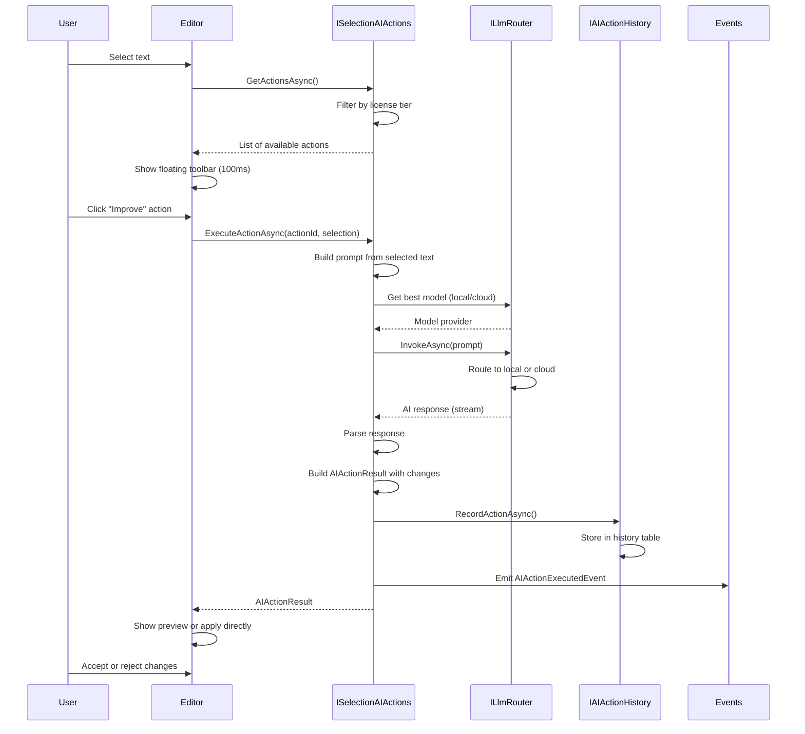
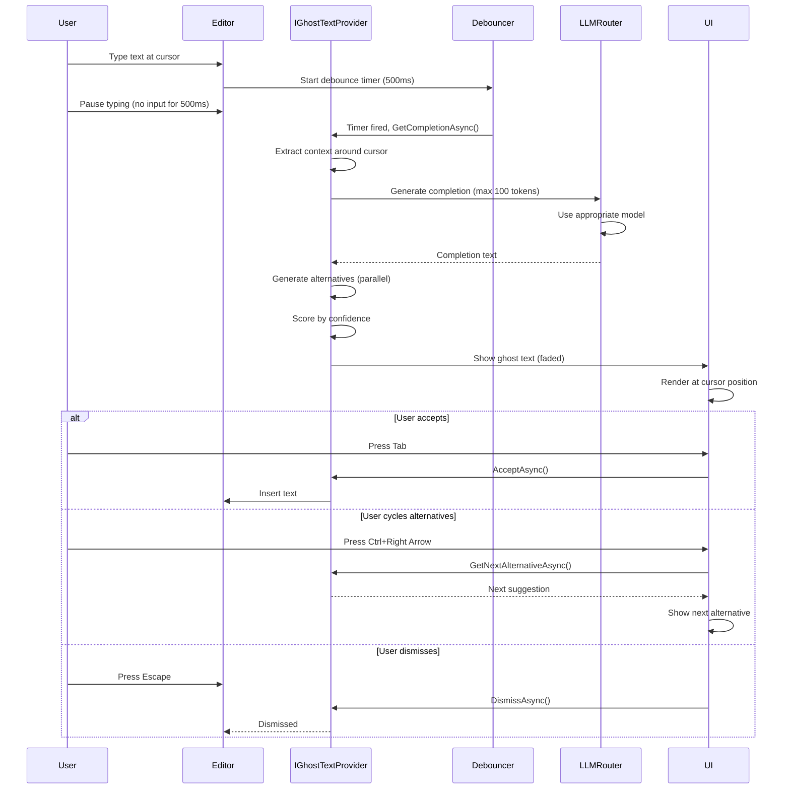

# LCS-SBD-v0.17.5-EDT: Scope Overview — AI Integration

## Document Control

| Field            | Value                                                        |
| :--------------- | :----------------------------------------------------------- |
| **Document ID**  | LCS-SBD-v0.17.5-EDT                                          |
| **Version**      | v0.17.5                                                      |
| **Codename**     | AI Integration (Intelligent Editor Phase 5)                  |
| **Status**       | Draft                                                        |
| **Last Updated** | 2026-02-01                                                   |
| **Owner**        | Editor AI Architecture Lead                                  |
| **Depends On**   | v0.17.4-EDT (Style & Rules), v0.16.4-LLM (Local LLM), v0.12.3-AGT (Language Models) |

---

## 1. Executive Summary

### 1.1 The Vision

**v0.17.5-EDT** delivers **AI Integration** — the flagship feature that transforms the Lexichord editor into a collaborative AI-powered authoring environment. This establishes:

- **Selection-based AI actions** for instant text transformations via floating toolbar
- **Comment-based AI prompts** enabling inline editing instructions using `@ai:` syntax
- **Ghost text completions** providing intelligent next-sentence suggestions in real-time
- **Inline AI suggestions** proactively identifying grammar, clarity, and style improvements
- **AI Writing Assistant panel** offering document insights, chat interface, and generation tools
- **AI Action history** with full undo support and usage metrics for all AI operations

This is the crown jewel of the Intelligent Editor—without deep AI integration, the editor remains a passive text area rather than an intelligent authoring partner.

### 1.2 Business Value

- **Productivity Multiplier:** AI actions reduce editing time by 40-60% for common writing tasks.
- **Quality Enhancement:** Inline suggestions and writing assistant catch errors and improve clarity automatically.
- **Writer Empowerment:** Non-technical users gain access to professional editing capabilities via intuitive UI.
- **Accessibility:** Multiple AI interaction patterns (selection, comments, ghost text) serve different user preferences.
- **Professional Polish:** Document insights and readability metrics position users as skilled communicators.
- **Engagement:** Real-time AI responses create a sense of collaborative partnership with the editor.
- **License Monetization:** AI features tiered across WriterPro, Teams, and Enterprise tiers drive revenue.

### 1.3 Success Criteria

1. **Performance:** AI operations complete in <1s (ghost text) and <3s (selection actions) at P95.
2. **Accuracy:** AI suggestions achieve 95%+ accuracy on grammar/spelling, 85%+ on clarity/style.
3. **Coverage:** All 6 sub-components fully implemented with comprehensive test coverage (>85%).
4. **Integration:** Seamless integration with v0.17.4 style/rules engine and v0.16.4 local LLM support.
5. **UX:** Floating toolbar appears within 100ms of selection; ghost text visible within 500ms of pause.
6. **History:** All AI actions logged with full undo support; no state corruption across 50+ actions.
7. **License Enforcement:** Feature gating works correctly; WriterPro users see limited ghost text; Teams/Enterprise get full feature set.

---

## 2. Key Deliverables

### 2.1 Sub-Parts

| Sub-Part | Title | Description | Est. Hours |
|:---------|:------|:------------|:-----------|
| v0.17.5e | Selection AI Actions | Right-click menu and floating toolbar for text selection transformations | 14 |
| v0.17.5f | Comment-Based AI Prompts | Parse and execute `@ai:` directives embedded in document comments | 12 |
| v0.17.5g | Ghost Text Completions | Real-time completion suggestions appearing as faded text at cursor | 12 |
| v0.17.5h | Inline AI Suggestions | Proactive suggestions for grammar, spelling, clarity, style improvements | 10 |
| v0.17.5i | AI Writing Assistant Panel | Sidebar panel with document insights, chat, and content generation | 10 |
| v0.17.5j | AI Action History & Undo | Track all AI modifications with version history and undo support | 8 |
| **Total** | | | **66 hours** |

### 2.2 Core Interfaces

```csharp
/// <summary>
/// AI actions triggered by text selection.
/// Provides context-aware actions for improving, transforming, and analyzing selected text.
/// </summary>
public interface ISelectionAIActions
{
    /// <summary>
    /// Get available AI actions for current selection.
    /// Returns actions filtered by license tier and document context.
    /// </summary>
    Task<IReadOnlyList<SelectionAIAction>> GetActionsAsync(
        TextSelection selection,
        SelectionContext context,
        CancellationToken ct = default);

    /// <summary>
    /// Execute an AI action on selected text.
    /// Streams results for real-time feedback.
    /// </summary>
    Task<AIActionResult> ExecuteActionAsync(
        SelectionAIActionId actionId,
        TextSelection selection,
        AIActionOptions options,
        CancellationToken ct = default);

    /// <summary>
    /// Get the primary quick action for selection (shown in floating button).
    /// Usually the most contextually relevant action.
    /// </summary>
    Task<SelectionAIAction?> GetQuickActionAsync(
        TextSelection selection,
        CancellationToken ct = default);

    /// <summary>
    /// Start a multi-turn chat session about the selected text.
    /// Streams chat responses as they arrive.
    /// </summary>
    IAsyncEnumerable<AIChatChunk> ChatAboutSelectionAsync(
        TextSelection selection,
        string userMessage,
        CancellationToken ct = default);

    /// <summary>
    /// Observable stream of selection action results for real-time UI updates.
    /// </summary>
    IObservable<SelectionActionExecuted> ActionResults { get; }
}

/// <summary>
/// A single AI action available for a text selection.
/// </summary>
public record SelectionAIAction
{
    /// <summary>
    /// Unique identifier for this action (e.g., "improve", "translate").
    /// </summary>
    public required SelectionAIActionId Id { get; init; }

    /// <summary>
    /// Human-readable label shown in menus and tooltips.
    /// </summary>
    public required string Label { get; init; }

    /// <summary>
    /// Detailed description of what this action does.
    /// </summary>
    public required string Description { get; init; }

    /// <summary>
    /// Category for grouping related actions in UI.
    /// </summary>
    public required AIActionCategory Category { get; init; }

    /// <summary>
    /// Path to icon asset or icon identifier.
    /// </summary>
    public string? IconPath { get; init; }

    /// <summary>
    /// Optional keyboard shortcut for quick invocation.
    /// </summary>
    public KeyboardShortcut? Shortcut { get; init; }

    /// <summary>
    /// Whether execution requires user confirmation via preview.
    /// </summary>
    public bool RequiresConfirmation { get; init; }

    /// <summary>
    /// Whether this action supports streaming responses.
    /// </summary>
    public bool SupportsStreaming { get; init; }

    /// <summary>
    /// Sort order in action menus (lower = appears first).
    /// </summary>
    public int Order { get; init; }

    /// <summary>
    /// Minimum license tier required to use this action.
    /// </summary>
    public LicenseTier MinimumTier { get; init; } = LicenseTier.WriterPro;
}

/// <summary>
/// Strongly-typed identifier for a selection AI action.
/// </summary>
public readonly record struct SelectionAIActionId(string Value);

/// <summary>
/// Categories for grouping AI actions in menus.
/// </summary>
public enum AIActionCategory
{
    /// <summary>Improve writing quality without changing content.</summary>
    Improve,

    /// <summary>Change format, structure, or presentation.</summary>
    Transform,

    /// <summary>Generate new content based on existing text.</summary>
    Generate,

    /// <summary>Analyze content (summarize, explain, fact-check).</summary>
    Analyze,

    /// <summary>Provide explanations or help text.</summary>
    Explain,

    /// <summary>Language translation.</summary>
    Translate,

    /// <summary>Fix errors (grammar, spelling, etc.).</summary>
    Fix,

    /// <summary>Custom user-defined actions.</summary>
    Custom
}

/// <summary>
/// Built-in selection AI actions available to all users.
/// </summary>
public static class BuiltInAIActions
{
    // Improve category
    public static readonly SelectionAIActionId Improve = new("improve");
    public static readonly SelectionAIActionId FixGrammar = new("fix-grammar");
    public static readonly SelectionAIActionId FixSpelling = new("fix-spelling");
    public static readonly SelectionAIActionId Simplify = new("simplify");
    public static readonly SelectionAIActionId Elaborate = new("elaborate");
    public static readonly SelectionAIActionId MakeConcise = new("make-concise");
    public static readonly SelectionAIActionId AdjustTone = new("adjust-tone");

    // Transform category
    public static readonly SelectionAIActionId Rephrase = new("rephrase");
    public static readonly SelectionAIActionId ToActiveVoice = new("to-active-voice");
    public static readonly SelectionAIActionId ToBulletPoints = new("to-bullet-points");
    public static readonly SelectionAIActionId ToNumberedList = new("to-numbered-list");
    public static readonly SelectionAIActionId ToTable = new("to-table");
    public static readonly SelectionAIActionId ToHeadings = new("to-headings");

    // Generate category
    public static readonly SelectionAIActionId Continue = new("continue");
    public static readonly SelectionAIActionId GenerateExamples = new("generate-examples");
    public static readonly SelectionAIActionId GenerateOutline = new("generate-outline");

    // Analyze category
    public static readonly SelectionAIActionId Summarize = new("summarize");
    public static readonly SelectionAIActionId Explain = new("explain");
    public static readonly SelectionAIActionId FindIssues = new("find-issues");
    public static readonly SelectionAIActionId FactCheck = new("fact-check");

    // Translate category
    public static readonly SelectionAIActionId Translate = new("translate");
}

/// <summary>
/// Options for controlling AI action execution.
/// </summary>
public record AIActionOptions
{
    /// <summary>
    /// Custom instruction to supplement the default action prompt.
    /// </summary>
    public string? CustomInstruction { get; init; }

    /// <summary>
    /// Target tone for actions that adjust tone (e.g., AdjustTone, Rephrase).
    /// </summary>
    public ToneStyle? TargetTone { get; init; }

    /// <summary>
    /// Target language for translation actions.
    /// </summary>
    public string? TargetLanguage { get; init; }

    /// <summary>
    /// Target length (word count) for actions that modify length.
    /// </summary>
    public int? TargetLength { get; init; }

    /// <summary>
    /// If true, show result in preview dialog instead of applying directly.
    /// </summary>
    public bool PreviewOnly { get; init; }

    /// <summary>
    /// Override the default AI model for this action.
    /// </summary>
    public string? ModelOverride { get; init; }
}

/// <summary>
/// Tone styles for writing adjustments.
/// </summary>
public enum ToneStyle
{
    Professional,   // Business, formal, no slang
    Casual,         // Conversational, relaxed
    Friendly,       // Warm, approachable, personal
    Formal,         // Academic, technical precision
    Academic,       // Scholarly, citations, authority
    Technical,      // Precise, jargon-heavy for experts
    Creative        // Imaginative, engaging, vivid
}

/// <summary>
/// Result of executing an AI action on text.
/// </summary>
public record AIActionResult
{
    /// <summary>
    /// The original text before the action.
    /// </summary>
    public required string OriginalText { get; init; }

    /// <summary>
    /// The transformed text after the action.
    /// </summary>
    public required string ResultText { get; init; }

    /// <summary>
    /// Overall status of the action execution.
    /// </summary>
    public required AIActionStatus Status { get; init; }

    /// <summary>
    /// Human-readable explanation of what was changed and why.
    /// </summary>
    public string? Explanation { get; init; }

    /// <summary>
    /// Detailed list of individual changes made (for diff display).
    /// </summary>
    public IReadOnlyList<AIChange> Changes { get; init; } = [];

    /// <summary>
    /// Metrics about the AI operation (tokens, latency, cost).
    /// </summary>
    public AIUsageMetrics Metrics { get; init; } = new();
}

/// <summary>
/// Status of an AI action execution.
/// </summary>
public enum AIActionStatus
{
    /// <summary>Action completed successfully.</summary>
    Success,

    /// <summary>Action partially completed (some content unchanged).</summary>
    PartialSuccess,

    /// <summary>No changes were needed or suggested.</summary>
    NoChanges,

    /// <summary>Action failed with an error.</summary>
    Error,

    /// <summary>Action was cancelled by user.</summary>
    Cancelled
}

/// <summary>
/// A single atomic change made by an AI action.
/// </summary>
public record AIChange
{
    /// <summary>
    /// Range in the original text affected by this change.
    /// </summary>
    public required TextRange Range { get; init; }

    /// <summary>
    /// The original text at this range.
    /// </summary>
    public required string OriginalText { get; init; }

    /// <summary>
    /// The new text replacing the original.
    /// </summary>
    public required string NewText { get; init; }

    /// <summary>
    /// Type of change (replacement, insertion, deletion, etc.).
    /// </summary>
    public required AIChangeType Type { get; init; }

    /// <summary>
    /// Explanation for why this change was made.
    /// </summary>
    public string? Reason { get; init; }
}

/// <summary>
/// Types of changes made by AI actions.
/// </summary>
public enum AIChangeType
{
    /// <summary>Text replaced with different text.</summary>
    Replacement,

    /// <summary>New text inserted (no original).</summary>
    Insertion,

    /// <summary>Text removed (new text is empty).</summary>
    Deletion,

    /// <summary>Lines reordered.</summary>
    Reorder,

    /// <summary>Style changed without changing semantic content.</summary>
    StyleChange
}

/// <summary>
/// Comment-based AI prompting system.
/// Enables users to add instructions as comments that are executed as AI prompts.
/// </summary>
public interface ICommentAIPrompts
{
    /// <summary>
    /// Process a single comment as an AI prompt.
    /// </summary>
    Task<CommentPromptResult> ProcessCommentAsync(
        Annotation comment,
        CommentPromptOptions options,
        CancellationToken ct = default);

    /// <summary>
    /// Detect all AI prompts in a document's comments.
    /// </summary>
    Task<IReadOnlyList<DetectedPrompt>> DetectPromptsAsync(
        DocumentId documentId,
        CancellationToken ct = default);

    /// <summary>
    /// Execute all pending AI prompts in a document.
    /// </summary>
    Task<IReadOnlyList<CommentPromptResult>> ExecuteAllPromptsAsync(
        DocumentId documentId,
        CancellationToken ct = default);

    /// <summary>
    /// Get intelligent suggestions for completing a partial prompt.
    /// </summary>
    Task<IReadOnlyList<PromptSuggestion>> GetSuggestionsAsync(
        string partialPrompt,
        CancellationToken ct = default);

    /// <summary>
    /// Observable stream of prompt execution results.
    /// </summary>
    IObservable<CommentPromptProcessed> PromptResults { get; }
}

/// <summary>
/// Comment prompt syntax reference:
///
/// @ai: &lt;custom instruction&gt;          - Execute custom instruction on following text
/// @ai-continue                      - Continue writing from this point
/// @ai-improve                       - Improve the clarity/quality of following section
/// @ai-expand                        - Expand on the following content with details
/// @ai-summarize                     - Summarize the following section
/// @ai-translate:&lt;language&gt;          - Translate following text to language
/// @ai-rewrite:&lt;style&gt;               - Rewrite following section in specified style
/// @ai-question: &lt;question&gt;          - Ask AI a question about the content
///
/// Examples:
/// &lt;!-- @ai: Make this more professional --&gt;
/// &lt;!-- @ai-continue --&gt;
/// &lt;!-- @ai-translate:Spanish --&gt;
/// &lt;!-- @ai-question: What's a better title for this section? --&gt;
/// </summary>
public record DetectedPrompt
{
    /// <summary>
    /// The comment annotation containing the prompt.
    /// </summary>
    public required Annotation Comment { get; init; }

    /// <summary>
    /// Type of prompt detected.
    /// </summary>
    public required PromptType Type { get; init; }

    /// <summary>
    /// The instruction text (without @ai: prefix).
    /// </summary>
    public required string Instruction { get; init; }

    /// <summary>
    /// Range of document to apply the prompt to (if specified).
    /// </summary>
    public TextRange? TargetRange { get; init; }

    /// <summary>
    /// Parsed parameters from the prompt (e.g., language for translate).
    /// </summary>
    public IReadOnlyDictionary<string, string>? Parameters { get; init; }
}

/// <summary>
/// Types of AI prompts detected in comments.
/// </summary>
public enum PromptType
{
    /// <summary>Custom instruction (@ai:).</summary>
    Instruction,

    /// <summary>Continue writing (@ai-continue).</summary>
    Continue,

    /// <summary>Improve clarity/quality (@ai-improve).</summary>
    Improve,

    /// <summary>Expand on content (@ai-expand).</summary>
    Expand,

    /// <summary>Summarize section (@ai-summarize).</summary>
    Summarize,

    /// <summary>Translate to language (@ai-translate:lang).</summary>
    Translate,

    /// <summary>Rewrite in style (@ai-rewrite:style).</summary>
    Rewrite,

    /// <summary>Ask a question (@ai-question:).</summary>
    Question,

    /// <summary>Custom/unrecognized prompt type.</summary>
    Custom
}

/// <summary>
/// Result of processing a comment AI prompt.
/// </summary>
public record CommentPromptResult
{
    /// <summary>
    /// The detected prompt that was executed.
    /// </summary>
    public required DetectedPrompt Prompt { get; init; }

    /// <summary>
    /// Overall status of prompt execution.
    /// </summary>
    public required CommentPromptStatus Status { get; init; }

    /// <summary>
    /// Generated content (for continue, expand, generate actions).
    /// </summary>
    public string? Result { get; init; }

    /// <summary>
    /// Suggested text edit to apply (for improve, rewrite actions).
    /// </summary>
    public TextEdit? SuggestedEdit { get; init; }

    /// <summary>
    /// Answer to a question prompt.
    /// </summary>
    public string? Answer { get; init; }

    /// <summary>
    /// Error message if status is Error.
    /// </summary>
    public string? Error { get; init; }
}

/// <summary>
/// Status of comment prompt execution.
/// </summary>
public enum CommentPromptStatus
{
    /// <summary>Prompt executed successfully.</summary>
    Success,

    /// <summary>Prompt executed and changes applied.</summary>
    Applied,

    /// <summary>Prompt detected but not yet executed.</summary>
    Pending,

    /// <summary>Prompt execution failed.</summary>
    Error,

    /// <summary>Prompt was skipped (license, feature gates).</summary>
    Skipped
}

/// <summary>
/// Ghost text (inline completion) provider.
/// Shows faded suggested text at the cursor to complete sentences/paragraphs.
/// </summary>
public interface IGhostTextProvider
{
    /// <summary>
    /// Whether ghost text completion is currently enabled.
    /// </summary>
    bool IsEnabled { get; }

    /// <summary>
    /// Enable or disable ghost text completions.
    /// </summary>
    Task SetEnabledAsync(bool enabled, CancellationToken ct = default);

    /// <summary>
    /// Get ghost text completion suggestion for cursor position.
    /// </summary>
    Task<GhostTextCompletion?> GetCompletionAsync(
        DocumentId documentId,
        TextPosition position,
        GhostTextOptions options,
        CancellationToken ct = default);

    /// <summary>
    /// Accept the current ghost text completion entirely.
    /// </summary>
    Task AcceptAsync(CancellationToken ct = default);

    /// <summary>
    /// Accept only part of the ghost text (word, line, sentence).
    /// </summary>
    Task AcceptPartialAsync(
        GhostTextAcceptMode mode,
        CancellationToken ct = default);

    /// <summary>
    /// Dismiss the current ghost text without accepting.
    /// </summary>
    Task DismissAsync(CancellationToken ct = default);

    /// <summary>
    /// Get the next alternative completion suggestion.
    /// Cycles through multiple suggestions if available.
    /// </summary>
    Task<GhostTextCompletion?> GetNextAlternativeAsync(
        CancellationToken ct = default);

    /// <summary>
    /// Observable stream of ghost text updates (new completion, dismissed, etc.).
    /// </summary>
    IObservable<GhostTextUpdate> Updates { get; }
}

/// <summary>
/// Configuration options for ghost text generation.
/// </summary>
public record GhostTextOptions
{
    /// <summary>
    /// Maximum tokens to generate (default 100 = ~50 words).
    /// </summary>
    public int MaxTokens { get; init; } = 100;

    /// <summary>
    /// Number of alternative completions to generate.
    /// </summary>
    public int MaxAlternatives { get; init; } = 3;

    /// <summary>
    /// AI temperature (0.0 = deterministic, 1.0 = creative).
    /// </summary>
    public float Temperature { get; init; } = 0.7f;

    /// <summary>
    /// Debounce delay in milliseconds after user stops typing (default 500ms).
    /// </summary>
    public int DebounceMs { get; init; } = 500;

    /// <summary>
    /// If true, limit completion to single line (no line breaks).
    /// </summary>
    public bool SingleLine { get; init; } = false;

    /// <summary>
    /// When to automatically trigger ghost text suggestions.
    /// </summary>
    public GhostTextTrigger Trigger { get; init; } = GhostTextTrigger.OnPause;
}

/// <summary>
/// Triggers for ghost text generation.
/// </summary>
public enum GhostTextTrigger
{
    /// <summary>After user pauses typing (debounce delay).</summary>
    OnPause,

    /// <summary>After pressing Enter (new line).</summary>
    OnNewLine,

    /// <summary>When Tab key is pressed.</summary>
    OnTab,

    /// <summary>Only when explicitly requested via keyboard shortcut.</summary>
    Manual
}

/// <summary>
/// A completion suggestion shown as ghost text.
/// </summary>
public record GhostTextCompletion
{
    /// <summary>
    /// The suggested completion text (displayed as faded text).
    /// </summary>
    public required string Text { get; init; }

    /// <summary>
    /// Position where completion should be inserted.
    /// </summary>
    public required TextPosition InsertPosition { get; init; }

    /// <summary>
    /// Index of this alternative (0 = first/default).
    /// </summary>
    public int AlternativeIndex { get; init; }

    /// <summary>
    /// Total number of alternatives available.
    /// </summary>
    public int TotalAlternatives { get; init; }

    /// <summary>
    /// Confidence score (0.0 to 1.0) for this suggestion.
    /// </summary>
    public float Confidence { get; init; }

    /// <summary>
    /// Optional explanation of why this completion was suggested.
    /// </summary>
    public string? Explanation { get; init; }
}

/// <summary>
/// How much of the ghost text to accept when user presses Tab.
/// </summary>
public enum GhostTextAcceptMode
{
    /// <summary>Accept entire completion.</summary>
    All,

    /// <summary>Accept next word only.</summary>
    Word,

    /// <summary>Accept to end of line.</summary>
    Line,

    /// <summary>Accept to end of sentence.</summary>
    Sentence
}

/// <summary>
/// Inline AI suggestions provider.
/// Proactively suggests improvements for grammar, clarity, style, etc.
/// </summary>
public interface IInlineAISuggestions
{
    /// <summary>
    /// Whether inline suggestions are currently enabled.
    /// </summary>
    bool IsEnabled { get; }

    /// <summary>
    /// Get all suggestions for current document state.
    /// Runs periodically as document changes.
    /// </summary>
    Task<IReadOnlyList<InlineSuggestion>> GetSuggestionsAsync(
        DocumentId documentId,
        CancellationToken ct = default);

    /// <summary>
    /// Apply a specific suggestion (replace with suggested text).
    /// </summary>
    Task ApplySuggestionAsync(
        InlineSuggestionId suggestionId,
        CancellationToken ct = default);

    /// <summary>
    /// Dismiss a suggestion (don't suggest similar issues).
    /// </summary>
    Task DismissSuggestionAsync(
        InlineSuggestionId suggestionId,
        CancellationToken ct = default);

    /// <summary>
    /// Configure which types of suggestions to show.
    /// </summary>
    Task ConfigureAsync(
        InlineSuggestionConfig config,
        CancellationToken ct = default);

    /// <summary>
    /// Observable stream of new suggestions as they are detected.
    /// </summary>
    IObservable<InlineSuggestion> NewSuggestions { get; }
}

/// <summary>
/// A single inline suggestion shown at a location in the document.
/// </summary>
public record InlineSuggestion
{
    /// <summary>
    /// Unique identifier for this suggestion.
    /// </summary>
    public required InlineSuggestionId Id { get; init; }

    /// <summary>
    /// Type of suggestion (what aspect it addresses).
    /// </summary>
    public required InlineSuggestionType Type { get; init; }

    /// <summary>
    /// Range in document where suggestion applies.
    /// </summary>
    public required TextRange Range { get; init; }

    /// <summary>
    /// Message to display to user.
    /// </summary>
    public required string Message { get; init; }

    /// <summary>
    /// Suggested replacement text.
    /// </summary>
    public required string SuggestedText { get; init; }

    /// <summary>
    /// Original text being suggested to replace.
    /// </summary>
    public string? OriginalText { get; init; }

    /// <summary>
    /// Confidence score (0.0 to 1.0) for this suggestion.
    /// </summary>
    public float Confidence { get; init; }

    /// <summary>
    /// Explanation for why this suggestion was made.
    /// </summary>
    public string? Rationale { get; init; }

    /// <summary>
    /// Whether this suggestion can be applied automatically.
    /// </summary>
    public bool IsAutoApplicable { get; init; }
}

/// <summary>
/// Strongly-typed identifier for inline suggestions.
/// </summary>
public readonly record struct InlineSuggestionId(Guid Value)
{
    public static InlineSuggestionId New() => new(Guid.NewGuid());
}

/// <summary>
/// Types of inline suggestions available.
/// </summary>
public enum InlineSuggestionType
{
    /// <summary>Grammar error detected and fixed.</summary>
    GrammarFix,

    /// <summary>Spelling mistake found.</summary>
    SpellingFix,

    /// <summary>Writing style improvement suggested.</summary>
    StyleImprovement,

    /// <summary>Clarity enhancement recommended.</summary>
    ClarityImprovement,

    /// <summary>Content can be simplified.</summary>
    Simplification,

    /// <summary>Content should be expanded.</summary>
    Expansion,

    /// <summary>Factual error detected.</summary>
    FactCorrection,

    /// <summary>Tone adjustment recommended.</summary>
    ToneAdjustment,

    /// <summary>Structural improvement suggested.</summary>
    StructureSuggestion,

    /// <summary>Better word choice recommended.</summary>
    WordChoice
}

/// <summary>
/// Configuration for inline suggestion behavior.
/// </summary>
public record InlineSuggestionConfig
{
    /// <summary>
    /// Enable grammar error suggestions.
    /// </summary>
    public bool EnableGrammar { get; init; } = true;

    /// <summary>
    /// Enable spelling error suggestions.
    /// </summary>
    public bool EnableSpelling { get; init; } = true;

    /// <summary>
    /// Enable style improvement suggestions.
    /// </summary>
    public bool EnableStyle { get; init; } = true;

    /// <summary>
    /// Enable clarity improvement suggestions.
    /// </summary>
    public bool EnableClarity { get; init; } = true;

    /// <summary>
    /// Enable fact-checking suggestions (may be slow/disabled by default).
    /// </summary>
    public bool EnableFactCheck { get; init; } = false;

    /// <summary>
    /// Maximum number of suggestions shown per paragraph (prevent overwhelming user).
    /// </summary>
    public int MaxSuggestionsPerParagraph { get; init; } = 3;

    /// <summary>
    /// Minimum confidence threshold (0.0 to 1.0) to show a suggestion.
    /// Higher threshold = fewer but higher-confidence suggestions.
    /// </summary>
    public float MinConfidenceThreshold { get; init; } = 0.7f;

    /// <summary>
    /// Whether high-confidence suggestions are applied automatically without prompting.
    /// </summary>
    public bool AutoApplyHighConfidence { get; init; } = false;
}

/// <summary>
/// AI writing assistant panel interface.
/// Provides document insights, interactive chat, and content generation.
/// </summary>
public interface IAIWritingAssistant
{
    /// <summary>
    /// Start a new chat session about a document.
    /// </summary>
    Task<ChatSession> StartSessionAsync(
        DocumentId documentId,
        CancellationToken ct = default);

    /// <summary>
    /// Send a message to the AI assistant in a chat session.
    /// Streams response chunks for progressive rendering.
    /// </summary>
    IAsyncEnumerable<AIChatChunk> SendMessageAsync(
        ChatSessionId sessionId,
        string message,
        ChatMessageOptions options,
        CancellationToken ct = default);

    /// <summary>
    /// Get comprehensive insights about a document.
    /// Includes readability, tone, structure, and improvement suggestions.
    /// </summary>
    Task<DocumentInsights> GetInsightsAsync(
        DocumentId documentId,
        CancellationToken ct = default);

    /// <summary>
    /// Get targeted writing improvement suggestions.
    /// </summary>
    Task<IReadOnlyList<WritingSuggestion>> GetWritingSuggestionsAsync(
        DocumentId documentId,
        CancellationToken ct = default);

    /// <summary>
    /// Generate content sections based on document outline.
    /// Streams generated content for real-time preview.
    /// </summary>
    IAsyncEnumerable<string> GenerateFromOutlineAsync(
        DocumentId documentId,
        GenerationOptions options,
        CancellationToken ct = default);

    /// <summary>
    /// Observable stream of assistant panel events.
    /// </summary>
    IObservable<AssistantPanelEvent> Events { get; }
}

/// <summary>
/// An AI chat session for a document.
/// Maintains conversation history and document context.
/// </summary>
public record ChatSession
{
    /// <summary>
    /// Unique identifier for this session.
    /// </summary>
    public required ChatSessionId Id { get; init; }

    /// <summary>
    /// Document being discussed in this session.
    /// </summary>
    public required DocumentId DocumentId { get; init; }

    /// <summary>
    /// Conversation history (user and AI messages).
    /// </summary>
    public IReadOnlyList<ChatMessage> Messages { get; init; } = [];

    /// <summary>
    /// When this session started.
    /// </summary>
    public DateTimeOffset StartedAt { get; init; }

    /// <summary>
    /// Context about the document being discussed.
    /// </summary>
    public DocumentContext Context { get; init; } = new();
}

/// <summary>
/// Strongly-typed identifier for chat sessions.
/// </summary>
public readonly record struct ChatSessionId(Guid Value)
{
    public static ChatSessionId New() => new(Guid.NewGuid());
}

/// <summary>
/// Document context provided to AI for better responses.
/// </summary>
public record DocumentContext
{
    /// <summary>Document title if detected or set.</summary>
    public string? Title { get; init; }

    /// <summary>Brief summary of document content.</summary>
    public string? Summary { get; init; }

    /// <summary>Heading hierarchy discovered in document.</summary>
    public IReadOnlyList<string> Headings { get; init; } = [];

    /// <summary>Total word count in document.</summary>
    public int WordCount { get; init; }

    /// <summary>Detected primary tone (e.g., "formal", "casual").</summary>
    public string? DetectedTone { get; init; }

    /// <summary>Inferred audience type (e.g., "technical", "general").</summary>
    public string? DetectedAudience { get; init; }
}

/// <summary>
/// Comprehensive insights about a document's writing quality.
/// </summary>
public record DocumentInsights
{
    /// <summary>
    /// The document these insights are for.
    /// </summary>
    public required DocumentId DocumentId { get; init; }

    /// <summary>
    /// Readability metrics (grade level, reading ease, etc.).
    /// </summary>
    public ReadabilityMetrics Readability { get; init; } = new();

    /// <summary>
    /// Tone analysis (formality, positivity, confidence).
    /// </summary>
    public ToneAnalysis Tone { get; init; } = new();

    /// <summary>
    /// Structural analysis (headings, paragraphs, flow).
    /// </summary>
    public StructureAnalysis Structure { get; init; } = new();

    /// <summary>
    /// Key topics/themes detected in document.
    /// </summary>
    public IReadOnlyList<string> KeyTopics { get; init; } = [];

    /// <summary>
    /// Specific improvement areas suggested by AI.
    /// </summary>
    public IReadOnlyList<string> SuggestedImprovements { get; init; } = [];

    /// <summary>
    /// Estimated reading time in minutes.
    /// </summary>
    public int EstimatedReadingTimeMinutes { get; init; }
}

/// <summary>
/// Readability metrics for a document.
/// Uses multiple well-known readability formulas.
/// </summary>
public record ReadabilityMetrics
{
    /// <summary>
    /// Flesch Reading Ease score (0-100, higher = easier).
    /// 90-100: 5th grade, 30-50: college, 0-30: graduate.
    /// </summary>
    public float FleschReadingEase { get; init; }

    /// <summary>
    /// Flesch-Kincaid Grade Level (0-18+).
    /// </summary>
    public float FleschKincaidGrade { get; init; }

    /// <summary>
    /// Gunning Fog Index (grade level needed to understand).
    /// </summary>
    public float GunningFogIndex { get; init; }

    /// <summary>
    /// Average words per sentence.
    /// </summary>
    public float AverageWordsPerSentence { get; init; }

    /// <summary>
    /// Average syllables per word.
    /// </summary>
    public float AverageSyllablesPerWord { get; init; }

    /// <summary>
    /// Overall readability level classification.
    /// </summary>
    public ReadabilityLevel Level { get; init; }
}

/// <summary>
/// Readability difficulty levels.
/// </summary>
public enum ReadabilityLevel
{
    /// <summary>Very Easy (5th grade).</summary>
    VeryEasy,

    /// <summary>Easy (6th grade).</summary>
    Easy,

    /// <summary>Fairly Easy (7th grade).</summary>
    FairlyEasy,

    /// <summary>Standard (8th-9th grade).</summary>
    Standard,

    /// <summary>Fairly Difficult (10th-12th grade).</summary>
    FairlyDifficult,

    /// <summary>Difficult (college level).</summary>
    Difficult,

    /// <summary>Very Difficult (graduate level).</summary>
    VeryDifficult
}

/// <summary>
/// Analysis of tone and voice in a document.
/// </summary>
public record ToneAnalysis
{
    /// <summary>
    /// Primary detected tone.
    /// </summary>
    public string PrimaryTone { get; init; } = "";

    /// <summary>
    /// Scores for detected tones with confidence levels.
    /// </summary>
    public IReadOnlyList<ToneScore> Tones { get; init; } = [];

    /// <summary>
    /// Formality level (0.0 = very informal, 1.0 = very formal).
    /// </summary>
    public float Formality { get; init; }

    /// <summary>
    /// Positivity level (0.0 = very negative, 1.0 = very positive).
    /// </summary>
    public float Positivity { get; init; }

    /// <summary>
    /// Confidence/authority level (0.0 = uncertain, 1.0 = very confident).
    /// </summary>
    public float Confidence { get; init; }
}

/// <summary>
/// A detected tone with confidence score.
/// </summary>
public record ToneScore
{
    /// <summary>
    /// Name of the tone (e.g., "professional", "sarcastic").
    /// </summary>
    public required string Tone { get; init; }

    /// <summary>
    /// Confidence score (0.0 to 1.0).
    /// </summary>
    public float Score { get; init; }
}

/// <summary>
/// AI action history and undo/redo support.
/// Tracks all AI modifications to document.
/// </summary>
public interface IAIActionHistory
{
    /// <summary>
    /// Get the history of AI actions performed on a document.
    /// </summary>
    Task<IReadOnlyList<AIActionRecord>> GetHistoryAsync(
        DocumentId documentId,
        int limit = 50,
        CancellationToken ct = default);

    /// <summary>
    /// Undo the most recent AI action.
    /// </summary>
    Task<bool> UndoLastActionAsync(
        DocumentId documentId,
        CancellationToken ct = default);

    /// <summary>
    /// Undo a specific AI action by ID.
    /// </summary>
    Task<bool> UndoActionAsync(
        AIActionRecordId recordId,
        CancellationToken ct = default);

    /// <summary>
    /// Redo the last undone action.
    /// </summary>
    Task<bool> RedoLastActionAsync(
        DocumentId documentId,
        CancellationToken ct = default);

    /// <summary>
    /// Get details of a specific action.
    /// </summary>
    Task<AIActionRecord?> GetActionAsync(
        AIActionRecordId recordId,
        CancellationToken ct = default);

    /// <summary>
    /// Get a diff showing before/after state for an action.
    /// </summary>
    Task<DiffResult> CompareActionAsync(
        AIActionRecordId recordId,
        CancellationToken ct = default);

    /// <summary>
    /// Get statistics about AI usage (models, tokens, cost).
    /// </summary>
    Task<AIUsageStatistics> GetUsageStatsAsync(
        DocumentId documentId,
        CancellationToken ct = default);
}

/// <summary>
/// Record of a single AI action performed on a document.
/// </summary>
public record AIActionRecord
{
    /// <summary>
    /// Unique identifier for this action record.
    /// </summary>
    public required AIActionRecordId Id { get; init; }

    /// <summary>
    /// Document this action was performed on.
    /// </summary>
    public required DocumentId DocumentId { get; init; }

    /// <summary>
    /// Type of action (e.g., "improve", "fix-grammar").
    /// </summary>
    public required string ActionType { get; init; }

    /// <summary>
    /// Human-readable description of what was done.
    /// </summary>
    public required string Description { get; init; }

    /// <summary>
    /// When this action was performed.
    /// </summary>
    public required DateTimeOffset Timestamp { get; init; }

    /// <summary>
    /// The text before the action.
    /// </summary>
    public required string OriginalText { get; init; }

    /// <summary>
    /// The text after the action.
    /// </summary>
    public required string ResultText { get; init; }

    /// <summary>
    /// Range in document affected by this action.
    /// </summary>
    public TextRange? AffectedRange { get; init; }

    /// <summary>
    /// Metrics about the AI operation.
    /// </summary>
    public AIUsageMetrics Metrics { get; init; } = new();

    /// <summary>
    /// Whether this action has been undone.
    /// </summary>
    public bool IsUndone { get; init; }

    /// <summary>
    /// Whether this action can still be undone.
    /// </summary>
    public bool CanUndo { get; init; }
}

/// <summary>
/// Strongly-typed identifier for AI action records.
/// </summary>
public readonly record struct AIActionRecordId(Guid Value)
{
    public static AIActionRecordId New() => new(Guid.NewGuid());
}

/// <summary>
/// Metrics about AI operations (tokens, latency, cost).
/// </summary>
public record AIUsageMetrics
{
    /// <summary>
    /// Number of input tokens used.
    /// </summary>
    public int InputTokens { get; init; }

    /// <summary>
    /// Number of output tokens generated.
    /// </summary>
    public int OutputTokens { get; init; }

    /// <summary>
    /// Time from request to response (round-trip latency).
    /// </summary>
    public TimeSpan Latency { get; init; }

    /// <summary>
    /// Name of the AI model that was used.
    /// </summary>
    public string? ModelUsed { get; init; }

    /// <summary>
    /// Whether a local model was used (vs. cloud API).
    /// </summary>
    public bool UsedLocalModel { get; init; }

    /// <summary>
    /// Estimated cost in USD for this operation (if applicable).
    /// </summary>
    public decimal? EstimatedCost { get; init; }
}
```

---

## 3. Architecture

### 3.1 AI Integration System Architecture

```
┌──────────────────────────────────────────────────────────────────────────────┐
│                          AI Integration Layer (v0.17.5)                       │
├──────────────────────────────────────────────────────────────────────────────┤
│                                                                               │
│  ┌────────────────────────────────────────────────────────────────────────┐  │
│  │                     ISelectionAIActions                                │  │
│  │  ┌──────────────────┐  ┌──────────────────┐  ┌─────────────────────┐  │  │
│  │  │ Get Actions      │  │ Execute Action   │  │ Chat About          │  │  │
│  │  │ (20ms)           │  │ Selection (3s)   │  │ Selection (stream)  │  │  │
│  │  └──────────────────┘  └──────────────────┘  └─────────────────────┘  │  │
│  └────────────────────────────────────────────────────────────────────────┘  │
│                                    │                                          │
│  ┌────────────────────────────────────────────────────────────────────────┐  │
│  │                    ICommentAIPrompts                                   │  │
│  │  ┌──────────────────┐  ┌──────────────────┐  ┌─────────────────────┐  │  │
│  │  │ Detect Prompts   │  │ Process Comment  │  │ Get Suggestions     │  │  │
│  │  │ (@ai: syntax)    │  │ (exec prompt)    │  │ (auto-complete)     │  │  │
│  │  └──────────────────┘  └──────────────────┘  └─────────────────────┘  │  │
│  └────────────────────────────────────────────────────────────────────────┘  │
│                                    │                                          │
│  ┌────────────────────────────────────────────────────────────────────────┐  │
│  │                    IGhostTextProvider                                  │  │
│  │  ┌──────────────────┐  ┌──────────────────┐  ┌─────────────────────┐  │  │
│  │  │ Get Completion   │  │ Accept/Dismiss   │  │ Next Alternative    │  │  │
│  │  │ (500ms debounce) │  │ (instant)        │  │ (100ms)             │  │  │
│  │  └──────────────────┘  └──────────────────┘  └─────────────────────┘  │  │
│  └────────────────────────────────────────────────────────────────────────┘  │
│                                    │                                          │
│  ┌────────────────────────────────────────────────────────────────────────┐  │
│  │                  IInlineAISuggestions                                  │  │
│  │  ┌──────────────────┐  ┌──────────────────┐  ┌─────────────────────┐  │  │
│  │  │ Get Suggestions  │  │ Apply/Dismiss    │  │ Configure           │  │  │
│  │  │ (periodic runs)  │  │ (instant)        │  │ (settings)          │  │  │
│  │  └──────────────────┘  └──────────────────┘  └─────────────────────┘  │  │
│  └────────────────────────────────────────────────────────────────────────┘  │
│                                    │                                          │
│  ┌────────────────────────────────────────────────────────────────────────┐  │
│  │                   IAIWritingAssistant                                  │  │
│  │  ┌──────────────────┐  ┌──────────────────┐  ┌─────────────────────┐  │  │
│  │  │ Start Session    │  │ Send Message     │  │ Get Insights        │  │  │
│  │  │ (Chat)           │  │ (stream)         │  │ (readability,tone)  │  │  │
│  │  └──────────────────┘  └──────────────────┘  └─────────────────────┘  │  │
│  └────────────────────────────────────────────────────────────────────────┘  │
│                                    │                                          │
│  ┌────────────────────────────────────────────────────────────────────────┐  │
│  │                   IAIActionHistory                                     │  │
│  │  ┌──────────────────┐  ┌──────────────────┐  ┌─────────────────────┐  │  │
│  │  │ Get History      │  │ Undo Action      │  │ Get Stats           │  │  │
│  │  │ (Track changes)  │  │ (restore text)   │  │ (usage metrics)     │  │  │
│  │  └──────────────────┘  └──────────────────┘  └─────────────────────┘  │  │
│  └────────────────────────────────────────────────────────────────────────┘  │
│                                    │                                          │
│              ┌─────────────────────┼─────────────────────┐                   │
│              ▼                     ▼                     ▼                   │
│  ┌────────────────────┐  ┌────────────────────┐  ┌─────────────────────┐   │
│  │ Language Model     │  │ Local LLM          │  │ Style & Rules       │   │
│  │ Router             │  │ Integration        │  │ Engine (v0.17.4)    │   │
│  │ (cloud/local)      │  │ (v0.16.4 support)  │  │ (linting, checks)   │   │
│  └────────────────────┘  └────────────────────┘  └─────────────────────┘   │
│                                                                               │
└──────────────────────────────────────────────────────────────────────────────┘
```

### 3.2 Selection AI Action Flow



### 3.3 Ghost Text Generation Flow



---

## 4. Data Model

### 4.1 Database Schema

```sql
-- AI action history tracking
CREATE TABLE ai_action_history (
    id UUID PRIMARY KEY DEFAULT gen_random_uuid(),
    document_id UUID NOT NULL REFERENCES documents(id) ON DELETE CASCADE,
    action_type VARCHAR(100) NOT NULL,
    description TEXT NOT NULL,
    original_text TEXT NOT NULL,
    result_text TEXT NOT NULL,
    affected_range_start INT,
    affected_range_end INT,

    input_tokens INT NOT NULL DEFAULT 0,
    output_tokens INT NOT NULL DEFAULT 0,
    latency_ms INT NOT NULL DEFAULT 0,
    model_used VARCHAR(100),
    used_local_model BOOLEAN NOT NULL DEFAULT FALSE,
    estimated_cost DECIMAL(10, 4),

    is_undone BOOLEAN NOT NULL DEFAULT FALSE,
    can_undo BOOLEAN NOT NULL DEFAULT TRUE,
    created_at TIMESTAMPTZ NOT NULL DEFAULT NOW(),

    INDEX idx_ai_history_document ON ai_action_history(document_id, created_at DESC),
    INDEX idx_ai_history_action_type ON ai_action_history(action_type),
    CONSTRAINT check_action_type CHECK (action_type IN (
        'improve', 'fix-grammar', 'fix-spelling', 'simplify', 'elaborate', 'make-concise', 'adjust-tone',
        'rephrase', 'to-active-voice', 'to-bullet-points', 'to-numbered-list', 'to-table', 'to-headings',
        'continue', 'generate-examples', 'generate-outline',
        'summarize', 'explain', 'find-issues', 'fact-check', 'translate',
        'comment-prompt', 'ghost-text-accept', 'inline-suggestion-apply'
    ))
);

-- Comment-based AI prompts
CREATE TABLE comment_ai_prompts (
    id UUID PRIMARY KEY DEFAULT gen_random_uuid(),
    document_id UUID NOT NULL REFERENCES documents(id) ON DELETE CASCADE,
    comment_id UUID NOT NULL,
    prompt_type VARCHAR(50) NOT NULL,
    instruction TEXT NOT NULL,
    target_range_start INT,
    target_range_end INT,

    status VARCHAR(50) NOT NULL DEFAULT 'Pending',
    result TEXT,
    error_message TEXT,

    executed_at TIMESTAMPTZ,
    created_at TIMESTAMPTZ NOT NULL DEFAULT NOW(),

    INDEX idx_comment_prompts_document ON comment_ai_prompts(document_id),
    INDEX idx_comment_prompts_status ON comment_ai_prompts(status),
    CONSTRAINT check_prompt_type CHECK (prompt_type IN (
        'Instruction', 'Continue', 'Improve', 'Expand', 'Summarize', 'Translate', 'Rewrite', 'Question', 'Custom'
    ))
);

-- Ghost text completions (cache)
CREATE TABLE ghost_text_cache (
    id UUID PRIMARY KEY DEFAULT gen_random_uuid(),
    document_id UUID NOT NULL REFERENCES documents(id) ON DELETE CASCADE,

    context_text TEXT NOT NULL,
    cursor_position INT NOT NULL,

    completion_text TEXT NOT NULL,
    confidence FLOAT NOT NULL,
    alternatives_json JSONB,

    accepted BOOLEAN NOT NULL DEFAULT FALSE,
    dismissed BOOLEAN NOT NULL DEFAULT FALSE,

    created_at TIMESTAMPTZ NOT NULL DEFAULT NOW(),
    ttl_minutes INT NOT NULL DEFAULT 10,

    INDEX idx_ghost_text_document ON ghost_text_cache(document_id, created_at DESC),
    INDEX idx_ghost_text_expiry ON ghost_text_cache(created_at) WHERE dismissed = FALSE AND accepted = FALSE
);

-- Inline suggestions tracking
CREATE TABLE inline_suggestions (
    id UUID PRIMARY KEY DEFAULT gen_random_uuid(),
    document_id UUID NOT NULL REFERENCES documents(id) ON DELETE CASCADE,

    suggestion_type VARCHAR(50) NOT NULL,
    range_start INT NOT NULL,
    range_end INT NOT NULL,

    message TEXT NOT NULL,
    original_text TEXT NOT NULL,
    suggested_text TEXT NOT NULL,
    confidence FLOAT NOT NULL,
    rationale TEXT,

    is_auto_applicable BOOLEAN NOT NULL DEFAULT FALSE,
    is_dismissed BOOLEAN NOT NULL DEFAULT FALSE,
    is_applied BOOLEAN NOT NULL DEFAULT FALSE,

    created_at TIMESTAMPTZ NOT NULL DEFAULT NOW(),
    applied_at TIMESTAMPTZ,

    INDEX idx_inline_suggestions_document ON inline_suggestions(document_id, created_at DESC),
    INDEX idx_inline_suggestions_status ON inline_suggestions(is_dismissed, is_applied),
    CONSTRAINT check_suggestion_type CHECK (suggestion_type IN (
        'GrammarFix', 'SpellingFix', 'StyleImprovement', 'ClarityImprovement', 'Simplification',
        'Expansion', 'FactCorrection', 'ToneAdjustment', 'StructureSuggestion', 'WordChoice'
    ))
);

-- AI chat sessions
CREATE TABLE ai_chat_sessions (
    id UUID PRIMARY KEY DEFAULT gen_random_uuid(),
    document_id UUID NOT NULL REFERENCES documents(id) ON DELETE CASCADE,
    user_id UUID NOT NULL,

    title VARCHAR(200),
    context_json JSONB NOT NULL,

    created_at TIMESTAMPTZ NOT NULL DEFAULT NOW(),
    last_message_at TIMESTAMPTZ,

    INDEX idx_chat_sessions_document ON ai_chat_sessions(document_id),
    INDEX idx_chat_sessions_user ON ai_chat_sessions(user_id, created_at DESC)
);

-- Chat messages
CREATE TABLE ai_chat_messages (
    id UUID PRIMARY KEY DEFAULT gen_random_uuid(),
    session_id UUID NOT NULL REFERENCES ai_chat_sessions(id) ON DELETE CASCADE,

    role VARCHAR(20) NOT NULL,  -- 'user' or 'assistant'
    content TEXT NOT NULL,

    created_at TIMESTAMPTZ NOT NULL DEFAULT NOW(),

    INDEX idx_chat_messages_session ON ai_chat_messages(session_id, created_at),
    CONSTRAINT check_role CHECK (role IN ('user', 'assistant'))
);

-- Document insights (cached)
CREATE TABLE document_insights (
    id UUID PRIMARY KEY DEFAULT gen_random_uuid(),
    document_id UUID NOT NULL UNIQUE REFERENCES documents(id) ON DELETE CASCADE,

    -- Readability
    flesch_reading_ease FLOAT,
    flesch_kincaid_grade FLOAT,
    gunning_fog_index FLOAT,
    readability_level VARCHAR(50),

    -- Tone
    primary_tone VARCHAR(100),
    tones_json JSONB,
    formality FLOAT,
    positivity FLOAT,
    confidence FLOAT,

    -- Structure
    structure_json JSONB,
    key_topics_json JSONB,
    suggested_improvements_json JSONB,

    estimated_reading_time_minutes INT,

    computed_at TIMESTAMPTZ NOT NULL DEFAULT NOW(),

    INDEX idx_insights_document ON document_insights(document_id),
    INDEX idx_insights_computed ON document_insights(computed_at DESC)
);

-- AI usage statistics by user/document
CREATE TABLE ai_usage_statistics (
    id UUID PRIMARY KEY DEFAULT gen_random_uuid(),
    document_id UUID NOT NULL REFERENCES documents(id) ON DELETE CASCADE,
    user_id UUID NOT NULL,
    date_trunc DATE NOT NULL,

    total_actions INT NOT NULL DEFAULT 0,
    total_input_tokens INT NOT NULL DEFAULT 0,
    total_output_tokens INT NOT NULL DEFAULT 0,
    total_latency_ms INT NOT NULL DEFAULT 0,
    estimated_total_cost DECIMAL(10, 4) NOT NULL DEFAULT 0,

    used_local_model_count INT NOT NULL DEFAULT 0,
    used_cloud_model_count INT NOT NULL DEFAULT 0,

    created_at TIMESTAMPTZ NOT NULL DEFAULT NOW(),

    UNIQUE(document_id, user_id, date_trunc),
    INDEX idx_usage_stats_user ON ai_usage_statistics(user_id, date_trunc DESC),
    INDEX idx_usage_stats_document ON ai_usage_statistics(document_id, date_trunc DESC)
);
```

### 4.2 AI Action Record JSON Structure

```json
{
  "id": "action-uuid-123",
  "documentId": "doc-uuid-456",
  "actionType": "improve",
  "description": "Improved paragraph for clarity",
  "timestamp": "2026-02-01T10:30:00Z",

  "originalText": "The company is looking to improve the development process in order to increase the speed of delivery.",
  "resultText": "The company aims to accelerate development and delivery.",

  "affectedRange": {
    "start": 1240,
    "end": 1345
  },

  "changes": [
    {
      "type": "Replacement",
      "range": { "start": 0, "end": 106 },
      "originalText": "The company is looking to improve the development process in order to increase the speed of delivery.",
      "newText": "The company aims to accelerate development and delivery.",
      "reason": "Eliminated redundancy and passive phrasing"
    }
  ],

  "metrics": {
    "inputTokens": 45,
    "outputTokens": 12,
    "latency": 1250,
    "modelUsed": "gpt-4",
    "usedLocalModel": false,
    "estimatedCost": 0.0008
  },

  "isUndone": false,
  "canUndo": true
}
```

---

## 5. AI Actions Reference

### 5.1 Selection AI Actions (v0.17.5e - 14h)

| Action | Category | Model | Speed | License | Description |
|:-------|:---------|:------|:------|:--------|:------------|
| **Improve** | Improve | GPT-3.5/Local | 2-3s | WriterPro+ | General quality improvement |
| **Fix Grammar** | Fix | Local | 1-2s | WriterPro+ | Grammar error correction |
| **Fix Spelling** | Fix | Local | 1s | WriterPro+ | Spelling mistake fixing |
| **Simplify** | Improve | GPT-3.5 | 2-3s | WriterPro+ | Reduce complexity |
| **Elaborate** | Transform | GPT-4 | 3-5s | Teams+ | Expand on ideas |
| **Make Concise** | Transform | GPT-3.5 | 2-3s | WriterPro+ | Remove verbosity |
| **Adjust Tone** | Improve | GPT-4 | 2-3s | Teams+ | Change tone (formal/casual/etc) |
| **Rephrase** | Transform | GPT-3.5 | 2-3s | WriterPro+ | Different wording, same meaning |
| **To Active Voice** | Transform | GPT-3.5 | 2-3s | Teams+ | Convert passive → active |
| **To Bullet Points** | Transform | GPT-4 | 2-3s | Teams+ | Format as bullets |
| **To Numbered List** | Transform | GPT-4 | 2-3s | Teams+ | Format as numbered list |
| **To Table** | Transform | GPT-4 | 3-5s | Enterprise | Format as table |
| **To Headings** | Transform | GPT-4 | 2-3s | Teams+ | Extract/structure headings |
| **Continue** | Generate | GPT-4 | 2-5s | Teams+ | Write next sentence/paragraph |
| **Generate Examples** | Generate | GPT-4 | 3-5s | Teams+ | Add illustrative examples |
| **Generate Outline** | Generate | GPT-4 | 3-5s | Teams+ | Create outline for section |
| **Summarize** | Analyze | GPT-3.5 | 2-3s | WriterPro+ | Condense to key points |
| **Explain** | Explain | GPT-3.5 | 2-3s | WriterPro+ | Break down complex ideas |
| **Find Issues** | Analyze | GPT-4 | 2-3s | Teams+ | Identify problems/errors |
| **Fact Check** | Analyze | GPT-4 | 5-10s | Enterprise | Verify factual claims |
| **Translate** | Translate | GPT-3.5 | 2-3s | Teams+ | Translate to target language |

### 5.2 Built-in Prompts for Actions

**Improve:**
```
Improve the writing quality of the following text without changing its core meaning.
Focus on clarity, conciseness, and professionalism. Make it flow better.

Text:
{selected_text}

Return only the improved text without explanation.
```

**Fix Grammar:**
```
Fix all grammar errors in the following text. Do not change the meaning or structure.

Text:
{selected_text}

Return only the corrected text.
```

**Simplify:**
```
Simplify the following text to be easier to understand for a general audience.
Use simpler vocabulary and shorter sentences.

Text:
{selected_text}

Return only the simplified text.
```

**Continue:**
```
Continue writing naturally from where the following text ends.
Match the tone, style, and subject matter. Write 1-2 more sentences/lines.

Text:
{selected_text}

Continue:
```

---

## 6. Comment Prompt Syntax

### 6.1 Prompt Syntax Reference

```
<!-- @ai: <custom instruction> -->
Execute custom instruction on the following text.

<!-- @ai-continue -->
Continue writing from this point.

<!-- @ai-improve -->
Improve clarity and quality of following section.

<!-- @ai-expand -->
Expand on the following content with more detail.

<!-- @ai-summarize -->
Summarize the following section.

<!-- @ai-translate:<language> -->
Translate following text to specified language.
Examples: @ai-translate:Spanish, @ai-translate:French, @ai-translate:German

<!-- @ai-rewrite:<style> -->
Rewrite following text in specified style.
Styles: professional, casual, academic, technical, creative

<!-- @ai-question: <question> -->
Ask AI a question about the following content.
Answer will appear in comment thread.
```

### 6.2 Example Usage

```markdown
# Product Feature Guide

<!-- @ai-continue -->
[Beginning of feature description]

## Why This Feature Matters

The ability to customize workflows enables users to:

<!-- @ai: Make this list sound more professional and add 2 more items -->
- Automate repetitive tasks
- Save time on manual processes
- Increase consistency

## Getting Started

This feature is available on Teams and Enterprise plans.

<!-- @ai-translate:Spanish -->

---

<!-- @ai-question: What would be a compelling title for this guide? -->

## Advanced Usage

<!-- @ai-expand -->
For power users, you can use advanced configuration options.
```

---

## 7. Ghost Text Behavior

### 7.1 Ghost Text Triggers and Display

**Trigger:** User pauses typing for 500ms (configurable)

**Display:**
- Appears at cursor position in light gray/faded color
- Rendered in editor font (lower opacity, e.g., 30%)
- Shows 1-3 lines of suggested text
- Alternatives available (Ctrl+Right Arrow to cycle)

**Acceptance:**
- `Tab` or `Ctrl+J`: Accept entire completion
- `Ctrl+Right Arrow`: Accept next word only
- `End`: Accept to end of line
- `Escape`: Dismiss completion

**Options:**
```csharp
new GhostTextOptions
{
    MaxTokens = 100,           // ~50 words
    MaxAlternatives = 3,       // Show 3 options
    Temperature = 0.7f,        // Balanced creativity
    DebounceMs = 500,          // After 500ms pause
    SingleLine = false,        // Allow multi-line
    Trigger = GhostTextTrigger.OnPause
}
```

### 7.2 Ghost Text Context Building

```csharp
private string BuildGhostTextContext(DocumentId docId, TextPosition cursorPos)
{
    // Extract surrounding context
    var beforeCursor = GetTextBefore(cursorPos, lines: 5);
    var line = GetCurrentLine(cursorPos);

    // Format as context
    return $"{beforeCursor}\n{line}[CURSOR]";
}
```

---

## 8. Inline Suggestion Engine

### 8.1 Suggestion Types and Rules

| Type | Trigger | Confidence | Latency | License |
|:-----|:--------|:-----------|:--------|:--------|
| Grammar Fix | Async scan | 85%+ | 500ms | WriterPro+ |
| Spelling Fix | Async scan | 95%+ | 300ms | WriterPro+ |
| Style Improvement | Period/pause | 70%+ | 1000ms | Teams+ |
| Clarity Improvement | Paragraph end | 75%+ | 1500ms | Teams+ |
| Simplification | Complex sentence | 80%+ | 1000ms | Teams+ |
| Expansion | Short section | 65%+ | 2000ms | Enterprise |
| Word Choice | Weak words | 70%+ | 500ms | WriterPro+ |
| Tone Adjustment | Tone shift | 60%+ | 1500ms | Teams+ |

### 8.2 Suggestion Filtering

```csharp
private async Task<IReadOnlyList<InlineSuggestion>> FilterSuggestionsAsync(
    IReadOnlyList<InlineSuggestion> suggestions,
    InlineSuggestionConfig config)
{
    var filtered = suggestions
        .Where(s => !ShouldHide(s, config))
        .Where(s => s.Confidence >= config.MinConfidenceThreshold)
        .GroupBy(s => ExtractParagraph(s.Range))
        .SelectMany(g => g.Take(config.MaxSuggestionsPerParagraph))
        .OrderBy(s => s.Range.Start)
        .ToList();

    return filtered;
}
```

---

## 9. UI Mockups

### 9.1 Selection AI Action Floating Toolbar

```
┌──────────────────────────────────────────────────────────────────────────┐
│ The quick brown fox jumps over the lazy dog.                             │
│                                         ┌─────────────────────────────┐  │
│                                         │ [Selected: "quick brown fox"]│  │
│                                         │                             │  │
│                                         │ 🤖 [Improve] [Simplify]     │  │
│                                         │    [Expand]  [Chat...]      │  │
│                                         │    [More ▾]                 │  │
│                                         │                             │  │
│                                         │ [×] Close                   │  │
│                                         └─────────────────────────────┘  │
│                                                                           │
└──────────────────────────────────────────────────────────────────────────┘

Full Menu (when "More" is clicked):
┌──────────────────────────────┐
│ 📝 Improve                   │
│ ├─ Fix Grammar & Spelling    │
│ ├─ Improve Clarity           │
│ ├─ Make More Concise         │
│ └─ Adjust Tone...            │
│ ─────────────────────────────│
│ 🔄 Transform                 │
│ ├─ Rephrase                  │
│ ├─ Convert to Active Voice   │
│ ├─ Convert to Bullet Points  │
│ ├─ Convert to Table          │
│ └─ Simplify                  │
│ ─────────────────────────────│
│ ✨ Generate                  │
│ ├─ Continue Writing          │
│ ├─ Add Examples              │
│ └─ Create Outline            │
│ ─────────────────────────────│
│ 🔍 Analyze                   │
│ ├─ Summarize                 │
│ ├─ Explain                   │
│ ├─ Fact Check                │
│ └─ Find Issues               │
│ ─────────────────────────────│
│ 🌐 Translate...              │
│ ─────────────────────────────│
│ 💬 Chat About Selection...   │
└──────────────────────────────┘
```

### 9.2 Ghost Text Display

```
┌──────────────────────────────────────────────────────────────────────────┐
│ The quick brown fox jumps over the lazy dog. ░░░░░░░░░░░░░░░░░░░░░░░░░ │
│ This sentence is commonly used to test fonts and keyboards because it    │
│ ░░░░░░░░░░░░░░░░░░░░░░░░░░░░░░░░░░░░░░░░░░░░░░░░░░░░░░░░░░░░░░░░░░   │
│                                                                          │
│                                 [Tab to accept]  [Ctrl→ next word]      │
│                                 [Esc to dismiss]  [Ctrl+→ for next alt] │
│                                                                          │
│ ┌─────────────────────────────────────────────────────────────────────┐ │
│ │ Alternative 1 (selected) - High confidence (94%)                   │ │
│ │ Alternative 2 - Medium confidence (82%)                            │ │
│ │ Alternative 3 - Medium confidence (76%)                            │ │
│ └─────────────────────────────────────────────────────────────────────┘ │
│                                                                          │
└──────────────────────────────────────────────────────────────────────────┘
```

### 9.3 Inline Suggestion Display

```
┌──────────────────────────────────────────────────────────────────────────┐
│ The synergy between departments enables better collaboration.            │
│           ~~~~~~~~                                                        │
│           │ 💡 Suggestion: Consider using "collaboration"               │
│           │    Reason: "synergy" is overused in corporate writing       │
│           │    Confidence: 92%                                          │
│           │                                              [Apply] [Dismiss]
│                                                                          │
└──────────────────────────────────────────────────────────────────────────┘
```

### 9.4 AI Assistant Panel

```
┌──────────────────────────────────────────────────────────────────────────┐
│ 📊 AI Writing Assistant                                      [✕] [─] [□] │
├──────────────────────────────────────────────────────────────────────────┤
│                                                                          │
│ 📈 Document Insights                                          [Refresh]  │
│ ──────────────────────────────────────────────────────────────────────  │
│ Readability: Standard (8th grade)  │  Words: 1,234  │  Read time: 5 min │
│ Tone: Professional, Informative    │  Paragraphs: 15                     │
│ Topics: AI, Writing, Productivity                                        │
│                                                                          │
│ 💬 Chat with AI about this document:                                    │
│ ┌──────────────────────────────────────────────────────────────────────┐│
│ │ User: How can I make the introduction more engaging?               ││
│ │                                                                     ││
│ │ AI: Here are 3 suggestions:                                       ││
│ │ 1. Start with a surprising statistic                              ││
│ │ 2. Open with a rhetorical question                                ││
│ │ 3. Begin with a brief anecdote                           [Apply]  ││
│ └──────────────────────────────────────────────────────────────────────┘│
│                                                                          │
│ [Type a message...                                          ] [Send 📤] │
│                                                                          │
│ ↩ AI Action History                                          [Clear]    │
│ ──────────────────────────────────────────────────────────────────────  │
│ • Improved paragraph (2 min ago)                             [Undo]     │
│   "This sentence has..." → "For decades, this sentence..."             │
│ • Fixed grammar (5 min ago)                                  [Undo]     │
│   "their" → "there"                                                    │
│ • Expanded section (10 min ago)                              [Undo]     │
│   +45 words added to "History" section                                 │
│                                                                          │
└──────────────────────────────────────────────────────────────────────────┘
```

---

## 10. Performance Targets

### 10.1 Performance SLOs

| Operation | Target P95 | Target P99 | Measurement |
|:----------|:-----------|:-----------|:------------|
| Get selection actions | 50ms | 100ms | Time to show floating toolbar |
| Selection AI action (small) | 2-3s | 5s | Time to complete action |
| Selection AI action (large) | 5-10s | 15s | For 500+ word selections |
| Ghost text debounce | 500ms | 750ms | From pause to completion shown |
| Inline suggestion scan | 1-2s | 3s | Full document analysis |
| Comment prompt detection | 100ms | 250ms | Parse all @ai: prompts |
| Comment prompt execution | 2-5s | 10s | Execute single prompt |
| Chat message response | 1-2s first chunk | 5s | Time to first token; full response |
| Document insights computation | 3-5s | 10s | Full readability/tone analysis |
| Action undo/redo | 50ms | 100ms | Apply undo to document |
| Get AI history | 100ms | 200ms | Load last 50 actions |

### 10.2 Resource Constraints

- **Memory:** AI operations should not consume >200MB per document
- **Token Usage:** Limit to 2,000 input tokens per action
- **Concurrent Operations:** Support 5+ concurrent AI operations per user
- **Cache:** Ghost text cache with 10-minute TTL; max 100 entries per user
- **History:** Retain 50+ AI actions per document; total 1GB per user

---

## 11. Testing Strategy

### 11.1 Unit Tests

#### ISelectionAIActions Tests
- Action filtering by license tier (WriterPro, Teams, Enterprise)
- Action execution with various text ranges (empty, single char, multiline)
- Option handling (preview mode, custom instructions, target tone)
- Response parsing and AIActionResult construction
- Change tracking (insertions, deletions, replacements, reorders)

#### ICommentAIPrompts Tests
- Prompt detection with all @ai: variants
- Parameter parsing (language for @ai-translate, style for @ai-rewrite)
- Comment range resolution
- Prompt execution for all PromptType variants
- Error handling (invalid syntax, missing target)

#### IGhostTextProvider Tests
- Completion generation with various context lengths
- Token limit enforcement (max 100 tokens)
- Alternative completion generation (3 alternatives)
- Confidence scoring
- Partial acceptance (word, line, sentence modes)
- Debounce timer behavior

#### IInlineAISuggestions Tests
- Suggestion detection across all types
- Confidence threshold filtering
- Per-paragraph limit enforcement
- Configuration application
- Auto-applicability determination

#### IAIWritingAssistant Tests
- Chat session creation and management
- Message streaming
- Document insights computation (readability, tone, structure)
- Outline-based generation
- Context building

#### IAIActionHistory Tests
- Action recording with metrics
- Undo/redo stack management
- History limit enforcement (50 actions)
- State corruption prevention
- Usage statistics aggregation

### 11.2 Integration Tests

- End-to-end selection action flow (select → show toolbar → execute → apply)
- Comment prompt detection and execution on real documents
- Ghost text generation with various document contexts
- Inline suggestions with style rules engine integration (v0.17.4)
- Chat session persistence and recovery
- History recording during concurrent operations
- License tier enforcement across all features
- Local LLM integration (v0.16.4) vs cloud fallback

### 11.3 Performance Tests

- Action execution time <3s for small selections (P95)
- 100+ inline suggestions per document without lag
- Ghost text generation within 500ms debounce window
- Document insights computation on 10k+ word documents
- History undo/redo with 50+ operations
- Memory usage with large action histories
- Concurrent users' AI requests (multi-tenancy)

### 11.4 AI Response Validation Tests

- Grammar fix accuracy: >95% (false positive <5%)
- Spelling fix accuracy: >98%
- Simplification preserves meaning (semantic similarity >0.9)
- Clarity improvements measurable via readability metrics
- Generated text coherence and relevance (BLEU >0.7)
- Tone adjustment effectiveness (tone shift verified)
- Translation quality (back-translation similarity)

### 11.5 UI/UX Tests

- Floating toolbar appears within 100ms of selection
- Ghost text visible and readable with proper styling
- Inline suggestions don't obscure document content
- Assistant panel responsive to real-time updates
- Keyboard shortcuts work correctly
- Touch/mobile responsiveness
- Accessibility (screen reader support, keyboard navigation)

### 11.6 License Gating Tests

- WriterPro users cannot access Teams/Enterprise actions
- Ghost text limited in WriterPro (fewer alternatives, lower token limit)
- Teams users can access all actions except Enterprise-only
- Fact-check action only available on Enterprise
- Custom actions only for Enterprise
- Feature gates enforced at UI and API levels

---

## 12. Risks & Mitigations

### Risk 1: AI Latency Exceeding Performance Targets

**Impact:** User frustration; abandoned features if >5s

**Probability:** Medium (API response times variable)

**Mitigation:**
- Cache frequently used actions (improve, simplify, fix-grammar)
- Use faster models (GPT-3.5) for <3s actions
- Implement timeout with graceful fallback to user editing
- Offer offline/local model option for critical features
- Implement request queuing with priority

---

### Risk 2: Incorrect AI Suggestions Damaging Document Content

**Impact:** Data loss; loss of user trust; support escalations

**Probability:** Medium (model hallucinations, context loss)

**Mitigation:**
- Full undo/redo support for all AI operations
- Require preview/confirmation for high-risk actions
- Confidence-based auto-application (only >95% suggestions)
- Semantic similarity checks (ensure suggestion relates to text)
- Automated rollback if user immediately undoes action
- Comprehensive audit logging of all AI changes

---

### Risk 3: Token Usage and Cost Explosion

**Impact:** Excessive cloud API costs; potential platform insolvency

**Probability:** Medium (no limits on user action frequency)

**Mitigation:**
- Per-user daily token limits (WriterPro: 10k, Teams: 50k, Enterprise: unlimited)
- Warn users when approaching limits
- Prefer local LLM when available (v0.16.4 integration)
- Implement token compression (extract only relevant text, not full document)
- Cache results for identical inputs
- Batch multiple actions into single request when possible

---

### Risk 4: Privacy Breach of Document Content to API

**Impact:** GDPR/compliance violations; customer trust loss; legal liability

**Probability:** Low (handled via encryption) but critical

**Mitigation:**
- Only send necessary text snippets to LLM (not full document)
- Support 100% local inference option (no data leaves machine)
- Implement data encryption in transit (TLS 1.3)
- Document all third-party model providers
- Provide transparency report in settings (which cloud providers used)
- Legal framework (DPA) with selected vendors
- Support on-prem deployment for Enterprise

---

### Risk 5: Model Hallucinations in Fact-Check Action

**Impact:** False fact-check claims; misinformation; brand damage

**Probability:** Medium (inherent to LLMs)

**Mitigation:**
- Mark fact-check results as "unverified" (not authoritative)
- Require Enterprise license (educated users)
- Use GPT-4 (more accurate than GPT-3.5)
- Implement confidence scoring; show low-confidence results last
- Add reference links/sources when available
- Periodic accuracy audits
- Large disclaimer: "AI fact-checking may contain errors; verify important claims"

---

### Risk 6: Streaming Response Interruption/Network Failures

**Impact:** Incomplete suggestions; UI frozen; poor UX

**Probability:** Medium (unreliable networks)

**Mitigation:**
- Implement retry logic with exponential backoff
- Show partial results (whatever arrived) with "incomplete" indicator
- Allow user to retry from known checkpoint
- Timeout after 30s with helpful error message
- Queue failed operations for retry during idle time
- Implement fallback to synchronous request if streaming fails

---

### Risk 7: Comment Syntax Conflicts with Markdown

**Impact:** Accidental prompt triggers; unexpected behavior

**Probability:** Low (comment syntax is safe)

**Mitigation:**
- Document syntax thoroughly in UI
- Show syntax hints in comment input (autocomplete)
- Implement escape sequence for literal `@ai:` text
- Validate prompt syntax before execution
- Warn if syntax appears to be invalid
- Support syntax highlighting for prompts in editor

---

### Risk 8: Suggestion Spam Overwhelming User

**Impact:** Reduced productivity; feature disabled by users

**Probability:** Medium (default config may be too aggressive)

**Mitigation:**
- Conservative defaults (3 suggestions per paragraph max)
- Per-type enable/disable toggles
- Confidence threshold filtering (minimum 0.7)
- "Dismiss all similar" option for repetitive suggestions
- Collect user feedback ("Was this helpful?")
- Auto-adjust aggressiveness based on user behavior
- Regular review of suggestion quality metrics

---

### Risk 9: License Enforcement Bypass/Piracy

**Impact:** Lost revenue; unfair competition; compliance issues

**Probability:** Low (but difficult to prevent)

**Mitigation:**
- Enforce license checks server-side (not just client)
- Validate license on every AI operation
- Implement rate limiting by license tier
- Hash license tokens to prevent tampering
- Regular license verification calls
- Monitor for suspicious patterns (excessive requests from single user)
- Legal terms of service prohibiting reverse engineering

---

### Risk 10: Poor Model Selection/Router Failures

**Impact:** Degraded AI quality; unexpected API calls; cost overruns

**Probability:** Medium (router logic complex)

**Mitigation:**
- Implement LLM router testing (unit tests for all routing paths)
- Clear decision logic (documented in code)
- Fallback chain: preferred model → secondary model → local model
- Monitor model quality metrics (user satisfaction, error rates)
- Manual override option for Advanced users
- A/B testing framework to evaluate new models
- Periodic model benchmarking against test suite

---

## 13. Dependencies

### 13.1 Internal Dependencies

| Component | Source | Usage |
|:----------|:-------|:------|
| `ILanguageModelProvider` | v0.12.3-AGT | LLM inference abstraction |
| `ILocalInferenceManager` | v0.16.4-LLM | Local model execution |
| `ILlmRouter` | v0.16.5-LLM | Route to best available model |
| `IStyleAndRulesEngine` | v0.17.4-EDT | Integrated linting with AI suggestions |
| `IDocumentService` | v0.5.x | Document storage and retrieval |
| `IAnnotationService` | v0.17.3-EDT | Comment/annotation management |
| `ISettingsService` | v0.1.6a | User preferences for AI features |
| `ILicenseService` | v0.2.1a | Feature gating by license tier |
| `IAuditLogger` | v0.11.2-SEC | Log all AI operations |
| `IMediator` | v0.0.7a | Publish AI-related MediatR events |

### 13.2 External Dependencies (NuGet)

| Package | Version | Purpose |
|:--------|:--------|:--------|
| `OpenAI` | 4.x | GPT-4/GPT-3.5 API client |
| `Anthropic.SDK` | Latest | Claude API support |
| `Ollama` | 0.x | Local LLM integration (Llama2, Mistral) |
| `Foundational.AI` | 1.x | LLM abstraction layer |
| `Levenshtein` | 1.1.x | Spell-checking algorithms |
| `ReadabilityScore` | 1.x | Readability metrics |
| `SharpNLP` | 1.x | NLP tasks (tokenization, POS tagging) |
| `Newtonsoft.Json` | 13.x | JSON serialization |

---

## 14. License Gating

### 14.1 Feature Matrix

| Feature | Core | WriterPro | Teams | Enterprise |
|:--------|:-----|:----------|:------|:-----------|
| Selection AI Actions | ✗ | ✓ (limited 5/day) | ✓ (unlimited) | ✓ (unlimited) |
| Comment-Based Prompts | ✗ | ✗ | ✓ | ✓ |
| Ghost Text Completions | ✗ | ✓ (10 tokens, 50 char limit) | ✓ (100 tokens) | ✓ (150 tokens) |
| Inline Suggestions | ✗ | ✓ (grammar/spelling only) | ✓ (all types) | ✓ (all types) |
| AI Writing Assistant | ✗ | ✗ | ✓ (10 sessions/month) | ✓ (unlimited) |
| Document Insights | ✗ | ✗ | ✓ (1x daily) | ✓ (unlimited) |
| Fact Check Action | ✗ | ✗ | ✗ | ✓ |
| Custom AI Actions | ✗ | ✗ | ✗ | ✓ |
| Local Model Support | ✗ | ✗ | ✓ | ✓ |
| Bulk Processing | ✗ | ✗ | ✗ | ✓ |
| AI Action History | ✗ | ✗ | ✓ (50 actions) | ✓ (unlimited) |

### 14.2 Implementation

```csharp
public class SelectionAIActionService : ISelectionAIActions
{
    private readonly ILicenseService _licenseService;

    public async Task<IReadOnlyList<SelectionAIAction>> GetActionsAsync(
        TextSelection selection,
        SelectionContext context,
        CancellationToken ct = default)
    {
        var license = await _licenseService.GetCurrentLicenseAsync();

        var allActions = GetAllActions();

        // Filter by license tier
        var availableActions = license.Tier switch
        {
            LicenseTier.Core => [],
            LicenseTier.WriterPro => allActions
                .Where(a => a.MinimumTier <= LicenseTier.WriterPro)
                .ToList(),
            LicenseTier.Teams => allActions
                .Where(a => a.MinimumTier <= LicenseTier.Teams)
                .ToList(),
            LicenseTier.Enterprise => allActions,
            _ => []
        };

        return availableActions;
    }
}
```

---

## 15. MediatR Events Introduced

| Event | Fired | Subscribers |
|:------|:------|:------------|
| `AIActionExecutedEvent` | After selection AI action completes | History, Analytics, UI |
| `GhostTextAcceptedEvent` | When user accepts ghost text | History, Analytics |
| `GhostTextDismissedEvent` | When user dismisses ghost text | Analytics |
| `CommentPromptDetectedEvent` | When @ai: prompt found | UI (show indicator) |
| `CommentPromptProcessedEvent` | After prompt execution | History, UI |
| `InlineSuggestionGeneratedEvent` | When suggestion found | UI, Analytics |
| `InlineSuggestionAppliedEvent` | When suggestion accepted | History |
| `InlineSuggestionDismissedEvent` | When suggestion rejected | Analytics |
| `ChatSessionStartedEvent` | New chat session created | UI, Analytics |
| `ChatMessageSentEvent` | Message sent to assistant | Analytics |
| `DocumentInsightsComputedEvent` | Insights generated | UI cache, Analytics |
| `AIActionUndoneEvent` | Undo operation completed | History, UI |

---

## Appendix A: Example Workflows

### Example 1: User Selects and Improves Paragraph

1. User selects paragraph of 120 words
2. Floating toolbar appears (100ms)
3. User clicks "Improve"
4. Action executes in 2.5s via GPT-3.5
5. Result shown in preview dialog
6. User accepts; document updated
7. Action recorded in history
8. Event: `AIActionExecutedEvent` published

### Example 2: User Uses Comment Prompt

1. User adds comment: `<!-- @ai-continue -->`
2. System detects prompt (100ms scan)
3. User clicks "Execute" button
4. AI generates next paragraph (3s)
5. Result inserted after comment
6. Event: `CommentPromptProcessedEvent` published
7. User can undo from history panel

### Example 3: Ghost Text Workflow

1. User types: "The quick brown fox"
2. User pauses (500ms debounce)
3. Ghost text appears: " jumps over the lazy dog" (faded)
4. User presses Tab to accept
5. Text inserted; event: `GhostTextAcceptedEvent`
6. Tracked in AI Action History

### Example 4: Writing Assistant Chat

1. User opens Assistant panel
2. Clicks "Start Chat" on document
3. New chat session created
4. User asks: "How can I improve this introduction?"
5. AI responds with 3 suggestions (streaming, 2s)
6. User clicks "Apply suggestion 1"
7. Change applied and recorded in history

---

## Appendix B: API Examples

### Get Selection Actions

```csharp
var actions = await selectionAI.GetActionsAsync(
    selection: new TextSelection(start: 100, end: 250),
    context: new SelectionContext { DocumentId = docId },
    ct
);

// Returns 15-20 available actions filtered by license tier
foreach (var action in actions)
{
    Console.WriteLine($"{action.Label} - {action.Description}");
}
```

### Execute Action with Preview

```csharp
var result = await selectionAI.ExecuteActionAsync(
    actionId: BuiltInAIActions.Improve,
    selection: new TextSelection(start: 100, end: 250),
    options: new AIActionOptions
    {
        PreviewOnly = true,  // Show result without applying
        CustomInstruction = "Make it sound more friendly"
    },
    ct
);

if (result.Status == AIActionStatus.Success)
{
    Console.WriteLine("Original: " + result.OriginalText);
    Console.WriteLine("Result: " + result.ResultText);
    Console.WriteLine("Changes: " + result.Changes.Count);
}
```

### Chat About Selection

```csharp
var chat = selectionAI.ChatAboutSelectionAsync(
    selection: new TextSelection(start: 100, end: 250),
    userMessage: "Why did you change this?",
    ct
);

await foreach (var chunk in chat)
{
    Console.Write(chunk.Text);  // Stream output
}
```

### Get Ghost Text Completion

```csharp
var completion = await ghostText.GetCompletionAsync(
    documentId: docId,
    position: cursorPosition,
    options: new GhostTextOptions { MaxTokens = 100 },
    ct
);

if (completion != null)
{
    Console.WriteLine($"Suggestion: {completion.Text}");
    Console.WriteLine($"Confidence: {completion.Confidence:P0}");
    Console.WriteLine($"Alternative count: {completion.TotalAlternatives}");
}
```

### Detect and Execute Comment Prompts

```csharp
var prompts = await commentAI.DetectPromptsAsync(docId, ct);

foreach (var prompt in prompts)
{
    Console.WriteLine($"Type: {prompt.Type}, Instruction: {prompt.Instruction}");
}

var results = await commentAI.ExecuteAllPromptsAsync(docId, ct);

foreach (var result in results)
{
    Console.WriteLine($"Status: {result.Status}, Result: {result.Result}");
}
```

### Get Document Insights

```csharp
var insights = await assistant.GetInsightsAsync(docId, ct);

Console.WriteLine($"Reading Level: {insights.Readability.Level}");
Console.WriteLine($"Tone: {insights.Tone.PrimaryTone}");
Console.WriteLine($"Reading Time: {insights.EstimatedReadingTimeMinutes} min");
Console.WriteLine($"Suggestions: {string.Join(", ", insights.SuggestedImprovements)}");
```

### Undo AI Action

```csharp
bool success = await history.UndoLastActionAsync(docId, ct);

if (success)
{
    Console.WriteLine("Last AI action undone");
    var record = await history.GetHistoryAsync(docId, limit: 1);
    Console.WriteLine($"Previous action: {record[0]?.Description}");
}
```

---

## Appendix C: Configuration Examples

### Default AI Configuration

```json
{
  "ai": {
    "enabled": true,
    "selectionActions": {
      "maxActionsShown": 6,
      "requireConfirmation": ["elaborate", "generate-examples"],
      "timeout": 5000
    },
    "ghostText": {
      "enabled": true,
      "trigger": "OnPause",
      "debounceMs": 500,
      "maxTokens": 100,
      "temperature": 0.7,
      "maxAlternatives": 3
    },
    "inlineSuggestions": {
      "enabled": true,
      "enableGrammar": true,
      "enableSpelling": true,
      "enableStyle": true,
      "enableClarity": true,
      "maxPerParagraph": 3,
      "minConfidence": 0.7
    },
    "commentPrompts": {
      "enabled": true,
      "autoExecute": false
    },
    "modelRouting": {
      "preferred": "gpt-4",
      "fallback": "gpt-3.5-turbo",
      "localOption": "ollama:mistral",
      "preferLocal": false
    },
    "tokenLimits": {
      "core": 0,
      "writerPro": 10000,
      "teams": 50000,
      "enterprise": -1
    }
  }
}
```

---

## Appendix D: Performance Benchmarks (Expected)

### Baseline Metrics (P95 latency)

| Operation | Local Model | GPT-3.5 | GPT-4 |
|:----------|:------------|:--------|:------|
| Fix Grammar | 800ms | 1.5s | 2s |
| Improve | 1.2s | 2.5s | 3.5s |
| Simplify | 1s | 2.2s | 3s |
| Continue | 1.5s | 3s | 5s |
| Translate | 1.2s | 2.5s | 3.5s |
| Fact Check | N/A | 8s | 5s |

### Memory Footprint (per document)

- Ghost text cache: ~2MB (100 entries)
- Inline suggestions buffer: ~5MB (100+ suggestions)
- Chat session history: ~1MB per session
- AI action history: ~50KB per 50 actions

---

**Document End**
