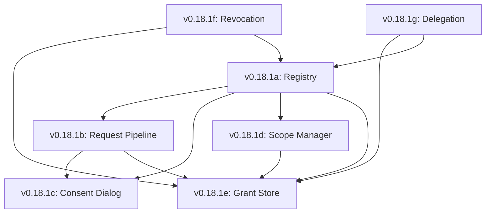

# Lexichord Design Specification Index: v0.18.1 — Permission Framework

**Parent Scope:** [LCS-SBD-v0.18.1-SEC.md](./LCS-SBD-v0.18.1-SEC.md)
**Module:** Permission Framework (Scoping Edition)
**Status:** Design Phase Complete
**Last Updated:** 2026-02-04

---

## Overview

This index catalogs all design specifications for the v0.18.1 Permission Framework. This module establishes a comprehensive, enterprise-grade permission system enabling granular control over AI capabilities (file access, network, code execution) through explicit user consent, dynamic scoping, and audit trails.

---

## Design Specification Documents

| Sub-Version | Document | Feature Name | Status |
|-------------|----------|--------------|--------|
| v0.18.1a | [LCS-DS-v0.18.1a-SEC.md](./LCS-DS-v0.18.1a-SEC.md) | Permission Registry & Types | Complete |
| v0.18.1b | [LCS-DS-v0.18.1b-SEC.md](./LCS-DS-v0.18.1b-SEC.md) | Permission Request Pipeline | Complete |
| v0.18.1c | [LCS-DS-v0.18.1c-SEC.md](./LCS-DS-v0.18.1c-SEC.md) | User Consent Dialog System | Complete |
| v0.18.1d | [LCS-DS-v0.18.1d-SEC.md](./LCS-DS-v0.18.1d-SEC.md) | Permission Scope Manager | Complete |
| v0.18.1e | [LCS-DS-v0.18.1e-SEC.md](./LCS-DS-v0.18.1e-SEC.md) | Grant Persistence & Storage | Complete |
| v0.18.1f | [LCS-DS-v0.18.1f-SEC.md](./LCS-DS-v0.18.1f-SEC.md) | Permission Revocation & Expiry | Complete |
| v0.18.1g | [LCS-DS-v0.18.1g-SEC.md](./LCS-DS-v0.18.1g-SEC.md) | Permission Inheritance & Delegation | Complete |

---

## Dependency Graph

---

## MediatR Events Summary

| Event | Source | Description |
|-------|--------|-------------|
| `PermissionRequestedEvent` | v0.18.1b | User prompted for permission |
| `PermissionGrantedEvent` | v0.18.1b | Permission granted (persisted) |
| `PermissionDeniedEvent` | v0.18.1b | Permission denied by user |
| `PermissionRevokedEvent` | v0.18.1f | Existing grant revoked |
| `PermissionExpiredEvent` | v0.18.1f | Grant TTL expired |
| `PermissionDelegatedEvent` | v0.18.1g | Permission delegated to another user |

---

## Implementation Order

1.  **Phase 1 (Core Definitions):** v0.18.1a (Registry)
2.  **Phase 2 (Request Flow):** v0.18.1d (Scopes) → v0.18.1b (Pipeline) → v0.18.1c (Dialog)
3.  **Phase 3 (Persistence):** v0.18.1e (Store)
4.  **Phase 4 (Lifecycle):** v0.18.1f (Revocation) → v0.18.1g (Delegation)

---

## Success Metrics

| Metric | Target |
|--------|--------|
| Pipeline Latency | <100ms (P95) overhead per request |
| Registry Lookup | <5ms cache hit |
| Grant Storage | <50ms query time |
| Revocation Propagation | Immediate (Next request blocked) |
