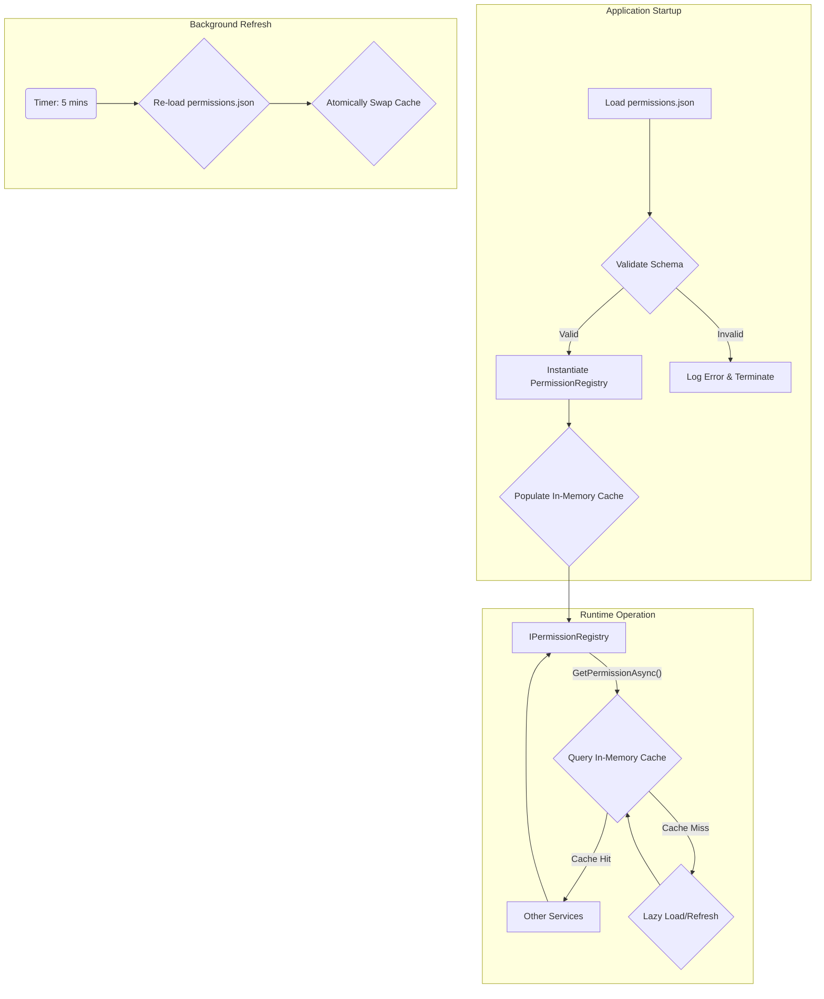

# LCS-DS-v0.18.1a-SEC: Design Specification — Permission Registry & Types

## 1. Document Control

| Field                 | Value                                        |
| :-------------------- | :------------------------------------------- |
| **Document ID**       | LCS-DS-v0.18.1a-SEC                          |
| **Parent SBD**        | LCS-SBD-v0.18.1-SEC                          |
| **Release Version**   | v0.18.1a                                     |
| **Component Name**    | Permission Registry & Types                  |
| **Document Type**     | Design Specification (DS)                    |
| **Author**            | Gemini Architect                             |
| **Created Date**      | 2026-02-03                                   |
| **Last Updated**      | 2026-02-03                                   |
| **Status**            | DRAFT                                        |
| **Classification**    | Internal — Technical Specification           |

---

## 2. Overview

This document provides the detailed design for the **Permission Registry & Types** component (v0.18.1a). This component is the foundational element of the Lexichord Permission Framework, responsible for defining, categorizing, and providing access to all permissions within the system. It serves as the single source of truth for permission metadata, ensuring consistency and reliability across the entire platform.

---

## 3. Detailed Design

### 3.1. Objective

Establish the foundational permission registry that defines all permissions available within Lexichord, their attributes, categories, risk levels, and scope constraints. This component serves as the single source of truth for the entire permission system.

### 3.2. Scope

- Define `IPermissionRegistry` interface for accessing permission metadata.
- Implement a `PermissionRegistry` service with in-memory caching and background refresh capabilities to ensure high performance and scalability.
- Define comprehensive C# records and enums for `PermissionType`, `PermissionCategory`, `PermissionRiskLevel`, and `PermissionScopeType`.
- Externalize permission definitions into a `permissions.json` file for easy management and seeding.
- Implement a robust permission categorization and risk assessment model.
- Establish support for permission inheritance hierarchies (e.g., `file.write` implies `file.read`).

### 3.3. Detailed Architecture

The Permission Registry is designed as a singleton service, loaded at application startup. It reads permission definitions from a JSON configuration file, populates an in-memory cache, and provides a strongly-typed API for other services to query permission metadata.



#### 3.3.1. Caching Strategy

The registry will use a `ConcurrentDictionary` for the primary in-memory store. A secondary dictionary will be populated during background refresh. Once the refresh is complete and the new data is validated, the references are swapped atomically using `Interlocked.Exchange`. This ensures that read operations are always lock-free and non-blocking. The cache will be indexed by `permissionId` for O(1) lookups. Secondary indexes (e.g., by category, by risk level) will be maintained in separate dictionaries to optimize query performance.

### 3.4. Data Flow

1.  **Initialization**:
    *   The `PermissionRegistry` service is instantiated by the dependency injection container.
    *   The constructor triggers an initial load of `permissions.json`.
    *   The JSON is deserialized into a `List<PermissionType>`.
    *   The list is validated against a predefined schema and business rules (e.g., no duplicate IDs).
    *   The validated list is used to populate the in-memory cache dictionaries.

2.  **Querying**:
    *   A client service injects `IPermissionRegistry`.
    *   The client calls a query method (e.g., `GetPermissionAsync("file.read")`).
    *   The registry performs a lookup in the corresponding cache dictionary.
    *   The result is returned as a `Task<PermissionType>`. All query methods are asynchronous, although they will complete synchronously from the cache.

3.  **Background Refresh**:
    *   A `Timer` is initiated in the `PermissionRegistry` constructor.
    *   Every 5 minutes, the timer's callback fires.
    *   The `permissions.json` file is re-read and re-validated in a background thread.
    *   A new set of cache dictionaries is populated.
    *   The main cache reference is atomically swapped to point to the new dictionaries. The old dictionaries are then garbage collected.

### 3.5. Interfaces & Records

```csharp
/// <summary>
/// Provides access to the permission registry and permission metadata.
/// This is the single source of truth for all permissions available in Lexichord.
/// </summary>
public interface IPermissionRegistry
{
    /// <summary>
    /// Gets a permission by its identifier.
    /// </summary>
    /// <param name="permissionId">The permission identifier (e.g., "file.read", "network.http")</param>
    /// <param name="cancellationToken">Cancellation token</param>
    /// <returns>The permission type, or null if not found</returns>
    Task<PermissionType?> GetPermissionAsync(
        string permissionId,
        CancellationToken cancellationToken = default);

    /// <summary>
    /// Gets all permissions in a specific category.
    /// </summary>
    /// <param name="category">The permission category</param>
    /// <param name="cancellationToken">Cancellation token</param>
    /// <returns>Collection of permissions in the category</returns>
    Task<IReadOnlyCollection<PermissionType>> GetPermissionsByCategoryAsync(
        PermissionCategory category,
        CancellationToken cancellationToken = default);

    /// <summary>
    /// Gets all permissions matching the specified risk level.
    /// </summary>
    Task<IReadOnlyCollection<PermissionType>> GetPermissionsByRiskLevelAsync(
        PermissionRiskLevel riskLevel,
        CancellationToken cancellationToken = default);

    /// <summary>
    /// Gets all permissions that are implied by the specified permission, including transitive implications.
    /// </summary>
    Task<IReadOnlyCollection<PermissionType>> GetImpliedPermissionsAsync(
        string permissionId,
        CancellationToken cancellationToken = default);

    /// <summary>
    /// Gets all registered permissions.
    /// </summary>
    Task<IReadOnlyCollection<PermissionType>> GetAllPermissionsAsync(
        CancellationToken cancellationToken = default);

    /// <summary>
    /// Searches permissions by name, description, or ID.
    /// </summary>
    Task<IReadOnlyCollection<PermissionType>> SearchPermissionsAsync(
        string searchQuery,
        CancellationToken cancellationToken = default);

    /// <summary>
    /// Validates if a permission ID exists and is registered.
    /// </summary>
    Task<bool> PermissionExistsAsync(
        string permissionId,
        CancellationToken cancellationToken = default);
}

/// <summary>
/// Represents a registered permission type in the system. This record is immutable.
/// </summary>
public record PermissionType(
    string Id,
    string Name,
    string Description,
    PermissionCategory Category,
    PermissionRiskLevel RiskLevel,
    PermissionScopeType DefaultScope,
    IReadOnlyCollection<string> ImpliedPermissions,
    PermissionMetadata Metadata,
    DateTimeOffset RegisteredAt,
    string? DeprecatedSince = null,
    string? DeprecationMessage = null);

/// <summary>
/// Detailed metadata about a permission.
/// </summary>
public record PermissionMetadata(
    string? LongDescription,
    IReadOnlyCollection<string> Examples,
    IReadOnlyCollection<string> SecurityWarnings,
    string? DocumentationUrl,
    bool RequiresElevatedReview,
    string? RequiredFeatureGate = null);

/// <summary>
/// Categories of permissions for organization and discovery.
/// </summary>
public enum PermissionCategory
{
    FileOperations = 0,
    NetworkAccess = 1,
    CodeExecution = 2,
    DataAnalysis = 3,
    SystemControl = 4,
    UserData = 5,
    ExternalServices = 6,
    AuditLogging = 7,
    AdminFunctions = 8
}

/// <summary>
/// Risk level assessment for permissions.
/// </summary>
public enum PermissionRiskLevel
{
    Low = 0,
    Medium = 1,
    High = 2,
    Critical = 3
}

/// <summary>
/// Scope types that can constrain permission applicability.
/// </summary>
public enum PermissionScopeType
{
    Global = 0,
    Project = 1,
    Document = 2,
    Resource = 3,
    Session = 4
}
```

### 3.6. Error Handling

-   **`permissions.json` Not Found**: The service will throw a `FileNotFoundException` at startup, preventing the application from starting in an invalid state. A clear error message will be logged.
-   **Invalid JSON Schema**: Deserialization will fail. The service will catch the `JsonException`, log a detailed error including the path and line number of the error, and throw an `InvalidOperationException` to halt startup.
-   **Duplicate Permission ID**: During validation, if a duplicate ID is found, an `InvalidOperationException` will be thrown with a message indicating the duplicate ID.
-   **Invalid Implied Permission**: If a permission lists an implied permission ID that does not exist, a warning will be logged, but the application will continue to start. The invalid implication will be ignored.
-   **Runtime Failures**: As the registry operates from an in-memory cache, runtime failures are minimal. Query methods will return `null` or empty collections for non-existent permissions, which is considered valid behavior.

### 3.7. Security Considerations

-   **Immutability**: All returned `PermissionType` records and collections are immutable, preventing modification by consumer services. The internal cache uses `IReadOnlyCollection` to enforce this.
-   **Input Sanitization**: The `searchQuery` in `SearchPermissionsAsync` will be sanitized to prevent any potential injection attacks, although the risk is low as it's used for in-memory searching.
-   **Denial of Service**: The `permissions.json` file is loaded into memory. A very large file could cause high memory consumption. A size limit (e.g., 10MB) will be enforced on the file to mitigate this.
-   **File Access**: The service only requires read access to the `permissions.json` file. The application's execution identity should be configured with the minimum necessary file permissions.

### 3.8. Performance Considerations

-   **Startup Time**: Loading and validating the `permissions.json` file will add to application startup time. This should be negligible for a reasonable number of permissions (<100ms for ~1000 permissions).
-   **Memory Usage**: The entire registry is held in memory. With ~1000 permissions, the memory footprint is expected to be small (< 5 MB).
-   **Query Time**: All query operations are designed for O(1) or O(N) complexity where N is small (e.g., items in a category). Lookups by ID are O(1). Searches will be O(N) where N is the total number of permissions, but this is acceptable for an admin-facing feature. All public methods are asynchronous to be good citizens in the async-first environment, even if the underlying operation is synchronous.

### 3.9. Testing Strategy

-   **Unit Tests**:
    -   Test `PermissionRegistry` with a mock `permissions.json` content.
    -   Verify correct loading, validation, and caching.
    -   Test duplicate ID detection.
    -   Test invalid schema detection.
    -   Test all query methods (`GetPermissionAsync`, `GetPermissionsByCategoryAsync`, etc.) for correctness.
    -   Test transitive resolution of implied permissions.
    -   Test search functionality.
    -   Ensure `PermissionExistsAsync` works as expected.
    -   Achieve >95% code coverage.
-   **Integration Tests**:
    -   Test the service within the application's dependency injection framework.
    -   Verify that the background refresh mechanism works and swaps the cache correctly.
-   **Performance Tests**:
    -   Benchmark single permission lookup time (target <= 1ms, as it's an in-memory lookup).
    -   Benchmark search performance (target <= 10ms).
    -   Measure startup time and memory usage with 50, 500, and 2000 permissions.

---

## 4. Key Artifacts & Deliverables

| Artifact              | Description                                                                    |
| :-------------------- | :----------------------------------------------------------------------------- |
| `IPermissionRegistry` | Async interface for querying permissions.                                      |
| `PermissionRegistry`  | Default implementation with in-memory caching and background refresh.          |
| `PermissionType`      | C# record defining the structure and metadata of a permission.                 |
| `PermissionCategory`  | Enum: `FileOps`, `NetworkAccess`, `CodeExecution`, etc.                        |
| `PermissionRiskLevel` | Enum: `Low`, `Medium`, `High`, `Critical`.                                     |
| `PermissionScopeType` | Enum: `Global`, `Project`, `Document`, `Resource`, `Session`.                  |
| `PermissionMetadata`  | C# record for documentation, examples, and warnings.                           |
| `permissions.json`    | Seed file containing the definitions of all system permissions.                |
| Unit Tests            | Comprehensive tests covering all logic in the `PermissionRegistry` service.    |
| Performance Benchmarks| Tests to validate the performance targets for query and search operations.       |

---

## 5. Acceptance Criteria

- [ ] `IPermissionRegistry` interface is fully defined and documented with XML comments.
- [ ] The default registry implementation supports in-memory caching with a configurable 5-minute TTL for background refresh.
- [ ] The system defines at least 50 initial permissions across all categories in `permissions.json`.
- [ ] Permission search (`SearchPermissionsAsync`) returns results within 20ms under benchmark conditions.
- [ ] All permissions designated as critical are marked with `PermissionRiskLevel.High` or `PermissionRiskLevel.Critical`.
- [ ] The permission hierarchy for implied permissions correctly resolves transitive implications (e.g., A -> B, B -> C, so A -> C).
- [ ] The registry successfully loads and validates `permissions.json` on startup, logging clear error messages for any invalid entries and halting startup on critical errors.
- [ ] Unit tests achieve at least 95% code coverage for the `PermissionRegistry` component.
- [ ] Performance benchmarks confirm that single permission lookups complete in <= 5ms.

---

## 6. Dependencies & Integration Points

### 6.1. Dependencies
-   **`Lexichord.Abstractions` (v0.0.3b)**: For common types and interfaces.
-   **`Microsoft.Extensions.Caching.Abstractions`**: Utilized for caching interfaces.
-   **`Microsoft.Extensions.Logging`**: For structured logging.

### 6.2. Integration Points
-   **Permission Request Pipeline (v0.18.1b)**: The pipeline will heavily rely on `IPermissionRegistry` to validate that requested permissions exist and to retrieve their metadata for risk assessment.
-   **Grant Persistence & Storage (v0.18.1e)**: The storage layer will reference permission IDs. The registry provides the canonical list of valid IDs.
-   **User Consent Dialog System (v0.18.1c)**: The UI will use the registry to fetch user-friendly names, descriptions, and warnings for the permissions being requested.
