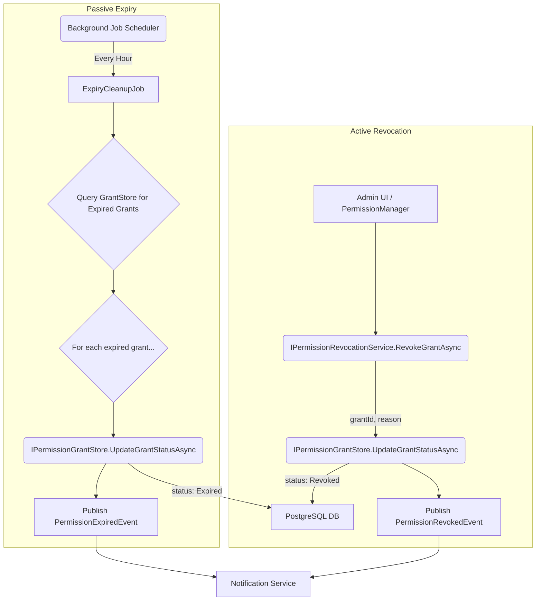

# LCS-DS-v0.18.1f-SEC: Design Specification — Permission Revocation & Expiry

## 1. Document Control

| Field                 | Value                                        |
| :-------------------- | :------------------------------------------- |
| **Document ID**       | LCS-DS-v0.18.1f-SEC                          |
| **Parent SBD**        | LCS-SBD-v0.18.1-SEC                          |
| **Release Version**   | v0.18.1f                                     |
| **Component Name**    | Permission Revocation & Expiry               |
| **Document Type**     | Design Specification (DS)                    |
| **Author**            | Gemini Architect                             |
| **Created Date**      | 2026-02-03                                   |
| **Last Updated**      | 2026-02-03                                   |
| **Status**            | DRAFT                                        |
| **Classification**    | Internal — Technical Specification           |

---

## 2. Overview

This document provides the detailed design for the **Permission Revocation & Expiry** component (v0.18.1f). This is a critical security and maintenance component of the Permission Framework. It provides the mechanisms for immediately revoking active permissions and for automatically cleaning up grants that have expired. This ensures that permissions are not held for longer than necessary, adhering to the principle of least privilege.

---

## 3. Detailed Design

### 3.1. Objective

Implement services for both immediate, user-driven revocation and automated, time-based expiry of permission grants, ensuring that changes to a grant's status are processed quickly, reliably, and with a complete audit trail.

### 3.2. Scope

-   Define an `IPermissionRevocationService` for handling immediate revocations.
-   Implement a `PermissionRevocationService` that orchestrates the logic for revoking one or more grants.
-   Implement a background job (`ExpiryCleanupJob`) that runs periodically to find and mark expired grants.
-   Define a clear set of `RevocationReason` enums for auditing purposes.
-   Support for cascading revocations, where revoking a high-level permission can optionally revoke implied lower-level permissions.
-   Implement a mechanism to notify the user or relevant systems when a permission is revoked or expires.

### 3.3. Detailed Architecture

The system consists of two main parts: an active revocation service and a passive background job.

1.  **`PermissionRevocationService`**: A service that can be injected and called by other parts of the system (e.g., the `PermissionManager` or an admin UI) to immediately revoke a grant. It directly calls the `IPermissionGrantStore` to update the grant's status.

2.  **`ExpiryCleanupJob`**: A background service (e.g., hosted by Hangfire, Quartz.NET, or a simple `IHostedService`) that runs on a schedule (e.g., every hour). It queries the `IPermissionGrantStore` for grants where `expires_at` is in the past and the status is still `Active`, and then updates their status to `Expired`.



#### 3.3.1. Cascading Revocation

When a permission that implies others is revoked (e.g., `file.write` implies `file.read`), the revocation service will:
1.  Look up the grant being revoked.
2.  Use `IPermissionRegistry.GetImpliedPermissionsAsync()` to find all implied permissions.
3.  Query the `IPermissionGrantStore` for active grants for the same user and the implied permissions within a similar scope.
4.  Revoke those grants as well, linking them to the original revocation action in the audit trail. This will be an optional behavior, configurable at the time of revocation.

### 3.4. Interfaces & Data Models

```csharp
/// <summary>
/// Provides services for revoking active permission grants and managing their lifecycle.
/// </summary>
public interface IPermissionRevocationService
{
    /// <summary>
    /// Immediately revokes a single permission grant.
    /// </summary>
    /// <param name="grantId">The unique identifier of the grant to revoke.</param>
    /// <param name="revokedByActorId">The ID of the user or system initiating the revocation.</param>
    /// <param name="reason">The reason for the revocation.</param>
    /// <param name="cascade">If true, also revokes grants for permissions implied by this one.</param>
    /// <param name="cancellationToken">Cancellation token.</param>
    /// <returns>True if the revocation was successful.</returns>
    Task<bool> RevokeGrantAsync(
        string grantId,
        string revokedByActorId,
        RevocationReason reason,
        bool cascade = false,
        CancellationToken cancellationToken = default);

    /// <summary>
    /// Revokes all active grants for a specific user and permission ID.
    /// </summary>
    /// <returns>The number of grants that were revoked.</returns>
    Task<int> RevokeAllForUserAsync(
        string userId,
        string permissionId,
        string revokedByActorId,
        RevocationReason reason,
        CancellationToken cancellationToken = default);
}

/// <summary>
/// A background service responsible for finding and marking expired permission grants.
/// </summary>
public interface IExpiryCleanupJob
{
    /// <summary>
    /// Executes the cleanup process, finding and expiring grants.
    /// </summary>
    /// <param name="cancellationToken">Cancellation token.</param>
    /// <returns>The number of grants that were successfully expired.</returns>
    Task<int> ProcessExpiredGrantsAsync(CancellationToken cancellationToken = default);
}

/// <summary>
/// Defines the standardized reasons for a permission revocation, used for auditing.
/// </summary>
public enum RevocationReason
{
    UserRequested = 0,
    SecurityIncident = 1,
    SystemUpdate = 2,
    ComplianceRequirement = 3,
    RoleChange = 4,
    ProjectCompletion = 5,
    AdminAction = 6,
    PermissionSuperseded = 7,
    SessionEnded = 8
}

/// <summary>
/// MediatR event published when a permission grant is revoked.
/// </summary>
public record PermissionRevokedEvent(
    string GrantId,
    string UserId,
    string PermissionId,
    RevocationReason Reason,
    DateTimeOffset RevokedAt) : INotification;

/// <summary>
/// MediatR event published when a permission grant expires.
/// </summary>
public record PermissionExpiredEvent(
    string GrantId,
    string UserId,
    string PermissionId,
    DateTimeOffset ExpiredAt) : INotification;
```

### 3.5. Error Handling

-   **Grant Not Found**: If `RevokeGrantAsync` is called with a `grantId` that does not exist or is not active, it will return `false` but will not throw an exception. It will log a warning.
-   **Database Unavailability**: The service will be resilient to transient database failures, using a retry policy (e.g., Polly). If the database is persistently unavailable, it will throw an exception. The background job will simply log the error and try again on its next scheduled run.
-   **Notification Failure**: If the event publication to a message bus fails, the error will be logged, but the revocation itself will not be rolled back. The revocation is the critical action; notification is secondary.

### 3.6. Security Considerations

-   **Authorization**: Access to the `IPermissionRevocationService` must be strictly controlled. Only system administrators or the user who owns the grant should be able to revoke it. This authorization check must be performed by the calling service (e.g., the API endpoint or `PermissionManager`) before invoking the revocation service.
-   **Audit Trail**: All revocations must be immutably recorded in the `grant_audit_entries` table. The `reason` and `actorId` are mandatory for this.
-   **Race Conditions**: The background job must be designed to be idempotent. If two instances of the job run simultaneously, they should not interfere with each other. This can be achieved by using a distributed lock or by designing the SQL query to select and update expired grants atomically (e.g., using `SELECT ... FOR UPDATE SKIP LOCKED`).

### 3.7. Performance Considerations

-   **Revocation Speed**: Immediate revocation should be fast. The action is a single `UPDATE` statement on an indexed column, so it should complete in well under 50ms.
-   **Expiry Job Performance**: The `ExpiryCleanupJob`'s query must be highly efficient. It will query for grants where `expires_at <= NOW()` and `status = Active`. An index on `(status, expires_at)` is essential for this. The job should process grants in batches (e.g., 1000 at a time) to avoid long-running transactions and high memory usage.

### 3.8. Testing Strategy

-   **Unit Tests**:
    -   Test the `PermissionRevocationService` logic, mocking the `IPermissionGrantStore`. Verify that it calls `UpdateGrantStatusAsync` with the correct parameters.
    -   Test the cascading revocation logic, mocking both the grant store and the permission registry.
    -   Test the `ExpiryCleanupJob` logic, mocking the grant store to provide a list of "expired" grants and verifying that the update method is called for each one.
-   **Integration Tests**:
    -   Run tests against a real test database.
    -   Create a grant, then call `RevokeGrantAsync` and verify that the status in the database is updated to `Revoked` and that an audit entry is created.
    -   Create a grant with an expiry time in the past, run the `ExpiryCleanupJob`, and verify that its status is updated to `Expired`.
    -   Test the distributed lock for the background job to ensure only one instance runs.

---

## 4. Key Artifacts & Deliverables

| Artifact                      | Description                                                              |
| :---------------------------- | :----------------------------------------------------------------------- |
| `IPermissionRevocationService`| The core interface for the revocation service.                           |
| `PermissionRevocationService` | The default implementation of the service.                               |
| `IExpiryCleanupJob`           | The interface for the background expiry job.                             |
| `ExpiryCleanupJob`            | The default implementation of the background job.                        |
| `PermissionRevokedEvent`      | A MediatR event for broadcasting revocation notifications.               |
| `PermissionExpiredEvent`      | A MediatR event for broadcasting expiry notifications.                   |
| Integration Tests             | A suite of tests verifying the database updates and job execution.      |

---

## 5. Acceptance Criteria

-   [ ] A call to `RevokeGrantAsync` updates the grant's status to `Revoked` in the database within 100ms.
-   [ ] Revoked grants are immediately excluded from all active permission checks.
-   [ ] The `ExpiryCleanupJob` runs on a configurable schedule (defaulting to hourly) and successfully processes over 1000 expired grants per second under benchmark conditions.
-   [ ] Revocation reasons are correctly categorized and logged in the `grant_audit_entries` table for every revocation.
-   [ ] The cascading revocation feature correctly identifies and revokes implied permissions when triggered.
-   [ ] A `PermissionRevokedEvent` or `PermissionExpiredEvent` is published for every grant status change performed by this component.
-   [ ] Integration tests verify the functionality of both the immediate revocation service and the background expiry job against a real database.

---

## 6. Dependencies & Integration Points

### 6.1. Dependencies
-   **`v0.18.1a` (Permission Registry)**: Used for the cascading revocation logic to find implied permissions.
-   **`v0.18.1e` (Grant Persistence & Storage)**: This is the primary dependency, as this component's main job is to update records in the grant store.
-   **Background Job Framework**: A library like `Hangfire` or `Quartz.NET` is recommended for scheduling the `ExpiryCleanupJob`.
-   **MediatR (or similar)**: For publishing domain events.

### 6.2. Integration Points
-   **`PermissionManager`**: Will expose a public API that calls `IPermissionRevocationService` to allow users or admins to revoke grants.
-   **Notification System**: A separate service will listen for `PermissionRevokedEvent` and `PermissionExpiredEvent` to send notifications to users (e.g., via email or in-app messages).
-   **Database**: This component's primary integration point is the PostgreSQL database, specifically the `permission_grants` and `grant_audit_entries` tables.
