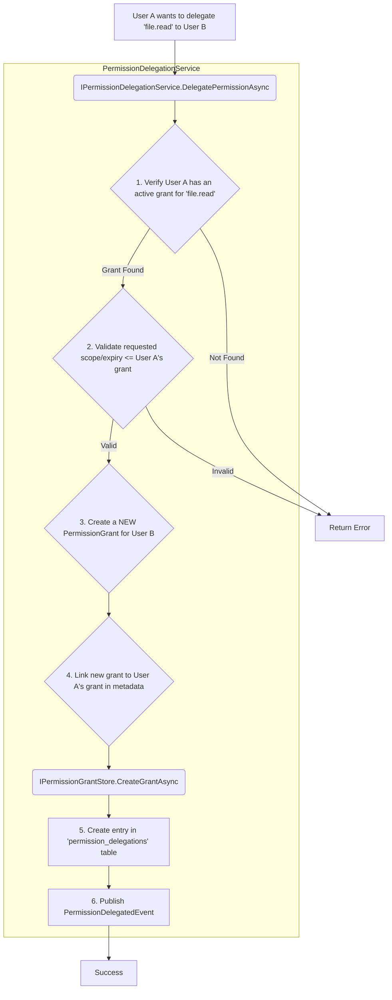

# LCS-DS-v0.18.1g-SEC: Design Specification — Permission Inheritance & Delegation

## 1. Document Control

| Field                 | Value                                        |
| :-------------------- | :------------------------------------------- |
| **Document ID**       | LCS-DS-v0.18.1g-SEC                          |
| **Parent SBD**        | LCS-SBD-v0.18.1-SEC                          |
| **Release Version**   | v0.18.1g                                     |
| **Component Name**    | Permission Inheritance & Delegation          |
| **Document Type**     | Design Specification (DS)                    |
| **Author**            | Gemini Architect                             |
| **Created Date**      | 2026-02-03                                   |
| **Last Updated**      | 2026-02-03                                   |
| **Status**            | DRAFT                                        |
| **Classification**    | Internal — Technical Specification           |

---

## 2. Overview

This document provides the detailed design for the **Permission Inheritance & Delegation** component (v0.18.1g). This component adds advanced authorization capabilities to the Permission Framework, supporting two key concepts:
1.  **Inheritance**: The automatic implication of permissions based on hierarchies defined in the `PermissionRegistry` (e.g., a grant for `file.write` automatically implies `file.read`).
2.  **Delegation**: The ability for a user to temporarily delegate one of their permissions to another user.

This component does not introduce many new services but rather modifies the behavior of the core permission checking logic.

---

## 3. Detailed Design

### 3.1. Objective

Implement permission inheritance hierarchies and temporary delegation patterns, enabling more flexible and realistic authorization models for teams and administrative workflows.

### 3.2. Scope

-   Modify the core permission checking logic (`PermissionManager.HasPermissionAsync`) to account for inheritance.
-   Define an `IPermissionDelegationService` for creating and managing delegations.
-   Implement a `PermissionDelegationService` that allows a user to create a temporary `PermissionGrant` for another user, linked back to the original grant.
-   Add a `delegations` table to the database to track these actions.
-   Enforce constraints on delegation, such as preventing a user from delegating a permission they do not have, or for a longer duration or broader scope than their own grant.
-   Limit the depth of sub-delegation to prevent complex, hard-to-audit chains.

### 3.3. Detailed Architecture

#### 3.3.1. Inheritance Architecture

Permission inheritance is not handled by a separate service, but rather by enhancing the existing permission checking flow.

```mermaid
graph TD
    A[Start: HasPermissionAsync(user, permissionId, context)] --> B{Get Active Grants for 'permissionId'};
    B --> C{Any direct grant matches scope?};
    C -- Yes --> Y[Return true];
    C -- No --> D{Find permissions that imply 'permissionId'};
    D -- from IPermissionRegistry --> E{For each implying permission...};
    E --> F{Get Active Grants for implying permission};
    F --> G{Any of these grants match scope?};
    G -- Yes --> Y;
    G -- No --> E;
    E -- No more implying perms --> Z[Return false];
```
This flow ensures that we check for a direct grant first, which is the most common and performant path. Only if a direct grant is not found do we traverse the inheritance hierarchy.

#### 3.3.2. Delegation Architecture

Delegation involves a user creating a new `PermissionGrant` for another user. This is an active process managed by the `PermissionDelegationService`.



The key is that delegation **creates a separate, new grant**. This grant can be revoked independently. The link in the metadata and the `permission_delegations` table is for auditing and for cascading revocations (e.g., if User A's grant is revoked, all delegations originating from it must also be revoked).

### 3.4. Interfaces & Data Models

```csharp
/// <summary>
/// Provides services for delegating permissions from one user to another.
/// </summary>
public interface IPermissionDelegationService
{
    /// <summary>
    /// Delegates a permission from one user to another, creating a new, temporary grant.
    /// </summary>
    /// <param name="delegatorUserId">The user delegating the permission.</param>
    /// <param name="delegateeUserId">The user receiving the delegated permission.</param>
    /// <param name="permissionIdToDelegate">The ID of the permission to delegate.</param>
    /// <param name="delegationScope">The scope for the new grant. Must be equal to or narrower than the delegator's scope.</param>
    /// <param name="expiresAt">When the delegated grant should expire. Cannot be later than the delegator's own grant expiry.</param>
    /// <param name="cancellationToken">Cancellation token.</param>
    /// <returns>The new PermissionGrant created for the delegatee.</returns>
    Task<PermissionDelegation> DelegatePermissionAsync(
        string delegatorUserId,
        string delegateeUserId,
        string permissionIdToDelegate,
        PermissionScope delegationScope,
        DateTimeOffset? expiresAt = null,
        CancellationToken cancellationToken = default);

    /// <summary>
    /// Revokes a permission that was previously delegated.
    /// </summary>
    /// <param name="delegationId">The unique ID of the delegation record.</param>
    /// <param name="revokedByActorId">The user or system revoking the delegation.</param>
    /// <param name="cancellationToken">Cancellation token.</param>
    /// <returns>True if the revocation was successful.</returns>
    Task<bool> RevokeDelegationAsync(string delegationId, string revokedByActorId, CancellationToken cancellationToken = default);

    /// <summary>
    /// Retrieves all delegations granted *by* a specific user.
    /// </summary>
    Task<IReadOnlyCollection<PermissionDelegation>> GetDelegationsGrantedByAsync(string userId, CancellationToken cancellationToken = default);

    /// <summary>
    /// Retrieves all delegations granted *to* a specific user.
    /// </summary>
    Task<IReadOnlyCollection<PermissionDelegation>> GetDelegationsGrantedToAsync(string userId, CancellationToken cancellationToken = default);
}

/// <summary>
/// Represents a record of a permission delegation event.
/// </summary>
public record PermissionDelegation(
    string DelegationId,
    string OriginatingGrantId, // The grant of the delegator
    string DelegatedGrantId,   // The new grant created for the delegatee
    string DelegatorUserId,
    string DelegateeUserId,
    string PermissionId,
    DateTimeOffset DelegatedAt,
    DateTimeOffset? ExpiresAt,
    DateTimeOffset? RevokedAt,
    int DelegationDepth = 0); // To control sub-delegation

/// <summary>
/// MediatR event published when a permission is delegated.
/// </summary>
public record PermissionDelegatedEvent(
    string DelegationId,
    string DelegatorUserId,
    string DelegateeUserId,
    string PermissionId,
    DateTimeOffset DelegatedAt) : INotification;
```

### 3.5. Database Schema Changes

A new table is required to track delegations for auditing.

```sql
-- Permission Delegations table
CREATE TABLE permission_delegations (
    delegation_id UUID PRIMARY KEY DEFAULT gen_random_uuid(),
    originating_grant_id UUID NOT NULL REFERENCES permission_grants(grant_id),
    delegated_grant_id UUID NOT NULL REFERENCES permission_grants(grant_id) UNIQUE,
    delegator_user_id VARCHAR(255) NOT NULL,
    delegatee_user_id VARCHAR(255) NOT NULL,
    delegated_at TIMESTAMPTZ NOT NULL DEFAULT NOW(),
    revoked_at TIMESTAMPTZ,
    delegation_depth INTEGER NOT NULL DEFAULT 0,
    created_at TIMESTAMPTZ NOT NULL DEFAULT NOW()
);

CREATE INDEX idx_delegations_delegator ON permission_delegations(delegator_user_id);
CREATE INDEX idx_delegations_delegatee ON permission_delegations(delegatee_user_id);
CREATE INDEX idx_delegations_origin_grant ON permission_delegations(originating_grant_id);
```

### 3.6. Error Handling

-   **Delegation Constraints**: `DelegatePermissionAsync` will throw an `UnauthorizedAccessException` if the delegator does not possess the permission they are trying to delegate, or if they try to delegate a broader scope or longer expiry than they themselves have.
-   **Sub-delegation**: The service will check the `DelegationDepth` of the original grant. If it exceeds a configured maximum (e.g., 3), it will throw an `InvalidOperationException` to prevent further delegation.
-   **Revocation**: If `RevokeDelegationAsync` is called, it will revoke the `delegated_grant_id`. It will also trigger a cascading revocation for any sub-delegations originating from that grant.

### 3.7. Security Considerations

-   **Delegation Authority**: Delegation is a powerful feature. The ability for a user to delegate a permission should itself be a meta-permission (e.g., `permissions.delegate`). By default, users should not be able to delegate permissions unless explicitly allowed.
-   **Audit Trail**: The `permission_delegations` table provides a clear audit trail of who delegated what to whom. This is critical for security analysis.
-   **Cascading Revocation**: When a user's permission grant is revoked, the system MUST also find and revoke all delegations that originated from that grant. This is a critical security feature to prevent orphaned, active delegations. A listener for the `PermissionRevokedEvent` will handle this logic.

### 3.8. Performance Considerations

-   **Inheritance Checks**: The inheritance check adds a small overhead to `HasPermissionAsync`. This check should only be performed if a direct grant is not found. The number of implying permissions is expected to be small, so the performance impact should be minimal. Caching the inheritance hierarchy in the `PermissionRegistry` will be important.
-   **Delegation Creation**: This is a user-driven action and not on a critical performance path. It involves a few database queries and two inserts (one grant, one delegation record), which is acceptable.

### 3.9. Testing Strategy

-   **Inheritance Unit Tests**:
    -   In the `PermissionManager` tests, verify that `HasPermissionAsync` returns true for an implied permission when the user only has the parent grant.
    -   Test multi-level inheritance (A -> B -> C).
-   **Delegation Unit Tests**:
    -   Test the `PermissionDelegationService`.
    -   Verify that a user cannot delegate a permission they don't have.
    -   Verify that delegation fails if the scope or expiry is too broad.
    -   Verify that sub-delegation depth limits are enforced.
-   **Delegation Integration Tests**:
    -   Test the full delegation flow against a test database, ensuring the `PermissionGrant` and `PermissionDelegation` records are created correctly.
    -   Test the cascading revocation of delegations. Create a chain of delegations (A->B, B->C) and revoke A's grant, then verify that B's and C's delegated grants are also revoked.

---

## 4. Key Artifacts & Deliverables

| Artifact                      | Description                                                                    |
| :---------------------------- | :----------------------------------------------------------------------------- |
| `IPermissionDelegationService`| The core interface for the delegation service.                                 |
| `PermissionDelegationService` | The default implementation of the service.                                     |
| `PermissionDelegation`        | The C# record for a delegation audit entry.                                    |
| Database Schema Changes       | The SQL script for the new `permission_delegations` table.                      |
| Updated `HasPermissionAsync`  | Modified permission checking logic to incorporate inheritance.                 |
| Integration Tests             | A suite of tests verifying inheritance and the full delegation/revocation lifecycle. |

---

## 5. Acceptance Criteria

-   [ ] The `HasPermissionAsync` check correctly returns `true` for an implied permission if a user holds the parent grant.
-   [ ] A user can successfully delegate a permission they possess to another user, creating a new, temporary grant for the delegatee.
-   [ ] An attempt to delegate a permission with a broader scope or longer expiry than the original grant fails with an explanatory error.
-   [ ] The sub-delegation depth is limited to a configurable maximum (defaulting to 3 levels).
-   [ ] Revoking a user's grant automatically triggers a cascading revocation of all delegations that originated from that grant.
-   [ ] A complete delegation history is maintained in the `permission_delegations` table for auditing purposes.
-   [ ] Unit and integration tests are in place to verify both inheritance logic and the delegation/cascading revocation lifecycle.

---

## 6. Dependencies & Integration Points

### 6.1. Dependencies
-   **`v0.18.1a` (Permission Registry)**: Provides the inheritance hierarchy.
-   **`v0.18.1e` (Grant Persistence & Storage)**: Used to create and query grants.
-   **`v0.18.1f` (Revocation Service)**: Used to handle cascading revocations.

### 6.2. Integration Points
-   **`PermissionManager`**: The `HasPermissionAsync` method will be updated to include the inheritance logic. An API for delegation will be exposed here.
-   **Admin/User UI**: A new UI will be required for users to manage their delegations (viewing, revoking, creating).
-   **`PermissionRevokedEvent` listener**: A new event handler will be created to listen for revocation events and trigger the cascading revocation of delegations.
