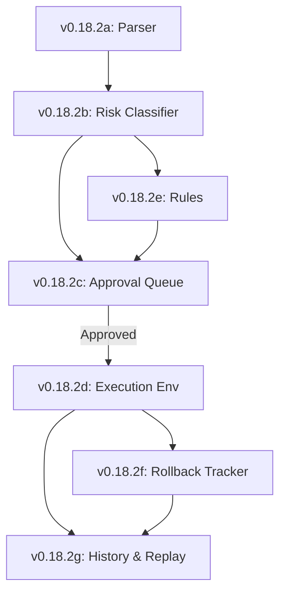

# Lexichord Design Specification Index: v0.18.2 — Command Sandboxing

**Parent Scope:** [LCS-SBD-v0.18.2-SEC.md](./LCS-SBD-v0.18.2-SEC.md)
**Module:** Command Sandbox
**Status:** Design Phase Complete
**Last Updated:** 2026-02-04

---

## Overview

This index catalogs all design specifications for the v0.18.2 Command Sandbox. This module implements a robust, multi-layered command execution environment that analyzes, classifies, and executes terminal commands with full user visibility, ensuring autonomous agents cannot execute dangerous operations without oversight.

---

## Design Specification Documents

| Sub-Version | Document | Feature Name | Status |
|-------------|----------|--------------|--------|
| v0.18.2a | [LCS-DS-v0.18.2a-SEC.md](./LCS-DS-v0.18.2a-SEC.md) | Command Parser & Analyzer | Complete |
| v0.18.2b | [LCS-DS-v0.18.2b-SEC.md](./LCS-DS-v0.18.2b-SEC.md) | Risk Classification Engine | Complete |
| v0.18.2c | [LCS-DS-v0.18.2c-SEC.md](./LCS-DS-v0.18.2c-SEC.md) | Approval Queue & UI | Complete |
| v0.18.2d | [LCS-DS-v0.18.2d-SEC.md](./LCS-DS-v0.18.2d-SEC.md) | Safe Execution Environment | Complete |
| v0.18.2e | [LCS-DS-v0.18.2e-SEC.md](./LCS-DS-v0.18.2e-SEC.md) | Command Allowlist/Blocklist | Complete |
| v0.18.2f | [LCS-DS-v0.18.2f-SEC.md](./LCS-DS-v0.18.2f-SEC.md) | Rollback & Undo System | Complete |
| v0.18.2g | [LCS-DS-v0.18.2g-SEC.md](./LCS-DS-v0.18.2g-SEC.md) | Command History & Replay | Complete |

---

## Dependency Graph

---

## Interfaces & Logic Summary

| Interface | Component | Responsibility |
|-----------|-----------|----------------|
| `ICommandParser` | v0.18.2a | Normalizes shell commands |
| `IRiskClassifier` | v0.18.2b | Scores risk 0-100 |
| `IApprovalQueue` | v0.18.2c | Manages human review |
| `ISandboxedExecutor` | v0.18.2d | Runs isolated output capture |
| `ICommandRuleManager` | v0.18.2e | Enforces Block/Allow lists |
| `ICommandRollbackManager` | v0.18.2f | Restores State |

---

## Implementation Order

1.  **Phase 1 (Analysis):** v0.18.2a (Parser) → v0.18.2b (Risk) → v0.18.2e (Rules)
2.  **Phase 2 (Control):** v0.18.2c (Queue)
3.  **Phase 3 (Execution):** v0.18.2d (Sandbox)
4.  **Phase 4 (Recovery):** v0.18.2f (Rollback) → v0.18.2g (History)

---

## Success Metrics

| Metric | Target |
|--------|--------|
| Parsing Speed | <5ms per command |
| Risk Assessment | <20ms latency |
| False Positive Rate | <2% deemed "High Risk" incorrectly |
| Rollback Success | 100% of FS changes tracked |
