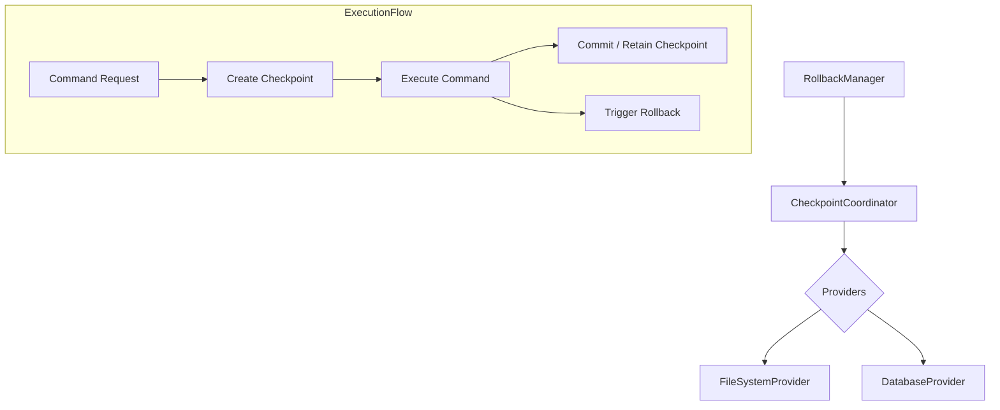

# LCS-DS-v0.18.2f-SEC: Design Specification — Rollback & Undo System

## 1. Document Control

| Field                 | Value                                        |
| :-------------------- | :------------------------------------------- |
| **Document ID**       | LCS-DS-v0.18.2f-SEC                          |
| **Parent SBD**        | LCS-SBD-v0.18.2-SEC                          |
| **Release Version**   | v0.18.2f                                     |
| **Component Name**    | Rollback & Undo System                       |
| **Document Type**     | Design Specification (DS)                    |
| **Author**            | Gemini Architect                             |
| **Created Date**      | 2026-02-04                                   |
| **Last Updated**      | 2026-02-04                                   |
| **Status**            | DRAFT                                        |
| **Classification**    | Internal — Technical Specification           |

---

## 2. Overview

This document provides the detailed design for the **Rollback & Undo System** (v0.18.2f). This component provides a safety net for command execution by enabling the system to capture the state of resources before modifications occur and revert them if necessary. This capability is critical for mitigating the impact of unintended AI actions or errors.

---

## 3. Detailed Design

### 3.1. Objective

Enable the automated and manual reversal of side-effects caused by executed commands, specifically focusing on filesystem changes and database operations.

### 3.2. Scope

-   Define `ICommandRollbackManager` to coordinate rollback operations.
-   Implement specific rollback strategies:
    -   **Filesystem**: Snapshot-based (LVM/ZFS) or Backup-based (copy-on-write temp storage).
    -   **Database**: Transactional rollback (if available) or Reverse-Operation generation.
-   Support "Dry Run" rollback to preview what will be reverted.
-   Manage the storage and lifecycle of "Checkpoints" (cleanup old snapshots).

### 3.3. Detailed Architecture

The system uses a provider model where different resources have dedicated checkpoint providers.



#### 3.3.1. Rollback Strategies

1.  **Filesystem (Backup-based)**:
    -   Before a command writes to `file.txt`, the provider copies `file.txt` to a hidden `.undo/` directory.
    -   **Rollback**: Copy the file back from `.undo/` to original location.
    -   **Pros**: Portable, works on any FS.
    -   **Cons**: Slow for large files.
2.  **Filesystem (Snapshot-based - Advanced)**:
    -   Use OS-level snapshots (APFS, ZFS, LVM).
    -   **Pros**: Fast, atomic.
    -   **Cons**: Requires specific OS/FS configuration.
    -   *Decision*: V1 will implement Backup-based for broad compatibility, with hooks for Snapshot-based.

3.  **Database**:
    -   Wrap operations in a transaction via a proxy driver or explicit transaction management if the command supports it.
    -   Otherwise, limited support (non-transactional shell commands affecting DBs are hard to rollback).

### 3.4. Interfaces & Data Models

```csharp
/// <summary>
/// Manages the creation and restoration of system checkpoints.
/// </summary>
public interface ICommandRollbackManager
{
    /// <summary>
    /// Creates a checkpoint for the resources that will be affected by the command.
    /// </summary>
    Task<RollbackCheckpoint> CreateCheckpointAsync(
        ParsedCommand command,
        IReadOnlyList<string> affectedResources,
        CancellationToken ct = default);

    /// <summary>
    /// Reverts the system to the state captured in the checkpoint.
    /// </summary>
    Task<RollbackResult> RollbackAsync(
        RollbackCheckpoint checkpoint,
        CancellationToken ct = default);

    /// <summary>
    /// Cleans up checkpoint data (commits changes).
    /// </summary>
    Task DiscardCheckpointAsync(RollbackCheckpoint checkpoint, CancellationToken ct = default);
}

public record RollbackCheckpoint
{
    public Guid Id { get; init; }
    public DateTime CreatedAt { get; init; }
    public IReadOnlyList<ResourceState> Resources { get; init; }
    public string StorageLocation { get; init; } // Path to backup data
}

public interface ICheckpointProvider
{
    bool CanHandle(string resourceIdentifier);
    Task<ResourceState> CaptureAsync(string resourceIdentifier);
    Task RestoreAsync(ResourceState state);
}
```

### 3.5. Security Considerations

-   **Checkpoint Security**: The `.undo` directory or checkpoint storage may contain sensitive data (verbatim copies of files). Access must be restricted with the same rigor as the original files.
-   **Denial of Service**: Generating checkpoints consumes disk space. Malicious commands targeting massive files could exhaust disk space via the rollback system.
    -   *Mitigation*: Quotas on checkpoint size.

### 3.6. Performance Considerations

-   **Copy Overhead**: Backing up large files is expensive.
    -   *Optimization*: Use Copy-on-Write (CoW) link capability where available (e.g., `reflink` on Linux/XFS/Btrfs, `clonefile` on APFS).

### 3.7. Testing Strategy

-   **Functional Tests**:
    -   Create file -> Checkpoint -> Modify file -> Rollback -> Verify original content.
    -   Delete file -> Rollback -> Verify file exists.
    -   Create new file -> Rollback -> Verify file is gone.
-   **Failure Cases**: Ensure partial rollback handling (what if restoring 1 out of 5 files fails?).

---

## 4. Key Artifacts & Deliverables

| Artifact                 | Description                                                              |
| :----------------------- | :----------------------------------------------------------------------- |
| `ICommandRollbackManager`| Core interface.                                                          |
| `FileSystemCheckpointProvider` | Backs up/restores files.                                         |
| Checkpoint Storage Manager| Manages disk usage of checkpoints.                                      |

---

## 5. Acceptance Criteria

-   [ ] **File Restoration**: Modified and deleted files are correctly restored to their pre-execution state.
-   [ ] **New File Cleanup**: Files created by the command are deleted during rollback.
-   [ ] **CoW Usage**: Implementation utilizes OS-level Copy-on-Write where supported for performance.
-   [ ] **Safety**: Checkpoint failures do not corrupt the current state.
