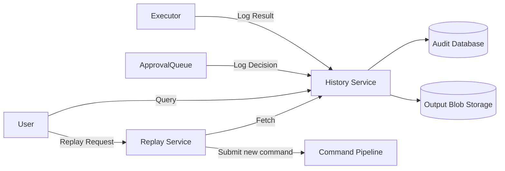

# LCS-DS-v0.18.2g-SEC: Design Specification — Command History & Replay

## 1. Document Control

| Field                 | Value                                        |
| :-------------------- | :------------------------------------------- |
| **Document ID**       | LCS-DS-v0.18.2g-SEC                          |
| **Parent SBD**        | LCS-SBD-v0.18.2-SEC                          |
| **Release Version**   | v0.18.2g                                     |
| **Component Name**    | Command History & Replay                     |
| **Document Type**     | Design Specification (DS)                    |
| **Author**            | Gemini Architect                             |
| **Created Date**      | 2026-02-04                                   |
| **Last Updated**      | 2026-02-04                                   |
| **Status**            | DRAFT                                        |
| **Classification**    | Internal — Technical Specification           |

---

## 2. Overview

This document provides the detailed design for the **Command History & Replay** system (v0.18.2g). This component ensures full auditability of all AI actions by persisting comprehensive logs of every command requested, approved, denied, and executed. It also enables "Replay" functionality, allowing users or agents to re-execute past commands or analyze past failures.

---

## 3. Detailed Design

### 3.1. Objective

Maintain a tamper-evident, searchable history of all command activity and provide tools to re-execute commands safely.

### 3.2. Scope

-   Define schema for `CommandExecutionRecord`.
-   Implement `ICommandHistoryManager` for persistent storage/retrieval.
-   Implement `ICommandReplayer` for re-execution logic.
-   Provide filtering/searching capability (time range, risk level, user, text).
-   Handle storage of large command outputs (stdout/stderr).

### 3.3. Detailed Architecture

The history system sits parallel to the execution pipeline, receiving events from the `ApprovalQueue` and `SandboxedExecutor`.



#### 3.3.1. Storage Strategy

-   **Metadata**: stored in a relational database (SQLite/PostgreSQL) for fast searching/filtering.
-   **Output Content**: Large stdout/stderr blocks are stored in a content-addressable blob store (or simple file store) to keep the DB lean.

### 3.4. Interfaces & Data Models

```csharp
/// <summary>
/// Manages access to command execution history.
/// </summary>
public interface ICommandHistoryManager
{
    Task AppendEntryAsync(CommandHistoryEntry entry, CancellationToken ct = default);
    
    Task<HistoryQueryResult> QueryAsync(HistoryQuery query, CancellationToken ct = default);
    
    Task<CommandHistoryEntry?> GetEntryAsync(ExecutionId id, CancellationToken ct = default);
}

/// <summary>
/// Facilitates re-execution of historical commands.
/// </summary>
public interface ICommandReplayer
{
    /// <summary>
    /// Prepares a command for re-execution, validating current context against historical context.
    /// </summary>
    Task<ReplayPlan> PrepareReplayAsync(ExecutionId originalId, CancellationToken ct = default);

    /// <summary>
    /// Submits the replay to the active pipeline.
    /// </summary>
    Task<ExecutionId> ExecuteReplayAsync(ReplayPlan plan, CancellationToken ct = default);
}

public record CommandHistoryEntry
{
    public ExecutionId Id { get; init; }
    public DateTime Timestamp { get; init; }
    public string CommandText { get; init; }
    public ParsedCommand Structure { get; init; }
    public ExecutionResult? Result { get; init; }
    public RiskClassification Risk { get; init; }
    public User Actor { get; init; }
    public string ContextHash { get; init; } // Hash of CWD, Env, etc.
}

public record HistoryQuery
{
    public DateRange? DateRange { get; init; }
    public string? SearchText { get; init; } // Full text search
    public RiskLevel? MinRisk { get; init; }
    public int Limit { get; init; } = 100;
    public int Offset { get; init; } = 0;
}
```

### 3.5. Security Considerations

-   **Audit Integrity**: The audit log must be tamper-resistant. Ideally, write-once logic or cryptographic chaining (Merkle tree) should be used for high-security deployments.
-   **Sensitive Data in Logs**: Commands might contain secrets (e.g., `export API_KEY=xyz`).
    -   *Mitigation*: The `CommandParser` (v0.18.2a) should have flagged sensitive tokens. The History Manager must redact these before persistence.

### 3.6. Performance Considerations

-   **Async Writes**: Logging should never block user interaction. It should be performed asynchronously.
-   **Indexing**: DB must be indexed on Timestamp, RiskLevel, and Actor.

### 3.7. Testing Strategy

-   **Throughput**: Verify logging does not degrade execution speed.
-   **Search**: Verify complex queries return correct results.
-   **Replay**: Verify replaying a command works as expected, and that context warnings are generated if the environment has changed (e.g., directory no longer exists).

---

## 4. Key Artifacts & Deliverables

| Artifact                 | Description                                                              |
| :----------------------- | :----------------------------------------------------------------------- |
| `ICommandHistoryManager` | Core interface.                                                          |
| `SqlHistoryProvider`     | Entity Framework implementation.                                         |
| `BlobOutputStore`        | File-based store for large outputs.                                      |
| `ReplayService`          | Logic for context comparison and resubmission.                           |

---

## 5. Acceptance Criteria

-   [ ] **Completeness**: Every executed command generates a history entry.
-   [ ] **Searchability**: Entries can be found by text content or date.
-   [ ] **Replay**: Users can successfully re-run a command from history.
-   [ ] **Privacy**: Logs are automatically redacted (best-effort) of known secrets.
