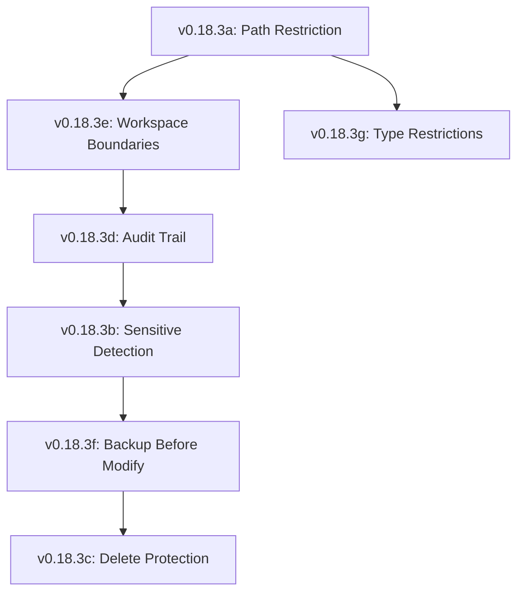

# Lexichord Design Specification Index: v0.18.3 — File System Security

**Parent Scope:** [LCS-SBD-v0.18.3-SEC.md](./LCS-SBD-v0.18.3-SEC.md)
**Module:** File System Security
**Status:** Design Phase Complete
**Last Updated:** 2026-02-04

---

## Overview

This index catalogs all design specifications for the v0.18.3 File System Security module. This release introduces comprehensive protections designed to prevent unauthorized access, detect sensitive files, safeguard critical data via soft-delete logic, and enforce strict workspace isolation boundaries.

---

## Design Specification Documents

| Sub-Version | Document | Feature Name | Status |
|-------------|----------|--------------|--------|
| v0.18.3a | [LCS-DS-v0.18.3a-SEC.md](./LCS-DS-v0.18.3a-SEC.md) | Path Restriction Engine | Complete |
| v0.18.3b | [LCS-DS-v0.18.3b-SEC.md](./LCS-DS-v0.18.3b-SEC.md) | Sensitive File Detection | Complete |
| v0.18.3c | [LCS-DS-v0.18.3c-SEC.md](./LCS-DS-v0.18.3c-SEC.md) | Delete Protection & Trash | Complete |
| v0.18.3d | [LCS-DS-v0.18.3d-SEC.md](./LCS-DS-v0.18.3d-SEC.md) | File Access Audit Trail | Complete |
| v0.18.3e | [LCS-DS-v0.18.3e-SEC.md](./LCS-DS-v0.18.3e-SEC.md) | Workspace Boundaries | Complete |
| v0.18.3f | [LCS-DS-v0.18.3f-SEC.md](./LCS-DS-v0.18.3f-SEC.md) | Backup Before Modify | Complete |
| v0.18.3g | [LCS-DS-v0.18.3g-SEC.md](./LCS-DS-v0.18.3g-SEC.md) | File Type Restrictions | Complete |

---

## Dependency Graph

---

## Interfaces & Logic Summary

| Interface | Component | Responsibility |
|-----------|-----------|----------------|
| `IPathRestrictionEngine` | v0.18.3a | Blocks access to forbidden paths |
| `ISensitiveFileDetector` | v0.18.3b | Scans for keys/PII |
| `IDeleteProtectionService` | v0.18.3c | Implements Trash/Undo |
| `IFileAccessAuditor` | v0.18.3d | Logs all IO ops |
| `IWorkspaceBoundaryManager` | v0.18.3e | Prevents cross-workspace access |
| `IBackupBeforeModifyService` | v0.18.3f | Creates automatic snapshots |
| `IFileTypeRestrictor` | v0.18.3g | Blocks .exe/.so files |

---

## Implementation Order

1.  **Phase 1 (Core Gatekeepers):** v0.18.3a (Path) → v0.18.3e (Boundaries)
2.  **Phase 2 (Content Control):** v0.18.3g (Types) → v0.18.3b (Sensitive)
3.  **Phase 3 (Recovery):** v0.18.3f (Backup) → v0.18.3c (Trash)
4.  **Phase 4 (Observability):** v0.18.3d (Audit)

---

## Success Metrics

| Metric | Target |
|--------|--------|
| Path Check Latency | <1ms |
| Detection Accuracy | >99% for known credential patterns |
| Backup Overhead | <10ms for small files |
| Audit Retention | 1 Year Minimum |
