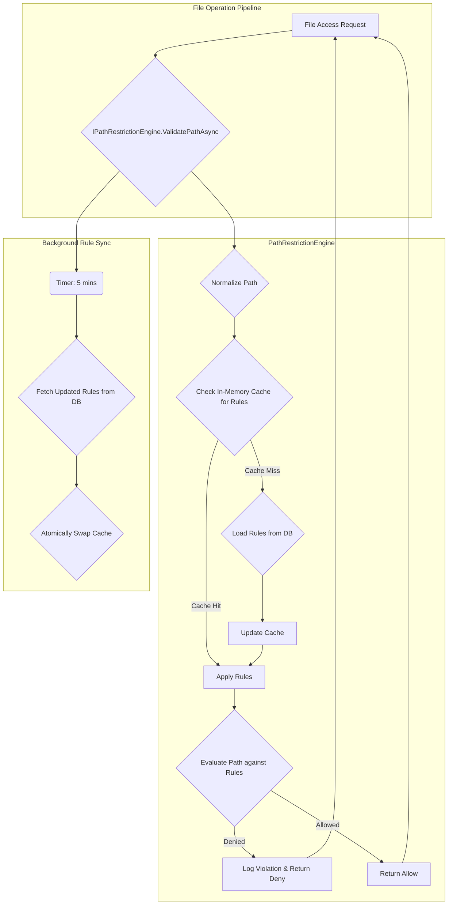

# LCS-DS-v0.18.3a-SEC: Design Specification — Path Restriction Engine

## 1. Document Control

| Field                 | Value                                        |
| :-------------------- | :------------------------------------------- |
| **Document ID**       | LCS-DS-v0.18.3a-SEC                          |
| **Parent SBD**        | LCS-SBD-v0.18.3-SEC                          |
| **Release Version**   | v0.18.3a                                     |
| **Component Name**    | Path Restriction Engine                      |
| **Document Type**     | Design Specification (DS)                    |
| **Author**            | Gemini Architect                             |
| **Created Date**      | 2026-02-04                                   |
| **Last Updated**      | 2026-02-04                                   |
| **Status**            | DRAFT                                        |
| **Classification**    | Internal — Technical Specification           |

---

## 2. Overview

This document outlines the detailed design for the **Path Restriction Engine** (v0.18.3a). This critical security component is the first line of defense in Lexichord's file system security model. Its primary function is to intercept and validate all file system paths accessed by the application, ensuring that operations do not occur on sensitive system directories or paths restricted by workspace boundaries or user permissions. The engine provides a centralized, performant, and configurable mechanism for enforcing path-based access control.

---

## 3. Detailed Design

### 3.1. Objective

To implement a robust, high-performance path validation and restriction engine that prevents file operations on sensitive system directories and workspace-restricted paths. The engine will use a multi-layered approach to validation, checking against OS-level restrictions, application-defined rules, and dynamic, user-specific policies loaded from the database.

### 3.2. Scope

-   **Multi-level Path Validation**: Implement checks for OS-level sensitive paths (e.g., `/etc`, `C:\Windows\System32`), application-level rules, and workspace-specific restrictions.
-   **Dynamic Rule Loading**: Restriction rules will be stored in the database and loaded dynamically, allowing for updates without requiring an application restart.
-   **Pattern Matching**: Support for pattern-based path blacklisting and whitelisting (e.g., using glob patterns).
-   **Performance**: The engine must be highly performant, with sub-millisecond validation times for cached rules to avoid becoming a bottleneck for file operations.
-   **Contextual Validation**: Integration with the user's security context to apply user-specific and role-based restrictions.
-   **Auditing**: All validation attempts, both successful and failed, will be logged for security auditing and compliance.
-   **Cross-Platform Support**: The engine must correctly handle and normalize path formats for Windows, Linux, and macOS.

### 3.3. Detailed Architecture

The Path Restriction Engine will be implemented as a service (`IPathRestrictionEngine`) registered as a singleton in the dependency injection container. It will maintain an in-memory cache of restriction rules, indexed by workspace, to ensure high-speed lookups. The cache will be updated periodically through a background service or on-demand when rules are changed.



#### 3.3.1. Caching Strategy

The engine will use a `ConcurrentDictionary` to store `PathRestrictionRule` objects, keyed by `workspaceId`. A nested dictionary will store rules by their ID. This allows for efficient retrieval of all rules for a given workspace. A background `Timer` will trigger a refresh from the `path_restrictions` table every 5 minutes. To avoid race conditions during updates, a double-buffering/atomic swap mechanism will be used for the cache.

### 3.4. Data Flow

1.  **Initialization**: The `PathRestrictionEngine` service is instantiated at startup. It pre-loads global (OS-level) restriction rules.
2.  **First Request for a Workspace**: When `ValidatePathAsync` is called for a workspace whose rules are not in the cache, the engine queries the `path_restrictions` table in the database to fetch all active rules for that `workspace_id`.
3.  **Caching**: The fetched rules are loaded into the in-memory cache.
4.  **Validation Logic**:
    a. The input path is normalized to a consistent format.
    b. The engine first checks against the high-priority global/OS-level rules.
    c. It then checks against the cached workspace-specific rules.
    d. Pattern-based rules (e.g., globs) are evaluated.
    e. If no rule denies access, the path is considered valid.
5.  **Logging**: The result of every validation (allow or deny), along with the security context and the rule that was triggered, is passed to the `IFileAccessAuditor` service.
6.  **Background Refresh**: A background service periodically queries the database for updated rules and swaps the cache to reflect any changes.

### 3.5. Interfaces & Records

The primary interface and its related models are defined in the parent SBD. Here is the C# implementation based on that definition:

```csharp
/// <summary>
/// Provides comprehensive path validation and restriction functionality
/// to prevent unauthorized access to system and protected directories.
/// </summary>
public interface IPathRestrictionEngine
{
    /// <summary>
    /// Validates whether a path is accessible within the current security context.
    /// </summary>
    /// <param name="path">Full file system path to validate.</param>
    /// <param name="context">Security context including user and workspace info.</param>
    /// <param name="cancellationToken">Operation cancellation token.</param>
    /// <returns>Validation result with detailed reasoning if denied.</returns>
    Task<PathValidationResult> ValidatePathAsync(
        string path,
        SecurityContext context,
        CancellationToken cancellationToken = default);
}

/// <summary>
/// Represents the result of a path validation operation.
/// </summary>
public record PathValidationResult(
    bool IsAllowed,
    string Path,
    PathViolationType? ViolationType,
    string Reason,
    long ExecutionTimeMs,
    DateTime ValidatedAt);

/// <summary>
/// Defines the types of path violations that can occur.
/// </summary>
public enum PathViolationType
{
    SystemPathAccess,
    WorkspaceOutOfBounds,
    InsufficientPermission,
    RestrictedPattern,
    UserBlacklisted,
    SymlinkEscape
}

/// <summary>
/// Represents a single path restriction rule.
/// </summary>
public record PathRestrictionRule(
    Guid Id,
    Guid WorkspaceId,
    string Pattern,
    string RestrictionType,
    string RuleSeverity,
    string Description,
    bool IsActive);

/// <summary>
/// The security context for the user performing the action.
/// </summary>
public record SecurityContext(
    Guid UserId,
    Guid WorkspaceId,
    string UserRole,
    string IpAddress);
```

### 3.6. Error Handling

-   **Database Unavailability**: If the database is down during a rule cache miss, the engine will fail-safe by denying the path access and logging a critical error.
-   **Invalid Rule Pattern**: If a glob or regex pattern in a rule is invalid, it will be logged as a warning during the loading process and the rule will be skipped.
-   **Performance Degradation**: The `ExecutionTimeMs` in `PathValidationResult` will be monitored. If validation times exceed a threshold (e.g., 5ms), an alert will be triggered.

### 3.7. Security Considerations

-   **Path Normalization**: The engine must be robust against path traversal and normalization attacks (e.g., `../`, `..\`, `//`, `\`). All paths will be canonicalized before validation.
-   **Symlink Attacks**: The engine should be aware of symbolic links that could be used to escape restricted directories. The file operation layer will be responsible for detecting and optionally blocking symlinks, but the path engine will validate the resolved, real path.
-   **Fail-Closed Principle**: In case of ambiguity or error (e.g., database failure), the engine will default to denying access rather than allowing it.
-   **Rule Management**: Access to add or modify rules in the `path_restrictions` table will be tightly controlled via application-level permissions, restricted to administrators.

### 3.8. Performance Considerations

-   **Cache is Key**: The system's performance relies heavily on the in-memory cache. The target for a cached path validation is < 1ms.
-   **Batching**: While not in the initial interface, `ValidatePathsAsync` (as defined in the SBD) should be considered for future optimization to validate multiple paths in a single call, reducing overhead.
-   **Regex Compilation**: Regular expression patterns used in rules will be compiled with `RegexOptions.Compiled` for improved performance.

### 3.9. Testing Strategy

-   **Unit Tests**:
    -   Test path normalization for Windows, macOS, and Linux formats.
    -   Test various path traversal attack patterns.
    -   Verify that OS-level system paths are correctly blocked.
    -   Test workspace boundary enforcement.
    -   Test pattern matching for both blacklist and whitelist scenarios.
    -   Mock the database repository to test rule loading and caching logic.
-   **Integration Tests**:
    -   Test the engine within the DI container, ensuring it's created as a singleton.
    -   Verify that database rule changes are reflected in the engine after the cache refresh interval.
-   **Performance Tests**:
    -   Benchmark the `ValidatePathAsync` method with a large number of cached rules (e.g., 10,000) to ensure it meets the < 1ms target.
    -   Measure the performance impact of a cache miss and subsequent database load.

---

## 4. Key Artifacts & Deliverables

| Artifact                  | Description                                                              |
| :------------------------ | :----------------------------------------------------------------------- |
| `IPathRestrictionEngine`  | The main service interface for path validation.                          |
| `PathRestrictionEngine`   | The default singleton implementation of the service.                     |
| `PathValidationResult`    | Record representing the outcome of a validation check.                   |
| `PathViolationType`       | Enum defining the reasons for a path denial.                             |
| `PathRestrictionRule`     | Record representing a rule loaded from the database.                     |
| `RestrictedPathsRepository` | A repository class for accessing the `path_restrictions` table.          |
| Database Migration        | SQL script to create the `path_restrictions` table.                      |
| Unit & Integration Tests  | Comprehensive tests covering all logic and integration points.           |

---

## 5. Acceptance Criteria

- [ ] The path validation engine correctly rejects all standard system paths for Windows, Linux, and macOS.
- [ ] Workspace-specific paths are correctly restricted based on the user's security context.
- [ ] Path validation for a cached rule executes in under 1ms in benchmark tests.
- [ ] Path restriction rules can be updated in the database and are reflected in the application without a restart.
- [ ] All path validation attempts (allowed and denied) are logged to the audit trail with sufficient context.
- [ ] Unit test code coverage for the `PathRestrictionEngine` and related classes is >= 95%.
- [ ] The engine demonstrates resilience under performance tests with 10,000 simultaneous path checks.

---

## 6. Dependencies & Integration Points

-   **`Lexichord.Infrastructure`**: Will contain the database repository and entity definitions.
-   **`IFileAccessAuditor`**: The engine will call this service to log all validation events.
-   **Security Context**: The engine will require the `SecurityContext` of the current user/operation to be passed into its validation methods. This will likely come from an ambient context provider or be explicitly passed down the call stack.
-   **File Operation Middleware**: The engine will be invoked at the very beginning of any pipeline that performs file system operations.
-   **PostgreSQL Database**: For storing `path_restrictions` table.
