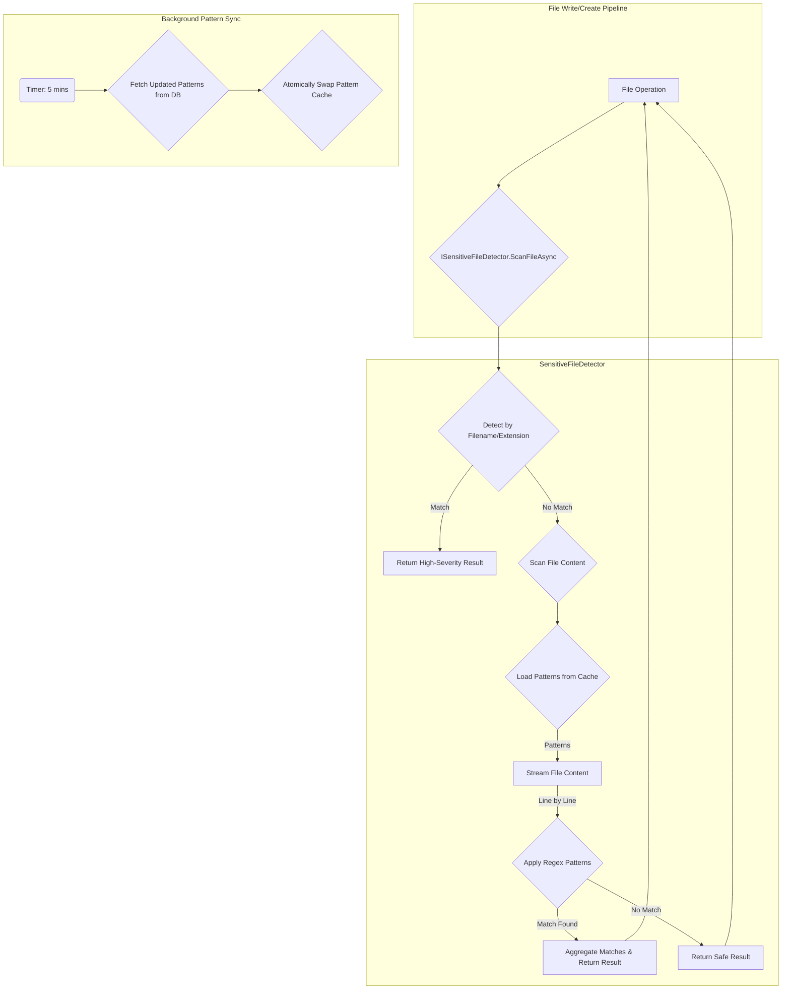

# LCS-DS-v0.18.3b-SEC: Design Specification — Sensitive File Detection

## 1. Document Control

| Field                 | Value                                        |
| :-------------------- | :------------------------------------------- |
| **Document ID**       | LCS-DS-v0.18.3b-SEC                          |
| **Parent SBD**        | LCS-SBD-v0.18.3-SEC                          |
| **Release Version**   | v0.18.3b                                     |
| **Component Name**    | Sensitive File Detection                     |
| **Document Type**     | Design Specification (DS)                    |
| **Author**            | Gemini Architect                             |
| **Created Date**      | 2026-02-04                                   |
| **Last Updated**      | 2026-02-04                                   |
| **Status**            | DRAFT                                        |
| **Classification**    | Internal — Technical Specification           |

---

## 2. Overview

This document provides the detailed design for the **Sensitive File Detection** engine (v0.18.3b). This component is a proactive security measure designed to identify files that may contain sensitive data such as credentials, API keys, private encryption keys, and personally identifiable information (PII). The engine will use a combination of filename analysis, file extension checks, and content-based pattern matching (regex) to flag potentially sensitive files in real-time.

---

## 3. Detailed Design

### 3.1. Objective

To build a high-performance, accurate, and extensible pattern-matching engine that identifies files containing sensitive data. The engine will provide real-time feedback during file operations, support custom patterns, and integrate with the audit and notification systems to alert on policy violations.

### 3.2. Scope

-   **Multi-faceted Detection**: Combine filename-based checks (e.g., `.env`, `id_rsa`), file extension scanning (e.g., `.pem`, `.key`), and regex-based content scanning.
-   **Real-time Scanning**: The engine will be integrated into file operation pipelines to scan files on creation and modification.
-   **Configurable Patterns**: Sensitive data patterns (regex, filenames) will be stored in the database (`sensitive_patterns` table) and can be managed by administrators.
-   **Performance**: Scans must be efficient, especially for large files, to avoid significant overhead on file operations. The target is < 50ms for small files (<1MB).
-   **Low False Positives**: The engine's default patterns will be tuned to minimize false positives, and the severity level of patterns will help prioritize alerts.
-   **Event-driven Notification**: When a sensitive file is detected, a `SensitiveFileAccessEvent` will be published via MediatR to notify other system components.

### 3.3. Detailed Architecture

The Sensitive File Detector will be implemented as a service (`ISensitiveFileDetector`) registered as a singleton. It will cache the sensitive patterns from the database for high-performance matching. For content scanning, it will use a streaming approach to handle large files efficiently without loading the entire file into memory.



#### 3.3.1. Content Scanning Strategy

To avoid high memory usage, the `ScanContentAsync` method will read the file line by line using a `StreamReader`. Each line will be checked against the cached regex patterns. This approach ensures that the memory footprint remains low regardless of the file size. For binary file detection, initial byte sequences (magic bytes) can be checked without reading the whole file.

### 3.4. Data Flow

1.  **Initialization**: The `SensitiveFileDetector` service is instantiated and loads all active patterns from the `sensitive_patterns` table into an in-memory cache. Regex patterns are compiled for performance.
2.  **File Scan Trigger**: A file operation (e.g., `write`, `upload`) triggers a call to `ScanFileAsync`.
3.  **Initial Triage**: The engine first performs quick checks on the filename and extension against high-priority patterns (e.g., `.pem`, `id_rsa`). If a match is found, it can immediately return a high-severity result.
4.  **Content Scan**: If filename checks are inconclusive, the engine proceeds to scan the file's content.
5.  **Pattern Matching**: The content stream is read, and each line is tested against the cached regex patterns.
6.  **Result Aggregation**: If any patterns match, a `SensitiveFileDetectionResult` is created, including details about each match (line number, pattern name, severity).
7.  **Event Publication**: If the file is deemed sensitive, a `SensitiveFileAccessEvent` is published to the MediatR bus. This allows other services (like logging, UI notifications) to react.

### 3.5. Interfaces & Records

The primary interface and its related models are defined in the parent SBD. Here is the C# implementation based on that definition:

```csharp
/// <summary>
/// Detects files containing sensitive data such as credentials,
/// API keys, private encryption keys, and personally identifiable information.
/// </summary>
public interface ISensitiveFileDetector
{
    /// <summary>
    /// Scans a file for sensitive patterns and returns detection results.
    /// </summary>
    /// <param name="filePath">Path to the file to scan.</param>
    /// <param name="context">Security context for the scan.</param>
    /// <param name="cancellationToken">Operation cancellation token.</param>
    /// <returns>A detection result with found patterns and severity.</returns>
    Task<SensitiveFileDetectionResult> ScanFileAsync(
        string filePath,
        SecurityContext context,
        CancellationToken cancellationToken = default);
}

/// <summary>
/// Represents the result of a sensitive file detection scan.
/// </summary>
public record SensitiveFileDetectionResult(
    string FilePath,
    bool IsSensitive,
    SensitivityLevel SensitivityLevel,
    IReadOnlyCollection<PatternMatch> Matches,
    long ScanTimeMs,
    DateTime ScannedAt);

/// <summary>
/// Represents a single pattern match found within a file.
/// </summary>
public record PatternMatch(
    Guid PatternId,
    string PatternName,
    SensitivityLevel Severity,
    int LineNumber,
    int ColumnStart,
    int MatchLength,
    string ContextPreview);

/// <summary>
/// Defines the severity levels for sensitive patterns.
/// </summary>
public enum SensitivityLevel
{
    Low = 1,
    Medium = 2,
    High = 3,
    Critical = 4
}

/// <summary>
/// Represents a sensitive pattern loaded from the database.
/// </summary>
public record SensitivePattern(
    Guid Id,
    string Name,
    string RegexPattern,
    SensitivityLevel Severity,
    string Category,
    IReadOnlyCollection<string> FileExtensions,
    bool IsActive);
```

### 3.6. Error Handling

-   **Large Files**: The streaming approach inherently handles large files. A configurable timeout per scan will prevent runaway operations on exceptionally large or complex files.
-   **Invalid Regex**: Invalid regular expressions in the `sensitive_patterns` table will be logged during the loading phase and skipped.
-   **File Access Errors**: If the engine cannot read a file (e.g., due to permissions), it will log the error and return a result indicating the scan could not be completed. It will not block the file operation itself, but the failure to scan will be audited.

### 3.7. Security Considerations

-   **Regex Denial of Service (ReDoS)**: The regex patterns will be reviewed for potential ReDoS vulnerabilities. The use of timeouts during scanning provides a second layer of defense. Custom patterns added by administrators should be validated.
-   **Information Leakage**: The `ContextPreview` in `PatternMatch` must be handled carefully to avoid logging the sensitive data itself. The preview should be truncated and masked. For example, `api_key="sk_live_...1234"`.
-   **Detector Bypass**: An attacker might try to obfuscate sensitive data. The pattern library should be continuously updated to recognize common obfuscation techniques. The engine is one layer of defense-in-depth, not a silver bullet.

### 3.8. Performance Considerations

-   **Regex Performance**: Inefficient regex patterns can be slow. All default patterns will be optimized and benchmarked.
-   **I/O Bound**: The process is heavily I/O bound. The streaming implementation is designed to mitigate this. Scans will be performed asynchronously to avoid blocking the main application thread.
-   **Cache Hit Rate**: The performance relies on caching the sensitive patterns. The cache should have a high hit rate, with database lookups being infrequent.

### 3.9. Testing Strategy

-   **Unit Tests**:
    -   Test the regex matching logic with a variety of sensitive and non-sensitive strings.
    -   Verify that filename-based detection works correctly.
    -   Test the streaming scanner with files of various sizes.
    -   Test the pattern loading and caching mechanism.
    -   Ensure the `ContextPreview` masks sensitive data correctly.
-   **Integration Tests**:
    -   Test the full flow: a file is written, the detector is invoked, and a MediatR event is published.
    -   Verify that patterns from a test database are correctly loaded and applied.
-   **Performance Tests**:
    -   Benchmark the scan time for files of different sizes (1KB, 1MB, 100MB).
    -   Measure the false positive rate against a large corpus of legitimate code and text files.
    -   The target is to detect >99% of common credential patterns from a test set.

---

## 4. Key Artifacts & Deliverables

| Artifact                  | Description                                                              |
| :------------------------ | :----------------------------------------------------------------------- |
| `ISensitiveFileDetector`  | The main service interface for scanning files.                           |
| `SensitiveFileDetector`   | The default singleton implementation of the service.                     |
| `SensitiveFileDetectionResult` | Record representing the outcome of a scan.                           |
| `PatternMatch`            | Record detailing a specific pattern match within a file.                 |
| `SensitivePattern`        | Record for a pattern loaded from the database.                           |
| `SensitivePatternRepository` | A repository for managing `sensitive_patterns` in the database.        |
| Database Migration        | SQL script to create the `sensitive_patterns` table.                     |
| MediatR Event             | `SensitiveFileAccessEvent` to be published on detection.                 |

---

## 5. Acceptance Criteria

- [ ] The engine correctly detects at least 99% of common credential patterns (AWS keys, API keys, etc.) from a predefined test set.
- [ ] The engine correctly identifies private key files (RSA, EC) based on their content headers.
- [ ] Sensitive file scans for files under 1MB complete in under 50ms.
- [ ] Custom pattern rules can be added to the database and are used by the engine without a restart.
- [ ] The measured false positive rate on a large corpus of non-sensitive files is below 2%.
- [ ] A `SensitiveFileAccessEvent` is correctly published via MediatR when a sensitive file is detected.
- [ ] Unit test coverage for the detection logic exceeds 95%.

---

## 6. Dependencies & Integration Points

-   **`Lexichord.Infrastructure`**: For the `SensitivePatternRepository` and database access.
-   **`IFileAccessAuditor`**: Detection results will be logged to the audit trail.
-   **MediatR**: Used for publishing `SensitiveFileAccessEvent` notifications.
-   **File Operation Pipeline**: The detector must be called from within the pipelines that handle file creation and updates.
-   **`Path Restriction Engine (v0.18.3a)`**: This engine runs before the file detector.
-   **UI**: The UI will need to be ableto handle and display warnings based on the `SensitiveFileAccessEvent`.
