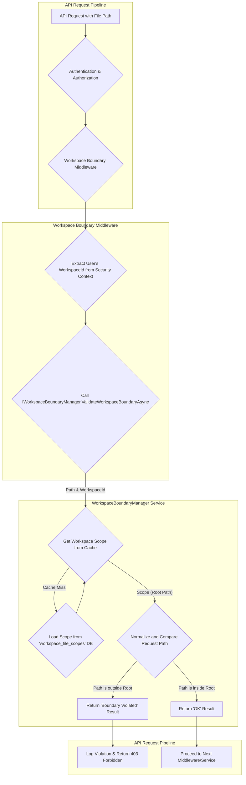

# LCS-DS-v0.18.3e-SEC: Design Specification — Workspace Boundaries

## 1. Document Control

| Field                 | Value                                        |
| :-------------------- | :------------------------------------------- |
| **Document ID**       | LCS-DS-v0.18.3e-SEC                          |
| **Parent SBD**        | LCS-SBD-v0.18.3-SEC                          |
| **Release Version**   | v0.18.3e                                     |
| **Component Name**    | Workspace Boundaries                         |
| **Document Type**     | Design Specification (DS)                    |
| **Author**            | Gemini Architect                             |
| **Created Date**      | 2026-02-04                                   |
| **Last Updated**      | 2026-02-04                                   |
| **Status**            | DRAFT                                        |
| **Classification**    | Internal — Technical Specification           |

---

## 2. Overview

This document provides the detailed design for the **Workspace Boundaries** enforcement system (v0.18.3e). This system is a core pillar of Lexichord's multi-tenancy and security model. It ensures that all file system operations initiated by a user are strictly confined within the boundaries of their currently active workspace. This prevents data leakage between workspaces, enforces workspace-specific policies (like quotas and file type restrictions), and provides a foundational layer for logical data isolation.

---

## 3. Detailed Design

### 3.1. Objective

To enforce strict logical and physical workspace boundaries for all file system operations, preventing any unauthorized cross-workspace file access. This system will ensure data isolation, support workspace-scoped permissions, and provide a secure foundation for multi-tenancy.

### 3.2. Scope

-   **Workspace Root Path**: Each workspace will be associated with a root directory. All file operations must occur within this directory tree.
-   **Path Validation**: The system will validate that every file path provided in an operation is a legitimate child of the user's current workspace root.
-   **Cross-Workspace Denial**: Any attempt to access a file outside the current workspace's boundary using relative paths (`../`), absolute paths, or other means will be blocked.
-   **Middleware Integration**: The boundary check will be implemented as a middleware or a decorator that can be applied to all file-handling API endpoints and services.
-   **Multi-tenancy Support**: The design will ensure strict data isolation, a prerequisite for secure multi-tenancy.

### 3.3. Detailed Architecture

The `IWorkspaceBoundaryManager` service will be responsible for validating paths against workspace boundaries. This service will work in close coordination with the `IPathRestrictionEngine` but will focus specifically on workspace isolation. Each workspace's root path and other file-related settings will be stored in the `workspace_file_scopes` table and cached for performance.



#### 3.3.1. Implementation Strategy

The most effective way to enforce this is at the request pipeline level. An ASP.NET Core middleware can be created to intercept all incoming API calls. For endpoints that are marked as performing file operations, this middleware will:
1.  Extract the user's `workspaceId` from their claims or security context.
2.  Extract the file path(s) from the request body, query string, or route.
3.  Invoke the `IWorkspaceBoundaryManager` to validate each path.
4.  If validation fails, the middleware short-circuits the request and returns a `403 Forbidden` response.

### 3.4. Data Flow

1.  **API Request**: A user makes an API call to, for example, read a file: `GET /api/files/read?path=/data/document.txt`.
2.  **Middleware Interception**: The `WorkspaceBoundaryMiddleware` intercepts the request.
3.  **Context Retrieval**: It retrieves the user's `workspaceId` (e.g., `ws-123`) from the `HttpContext`.
4.  **Boundary Validation**: It calls `IWorkspaceBoundaryManager.ValidateWorkspaceBoundaryAsync("/data/document.txt", "ws-123")`.
5.  **Scope Lookup**: The manager service looks up the scope for `ws-123` in its cache. Let's say the root path is `/workspaces/ws-123/`.
6.  **Path Resolution**: The service resolves the full, canonical path: `/workspaces/ws-123/data/document.txt`.
7.  **Comparison**: It verifies that this resolved path starts with the workspace root path.
8.  **Result**: Since the path is valid, the manager returns a success result. The middleware then passes the request to the next stage in the pipeline.
9.  **Violation Scenario**: If the request was for `GET /api/files/read?path=../ws-456/secret.txt`, the resolved path might be `/workspaces/ws-456/secret.txt`, which does not start with the user's workspace root `/workspaces/ws-123/`. The validation would fail, and the middleware would return a `403 Forbidden`.

### 3.5. Interfaces & Records

The primary interface and its related models are defined in the parent SBD. Here is the C# implementation based on that definition:

```csharp
/// <summary>
/// Enforces logical and physical boundaries between workspaces
/// to ensure data isolation and prevent cross-workspace access.
/// </summary>
public interface IWorkspaceBoundaryManager
{
    /// <summary>
    /// Validates that a file path is within the specified workspace's boundaries.
    /// </summary>
    /// <param name="filePath">The file path to validate.</param>
    /// <param name="workspaceId">The workspace identifier.</param>
    /// <param name="cancellationToken">Operation cancellation token.</param>
    /// <returns>A result indicating if the path is within the boundary.</returns>
    Task<BoundaryValidationResult> ValidateWorkspaceBoundaryAsync(
        string filePath,
        Guid workspaceId,
        CancellationToken cancellationToken = default);
}

/// <summary>
/// Represents the result of a workspace boundary validation.
/// </summary>
public record BoundaryValidationResult(
    bool IsWithinBoundary,
    string? ReasonIfDenied);

/// <summary>
/// Defines the file system scope and settings for a workspace.
/// </summary>
public record WorkspaceFileScope(
    Guid WorkspaceId,
    string RootPath,
    long MaxWorkspaceSizeBytes,
    long CurrentUsageBytes);
```

### 3.6. Error Handling

-   **Unconfigured Workspace**: If a workspace does not have a `WorkspaceFileScope` defined in the database, all file operations for that workspace will be denied by default (fail-closed).
-   **Path Ambiguity**: The service must be robust in normalizing paths to prevent any ambiguity that could lead to a bypass. All paths will be converted to absolute, canonical paths before comparison.

### 3.7. Security Considerations

-   **Primary Line of Defense**: This system is the most important defense for multi-tenant data isolation. Its logic must be flawless and applied universally.
-   **Path Traversal**: The path normalization and canonicalization step is critical to prevent all forms of path traversal attacks (`../`, symlinks, alternate character encodings).
-   **Configuration Security**: The `workspace_file_scopes` table, which defines the root paths, is security-critical. Database permissions must prevent unauthorized modification of these paths.

### 3.8. Performance Considerations

-   **Middleware Overhead**: The middleware adds a small amount of overhead to each relevant API request. This should be negligible as it primarily involves a cache lookup and string manipulation.
-   **Cache Performance**: The performance relies on caching `WorkspaceFileScope` objects. Since these change infrequently, a long cache duration is acceptable. The target validation time is < 1ms.

### 3.9. Testing Strategy

-   **Unit Tests**:
    -   Test the path validation logic with a wide variety of valid and invalid paths.
    -   Test all known path traversal and canonicalization bypass techniques.
    -   Test the logic for a path that is exactly the root path.
    -   Test paths with different casing and separators (`/`, `\`).
-   **Integration Tests**:
    -   Test the `WorkspaceBoundaryMiddleware` end-to-end. Make API calls with valid and invalid paths and assert that the middleware correctly allows or denies the request with the proper HTTP status code.
    -   Test that changes to a workspace's root path in the database are correctly reflected after the cache expires.

---

## 4. Key Artifacts & Deliverables

| Artifact                  | Description                                                              |
| :------------------------ | :----------------------------------------------------------------------- |
| `IWorkspaceBoundaryManager`| The main service interface for workspace path validation.                |
| `WorkspaceBoundaryManager`| The default implementation of the service.                               |
| `WorkspaceFileScope`      | Record representing the file settings for a workspace.                   |
| `WorkspaceBoundaryMiddleware`| An ASP.NET Core middleware to enforce boundaries at the request level. |
| Database Migration        | SQL script to create the `workspace_file_scopes` table.                  |

---

## 5. Acceptance Criteria

- [ ] Any API call attempting to access a file path outside the user's active workspace is blocked with a `403 Forbidden` response.
- [ ] Path traversal attacks (`../`, etc.) are successfully prevented.
- [ ] The validation logic correctly handles absolute and relative paths, normalizing them against the workspace root.
- [ ] Workspace-scoped file operations are correctly audited with the workspace context.
- [ ] Admin roles with legitimate cross-workspace permissions can bypass the restriction where necessary (this will be handled by a separate permission check, not by disabling the boundary).
- [ ] The performance overhead of the validation middleware is less than 1ms per request under benchmark conditions.

---

## 6. Dependencies & Integration Points

-   **ASP.NET Core Pipeline**: The `WorkspaceBoundaryMiddleware` will be a key component in the request processing pipeline.
-   **`IPathRestrictionEngine (v0.18.3a)`**: This system complements the Path Restriction Engine. The Boundary Manager confirms the path is within the workspace, and the Path Restriction Engine can then apply finer-grained rules within that workspace.
-   **Security Context**: Relies on a robust mechanism for identifying the user and their active `workspaceId` for every request.
-   **PostgreSQL Database**: For storing the `workspace_file_scopes` table.
