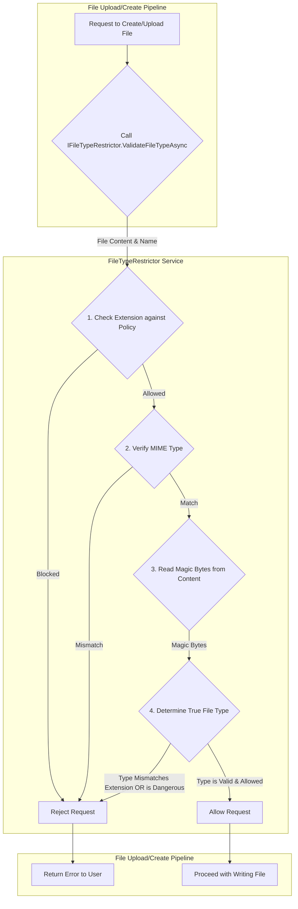

# LCS-DS-v0.18.3g-SEC: Design Specification — File Type Restrictions

## 1. Document Control

| Field                 | Value                                        |
| :-------------------- | :------------------------------------------- |
| **Document ID**       | LCS-DS-v0.18.3g-SEC                          |
| **Parent SBD**        | LCS-SBD-v0.18.3-SEC                          |
| **Release Version**   | v0.18.3g                                     |
| **Component Name**    | File Type Restrictions                       |
| **Document Type**     | Design Specification (DS)                    |
| **Author**            | Gemini Architect                             |
| **Created Date**      | 2026-02-04                                   |
| **Last Updated**      | 2026-02-04                                   |
| **Status**            | DRAFT                                        |
| **Classification**    | Internal — Technical Specification           |

---

## 2. Overview

This document provides the detailed design for the **File Type Restrictions** system (v0.18.3g). This is a preventative security control designed to mitigate risks associated with dangerous or unwanted file types. The system validates files upon upload or creation, using a multi-layered approach that includes checking file extensions, MIME types, and file content (magic bytes). This prevents users from uploading executable files, scripts, or other potentially malicious content, and allows administrators to enforce workspace-specific policies.

---

## 3. Detailed Design

### 3.1. Objective

To implement a robust file type validation system that prevents the upload, creation, and execution of dangerous or prohibited file types. The system will be fast, reliable, difficult to bypass, and configurable on a per-workspace basis.

### 3.2. Scope

-   **Multi-Layered Validation**:
    1.  **File Extension Check**: A quick check against a configurable blacklist/whitelist of extensions (e.g., block `.exe`, `.bat`).
    2.  **MIME Type Check**: Validate the `Content-Type` header provided during upload against the file's name and content.
    3.  **Magic Byte Verification**: Read the first few bytes of the file content to determine its true file type, preventing spoofing where a user renames `malware.exe` to `safe.txt`.
-   **Dangerous File Detection**: Specifically identify and block file types that pose a security risk, such as executables, shell scripts, and archive bombs.
-   **Configurable Policies**: File type policies (allowed/blocked lists, size limits) will be configurable for each workspace and stored in the database.
-   **User Feedback**: Provide clear, immediate feedback to the user when a file is rejected.

### 3.3. Detailed Architecture

The `IFileTypeRestrictor` service will be the central component for validation. It will be integrated into the file upload/creation pipeline, and will be called before the file is written to its final destination. The service will use a combination of configured policies and known "dangerous" patterns to make a decision.



#### 3.3.1. Magic Byte Detection

The service will contain a dictionary mapping known magic byte sequences to file types. For example:
-   `89 50 4E 47` -> `image/png`
-   `4D 5A` -> `application/x-dosexec` (Windows PE file, e.g., .exe)
-   `7F 45 4C 46` -> `application/x-elf` (Linux executable)
When validating a file, the service will read the first few bytes and compare them against this dictionary to authoritatively identify the file type, regardless of its name or reported MIME type.

### 3.4. Data Flow

1.  **Validation Trigger**: A user uploads a file. The API endpoint handling the upload calls `IFileTypeRestrictor.ValidateFileTypeAsync`, passing the file's name, its content as a stream or byte array, and the user-provided MIME type.
2.  **Policy Retrieval**: The service retrieves the `FileTypePolicy` for the user's current workspace from a cache or the database.
3.  **Extension Check**: The file's extension is checked against the policy's whitelist and blacklist. If it's explicitly blocked, the validation fails immediately.
4.  **Magic Byte Analysis**: The service reads the initial bytes of the file content and uses its internal dictionary to determine the true file type.
5.  **Consistency Check**: It checks if the detected true type is consistent with the file extension. For example, if the file is `image.jpg` but the magic bytes identify it as an executable, the validation fails.
6.  **Dangerous Type Check**: The detected true type is checked against an internal list of dangerous types (executables, scripts, etc.). If it's a dangerous type and the policy doesn't explicitly allow it, the validation fails.
7.  **Result**: If all checks pass, the service returns a success result, and the pipeline proceeds to save the file. If any check fails, it returns a failure result with a clear reason, and the pipeline aborts the operation.

### 3.5. Interfaces & Records

The primary interface and its related models are defined in the parent SBD. Here is the C# implementation based on that definition:

```csharp
/// <summary>
/// Validates and restricts file types to prevent the upload and execution
/// of dangerous or prohibited files within the application.
/// </summary>
public interface IFileTypeRestrictor
{
    /// <summary>
    /// Validates a file's type based on its extension, MIME type, and magic bytes.
    /// </summary>
    /// <param name="fileName">The name of the file.</param>
    /// <param name="contentStream">A stream of the file's content.</param>
    /// <param name="workspaceId">The workspace for which to look up the policy.</param>
    /// <param name="cancellationToken">Operation cancellation token.</param>
    /// <returns>A result indicating if the file type is allowed.</returns>
    Task<FileTypeValidationResult> ValidateFileTypeAsync(
        string fileName,
        Stream contentStream,
        Guid workspaceId,
        CancellationToken cancellationToken = default);
}

/// <summary>
/// Represents the result of a file type validation.
/// </summary>
public record FileTypeValidationResult(
    bool IsAllowed,
    bool IsDangerous,
    string? DetectedMimeType,
    string? DenialReason,
    FileTypeRisk RiskLevel);

/// <summary>
/// Defines the risk level associated with a file type.
/// </summary>
public enum FileTypeRisk
{
    Safe,
    Warning,
    Dangerous,
    Forbidden
}

/// <summary>
/// Defines the file type policy for a workspace.
/// </summary>
public record FileTypePolicy(
    Guid WorkspaceId,
    IReadOnlyCollection<string> AllowedExtensions,
    IReadOnlyCollection<string> BlockedExtensions,
    long MaxFileSizeBytes,
    bool AllowExecutables);
```

### 3.6. Error Handling

-   **Unknown File Types**: If the magic bytes do not match any known signature, the system can be configured to either allow the file (defaulting to trust the extension) or deny it (defaulting to a security-first posture). The default behavior will be to deny unknown types.
-   **Encrypted/Compressed Files**: The magic byte analysis may not work for content inside encrypted archives (e.g., password-protected ZIPs). These will be flagged, and a policy can decide whether to allow or block them.

### 3.7. Security Considerations

-   **Bypass Attempts**: This system is specifically designed to prevent bypasses that rely on simply renaming a file. The reliance on magic bytes is key.
-   **Archive Bombs**: While not part of the core file type restriction, this service is the logical place to add validation for archives (e.g., ZIP files), checking for high compression ratios or an excessive number of files, which are indicators of a zip bomb. This is noted as a future enhancement.
-   **Policy Management**: The ability to define file type policies is powerful. Access to this configuration must be restricted to administrators.

### 3.8. Performance Considerations

-   **Low Overhead**: The validation process is very fast. It only needs to read the first few bytes of the file, not the entire content. The overhead on file uploads should be minimal (< 5ms).
-   **Policy Caching**: Workspace file type policies will be cached in memory to avoid repeated database lookups for every file upload.

### 3.9. Testing Strategy

-   **Unit Tests**:
    -   Test the magic byte detection with a comprehensive library of file headers for common safe and dangerous file types.
    -   Test the logic with a file whose extension is spoofed (e.g., an EXE renamed to .txt).
    -   Test the policy enforcement logic (whitelist/blacklist).
-   **Integration Tests**:
    -   Test the end-to-end file upload pipeline. Attempt to upload various allowed and blocked file types and assert that the API responds correctly.
    -   Test that updating a policy in the database is correctly reflected in the validation logic after a cache refresh.

---

## 4. Key Artifacts & Deliverables

| Artifact                  | Description                                                              |
| :------------------------ | :----------------------------------------------------------------------- |
| `IFileTypeRestrictor`     | The main service interface for file type validation.                     |
| `FileTypeRestrictor`      | The default implementation with magic byte detection.                    |
| `FileTypeValidationResult`| A record representing the outcome of the validation.                     |
| `FileTypePolicy`          | A record representing a workspace's file type policy.                    |
| Policy Repository         | A repository for managing file type policies in the database.            |
| UI for Policy Management  | An admin UI for configuring file type policies per workspace.            |

---

## 5. Acceptance Criteria

- [ ] The system successfully blocks the upload of executable files (`.exe`, `.bat`, `.sh`) even if they are renamed to a safe extension like `.txt`.
- [ ] The system correctly identifies common file types (PNG, JPG, PDF, DOCX) by their magic bytes.
- [ ] MIME type is validated against file extension and magic bytes.
- [ ] Workspace-specific file type policies are correctly retrieved and enforced.
- [ ] A clear error message is returned to the user when a file upload is rejected.
- [ ] The validation process adds less than 5ms of latency to a file upload operation under benchmark conditions.

---

## 6. Dependencies & Integration Points

-   **File Upload Pipeline**: This service must be a mandatory step in any process that introduces new files into the system.
-   **`WorkspaceBoundaryManager (v0.18.3e)`**: Policies are workspace-specific, so this service will need the workspace context.
-   **PostgreSQL Database**: To store workspace-specific `FileTypePolicy` configurations.
-   **UI Framework**: To provide an interface for administrators to manage these policies.
