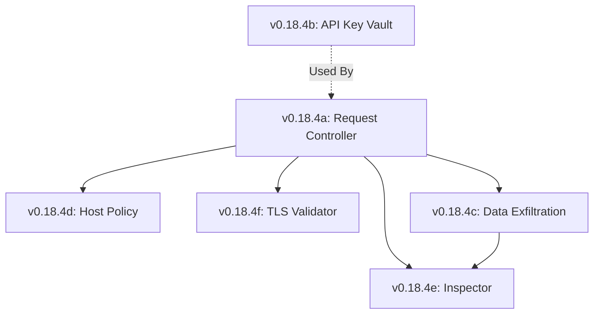

# Lexichord Design Specification Index: v0.18.4 — Network & API Security

**Parent Scope:** [LCS-SBD-v0.18.4-SEC.md](./LCS-SBD-v0.18.4-SEC.md)
**Module:** Network & API Security
**Status:** Design Phase Complete
**Last Updated:** 2026-02-04

---

## Overview

This index catalogs all design specifications for the v0.18.4 Network & API Security module. This release implements critical protections against unauthorized data exfiltration, API key compromise, and malicious network communications through a defense-in-depth architecture.

---

## Design Specification Documents

| Sub-Version | Document | Feature Name | Status |
|-------------|----------|--------------|--------|
| v0.18.4a | [LCS-DS-v0.18.4a-SEC.md](./LCS-DS-v0.18.4a-SEC.md) | Outbound Request Controls | Complete |
| v0.18.4b | [LCS-DS-v0.18.4b-SEC.md](./LCS-DS-v0.18.4b-SEC.md) | API Key Vault & Protection | Complete |
| v0.18.4c | [LCS-DS-v0.18.4c-SEC.md](./LCS-DS-v0.18.4c-SEC.md) | Data Exfiltration Prevention | Complete |
| v0.18.4d | [LCS-DS-v0.18.4d-SEC.md](./LCS-DS-v0.18.4d-SEC.md) | Host Allowlist/Blocklist | Complete |
| v0.18.4e | [LCS-DS-v0.18.4e-SEC.md](./LCS-DS-v0.18.4e-SEC.md) | Request Inspection & Logging | Complete |
| v0.18.4f | [LCS-DS-v0.18.4f-SEC.md](./LCS-DS-v0.18.4f-SEC.md) | Certificate & TLS Validation | Complete |

---

## Dependency Graph

---

## Interfaces & Logic Summary

| Interface | Component | Responsibility |
|-----------|-----------|----------------|
| `IOutboundRequestController` | v0.18.4a | Central gateway for all egress |
| `IApiKeyVault` | v0.18.4b | Encrypts secrets at rest |
| `IDataExfiltrationGuard` | v0.18.4c | Scans payloads for API keys |
| `IHostPolicyManager` | v0.18.4d | DNS/IP blocking rules |
| `IRequestInspector` | v0.18.4e | Audits HTTP traffic |
| `ICertificateValidator` | v0.18.4f | Pins certs, checks CRLs |

---

## Implementation Order

1.  **Phase 1 (Foundation):** v0.18.4a (Controller) → v0.18.4b (Vault)
2.  **Phase 2 (Control):** v0.18.4d (Host Policy) → v0.18.4f (TLS)
3.  **Phase 3 (Detection):** v0.18.4c (DLP)
4.  **Phase 4 (Observability):** v0.18.4e (Inspection)

---

## Success Metrics

| Metric | Target |
|--------|--------|
| Egress Latency | <10ms overhead |
| Key Exposure | 0 keys in plain text |
| DLP Scan Speed | <5ms for 100KB payload |
| TLS Validation | 100% Man-in-the-Middle block rate |
