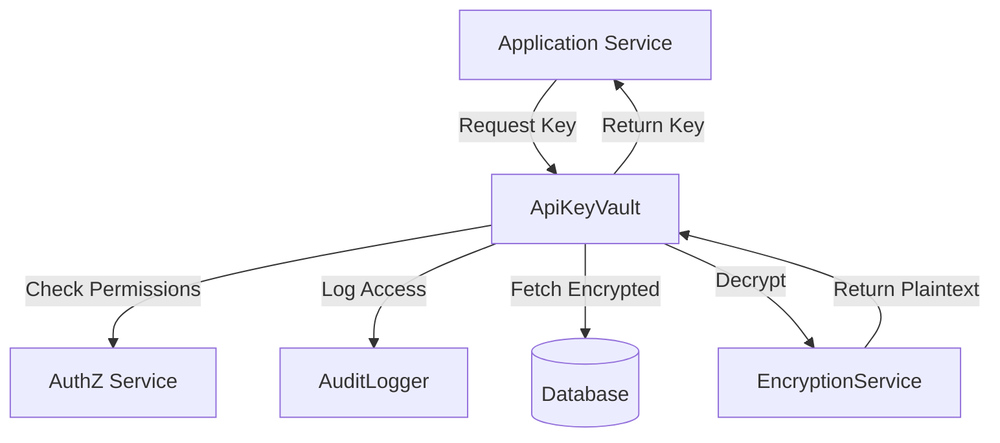

# LCS-DS-v0.18.4b-SEC: Design Specification — API Key Vault & Protection

## 1. Document Control

| Field                 | Value                                        |
| :-------------------- | :------------------------------------------- |
| **Document ID**       | LCS-DS-v0.18.4b-SEC                          |
| **Parent SBD**        | LCS-SBD-v0.18.4-SEC                          |
| **Release Version**   | v0.18.4b                                     |
| **Component Name**    | API Key Vault & Protection                   |
| **Document Type**     | Design Specification (DS)                    |
| **Author**            | Gemini Architect                             |
| **Created Date**      | 2026-02-04                                   |
| **Last Updated**      | 2026-02-04                                   |
| **Status**            | DRAFT                                        |
| **Classification**    | Internal — Technical Specification           |

---

## 2. Overview

This document provides the detailed design for the **API Key Vault & Protection** system (v0.18.4b). This component is responsible for the secure lifecycle management of authentication credentials used by Lexichord to access external services. It ensures that keys are encrypted at rest, strictly controlled during access, and comprehensively audited to preventing credential leakage.

---

## 3. Detailed Design

### 3.1. Objective

Implement a secure vault for storing API keys and secrets that prevents unauthorized access and accidental exposure (e.g., in logs), while providing low-latency retrieval for authorized services.

### 3.2. Scope

-   Define `IApiKeyVault` interface.
-   Implement AES-256-GCM encryption for storage.
-   Implement Key Rotation logic.
-   Ensure audit logging of all key access (retrieval, storage, deletion).
-   Provide key masking utilities for safe logging.

### 3.3. Detailed Architecture

The Vault is a service layer between the application and the persistence layer.



#### 3.3.1. Encryption Strategy

-   **Algorithm**: AES-256-GCM (Galois/Counter Mode) for authenticated encryption.
-   **Key Derivation**: Master key derived from a secure configuration source (Env Var / Key Management Service) using PBKDF2 or Argon2.
-   **Storage**: Database stores `(KeyID, EncryptedData, IV/Nonce, AuthTag, Metadata)`.
-   **Rotation**: Support re-encrypting all keys with a new Master Key.

### 3.4. Interfaces & Data Models

```csharp
/// <summary>
/// Manages secure storage, retrieval, and lifecycle of API keys and secrets.
/// </summary>
public interface IApiKeyVault
{
    /// <summary>
    /// Stores an API key in the vault with encryption.
    /// </summary>
    Task<ApiKeyStorageResult> StoreKeyAsync(string keyIdentifier, string secretValue, ApiKeyMetadata metadata, CancellationToken ct = default);

    /// <summary>
    /// Retrieves an API key from the vault with decryption.
    /// Access is logged.
    /// </summary>
    Task<string> RetrieveKeyAsync(string keyIdentifier, CancellationToken ct = default);

    /// <summary>
    /// Rotates an API key to a new value.
    /// </summary>
    Task<ApiKeyRotationResult> RotateKeyAsync(string keyIdentifier, string newSecretValue, string reason, CancellationToken ct = default);

    /// <summary>
    /// Mask a key for logging (e.g., "sk_live_...a1b2").
    /// </summary>
    string MaskKey(string secretValue);
}

public record ApiKeyMetadata(
    string Type, // "AWS", "OpenAI", etc.
    string Owner,
    DateTime? ExpiresAt,
    IReadOnlyDictionary<string, string> Tags);

public record ApiKeyStorageResult(bool Success, string KeyIdentifier, DateTime StoredAt);
```

### 3.5. Security Considerations

-   **Master Key Protection**: The KEK (Key Encryption Key) must be injected securely (e.g., via Kubernetes Secrets or AWS KMS) and never committed to source code.
-   **Memory Safety**: Secret strings should be kept in memory for the shortest time possible. Use `SecureString` or pinned memory arrays where feasible/supported in .NET Core (though string immutability makes `String` hard to scrub).

### 3.6. Performance Considerations

-   **Caching**: Decrypted keys can be cached in memory (encrypted or protected) for short durations to avoid repeated DB hits/decryption costs on hot paths.
    -   *Risk*: Memory dumps could expose keys.
    -   *Decision*: Cache encrypted blob, decrypt on demand, OR use a very short TTL (1-5 min) for plaintext cache.

### 3.7. Testing Strategy

-   **Crypto Correctness**: Verify that data encrypted with the service can be verified/decrypted.
-   **Rotation**: Verify looking up a key after rotation returns the new value.
-   **Audit**: Verify a log entry is created for every `RetrieveKeyAsync`.

---

## 4. Key Artifacts & Deliverables

| Artifact                 | Description                                                              |
| :----------------------- | :----------------------------------------------------------------------- |
| `IApiKeyVault`           | Interface definition.                                                    |
| `AesEncryptionService`   | Implementation of encryption logic.                                      |
| `AuditDecorator`         | Decorator for logging access.                                            |

---

## 5. Acceptance Criteria

-   [ ] **Encryption**: Keys are stored as ciphertext in the DB.
-   [ ] **Access Control**: Only authorized services can retrieve keys.
-   [ ] **Audit**: Retrieval generates an audit log.
-   [ ] **Rotation**: Old keys are invalidated and replaced seamlessly.
