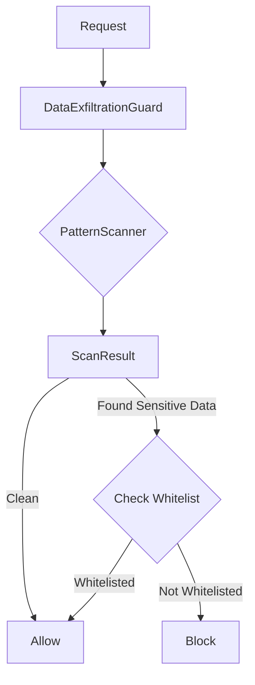

# LCS-DS-v0.18.4c-SEC: Design Specification — Data Exfiltration Prevention

## 1. Document Control

| Field                 | Value                                        |
| :-------------------- | :------------------------------------------- |
| **Document ID**       | LCS-DS-v0.18.4c-SEC                          |
| **Parent SBD**        | LCS-SBD-v0.18.4-SEC                          |
| **Release Version**   | v0.18.4c                                     |
| **Component Name**    | Data Exfiltration Prevention                 |
| **Document Type**     | Design Specification (DS)                    |
| **Author**            | Gemini Architect                             |
| **Created Date**      | 2026-02-04                                   |
| **Last Updated**      | 2026-02-04                                   |
| **Status**            | DRAFT                                        |
| **Classification**    | Internal — Technical Specification           |

---

## 2. Overview

This document provides the detailed design for the **Data Exfiltration Prevention** system (v0.18.4c). This component safeguards against the unauthorized transmission of sensitive data (PII, credentials, proprietary secrets) to external destinations. It inspects the payloads of outbound requests and blocks those that contain recognizable sensitive patterns.

---

## 3. Detailed Design

### 3.1. Objective

Detect and block outbound HTTP requests that contain sensitive information in their headers or bodies, preventing accidental or malicious data leaks.

### 3.2. Scope

-   Define `IDataExfiltrationGuard` interface.
-   Implement scanning engine for:
    -   **Credentials**: API Keys (AWS, Stripe, etc.), Private Keys.
    -   **PII**: Emails, SSNs, Credit Card numbers.
-   Support whitelisting (e.g., allow sending a Stripe Key to `api.stripe.com`).
-   Optimize for low latency (<5ms for typical payloads).

### 3.3. Detailed Architecture

The Guard is invoked by the `OutboundRequestController` *after* host policy checks (since those are cheaper) but *before* the request leaves the network.



#### 3.3.1. Scanning Strategy

-   **Algorithm**: Use **Aho-Corasick** or optimized **Regex Set** matching for high-performance multi-pattern search.
-   **Scope**: Scan `Headers` and `Body` (if text/json). Binary bodies may be skipped or sampled.
-   **Limits**: Enforce a scan limit (e.g., first 512KB) to prevent DoS via massive payloads.

### 3.4. Interfaces & Data Models

```csharp
/// <summary>
/// Detects and prevents data exfiltration.
/// </summary>
public interface IDataExfiltrationGuard
{
    Task<ExfiltrationAnalysisResult> AnalyzeRequestAsync(OutboundRequest request, CancellationToken ct = default);

    Task RegisterPatternAsync(string pattern, string type, SensitivityLevel severity, CancellationToken ct = default);

    Task RegisterWhitelistAsync(string patternType, string destinationHost, CancellationToken ct = default);
}

public record ExfiltrationAnalysisResult
{
    public bool ContainsSensitiveData { get; init; }
    public bool IsBlocked { get; init; }
    public IReadOnlyList<DetectedSensitiveData> Detections { get; init; }
}

public record DetectedSensitiveData(
    string Type, // "AWS_KEY", "CREDIT_CARD"
    string Snippet, // Redacted snippet
    SensitivityLevel Severity);
```

### 3.5. Security Considerations

-   **False Positives**: Strict blocking can break legitimate flows.
    -   *Mitigation*: Implement "Report Only" mode for new rules. Use Destination-based whitelisting (e.g., "Allow API_KEY if destination is api.provider.com").
-   **Evasion**: Attackers can encode data (Base64, Hex) to bypass regex.
    -   *Mitigation*: The scanner will include decoders for common formats (Base64, URL-encoding) before scanning.

### 3.6. Performance Considerations

-   **Regex ReDoS**: Avoid user-submitted regexes from untrusted sources. Use a bounded-time regex engine (.NET generated regex with timeout).
-   **Throughput**: Heavy scanning can throttle throughput. Simple string searching (e.g., `IndexOf`) should be preferred for fixed strings over regex.

### 3.7. Testing Strategy

-   **Corpus**: Use a dataset of fake PII and keys to verify detection.
-   **Fuzzing**: Test with random binary data to ensure scanner doesn't crash or hang.
-   **Whitelist**: Verify that sending credentials to their *owner* (e.g., GitHub token to github.com) is allowed if whitelisted.

---

## 4. Key Artifacts & Deliverables

| Artifact                 | Description                                                              |
| :----------------------- | :----------------------------------------------------------------------- |
| `IDataExfiltrationGuard` | Core interface.                                                          |
| `PatternScanner`         | Engine for identifying sensitive data.                                   |
| `DlpRules`               | Default set of rules (AWS, Azure, Stripe patterns).                      |

---

## 5. Acceptance Criteria

-   [ ] **Detection**: Standard API Keys and PII are detected in request bodies.
-   [ ] **Blocking**: Requests containing sensitive data are blocked (unless whitelisted).
-   [ ] **Whitelisting**: Specific destinations can be exempted for specific data types.
-   [ ] **Performance**: Scanning adds <5ms latency for 100KB payload.
