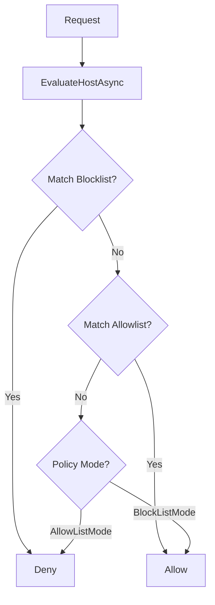

# LCS-DS-v0.18.4d-SEC: Design Specification — Host Allowlist/Blocklist

## 1. Document Control

| Field                 | Value                                        |
| :-------------------- | :------------------------------------------- |
| **Document ID**       | LCS-DS-v0.18.4d-SEC                          |
| **Parent SBD**        | LCS-SBD-v0.18.4-SEC                          |
| **Release Version**   | v0.18.4d                                     |
| **Component Name**    | Host Allowlist/Blocklist                     |
| **Document Type**     | Design Specification (DS)                    |
| **Author**            | Gemini Architect                             |
| **Created Date**      | 2026-02-04                                   |
| **Last Updated**      | 2026-02-04                                   |
| **Status**            | DRAFT                                        |
| **Classification**    | Internal — Technical Specification           |

---

## 2. Overview

This document provides the detailed design for the **Host Allowlist/Blocklist** system (v0.18.4d). This component enforces network boundaries by restricting which external hosts the application can communicate with. It supports both a "Default Deny" (Allowlist) model for high-security environments and a "Default Allow" (Blocklist) model for more open environments.

---

## 3. Detailed Design

### 3.1. Objective

Prevent the application from communicating with malicious, unauthorized, or irrelevant external servers by enforcing granular host-based policies.

### 3.2. Scope

-   Define `IHostPolicyManager`.
-   Support matching for:
    -   Exact Hostnames (`api.stripe.com`)
    -   Wildcards (`*.google.com`)
    -   CIDR Ranges (`192.168.1.0/24`) - requires DNS resolution.
-   Implement dynamic policy updates (no restart required).
-   Provide audit logging for policy decisions.

### 3.3. Detailed Architecture

The Policy Manager is consulted by the `OutboundRequestController` at the very beginning of the pipeline.



#### 3.3.1. Matching Logic

-   **Hostname**: Case-insensitive comparison.
-   **Wildcard**: Support `*` usage (e.g., `*.example.com`).
-   **CIDR**: If the rule is an IP range, the system *must not* perform DNS resolution during specific request evaluation to avoid latency/timeout issues, UNLESS the request destination is an IP.
    -   *Note*: Resolving every hostname to check against CIDR blocklists is slow and poses privacy/security risks. CIDR rules typically apply only when the destination is explicitly an IP address.

### 3.4. Interfaces & Data Models

```csharp
/// <summary>
/// Manages policies for permitted network destinations.
/// </summary>
public interface IHostPolicyManager
{
    Task<HostPolicyEvaluationResult> EvaluateHostAsync(string hostname, CancellationToken ct = default);

    Task AddRuleAsync(HostPolicyRule rule, CancellationToken ct = default);
    
    Task SetModeAsync(HostPolicyMode mode, CancellationToken ct = default);
}

public enum HostPolicyMode
{
    AllowlistOnly, // Default Deny
    BlocklistOnly  // Default Allow
}

public record HostPolicyRule(
    string Pattern, // "google.com", "*.api.com", "10.0.0.0/8"
    RuleType Type, // Allow/Block
    string Reason,
    DateTime CreatedAt);
    
public record HostPolicyEvaluationResult(
    bool Allowed,
    string Reason,
    HostPolicyRule? MatchedRule);
```

### 3.5. Security Considerations

-   **DNS Rebinding**: An attacker might use a domain that resolves to different IPs (one allowed, one internal/blocked).
    -   *Mitigation*: Since this module works at the *Host Header* level (Application Layer), DNS rebinding is less of a concern for *Policy Enforcement* but still relevant for connection. The `CertificateValidator` (v0.18.4f) adds another layer of defense by checking the server identity.
-   **Bypass**: `localhost` / `127.0.0.1` should be blocked by default in production unless explicitly allowed.

### 3.6. Performance Considerations

-   **O(1) Lookup**: Use a Trie or Hash Set for exact matches.
-   **Regex**: Avoid regex for hostnames if possible; use simpler wildcard matching logic.

### 3.7. Testing Strategy

-   **Wildcards**: Verify `*.example.com` matches `api.example.com` but not `example.com` (unless `*` matches empty, usually `*.` implies subdomain).
-   **Mode Switching**: Verify behavior changes instantly when switching from Blocklist to Allowlist mode.

---

## 4. Key Artifacts & Deliverables

| Artifact                 | Description                                                              |
| :----------------------- | :----------------------------------------------------------------------- |
| `IHostPolicyManager`     | Core interface.                                                          |
| `HostMatcher`            | Logic for wildcard/CIDR matching.                                        |
| `PolicyRepository`       | Storage for rules.                                                       |

---

## 5. Acceptance Criteria

-   [ ] **Wildcard Support**: Correctly handles `*.domain.com`.
-   [ ] **Performance**: Evaluation <1ms.
-   [ ] **Blocking**: Blocked hosts result in immediate failure.
-   [ ] **Modes**: Both default-allow and default-deny modes function correctly.
