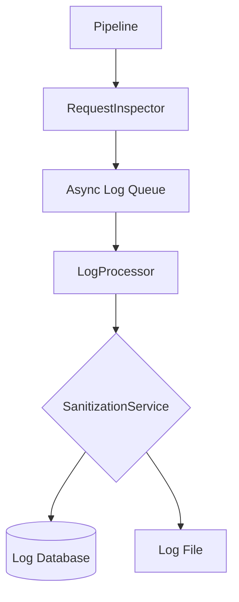

# LCS-DS-v0.18.4e-SEC: Design Specification — Request Inspection & Logging

## 1. Document Control

| Field                 | Value                                        |
| :-------------------- | :------------------------------------------- |
| **Document ID**       | LCS-DS-v0.18.4e-SEC                          |
| **Parent SBD**        | LCS-SBD-v0.18.4-SEC                          |
| **Release Version**   | v0.18.4e                                     |
| **Component Name**    | Request Inspection & Logging                 |
| **Document Type**     | Design Specification (DS)                    |
| **Author**            | Gemini Architect                             |
| **Created Date**      | 2026-02-04                                   |
| **Last Updated**      | 2026-02-04                                   |
| **Status**            | DRAFT                                        |
| **Classification**    | Internal — Technical Specification           |

---

## 2. Overview

This document provides the detailed design for the **Request Inspection & Logging** system (v0.18.4e). This component ensures that all outbound network traffic is logged for auditing, debugging, and forensic analysis. It emphasizes the *safe* logging of data, ensuring that tokens and sensitive PII are sanitized before storage.

---

## 3. Detailed Design

### 3.1. Objective

Provide comprehensive visibility into outbound network traffic while strictly protecting sensitive data from leaking into logs.

### 3.2. Scope

-   Define `IRequestInspector`.
-   Implement `SanitizationService` to scrub headers/bodies.
-   Support logging to multiple sinks (Console, File, DB, SIEM).
-   Capture timing metrics (Duration, Size).
-   Asynchronous processing to minimize impact on request latency.

### 3.3. Detailed Architecture

The inspector operates as a "Sink" at the end of the `OutboundRequestController` pipeline.



#### 3.3.1. Sanitization Logic

-   **Headers**: Whitelist approach preferred (Start with `Content-Type`, `User-Agent`). Redact known sensitive headers (`Authorization`, `X-Api-Key`, `Cookie`).
-   **Body**: Truncate large bodies (e.g., >4KB). Apply heuristic masking (Mask patterns looking like Credit Cards or SSNs).

### 3.4. Interfaces & Data Models

```csharp
/// <summary>
/// Inspects and logs outbound requests.
/// </summary>
public interface IRequestInspector
{
    Task LogRequestAsync(
        OutboundRequest request,
        SecureHttpResponse response,
        RequestSecurityContext context,
        CancellationToken ct = default);
}

public interface ISapitizationService
{
    Dictionary<string, string> SanitizeHeaders(IReadOnlyDictionary<string, string> headers);
    string SanitizeBody(byte[] body, string contentType);
}

public record NetworkLogEntry
{
    public Guid CorrelationId { get; init; }
    public DateTime Timestamp { get; init; }
    public string Method { get; init; }
    public string Url { get; init; }
    public int StatusCode { get; init; }
    public long DurationMs { get; init; }
    public string SourceService { get; init; }
    // Sanitized Data
    public Dictionary<string, string> Headers { get; init; }
    public string Snippet { get; init; } // Body snippet
}
```

### 3.5. Security Considerations

-   **Log Injection**: Ensure that CRLF or other control characters in headers/bodies are escaped to prevent log forging.
-   **Leakage**: The Sanitizer is the single point of failure. It must be unit tested with aggressively malicious examples.

### 3.6. Performance Considerations

-   **Async I/O**: Logging must happen off the hot path (e.g., via `Channel<T>`).
-   **Backpressure**: If the log queue fills up, drop logs rather than crashing the app (monitor drop rate).

### 3.7. Testing Strategy

-   **Sanitization**: Pass headers with `Authorization: Bearer <secret>` and assert output contains `Authorization: [REDACTED]`.
-   **Throughput**: Send 10k requests/sec and ensure application latency doesn't spike.

---

## 4. Key Artifacts & Deliverables

| Artifact                 | Description                                                              |
| :----------------------- | :----------------------------------------------------------------------- |
| `IRequestInspector`      | Core interface.                                                          |
| `SanitizationService`    | Logic for scrubbing data.                                                |
| `LogEntry`               | Schema for structured logs.                                              |

---

## 5. Acceptance Criteria

-   [ ] **Sanitization**: `Authorization` and `Cookie` headers are never logged in plaintext.
-   [ ] **Completeness**: All outbound requests generate a log entry.
-   [ ] **Performance**: Logging is asynchronous; no impact on request latency.
-   [ ] **Retention**: Logs include timestamp, source, and destination.
