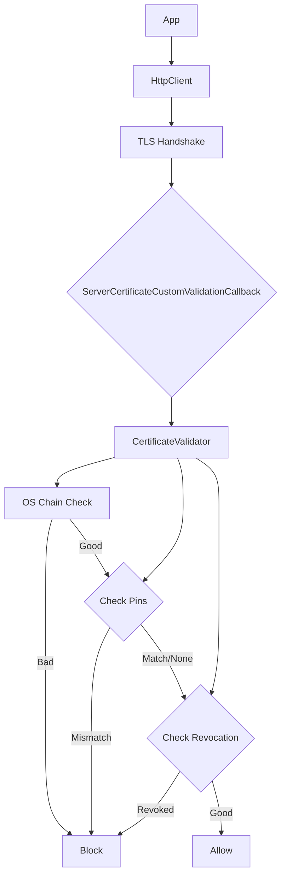

# LCS-DS-v0.18.4f-SEC: Design Specification — Certificate & TLS Validation

## 1. Document Control

| Field                 | Value                                        |
| :-------------------- | :------------------------------------------- |
| **Document ID**       | LCS-DS-v0.18.4f-SEC                          |
| **Parent SBD**        | LCS-SBD-v0.18.4-SEC                          |
| **Release Version**   | v0.18.4f                                     |
| **Component Name**    | Certificate & TLS Validation                 |
| **Document Type**     | Design Specification (DS)                    |
| **Author**            | Gemini Architect                             |
| **Created Date**      | 2026-02-04                                   |
| **Last Updated**      | 2026-02-04                                   |
| **Status**            | DRAFT                                        |
| **Classification**    | Internal — Technical Specification           |

---

## 2. Overview

This document provides the detailed design for the **Certificate & TLS Validation** system (v0.18.4f). This component hardens the transport layer security by enforcing strict certificate validation policies, including revocation checking and certificate pinning for critical endpoints, preventing Man-in-the-Middle (MITM) attacks.

---

## 3. Detailed Design

### 3.1. Objective

Ensure that the identity of external servers is cryptographically verified before transmitting any data.

### 3.2. Scope

-   Define `ICertificateValidator`.
-   Implement standard Chain Validation (OS-level).
-   Implement **Certificate Pinning** (HPKP-style logic in app).
-   Support Revocation Checks (OCSP/CRL).
-   Configurable policies per host (e.g., Strict for Payment Gateway, Lax for Dev).

### 3.3. Detailed Architecture

The validator hooks into the `HttpClientHandler` lifecycle.



#### 3.3.1. Pinning Strategy

-   **Public Key Pinning**: Pin the SPKI (Subject Public Key Info) hash, not the certificate leaf. This allows cert rotation as long as the key pair remains the same (or backup key is used).
-   **Backup Pins**: Always require at least one backup pin to prevent bricking the app during key compromise/rotation.

### 3.4. Interfaces & Data Models

```csharp
/// <summary>
/// Validates server certificates during Tls Handshake.
/// </summary>
public interface ICertificateValidator
{
    /// <summary>
    /// Validates a certificate.
    /// </summary>
    bool Validate(
        HttpRequestMessage request,
        X509Certificate2? cert,
        X509Chain? chain,
        SslPolicyErrors errors);
}

public record CertificatePolicy
{
    public HostPattern Host { get; init; }
    public bool EnforceRevocation { get; init; } = false;
    public IReadOnlyList<string> PinnedSpkiHashes { get; init; }
    public bool AllowSelfSigned { get; init; } = false;
}
```

### 3.5. Security Considerations

-   **Pinning Risks**: Hardcoded pins can cause outages if the server updates its certs unexpectedly.
    -   *Mitigation*: Use dynamic configuration for pins (if secure) or a rapid-update mechanism.
-   **Revocation Latency**: OCSP checks are network calls and might timeout.
    -   *Decision*: Use "Soft Fail" for OCSP by default (Log warning if unreachable), or "Hard Fail" for high-security endpoints.

### 3.6. Performance Considerations

-   **Caching**: OCSP responses are valid for a duration. Cache them to avoid lookup on every request.
-   **Handshake Overhead**: Pinning is fast (hashing). Revocation is slow. Use pinning preferred over revocation checks for known hosts.

### 3.7. Testing Strategy

-   **Bad Certs**: Use `badssl.com` endpoints to verify validation failures (Expired, Wrong Host, Self-signed).
-   **Pinning**: Setup a local https server, pin its key, then change the key and assert connection failure.

---

## 4. Key Artifacts & Deliverables

| Artifact                 | Description                                                              |
| :----------------------- | :----------------------------------------------------------------------- |
| `ICertificateValidator`  | Core interface.                                                          |
| `PinningService`         | Logic for SPKI hashing and matching.                                     |

---

## 5. Acceptance Criteria

-   [ ] **Validation**: Untrusted roots are rejected.
-   [ ] **Pinning**: Connections to pinned hosts fail if the key doesn't match.
-   [ ] **Config**: Can allow self-signed certs in Development environment only.
-   [ ] **Performance**: Validation adds <50ms overhead (excluding OCSP network time).
