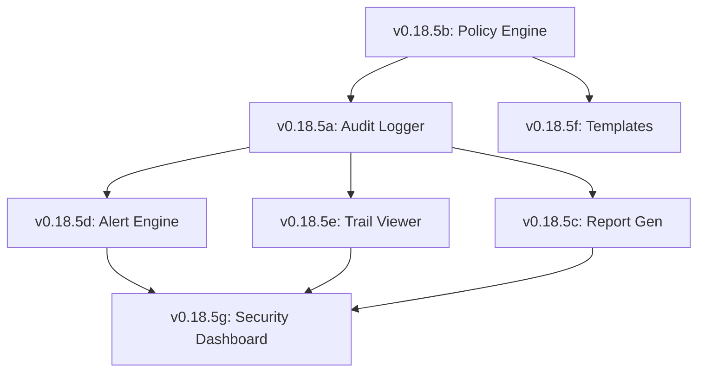

# Lexichord Design Specification Index: v0.18.5 — Audit & Compliance

**Parent Scope:** [LCS-SBD-v0.18.5-SEC.md](./LCS-SBD-v0.18.5-SEC.md)
**Module:** Audit & Compliance
**Status:** Design Phase Complete
**Last Updated:** 2026-02-04

---

## Overview

This index catalogs all design specifications for the v0.18.5 Audit & Compliance module. This release transforms Lexichord into an auditable, enterprise-grade platform capable of meeting SOC2, HIPAA, and GDPR requirements through immutable logging and automated reporting.

---

## Design Specification Documents

| Sub-Version | Document | Feature Name | Status |
|-------------|----------|--------------|--------|
| v0.18.5a | [LCS-DS-v0.18.5a-SEC.md](./LCS-DS-v0.18.5a-SEC.md) | Security Audit Logger | Complete |
| v0.18.5b | [LCS-DS-v0.18.5b-SEC.md](./LCS-DS-v0.18.5b-SEC.md) | Policy Engine & Enforcement | Complete |
| v0.18.5c | [LCS-DS-v0.18.5c-SEC.md](./LCS-DS-v0.18.5c-SEC.md) | Compliance Report Generator | Complete |
| v0.18.5d | [LCS-DS-v0.18.5d-SEC.md](./LCS-DS-v0.18.5d-SEC.md) | Security Alerts & Notifications | Complete |
| v0.18.5e | [LCS-DS-v0.18.5e-SEC.md](./LCS-DS-v0.18.5e-SEC.md) | Audit Trail Viewer | Complete |
| v0.18.5f | [LCS-DS-v0.18.5f-SEC.md](./LCS-DS-v0.18.5f-SEC.md) | Policy Templates & Import | Complete |
| v0.18.5g | [LCS-DS-v0.18.5g-SEC.md](./LCS-DS-v0.18.5g-SEC.md) | Security Dashboard | Complete |

---

## Dependency Graph

---

## Interfaces & Logic Summary

| Interface | Component | Responsibility |
|-----------|-----------|----------------|
| `ISecurityAuditLogger` | v0.18.5a | Immutable, high-throughput logging |
| `ISecurityPolicyEngine` | v0.18.5b | Evaluates complex access rules |
| `IComplianceReportGenerator`| v0.18.5c | Generates SOC2/HIPAA PDFs |
| `ISecurityAlertService` | v0.18.5d | Triggers PagerDuty/Slack |
| `IAuditTrailViewer` | v0.18.5e | Search API for huge logs |
| `ISecurityDashboard` | v0.18.5g | Real-time visual metrics |

---

## Implementation Order

1.  **Phase 1 (Data Foundation):** v0.18.5a (Logger)
2.  **Phase 2 (Logic):** v0.18.5b (Policy) → v0.18.5d (Alerts)
3.  **Phase 3 (User Tools):** v0.18.5e (Viewer) → v0.18.5f (Templates) 
4.  **Phase 4 (Reporting):** v0.18.5c (Reports) → v0.18.5g (Dashboard)

---

## Success Metrics

| Metric | Target |
|--------|--------|
| Log Throughput | >10k events/sec |
| Alert Latency | <100ms detection |
| Report Gen Time | <30s for SOC2 |
| Search Speed | <2s for 10M records |
