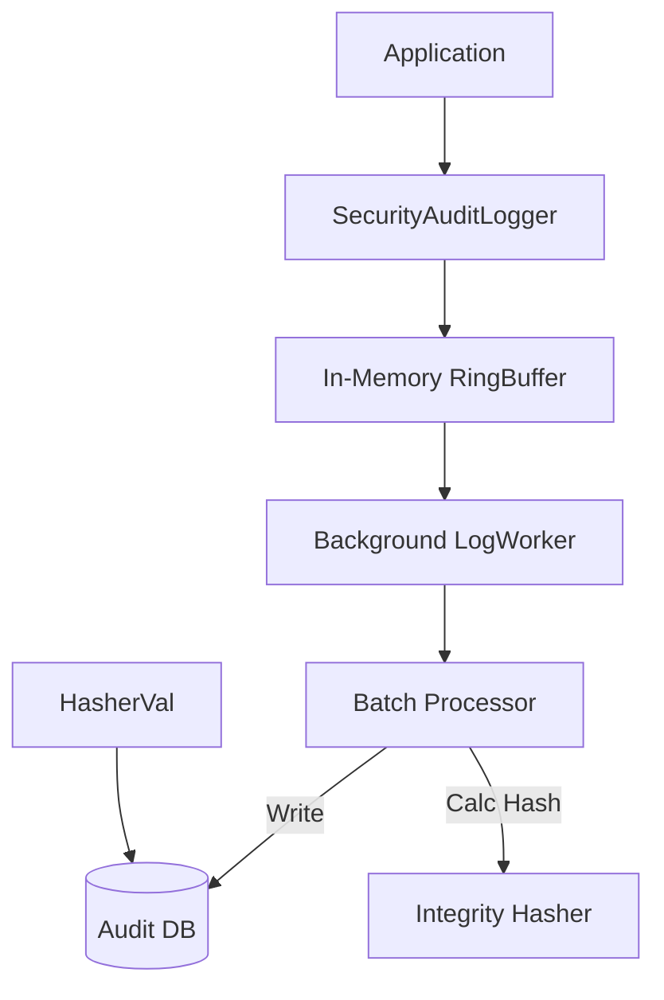

# LCS-DS-v0.18.5a-SEC: Design Specification — Security Audit Logger

## 1. Document Control

| Field                 | Value                                        |
| :-------------------- | :------------------------------------------- |
| **Document ID**       | LCS-DS-v0.18.5a-SEC                          |
| **Parent SBD**        | LCS-SBD-v0.18.5-SEC                          |
| **Release Version**   | v0.18.5a                                     |
| **Component Name**    | Security Audit Logger                        |
| **Document Type**     | Design Specification (DS)                    |
| **Author**            | Gemini Architect                             |
| **Created Date**      | 2026-02-04                                   |
| **Last Updated**      | 2026-02-04                                   |
| **Status**            | DRAFT                                        |
| **Classification**    | Internal — Technical Specification           |

---

## 2. Overview

This document provides the detailed design for the **Security Audit Logger** (v0.18.5a). This component is the backbone of the system's accountability framework. It provides a high-performance, tamper-evident logging mechanism for all security-relevant actions within the Lexichord platform, ensuring that every access, modification, and execution is recorded with precision and immutability.

---

## 3. Detailed Design

### 3.1. Objective

Implement a high-throughput logging service that persists security events in a structured, immutable format, suitable for compliance reporting and forensic analysis.

### 3.2. Scope

-   Define `ISecurityAuditLogger`.
-   Implement asynchronous buffering to ensure minimal impact on application latency.
-   Schema design for `audit_logs` table (PostgreSQL) with partitioning.
-   Implement **Anti-Tamper** mechanism (Checksums).
-   Support high-volume ingestion (target 10k events/sec).

### 3.3. Detailed Architecture

The logger uses a "Fire-and-Forget" + "Reliable Background Processing" hybrid model.



#### 3.3.1. Data Integrity

-   **Row Integrity**: Each row includes a `Checksum` column = `HMAC-SHA256(RowData + PreviousRow.Checksum)`. This creates a blockchain-like dependency, making tampering detectable.
-   **Partitioning**: Tables partitioned by `Timestamp` (Daily) to facilitate efficient archiving and querying.

### 3.4. Interfaces & Data Models

```csharp
/// <summary>
/// Core logging service for security events.
/// </summary>
public interface ISecurityAuditLogger
{
    Task LogEventAsync(SecurityEvent auditEvent, CancellationToken ct = default);
    Task LogEventsAsync(IEnumerable<SecurityEvent> events, CancellationToken ct = default);
    
    /// <summary>
    /// Verifies the cryptographic integrity of the log chain.
    /// </summary>
    Task<IntegrityResult> VerifyIntegrityAsync(DateTimeRange range, CancellationToken ct = default);
}

public record SecurityEvent
{
    public Guid EventId { get; init; } = Guid.NewGuid();
    public DateTime Timestamp { get; init; } = DateTime.UtcNow;
    public string ActorId { get; init; } // Who
    public string Action { get; init; } // Did What
    public string ResourceId { get; init; } // To What
    public string ResourceType { get; init; }
    public Outcome Status { get; init; } // Success/Failure/Denial
    public string ClientIp { get; init; }
    public IReadOnlyDictionary<string, string> Metadata { get; init; }
}

public enum Outcome { Success, Failure, Denied }
```

### 3.5. Security Considerations

-   **Log Injection**: Inputs must be sanitized to prevent SQL injection or log forging.
-   **Access Control**: The `audit_logs` table must be `INSERT/SELECT` only. `UPDATE/DELETE` must be revoked for the application user.

### 3.6. Performance Considerations

-   **Buffering**: Use `System.Threading.Channels` for producer-consumer pattern.
-   **Bulk Inserts**: Use `COPY` or Bulk Insert mechanisms (Entity Framework `BulkExtensions`).
-   **Indexing**: BRIN indexes on Timestamp for partitioned tables are efficient.

### 3.7. Testing Strategy

-   **Load Test**: Fire 100k events and measure time to drain buffer.
-   **Integrity Test**: Manually modify a DB row and assert `VerifyIntegrityAsync` fails.

---

## 4. Key Artifacts & Deliverables

| Artifact                 | Description                                                              |
| :----------------------- | :----------------------------------------------------------------------- |
| `SecurityAuditLogger`    | Implementation.                                                          |
| `AuditContext`           | EF Core Context for Audit DB.                                            |
| Migration Scripts        | SQL for Table Partitioning Setup.                                        |

---

## 5. Acceptance Criteria

-   [ ] **Latency**: `LogEventAsync` returns immediately (fire-and-forget logic).
-   [ ] **Throughput**: Can handle 10k ops/sec.
-   [ ] **Integrity**: Modification of old logs is detected by verification tool.
-   [ ] **Partitioning**: Data is correctly stored in partitions.
