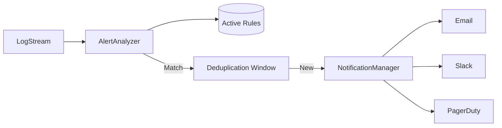

# LCS-DS-v0.18.5d-SEC: Design Specification — Security Alerts & Notifications

## 1. Document Control

| Field                 | Value                                        |
| :-------------------- | :------------------------------------------- |
| **Document ID**       | LCS-DS-v0.18.5d-SEC                          |
| **Parent SBD**        | LCS-SBD-v0.18.5-SEC                          |
| **Release Version**   | v0.18.5d                                     |
| **Component Name**    | Security Alerts & Notifications              |
| **Document Type**     | Design Specification (DS)                    |
| **Author**            | Gemini Architect                             |
| **Created Date**      | 2026-02-04                                   |
| **Last Updated**      | 2026-02-04                                   |
| **Status**            | DRAFT                                        |
| **Classification**    | Internal — Technical Specification           |

---

## 2. Overview

This document provides the detailed design for the **Security Alerts & Notifications** system (v0.18.5d). This component transforms raw audit logs into actionable intelligence, notifying security teams of potential threats in real-time.

---

## 3. Detailed Design

### 3.1. Objective

Detect anomalies and policy violations in real-time and ensure the right stakeholders are notified immediately.

### 3.2. Scope

-   Define `ISecurityAlertService`.
-   Implement Rule Engine (Thresholds, Patterns).
-   Support Multi-channel Notifications (Email, Slack, Webhooks).
-   Implement Alert Deduplication/Throttling.

### 3.3. Detailed Architecture



#### 3.3.1. Detection Logic

-   **Stateless**: match single event (e.g., "Deleted Prod DB").
-   **Stateful (Windowing)**: match count/rate (e.g., "5 failures in 1 min").
    -   *Impl*: Use sliding window counters (Redis or In-Memory).

### 3.4. Interfaces & Data Models

```csharp
public interface ISecurityAlertService
{
    Task CreateOrUpdateRuleAsync(AlertRule rule, CancellationToken ct = default);
    Task AcknowledgeAsync(string alertId, string user, CancellationToken ct = default);
}

public record AlertRule
{
    public string Id { get; init; }
    public string Name { get; init; }
    public string Query { get; init; } // DSL condition
    public int? Threshold { get; init; }
    public TimeSpan? Window { get; init; }
    public Severity Severity { get; init; }
    public IReadOnlyList<string> Channels { get; init; }
}

public interface INotificationChannel
{
    Task SendAsync(SecurityAlert alert);
}
```

### 3.5. Security Considerations

-   **Alert Fatigue**: Too many alerts cause users to ignore them.
    -   *Mitigation*: Default to aggressive deduplication. Implement "flapping" detection.
-   **Webhook Security**: Outbound webhooks must be signed (HMAC) so receivers can verify authenticity.

### 3.6. Performance Considerations

-   **Analysis Overhead**: Analysis happens async after logging to not slow down the critical path.
-   **Channel Latency**: Notifications are non-blocking.

### 3.7. Testing Strategy

-   **Thresholds**: Simulate 4 events (no alert) then 5th event (alert triggered).
-   **Channels**: Mock channel providers to verify dispatch logic.

---

## 4. Key Artifacts & Deliverables

| Artifact                 | Description                                                              |
| :----------------------- | :----------------------------------------------------------------------- |
| `AlertService`           | Core Logic.                                                              |
| `WindowingEngine`        | Counts events over time.                                                 |
| `SlackChannel`           | Integration.                                                             |

---

## 5. Acceptance Criteria

-   [ ] **Real-time**: Alerts triggered <1s after event.
-   [ ] **Dedupe**: Duplicate events within window are grouped into single alert.
-   [ ] **Channels**: Messages successfully delivered to configured targets.
