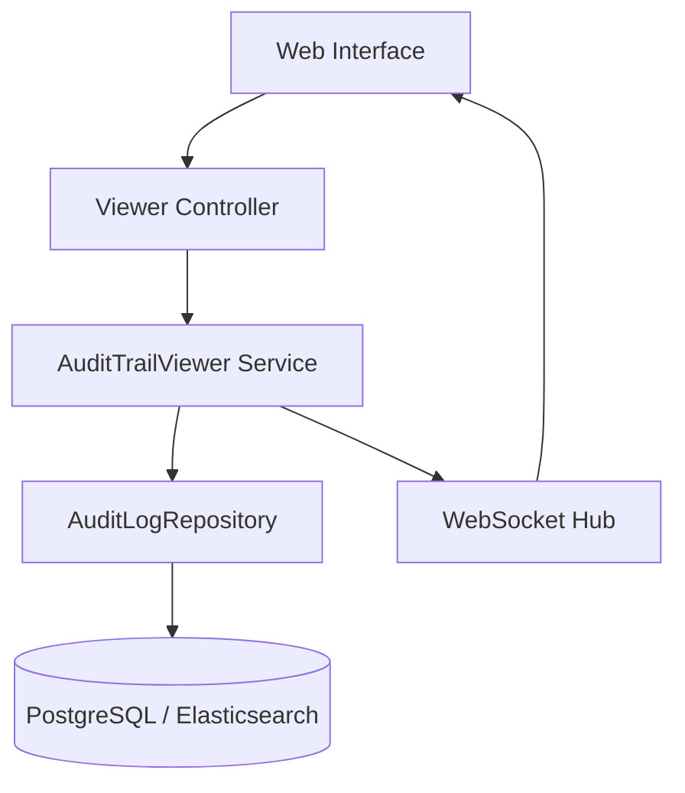

# LCS-DS-v0.18.5e-SEC: Design Specification — Audit Trail Viewer

## 1. Document Control

| Field                 | Value                                        |
| :-------------------- | :------------------------------------------- |
| **Document ID**       | LCS-DS-v0.18.5e-SEC                          |
| **Parent SBD**        | LCS-SBD-v0.18.5-SEC                          |
| **Release Version**   | v0.18.5e                                     |
| **Component Name**    | Audit Trail Viewer                           |
| **Document Type**     | Design Specification (DS)                    |
| **Author**            | Gemini Architect                             |
| **Created Date**      | 2026-02-04                                   |
| **Last Updated**      | 2026-02-04                                   |
| **Status**            | DRAFT                                        |
| **Classification**    | Internal — Technical Specification           |

---

## 2. Overview

This document provides the detailed design for the **Audit Trail Viewer** (v0.18.5e). This component provides the user interface and query API that allows administrators and compliance officers to interactively explore the audit logs collected by the system.

---

## 3. Detailed Design

### 3.1. Objective

Provide a responsive, intuitive interface for searching, filtering, and visualizing vast amounts of audit data.

### 3.2. Scope

-   Define `IAuditTrailViewer`.
-   Implement Advanced Search (Time, Actor, Action, Metadata).
-   Support Export (CSV/JSON).
-   Real-time Streaming (WebSocket tail).
-   Visual Timeline.

### 3.3. Detailed Architecture

The viewer relies on the `AuditLogRepository`'s efficiency.



#### 3.3.1. Query Optimization

-   **Backend**: If using PostgreSQL, leverage **GIN Indexes** for JSONB metadata searching.
-   **Pagination**: Use Keyset Pagination (Values < Last Seen) instead of Offset for deep page performance.

### 3.4. Interfaces & Data Models

```csharp
public interface IAuditTrailViewer
{
    Task<PagedResult<AuditLogEntry>> SearchAsync(AuditLogSearchQuery query, CancellationToken ct = default);
    
    IAsyncEnumerable<AuditLogEntry> StreamRealtimeAsync(AuditLogFilter filter, CancellationToken ct = default);
    
    Task<Stream> ExportAsync(AuditLogSearchQuery query, ExportFormat format, CancellationToken ct = default);
}

public record AuditLogSearchQuery
{
    public DateTime? Start { get; init; }
    public DateTime? End { get; init; }
    public string Actor { get; init; }
    public IReadOnlyList<string> Actions { get; init; }
    public string FullTextSearch { get; init; }
    public int Limit { get; init; }
}
```

### 3.5. Security Considerations

-   **Access Control**: Provide granular permissions. `Audit.Read` vs `Audit.FullRead` (seeing sensitive fields).
-   **Export Limits**: Prevent exporting the entire DB at once (DoS). Limit export rows (e.g., 100k).

### 3.6. Performance Considerations

-   **Search Latency**: Target <2s for p95.
-   **Streaming**: Use signal throttling if events > 50/sec per client.

### 3.7. Testing Strategy

-   **Search Correctness**: Insert known pattern, search for it, ensure found.
-   **Access**: Verify unauthorized user cannot query.

---

## 4. Key Artifacts & Deliverables

| Artifact                 | Description                                                              |
| :----------------------- | :----------------------------------------------------------------------- |
| `ViewerService`          | Core Logic.                                                              |
| `ExportService`          | CSV/JSON generation.                                                     |
| `AuditLogTable`          | React component.                                                         |

---

## 5. Acceptance Criteria

-   [ ] **Search**: Returns correct results for complex filter combinations.
-   [ ] **Speed**: Query returns <2s.
-   [ ] **Export**: Files are generated correctly.
-   [ ] **Streaming**: New events appear in UI immediately.
