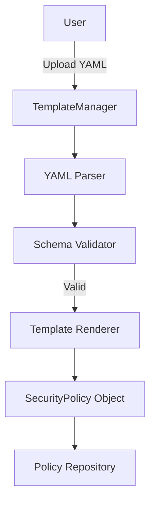

# LCS-DS-v0.18.5f-SEC: Design Specification — Policy Templates & Import

## 1. Document Control

| Field                 | Value                                        |
| :-------------------- | :------------------------------------------- |
| **Document ID**       | LCS-DS-v0.18.5f-SEC                          |
| **Parent SBD**        | LCS-SBD-v0.18.5-SEC                          |
| **Release Version**   | v0.18.5f                                     |
| **Component Name**    | Policy Templates & Import                    |
| **Document Type**     | Design Specification (DS)                    |
| **Author**            | Gemini Architect                             |
| **Created Date**      | 2026-02-04                                   |
| **Last Updated**      | 2026-02-04                                   |
| **Status**            | DRAFT                                        |
| **Classification**    | Internal — Technical Specification           |

---

## 2. Overview

This document provides the detailed design for the **Policy Templates & Import** system (v0.18.5f). This component improves the usability of the Policy Engine by providing "Infrastructure as Code" capabilities—allowing policies to be defined in YAML, templated, version-controlled, and imported in bulk.

---

## 3. Detailed Design

### 3.1. Objective

Simplify policy management by offering reusable templates and Git-friendly file formats.

### 3.2. Scope

-   Define `IPolicyTemplateManager`.
-   Implement YAML Import/Export.
-   Create standard Template Library (e.g., "MFA for Admins", "Read-Only Auditors").
-   Policy Diffing tool.

### 3.3. Detailed Architecture



#### 3.3.1. Template Syntax

Use **Liquid** or **Handlebars** syntax for variable substitution.

```yaml
# template: department-access.yaml
id: access-{{ department }}
rules:
  - condition: AND
    children:
      - field: user.department
        op: EQ
        value: {{ department }}
effect: ALLOW
```

### 3.4. Interfaces & Data Models

```csharp
public interface IPolicyTemplateManager
{
    Task<SecurityPolicy> CreateFromTemplateAsync(
        string templateId,
        IDictionary<string, object> variables,
        CancellationToken ct = default);

    Task<PolicyTemplate> ImportTemplateAsync(string yamlContent, CancellationToken ct = default);

    Task<string> ExportAsTemplateAsync(string policyId, CancellationToken ct = default);
    
    Task<TemplateValidationResult> ValidateAsync(string yamlContent, CancellationToken ct = default);
}

public record PolicyTemplate
{
    public string Id { get; init; }
    public string Description { get; init; }
    public string RawYaml { get; init; }
    public IReadOnlyList<string> RequiredVariables { get; init; }
}
```

### 3.5. Security Considerations

-   **Malicious Templates**: Templates might contain logic bombs or extremely complex rules (DoS).
    -   *Mitigation*: Validate template structure against strict schema. Limit nesting depth.

### 3.6. Performance Considerations

-   **Parsing**: Perform parsing on upload, store result.

### 3.7. Testing Strategy

-   **Round Trip**: Export Policy -> Import -> Assert Equal.
-   **Variables**: Ensure missing variables cause validation error.

---

## 4. Key Artifacts & Deliverables

| Artifact                 | Description                                                              |
| :----------------------- | :----------------------------------------------------------------------- |
| `PolicyTemplateManager`  | Logic.                                                                   |
| `StandardLibrary`        | Set of 15 default templates.                                             |
| `YamlSerializer`         | Helper.                                                                  |

---

## 5. Acceptance Criteria

-   [ ] **Parsing**: Correctly parses YAML.
-   [ ] **Substitution**: Variables are replaced correctly.
-   [ ] **Validation**: Invalid schema is rejected with errors.
